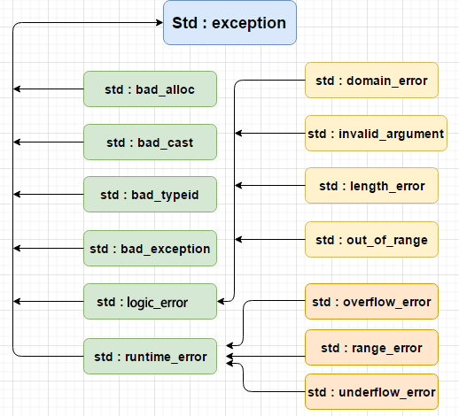

# Essential C++

[toc]


## 序

作者Stanley B Lippman除了计算机科学方面的学位，还有艺术硕士的头衔。所以联系迪士尼玩个票。

在迪士尼的工作，被要求48小时学会perl，于是找到了Randal Schwartz 的learning perl。由此也觉得自己写的C++ primer 写的太厚了，于是准备动手写个薄书。


## 一、C++编程基础 Basic C++ Programming


### 1、如何撰写C++程序 

**How to Write a C++ Program**

函数的参数列表（parameter list）

调用函数（call/invoke）

数据的输入与输出，并非c++程序语言本身定义的一部分（同c，参见K&R 第七章），而是由c++ 的一套面向对象的类层次体系（classes hierarchy）提供支持，并作为C++标准库的一员。

class机制，赋予了我们增加程序内置类型抽象化层次的能力。


#### class的定义

**头文件header file**

声明该class所提供的各种操作行为operation

**程序代码文件program text**

包含	了这些操作行为的实现内容implemention


语句是c++程序的最小独立单元 statement


#### 命名空间namespace

命名空间是一种将库名称封装起来的办法。通过这种方法，可以避免和应用程序发生命名冲突的问题（所谓命名冲突是指在应用程序内两个不同的实体entity具有相同的名称，导致程序无法区分二者，命名冲突发生时，程序必须等到该命名冲突获得解析resolve后，才得以继续执行）。

命名空间像是在诸多名称的可见范围之间竖起的一道道围墙。

### 2、对象的定义与初始化 

**Defining and Initializing a Date Object**

命名不能以数字开头，不能用到关键字

### 两种初始化

一般来说，将每个对象初始化是个好主意，除非类似input那种需要用户的输入加以设定。

初始化在c++有两种方式

```c++
int num_tries = 0;
int num_tries2(0);
```

用assignment（=）初始化，继承自c，如果对象属于内置类型或者对象可以单一值加以初始化，这种方式就没有问题，但如果对象需要多个初值，这种方法就没法完成任务了。所以就引入了处理“多值初始化”的构造函数初始化语法（constructor initialization syntax）

```c++
#include <complex>
complex<double>pure(0,7);
```

### 3、撰写表达式 

**Writing Expressions**

#### 前置prefix与后置postfix

前置：原值先递增或递减，之后才被拿出来使用

后置：原值先供给表达式运算，在递增或递减

翁恺老师建议使用prefix，因为后置运算符在运算时期需要拷贝构造，浪费资源（虽然也没什么）

### 运算符的优先级

| 符号类型   | 符号意义   |
| ---------- | ---------- |
| 逻辑运算符 | NOT        |
| 算术运算符 | *，/，%    |
| 算术运算符 | +，-       |
| 关系运算符 | <.>,<=,>=  |
| 关系运算符 | ==,!=      |
| 逻辑运算符 | AND,OR     |
| 赋值运算符 | assignment |

### 4、条件语句和循环语句 

**Writing Conditions and Loop Statements**

while

if-else

#### switch

switch 之后紧接着一个表达式，该表达式的值必须为整数值，之后跟着的一系列case之后都是一个常量表达式。

当某个标签和switch的表达式值吻合时，该case之后的所有case都会被执行，所以需要break来结束执行。

```c++
switch(num_tries)
{
    case 1:
        cout<<"your grade is A";
        break;
    case 2:
        cout<<"your grade is B";
        break;
    default:
        cout<<"your grade is not so good";
        break;
}
```

#### for

```c++
for（init-statement;condition;expresstion）{
    statement;
}             
```

### 5、数组与变长数组 

**How to Use Array and Vectors**

Array 定长，Vector可变长

### 6、指针带来弹性 

**Pointers Allow for Flexibility**

操作指针（代表某特定内存地址），舍弃以名称指定的方式，间接地访问每个对象，以达到透明化的目的。

```c++
int *p = &val;
//p就是val的内存地址
//*p就是操作val这个对象
```

**注意：要记得初始化每一个指针，并确保他们不是乱指的**

### 7、文件的读写 

**Writing and Reading Files**

```c++
#include <fstream>
ofstream outfile ("seq_data.txt",ios_base::app);
```

利用ios_base::app 以追加模式打开文件（app 代表append）

```c++
// EssentialC++.cpp : 此文件包含 "main" 函数。程序执行将在此处开始并结束。
//

#include <iostream>
#include<string>
#include<vector>
#include<algorithm>
#include <fstream>
using namespace std;

int main()
{
	ifstream in_file("text.t");
	if (!in_file)
	{
		cerr << "oops! unable to open input file\n"; return -1;
	}

	ofstream out_file("text.sort");
	if (!out_file)
	{
		cerr << "oops! unable to open output file\n"; return -2;
	}

	string word;
	vector< string > text;
	while (in_file >> word)
		text.push_back(word);

	int ix;
	cout << "unsorted text: \n";
	for (ix = 0; ix < text.size(); ++ix)
		cout << text[ix] << ' ';
	cout << endl;

	sort(text.begin(), text.end());
	cout << "sorted text: \n";
	for (ix = 0; ix < text.size(); ++ix)
		cout << text[ix] << ' ';
	cout << endl;
	out_file << "sorted text: \n";
	for (ix = 0; ix < text.size(); ++ix)
		out_file << text[ix] << ' ';
	out_file << endl;
	std::cout << "Hello World!\n";
	return 0;
    
}
```


## 二、面向过程的编程风格 Procedural Programming

### 1、如何编写函数 

**How to Write a Function**

#### 函数定义四部分

1. 返回类型：返回用户指定位置的值的类型
2. 函数名：命名要能帮助我们理解函数操作的实际内涵
3. 参数列表：函数参数扮演者占位符placeholder的角色
4. 函数体：操作本身的工具逻辑的实现内容

<font color='#DB4437'>函数必须先被声明，然后才能被调用</font>，以让编译器检查后续出现的使用方式是否正确，函数声明不必提供函数体，但必须指明返回类型、函数名，以及参数列表，此即所谓的函数原型function prototype

#### 考虑异常

不要相信用户绝不犯错，所以当他输入一个不合理的位置值，程序最极端的方式是终止整个程序，可以传一个值给标准库exit()

或者可以抛出异常exception -- 第七章

### 2、调用函数 

**Invoking a Function**

#### 传参方式

两种参数传递方式：**传址by reference和传值by value**

最简单的传址方式就是将参数声明为reference

**这里其实是传引用，而reference是用const *p实现的**，所以引用只可以绑定一次。

#### 作用域及范围

除了一个必要的static，函数内定义的对象，只存在于函数执行期间。如果返回这些所谓局部对象local object 的地址返回，会导致运行时错误。

为对象分配的内存，其存活时间称为存储器storage duration或范围extent。

对象在程序内的存活区域称为该对象的scope（作用域）

对象如果具有file scope，从其声明点至文件末尾都是可见的。file scope 内的对象也具备所谓的static extent。意思是对象的内存在main开始执行前就分配好了，可以一直存在直到程序结束。

内置类型的对象（void int这些），如果定义在file scope 之内，作为全局变量，必定被初始化为0，但如果被定义于local scope之内，那么除非程序员指定其初值，否则不会被初始化。

#### 动态内存管理

无论local scope 和file scope，其内存分配都是由系统操刀，而动态范围dynamic extent，其内存是来自于空闲空间free store。有时候也被称为heap memory，这种内存必须由c++程序员自己管理，分配new，删除delete。

C++没有提供任何语法让我们在从heap分配内存时设定初值。

> 链接：https://www.nowcoder.com/questionTerminal/678248be18a24a7cae301db0ef5c1c24
> 来源：牛客网
>
> \1) malloc 函数： void *malloc(unsigned int size)
>
> ​     在内存的动态分配区域中分配一个长度为size的连续空间，如果分配成功，则返回所分配内存空间的首地址，否则返回NULL，申请的内存不会进行初始化。
>
>  2）calloc 函数： void *calloc(unsigned int num, unsigned int size)
>
> ​     按照所给的数据个数和数据类型所占字节数，分配一个 num * size 连续的空间。
>
> ​    calloc申请内存空间后，会自动初始化内存空间为 0，但是malloc不会进行初始化，其内存空间存储的是一些随机数据。      
>  3）realloc 函数： void *realloc(void *ptr, unsigned int size)
>
> ​    动态分配一个长度为size的内存空间，并把内存空间的首地址赋值给ptr，把ptr内存空间调整为size。
>
> ​    申请的内存空间不会进行初始化。
> ​ 4）new是动态分配内存的运算符，自动计算需要分配的空间，在分配类类型的内存空间时，同时调用类的构造函数，对内存空间进行初始化，即完成类的初始化工作。动态分配内置类型是否自动初始化取决于变量定义的位置，在函数体外定义的变量都初始化为0，在函数体内定义的内置类型变量都不进行初始化。

如果程序员没有使用delete释放内存，就会造成内存泄漏memory leak。

### 3、提供默认参数值

**Providing Default Parameter Values**

我们不仅需要了解函数的工作逻辑，也得了解定义与file scope中的那些对象的工作逻辑。函数如果过于依赖于定义于file scope 内的对象，比较难以在其他环境中重用，也难以查找修改。

```c++
//这样输出可以通过传参，未必是cout，也可以设成文件
void display(const vector<int>&vec,ostream &os = cout){
    for (int ix = x;ix < vec.size();++ix){
        os << vec[ix]<< ' ';
    }
    os <<endl;
}
```

#### 默认参数两规则

关于默认参数值的提供，有两个不很直观的规则。

第一个规则是，默认值的解析resolve操作从最右边开始执行，如果我们为某个参数提供了默认值，那么这一参数右侧的所有参数都必须也具有默认参数值才行。下面这种不行。

~~void display(ostream &os = cout, const vector<int>&vec);~~

第二个规则是，默认值只能够指定一次，可以在函数声明处，也可以在函数定义处，但是不能够两个地方都指定。为了更高的可见性，我们决定将默认值，放在函数声明处而非定义处，一般会在**头文件里定义了参数的默认值**。

### 4、使用局部静态对象 

**Using Local Static Objects**

局部静态对象处的空间，即使在不同的函数调用过程中，依然持续存在。由此也可以安全地返回elems的地址。

### 5、声明inline 函数 

**Declaring a Function Inline**

将函数声明为inline，表示要求编译器在每个函数调用点上，将函数的内容展开。

面对一个inline函数，编译器可将该函数的调用操作改为以一份函数代码副本以代替。

> **定义**在类中的**成员函数**默认都是**内联的**，如果在类定义时就在类内给出函数定义，那当然最好。如果在类中未给出成员函数定义，而又想内联该函数的话，那在类外要加上 **inline**，否则就认为不是内联的。

注：将函数指定为inline，只是对编译器提出的一种要求，编译器是否执行这项请求，视具体的编译器而定。具体要参考bs老爷子的教材书7.1.1


一般来说，最适合声明为inline的函数是体积小，计算不复杂的函数。

另外由于编译器在调用inline的时候必须展开，所以这个定义必须是有效的。

### 6、提供重载函数 

**Providing Overloaded Functions**

我们可以通过传入不同类型甚至不同数量的参数，使有相同函数名的函数有着不同的效果。而相反的，编译器无法判断**返回类型**不同的同名函数。

### 7、定义并使用模板函数 

**Defining and Using Template Functions**

function template 将参数列表中指定的全部（或部分）参数的类型抽离了出来，除了类型信息。

```c++
template <typename elemType>
void display_message(const string &msg,const vector<elemType> &vec)
{
    cout <<msg;
    for (int ix = 0;ix<vec.size();++ix){
        elemType t = vec[ix];
        cout << t<<' ';
    }
}
```

很像种子，编译器对其进行绑定bind，产生一份函数实例进行后续的操作。

### 8、函数指针带来更大的弹性 

**Pointers to Functions Add Flexibility**

函数指针，其形式相当复杂。他必须指明其所指函数的返回类型及参数列表。

得注意(*seq_ptr)需要加括号，以及指针定义时需要指向空指针。

```c++
const vector<int>* (*seq_ptr)(int) = nullptr;
```

### 9、设定头文件 

**Setting Up a Header File**

函数的定义只有一份，不过可以有很多份声明。不过inline函数是个例外，为了能让在每个调用点，编译器都能取得他的定义，所以**一般将inline函数定义写在头文件里**。

在file scope 中定义的变量，如果可能被多个文件访问，那么就应该被声明在头文件中。

const object 的定义只要一出文件之外便不可见，声明前应该加上extern。


:star:头文件如果被认定为标准的或项目专属的头文件，我们就以**尖括号**将其框柱，编译器搜索此文件时，会先在某些默认的磁盘目录中寻找。

如果文件名由成对的**双引号扩住**，此文件便被认为是一个用户提供的头文件。搜索此文件时，会由要包括此文件的文件所在的磁盘目录开始找起。

## 三、泛型编程风格 Generic Programming

Standard Template Library （STL）主要由两种组件构成，一是容器（container），二是泛型算法（generic algorithm）

泛型算法，通过function template技术，达到与操作对象的类型相互独立的目的，而实现与容器无关的诀窍，就是不直接在容器身上进行操作。而是借由一对iterator（first，last），标识我们要进行迭代的元素范围。

### 1、指针的算术运算 

**The Arithmetic of Pointers**

```c++
template <typename elemType>
elemType* find ( const vector<elemType> &vec, 
           const elemType &value )
{
    for ( int ix = 0; ix < vec.size(); ++ix )
          if ( vec[ ix ] == value )
               return &vec[ ix ];

    return 0;
}
```

上面的函数可以处理任何类型下的找数工作。

但是现在如果想同时处理vector和array。就会遇到困难

但是如果我们能不指明array或vector，而是将他们的元素传入find函数。就能找到其中的共通解法。

```c++
int min(int array[24]) {...}
```

这里的min ，并不是只能接受某个最大长度为24的数组，而且是以传值方式传入。

事实上，当数组被传给函数，或是从函数中返回，**仅有第一个元素的地址会被传递。**

所以函数声明可以改成

```c++
int min(int *array) (...)
```

我们取得了**array 的首地址，事实就可以对其进行读取操作**，新的问题是我们从哪里停止，为了规范化，我们需要array 的长度，

对此有两种方式，一为直接将数组的size传入，二是将传入另一个地址，指示array读取操作的终点，我们将这个地址称为**标兵sentinel**。一般会是数组最后一个元素的下一个地址。

```c++
template <typename elemType>
elemType* find(const elemType* array, int size,
	const elemType& value);

template <typename elemType>
elemType* find(const elemType* array, const elemType *sentinel,
	const elemType& value);
```

这样array的整体 就从参数列表消失了，只留下了首地址。

我们虽然可以通过指针来访问array的元素，但是也可以改用subscript下标运算符。

array[2] 其实是*(array+2)，在取得元素的地址后，还需要提领dereference该地址，以得到元素值。不过我们只需要写下array[2],指针的算术运算以及提领都会自动进行。

```c++
template <typename elemType>
elemType* find( const elemType *array, int size, 
           const elemType &value )
{
	if ( ! array || size < 1 ) return 0;

   // ++array increments array by one elememt
   for ( int ix = 0; ix < size; ++ix, ++array )
         // *array dereferences the address
         if ( *array == value )
              return array;
   return 0;
}

template <typename elemType>
elemType* find( const elemType *first, 
           const elemType *last, const elemType &value )
{
	if ( ! first || ! last )
        return 0;

   // while first does not equal last,
   // compare value with element addressed by first 
   // if the two are equal, return first
   // otherwise, increment first to address next element

   for ( ; first != last; ++first )
         if ( *first == value )
              return first;

   return 0;
}
```

一般来说我们会将标兵设置为数组最后一个元素的下一个地址，也就是stl容器中常见的end()。将该地址拿来和其他元素的地址进行比较，那么就完全不会有问题，但是不能对这个地址（数组外）进行读写操作。

现在来处理vector，因为与array一样都是一块连续内存储存其全部元素，所以访问方式类似，但是vector可以是空的，Array则不然。

为此需要先判断vec是否为空。

```c++
template <typename elemType>
inline elemType* begin(const vector<elemType> &vec){
    return vec.empty() ? 0 : &vec[0];
}
inline elemType* end(const vector<elemType> &vec){
    return vec.empty() ? 0 : &vec[n];
}
find (begin(svec),end(svec),search_value);
```

现在我们想进一步将find 推广向list。但是link是一组指针互相链接linked，前向forward指针指向下一个next，后向backward指针指向上一个preceding。

乍一看我们似乎需要重写find，但是实际上除了参数表，我们的find并不需要改动太多。

而解决这个办法，就需要在底层指针的行为之上提供一层抽象，取代程序原本的指针直接操作。

### 2、了解Iterator（泛型指针） 

**Make sense of Iterators**

所有的标准容器都提供了begin()和end()，他们都会返回iterator，接下里介绍的对泛型指针的各种操作，

不过就是进行一系列赋值assign，比较compare，递增increment，提领dereference。

为了描述迭代器，我们需要明确两点，一是迭代对象的类型，这决定如何访问下一元素；二是迭代器所指对象的类型，这决定了iterator的返回值。

```c++
//可能的写法
iterator<vector,string> iter;
//STL里的iterator语法
vector<string>svec;
vector<string>::iterator iter = svec.begin();
```

此处iter被定义为一个iterator，指向一个vector， 后者的元素类型为string，其初值指向svec的第一个元素。双冒号:: 表示iterator是位于string vector 定义内的嵌套nested类型，第四章iteratorclass 会详细讲。

从iterator取值，可以用提领*，也可以用箭头。这样就用iterator取代了原先使用得下标，

用iterator代替下标的display函数：

```c++
template <typename elemType>
void display(const vector<elemType> &vec, ostream &os)
{
 vector<elemType>::const_iterator iter = vec.begin();
 vector<elemType>::const_iterator end_it = vec.end();
 // if vec is empty, iter and end_it are equal
 // and the for-loop never executes
 for (; iter != end_it; ++iter)
 	os << *iter << ' ';
 os << endl;
} 
```

现在我们更新find函数

```c++
template <typename IteratorType, typename elemType > 
IteratorType 
find(IteratorType first, IteratorType last, 
 	const elemType &value) 
{ 
 for (; first != last; ++first) 
 	if (value == *first) 
		return first; 
 return last; 
} 
```

### :star:泛型算法 

参见附录

| 算法类型                                | 算法名                                                       |
| --------------------------------------- | ------------------------------------------------------------ |
| 搜索 search                             | find(),count(),adjacent_find(),find_if(),count_if(),binary_search(),find_first_of() |
| 排序 sort以及 次序整理ordering          | merge(),partial_sort(),partition(),random_shuffle(),reverse(),rotate(),sort() |
| 复制copy 删除deletion 替换 substitution | copy(),remove(),remove_if(),replace(),replace_if(),swap(),unique() |
| 关系 relational                         | equal(),includes(),mismatch()                                |
| 生成generation 质变 mutation            | fill(),for_each(),generate(),transform()                     |
| 数值 numeric                            | accmulate(),adjacent_difference(),partial_sum(),inner_product() |
| 集合 set                                | set_union(),set_difference()                                 |

### 3、所有容器的共通操作 

**Operations Common to All Containers**

- equality(==) 以及 inequality (!=) 返回true和false
- assignment(=) 将某个容器赋值给另一个容器
- empty ()
- size()
- clear()
- begin()
- end()
- insert()
- erase()

insert()和erase()的行为视容器本身为顺序性sequential容器或关联associative容器而有所不同。

### 4、使用顺序性容器 

**Using the Sequential Containers**

Vector 方便顺序读写，不方便删除插入

list 方便删除插入，不方便顺序读写

deque 双端队列，类似vector，但是在最前端和最末端的插入删除效率更高。 标准库的queue就是用deque实现的

#### 一些操作函数：

push_back(),pop_back()

list和deque还有 push_front(),pop_front()

front() end() 

### 5、使用泛型算法

需要包含对应的algorithm头文件。

#### 泛型搜索

1. find()  搜索无序集合中是否存在某值，iterator[first,last)
2. binary_search() 用于有序集合的搜索
3. count() 返回数目相符的元素数目
4. search()  某个容器内是否存在某个子序列，若在，返回子序列起始处，若不在，就返回iterator指向末尾

### 6、如何设计一个泛型算法 

**How to Design a Generic Algorithm**

#### 将比较函数参数化

```c++
// EssentialC++.cpp : 此文件包含 "main" 函数。程序执行将在此处开始并结束。
//

#include <iostream>
#include<vector>
#include<algorithm>
using namespace std;
bool less_than(int v1, int v2)
{
	return v1 < v2 ? true : false;
}
bool greater_than(int v1, int v2)
{
	return v1 > v2 ? true : false;
}

vector<int> filter(const vector<int>& vec, int filter_value, bool (*pred)(int, int))//传入函数指针
{
	vector<int> nvec;
	for (int ix = 0; ix < vec.size(); ++ix)
		// invokes the function addressed by pred 
		// tests element vec[ix] against filter_value 
		if (pred(vec[ix], filter_value))
			nvec.push_back(vec[ix]);
	return nvec;
}


int main()

{
	vector<int> big_vec = {1,89,45,4,3,6,59,45,23,48};
	int value=30;
	// ... fill big_vec and value 
	vector<int> lt_10 = filter(big_vec, value, less_than);
	for (auto it : lt_10) {
		cout << it << " ";
	}
	cout << endl;
	vector<int> lt_102 = filter(big_vec, value, greater_than);
	for (auto it2 : lt_102) {
		cout << it2 << " ";
	}
	return 0;
    
}

/*
1 4 3 6 23
89 45 59 45 48
*/
```

#### Function Object  实例对象

这些function object 是某种class的实例对象，这类class对function call运算符做了重载操作，如此可以使Function object被当成一般函数来使用。

> 函数调用运算符 () 可以被重载用于类的对象。当重载 () 时，您不是创造了一种新的调用函数的方式，相反地，这是创建一个可以传递任意数目参数的运算符函数。


#### :sunny:**仿函数由来**

> https://zhuanlan.zhihu.com/p/362323211
>
> 我们都知道，函数的入参除了是普通变量之外，还可以是函数指针（C 语言中就经常这么用）。那有没有什么手段能代替函数指针呢？答案是有。
>
> - **定义一个类，类里面定义了某个方法，将该类的对象作为函数的入参，那么在函数中就能调用这个类中的方法**
>
> 还有更简单的方法吗？答案还是有。
>
> - **定义一个类，类里面重载函数运算符（），将该类的对象作为函数的入参，那么在函数中同样能调用重载符（）里面的方法**
>
>   > 运算符重载本质上是函数的的重载，重载运算符函数的一般格式为：
>   >
>   > ```c++
>   > 返回类型 operator 符号（参数表（根据操作符的操作数来写））
>   > {
>   >     重载函数体
>   > }
>   > ```
>   >
>   > 不能重载的运算符：.           *        ::      ?:     sizeof
>   >
>   > 运算符重载的两种形式：成员运算符函数；友元运算符函数
>   >
>   > ​	友元主要是为了方便访问类里的一些变量。（在类里 friend）
>
> **所以说，仿函数就是仿造的函数，它并不是一个真正意义上的函数。它是一个类中的运算符（）重载，但它具有函数的功能。**
>
> **样例代码**
>
> ```cpp
> #include <iostream>
> 
> class Compare {
> private:
>     int m_Number;
> public:
>     Compare(int num) : m_Number(num){}
>     
>     bool operator()(int other)
>     {
>         return m_Number > other;
>     }
> 
> };
> 
> int main()
> {
>     Compare cmp(10);
>     std::cout << cmp(11) << std::endl;
>     std::cout << cmp(9) << std::endl;
>     std::cin.get();
>     return 0;
> }
> ```
>
> **总结**
>
> 函数对象的出现是为了代替函数指针的，最明显的一个特点是：可以使用内联函数。而如果使用内联函数的指针，编译器会把它当普通函数对待。另外，函数对象是类封装的，代码不但看起来简洁，设计也灵活，比如还可以用关联，聚合，依赖的类之间的关系，与用到他们的类组合在一起，这样有利于资源的管理（这点可能是它相对于函数最显著的优点了）。
>
> 说到这，大家是不是对仿函数有了很清晰的认识了。**每个新事物的诞生都有它的原因，我们更应该去关注这个新事物出现的原因，而不仅仅是它本身。**
>
> 另外值得注意的是，仿函数（Functor）也是 STL 六大模块之一，其余 5 个分别是容器（Container）、算法（Algorithm）、迭代器（Iterator）、适配器（Adapter）和分配器（Allocator）。


使用Function Object主要是为了效率，我们令call 运算符变成inline，从而消除“通过函数指针来调用函数”时需要付出的代价。

标准库实现定义了一系列的Function object，需包含#include<functional>头文件

| Functional object 类 | 实际操作                                                     |
| -------------------- | ------------------------------------------------------------ |
| 6算术运算            | plus<type>(后面默认带<type>),minus,negate,nultiplies,divides,modules |
| 6关系运算            | less,less_equal,greater,greater_equal,equal_to,no_equal_to   |
| 3逻辑运算            | logical_and,logical_or,logical_not                           |

利用这一个我们可以写排序函数为

```c++
sort(lt_102.begin(), lt_102.end(), greater<int>());
```

#### Function Object Adapter

less<type>期待外界传入两个值，在上面的例子中，我们希望固定一个值，而这个固定的值是我们传入的值设置的。所以我们就需要将less<type>转化为一元unary运算符。

Function object adapter 会对Function Object进行修改操作，所谓binder adapter（绑定适配器），会将Function object 的参数绑定至特定值。标准库提供了bind1st和bind2nd 绑定至第一或第二操作数。

```c++
vector<int> filter(const vector<int> &vec, 
 int val, less<int> &lt) 
{ 
 	vector<int> nvec; 
 	vector<int>::const_iterator iter = vec.begin(); 
 // bind2nd(less<int>, val) 
 // binds val to the second value of less<int> 
 // less<int> now compares each value against val 
 	while ((iter = find_if(iter, vec.end(), bind2nd(lt, val))) != vec.end()) 
 	{ 
        // each time iter != vec.end(), 
 		// iter addresses an element less than val 
 		nvec.push_back(*iter); 
 		iter++; 
 	} 
 return nvec; 
} 

```

接下来为了消除filter()与vector元素类型、容器类型的依赖关系，使其泛型化。

```c++
template <typename InputIterator, typename OutputIterator, typename ElemType, typename Comp>
OutputIterator
filter(InputIterator first, InputIterator last,
	OutputIterator at, const ElemType& val, Comp pred)
{
	while ((first =
		find_if(first, last,
			bind2nd(pred, val))) != last)
	{
		// just to see what is going on ... 
		cout << "found value: " << *first << endl;
		// assign value, then advance both iterators 
		*at++ = *first++;
	}
	return at;
}
```

测试代码：

```c++
#include <iostream>
#include<vector>
#include<algorithm>
#include<functional>
using namespace std;

template <typename InputIterator, typename OutputIterator,
	typename ElemType, typename Comp>
	OutputIterator filter(InputIterator first, InputIterator last,OutputIterator at, const ElemType& val, Comp pred)
{
	while ((first =find_if(first, last,bind2nd(pred, val))) != last)
	{
		// just to see what is going on ... 
		cout << "found value: " << *first << endl;
		// assign value, then advance both iterators 
		*at++ = *first++;
	}
	return at;
}
int main()
{
	const int elem_size = 8;
	int ia[elem_size] = { 12, 8, 43, 0, 6, 21, 3, 7 };
	vector<int> ivec(ia, ia + elem_size); //快速生成vector
	// containers to hold the results of our filter() 
	int ia2[elem_size];
	vector<int> ivec2(elem_size);
	cout << "filtering integer array for values less than 8\n";
	filter(ia, ia + elem_size, ia2, elem_size, less<int>());
	cout << "filtering integer vector for values greater than 8\n";
	filter(ivec.begin(), ivec.end(), ivec2.begin(),elem_size, greater<int>());
	return 0;
}
/*
filtering integer array for values less than 8
found value: 0
found value: 6
found value: 3
found value: 7
filtering integer vector for values greater than 8
found value: 12
found value: 43
found value: 21
*/
```

另一种adapter 是所谓的**negator** ，他会将function object 的真伪值取反，not1对unary Function Object的真伪值取反， not2 可以对binary function object的真伪值取反。

比如可以通过对less<int>() 绑定negator，实现>= 的效果。

```c++
while ((iter = find_if(iter, vec.end(), not1(bind2nd(less<int>, 10)))) != vec.end()) 
```

### 7、使用Map 

**Using a Map**

键值对 key-value

### 8、使用Set 

**Using a Set**

集合 不重复 

默认情况下，set元素按照less-than进行排列

```c++
int ia[10] = { 1, 3, 5, 8, 5, 3, 1, 5, 8, 1 } ; 
vector<int> vec(ia, ia+10); 
set<int> iset(vec.begin(), vec.end()); 
```

iset are {1,3,5,8}. 

### 9、如何使用Iterator Inserter 

**How to Use Iterator Insertors**

之前我们主要是讨论从源端将符合条件的元素赋值到目的端，那么目的端的容器必须保证足够大。但是如果将目的端开的大小与源端大小一致，就会造成大量的资源浪费。

算法库对所有在容器上的操作有个承诺：决不修改容器的大小（不插入、不删除）。有了插入迭代器，既使得算法库可以通过迭代器对容器插入新的元素，又不违反这一承诺，即保持了设计上的一致性。

标准库提供了三个所谓的insertion adapter，让我们避免使用容器的assignment符。**变赋值为插入**，欲使用之，需要使用#include<iterator>

- back_inserter()  会以容器的push_back()取代assignment运算符
- inserter() 会以容器的insert()取代assignment运算符；接受两个参数，一个是容器，另一个是容器的插入操作起点。
- front_inserter() 会以容器的push_front()取代assignment运算符  这个inserter只适用于list 和 deque

并不支持array，array不支持元素插入操作。

改进后

```c++
#include <iostream>
#include<vector>
#include<algorithm>
#include<functional>
#include<iterator>
using namespace std;

template <typename InputIterator, typename OutputIterator,
	typename ElemType, typename Comp>
	OutputIterator filter(InputIterator first, InputIterator last,
		OutputIterator at, const ElemType& val, Comp pred)
{
	while ((first =
		find_if(first, last,
			bind2nd(pred, val))) != last)
	{
		// just to see what is going on ... 
		cout << "found value: " << *first << endl;
		// assign value, then advance both iterators 
		*at++ = *first++;
	}
	return at;
}
int main()
{
	const int elem_size = 8;
	int ia[elem_size] = { 12, 8, 43, 0, 6, 21, 3, 7 };
	vector<int> ivec(ia, ia + elem_size);
	// containers to hold the results of our filter() 
	int ia2[elem_size];
	vector<int> ivec2(elem_size);
	cout << "filtering integer array for values less than 8\n";
	filter(ia, ia + elem_size, ia2, elem_size, less<int>());
	cout << "filtering integer vector for values greater than 8\n";
	filter(ivec.begin(), ivec.end(), back_inserter(ivec2), //这里改成了it inserter
		elem_size, greater<int>());
	return 0;
}
```


### 10、使用 iostream Iterator

标准库定义供输入输出使用得iostream iterator类。 要用也得包含#include<iterator>

从标准输入设备中读取一串string，将他们存入vector，排序，再写回标准输出设备。

```c++
#include <iostream> 
#include <iterator> 
#include <algorithm> 
#include <vector> 
#include <string> 
using namespace std;
int main()
{
	istream_iterator<string> is(cin);
	istream_iterator<string> eof;
	vector<string> text;
	copy(is, eof, back_inserter(text));
	sort(text.begin(), text.end());
	ostream_iterator<string> os(cout, " ");
	copy(text.begin(), text.end(), os);
}
//Ctrl + Z + Enter , 表示输入结束
```


如果想读写文件，也可以让iostream iterator与之绑定

```c++
#include <iostream> 
#include <fstream> 
#include <iterator> 
#include <algorithm> 
#include <vector> 
#include <string> 
using namespace std;
int main()
{
	ifstream in_file("sourcefile.pp");
	//ifstream in_file("as_you_like_it.txt");
	//ofstream out_file("as_you_like_it_sorted.txt");
	ofstream out_file("as_you_like_it_sorted.txt");
	if (!in_file || !out_file)
	{
		cerr << "!!unable to open the necessary files.\n";
		return -1;
	}
	istream_iterator<string> is(in_file);
	istream_iterator<string> eof;
	vector<string> text;
	copy(is, eof, back_inserter(text));
	sort(text.begin(), text.end());
	ostream_iterator<string> os(out_file, "\n");
	copy(text.begin(), text.end(), os);
	return 0;
}
/*
----source.txt
hello world
what a beautiful day
周杰伦第一
abcdefg
----output
a
abcdefg
beautiful
day
hello
what
world
周杰伦第一
*/
//有些问题，不知道是不是后缀名的问题
```


### 个人本章总结

第三章读起来比起前面吃力的多，泛型这部分是翁恺老师的oop讲的也不多的部分。

这里SBL的教学一直体现着某种程序员**write once,run everywhere**的感觉，之所以用iterator，也是希望用更加安全的方式操作内存空间，以及统一一些共通操作，可以进行进行某种重写迭代，套用进模版里。

比如说用插入代替赋值就是利用原本模板就有的操作。**todo**：我思考了很久为什么要用插入代替赋值，除了可以用现成的容器函数以外，还真没想到别的。

但是个人直觉感觉这部分很重要，值得花精力来读，一方面是STL这个c++很重要的组成部分应该都是用泛型写的。另外这部分与类、继承、重载等牵扯很深。

可能需要把这本书啃完，对于泛型也只能说是堪堪入门，估计要把EC和MEC都看完，加上侯捷的STL剖析以及C++标准库才行。

慢慢来吧。


## 四、基于对象的编程风格 Object-Based Programming

这一章我们会自己实现自己的class

class 名称会被视为一个类型type名称。

每个class都会提供一组操作函数，让我们作用于其object上，这些操作函数包括具名函数，和重载运算符。

身为class的用户，只能访问其公开接口，在使用这个类的时候忽略其实现细节。

### 1、如何实现一个Class 

**How to Implement a Class**

**abstraction抽象   类似DS中的 Abstract Data Type ADT抽象数据类型**

#### Class定义

由两部分组成，其一是class的声明，其二是紧接在声明之后的主体。主体部分由一对大括号扩住，并以分号结尾。主体内的两个关键字public和private 标识每个块的成员访问权限，public member在程序任何部分被访问，但是private member只能在成员函数（类内部）以及class friend 内被访问。

#### 成员函数声明

所有成员函数都必须在class主体内进行声明，

如果在class之内定义，这个成员变量会被自动视为inline函数，要是在class 主体外定义成员变量，必须使用特殊语法如stack::pop(string &elem)，目的在于分辨该函数属于哪一个class。如果想要让它内联，得加inline。

对于inline 函数而言，定义在class主体内或主体外，没有什么区别，然而它应该被放在头文件中。

### 2、什么是构造函数和析构函数 

**What Are Class Constructors and the Class Destructor?**

#### 构造函数

为编译器提供的初始化函数

constructor 的函数名称必须与class 名称相同，不应指定返回类型，也不用返回任何值，它可以被重载（一个类多个构造函数），在定义class object定义出来后，编译器就自动根据获得的参数，挑选出应该被调用的constructor。

```c++
class Triangular { 
public: 
 // overloaded set of constructors 
 Triangular(); // default constructor 
 Triangular(int len); 
 Triangular(int len, int beg_pos); 
 // ... 
}; 

这里我们使用Triangular t;就会调用默认构造函数；
如果用 Triangular t2 = 8; 会调用constructor而不是assignment operator。会调用带有单一参数的constructor。
**Triangular t3(); 这不是一个正常的构造函数，这里会将t3定义为一个函数，其参数列表为空，返回Triangular 类
```

默认构造函数又可以分为两类，一是不接受任何参数，二是为每个参数设置默认值。

##### 成员初始化列表 

##### Member Initialization List

成员初始化列表紧接着参数列表最后的冒号后面，是以逗号分隔的列表。其中，欲赋值给member的数值被放在member名称后面的小括号中，使他们看起来像是调用constructor。主要用于将参数传给类成员对象的构造函数。

##### 成员逐一初始化 

##### Memberwise Initialization

classname tri2 = tri1;

会将class data member依次复制，但是有一点需要注意，即如果类成员如果有指针，也会被一同复制过去，这样两个指针都会指向heap的一块内存，这样当其中一个class 的析构函数发挥作用时，另一的指针还指在那个位置。

为了解决这个问题，我们需要改变这种“逐一初始化”的行为模式，为这个类自己设计一个copy constructor。

#### 析构函数

一旦某个class提供有destructor，当其对象结束生命时，就会自动调用destructor处理后事，主要用来释放在构造以及对象生命周期中分配的资源。

Destructor的名称有严格规定，class前面加上~，它绝对不会有返回值，也没有任何参数，由于参数列表为空，也绝不可能被重载。

析构函数并非必须，如果数据成员以储值方式存放，那么就会自动释放。事实上，C++一大问题就是何时定义析构函数，何时不需要。

> 如果未定义析构函数，编译器将提供默认的析构函数;对于许多类，这已经足够了。 类仅当类存储需要释放的系统资源的句柄或拥有它们指向的内存的指针时，才需要定义自定义析构函数。

### 3、何谓mutable可变和const不变 

**What Are mutable and const?**

const 参数，编译器就必须保证trian在函数中不会被修改。那么就需要在成员函数中标注const。

const修饰符紧接于函数参数列表之后，凡是在class主体以外定义者，如果它是一个const member Function，那就必须在声明和定义中同时制定const。

mutable 可以在const变量时依旧标注某些值是可变的。此关键字只能应用于类的非静态和非常量数据成员。 如果声明 **`mutable`**数据成员，则从 **`const`** 成员函数向此数据成员赋值是合法的。

### 4、什么是this指针 

**what is the this Pointers？**

this指针系在成员函数内用来指向其调用者（一个对象）。内部工作中，编译器自动将this指针，加到每一个member Function的参数列表。

```c++
the two class objects are not the same. To do this, we again use the this pointer: 
Triangular& Triangular:: 
copy(const Triangular &rhs) 
{ 
 // check that the two objects are not the same 
 if (this != &rhs) 
 	{ 
	 _length = rhs._length; 
 	 _beg_pos = rhs._beg_pos; 
 	 _next = rhs._beg_pos-1; 
 	} 
    return *this;
}

```

### 5、静态类成员 

**Static Class Members**

#### 	静态数据成员

- 用关键词static声明
- 为该类所有对象共享，静态数据成员具有静态生存期
- 必须在类外定义和初始化，用::来指明所属的类

局部静态变量的生存期和程序的运行时间相同。可以看做是所有类对象可以共同访问的一般对象，所以一般用于统计对象个数等类似的功能。

#### 	静态成员函数

​	在还是成员函数的情况下，用对象名.函数的方式调用。当他变成静态成员函数之后，那么就支持另一种（之前的也支持）调用方式，Classname::函数名();

​	在静态函数中只能包含静态变量。因为在生成对象之前就已经有静态成员了。

```c++
#include <iostream>
using namespace std;
class Point2D {
private:
    int x;
    int y;
    static int count;
public:
    Point2D(int xval = 0, int yval = 0)
        :x(xval), y(yval)
    {
        count++;
    }
    ~Point2D() { count--; }
    int getX() { return x; }
    int getY() { return y; }
    static void showCount() {
        cout << "  object count = " << count << endl;
    }
};
int Point2D::count = 0;
int main()
{
    Point2D::showCount();//在生成类之前就可以被调用
    Point2D m(3, 4);
    Point2D n(12, 13);
    cout << m.getX() << endl;
    n.showCount();
    Point2D::showCount();
    return 0;
}
```

### 6、打造一个Iterator Class 

**Building an Iterator Class**

#### 类中运算符重载

```c++
class Triangular_iterator 
{ 
public: 
// set _index to index-1 in order not to subtract 1 with 
// each element access ... 
 	Triangular_iterator(int index) : _index(index-1){} 
 	bool operator==(const Triangular_iterator&) const; 
 	bool operator!=(const Triangular_iterator&) const; 
 	int operator*() const; 
 	int& operator++(); // prefix version 
 	int operator++(int); // postfix version 
private: 
 void check_integrity() const; 
 int _index; 
}; 
```

#### 运算符重载的规则

- 不可以引入新的运算符，除了. .* :: ?: 其他的运算符都可以被重载
- 运算符的操作数operand个数不可改变
- 运算符的优先级不可改变
- 运算符函数的参数列表中，必须至少有一个参数为class类型。也就是说我们无法为诸如指针之类的non-class类型，重写定义其原已存在的运算符，当然更无法为他引进新运算符。

**【越来越感觉c++就像一个固定接口无限外挂的乐高玩具了，就好像一个海盗船船身有几个孔位，你可以在里面放大炮，船桨，你要是有本事放龙翅膀都行】**

#### 嵌套类型 Nested Type

typedef 可以为某个类型设定另一个不同的名称，其通用形式为

​	typedef existing_type new_name;


### 7、合作关系必须建立在友谊的基础上 

**Collaboration Sometimes Requires Friendship**

任何class都可以将其他Function 或 class 指定为友元。所谓friend， 具备了类成员函数相同的访问权限。可以访问private member。

#### :star::star:public/private/protected/friend的具体区别

> 对象应该是封装起来的，外界触摸到的应该只是函数.
> 在说明这四个关键字之前，就class之间的关系做一个简单的定义，对于继承自己的class，base class可以认为他们都是自己的子女，而对于和自己一个目录下的classes，认为都是自己的朋友。
>
> 1. public：public表明该数据成员、成员函数是对所有用户开放的，所有用户都可以直接进行调用
>
> 2. private：private表示私有，私有的意思就是除了class自己之外，任何人都不可以直接使用，私有财产神圣不可侵犯嘛，即便是子女，朋友，都不可以使用。
>
>    ​	:star:**private是对类来说的，而不是对对象**，
>
>    ​	**private的检查仅仅在编译时刻，在运行时也有可能让你进入别的内存。**
>
>    ​	**C++的OOP仅存在于编译，他生成的.o和c、汇编生成的一样。**
>
> 3. protected：protected对于子女、朋友来说，就是public的，可以自由使用，没有任何限制，而对于其他的外部class，protected就变成private。
>
> 4. friend: 类的友元函数是定义在类外部，但有权访问类的所有私有（private）成员和保护（protected）成员。尽管友元函数的原型有在类的定义中出现过，但是友元函数并不是成员函数(没有this指针)。
>
>    #### 继承的权限规则
>
> > public、protected 和 private 子类都不能访问父类的 private 成员
> >
> > public 作用域下，父类的 public 成员会被继承为 public，父类的 protected 成员会被继承为 protected
> >
> > protected 作用域下，父类的 public 和 protected 成员会被继承为 protected 成员
> >
> > private 作用域下，父类的 public 和 protected 成员会被继承为 private 成员
> >
> >
> > 作者：程序员在深圳
> > 链接：https://juejin.cn/post/6844903866316636168
> > 来源：稀土掘金
> > 著作权归作者所有。商业转载请联系作者获得授权，非商业转载请注明出处。
>
> 注:同一文件下默认friendly，class默认private，struct默认public
>
> 但这不意味着private里的东西完全无法碰触。


### 8、实现一个copy assignment operator 

**Implementing a Copy Assignment Operator**

直接进行复制拷贝，极可能会复制指针，所以应该明确地提供一个copy的方案，来代替default memberwise copy，以避免类似复制指针的操作。

```c++
Matrix & Matrix::
    operator=(const Matrix &rhs)
    {
        cout << "copy assignment operator was called" << endl;
        if(this != &rhs)
        {
            _row = rhs._row;
            _col = rhs._col;
            pmat = new double[_row * _col];
            for(int ix = 0; ix < _row * _col; ++ix)
                pmat[ix] = rhs.pmat[ix];
        }
        return *this;
    }
```

### 9、todo 实现一个Function object

**Implementing a Function Object**

所谓function object 乃是一种提供有function call 运算符的class。

function object 可以接受任意个数的参数。

用起来很像函数，但是又有类的一些特征。

```c++
#include <iostream>
#include <algorithm>
using namespace std;

class LessThan
{
public:
    LessThan(int val): _val(val) {}
    int com_val() const {return _val;}
    void com_val(int nval) {_val = nval;}

    inline bool operator()(int value) const;
private:
    int _val;
};

bool LessThan::operator()(int value) const
{
    return value < _val;
}
#include "LessThan.hpp"
#include <vector>

int count_less_than(const vector<int> & vec, int comp)
{
    LessThan lt(comp);
    int count = 0;
    for(int ix = 0; ix < vec.size(); ix++)
        if(lt(vec[ix]))
            ++count;
    return count;
}

void print_less_than(const vector<int> & vec, int comp, ostream &os = cout)
{
    LessThan lt(comp);
    vector<int>::const_iterator iter = vec.begin();
    vector<int>::const_iterator iter_end = vec.end();

    while((iter = find_if(iter, iter_end, lt)) != iter_end)
    {
        os << *iter << ' ';
        iter++;
    }
    cout << endl;
}

int main()
{
    int ia[16] = {17, 12, 44, 9, 18, 45, 6, 14,
                  23, 67, 9, 0, 27, 55, 8, 16};
    vector<int> ivec(ia, ia + 16);
    int comp_val = 20;

    cout << "Number of elements less than " << comp_val << " are " 
         << count_less_than(ivec, comp_val) << endl;
        
    print_less_than(ivec, comp_val);
    return 0;
}
```

### 10、重载iostream运算符

**Providing Class Instances of the iostream Operators**

我们希望对某个class Object 进行读取写入操作。

```c++
cout<<trian<endl;
```

为此，我们得另外提供一份重载的output运算符。

```c++
ostream &operator<<(ostream &os, const Triangular &rhs)
{
    os << "( " << rhs.beg_pos() << ", " << rhs.length() << " )";
    rhs.display(rhs.length(), rhs.beg_pos(), os);
    return os;
}

istream & operator>>(istream & is, Triangular & rhs)
{
    int bp, len;
    is >> bp >> len;
    rhs.beg_pos(bp);
    rhs.length(len);
    rhs.next_reset();

    int elem_cnt = bp + len - 1;
    if (Triangular::cur_size() < elem_cnt)
        Triangular::gen_elements(elem_cnt);
    return is;
}
```

对于ostream，参数列表中两个对象都是以传址 by reference方式传入。

而输入，只读取triangular的前四个部分。

### 11、指针，指向Class Member Function

**Pointers to Class Member Functions**

> **定义：**类成员函数指针（member function pointer），是 C++ 语言的一类指针数据类型，用于存储一个指定类具有给定的形参列表与返回值类型的成员函数的访问信息。
>
> 基本上要注意的有两点：
>
> - 1、函数指针赋值要使用 **&**
> - 2、使用 **.\*** (实例对象)或者 **->\***（实例对象指针）调用类成员函数指针所指向的函数
>
> 类成员函数指针与普通函数指针不是一码事。前者要用 **.\*** 与 -**>\*** 运算符来使用，而后者可以用 ***** 运算符（称为"解引用"dereference，或称"间址"indirection）。
>
> 普通函数指针实际上保存的是函数体的开始地址，因此也称"代码指针"，以区别于 C/C++ 最常用的数据指针。
>
> 而类成员函数指针就不仅仅是类成员函数的内存起始地址，还需要能解决因为 C++ 的多重继承、虚继承而带来的类实例地址的调整问题，所以类成员函数指针在调用的时候一定要传入类实例对象。


### 个人本章总结

目前来看，所谓的基于对象就是将内容与操作合一，形成对象。这种思路可以理解为抽象概括，万事万物都是如此，从哪来，是什么，到哪去（怎么用）。数据结构里的ADT更是抽象一层。


## 五、面向对象编程风格 Object-Oriented Programming

第四章的学习，主要是通过实现Class 类，来引入一个崭新的数据类型，可以更加直接地在我们设计的程序系统中，表现我们想表现的主体。

在编程的积累中，往往会有一种 is-a-kind-of的关系，很多类可能共享一些data member 和 member functions，也能增加一些额外特殊数据。

所以我们需要从**基于对象**拓展到**面向对象**。

### 1、面向对象编程概念

**Object-Oriented Programming Concepts**

面向对象编程概念的两项最主要特质是：继承inheritance和多态polymorphism

​	前者使我们得以将一群相关的类组织起来，并让我们得以分享其间的共通数据和操作行为。

​	后者让我们在这些类之上进行编程，可以如同操控单一个体，而非相互独立的类，并赋予我们更多弹性来加入或移除任何特定类。

#### 继承 inheritance

继承机制定义了父子关系，父类定义了所有子类共通的公有接口 public interface和私有实现private implementation。每个子类都可以增加或覆盖override继承而来的东西。

在C++中，父类被称为基类base class，子类被称为派生类derived class。父子类之间的关系被称为继承体系，inheritance hierarchy。

继承体系中最根本的乃是一个抽象基类 abstract base class，在面向对象应用程序中，我们会间接利用指向抽象基类的pointer 或 reference来操作系统中的个对象，而不是直接操作各个实际对象。

#### 多态 polymorphism

让基类的pointer或reference得以透明地transparently 指向其任何一个派生类的对象。

#### 动态绑定 dynamic binding

解析操作会延迟到运行时才进行。

#### 总结：

继承特性让我们得以定义一整群互有关联的类，并共享互通的接口。

多态则让我们得以用一种与类型无关type-independent的方式来操作这些类对象。

我们通过抽象基类的指针和引用来操控其共通接口，实际执行的操作要等到运行时，根据他们所指的实际对象的类型才能决定。

**多态和动态绑定的特性，只有在使用指针和引用时才能发挥**

### 2、漫游：面向对象编程思维

**A Tour of Object-Oriented Programming**

#### 虚函数 virtual

默认情形下，member function 的解析resolution皆在编译时静态地进行，若要令其在运行时动态进行，我们就得在它的声明前加上关键字virtual。

#### [todo]override

> #### C++多态
>
> C++多态(polymorphism)是通过虚函数来实现的，虚函数允许子类重新定义成员函数，而子类重新定义父类的做法称为覆盖(override)，或者称为**重写**。
>
> 最常见的用法就是声明基类的指针，利用该指针指向任意一个子类对象，调用相应的虚函数，动态绑定。由于编写代码的时候并不能确定被调用的是基类的函数还是哪个派生类的函数，所以被成为“虚”函数。如果没有使用虚函数的话，即没有利用C++多态性，则利用基类指针调用相应的函数的时候，将总被限制在基类函数本身，而无法调用到子类中被重写过的函数。
>
> 用下面代码演示多态和非多态。
>
> ```c++
> #include<iostream>  
> using namespace std;  
> 
> class A  
> {  
> public:  
>     void foo()  
>     {  
>         printf("1\n");  
>     }  
>     virtual void fun()  
>     {  
>         printf("2\n");  
>     }  
> };  
> class B : public A  
> {  
> public:  
>     void foo()  //隐藏：派生类的函数屏蔽了与其同名的基类函数
>     {  
>         printf("3\n");  
>     }  
>     void fun()  //多态、覆盖
>     {  
>         printf("4\n");  
>     }  
> };  
> int main(void)  
> {  
>     A a;  
>     B b;  
>     A *p = &a;  
>     p->foo();  //输出1
>     p->fun();  //输出2
>     p = &b;  
>     p->foo();  //取决于指针类型，输出1
>     p->fun();  //取决于对象类型，输出4，体现了多态
>     return 0;  
> } 
> ```
>
> 
>
> #### C++纯虚函数及虚函数
>
> 纯虚函数是在基类中声明的虚函数，它在基类中没有定义，但要求任何派生类都要定义自己的实现方法。在基类中实现纯虚函数的方法是在函数原型后加“=0” 。
>
> 引入纯虚函数的原因：
>
>        （1）为了方便使用多态特性，我们常常需要在基类中定义虚拟函数。
>                     
>        （2）在很多情况下，基类本身生成对象是不合情理的。例如，动物作为一个基类可以派生出老虎、孔雀等子类，但动物本身生成对象明显不合常理。 
>
> 包含纯虚函数的类称为抽象类。由于抽象类包含了没有定义的纯虚函数，所以不能定义抽象类的对象。抽象类的主要作用是将有关的操作作为结果接口组织在一个继承层次结构中，由它来为派生类提供一个公共的根，派生类将具体实现在其基类中作为接口的操作。
>
>        虚函数的作用是允许在派生类中重新定义与基类同名的函数，并且可以通过基类指针或引用来访问基类和派生类中的同名函数。
>
> 虚函数是C++中用于实现多态的机制。核心理念就是通过基类访问派生类定义的函数。如果父类或者祖先类中函数func()为虚函数，则子类及后代类中，函数func()是否加virtual关键字，都将是虚函数。为了提高程序的可读性，建议后代中虚函数都加上virtual关键字。
>
> #### C++保留字override
>
> ​       override 仅在成员函数声明之后使用时才是区分上下文的且具有特殊含义；否则，它不是保留的关键字。使用 override 有助于防止代码中出现意外的继承行为。以下示例演示在未使用override 的情况下，可能不打算使用派生类的成员函数行为。编译器不会发出此代码的任何错误。
>
> ```c++
> class BaseClass
> {
>   virtual void funcA();
>   virtual void funcB() const;
>   virtual void funcC(int = 0);
>   void funcD();
> };
> 
> class DerivedClass: public BaseClass
> {
>   virtual void funcA(); // ok, works as intended
> 
>   virtual void funcB(); // DerivedClass::funcB() is non-const, so it does not
>              // override BaseClass::funcB() const and it is a new member function
> 
>   virtual void funcC(double = 0.0); // DerivedClass::funcC(double) has a different
>                    // parameter type than BaseClass::funcC(int), so
>                    // DerivedClass::funcC(double) is a new member function
> };
> 
> 当使用 override时，编译器会生成错误，而不会在不提示的情况下创建新的成员函数。
> 
> class BaseClass
> {
>   virtual void funcA();
>   virtual void funcB() const;
>   virtual void funcC(int = 0);
>   void funcD();
> };
> 
> class DerivedClass: public BaseClass
> {
>   virtual void funcA() override; // ok
> 
>   virtual void funcB() override; // compiler error: DerivedClass::funcB() does not 
>                   // override BaseClass::funcB() const
> 
>   virtual void funcC( double = 0.0 ) override; // compiler error: 
>                          // DerivedClass::funcC(double) does not 
>                          // override BaseClass::funcC(int)
> 
>   void funcD() override; // compiler error: DerivedClass::funcD() does not 
>               // override the non-virtual BaseClass::funcD()
> };
> 
> 
> ```
>
> 下面代码展示了手动调用虚函数的过程
>
> ```c++
> #include<iostream>
> using namespace std;
> 
> class A {
> public:
> 	virtual void vfunc1() { cout << "A::vfunc1()" << endl; };
> 	virtual void vfunc2() { cout << "A::vfunc2()" << endl; };
> 	void func1() { cout << "A::func1()" << endl; };
> 	void func2() { cout << "A::func2()" << endl; };
> private:
> 	int data1_;
> 	int data2_;
> };
> 
> class B :public A {
> public:
> 	virtual void vfunc1() override { cout << "B::vfunc1()" << endl; };
> 	void func2() { cout << "B::func2()" << endl; };
> private:
> 	int data3_;
> };
> 
> class C :public B {
> public:
> 	virtual void vfunc1() override { cout << "C::vfunc1()" << endl; };
> 	void func2() { cout << "C::func2()" << endl; };
> private:
> 	int data1_, data4_;
> };
> 
> //演示了手动调用虚函数的过程
> int main() {
> 	B a;
> 	typedef void(*Fun)(void);
> 	Fun pFun = nullptr;
> 	cout << "虚函数表地址：" << (int*)(&a) << endl;
> 	cout << "虚函数表第1个函数地址："<<(int*)*(int*)(&a) << endl;
> 	cout << "虚函数表第2个函数地址：" << (int*)*(int*)(&a) + 1 << endl;
> 	pFun = (Fun)*((int*)*(int*)(&a));
> 	pFun();
> 	pFun = (Fun)*((int*)*(int*)(&a) + 1);
> 	pFun();
> 	return 0;
> }
> ```
>
>
> 参考文章：
>
> [1] http://blog.csdn.net/hackbuteer1/article/details/7475622
>
> [2] http://blog.csdn.net/hackbuteer1/article/details/7558868
>
> [3] http://www.jb51.net/article/78489.htm
> ————————————————
> 版权声明：本文为CSDN博主「i_chaoren」的原创文章，遵循CC 4.0 BY-SA版权协议，转载请附上原文出处链接及本声明。
> 原文链接：https://blog.csdn.net/i_chaoren/article/details/77281785

### 3、不带继承的多态

**Polymorphism without Inheritance**

通过编程技巧实现，非常复杂，难以维护。

### 4、:star:定义一个抽象基类

**Defining an Abstract Base Class**

#### 三大步骤

第一步是找出所有子类共通的操作行为。这些操作所代表的就是num_sequence这个基类的公有接口 public interface。

第二步便是设法找出哪些操作行为与类型相关type-dependent。这些操作行为根据不同的派生类而有不同的实现方式，这些操作行为一个是整个类继承体系中的虚函数。

​	注意：static member Function 无法被声明为虚拟函数。

第三步，试着找出每个操作行为的访问层级，即划分public和private，protected

| 类型      | 特点                                             |
| --------- | ------------------------------------------------ |
| Public    | 某个操作行为让一般程序皆能访问。                 |
| Private   | 某个操作行为在基类外不需要被用到，子类都不可以用 |
| Protected | 某个操作可以让派生类访问，却不允许一般程序使用   |

#### 纯虚函数

如果对于这个类而言，这个虚函数并无意义，那么就将虚函数赋值为0，意思便是它为一个纯虚函数。

任何类如果声明有一个或多个纯虚函数，那么由于其接口的不完整性（纯虚函数没有函数定义），程序无法为它产生任何对象，这种类只能作为派生类的子对象使用，而且前提是这些派生类必须为所有虚函数提供确切的定义。

>1、为了方便使用多态特性，我们常常需要在基类中定义虚拟函数。
>
>2、在很多情况下，基类本身生成对象是不合情理的。例如，动物作为一个基类可以派生出老虎、孔雀等子类，但动物本身生成对象明显不合常理。
>
>　　
>
>为了解决上述问题，引入了纯虚函数的概念，将函数定义为纯虚函数（方法：**virtual ReturnType Function()= 0;**），则编译器要求在派生类中必须予以重写以实现多态性。同时含有纯虚拟函数的类称为抽象类，它不能生成对象。这样就很好地解决了上述两个问题。
>
>声明了纯虚函数的类是一个抽象类。所以，用户不能创建类的实例，只能创建它的派生类的实例。
>
>**纯虚函数最显著的特征是**：它们必须在继承类中重新声明函数（不要后面的＝0，否则该派生类也不能实例化），而且它们在抽象类中往往没有定义。
>
>定义纯虚函数的目的在于，使派生类仅仅只是继承函数的接口。
>
>纯虚函数的意义，让所有的类对象（主要是派生类对象）都可以执行纯虚函数的动作，但类无法为纯虚函数提供一个合理的默认实现。所以类纯虚函数的声明就是在告诉子类的设计者，"你必须提供一个纯虚函数的实现，但我不知道你会怎样实现它"。


#### 总结：

- 1、纯虚函数声明如下： **virtual void funtion1()=0;** 纯虚函数一定没有定义，纯虚函数用来规范派生类的行为，即接口。包含纯虚函数的类是抽象类，抽象类不能定义实例，但可以声明指向实现该抽象类的具体类的指针或引用。

- 2、虚函数声明如下：**virtual ReturnType FunctionName(Parameter)** 虚函数必须实现，如果不实现，编译器将报错，错误提示为：

  ```
  error LNK****: unresolved external symbol "public: virtual void __thiscall ClassName::virtualFunctionName(void)"
  ```

- 3、对于虚函数来说，父类和子类都有各自的版本。由多态方式调用的时候动态绑定。

- 4、实现了纯虚函数的子类，该纯虚函数在子类中就编程了虚函数，子类的子类即孙子类可以覆盖该虚函数，由多态方式调用的时候动态绑定。

- 5、虚函数是C++中用于实现多态(polymorphism)的机制。核心理念就是通过基类访问派生类定义的函数。

- 6、在有动态分配堆上内存的时候，析构函数必须是虚函数，但没有必要是纯虚的。

- 7、友元不是成员函数，只有成员函数才可以是虚拟的，因此友元不能是虚拟函数。但可以通过让友元函数调用虚拟成员函数来解决友元的虚拟问题。

- 8、析构函数应当是虚函数，将调用相应对象类型的析构函数，因此，如果指针指向的是子类对象，将调用子类的析构函数，然后自动调用基类的析构函数。

有纯虚函数的类是抽象类，不能生成对象，只能派生。他派生的类的纯虚函数没有被改写，那么，它的派生类还是个抽象类。

定义纯虚函数就是为了让基类不可实例化化，因为实例化这样的抽象数据结构本身并没有意义，或者给出实现也没有意义。

实际上我个人认为纯虚函数的引入，是出于两个目的：

- 1、为了安全，因为避免任何需要明确但是因为不小心而导致的未知的结果，提醒子类去做应做的实现。
- 2、为了效率，不是程序执行的效率，而是为了编码的效率。

> 原文地址：https://blog.csdn.net/hackbuteer1/article/details/7558868


### 5、定义一个派生类

**Defining a Derived Class**

子类由两部分组成，一是基类构成的子对象subject，由基类的non-static data member(如果) 组成，二是子类自己的部分

语法：

```c++
#include"baseclass.h"
class Derivedclassname : Baseclassname{
public:
		...    
private:
    	...
}
```

通过class scope运算符，我们可以明确告诉编译器，我们想调用哪些函数实例。这样运算时发生的虚拟机制就被遮掩了。

每当派生类有某个成员与基类的成员同名，那么就会遮掩基类的成员。如果要用，必须用class scope加以限定。

```c++
#include<iostream>
using namespace std;
class A
{
public:
    virtual void foo()
    {
        cout << "A::foo() is called" << endl;
    }
};
class B :public A
{
public:
    virtual void foo()
    {
        cout << "B::foo() is called" << endl;
    }
};
int main(void)
{
    A* a = new B();
    a->foo();   // 在这里，a虽然是指向A的指针，但是被调用的函数(foo)却是B的!
    B t;
    t.A::foo();
    return 0;
}
```


### 6、运用继承体系

**Using an Inheritance Hierarchy**

> ## 继承类型
>
> 当一个类派生自基类，该基类可以被继承为 **public、protected** 或 **private** 几种类型。继承类型是通过上面讲解的访问修饰符 access-specifier 来指定的。
>
> 我们几乎不使用 **protected** 或 **private** 继承，通常使用 **public** 继承。当使用不同类型的继承时，遵循以下几个规则：
>
> - **公有继承（public）：**当一个类派生自**公有**基类时，基类的**公有**成员也是派生类的**公有**成员，基类的**保护**成员也是派生类的**保护**成员，基类的**私有**成员不能直接被派生类访问，但是可以通过调用基类的**公有**和**保护**成员来访问。
> - **保护继承（protected）：** 当一个类派生自**保护**基类时，基类的**公有**和**保护**成员将成为派生类的**保护**成员。
> - **私有继承（private）：**当一个类派生自**私有**基类时，基类的**公有**和**保护**成员将成为派生类的**私有**成员。
>
> ## 多继承
>
> 多继承即一个子类可以有多个父类，它继承了多个父类的特性。
>
> C++ 类可以从多个类继承成员，语法如下：
>
> ```
> class <派生类名>:<继承方式1><基类名1>,<继承方式2><基类名2>,…
> {
> <派生类类体>
> };
> ```
>
> 其中，访问修饰符继承方式是 **public、protected** 或 **private** 其中的一个，用来修饰每个基类，各个基类之间用逗号分隔，如上所示。现在让我们一起看看下面的实例：


### 7、基类应该多么抽象

**How Abstract Should a Base Class Be?**

还有一种设计思路--将所有派生类共有的实现内容剥离出来，移植进基类内。基本上需要将一些对象的访问权限降低。

### 8、初始化、析构、复制

**Initialization, Destruction,and Copy**

初始化可以留给子类来做，不过一种较好的设计方式，是为基类提供constructor，并利用这个构造函数处理基类所声明的所有data member 的初始化操作。

因为抽象基类无法被定义任何对象，所以将其构造函数声明为Protected。

子类的构造函数u，不仅要为子类的数据成员进行初始化操作，有时候还需要为基类的数据成员传值。

```c++
inline Fibonacci::
Fibonacci( int len , int beg_pos)
    : num_sequence(len,beg_pos,_elems)
{}
```

还有一种做法是为基类提供默认构造函数，这样当子类的构造函数未能明确指出调用基类的哪一个构造函数时，编译器就会自动调用基类的默认构造。


### 9、在派生类中定义一个虚函数

**Defining a Derived Class Virtual Function**

在我们定义派生类时，我们需要决定是要将**基类中的虚函数覆盖掉，还是继承之。**如果我们继承了纯虚函数，那么这个派生类也是不完整的，会被视为抽象类，无法为它定义任何对象。

如果我们决定覆盖基类所提供的虚函数，那么派生类提供的新定义，其函数原型必须完全符合基类所声明的函数原型。包括：**参数列表，返回类型，是否为const。**

<font color='#DB4437'>我的一种非常不贴切的理解：我去餐厅点菜，以我最终得到的为准，那么在最终菜之前有两种状态，一是很粗浅的需求比如说来个肉菜，类似纯虚函数，二是在厨房备菜，确定是红烧肉，类似虚函数。备菜，不代表这个菜没有做好，有的半成品也能吃了，或者说等你挑细节的口味，比如大碗牛肉面就是多放两根面条。类似虚函数的动态绑定，在端上桌前不知道具体是什么。而备菜过程就可以理解为生成对象。当我点菜的时候，比如说五道菜，那么我就是给出五种需求，随着点菜明确和师傅做饭，那么会有一些进厨房，一些到餐桌。以餐桌为状态机，那么五个菜都上来，这个对象才都完全生成。如果有一张菜单没在厨房得到确定，从需求到菜谱，那么子类就不完整，不能称之为备料结束。                       这个思路还有很大的优化空间，不过感觉有点意思。</font>

#### 返回类型完全吻合？

要一直注意返回类型是否和声明里定义的一样。但也有个例外，就是当基类的虚函数返回某个基类形式，通常是指针或引用时，比如说子类里的指针指回上一层，重新进行选择其他类型。

#### 子类中覆盖基类虚函数

在子类中为了覆盖基类的虚函数而进行声明操作时，不一定得加上virtual，编译器会根据两个函数的原型声明，决定某个函数是否会覆盖其基类中的同名函数。

#### --虚函数的静态解析

有两种情况，虚函数机制不会出现预期行为：

1. 基类的构造和析构函数

   > 我们构造子类时，父类的构造函数会先用，如果调用存在于子类的虚函数，子类中的data member并未初始化，那么虚函数就可能访问未初始化的datamember。

   <font color='#4285F4'>基类的构造函数中，子类的虚函数绝对不会被调用</font>

2. 当我们使用得是基类的对象，而非基类对象的指针或引用时。

   > 当我们为基类声明一个实际对象，那么就分配出了足以容纳该实际对象的内存空间。如果稍后传入的是个派生类对象，那么就没有足够的内存放置子类中的各个data member,只有基类子对象复制到为基类保留的内存中，其他的子对象被切掉，基类所需的另外的参数被初始化为子类对象的内存地址。
   >
   > ```c++
   > #include <iostream>
   > #include <string>
   > using namespace std;
   > 
   > class LibMat
   > {
   > public:
   >     LibMat()
   >     {
   >         // cout << "LibMat::LibMat() default constructor was called" << endl;
   >     }
   > 
   >     virtual ~LibMat()
   >     {
   >         //cout << "LibMat::~LibMat() default destructor was called" << endl;
   >     }
   >     virtual void print() const
   >     {
   >         cout << "LibMat::print() -- I am a LibMat object" << endl;
   >     }
   > };
   > 
   > class Book : public LibMat
   > {
   > public:
   >     Book(const string& title, const string& author) : _title(title), _author(author)
   >     {
   >         //cout << "Book::Book( " << _title << ", " << _author << " ) constructor was called" << endl; 
   >     }
   > 
   >     virtual ~Book()
   >     {
   >         //cout << "Book::~Book() was called" << endl;
   >     }
   > 
   >     virtual void print() const
   >     {
   >         cout << "Book::print() -- I am a Book object" << endl;
   >         cout << "My title is: " << _title << endl;
   >         cout << "My author is: " << _author << endl;
   >     }
   > 
   >     const string& title() const { return _title; }
   >     const string& author() const { return _author; }
   > 
   > protected:
   >     string _title;
   >     string _author;
   > };
   > 
   > class AudioBook : public Book
   > {
   > public:
   >     AudioBook(const string& title, const string& author, const string& narrator) : Book(title, author), _narrator(narrator)
   >     {
   >         //cout << "AudioBook::AudioBook(" << _title << ", " << _author << ", " << _narrator
   >         //    << " ) constructor was called" << endl;
   >     }
   > 
   >     ~AudioBook()
   >     {
   >         //cout << "AudioBook::~AudioBook() destructor was called" << endl;
   >     }
   > 
   >     virtual void print() const
   >     {
   >         cout << "AudiBook::print() -- I am a AudiBook object" << endl;
   >         cout << "My title is: " << _title << endl;
   >         cout << "My author is: " << _author << endl;
   >         cout << "My narrator is: " << _narrator << endl;
   >     }
   > 
   >     const string& narrator() const { return _narrator; }
   > protected:
   >     string _narrator;
   > };
   > 
   > void print(LibMat object, const LibMat* pointer, const LibMat& reference)
   > {
   >     cout << "In global print(): about to print 对象.print()" << endl;
   >     object.print();
   >     cout << "指针打印" << endl;
   >     pointer->print();
   >     cout << "引用打印" << endl;
   >     reference.print();
   >     cout << "*********" << endl;
   > }
   > 
   > int main()
   > {
   >     // cout << "\nCreating a LibMat object to print()" << endl;
   >     // LibMat libmat;
   >     // print(libmat);
   > 
   >     // cout << "\nCreating a Book object to print()" << endl;
   >     // Book b("The Castle", "Franz Kafka");
   >     // print(b);
   >     //cout<<endl;
   >     //cout << "\nCreating a AudiBook object to print()" << endl;
   >     //AudioBook ab("Man Without Qualities", "Robert Musil", "Keneth Meyer");
   >     //cout << "\nthe author of the book is" << endl;
   >     //<<ab.author()<<endl;
   >     // print(ab);
   >     cout << endl;
   > 
   >     cout << "**test put an child object to parent" << endl;
   >     //LibMat * audio = new AudioBook("Man Without Qualities", "Robert Musil", "Keneth Meyer");
   >     //print(*audio);
   >     //delete audio;
   >     AudioBook iwash("Man Without Qualities", "Robert Musil", "Keneth Meyer");
   >     print(iwash, &iwash, iwash);
   >     cout << endl;
   > 
   > 
   >     return 0;
   > }
   > /*
   > **test put an child object to parent
   > In global print(): about to print 对象.print()
   > LibMat::print() -- I am a LibMat object
   > 这里并没有打印audiobook的内容
   > 指针打印
   > AudiBook::print() -- I am a AudiBook object
   > My title is: Man Without Qualities
   > My author is: Robert Musil
   > My narrator is: Keneth Meyer
   > 引用打印
   > AudiBook::print() -- I am a AudiBook object
   > My title is: Man Without Qualities
   > My author is: Robert Musil
   > My narrator is: Keneth Meyer
   > *********
   > */
   > ```
   >
   > 

   https://blog.csdn.net/shltsh/article/details/45966209

### 10、运行时的类型鉴定机制

**Run-Time Type Identification**

#### typeid运算符

是运行时类型鉴定机制 Run-Time Type Identification RTTI 的一部分

需要包含#include<typeinfo>

```c++
#include <iostream>
#include <vector>
using namespace std;

class num_sequence
{
public:
    virtual const char *what_am_i() const
    {
        return  "num_sequence";
    }
};

class Fibonacci : public num_sequence
{
public:
    virtual const char *what_am_i() 
    {
         return "Fibonacci"; 
    }
};
int main()
{
    Fibonacci fib;
    Fibonacci fib2;
    num_sequence ns;

    num_sequence * pns = &fib;

    cout << fib.what_am_i() << endl;
    cout << pns->what_am_i() << endl;
    cout << typeid(fib).name() << endl;
    cout << typeid(fib2). name() << endl;
    cout << (typeid(fib)==typeid(fib2)) << endl;

    cout << typeid(ns).name() << endl;
    cout << (typeid(fib)==typeid(ns)) << endl;

    cout << typeid(*pns).name() << endl; 

    return 0;
}

/*
Fibonacci
num_sequence
class Fibonacci
class Fibonacci
1
class num_sequence
0
class Fibonacci
*/
```

> 这里出现一个情况，就是我在visual studio是得到这个结果，但是在vscode直接用g++编译，得到的结果却是
>
> ```c++
> Fibonacci
> num_sequence
> 9Fibonacci
> 9Fibonacci
> 1
> 1
> 12num_sequence
> 0
> 9Fibonacci
> ```
>
> 后来在虚拟机linux 测了一下，
>
> ```c++
> #include<iostream>
> #include<typeinfo>
> using namespace std;
> int main()
> {
>     int iVal;
>     double dVal;
>     cout << typeid(iVal).name() << endl;
>     cout << typeid(dVal).name() << endl;
> }
> //也是缩写
> /*
> i
> d
> */
> ```
>
> 看来g++就是缩写了

#### static_cast&dynamic_cast 

dynamic_cast 也是一个RTTI运算符。

> **static_cast< new_type >(expression)**
> **dynamic_cast< new_type >(expression)**
> 备注：new_type为目标数据类型，expression为原始数据类型变量或者表达式。
> 尽量少使用转型操作，尤其是dynamic_cast，耗时较高，会导致性能的下降，尽量使用其他方法替代。
>
> ### static_cast
>
> static_cast相当于传统的C语言里的强制转换，该运算符把expression转换为new_type类型，用来强迫隐式转换如non-const对象转为const对象，编译时检查，用于非多态的转换，可以转换指针及其他，但没有运行时类型检查来保证转换的安全性。它主要有如下几种用法：
> ①用于类层次结构中基类（父类）和派生类（子类）之间指针或引用的转换。
> 进行上行转换（把派生类的指针或引用转换成基类表示）是安全的；
> 进行下行转换（把基类指针或引用转换成派生类表示）时，由于没有动态类型检查，所以是不安全的。
> ②用于基本数据类型之间的转换，如把int转换成char，把int转换成enum。
> ③把空指针转换成目标类型的空指针。
> ④把任何类型的表达式转换成void类型。
> 注意：static_cast不能转换掉expression的const、volatile、或者__unaligned属性
> (1) 基本类型数据转换举例如下：
>
> ```c++
> char a = 'a';
> int b = static_cast<char>(a);//正确，将char型数据转换成int型数据
> 
> double *c = new double;
> void *d = static_cast<void*>(c);//正确，将double指针转换成void指针
> 
> int e = 10;
> const int f = static_cast<const int>(e);//正确，将int型数据转换成const int型数据
> 
> const int g = 20;
> int *h = static_cast<int*>(&g);//编译错误，static_cast不能转换掉g的const属性
> ```
>
> ```c++
> #include <iostream>
> #include <vector>
> using namespace std;
> int main()
> {
>     char a = 'a';
>     int b = static_cast<char>(a);
>     double c = 45.78974;
>     int d = static_cast<double>(c);
>     double e = static_cast<int>(b);
>     cout << a << "\t" << typeid(a).name() << endl;
>     cout << b << "\t" << typeid(b).name() << endl;
>     cout << c << "\t" << typeid(c).name() << endl;
>     cout << d << "\t" << typeid(d).name() << endl;
>     cout << e << "\t" << typeid(e).name() << endl;
>     return 0;
> }
> /*
> a       char
> 97      int
> 45.7897 double
> 45      int
> 97      double
> */
> ```
>
> (2) 类上行和下行转换：
>
> ```c++
> class Base {};
> class Derived : public Base {}
> 
> Base *pB = new Base();
> if(Derived *pD = static_cast<Derived *>(pB))//下行转换是不安全的(坚决抵制这种方法)
> {}
> 
> Derived *pD = new Derived();
> if(Base *pB = static_cast<Base *>(pD))//上行转换是安全的
> {}
> ```
>
> ### dynamic_cast
>
> 有人说dynamic_cast是强制类型转换，转换成需要的类型指针，前提是你要知道这个对象的继承方式。dynamic_cast可以用"是否可以安全地将对象的地址赋值给特定类型的指针"这样的描述。知道类型后，就可以调用这个类型特有的方法了。通过dynamic_cast运算符就可以保证类型安全了。
> dynamic_cast能够在类层次中进行向上转换（类之间是is-a关系），而不允许其他装换。其他转换返回NULL指针，比如向下转换。
>
> （wb175208 2018-09-29 11:55:43 2523 收藏 5）
> 转换方式：
> dynamic_cast< type >(e) type必须是一个类类型且必须是一个有效的指针
> dynamic_cast< type& >(e) type必须是一个类类型且必须是一个左值
> dynamic_cast< type&& >(e) type必须是一个类类型且必须是一个右值*
>
> e的类型必须符合以下三个条件中的任何一个：
> 1、e的类型是目标类型type的公有派生类
> 2、e的类型是目标type的共有基类
> 3、e的类型就是目标type的类型。
>
> 如果一条dynamic_cast语句的转换目标是指针类型并且失败了，则结果为0。如果转换目标是引用类型并且失败了，则dynamic_cast运算符将抛出一个std::bad_cast异常(该异常定义在typeinfo标准库头文件中)。e也可以是一个空指针，结果是所需类型的空指针。
> dynamic_cast主要用于类层次间的上行转换和下行转换，还可以用于类之间的交叉转换（cross cast）。
> 在类层次间进行上行转换时，dynamic_cast和static_cast的效果是一样的；在进行下行转换时，dynamic_cast具有类型检查的功能，比static_cast更安全。dynamic_cast是唯一无法由旧式语法执行的动作，也是唯一可能耗费重大运行成本的转型动作。
>
> (1) 指针类型
> 举例，Base为包含至少一个虚函数的基类，Derived是Base的共有派生类，如果有一个指向Base的指针bp，我们可以在运行时将它转换成指向Derived的指针，代码如下：
>
> ```c++
> if(Derived *dp = dynamic_cast<Derived *>(bp)){
>   //使用dp指向的Derived对象  
> }
> else{
>   //使用bp指向的Base对象  
> }
> ```
>
> 值得注意的是，在上述代码中，if语句中定义了dp，这样做的好处是可以在一个操作中同时完成类型转换和条件检查两项任务。
>
> (2) 引用类型
> 因为不存在所谓空引用，所以引用类型的dynamic_cast转换与指针类型不同，在引用转换失败时，会抛出std::bad_cast异常，该异常定义在头文件typeinfo中。
>
> ```c++
> void f(const Base &b){
>     try{
>         const Derived &d = dynamic_cast<const Base &>(b);  
>         //使用b引用的Derived对象
>     }
>     catch(std::bad_cast){
>         //处理类型转换失败的情况
>     }
> }
> ```
>
>
> ————————————————
> 版权声明：本文为CSDN博主「night boss」的原创文章，遵循CC 4.0 BY-SA版权协议，转载请附上原文出处链接及本声明。
> 原文链接：https://blog.csdn.net/qq_43491149/article/details/121178860


### 本人本章总结

按理说这章算是最重要的一章，但是我读起来却不感觉十分生硬，感觉这里的主题还是剥离共通，尤其是在继承那里尤为明显。

oop三大特性，封装，继承，多态。

我感觉这个顺序是很有道理的，先将共通（内共通）之处进行封装，然后子类继承后延拓功能，然后调用时候多态为不同类型的参数实现统一的接口。实现一种外共通。


## 六、以Template进行编程 Programming with Templates

BS 在最初设计的时候，将template称为被参数化的类型 **parameterized type**，称其参数化是因为，类型相关信息可自template定义中剥离，称其类型每一个class template或function template 基本上都伴随着他作用或内含的类型而有性质上的变化。至于他所接受的类型，由template用户于使用中指定。

之后BS将名称改为比较顺口的**template** 模板，Template扮演的是处方的角色，能根据用户指定的特定值或特定类型，自动产生一个函数或类。

### 1、被参数化的类型

**Parameterized Types**

template机制帮助我们将类定义中，“与类型相关type-dependent”和“独立于类型之外”的两部分分离开。

```c++
//BTnode class template的前置声明 forward declaration
template <typename valType>
class BTnode;
//因为接下来的BinaryTree会用到BTnode，所以得加一下
```

这里valType被当做一个占位符。在指定某个特定类型之前，他被视为一个可取代为任何类型的东西。

这里我们想实现一个二叉树的template，那么BTnode 和 BinaryTree需要建立友谊。

```c++
template <typename elemType>
class BinaryTree{
public:
private:
    // BTnode需要template parameter list 模板参数加以限定
    BTnode<elemType> *_root;
};

template <typename valType>
class BTnode{
public:
private:
    valType _val;
    int _cnt;
    BTnode *_lchild;
    BTnode *_rchild;
    friend class BinaryTree<valType>;
};
```

<font color='#4285F4'>注：什么时候需要以模板参数进一步限定class template</font>

一般规则是，在class template 以及其member的定义中，不必如此，除此以外的其他场合就需要它加以限定了。

### 2、ClassTemplate 的定义

**The Template Class Definition**

```c++
template <typename elemType>
class BinaryTree{
public:
    BinaryTree();
    BinaryTree(const BinaryTree&);
    ~BinaryTree();
    BinaryTree& operator = (const BinaryTree&);
    bool empty(){return _root == nullptr;}
    void clear();
private:
    // BTnode需要template parameter list 模板参数加以限定
    BTnode<elemType> *_root;
    void copy (BTnode<elemType>*tar,BTnode<elemType>*src);
};
```

为class template定义一个inline，其做法就像为一个non-template class 定义一个inline函数一样，如同这里的empty。但是如果在类外，那么定义就很不同了。

```c++
template<typename elemType>
inline BinaryTree<elemType>::
BinaryTree():_root(0){}//这里是构造函数的初始化，将_root置为空，写的让人很有歧义。
//inline必须紧接在关键词template和参数列表之后。
//至于为什么第二个BinaryTree不需要加<elemtype>，是因为用了BinaryTree<elemType>::后，后面的都被视为class范围内。
```

以下是BinaryTree的copy constructor、copy assignment operator以及destructor的定义。

```c++
template <typename elemType>
inline 
BinaryTree<elemType>:: 
BinaryTree( const BinaryTree &rhs )
      { copy( _root, rhs._root ); }

template <typename elemType>
inline BinaryTree<elemType>& //返回一个BinaryTree<elemType>的引用
BinaryTree<elemType>:://范围限定，新手乍一看真的好容易搞不明白。
operator=( const BinaryTree &rhs )
{ 
    if ( this != &rhs )
    {
	     clear();
         copy( _root, rhs._root ); 
    }
	return this;
}

template <typename elemType>
inline 
BinaryTree<elemType>:: 
~BinaryTree(){ clear(); }
```


### 3、Template 类型参数的处理

**Handling Template Type Parameters**

正常我们传递参数，是通过传值或是传址。

```c++
bool find(int val);//传值
bool find(const Matrix &val);//传址
bool find(Matrix val);//这样也不错，但是效率比较低
```

但是当我们处理template类型参数时，如果是语言内置类型，那就就可以用传值方式来写find的参数列表，但是如果是class类型，那就得换成reference。

**实际操作中，建议将所有的template类型视为class类型，将它视为一个const reference**

另外在构造函数中，一般选择在成员初始化表中对每一个类型进行初始化操作

```c++
template <typename valType>
inline BTnode<valType>::
BTnode(const valType &val)
    : _val(val)
    {
        _cnt = 1;
        _lchild = _rchild = 0;
    }

而不是
template <typename valType>
inline BTnode<valType>::
BTnode(const valType &val)
{
	_val = val;
    _cnt = 1;
    _lchild = _rchild = 0;
}    
```

第二种操作，会先调用Matrix的默认构造将_val构造成Matrix类型（假设valType是Matrix），再浅复制将val复制给\_val。

### 4、实现一个ClassTemplate

**Implementing the Template Class**

对于二叉树，每次插入一个新值，那么就需要从内存开辟一块空间，建立一个BTnode对象，初始化，将其链接至二叉树，并保证之后的销毁，那么我们就需要利用new/delete自己实现每个节点的内存管理和释放。

#### 二叉树插入节点

是一个左右递归额过程，其出口有2

- 合乎资格的子树并不存在
- 欲插入的数值已在树中，这时候将cnt+1

```c++
template <typename valType>
void 
BTnode<valType>::
insert_value( const valType &val )
{
    if ( val == _val )
    { 
		_cnt++;
		return; 
	}

	if ( val < _val ){
		if ( ! _lchild ){
             _lchild = new BTnode( val );
		}
		else _lchild->insert_value( val );
	}
	else {
		if ( ! _rchild ){
             _rchild = new BTnode( val );
		}
		else _rchild->insert_value( val );
	}
}

```

#### 二叉树删除节点

为保持二叉树的次序不变

- 以节点的右子节点取代节点本身
- 搬移左子节点，让它成为右子节点的左子树的叶节点
- 如果没有右节点，那就以左子节点取代节点本身

```c++
template <typename elemType>
inline void 
BinaryTree<elemType>::
remove( const elemType &elem ) 
{
    if ( _root )
    {
         if ( _root->_val == elem )//进行根节点的特殊考虑
              remove_root();
         else _root->remove_value( elem, _root );
    }
}
//因为不管如何，都会搬移左子节点，让它成为右子节点的左子叶的叶节点。
//所以剥离这个操作单独成为BTnode的static的member function
//-----找左根
template <typename valType>
void 
BTnode<valType>::
lchild_leaf( BTnode *leaf, BTnode *subtree ) 
{
    while ( subtree->_lchild )
           subtree = subtree->_lchild;
    subtree->_lchild = leaf;         
}
//-----删除根节点
template <typename elemType>
void 
BinaryTree<elemType>::
remove_root() 
{
    if ( ! _root ) return;
    BTnode<elemType> *tmp = _root;

    if ( _root->_rchild )
    {
        _root = _root->_rchild;
        //根节点的右节点成为新的根节点
        //下面将左子节点搬移到右子节点的左子树的根部
        BTnode<elemType> *lc = tmp->_lchild;
        BTnode<elemType> *newlc = _root->_lchild;
        
        if ( lc )
			 if ( ! newlc )
                 //如果没有任何子树，直接接上
				  _root->_lchild = lc;
        		//不然遍历整个左子树，找到某个可以接驳的null左子节点。
			 else BTnode<elemType>::lchild_leaf( lc, newlc );
    }
    else _root = _root->_lchild;

    delete tmp; //移除原先的根节点        
}


//-----删除节点
template <typename valType>
void 
BTnode<valType>::
remove_value( const valType &val, BTnode *&prev ) 
//remove_value 拥有两个参数，1、将被删除的值，2、一个指针，指向目前关注的节点的父亲节点，且都是以传址的方式，为了避免昂贵的复制开销。

{
    if ( val < _val )
    {
         if ( ! _lchild )
              return; // 不在左半边
         else _lchild->remove_value( val, _lchild );
    } 
    else 
    if ( val > _val )
    {
         if ( ! _rchild )
              return; // 不在右半边
         else _rchild->remove_value( val, _rchild );
    } 
    else 
    { // ok: found it
      // reset the tree then delete this node
      if ( _rchild ) 
      {
         prev = _rchild;
         if ( _lchild )
			  if ( ! prev->_lchild )
				   prev->_lchild = _lchild;
			  else BTnode<valType>::lchild_leaf( _lchild, prev->_lchild );
      }
      else prev = _lchild;
      delete this;
    }         
}
```

todo   <font color='#DB4437'>注意，这里传的prev是指针的引用。BTnode *&prev 是指针的引用，&表示他是prev的引用，BTnode\*表示类型是BTnode的指针</font>

这里之所以这样设计也是因为单独用pointer，我们只能修改pointer指向的对象，事实上我们还需要修改指针本身。

#### 删除二叉树

```c++
template <typename elemType>
void 
BinaryTree<elemType>::
clear( BTnode<elemType> *pt )
{
	if ( pt ){
		 clear( pt->_lchild );
		 clear( pt->_rchild );
		 delete pt;
	}
}

```


### 5、一个以Function Template完成的Output运算符

**A Function Template Output Operator**

```c++
template <typename elemType>
inline ostream&
operator<<( ostream &os, const BinaryTree<elemType> &bt )
{
    os << "Tree: " << endl;
    bt.print( os, &BinaryTree<elemType>::inorder ); 
    return os;
}
```


### 6、常量表达式与默认参数值

**Constant Expressions and Default Parameters**

本节主要讨论的是以表达式expression为template参数，而在c++ primer中，被称为非类型参数 non-type parameter

将常量表达式constant expression作为template 参数。甚至可以为其提供初始值

```c++
template <int len,int beg_pos>
class num_sequence(...);

template<int len, int beg_pos = 1>
class Fibonacci : public num_sequence<len,beg_pos>
{...};
```

全局作用域 global scope 内的函数及对象，其地址也是一种常量表达式，因此也可以被拿来表达这一形式的参数。

```c+++
template <void(*pf) (int pos, vector<int> &seq)>\
//这里的pf是一个“依据特定数列(int)类型，产生pos个元素，放到vector seq内”的函数
```


### 7、以Template参数作为一种设计策略

**Template Parameters as Strategy**

如今可以将4.9的Lessthan转为模板

```c++
template <typename elemType>
class LessThan{
public:
    LessThan(const elemType &val) : _val(val){}
    bool operator()(const elemType &val) const
    	{return val < _val;}
    void val(const elemType &newval){_val = newval;}
    elemType val() const { return _val;}
private:
    elemType _val;
};
LessThan<int> lti(1024); //这里Lessthan是返回是否比1024小的bool函数
LessThan<string> lts("string");
```

但是还有一大问题，这里的int，和string是支持"<"操作来做比较的，用户提供的类型可能并未定义这个，那么上述做法就告失败。

所以我们得提供第二个类模板，将comparison运算符从类定义中剥离。甚至可以更进一步提供自制的更多的运算符

```c++
template <typename elemType,typename BinaryComp>
class Compare;
```

这里先做lessthan

```c++
template <typename elemType,typename Comp = less<elemType> >//注意这里要加空格，不然编译器容易识别为>>
class LessThanPred{
public:
    LessThanPred(const elemType &val) : _val(val){}
    bool operator()(const elemType &val) const
    	{return Comp(val ,_val);}
    void val(const elemType &newval){_val = newval;}
    elemType val() const { return _val;}
private:
    elemType _val;
};
//这里并没有真正实现less<elemType>的函数。说到底还是得针对设计
class StringLen{
    public:
    bool operator() ( const string &s1,const string &s2){
        return s1.size()<s2.size();
    }
};
//这里并没有实现同样长度下字符串的比较
LessThanPred<int> lti(1024); //这里Lessthan是返回是否比1024小的bool函数
LessThanPred<string,StringLen> lts("string");
```


### 8、Member Template Function

将member Function定义为Template形式。

```c++
#include<iostream>
using namespace std;
class PrintIt {
public:
	PrintIt(ostream &os)
		: _os(os){}
	template<typename elemType>
	void print(const elemType& elem, char delimiter = '\n')
	{
		_os << elem << delimiter;
	}
private:
	ostream& _os;
};
int main() {
	PrintIt to_standard_out(cout);
	to_standard_out.print("hello");
	to_standard_out.print("1024");
	string mystring = "i am a string";
	to_standard_out.print(mystring);
}
```

PrintIt 是一个non-template class ，其初值为一个output stream输出数据流。他提供了一个名为print()的member template function，后者能将任意类型的对象写至指定的output stream。

更进一步，对于输出流，我们也可以进行参数模板化

```c++
#include<iostream>
using namespace std;
template <typename OutStream>
class PrintIt {
public:
	PrintIt(OutStream& os)
		: _os(os) {}
	template<typename elemType>
	void print(const elemType& elem, char delimiter = '\n')
	{
		_os << elem << delimiter;
	}
private:
	ostream& _os;
};
int main() {
	PrintIt<ostream> to_standard_out(cout);//这里选择标准输出流作为输出
	to_standard_out.print("hello");
	to_standard_out.print("1024");
	string mystring = "i am a string";
	to_standard_out.print(mystring);
}
```

### 个人本章总结

这章没学通。等我把c++ primer啃完，再学一下这东西。


## 七、异常处理 Exception Handling

在我们使用指针，迭代器iterator这类工具的时候，有时候会有潜在错误的可能，比如设定为非法值，或是越过边界等等

所以我们需要c++的异常处理机制exception handling facility 来完成通知用户的任务。

### 1、抛出异常

**Throwing an Exception**

异常处理机制有两个主要部分：异常的鉴定与发出，以及异常的处理方式。

异常出现后，正常程序的执行便被暂停suspended。然后ehf就开始搜索程序中有能力处理这一异常的地点。异常处理完毕后，程序的执行会继续resume，从异常处理点接着执行下去。

C++ 通过throw表达式表示异常，看起来有点像函数调用。

何谓抛出异常？

异常是某种对象，通常情况下，被抛出的异常属于特定的异常类。

### 2、捕获异常

**Catching an Exception**

catch 由三部分组成，关键词catch，小括号内的一个类型或对象，大括号内的一组语句（用以处理异常）

异常对象的类型会拿来与catch子句比对，符合的话，那么该catch的子句就被会执行。通过所有catch语句后，由正常程序接手。

### 3、提炼异常

**Trying for an Exception**

#### try-catch 组合基本规则

　　1）同一个 try 语句可以跟上多个 catch 语句（在工程中，将可能产生异常的代码放在 try 语句块中，然后后面跟上多个 catch 语句）；

　　2）try 语句中通过 throw 关键字 可以抛出任何类型的异常（int、字符串、对象等等）；　

　　3）catch 语句可以定义具体处理的异常类型，如 **catch( int )** 只捕获 int 类型异常, 但无法进一步获取异常信息；**catch( int a )** 只捕获 int 类型异常，可以进一步获取异常信息；

　　4）不同类型的异常由不同的 catch 语句负责处理；

　　5）catch(...) 用于处理所有类型的异常（只能放在所有 catch语句 的后面）；

　　6）任何异常都只能被捕获（catch）一次；

　　7）只要被 catch 捕获一次，其它的 catch 就没有捕获机会了；

　　8）throw 抛出异常的类型 与 catch 捕获异常的类型 必须严格匹配（不能进行类型转换）；若匹配成功，则能够捕获该异常；否则捕获失败，程序停止执行。


```c++
#include <iostream>
using namespace std;
 
double division(int a, int b)
{
   if( b == 0 )
   {
      throw "Division by zero condition!";
   }
   if (b == -4) {
       throw - 555;
       
   }
   if (b < 0) {
       throw "this is smaller than 0";
   }
   
   return (a / b);
}
 
int main ()
{
   int x = 50;
   int y = -4;
   double z = 0;
 
   try {
     z = division(x, y);
     cout << z << endl;
   }
   catch(int mm){
       cerr << "this is the error number  " << mm << endl;
       y = 2;

   }
   catch (...) {
       cerr << "------------------this is the error number  " << endl;
       y = 5;
   }
   cout << x / y << endl;
   return 0;
}
```


### 4、局部资源管理

**Local Resource Management**

函数会要求申请一些资源，理论上在函数结束之前会被释放。

但是无法保证函数执行之初分配的资源一定会被释放掉，如果函数本身或调用的函数内抛出异常，那么释放资源的语句就不会执行，那么这种情况其实并不理想。

有种解决方式是try-catch(...)

```c++
void f()
{
    try{
        int *p = new int;
        m.acquire();
        process(p);
    }
    catch(...){
        m.release();
        delete p;
    }
}
```

BS 觉得还是要有一个更具防护性，更自动化的处理方式----在c++一般意味着定义一个class。

于是他引入了资源管理resource management的手法。他自己称为resource acquisition is initialization（在初始化阶段即进行资源请求）。对对象而言，初始化和资源请求在constructor里完成，资源释放应该在destructor里完成。

C++保证，在异常处理机制终结某个函数之前，函数中所有局部对象的destructor都会被调用。

auto_ptr是标准库提供的class template，他会自动删除通过new表达式分配的对象。使用它需要包含#include<memory>

```c++
auto_ptr<int>p(new int);
```

auto_ptr 将dereference和arrow重载，可以是我们想使用一般指针一样使用auto_ptr对象。

### 5、标准异常

**The Standard Exceptions**

标准库提供了一套异常类体系exception class hierarchy。根部是名为exception 的抽象基类。exception 声明有一个what虚函数，会返回一个const char *，用以表示抛出异常的文字描述。



可以自己编写异常类，需要包括标准头文件exception。继承exception，也得提供自己的what()

```c++
#include<exception>
#include<string>
class iterator_overflow :public exception {
private:
    int _index;
    int _max;
public:
    iterator_overflow(int index, int max):_index(index),_max(max){}
    int index() { return _index; }
    int max() { return _max; }
    const char* what()  const {
        static string msg = "Error:: iterator_overflow";
        return msg.c_str();
    }
};
```

通过string类的c_str()，将string对象转成C-style字符串。

> istringstream是一个比较有用的c++的输入输出控制类。
>
> C++引入了ostringstream、istringstream、stringstream这三个类，要使用他们创建对象就必须包含<sstream>这个头文件。
> istringstream类用于执行C++风格的串流的输入操作。
> ostringstream类用于执行C风格的串流的输出操作。
> strstream类同时可以支持C风格的串流的输入输出操作。
>
>
> istringstream的构造函数原形如下：
> istringstream::istringstream(string str);
> 它的作用是从string对象str中读取字符。
>
> #include<iostream>  
> #include<sstream>        //istringstream 必须包含这个头文件
> #include<string>  
> using namespace std;  
> int main()  
> {  
>     string str="i an a boy";  
>     istringstream is(str);  
>     string s;  
>     while(is>>s)  
>     {  
>         cout<<s<<endl;  
>     }  
>    
> } 
> 输出是:
> i
> am
> a
> boy
> ————————————————
> 版权声明：本文为CSDN博主「longzaitianya1989」的原创文章，遵循CC 4.0 BY-SA版权协议，转载请附上原文出处链接及本声明。
> 原文链接：https://blog.csdn.net/longzaitianya1989/article/details/52909786

## 全书总结

85/100

SBL还是做到了他所说的，尽量精炼，又不失C++的核心。

但是学下来我觉得很累，不光是他有时候语焉不详，还有代码段破碎，有时候他在一些代码上进行修补我都不知道哪段代码在哪，或是知道但也得花很多时间找。不过可能是篇幅所限把。

但是我还是得说这本书比起C++ primer更适合入门，可惜这本书太老了，零几年出版的，没有更新到C++11。不过也是小瑕疵了。