# C++ Primer 5th

# Preface

C++ 是一门虽以十分成熟但仍不断进步的语言，而C++ 11标准的颁布延续了对编程效率的强调，而新标准的出发点是：

* 使语言更加统一，更加易学
* 使标准库更简单，更安全，使用起来更高效
* 使编写高效的抽象和库更加简单

一些普适的特性，诸如auto，使代码更加易读，程序员也可以更关注编程的意图。

一些诸如smart pointers 和 可变(move-enabled)容器，也让我们可以编写更加复杂的类，而不必纠结于复杂的资源管理。

## 为什么要读这本书？

现代C++语言可以看做是由三部分组成

- 低级语言，大部分继承(inherited)自C语言
- 现代高级语言特性，允许我们定义自己的类型以及组织大规模的程序和系统
- 标准库，它使用了这些高级特性来提供有用的数据结构和算法


- 不同于大多数教科书将C++的子集先进行讲述，而当学生陷于继承自C的细节时（一方面带来挫败感，一方面学到一些旧的坏习惯），随后又需要忘记这部分内-容。本书在一开始就介绍一些C++的高级语言特性，并连接标准库进行学习。
- 贯穿全书，作者都在强调好的风格，养成好的习惯。并特别强调那些棘手的问题，并对常见的错误想法和陷阱提出警告。
- 注意解释规则背后的基本原理。知其然，也知其所以然。 explaining the why not just the what!


## 本书的结构

第一部分和第二部分介绍C++语言和标准库的**基础内容**

第三部分会介绍拷贝控制的问题，一些使**类**也能像内置类型一样容易使用的技术

第四部分是介绍一些在**组织大型复杂系统**时非常有用的语言特性


## 本书的一些图标


|                             图标                             |                             意义                             |
| :----------------------------------------------------------: | :----------------------------------------------------------: |
|  |            基础知识，构成语言的核心人人都应该掌握            |
|  | 涉及高级主题或图书目的，初次看可以跳过，在实际用到之前没必要关注这部分 |
|  |         特别复杂的概念，但是值得花些时间对其进行研究         |


# Start

## Chapter 1 Getting Started

### 1.1 Writing a Simple C++ Program

#### 函数的定义

函数的定义由四部分组成，返回值，函数名，一个被括号 (parantheses) 包着的（可能为空）的参数列表，以及以大括号(curly brace) 包着的函数体。

#### 返回值

正常情况下返回值为0代表程序正常运行，非零值暗示某种错误发生。

#### 关键概念：类型

类型是编程中最重要的基础概念之一，类型定义了数据元素的内容，以及这类数据可能用的运算。

#### 1.1.1 Compiling and Executing Our Program

先不要用ide入门，从命令行开始。

#### 编译，执行

```shell
g++ filename
g++ -o tofilename sourcefilename  // 指定输出文件名
./a.exe   ./a.out
```

执行完后通过echo可以获取上一次执行的返回值

```shell
$echo $?			//UNIX
$echo %ERRORLEVEL%  //windows
```


### 1.2 A First Look at Input/Output

C++并未定义任何输入输出语句，而是以一个全面的标准库来提供IO机制。

#### iostream

iostream库，包含两个基础类型 istream和ostream。表示输入输出流，而一个流就是一个字符序列，流的意义在于它一去不返，随着时间顺序生成或消耗。

#### 标准输入输出对象

cin		标准输入

cout		标准输出

cerr	输出警告和错误消息

clog	输出程序运行时的一般消息

#### 向流进行写

<<  和 >> 都有两个操作元，

对于 << 来说，它的左侧对象必须是一个ostream 对象，右侧对象可以是值。这个运算符，返回的是左边的对象，所以支持嵌套操作。

```c++
(std::cout<<"Hello world!")<<std::endl;
```

想象一下std::cout是个悬崖，后面的跟着瀑布流向下滑

##### 注意

操纵符(manipulator) endl的作用是结束当前行并刷新缓存区，在调试时我们往往需要插入许多打印，这时候应当在所有打印中一直刷新缓存区。不然很有可能对问题作出错误判断。

#### 命名空间

$3.1节详解

#### 从流进行读

对于 >> 来说，它的左侧对象必须是一个istream对象，右侧是待存数据的对象，它从给定的istream流读取数据，存入给定对象中。此运算符也是分会左侧对象，也支持嵌套操作。

```c++
(std::cin >> v1) >> v2;
```

想象一下std::cin 是个矿泉水灌水器，从左向右将瓶子吸在口子上，注入水。【这个比喻我觉得很绝诶，水是一样过来，水瓶可大可小，类比不同的类型】

### 1.3 A Word about Comments

两种注释：单行和定界符对注释

一般最好将定界符内每一行都加上*

```c++
#include <iostream>
/*
* Simple main function:
* Read two numbers and write their sum
*/
int main()
{
    int sum = 0, val = 1;
    // keep executing the while as long as val is less than or equal to 10
    while (val <= 10)
    {
        sum += val;  // assigns sum + val to sum
        ++val;       // add 1 to val
    }
    std::cout << "Sum of 1 to 10 inclusive is "<< sum << std::endl;
    return 0;
}
```

界定符对不能嵌套使用

```c++
#include<iostream>
using namespace std;

/*
/* 界定符对不能嵌套使用*/
*/
int main()
{
    cout << "Hello World!" << endl;
    return 0;
}
/*
PS E:\00Learning\C++\Start learing C++\02-Testcode> g++ .\1-3testcommentserror.cpp
.\1-3testcommentserror.cpp:6:2: error: expected unqualified-id before '/' token
.\1-3testcommentserror.cpp:6:2: error: expected constructor, destructor, or type conversion before '/' token
*/
```


我们在实际debug时，注释了一些包含界定符对形式的代码，导致嵌套错误。所以最好的注释方式是用单行注释注释掉代码段的每一行。

```c++
// /*
// * 单行注释中任何内容都会被忽略
// * 包括嵌套的注释对也一样会被忽略
// */
```

### 1.4 Flow of Control

#### 1.4.1 The while Statement

交替判断condition和执行关联代码，直到condition判断为假。

#### 1.4.2 The for Statement

for 循环包含两部分，循环头和循环体。循环头控制循环体的执行次数。

循环头由初始化语句init-statement,循环条件 condition，表达式expression组成。

#### 1.4.3 Reading an Unknown Number of Inputs

当我们使用一个istream对象作为对象时，其效果是检测流的状态，当遇到文件结束符end-of-file，或遇到一个无效输入时，istream对象的状态会变为无效。使条件为假。

>  在window系统中，输入文件结束符的方法是Ctrl+Z，然后按Enter或return键
>
>  在Unix系统中，则是Ctrl+D

### 编译器的报错

编译器的工作是检查程序文本中的错误，即form错误。

一些常见的编译错误如下：

#### Syntax error 语法错误

C++文法方面的错误

#### Type error 类型错误

比如讲int类型传给string

#### Declaration error 声明错误

C++ 中每个每个名字都必须先声明再使用，常见的错误比如用标准库里的名字却没加std::，或者标识符名字拼写错误。

单个错误往往具有传递效应，导致编译器报告的错误比实际数量多得多。

也就是edit - compile - debug 周期。

#### 1.4.4 The if Statement

判断语言的真假

**常见错误，将 == 和 = 搞混**

### 1.5 Introducing Classes

C++中用类来定义自己的数据结构，以便于程序员可以像使用内置类型一样使用类

#### 类的三个要点

- 类名是什么
- 它是在哪里被定义的
- 它支持什么操作

#### 1.5.1 The Sales_item Class

#### 文件重定向

大多数的操作系统都支持文件重定向，以避免反复手动输入输出数据

大多数Unix系统的文件重定向方法如下：

```c++
program.exe <infile >outfile
//头一个是已经编译好的exe，infile即为输入数据的文件和outfile可以指定名称名称，< > 前面需要有空格，并不是将infile包裹起来，而是表示某种输入输出方向。
```

VS Code终端实际上是使用Windows PowerShell。PowerShell支持“>”，不支持“<”。故需要通过“Get-Content”获取输入文件的内容。

```c++
.\add_item2.exe <add_item >output_add
               ~
The '<' operator is reserved for future use.
    
//直接使用他会和你说 < 运算符另有他用
```

```c++
//应该这样用
//PowerShell重定向命令
//Get-Content infile | ./***.exe >outfile

Get-Content .\data\add_item | ./add_item2.exe >.\data\outfile
```

#### 1.5.2 A First Look at Member Functions

成员函数是定义为类的一部分的函数，也被称为method方法。

```c++
item1.isbn()
```

使用.运算符来表达我们需要一个名为item1的对象的一个isbn成员。点运算符只能用于类型为类的对象。其左侧运算对象必须是一个类类型的对象，右侧运算对象必须是该类型的一个成员名，运算结果为右侧运算对象指定的成员。

当.运算符访问一个成员函数时，通常我们是想调用该函数，我们使用调用运算符()来调用一个函数，括号内放置实参列表（可能为空）

#### 附赠：利用vscode 里的code-runner来跑程序。

需要调整一些东西，主要是让它支持C++11

- [vscode折腾记1——把vscode打造成趁手的刷题工具](https://zhuanlan.zhihu.com/p/261982416)
- [将环境设置为C++11](https://zhuanlan.zhihu.com/p/269244754)

### 1.6 The Bookstore Program

### Chapter Summary  

本章介绍了基本的C++知识，可以编译简单的C++程序

个人觉得有些C基础的大多都了解类型、变量、控制流这些

而类、成员函数、重载运算符这些还需要多多了解。

文件重定向也挺有用的

### Defined Terms

- argument 实参
- parameter 形参
- manipulator 操纵符
- edit - compile - debug


# Part I C++基础 The Basics

- 第二章  详述内置类型，并逐步介绍自定义数据类型的方法
- 第三章 介绍了string和vector，以及array
- 第四到六章 一次介绍了表达式、语句和函数
- 第七章 描述了怎么构建我们自己的类

## Chapter 2 Variables and Basic Types

数据类型是程序的基础，它告诉我们数据的意义以及能在数据上执行的操作。

### 2.1 Primitive Built-in Types 基本内置类型

#### 2.1.1 Arithmetic Types 算术类型

算术类型分为两类：整型 integral types（包括字符型和布尔型）和浮点型 floating-point types

##### 算术类型的大小


这里需要注意一些，这里是最小大小，现在基本上int 都是4个字节，也就是32位的数据了

c++ 里规定，一个int至少和一个short一样大，一个long至少和一个int一样大，一个long long至少和一个long一样大

```c++
#include<iostream>
using namespace std;
int main() {
	cout << "bool's size is " << sizeof(bool) << endl;
	cout << "char's size is " << sizeof(char) << endl;
	cout << "wchar_t's size is " << sizeof(wchar_t) << endl;
	cout << "char16_t's size is " << sizeof(char16_t) << endl;
	cout << "char32_t's size is " << sizeof(char32_t) << endl;
	cout << "short's size is " << sizeof(short) << endl;
	cout << "int's size is " << sizeof(int) << endl;
	cout << "long's size is " << sizeof(long) << endl;
	cout << "long long's size is " << sizeof(long long) << endl;
	cout << "float's size is " << sizeof(float) << endl;
	cout << "double's size is " << sizeof(double) << endl;
	cout << "long double's size is " << sizeof(long double) << endl;
    return 0;
}

/*
//在win10 vs2019下
bool's size is 1
char's size is 1
wchar_t's size is 2
char16_t's size is 2
char32_t's size is 4
short's size is 2
int's size is 4
long's size is 4
long long's size is 8
float's size is 4
double's size is 8
long double's size is 8
*/
```

在[ubuntu](https://so.csdn.net/so/search?q=ubuntu&spm=1001.2101.3001.7020) 18.04，64位 环境下测试，long占据8个字节。


注意，这里的wchar_t, long, long double 有一定区别


> 网上搜索发现，long占据的字节数还和编译器的数据模型相关，具体如下：
>
> | Datetype  | LP64 | ILP64 | LLP64 | ILP32 | LP32 |
> | :-------- | :--- | :---- | :---- | :---- | :--- |
> | char      | 8    | 8     | 8     | 8     | 8    |
> | short     | 16   | 16    | 16    | 16    | 16   |
> | int       | 32   | 64    | 32    | 32    | 16   |
> | long      | 64   | 64    | 32    | 32    | 32   |
> | long long | 64   |       |       |       |      |
> | pointer   | 64   | 64    | 64    | 32    | 32   |
>
> 另外一般情况下windows64位一般使用LLP64模型，64位Unix，Linux使用的是LP64模型
>
> > https://blog.csdn.net/weixin_40997360/article/details/79948968

细节的部分在于内置类的的机械实现

在内存中，数据以0-1存储，那么取多大尺寸的数据，就首先要知道数据的类型。类型决定了数据所占的比特数以及该如何解释这些比特的内容。

##### 带符号类型和无符号类型

无符号类型仅能表示大于0的值，同时会比同类型的带符号的类型多一位存储数据，显得多些,实际一样。

比如unsigned char [0-255]。char [-128(10000000) -- 127(01111111)]

##### 选择类型的一些原则

1. 当你明确知道类型不可能为负时，使用unsigned类型
2. 整数运算，使用int，int不够大，直接上long long
3. 算术表达式中，不要用char或bool值。因为类型char是否有符号在不同的机器上可能不一样。非要用它来表达一个不大的整数的话，那么要标明是否带符号。
4. 执行浮点数运算用double。float常不够用，且有时候double比float更快，而long double就没啥必要，损耗也不容忽视。

#### 2.1.2 Type Conversions

对象的类型定义了对象能包含的数据和能参与的运算（加减乘除也是需要定义的），其中一种运算被大多数类型支持，也就是将对象从一种给定的类型转换（convert) 为另一种类型。

##### 类型转换的一些规则

|                转换类型                |                           转换方法                           |
| :------------------------------------: | :----------------------------------------------------------: |
|          非布尔值 -> 布尔类型          |                   0 -> false ; 非0 -> true                   |
|         布尔类型 -> 非布尔类型         |                   false -> 0  ; true -> 1                    |
|           浮点数 -> 整数类型           |                      仅保留小数点前部分                      |
|           整数值 -> 浮点类型           | 小数部分记为0，如果该整数空间超过浮点类型的容量，精度会有所损失 |
| 给一个无符号类型一个超出它表示范围的值 |               结果为对其进行取余(%容量)的余数                |
| 给一个带符号类型一个超出它表示范围的值 |        结果是未定义的，此时程序可能崩溃，可能继续工作        |

直接cout输出，由于无法正确识别类型，所以在终端输出结果也就不如预期，


debug可以看出值是按照书中类型变化了


其实加上int强制类型转换就好了


注意：切勿混用带符号类型和无符号类型，因为无符号类型很容易被搞成负值，带符号的负数被当成无符号数，那么也会产生意料之外的结果。

##### 2.1.2小练习

```c++
#include<iostream>
using namespace std;
int main() {
	unsigned u = 10, u2 = 42;
	cout << u2 - u << endl;//32
	cout << UINT32_MAX << endl;
	cout << u - u2 << endl;//-32 转化为 INT32MAX -31  4294967264 11111111 11111111 11111111 11100000
	int i = 10, i2 = 42;
	cout << i2 - i << endl;//32
	cout << i - i2 << endl;//-32
	cout << i - u << endl;//0
	cout << u - i << endl;//0
    return 0;
}
```

题解：

> 计算机内的数据是以补码形式存储的，负数的补码为按位取反后加1
>
> 那么-32为
>
> 10000000000000000000000000100000
>
> 取反后
>
> 01111111111111111111111111011111
>
> 加1
>
> 11111111111111111111111111100000


#### 2.1.3 Literals

字面值常量，即那种值一望而知的数据，每个字面值常量都对应一种数据类型。字面值常量的形式和值决定了他的数据类型。

##### 整型字面值

这里需要考虑一点，就是进制

decimal	十进制			20

octal	八进制				024

hexadecimal	十六进制		0x24

```c++
#include <iostream>
#include<string>
#include<fstream>
using namespace std;
int main()
{
	int a = 20;
	int b = 020;
	int c = 0x20;
	cout << a << endl;
	cout << b << endl;
	cout << c << endl;
    return 0;
}
```


这里要注意一点，整型字面值具体的数据类型是由它的值和符号决定。默认情况下，十进制字面值是带符号数，八进制和十六进制可能带也可能不带。

十进制字面值的类型是int，long，long long中尺寸最小的那个。

八进制和十六进制字面值的类型是能容纳其数值的int，unsigned int，long，unsignedlong，long long，unsigned long long中尺寸最小者。

类型short没有与之对应的字面值。

注意：严格来说，十进制字面值不会是负数，-42，那个符号并不在字面值之内。

##### 浮点型字面值

默认浮点型字面值是一个double

##### 字符和字符串字面值

单括号括起来的一个字符，被称为char型字面值，

双括号括起来的0-多个字符构成字符串型字面值。

**字符串字面值实际上是由常量字符构成的一个数组，编译器在每个字符串结尾加上\0**

'A' = 'A'

"A" = 'A' + '\0'

**两个字符串字面值位置紧邻且仅由空格、缩进、和换行符分隔，那么他们实际上是一个字符串**

```c++
#include <iostream>
#include<string>
#include<fstream>
using namespace std;
int main()
{
	cout << "hello world " "this is a space "	"this is a tab "
		"this is a enter" << endl;
	return 0;

}
```

##### 转义序列 Escape Sequences

有一些字符是不可打印的，有一些字符是在C++中有特殊含义的字符，这些都需要使用到转义序列。

C++中规定的转义序列：

|          含义          | 转义字符 |
| :--------------------: | :------: |
|        newline         |   `\n`   |
| 横向制表horizontal tab |   `\t`   |
|      alert (bell)      |   `\a`   |
|  纵向制表vertical tab  |   `\v`   |
|       backspace        |   `\b`   |
|   双引号double quote   |   `\"`   |
|    反斜线backslash     |   `\\`   |
|     question mark      |   `\?`   |
|      single quote      |   `\'`   |
| 回车符carriage return  |   `\r`   |
|     进纸符formfeed     |   `\f`   |

```c++
std::cout << '\n';      // prints a newline
std::cout << "\tHi!\n"; // prints a tab followd by "Hi!" and a newline
```

泛化转义序列的形式是

- `\x`后紧跟1个或多个十六进制数字，

- 或者`\`后紧跟1个、2个或3个八进制数字，其中数字部分表示字符对应的数值。

  如果`\`后面跟着的八进制数字超过3个，则只有前3个数字与`\`构成转义序列。相反，`\x`要用到后面跟着的所有数字。

```c++
std::cout << "Hi \x4dO\115!\n"; // prints Hi MOM! followed by a newline
std::cout << '\115' << '\n';    // prints M followed by a newline
```


>**进一步研究了一些\后面跟着八进制超过3个后的情况**
>
>```c++
>#include <iostream>
>#include<string>
>#include<fstream>
>using namespace std;
>int main()
>{
>	char a = '\1156';
>	string b = "\1156";
>	std::cout << '\115' << endl;    // prints M followed by a newline
>	std::cout << '\1156' << endl;
>	std::cout << '\000' << endl;
>	std::cout << '\0000' << endl;
>	std::cout << '\001' << endl;
>	std::cout << '\0010' << endl;
>	std::cout << '\00000' << endl;
>	std::cout << '\11500' << endl;
>	std::cout << '\11500' - '\00000' << endl;5046272 = 77 * 256 * 256
>	std::cout << '\21500' << endl;
>	std::cout << '\12500' << endl;
>	std::cout << '\11510' << endl;
>	std::cout << '\11610' << endl;
>	std::cout << '\11520' << endl;
>	std::cout << a << '\n';   
>	std::cout << b << '\n';   
>	return 0;
>}
>```
>
>
>
>可以看到当你直接输出'\1156'时，会输出19766，而这实际上是77*256+48(‘0’)+6，而77的八进制就是115。
>
>而你将这个数赋给char类型时，会进行识别截断，得到可用的字符'6'。
>
>当你输入'\11500时' 数据为5058608 = 5046272（77\*256\*256）+ 12336(256*48+48)
>
>当你输入'\11566时' 数据为5060150 = 5046272（77\*256\*256）+ 13878(256\*48+48+256*6+6)
>
>当你输入'\115777'时 数据为1295464247 = 1291845632（77\*256\*256）+ 3618615(256\*256\*48+256\*48+48+256\*256\*7+256\*7+7)
>
>这里就可以看出来，这里的组织形式是\115作为八进制参与数的组合，每一位进256。同时在后面的位数上，先预置了48。
>
>
>
>

##### 指定字面值的类型

添加特定的前缀和后缀，可以改变整型、浮点型和字符型字面值的默认类型。


使用一个长整型字面值时，最好使用大写字母`L`进行标记，小写字母`l`和数字`1`容易混淆。

然后nullptr，和true/false 分别为指针和布尔的字面值。

### 2.2 Variable

C++ 中的每个变量都有其数据类型，数据类型决定着变量所占内存空间的大小和布局方式、该空间能存储值的范围，以及变量能参与的运算。

#### 2.2.1 Variable Definitions

变量定义是一个类型说明符（type specifier）， 随后紧跟一个或多个变量名组成的列表，变量名以逗号分隔，最后以分号结束。

> **什么是对象？**
>
> 对象是一块能存储数据并具有某种类型的内存空间。
>
> 本书对对象的定义比较泛化，并不严格区分是类还是内置类型，也不区分是否命名或是否可读。

##### 初始值 initializers

初始化与赋值并不相同。

初始化的含义是创建变量是赋予其一个初始值

赋值的含义是将对象的当前值擦除，而以一个新值来代替

##### 列表初始化

C++ 支持很多种初始化的方式。

```c++
int num = 0;
int num = {0};
int num{0};
int num(0);
```

C++ 11 标准下，用花括号来初始化变量得到了全面应用

而用花括号初始化变量称为列表初始化（list initialization）。当用于内置类型的变量时，如果使用了列表初始化并且初始值存在丢失信息的风险，则编译器会报错。

```c++
long double ld = 3.1415926536;
int a{ld}, b = {ld};    // error: narrowing conversion required
int c(ld), d = ld;      // ok: but value will be truncated
```

这样编译器在赋值时就会进行检查，避免丢失信息的风险。

##### 默认初始化

如果定义变量时未指定初值，则变量被默认初始化（default initialized）。

如果是内置类型的变量未被显式初始化，它的值由定义的位置决定：

- 定义于任何函数体之外的变量被初始化为0；
- 定义于函数体内部的变量将不被初始化； 一个未被初始化的内置类型变量的值是未定义的，如果试图拷贝或以其他形式访问此类值将引发错误。

每个类各自决定其初始化对象的方式。

**建议初始化每一个内置类型的变量**。

#### 2.2.2 Variable Declarations and Definitions

C++支持分离式编译(separate compilation)，这就要求需要有在文件间共享代码的方法，特别是文件间变量的互用。

为了支持这一点，C++ 语言将声明和定义分开。声明 declaration 使得名字为程序所知。 定义 definition 负责创建与名字关联的实体(associated entity)。

如果想声明一个变量而不定义它，就在变量名前添加关键字`extern`，并且不要显式地初始化变量。

```c++
extern int i; // declares but does not define i
int j;      // declares and defines j
extern double pi = 3.1416; // definition
```

**`extern`语句如果包含了初始值就不再是声明了，而变成了定义。**

变量能且只能被定义一次，但是可以被声明多次。

如果要在多个文件中使用同一个变量，就必须将声明和定义分开。此时变量的定义必须出现且只能出现在一个文件中，其他使用该变量的文件必须对其进行声明，但绝对不能重复定义。

#### 静态类型 statically typed

C++ 是一种静态类型语言，其含义是在编译阶段检查变量。

程序越复杂，静态类型检查越有助于发现问题。然而，前提是编译器必须知道每一个实体对象的类型，这就要求我们在使用某个变量之前必须声明其类型。

#### 2.2.3 Identifiers 标识符

C++ 的标识符由字母、数字和下划线组成。必须以字母或下划线开头，长度没有限制，对大小写字母敏感。

##### 命名规范：

- 要能体现现实实际意义
- 变量名一般使用小写字母，不要用大写开头
- 用户自定义的类名，一般以大写字母开头， 如 Sales_items
- 如果标识符由多个单词组成，则单词间应有明显区分。
- 避免C++ 关键字

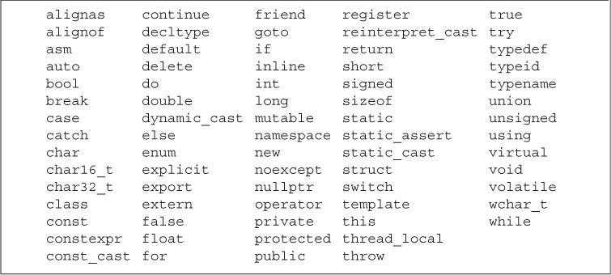

#### 2.2.4 Scope of a Name 作用域

作用域 scope 是程序的一部分，在其中名字有其特定的含义。C++语言中大多数作用域都以花括号分隔。

同一个名字在不同的作用域中可能指向不同的实体。名字的有效区域始于名字的声明语句，以声明语句所在的作用域末端为结束。

全局作用域 global scope	一次声明，整个程序范围都可使用

块作用域 block scope	仅仅在那块可以使用

> 一般来说，杂对象第一次被使用的地方附近定义它是一种好的选择。

##### 嵌套的作用域 Nested Scopes

作用域中一旦声明了某个名字，它所嵌套着的所有作用域中都能访问该名字，同时，允许在内层作用域中重新定义外层作用域已有的名字。

不过函数内部不宜定义与全局变量同名的新变量。

```c++
#include <iostream>
// Program for illustration purposes only: It is bad style for a function
// to use a global variable and also define a local variable with the same name
int reused = 42;    // reused has global scope
int main()
{
    int unique = 0; // unique has block scope
    // output #1: uses global reused; prints 42 0
    std::cout << reused << " " << unique << std::endl;
    int reused = 0; // new, local object named reused hides global reused
    // output #2: uses local reused; prints 0 0
    std::cout << reused << " " << unique << std::endl;
    // output #3: explicitly requests the global reused; prints 42 0
    std::cout << ::reused << " " << unique << std::endl;
    return 0;
}
```

可以用作用域操作符`::`来覆盖默认的作用域规则。因为全局作用域本身并没有名字，所以当作用域操作符的左侧为空时，会向全局作用域发出请求获取作用域操作符右侧名字对应的变量。

### 2.3 Compound Types 复合类型

复合类型指基于其他类型定义的定义，这里介绍两种，即引用和指针。

声明语句的通用描述是：**一条声明语句由一个基本数据类型 base type 和紧随其后的一个声明符 declarator列表组成。**

#### 2.3.1 References

> C++ 支持了右值引用，rvalue reference 在【13.6.1】 中会讲,这种引用主要用于内置类，一般来说我们使用“引用”这个词，是指左值引用。

简而言之，引用为对象起了另一个名字(alternative name)。

定义引用时，程序把引用和它的初始值绑定（bind）在一起，而不是将初始值拷贝给引用。

一旦初始化完成，将无法再令引用重新绑定到另一个对象，因为无法将引用重新绑定到另一个对象，因此**引用必须初始化。**

引用不是对象，仅仅是别名，所以不能定义引用的引用。

#### 2.3.2 Pointers

类似引用，指针也实现了对其他变量的间接访问。

而不同于引用的是：

* 指针本身就是一个对象，允许对指针赋值和拷贝，在指针的生命周期，他可以被指向几个不同的对象。
* 指针无须在定义时赋初值。和其他内置类型一样，在块作用域内定义的指针如果没有被初始化，也将拥有一个不确定的值。


通过将声明符写成`*d`的形式来定义指针类型，其中`d`是变量名称。如果在一条语句中定义了多个指针变量，则每个量前都必须有符号`*`。

```c++
int *ip1, *ip2;     // both ip1 and ip2 are pointers to int
double dp, *dp2;    // dp2 is a pointer to double; dp is a double
```

指针存放某个对象的地址，要想获取对象的地址，需要使用取地址符`&`。

```c++
int ival = 42;
int *p = &ival; // p holds the address of ival; p is a pointer to ival
```

因为引用不是对象，没有实际地址，所以不能定义指向引用的指针。


大部分情况下，指针的类型要和它指向的对象严格匹配。

有两个例外，一是允许令一个指向常量的指针指向一个非常量对象【2.4.2】；二是存在继承关系的类，可以将基类的指针或引用绑定到派生类对象上【15.2.3】。


##### 指针的值（即地址）

应属于下列状态之一：

- 指向一个对象。
- 指向紧邻对象所占空间的下一个位置。
- 空指针，即指针没有指向任何对象。
- 无效指针，即上述情况之外的其他值。

试图拷贝或以其他方式访问无效指针的值都会引发错误。

##### 解引用

如果指针指向一个对象，可以使用解引用（dereference）符`*`来访问该对象。

```c++
int ival = 42;
int *p = &ival; // p holds the address of ival; p is a pointer to ival
cout << *p;     // * yields the object to which p points; prints 42
```

给解引用的结果赋值就是给指针所指向的对象赋值。

解引用操作仅适用于那些确实指向了某个对象的有效指针。

##### 空指针

空指针（null pointer）不指向任何对象，在试图使用一个指针前代码可以先检查它是否为空。得到空指针最直接的办法是用字面值`nullptr`（c++11最新支持）来初始化指针。

旧版本程序通常使用`NULL`（预处理变量，定义于头文件`cstdlib`中，值为0）给指针赋值，但在C++11中，最好使用`nullptr`初始化空指针。

老程序还会用NULL，这是一个在cstdlib头文件里定义的预处理变量(preprocessor variable)。

关于预处理器，2.6.3会稍微介绍一些。简单说它运行于编译之前，不属于命名空间std。

```c++
int *p1 = nullptr;  // equivalent to int *p1 = 0;
int *p2 = 0;        // directly initializes p2 from the literal constant 0
// must #include cstdlib
int *p3 = NULL;     // equivalent to int *p3 = 0;
```

建议初始化所有指针。

注意，不能用int变量直接赋给指针，哪怕这个int变量为0；

##### 赋值和指针

指针和引用的最大区别就在于引用只是别名，而指针是真实存在的对象，可以改变指向的对象。

给指针赋值就是令它存放一个新的地址，从而指向一个新的对象。

具体分清楚到底改变的是指针还是指针指向的对象，可以通过看表达式等式左边是什么。


指针非空，参与条件表达式，则为true，空指针为false。


##### void*指针

`void*`是一种特殊的指针类型，可以存放任意对象的地址，**但不能直接操作`void*`指针所指的对象**。只能拿它和别的指针进行比较，作为函数的输入输出，或是赋给另一个void*指针。

概括说来，从void* 的视角来看，内存空间仅仅是内存空间，没办法访问内存空间中的对象。  【19.1.1】节会详细描述。【4.11.3】 会描述获取void*指针的方法。

#### 2.3.3 Understanding Compound Type Declarations

##### 基本数据类型和类型修饰符的关系

变量的定义包括一个基本数据类型和一组声明符。

```c++
int i = 1024, *p = &i, &r = i;
```

> 很多程序员会迷惑于基本数据类型和类型修饰符的关系，其实后者不过是声明符的一部分罢了。
>
> 特别是因为我们可以写成int*
>
> 比如
>
> ```c++
> int* a,b;
> //其中a是指针，b是int型变量。
> ```
>
> > 当声明符包含未修改的标识符时，正在声明的项将具有基类型。 如果星号 (**`\*`**) 显示在标识符的左侧，则将类型修改为指针类型。 如果标识符后跟方括号 (**`[ ]`**)，则将类型修改为数组类型。 如果标识符后跟圆括号，则将类型修改为函数类型。 若要详细了解如何解释声明中的优先级，请查看[解释更复杂的声明符](https://docs.microsoft.com/zh-cn/cpp/c-language/interpreting-more-complex-declarators?view=msvc-170)。
> >
> > ```c++
> > int i;
> > int a[];
> > int print();
> > ```
> >
> > 每个声明符至少声明一个标识符。 声明符必须包含一个类型说明符才能成为完整声明。 类型说明符显示：数组类型的元素的类型、指针类型寻址的对象的类型，或者函数的返回类型。
>
> > http://www.morecpp.cn/cpluspluc-declarations/


##### 指向指针的指针（Pointers to Pointers）：

一般来说，声明符中修饰符的个数没有限制。

```c++
int ival = 1024;
int *pi = &ival;    // pi points to an int
int **ppi = &pi;    // ppi points to a pointer to an int
```


##### 指向指针的引用（References to Pointers）：

```C++
int i = 42;
int *p;         // p is a pointer to int
int *&r = p;    // r is a reference to the pointer p
r = &i;         // r refers to a pointer; assigning &i to r makes p point to i
*r = 0;         // dereferencing r yields i, the object to which p points; changes i to 0
```

面对一条比较复杂的指针或引用的声明语句时，从右向左阅读有助于弄清它的真实含义。

**离变量名最近的符号对变量的类型有最直接的影响。**其余部分用来确定这个类型是什么。

### 2.4 const Qualifier

有时候我们想要定义一个不会被轻易改变的常量，那么就可以在变量前面添加const。

**const常量必须被初始化。**

任何对const对象进行赋值（擦写）都会引发错误。

对象的类型决定了其能做什么操作，所以只能在const类型的对象上执行不改变其内容的操作。

##### const变量的作用范围

默认情况下，`const`对象被设定成**仅在文件内有效**。当多个文件中出现了同名的`const`变量时，其实等同于在不同文件中分别定义了独立的变量。

如果想在多个文件间共享`const`对象：

- 若`const`对象的值在编译时已经确定，则应该定义在头文件中。其他源文件包含该头文件时，不会产生重复定义错误。

- 若`const`对象的值直到运行时才能确定，则应该在头文件中声明，在源文件中定义。此时`const`变量的声明和定义前都应该添加`extern`关键字。

  ```c++
  // file_1.cc defines and initializes a const that is accessible to other files
  extern const int bufSize = fcn();
  // file_1.h
  extern const int bufSize;   // same bufSize as defined in file_1.cc
  ```

#### 2.4.1 References to const

把引用绑定在`const`对象上即为对常量的引用（reference to const）。对常量的引用不能被用作修改它所绑定的对象。

```c++
const int ci = 1024;
const int &r1 = ci;     // ok: both reference and underlying object are const
r1 = 42;        // error: r1 is a reference to const
int &r2 = ci;   // error: non const reference to a const object
```

> 常量引用
>
> const Reference is a reference to Const
>
> 有些人会将const类型的引用叫做常量引用，这是有些歧义的。
>
> 因为引用不是一个对象，我们没法让它本身const。而且C++语言并不允许随意改变引用所绑定的对象，所以这层意义上所有的引用都算是常量。

##### 初始化和对const的引用

大部分情况下，引用的类型要和与之绑定的对象严格匹配。但是有两个例外：

- 初始化常量引用时允许用任意表达式作为初始值，只要该表达式的结果能转换成引用的类型即可。

  ```c++
  int i = 42;
  const int &r1 = i;      // we can bind a const int& to a plain int object
  const int &r2 = 42;     // ok: r1 is a reference to const
  const int &r3 = r1 * 2;     // ok: r3 is a reference to const
  int &r4 = r * 2;        // error: r4 is a plain, non const reference
  ```

- 允许为一个常量引用绑定非常量的对象、字面值或者一般表达式。

  ```c++
  double dval = 3.14;
  const int &ri = dval;
  ```


> 当一个常量引用被绑定到另外一个类型时，
>
> ```c++
> double dval = 3.14;
> const int &ri = dval;
> ```
>
> 发生的其实是
>
> ```c++
> double dval = 3.14;
> const int temp = dval;
> const int &ri = temp;
> ```
>
> 这种情况下，ri绑定了一个临时量。这玩意是编译器生成的,为了确保ri绑定一个整数。
>
> 如果ri不是常量，那么就会让ri绑定上temp，而我们ri引用想绑定的是dval，于是c++就禁止将非常量引用绑定到类型不同的对象上。
>
> > ```c++
> > #include <iostream>
> > using namespace std;
> > int main()
> > {
> >  double dval = 3.14;
> >  int &ri = dval;
> >  cout<<ri<<endl;
> > }
> > /*
> > PS C:\Users\Administrator\Desktop> g++ .\Untitled-1.cpp
> > .\Untitled-1.cpp: In function 'int main()':
> > .\Untitled-1.cpp:9:16: error: invalid initialization of reference of type 'int&' from expression of type 'double
> > ```

常量引用仅对引用可参与的操作做了限定，但是对于引用的对象本身是不是一个常量未做限定。由于对象可能是非常量，那么允许通过其他方式修改它的值。

```c++
#include <iostream>
using namespace std;
int main()
{
    int i = 42;
    int &r1 = i;      // we can bind a const int& to a plain int object
    const int &r2 = i;     // ok: r1 is a reference to const
    cout << r1 <<endl;
    cout << r2 <<endl;
    r1 = 0;
    cout<<"change"<<endl;
    cout << r1 <<endl;
    cout << r2 <<endl;
}
/*
42
42
change
0
0
*/
```

#### 2.4.2 Pointers and const

指向常量的指针(pointer to const) 不能用于改变其所指对象的值。

要想存放常量对象的地址，只能使用指向常量的指针。

```c++
const double pi = 3.14;     // pi is const; its value may not be changed
double *ptr = &pi;          // error: ptr is a plain pointer
const double *cptr = &pi;   // ok: cptr may point to a double that is const
*cptr = 42;         // error: cannot assign to *cptr
double dval = 3.14; // dval is a double; its value can be changed
cptr = &dval;       // ok: but can't change dval through cptr
```

常量指针（const pointer）必须初始化，而放在指针中的那个地址也就不能再改变了。

定义语句中把`*`放在`const`之前用来说明指针本身是一个常量。这也暗示了不变的是指针而不是指向的那个值。

```c++
int errNumb = 0;
int *const curErr = &errNumb;   // curErr will always point to errNumb
const double pi = 3.14159;
const double *const pip = &pi;  // pip is a const pointer to a const object
```

指针本身是常量并不代表不能通过指针修改其所指向的对象的值，能否这样做完全依赖于其指向对象的类型。

> 举个例子，就好像你把钱存银行定期，从你这边你规定了自己的行为，这笔钱是const的，你不去动它，而在银行那边，钱是有可能会被动的，甚至说动是应该的（变量）。但银行不应该影响我的取款，可是一些无良的银行甚至会挪用（糟糕的操作），在你要取回定期是发现没钱了，这就不好了。
>
> 当然如果你存的东西也是个const，比如一些很难动的东西，比如古董啊，雕像啊什么的，那么两边都不会动了。

```c++
#include <iostream>
using namespace std;
int main()
{
    int i2 = 5;
    int *const p2 = &i2;
    cout<<*p2<<endl;
    *p2 = 6;
    cout<<*p2<<endl;
    cout<<i2<<endl;
    const int * const p3 = &i2;
    //*p3 = 7;
    cout<<*p3<<endl;
    return 0;
}
/*
PS C:\Users\Administrator\Desktop> g++ .\Untitled-1.cpp
PS C:\Users\Administrator\Desktop> .\a.exe
5
6
6
6
如果把注释去掉，可以看到
.\Untitled-1.cpp: In function 'int main()':
.\Untitled-1.cpp:12:11: error: assignment of read-only location '*(const int*)p3'
*/
```

所以说 p2是一个指向变量的常量指针，可以改变i2，而p3 是一个指向常量的常量指针。


> 
>
> https://www.geeksforgeeks.org/difference-between-const-int-const-int-const-and-int-const/
>
> | 语句                  | 含义                                                         | 介绍                                                         | 备注                                               |
> | --------------------- | ------------------------------------------------------------ | ------------------------------------------------------------ | -------------------------------------------------- |
> | const int \*ptr       | const int \* is pointer to constant integer                  |                                                              |                                                    |
> | int const\* ptr       | **int const\*** is pointer to constant integer               | This means that the variable being declared is a pointer, pointing to a constant integer. Effectively, this implies that the pointer is pointing to a value that shouldn’t be changed. Const qualifier doesn’t affect the pointer in this scenario so the pointer is allowed to point to some other address.<br/>The first const keyword can go either side of data type, hence **int const\*** is equivalent to **const int\***. | 更推荐这种，可以很容易读出 ptr is a * to const int |
> | const int * const ptr | **const int\* const** is a constant pointer to constant integer | This means that the variable being declared is a constant pointer pointing to a constant integer. Effectively, this implies that a constant pointer is pointing to a constant value. Hence, neither the pointer should point to a new address nor the value being pointed to should be changed.<br/>The first const keyword can go either side of data type, hence **const int\* const** is equivalent to **int const\* const**. | ptr is a const * to const int                      |
> | int* const ptr        | **int \*const** is **const** **pointer** to **int**          | This means that the variable being declared is a constant pointer pointing to an integer. Effectively, this implies that the pointer shouldn’t point to some other address. Const qualifier doesn’t affect the value of integer in this scenario so the value being stored in the address is allowed to change. | ptr is a const * to int                            |
>
> 这种从右向左读的方法很有用
>
> Using this rule, even complex declarations can be decoded like,
>
> - **int \** const** is a **const** **pointer** to **pointer** to an **int**.
> - **int \* const \*** is a **pointer** to **const** **pointer** to an **int**.
> - **int const \**** is a **pointer** to a **pointer** to a **const** **int**.
> - **int \* const \* const** is a **const** **pointer** to a **const** **pointer** to an **int**.

#### 2.4.3 Top-Level const

由于指针是个对象，那么它本事是不是常量，和它指的对象是不是常量，这是两个问题。

所以用名词顶层来表示指针是const。而用名词底层表示指针所指的对象是const。

类似的，顶层可以表示任意对象是常量。

底层则与一些复合类型的基本类型有关。

```c++
int i = 0;
int *const p1 = &i;     // we can't change the value of p1; const is top-level
const int ci = 42;      // we cannot change ci; const is top-level
const int *p2 = &ci;    // we can change p2; const is low-level
const int *const p3 = p2; // right-most const is top-level, left-most is not
const int &r = ci;      // const in reference types is always low-level
```

当执行拷贝操作时，常量是顶层`const`还是底层`const`区别明显：

- 顶层`const`没有影响。拷贝操作不会改变被拷贝对象的值，因此拷入和拷出的对象是否是常量无关紧要。

  ```c++
  i = ci;     // ok: copying the value of ci; top-level const in ci is ignored
  p2 = p3;    // ok: pointed-to type matches; top-level const in p3 is ignored
  ```

- 拷入和拷出的对象必须具有相同的底层`const`资格。或者两个对象的数据类型可以相互转换。一般来说，非常量可以转换成常量，反之则不行。

  ```c++
  int *p = p3;    // error: p3 has a low-level const but p doesn't
  p2 = p3;        // ok: p2 has the same low-level const qualification as p3
  p2 = &i;        // ok: we can convert int* to const int*
  int &r = ci;    // error: can't bind an ordinary int& to a const int object
  const int &r2 = i;  // ok: can bind const int& to plain int
  ```

> 这个讲的很好。https://blog.csdn.net/TeFuirnever/article/details/103011514

#### 2.4.4 constexpr and Constant Expressions

常量表达式（constant expressions）指值不会改变并且在**编译过程**就能得到计算结果的表达式。

字面值显然是常量表达式。

一个对象是否为常量表达式由它的数据类型和初始值共同决定。

```c++
const int max_files = 20;           // max_files is a constant expression
const int limit = max_files + 1;    // limit is a constant expression
int staff_size = 27;        // staff_size is not a constant expression
const int sz = get_size();  // sz is not a constant expression 它的值要到运行时才能得到。
```

##### constexpr变量

C++11允许将变量声明为`constexpr`类型以便由编译器来验证变量的值是否是一个常量表达式。

```c++
constexpr int mf = 20;          // 20 is a constant expression
constexpr int limit = mf + 1;   // mf + 1 is a constant expression
constexpr int sz = size();      // ok only if size is a constexpr function
```

声明为constexpr类型一定是一个常量，且必须用常量表达式初始化。6.5.2节会介绍constexpr函数。

##### 字面值类型

目前接触的类型中，算术类型、引用和指针都属于字面值类型。

自定义类，IO库，string类型则不属于字面值类型。

【7.5.6】 【19.3】 会进一步介绍其他字面值类型

##### 指针与constexpr

指针和引用都能定义成`constexpr`，但是初始值受到严格限制。`constexpr`指针的初始值必须是0、`nullptr`或者是存储在某个固定地址中的对象。

函数体内定义的普通变量一般并非存放在固定地址中，因此`constexpr`指针不能指向这样的变量。相反，函数体外定义的变量地址固定不变，可以用来初始化`constexpr`指针。

在`constexpr`声明中如果定义了一个指针，限定符`constexpr`仅对指针本身有效，与指针所指的对象无关。`constexpr`把它所定义的对象置为了顶层`const`。

```c++
constexpr int *p = nullptr;     // p是指向int的const指针
constexpr int i = 0;
constexpr const int *cp = &i;   // cp是指向const int的const指针
```

`const`和`constexpr`限定的值都是常量。但`constexpr`对象的值必须在编译期间确定，而`const`对象的值可以延迟到运行期间确定。

建议使用`constexpr`修饰表示数组大小的对象，因为数组的大小必须在编译期间确定且不能改变。

### 2.5 Dealing with Types

#### 2.5.1 Type Aliases 类型别名

类型别名是某种类型的同义词，传统方法是使用关键字`typedef`定义类型别名。

```c++
typedef double wages;   // wages is a synonym for double
typedef wages base, *p; // base is a synonym for double, p for double*
```

C++11新规定可以使用关键字`using`进行别名声明（alias declaration），作用是把等号左侧的名字规定成等号右侧类型的别名。

##### ！易错点

```c++
typedef char *pstring;	//pstring 实际上是指向char的指针
const pstring cstr = 0; // 指向char类型的常量指针
const char *cstr = 0;	//指向const char 的指针。数据类型不是char* ，*成为声明符的一部分，而是char
//所以不能直接将类型别名替换成原来的样子来理解他。
```

#### 2.5.2 The auto Type Specifier

C++11新增`auto`类型说明符，能让编译器自动分析表达式所属的类型。

`auto`定义的变量必须有初始值。

```c++
// the type of item is deduced from the type of the result of adding val1 and val2
auto item = val1 + val2;    // item initialized to the result of val1 + val2
```

使用auto也能在一条语句中声明多个变量，但因为一个声明语句只能有一个基本类型，所以该语句中所有变量的初始基本数据类型必须一样。

##### 复合类型、常量和auto

编译器推断出来的`auto`类型有时和初始值的类型并不完全一样。

- 当引用被用作初始值时，编译器以引用对象的类型作为`auto`的类型。

  ```c++
  int i = 0, &r = i;
  auto a = r;     // a is an int (r is an alias for i, which has type int)
  ```

- `auto`一般会忽略顶层`const`。

  ```c++
  const int ci = i, &cr = ci;
  auto b = ci;    // b is an int (top-level const in ci is dropped)
  auto c = cr;    // c is an int (cr is an alias for ci whose const is top-level)
  auto d = &i;    // d is an int*(& of an int object is int*)
  auto e = &ci;   // e is const int*(& of a const object is low-level const)
  ```

  如果希望推断出的`auto`类型是一个顶层`const`，需要显式指定`const auto`。

  ```C++
  const auto f = ci;  // deduced type of ci is int; f has type const int
  ```


设置类型为`auto`的引用时，原来的初始化规则仍然适用，初始值中的顶层常量属性仍然保留。

```c++
auto &g = ci;   // g is a const int& that is bound to ci
auto &h = 42;   // error: we can't bind a plain reference to a literal
const auto &j = 42;     // ok: we can bind a const reference to a literal
```

还需要注意，在一个语句定义多个变量时，& * 都只从属于某个声明符，而不是基本数据类型的一部分。因此初始值必须是同一类型。

```c++
int  i = 0;
const int ci = i; 

auto k = ci,&l = i;		// k是整数，l是整型引用
auto &m = ci,*p = &ci;//m 是整型常量的引用， p是指向整型常量的指针
auto &n = i, *p2 = &ci;//错误  i的类型是int，&ci的类型是const int
```


#### 2.5.3 The decltype Type Specifier

C++11新增`decltype`类型指示符，作用是选择并返回操作数的数据类型，此过程中编译器不实际计算表达式的值。

```c++
decltype(f()) sum = x;  // sum has whatever type f returns
```

`decltype`处理顶层`const`和引用的方式与`auto`有些不同，如果`decltype`使用的表达式是一个变量，则`decltype`返回该变量的类型（包括顶层`const`和引用）。

```c++
const int ci = 0, &cj = ci;
decltype(ci) x = 0;     // x has type const int
decltype(cj) y = x;     // y has type const int& and is bound to x
decltype(cj) z;     // error: z is a reference and must be initialized
```

因为cj是一个引用，所以z也是引用，那么z必须被初始化。

引用从来都是作为其所指对象的同义词出现，只有用在decltype处是一个例外。


如果`decltype`使用的表达式不是一个变量，则`decltype`返回表达式结果对应的类型。

如果表达式的内容是解引用操作，则`decltype`将得到引用类型。

如果`decltype`使用的是一个不加括号的变量，则得到的结果就是该变量的类型；

如果给变量加上了一层或多层括号，则`decltype`会得到引用类型，因为**变量是一种可以作为赋值语句左值的特殊表达式。**

**`decltype((var))`的结果永远是引用，而`decltype(var)`的结果只有当`var`本身是一个引用时才会是引用。**

### 2.6 Defining Our Own Data Structures

在C++中，我们以类的形式定义数据结构。C++对类的支持甚多，本书三四部分都将大幅介绍类的知识。Sales_item看似简单，但是要实现它得在14章介绍自定义运算符之后。

#### 2.6.1 Defining the Sales_data Type

C++11规定可以为类的数据成员（data member）提供一个类内初始值（in-class initializer）。创建对象时，类内初始值将用于初始化数据成员，没有初始值的成员将被默认初始化。

**类内初始值不建议使用圆括号。**(不过目前我还是这样用) 参考【2.2.1】

> https://www.open-std.org/jtc1/sc22/wg21/docs/papers/2008/n2628.html
>
> 因为我们无法避免这样的情况
>
> ```cpp
> class Widget 
> {
> private: 
> typedef int x;
> int z(x);
> };
> ```
>
> 这样的话，就会变为函数声明。

类定义的最后应该加上分号。（很多人会犯错）

> 另外个人经验，构造函数，参数表最后一个,不要有

#### 2.6.2 Using the Sales_data Class

#### 2.6.3 Writing Our Own Header Files

19.7 将会讲在函数体内定义类，但是这种类毕竟受了一些限制，所以类一般都不定义在函数体内。

头文件（header file）通常包含那些只能被定义一次的实体，如类、`const`和`constexpr`变量。

头文件一旦改变，相关的源文件必须重新编译以获取更新之后的声明。

##### 预处理器概述

头文件保护符（header guard）依赖于预处理变量（preprocessor variable）(2.3.2)。

预处理变量有两种状态：已定义和未定义。

`#define`指令把一个名字设定为预处理变量。

`#ifdef`指令当且仅当变量已定义时为真，

`#ifndef`指令当且仅当变量未定义时为真，一旦检查结果为真，则执行后续操作直至遇到`#endif`指令为止。

```c++
#ifndef SALES_DATA_H
#define SALES_DATA_H
#include <string>
struct Sales_data
{
    std::string bookNo;
    unsigned units_sold = 0;
    double revenue = 0.0;
};
#endif
```

在高级版本的IDE环境中，可以直接使用`#pragma once`命令来防止头文件的重复包含。

预处理变量无视C++语言中关于作用域的规则。

整个程序中的预处理变量，包括头文件保护符必须唯一。预处理变量的名字一般均为大写。

头文件即使目前还没有被包含在任何其他头文件中，也应该设置保护符。

### Chapter Summary  

​	类型是C++编程的基础。

​	类型规定了其对象的存储要求和所能执行的操作。C++语言提供了一套基础内置类型，这些类型与机器硬件密切相关。类型还分为非常量和常量，一个常量对象必须初始化，而且一旦初始化就不能再改变。此外还可以定义复合类型，比如指针和引用等。复合类型的定义以其他类型为基础。

​	C++语言允许用户以类的形式自定义类型。C++库通过类提供了一套高级抽象类型。如输入输出和string等。

### Defined Terms

| 中文                 | 英文             | 含义                                                |
| -------------------- | ---------------- | --------------------------------------------------- |
| 常量表达式           | const expression | 能在编译时计算并获得结果的表达式                    |
|                      | constexpr        | 一种函数，用于代表一条常量表达式  6.5.2节会详细介绍 |
| preprocessor         | 预处理器         | 在C++编译过程中执行的一段程序                       |
| separate compilation | 分离式编译       | 把程序分割为多个单独文件的能力                      |
|                      |                  |                                                     |
|                      |                  |                                                     |
|                      |                  |                                                     |


## Chapter 3 Strings, Vectors, and Arrays

除了内置类型，标准库提供了一些具有更高级性质的类型。

string 表示可变长的字符序列。

vector 存放的是某种给定类型对象的可变长序列。

array（内置数组类） 数组的实现与硬件密切相关

### 3.1 Namespace using Declarations

命名空间

最安全的方法就是使用using 声明，18.2.2 会介绍另一种方法。

使用`using`声明后就无须再通过专门的前缀去获取所需的名字了。

```c++
using std::cout;
```

程序中使用的每个名字都需要用独立的`using`声明引入。

头文件中通常不应该包含`using`声明。因为头文件里有了这个声明，所有含有这个头文件的文件都会有，可能会造成命名冲突。

### 3.2 Library string Type

#### 3.2.1 Defining and Initializing strings

初始化`string`最常见的的方式：

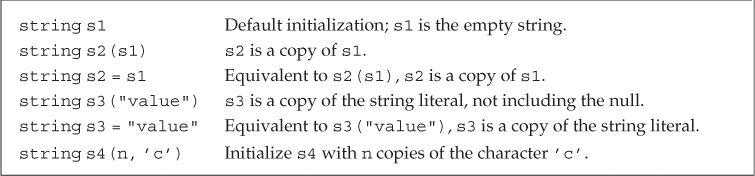

##### 直接初始化和拷贝初始化

如果使用等号初始化一个变量，实际上执行的是拷贝初始化（copy initialization），编译器把等号右侧的初始值拷贝到新创建的对象中去。

如果不使用等号，则执行的是直接初始化（direct initialization）。

初始值只有一个时，使用两种方法都可以，但是如果初始化的参数有多个，那么一般来说只能用直接初始化的形式。非要用拷贝初始化也得显式地创建一个临时对象用于拷贝。

```c++
string s7(10,'c');
string s8 = string (10,'d'); //可读性差，也没什么优势
```


#### 3.2.2 Operations on strings

`string`的大多数操作：


##### 读写string

在执行读取操作时，`string`对象会自动忽略开头的空白（空格符、换行符、制表符等）并从第一个真正的字符开始读取，直到遇见下一处空白为止。

##### 使用getline读取一整行

使用`getline`函数可以读取一整行字符（包括输入时的空白符）。该函数只要遇到**换行符**就结束读取并返回结果，如果输入的开始就是一个换行符，则得到空`string`。触发`getline`函数返回的那个换行符实际上被丢弃掉了，得到的`string`对象中并不包含该换行符。

##### string的empty和size操作

`empty`会返回一个字符串是否为空的bool值。

`size`函数返回`string`对象的长度，返回值是`string::size_type`类型，这是一种无符号类型。要使用`size_type`，必须先指定它是由哪种类型定义的。

如果一个表达式中已经有了`size`函数就不要再使用`int`了，这样可以避免混用`int`和`unsigned int`可能带来的问题。因为负数会被转化为很大的无符号值。

##### 比较string

逐位比较，且大小写敏感。

- 长度不同，且短的字符每个字符都与长字符对应位置长度相同，那么短的string小于较长string
- 如果两个string对象在某些对应的位置上不一致，则string对象比较的结果其实是string对象中第一对相异字符比较结果


##### string 的加法

- 两个string相加

- 字面值和string相加

  编译器允许我们使用并非所需类型来实现同样的效果，前提是这种类型可以自动转换为所需的类型。因为标准库允许把字符字面值和字符串字面值转换为string对象。所以可以在用字符串的地方用这些字面值。

当把`string`对象和字符字面值及字符串字面值混合在一条语句中使用时，必须确保每个加法运算符两侧的运算对象中至少有一个是`string`。

```c++
string s4 = s1 + ", ";          // ok: adding a string and a literal
string s5 = "hello" + ", ";     // error: no string operand
string s6 = s1 + ", " + "world";    // ok: each + has a string operand
```

而字面值和字面值是不能直接相加的。

```c++
string s7 = ("hello" + ",") + s2; //error
```

需要注意的是，为了与C兼容，C++语言中的字符串字面值并不是标准库`string`的对象。

#### 3.2.3 Dealing with the Characters in a string

##### string操作头文件

头文件`cctype`中的字符操作函数：

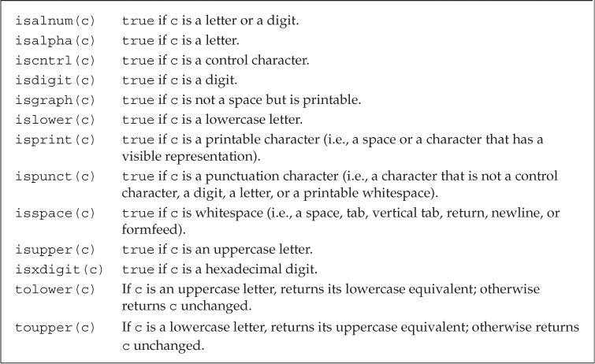

建议使用C++版本的C标准库头文件。C语言中名称为`name.h`的头文件，在C++中则被命名为`cname`。

##### string 与 for循环

C++11提供了范围`for`（range for）语句，可以遍历给定序列中的每个元素并执行某种操作。

```c++
for (declaration : expression)
    statement
```

`expression`部分是一个对象，用于表示一个序列。`declaration`部分负责定义一个变量，该变量被用于访问序列中的基础元素。每次迭代，`declaration`部分的变量都会被初始化为`expression`部分的下一个元素值。

一般来说我们会用auto来定义元素类型。

```c++
string str("some string");
// print the characters in str one character to a line
for (auto c : str)      // for every char in str
    cout << c << endl;  // print the current character followed by a newline
```

如果想在范围`for`语句中改变`string`对象中字符的值，必须把循环变量定义成引用类型。

```c++
string str("some string");
for (auto &c : str)      // for every char in str
    c = toupper(c);
cout<<str<<endl;

```

##### 只处理string内的一部分字符?

想要访问string对象中的单个字符有两种方式：一种是使用下标，另外一种是迭代器（3.4 和 第九章介绍）

下标运算符`[]`接收的输入参数是`string::size_type`类型的值，表示要访问字符的位置，返回值是该位置上字符的引用。

下标数值从0记起，范围是0至`size - 1`。使用超出范围的下标将引发不可预知的后果。

C++标准并不要求标准库检测下标是否合法。但是编程时需要时时刻刻注意这一点。

编程时可以把下标的类型定义为相应的`size_type`，这是一种无符号数，可以确保下标不会小于0，此时代码只需要保证下标小于`size`的值就可以了。另一种确保下标合法的有效手段就是使用范围`for`语句。


### 3.3 Library vector Type

标准库类型`vector`表示对象的集合，也叫做容器（container）（第二部分会对这有更一步的讲解），定义在头文件`vector`中。`vector`中所有对象的类型都相同，每个对象都有一个索引与之对应并用于访问该对象。

> 模板本身不是类或函数，相反可以将模板看做为编译器生成类或函数编写的一份说明。编译器根据模板创建类或函数的过程称之为实例化(instantiation)，当使用模板时，需要指出编译器应把类或类型实例化为何种类型。

`vector`是模板（template）而非类型，由`vector`生成的类型必须包含`vector`中元素的类型，如`vector<int>`。

因为引用不是对象，所以不存在包含引用的`vector`。

在早期的C++标准中，如果`vector`的元素还是`vector`，定义时必须在外层`vector`对象的右尖括号和其元素类型之间添加一个空格，如`vector<vector<int> >`。但是在C++11标准中，可以直接写成`vector<vector<int>>`，不需要添加空格。

#### 3.3.1 Defining and Initializing vectors

定义`vector`对象的常用方法：


初始化`vector`对象时如果使用圆括号，可以说提供的值是用来构造（construct）`vector`对象的；如果使用的是花括号，则是在列表初始化（list initialize）该`vector`对象。

> 列表初始化
>
> C++ 提供初始化方法可以相互等价使用，但也有一些例外情况。
>
> - 使用拷贝初始化时（=），只能提供一个初始值
> - 如果提供的是一个类内初始值，则只能使用拷贝初始化或使用花括号的形式初始化
> - 如果提供的初始元素值的列表，则只能把初始值都放在花括号里进列表初始化

##### 值初始化

可以只提供`vector`对象容纳的元素数量而省略初始值，此时会创建一个值初始化（value-initialized）的元素初值，并把它赋给容器中的所有元素。这个初值由`vector`对象中的元素类型决定。

这种初始化有两个特殊限制，其一，有些类要求必须明确地提供初始值，或vector对象不支持默认初始化，我们就必须设置初始的元素值；其二，如果只提供了元素的数量而没有设定初始值，只能使用直接初始化。

```c++
vector<int> vi = 10; // error
```

##### 列表初始化还是元素数量？

有时候初始化的真实含义需要通过圆括号还是花括号来区分

```c++
vector<int>v1(10,1); // 十个元素
vector<int>v1{10,1}; // 两个元素
```

- 如果我们使用的是圆括号，那么我们可以说提供的值是用来构造vector对象的。
  - 一个元素-容器大小
  - 两个元素-容量，初始值
- 如果我们使用的是花括号，那么我们可以说是想要列表初始化，初始化时会尽可能把花括号内的值当成是元素初始值的列表来处理。如果想要列表初始化，那么花括号里的值必须与元素类型相同，确认无法执行列表初始化后，编译器会尝试用默认值初始化对象。

#### 3.3.2 Adding Elements to a vector

push_back()

> vector 对象能高速增长
>
> 开始时创建空的vector对象，运行时动态添加元素，【9.4】节还会对其有更一步的描述。

> C++支持能高效地朝vector对象中添加元素，但是这也要求我们确保写的循环正确无误，特别是在循环可能改变vector对象容量时。

#### 3.3.3 Other vector Operations

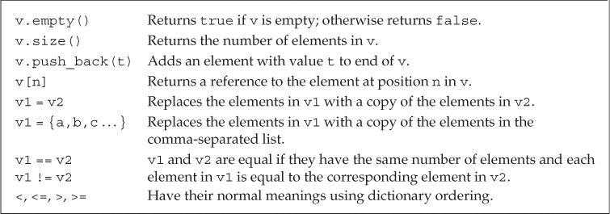

`size`函数返回`vector`对象中元素的个数，返回值是由`vector`定义的`size_type`类型。`vector`对象的类型包含其中元素的类型。

```c++
vector<int>::size_type  // ok
vector::size_type       // error
```

##### 不能用下标形式添加元素

`vector`和`string`对象的下标运算符只能用来访问已经存在的元素，而不能用来添加元素。

```c++
vector<int> ivec;   // empty vector
for (decltype(ivec.size()) ix = 0; ix != 10; ++ix)
{
    ivec[ix] = ix;  // disaster: ivec has no elements
    ivec.push_back(ix); // ok: adds a new element with value ix
}
```

### 3.4 Introducing Iterators 迭代器

迭代器的作用和下标类似，但是更加通用。所有标准库容器都可以使用迭代器，但是其中只有少数几种同时支持下标运算符。

类似指针，迭代器有有效无效的区别。有效的迭代器指向某个元素或指向容器中尾元素的下一位置，其他所有情况都算无效。

#### 3.4.1 Using Iterators

定义了迭代器的类型都拥有`begin`和`end`两个成员函数。`begin`函数返回指向第一个元素的迭代器，`end`函数返回指向容器“尾元素的下一位置（one past the end）”的迭代器，通常被称作尾后迭代器（off-the-end iterator）或者简称为尾迭代器（end iterator）。尾后迭代器仅是个标记，表示程序已经处理完了容器中的所有元素。

迭代器一般为`iterator`类型。具体是什么类型我们一般并不能确定。

```c++
// b denotes the first element and e denotes one past the last element in ivec
auto b = ivec.begin(), e = ivec.end();    // b and e have the same type
```

如果容器为空，则`begin`和`end`返回的是同一个迭代器，都是尾后迭代器。

标准容器迭代器的运算符：


- 类似指针，也可以通过解引用来获取它所指示的元素，执行解引用的迭代器必须合法且确实指示着某个元素。试图解引用一个非法迭代器或尾后迭代器都是未被定义的行为。因为`end`返回的迭代器并不实际指向某个元素，所以不能对其进行递增或者解引用的操作。

- 在`for`或者其他循环语句的判断条件中，最好使用`!=`而不是`<`。所有标准库容器的迭代器都定义了`==`和`!=`，但是只有其中少数同时定义了`<`运算符。所以为了泛型编程以及日常使用考虑，养成使用迭代器和`!=`的习惯。

```c++
for (auto it = s.begin(); it != s.end() && !isspace(*it);++it)
```

- 迭代器也有iterator和const_iterator的类型区分，如果`vector`或`string`对象是常量，则只能使用`const_iterator`迭代器，该迭代器只能读元素，不能写元素。

- `begin`和`end`返回的迭代器具体类型由对象是否是常量决定，如果对象是常量，则返回`const_iterator`；如果对象不是常量，则返回`iterator`。

  ```c++
  vector<int> v;
  const vector<int> cv;
  auto it1 = v.begin();   // it1 has type vector<int>::iterator
  auto it2 = cv.begin();  // it2 has type vector<int>::const_iterator
  ```

  C++11新增了`cbegin`和`cend`函数，不论`vector`或`string`对象是否为常量，都返回`const_iterator`迭代器。

- 箭头运算符->

  箭头运算符将解引用和成员访问两个操作结合在一起。省略了步骤，还不必考虑什么结合优先级的问题。【4.1.2】

  ```c++
  it->mem; == (*it).men;
  ```

- 某些vector对象的操作会使迭代器失效

  ef: 不能在范围for循环中向vector对象添加元素；任何一种可能改变vector对象容量的操作，也会是vector迭代器失效。【9.3.6】会解释为什么失效

谨记：但凡是使用了迭代器的循环体，都不要向迭代器所属的容器添加元素。

#### 3.4.2 Iterator Arithmetic 迭代器运算

`vector`和`string`迭代器支持的操作：


两个有效的迭代器可以相减，所得结果是两个迭代器的距离，类型名为difference_type的带符号整型数。string 和vector都支持这个类型。

### 3.5 Arrays

与vector类型不同，数字大小固定，不能随意向数组中随意添加元素。

#### 3.5.1 Defining and Initializing Built-in Arrays

数组是一种复合类型，声明形式为`a[d]`，其中`a`是数组名称，`d`是数组维度（dimension）。维度必须是一个大于0的常量表达式。

默认情况下，数组的元素被默认初始化【2.2.1】。

定义数组的时候必须指定数组的类型，不允许用`auto`关键字由初始值列表推断类型。

类似vector，数组的元素必须为对象，因此不存在引用的数组。

##### 显式初始化数组元素

如果定义数组时提供了元素的初始化列表，则允许省略数组维度，编译器会根据初始值的数量计算维度。但如果显式指明了维度，那么初始值的数量不能超过指定的大小。如果维度比初始值的数量大，则用提供的值初始化数组中靠前的元素，剩下的元素被默认初始化。

```c++
const unsigned sz = 3;
int ia1[sz] = {0,1,2};  // array of three ints with values 0, 1, 2
int a2[] = {0, 1, 2};   // an array of dimension 3
int a3[5] = {0, 1, 2};  // equivalent to a3[] = {0, 1, 2, 0, 0}
string a4[3] = {"hi", "bye"};   // same as a4[] = {"hi", "bye", ""}
int a5[2] = {0,1,2};    // error: too many initializers
```

##### 字符数组的特殊性

可以用字符串字面值初始化字符数组，但字符串字面值结尾处的空字符也会一起被拷贝到字符数组中。

```c++
char a1[] = {'C', '+', '+'};        // list initialization, no null
char a2[] = {'C', '+', '+', '\0'};  // list initialization, explicit null
char a3[] = "C++";      // null terminator added automatically
const char a4[6] = "Daniel";    // error: no space for the null!
```

字符串会自动添加表示字符串结束的空字符，所以要注意留足空间。

##### 数组不允许拷贝和赋值

不能用一个数组初始化或直接赋值给另一个数组。

有的编译器支持，这就是所谓的编译器拓展（compiler extension），但是一般来说最好避免使用非标准特性。

##### 理解复杂的数组声明

从数组的名字开始由内向外阅读有助于理解复杂数组声明的含义。

```c++
int *ptrs[10];              // ptrs is an array of ten pointers to int
int &refs[10] = /* ? */;    // error: no arrays of references
int (*Parray)[10] = &arr;   // Parray points to an array of ten ints
int (&arrRef)[10] = arr;    // arrRef refers to an array of ten ints
```

#### 3.5.2 Accessing the Elements of an Array

数组下标通常被定义成`size_t`类型，这是一种机器相关的无符号类型，可以表示内存中任意对象的大小。`size_t`定义在头文件`cstddef`中。这个文件是`stddef.h`的c++版本

大多数常见的安全问题都源于缓冲区溢出错误。当数组或其他类似数据结构的下标越界并试图访问非法内存区域时，就会产生此类错误。这种错误除了小心检查，加强测试之外，没有什么好的方法。即使通过编译执行也不能证明不会发生这类错误。

#### 3.5.3 Pointers and Arrays

使用数组时，编译器一般会把它转化为指针。

而数组有个特性，在大多数表达式中，使用数组类型的对象其实是在使用一个指向该数组首元素的指针。

当使用数组作为一个`auto`变量的初始值时，推断得到的类型是指针而非数组。但`decltype`关键字【2.5.3】不会发生这种转换，直接返回数组类型。

```c++
int ia[] = {0,1,2,3,4,5,6,7,8,9};   // ia is an array of ten ints
auto ia2(ia);   // ia2 is an int* that points to the first element in ia
ia2 = 42;       // error: ia2 is a pointer, and we can't assign an int to a pointer
auto ia2(&ia[0]);   // now it's clear that ia2 has type int*
// ia3 is an array of ten ints
decltype(ia) ia3 = {0,1,2,3,4,5,6,7,8,9};
ia3 = p;    // error: can't assign an int* to an array
ia3[4] = i;     // ok: assigns the value of i to an element in ia3
```

##### 指针也可以用作迭代器

为了实现迭代器的效果，我们需要数组的首地址以及尾元素后一位的地址。

```c++
int a[10] = {...};
int *start = a;
int *end = a[10];
for(int *p = start;p!=end;++p){
    cout<<*p<<endl;
}
```

> 建议使用++i而不是i++，少一步拷贝。

##### 标准库函数begin和end.

上面的使用很容易出错。为此C++11在头文件`iterator`中定义了两个名为`begin`和`end`的函数，功能与容器中的两个同名成员函数类似，参数是一个数组。

```c++
int ia[] = {0,1,2,3,4,5,6,7,8,9};   // ia is an array of ten ints
int *beg = begin(ia);   // pointer to the first element in ia
int *last = end(ia);    // pointer one past the last element in ia
```

- 一个指针如果指向了某种内置类型数组的尾元素的“下一位置”，则其具备end()类似的功能，特别注意，尾后指针不能用于解引用和递增操作。

##### 指针运算

迭代器操作指针都能做。

两个指针相减的结果类型是`ptrdiff_t`，这是一种定义在头文件`cstddef`中的带符号类型。

##### 下标与指针

只要指针指向的是数组中的元素(或尾指针下一个位置)，都可以进行下标操作。

```c++
int *p = &ia[2];
int j = p[1];	== ia[3]
int k = p[-2];  == ia[0]
```

标准库类型限定使用的下标必须是无符号类型，而内置的下标运算无此要求。

内置的下标运算可以处理负值，当然指的元素必须有效。

#### 3.5.4 C-Style Character Strings

C++标准支持C风格字符串，但是最好不要在C++程序中使用它们。对大多数程序来说，使用标准库`string`要比使用C风格字符串更加安全和高效。

字符串字面值是一种通用结构的实例，这种结构是C++由C继承而来的C风格字符串--将字符串存放在字符数组中，并以空字符结束（null terminated）。这不是一种类型，而是一种为了表达和使用字符串而形成的书写方法。

##### C标准库String函数

C风格字符串的函数，被定义在cstring头文件中，cstring是string.h的c++版本

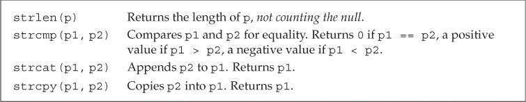

C风格字符串函数不负责验证其参数的正确性，传入此类函数的指针必须指向以空字符作为结尾的数组。

##### 比较字符串

标准string 对象可以直接进行比较，但是如果用在c风格字符串上，实际比较的将会是指针而不是字符串，如果想比较需要用strcmp；

##### 目标字符串的大小由调用者指定

不同于c++ 标准string类可以直接将两个字符串相加，c风格的字符串相加需要使用strcmp和strcat，将两个字符串赋给另一个有足够空间的C风格字符串。而这个空间并不容易估计准确，充满了风险。

#### 3.5.5 Interfacing to Older Code

##### 混用string对象和C风格字符串

任何出现字符串字面值的地方都可以用以空字符结束的字符数组来代替：

- 允许使用以空字符结束的字符数组来初始化`string`对象或为`string`对象赋值。

- 在`string`对象的加法运算中，允许使用以空字符结束的字符数组作为其中一个运算对象（不能两个运算对象都是）。

- 在`string`对象的复合赋值运算中，允许使用以空字符结束的字符数组作为右侧运算对象。

不能用`string`对象直接初始化指向字符的指针。为了实现该功能，`string`提供了一个名为`c_str`的成员函数，返回`const char*`类型的指针，指向一个以空字符结束的字符数组，数组的数据和`string`对象一样。

```c++
string s("Hello World");    // s holds Hello World
char *str = s;  // error: can't initialize a char* from a string
const char *str = s.c_str();    // ok
```

针对`string`对象的后续操作有可能会让`c_str`函数之前返回的数组失去作用，如果程序想一直都能使用其返回的数组，**最好将该数组重新拷贝一份**。

##### 使用数组初始化vector对象

可以使用数组来初始化`vector`对象，但是需要指明要拷贝区域的首元素地址和尾后地址。

```c++
int int_arr[] = {0, 1, 2, 3, 4, 5};
// ivec has six elements; each is a copy of the corresponding element in int_arr
vector<int> ivec(begin(int_arr), end(int_arr));
```

在新版本的C++程序中应该尽量使用`vector`、`string`和迭代器，避免使用内置数组、C风格字符串和指针。

### 3.6 Multidimensional Arrays

C++中的多维数组其实就是数组的数组。当一个数组的元素仍然是数组时，通常需要用两个维度定义它：一个维度表示数组本身的大小，另一个维度表示其元素（也是数组）的大小。通常把二维数组的第一个维度称作行，第二个维度称作列。

##### 多维数组的初始化

多维数组初始化的几种方式：

初始化时的内嵌的花括号并不是必须的。

```c++
int ia[3][4] =
{   // three elements; each element is an array of size 4
    {0, 1, 2, 3},   // initializers for the row indexed by 0
    {4, 5, 6, 7},   // initializers for the row indexed by 1
    {8, 9, 10, 11}  // initializers for the row indexed by 2
};
// equivalent initialization without the optional nested braces for each row
int ib[3][4] = {0, 1, 2, 3, 4, 5, 6, 7, 8, 9, 10, 11};
// explicitly initialize only element 0 in each row
int ic[3][4] = {{ 0 }, { 4 }, { 8 }};//初始化每行首元素
// explicitly initialize row 0; the remaining elements are value initialized
int id[3][4] = {0, 3, 6, 9};//初始化第一行
```

##### 多维数组的下标引用

可以使用下标访问多维数组的元素，数组的每个维度对应一个下标运算符。

- 如果表达式中下标运算符的数量和数组维度一样多，则表达式的结果是给定类型的元素。
- 如果下标运算符数量比数组维度小，则表达式的结果是给定索引处的一个内层数组。

```c++
// assigns the first element of arr to the last element in the last row of ia
ia[2][3] = arr[0][0][0];
int (&row)[4] = ia[1];  // binds row to the second four-element array in ia
```

##### 使用范围for语句处理多维数组

使用范围`for`语句处理多维数组时，为了避免数组被自动转换成指针【3.5.3】，语句中的外层循环控制变量必须声明成引用类型。

```c++
for (const auto &row : ia)  // for every element in the outer array
    for (auto col : row)    // for every element in the inner array
        cout << col << endl;
```

如果`row`不是引用类型，编译器初始化`row`时会自动将数组形式的元素转换成指向该数组内首元素的指针，这样得到的`row`就是`int*`类型，而之后的内层循环则试图在一个`int*`内遍历，程序将无法通过编译。

```c++
for (auto row : ia)
    for (auto col : row)
```

**使用范围`for`语句处理多维数组时，除了最内层的循环，其他所有外层循环的控制变量都应该定义成引用类型。如果要对元素进行改写，最内层也得用引用**

##### 指针和多维数组

因为多维数组实际上是数组的数组，所以由多维数组名称转换得到的指针指向第一个内层数组的指针。

```c++
int ia[3][4];       // array of size 3; each element is an array of ints of size 4
int (*p)[4] = ia;   // p points to an array of four ints
p = &ia[2];         // p now points to the last element in ia
```

声明指向数组类型的指针时，必须带有圆括号。

```c++
int *ip[4];     // array of pointers to int
int (*ip)[4];   // pointer to an array of four ints
```

使用`auto`和`decltype`能省略复杂的指针定义。

```c++
// print the value of each element in ia, with each inner array on its own line
// p points to an array of four ints
for (auto p = ia; p != ia + 3; ++p)
{
    // q points to the first element of an array of four ints; that is, q points to an int
    for (auto q = *p; q != *p + 4; ++q)
        cout << *q << ' ';
    cout << endl;
}
```

使用`begin`和`end`也能实现相同的功能，看起来还更简单鲁棒。

```c
for (auto p = begin(ia);p != end(ia);++p){
    for(auto q = begin(*p);q != end(*p);++q){
        cout<<*q<<" ";
    }
	cout<<endl;
}
```

##### 类型别名简化多维数组的指针

```c++
using int_array = int[4];
typedef int int_array[4];
```

两者相同。

> 解释typedef int int_array[4];
> 关键字typedef用来自定义数据类型，这是所有教材都这样讲的，但不要理解为新创建了一个数据类型，而是将已有的一个类型赋予个新名称而已，即起一个别名。
> 具体对这个语句来说，别名就是：int_array。而[4]不属于名字，而表示一种已有的数据类型，即：给一个大小为4的int数组取一个别名为int_array。
> 那如何知道是这样定义的呢？很简单。
> 首先，int a[4];这可是常见的定义格式。再在其前面添加关键字typedef，变成 typedef int a[4];最后将数组名a改为自己想要的一个别名int_array即可。注意：原本的a本意是数组名，属于变量范畴，而int_array则是新数据类型名（即别名），本质不一样了哦。祥见谭浩强的那本经典教材。

> **typedef常见用法**
>
> https://www.shuzhiduo.com/A/D85476oWJE/
>
> 1.常规变量类型定义
>
> 例如：typedef unsigned char uchar
> 描述：uchar等价于unsigned char类型定义 uchar c声明等于unsigned char c声明
>
> 2.数组类型定义
> 例如： typedef int array[2];
> 描述： array等价于 int [2]定义; array a声明等价于int a[2]声明
>
> 扩展： typedef int array[M][N];
> 描述： array等价于 int [M][N]定义; array a声明等价于int a[M][N]声明
>
> 3.指针类型定义
> 例如： typedef int *pointer;
> 描述： pointer等价于 int *定义;pointer p声明等价于int *p声明
>
> 例如： typedef int *pointer[M];
> 描述： pointer等价于 int *[M]定义 pointer p声明等价于int *p[M]声明明
>
> 4.函数地址说明
> 描述：C把函数名字当做函数的首地址来对待，我们可以使用最简单的方法得到函数地址
> 例如： 函数:int func(void); unsigned long funcAddr=(unsigned long)func， funcAddr的值是func函数的首地址
>
> 5.函数声明
> 例如： typedef int func(void); func等价于 int (void)类型函数
> 描述1： func f声明等价于 int f(void)声明，用于文件的函数声明
> 描述2： func *pf声明等价于 int (*pf)(void)声明，用于函数指针的生命，见下一条
>
> 6.函数指针
> 例如： typedef int (*func)(void)
> 描述： func等价于int (*)(void)类型
> func pf等价于int (*pf)(void)声明，pf是一个函数指针变量
>
> 7.识别typedef的方法：
> a).第一步。使用已知的类型定义替代typdef后面的名称,直到只剩下一个名字不识别为正确
> 如typedef u32 (*func)(u8);
> 从上面的定义中找到 typedef __u32 u32;typedef __u8 u8
> 继续找到 typedef unsigned int __u32;typedef unsigned char __u8;
> 替代位置名称 typedef unsigned int (*func)(void);
> 现在只有func属于未知。
> b).第二步.未知名字为定义类型，类型为取出名称和typedef的所有部分，如上为
> func等价于unsigned unsigned int (*)(unsigned char);
> c).第三部.定义一个变量时，变量类型等价于把变量替代未知名字的位置所得到的类型
> func f等价于unsigned unsigned int (*f)(unsigned char)


### Chapter Summary  

- `string`和 `vector`是最重要的两种标准库类型，string对象是一个可变长的字符序列，vector对象是一组同类型对象的容器。
- 迭代器允许对容器中的对象进行间接访问，对于string对象和vector对象来说，可以通过迭代器访问元素或者在元素间移动。
- 数组和指向数组元素的指针在一个较低层次上实现了与标准库string和vector类似的功能。一般来说尽量使用标准库提供的类型，之后在考虑C++语言内置的低层的替代品数组或指针。

### Defined Terms

| 中文       | 英文                  | 含义                                                         |
| ---------- | --------------------- | ------------------------------------------------------------ |
| 缓冲器溢出 | buffer overflow       | 一种严重的程序故障，主要原因是试图通过一个越界的索引访问容器内容，容器类型包括string、vector、数组等。 |
| 拷贝初始化 | copy initialization   | 使用赋值号的初始化形式，新创建的对象是初始值的一个副本       |
| 直接初始化 | direct initialization | 不使用赋值号的初始化形式                                     |
| 实例化     | instantiation         | 编译器生成一个指定的模板类或函数的过程                       |
|            | difference_type       | 由string和vector定义的一种带符号整数类型，表示两个迭代器之间的距离。 |
|            | size_type             | 由string和vector定义的一种无符号整数类型，能存放下任意string对象或vector对象的大小 |
|            | prtdiff_t             | cstddef头文件定义的一种与机器实现有关的带符号整数类型，空间足够大，足以表示数组中任意两个指针之间的距离 |
|            | size_t                | cstddef头文件定义的一种与机器实现有关的带符号整数类型，空间足够大，足以表示任意数组的大小 |


## Chapter 4 Expressions 表达式

### 4.1 Fundamentals

表达式（expression）由一个或多个运算对象（operand）组成，对表达式求值将得到一个结果（result）。字面值和变量是最简单的表达式，其结果就是字面值和变量的值。

#### 4.1.1 Basic Concepts

C++定义了一元运算符（unary operator）和二元运算符（binary operator）。除此之外，还有一个作用于三个运算对象的三元运算符。函数调用`()`也是一种特殊的运算符，它对运算对象的数量没有限制。

另外一些符号既可以作为一元运算符，也可以作为二元运算符，诸如*，一元它是解引用，二元它是乘法。具体是什么取决于上下文。

##### 运算对象转换

表达式求值过程中，小整数类型（如`bool`、`char`、`short`等）通常会被提升（promoted）为较大的整数类型，主要是`int`。【4.11】

##### 重载运算符

C++定义了运算符作用于内置类型和复合类型的运算对象时所执行的操作。当运算符作用于类类型的运算对象时，用户可以自定义其含义，这被称作运算符重载（overloaded operator）。

我们使用重载运算符时，包括运算对象的类型和返回值的类型，都是由该运算符定义的，但是运算对象的个数，运算符的优先级和结合律都是无法改变的。

##### 左值和右值

C++的表达式分为右值（rvalue）和左值（lvalue）。

- 当一个对象被用作右值的时候，用的是对象的值（内容）；

- 当对象被用作左值时，用的是对象的身份（在内存中的位置）-- 地址。

  **一个重要原则**：需要右值的地方可以用左值代替，反之则不行。

> ## 1、左值和右值的概念
>
> C++中左值（lvalue）和右值（rvalue）是比较基础的概念，虽然平常几乎用不到，但C++11之后变得十分重要，它是理解 move/forward 等新语义的基础。
>
> 左值与右值这两个概念是从 C 中传承而来的，左值指既能够出现在等号左边，也能出现在等号右边的变量；右值则是只能出现在等号右边的变量。
>
> ```cpp
> int a; // a 为左值
> a = 3; // 3 为右值
> ```
>
> - 左值是可寻址的变量，有持久性；
> - 右值一般是不可寻址的常量，或在表达式求值过程中创建的无名临时对象，短暂性的。
>
> 左值和右值主要的区别之一是左值可以被修改，而右值不能。
>
> ## 2、左值引用和右值引用
>
> - 左值引用：引用一个对象；
> - 右值引用：就是必须绑定到右值的引用，C++11中右值引用可以实现“移动语义”，通过 && 获得右值引用。
>
> ```cpp
> int x = 6; // x是左值，6是右值
> int &y = x; // 左值引用，y引用x
> 
> int &z1 = x * 6; // 错误，x*6是一个右值
> const int &z2 =  x * 6; // 正确，可以将一个const引用绑定到一个右值
> 
> int &&z3 = x * 6; // 正确，右值引用
> int &&z4 = x; // 错误，x是一个左值
> ```
>
> 右值引用和相关的移动语义是C++11标准中引入的最强大的特性之一，通过std::move()可以避免无谓的复制，提高程序性能。

一些需要使用左值的运算符：

- 赋值运算符需要一个非常量左值作为其左侧运算对象，返回结果也是一个左值。

- 取地址符作用于左值运算对象，返回指向该运算对象的指针，该指针是一个右值。

- 内置解引用运算符、下标运算符、迭代器解引用运算符、`string`和`vector`的下标运算符都返回左值。

- 内置类型和迭代器的递增递减运算符作用于左值运算对象。前置版本返回左值，后置版本返回右值。


如果`decltype`作用于一个求值结果是左值的表达式，会得到引用类型。

`decltype((variable))`一定会返回引用 `decltype(variable)`只有variable为引用类型会返回引用

```c++
#include <iostream>
#include<typeinfo>
using namespace std;
int main()
{
    int m = 6;
    int* p = &m;
    int& n = m;
    decltype(*p) a= *p;
    decltype(&p) b;
    cout << "a的类型是" << typeid(a).name() << endl;
    cout << "b的类型是" << typeid(b).name() << endl;
    cout << "n的类型是" << typeid(n).name() << endl;
    std::cout << "Hello World!\n";
}
/*
a的类型是int
b的类型是int * *
n的类型是int
Hello World!
*/
//还学习到typeid会返回引用指向的类型，不会返回啥reference的。不过visual studio 的智能提示能看到。
```

##### :sunny:关于decltype推导

> ## MSDN
>
> 编译器使用以下规则来确定 *表达式* 参数的类型。
>
> - 如果 *表达式* 参数是标识符或 [类成员访问](https://docs.microsoft.com/zh-cn/cpp/cpp/member-access-operators-dot-and?view=msvc-170)， `decltype(expression)` 则为由 *表达式*命名的实体的类型。 如果没有此类实体或 *表达式* 参数为一组重载函数命名，编译器将生成错误消息。
> - 如果 *表达式* 参数是对函数或重载运算符函数的调用， `decltype(expression)` 则为函数的返回类型。 将忽略重载运算符两边的括号。
> - 如果 *表达式* 参数是 [右值](https://docs.microsoft.com/zh-cn/cpp/cpp/lvalues-and-rvalues-visual-cpp?view=msvc-170)， `decltype(expression)` 则表示 *表达式*的类型。 如果*表达式*参数是[左值](https://docs.microsoft.com/zh-cn/cpp/cpp/lvalues-and-rvalues-visual-cpp?view=msvc-170)，`decltype(expression)`则为对*表达式*类型的[左值引用](https://docs.microsoft.com/zh-cn/cpp/cpp/lvalue-reference-declarator-amp?view=msvc-170)。


> ## decltype推导四规则
>
> 1. 如果e是一个没有带括号的标记符表达式或者类成员访问表达式，那么的decltype（e）就是e所命名的实体的类型。此外，如果e是一个被重载的函数，则会导致编译错误。
> 2. 否则 ，假设e的类型是T，如果e是一个将亡值，那么decltype（e）为T&&
> 3. 否则，假设e的类型是T，如果e是一个左值，那么decltype（e）为T&。
> 4. 否则，假设e的类型是T，则decltype（e）为T。

##### :sunny:关于值的类型

> **在前面**
>
> C++中有“左值”、“右值”的概念，C++11以后，又有了“左值”、“纯右值”、“将亡值”的概念。关于这些概念，许多资料上都有介绍，本文在拾人牙慧的基础上又加入了一些自己的一些理解，同时提出了一些需要读者特别注意的地方，主要目的有二：
> 1.尽可能地将这些概念介绍清楚。
> 2.为后续介绍完美转发和移动语义做好铺垫。
>
> **正文**
>
> 一、表达式
>
> ​    要说清“三值”，首先要说清表达式。
>
> ​    定义
> ​      由运算符(operator)和运算对象(operand)①构成的计算式（类似于数学上的算术表达式）。
> 举例
> ​      字面值(literal)和变量(variable)是最简单的表达式，函数的返回值也被认为是表达式。
>
> 二、值类别
>
> ​    表达式是可求值的，对表达式求值将得到一个结果(result)。这个结果有两个属性：类型和值类别（value categories）。下面我们将详细讨论表达式的值类别②。
>
> ​    在c++11以后，表达式按值类别分，必然属于以下三者之一：左值(left value,lvalue)，将亡值(expiring value,xvalue)，纯右值(pure rvalue,pralue)。其中，左值和将亡值合称泛左值(generalized lvalue,glvalue)，纯右值和将亡值合称右值(right value,rvalue)。见下图
>
> 
>
> 
>
> 
>
> 有一点需要说明，严格来讲，“左值”是表达式的结果的一种属性，但更为普遍地，我们通常用“左值”来指代左值表达式（正如上边一段中做的那样）。所谓左值表达式，就是指求值结果的值类别为左值的表达式。通常我们无需区分“左值”指的是前者还是后者，因为它们表达的是同一个意思，不会引起歧义。在后文中，我们依然用左值指代左值表达式。对于纯右值和将亡值，亦然。
>
> 三、详细说明
>
> 事实上，无论是左值、将亡值还是纯右值，我们目前都没有一个精准的定义。它们事实上表征了表达式的属性，而这种属性的区别主要体现在使用上，如能否做运算符的左操作数、能否使用移动语义（关于移动语义，在下的后续文章中会详细介绍）等。因此，从实际应用出发，我们首先需要做到的是：给定一个表达式，能够正确地判断出它的值类别。为了使读者能够做到这一点，在下采取了一个实际的方式：先对各个值类别的特征加以描述，然后指出常见的表达式里边，哪些属于该类别。
>
> **左值**
>
> 描述
> **能够用&取地址的表达式是左值表达式。**
> 举例
> 函数名和变量名（实际上是函数指针③和具名变量，具名变量如std::cin、std::endl等）、返回左值引用的函数调用、前置自增/自减运算符连接的表达式++i/--i、由赋值运算符或复合赋值运算符连接的表达式(a=b、a+=b、a%=b）、解引用表达式*p、字符串字面值"abc"（关于这一点，后面会详细说明）等。
>
> **纯右值**
>
> 描述
> 满足下列条件之一：
> 1）本身就是赤裸裸的、纯粹的字面值，如3、false；
> 2）求值结果相当于字面值或是一个不具名的临时对象。
> 举例
> 除字符串字面值以外的字面值、返回非引用类型的函数调用、后置自增/自减运算符连接的表达式i++/i--、算术表达式（a+b、a&b、a<<b）、逻辑表达式（a&&b、a||b、~a）、比较表达式（a==b、a>=b、a<b）、取地址表达式（&a）等。
>
> 下面从上面的例子中选取若干典型详细说明左值和纯右值的判断。
>
> 1）++i是左值，i++是右值。
> 前者，对i加1后再赋给i，最终的返回值就是i，所以，++i的结果是具名的，名字就是i；而对于i++而言，是先对i进行一次拷贝，将得到的副本作为返回结果，然后再对i加1，由于i++的结果是对i加1前i的一份拷贝，所以它是不具名的。假设自增前i的值是6，那么，++i得到的结果是7，这个7有个名字，就是i；而i++得到的结果是6，这个6是i加1前的一个副本，它没有名字，i不是它的名字，i的值此时也是7。可见，++i和i++都达到了使i加1的目的，但两个表达式的结果不同。
>
> 2）解引用表达式*p是左值，取地址表达式&a是纯右值。
> &(*p)一定是正确的，因为*p得到的是p指向的实体，&(*p)得到的就是这一实体的地址，正是p的值。由于&(*p)的正确，所以*p是左值。而对&a而言，得到的是a的地址，相当于unsigned int型的字面值，所以是纯右值。
>
> 3）a+b、a&&b、a`==`b都是纯右值
> a+b得到的是不具名的临时对象，而a&&b和a`==`b的结果非true即false，相当于字面值。
>
> **将亡值**
>
> 描述
> 在C++11之前的右值和C++11中的纯右值是等价的。C++11中的将亡值是随着右值引用④的引入而新引入的。换言之，“将亡值”概念的产生，是由右值引用的产生而引起的，将亡值与右值引用息息相关。所谓的将亡值表达式，就是下列表达式：
> 1）返回右值引用的函数的调用表达式
> 2）转换为右值引用的转换函数的调用表达式
> 读者会问：这与“将亡”有什么关系？
> 在C++11中，我们用左值去初始化一个对象或为一个已有对象赋值时，会调用拷贝构造函数或拷贝赋值运算符来拷贝资源（所谓资源，就是指new出来的东西），而当我们用一个右值（包括纯右值和将亡值）来初始化或赋值时，会调用移动构造函数或移动赋值运算符⑤来移动资源，从而避免拷贝，提高效率（关于这些知识，在后续文章讲移动语义时，会详细介绍）。当该右值完成初始化或赋值的任务时，它的资源已经移动给了被初始化者或被赋值者，同时该右值也将会马上被销毁（析构）。也就是说，当一个右值准备完成初始化或赋值任务时，它已经“将亡”了。而上面1）和2）两种表达式的结果都是不具名的右值引用，它们属于右值（关于“不具名的右值引用是右值”这一点，后面还会详细解释）。又因为
>  1）这种右值是与C++11新生事物——“右值引用”相关的“新右值”
>  2）这种右值常用来完成移动构造或移动赋值的特殊任务，扮演着“将亡”的角色
>  所以C++11给这类右值起了一个新的名字——将亡值。
> 举例
>  std::move()、tsatic_cast<X&&>(x)（X是自定义的类，x是类对象，这两个函数常用来将左值强制转换成右值，从而使拷贝变成移动，提高效率，关于这些，后续文章中会详细介绍。）
> 附注
> 事实上，将亡值不过是C++11提出的一块晦涩的语法糖。它与纯右值在功能上及其相似，如都不能做操作符的左操作数，都可以使用移动构造函数和移动赋值运算符。当一个纯右值来完成移动构造或移动赋值任务⑥时，其实它也具有“将亡”的特点。一般我们不必刻意区分一个右值到底是纯右值还是将亡值。 
>
> 关于“三值”的大体介绍，就到此结束了。想要获知更加详细的内容，读者可以参考cppreference上的文章：
> http://naipc.uchicago.edu/2015/ref/cppreference/en/cpp/language/value_category.html （精简版）  
> 和
> http://en.cppreference.com/w/cpp/language/value_category （详细版）
> 文章对“三值”进行了详细地讲述，同时讲出了将左值和将亡值合称泛左值的原因（这是本文未详细讨论的），如两者都可以使用多态，都可以隐式转换成纯右值，都可以是不完全类型（[incomplete type](http://en.cppreference.com/w/cpp/language/type#Incomplete_type)）等。之所以不展开叙述，是因为在下实在举不出合适的代码来加以佐证。这里在下恳请各位读者不吝赐教。另外，关于文章（特别是详细版）中的一些观点，在下不敢苟同，篇幅原因，在下就不一一叙述了。
>
> 四、特别注意
>
> ​    最后，关于“三值”，有些地方需要大家特别注意。
>
> 1）字符串字面值是左值。
>
> 不是所有的字面值都是纯右值，字符串字面值是唯一例外。
> 早期C++将字符串字面值实现为char型数组，实实在在地为每个字符都分配了空间并且允许程序员对其进行操作，所以类似
>
> ```
> cout<<&("abc")<<endl;
> char *p_char="abc";//注意不是char *p_char=&("abc");
> ```
>
> 这样的代码都是可以编译通过的。
>  注意上面代码中的注释，"abc"可以直接初始化指针p_char，p_char的值为字符串"abc"的首字符a的地址。而&("abc")被编译器编译为const的指向数组的指针const char (*) [4]（之所以是4，是因为编译器会在"abc"后自动加上一个'\0'），它不能初始化char *类型，即使是const char *也不行。另外，对于char *p_char="abc";，在GCC编译器上,GCC4.9(C++14)及以前的版本会给出警告，在GCC5.3(C++14)及以后的版本则直接报错：ISO C++ forbids converting a string constant to 'char*'（ISO C++禁止string常量向char*转换）。但这并不影响“字符串字面值是左值”这一结论的正确性，因为cout<<&("abc")<<endl;一句在各个版本的编译器上都能编译通过，没有警告和错误。
>
> ​    2)具名的右值引用是左值，不具名的右值引用是右值。
>
> 见下例（例一）
>
> ```
> void foo(X&& x)
> {
>  X anotherX = x;
> //后面还可以访问x
> }
> ```
>
> 上面X是自定义类，并且，其有一个指针成员p指向了在堆中分配的内存；参数x是X的右值引用。如果将x视为右值，那么，X anotherX=x;一句将调用X类的移动构造函数，而我们知道，这个移动构造函数的主要工作就是将x的p指针的值赋给anotherX的p指针，然后将x的p指针置为nullptr。（后续文章讲移动构造函数时会详细说明）。而在后面，我们还可以访问x，也就是可以访问x.p，而此时x.p已经变成了nullptr，这就可能发生意想不到的错误。 
>
> 又如下例（例二）
>
> ```
> X& foo(X&& x)
> {
>   //对x进行一些操作
>   return x;
> }
> 
> //调用
> foo(get_a_X());//get_a_X()是返回类X的右值引用的函数
> ```
>
> [](javascript:void(0);)
>
> 上例中，foo的调用以右值（确切说是将亡值）get_a_X()为实参，调用类X的移动构造函数构造出形参x，然后在函数体内对x进行一些操作，最后return X，这样的代码很常见，也很符合我们的编写思路。注意foo函数的返回类型定义为X的引用，如果x为右值，那么，一个右值是不能绑定到左值引用上去的。 
> 为避免这种情况的出现，C++规定：具名的右值引用是左值。这样一来，例一中X anotherX = x;一句将调用X的拷贝构造函数，执行后x不发生变化，继续访问x不会出问题；例二中，return x也将得到允许。
> 例二中，get_a_X返回一个不具名右值引用，这个不具名右值引用的唯一作用就是初始化形参x，在后面的代码中，我们不会也无法访问这个不具名的右值引用。C++将其归为右值，是合理的，一方面，可以使用移动构造函数，提高效率；另一方面，这样做不会出问题。
>
> 至此，关于“三值”的内容就全部介绍完了。
>
> 注释：
>
> ①只有当存在两个或两个以上的运算对象时才需要运算符连接，单独的运算对象也可以是表达式，例如上面提到的字面值和变量。
> ②确切说，是表达式的结果的值类别，但我们一般不刻意区分表达式和表达式的求值结果，所以这里称“表达式的值类别”。
> ③当我们将函数名作为一个值来使用时，该函数名自动转换为指向对应函数的指针。
> ④关于右值引用本身，没什么可说的，就是指可以绑定到右值上的引用，用"&&"表示，如int &&rra=6;。相比之下，与右值引用相关的一些主题，如移动语义、引用叠加、完美转发等，更值得我们深入探讨。这些内容，在下在后续文章中都会详细介绍。
> ⑤前提是该右值（如自定义的类X）有移动构造函数或移动赋值运算符可供调用（有时候是没有的，关于这些知识，后续文章在讲移动构造函数和移动赋值运算符时会详述）。
> ⑥在本文的例二中，如果将get_a_X()的返回值由X的右值引用改为X对象，则get_a_X()是纯右值表达式（如前所述，返回非引用类型的函数调用是纯右值），此时Foo(get_a_X());一句调用的仍然是类X的移动构造函数，这就是一个纯右值完成移动构造的例子。
>
> **写在后面**
>
> ​    在下在参阅许多资料之后，再结合自己的理解，整理出了这篇文章，力图能实现在下写博客（不光是这篇，是所有）的初衷——为初学者服务，尽量把话说明白。但是，由于“三值”问题本身较为复杂，再加上在下才疏学浅，表达能力有限，错误疏漏及其它不足之处在所难免。所以，希望广大读者能够用批判的眼光来阅读这篇文章，更恳请大家对在下的错误疏漏提出批评指正。您的批评指正，既是对在下莫大的帮助，更是在下进步的力量源泉。
>
> https://www.cnblogs.com/zpcdbky/p/5275959.html
>
> [« ](https://www.cnblogs.com/zpcdbky/p/5027481.html)上一篇： [一文说尽C++赋值运算符重载函数(operator=)](https://www.cnblogs.com/zpcdbky/p/5027481.html)
> [» ](https://www.cnblogs.com/zpcdbky/p/5284711.html)下一篇： [图说函数模板右值引用参数(T&&)类型推导规则（C++11）](https://www.cnblogs.com/zpcdbky/p/5284711.html)
>
> posted @ 2016-03-14 18:16 [同勉共进](https://www.cnblogs.com/zpcdbky/) 阅读(15562) 评论(9) [编辑](https://i.cnblogs.com/EditPosts.aspx?postid=5275959) [收藏](javascript:void(0)) [举报](javascript:void(0))

#### 4.1.2 Precedence and Associativity 优先级和结合律

复合表达式（compound expression）指含有两个或多个运算符的表达式。优先级与结合律决定了运算对象的组合方式。

括号无视优先级与结合律，表达式中括号括起来的部分被当成一个单元来求值，然后再与其他部分一起按照优先级组合。

#### 4.1.3 Order of Evaluation 求值顺序

对于那些没有指定执行顺序的运算符来说，如果表达式指向并修改了同一个对象，将会引发错误并产生未定义的行为。

```c++
int i = 0;
cout << i << " " << ++i << endl;    // undefined
```

注意：**C++只规定了很少的二元运算符的运算顺序（与、或、`,`）**，其他的则没加限制，这调高了代码生成的效率，但是也可能引发潜在的问题。

处理复合表达式时建议遵循以下两点：

- 不确定求值顺序时，使用括号来强制让表达式的组合关系符合程序逻辑的要求。

- 如果表达式改变了某个运算对象的值，则在表达式的其他位置不要再使用这个运算对象。

当改变运算对象的子表达式本身就是另一个子表达式的运算对象时，第二条规则无效。如`*++iter`，递增运算符改变了`iter`的值，而改变后的`iter`又是解引用运算符的运算对象。类似情况下，求值的顺序不会成为问题。

### 4.2 Arithmetic Operators 算术运算符

算术运算符（左结合律）(优先级从高到低)：


一元正号运算符作用于一个指针或算术值时，返回运算对象值的一个（提升后的）副本；

```c++
    char c = 42;
    cout << typeid(c).name() << endl;
    cout << typeid(+c).name() << endl;
    char *p = &c;
    cout << typeid(p).name() << endl;
    cout << typeid(+p).name() << endl;
/*
char
int
char *
char *
*/
用于指针没有变化。其实这不是什么“提升”，+c其实相当于0+c，因为0是int型，所以+c也是int型
指针+0还是指针
```

bool型不应该参加运算

```c++
bool b = true;
bool b2 = -b;   // error  b2 == true!
```

因为bool型参与运算被提升为int，int 型的-1 有值，所以不为假。


在除法运算中，C++语言的早期版本允许结果为负数的商向上或向下取整，C++11新标准则规定商一律向0取整（即直接去除小数部分）。


### 4.3 Logical and Relational Operators

关系运算符作用于算术类型和指针类型，逻辑运算符作用于任意能转换成布尔值的类型。逻辑运算符和关系运算符的返回值都是**布尔类型**。


**短路求值**

逻辑与（logical AND）运算符`&&`和逻辑或（logical OR）运算符`||`都是先计算左侧运算对象的值再计算右侧运算对象的值，当且仅当左侧运算对象无法确定表达式的结果时才会去计算右侧运算对象的值。这种策略称为短路求值（short-circuit evaluation）。

- 对于逻辑与运算符来说，当且仅当左侧运算对象为真时才对右侧运算对象求值。

- 对于逻辑或运算符来说，当且仅当左侧运算对象为假时才对右侧运算对象求值。

进行比较运算时，除非比较的对象是布尔类型，否则不要使用布尔字面值`true`和`false`作为运算对象。

### 4.4 Assignment Operators

赋值运算符`=`的左侧运算对象必须是一个**可修改**的**左值**。

C++11新标准允许使用花括号括起来的初始值列表作为赋值语句的右侧运算对象。

```c++
vector<int> vi;     // initially empty
vi = {0,1,2,3,4,5,6,7,8,9};     // vi now has ten elements, values 0 through 9
```

如果左侧运算对象是内置类型，那么初始值列表最多只能包含一个值，而且该值即使转换的话，所占空间也不应该大于目标类型的空间。

注：使用列表初始化有个方便之处，即初始值存在丢失信息的风险，编译器会报错。

##### 赋值运算符满足右结合律。

```c++
int ival, jval;
ival = jval = 0;    // ok: each assigned 0
```

##### 赋值运算符优先级较低

因为赋值运算符的优先级低于关系运算符的优先级，所以在条件语句中，赋值部分通常应该加上括号。

##### **不要混淆相等运算符`==`和赋值运算符`=`。**

##### 复合赋值运算符

包括`+=`、`-=`、`*=`、`/=`、`%=`、`<<=`、`>>=`、`&=`、`^=`和`|=`。任意一种复合运算都完全等价于*a = a op b*。唯一的区别在于求值次数，几乎可以忽略不计。

### 4.5 Increment and Decrement Operators

递增和递减运算符是为对象加1或减1的简洁书写形式。很多不支持算术运算的迭代器可以使用递增和递减运算符。

递增和递减运算符分为前置版本和后置版本：

- 前置版本首先将运算对象加1（或减1），然后将改变后的对象作为求值结果。

- 后置版本也会将运算对象加1（或减1），但求值结果是运算对象改变前的值的副本。

```c++
int i = 0, j;
j = ++i;    // j = 1, i = 1: prefix yields the incremented value
j = i++;    // j = 1, i = 2: postfix yields the unincremented value
```

> **除非必须，否则不应该使用递增或递减运算符的后置版本。后置版本需要将原始值存储下来以便于返回修改前的内容，如果我们不需要这个值，那么后置版本的操作就是一种浪费。**

##### 在一条语句中混用解引用和递增运算符

如果我们想在一条复合表达式中既将变量加/减1又能使用它原来的值，这时候就可以用后置递增/递减符，可以使程序更简洁。

```c++
auto pbeg = v.begin();
while(pbeg!=v.end() && *pbeg >= 0){
    cout << *pbeg++ << endl;
}
//输出v直到遇到第一个负值。
```

后置递增运算符优先级高于解引用，所以`*pbeg++` 相当于`*(pbeg++)`。先将pbeg加1，然后将原始副本给求值结果，然后输出，并移动指针。

##### 运算对象可按任意顺序求值

```c++
while (beg != s.end() && !isspace(*beg))
    *beg = toupper(*beg++)  // error ,这句话是未定义明确
    
编译器可能以以下任一思路分析
    *beg = toupper(*beg);		//先求左值
	*(beg + 1) = toupper(*beg)	//先求右值
```

所以要仔细注意求值顺序

### 4.6 The Member Access Operators

点运算符`.`和箭头运算符`->`都可以用来访问成员，表达式`ptr->mem`等价于`(*ptr).mem`。

```c++
string s1 = "a string", *p = &s1;
auto n = s1.size();  // run the size member of the string s1
n = (*p).size();    // run size on the object to which p points
n = p->size();      // equivalent to (*p).size()
```

解引用的优先级低于`.`运算符，所以第三局需要加括号，不然`*p.size()`通不过编译。

### 4.7 The Conditional Operator

条件运算符的使用形式如下：

```c++
cond ? expr1 : expr2;
```

其中`cond`是判断条件的表达式，如果`cond`为真则对`expr1`求值并返回该值，否则对`expr2`求值并返回该值。

只有当条件运算符的两个表达式都是左值或者能转换成同一种左值类型时，运算的结果才是左值，否则运算的结果就是右值。

条件运算符可以嵌套，但是考虑到代码的可读性，运算的嵌套层数最好不要超过两到三层。

条件运算符的优先级**非常低**，因此当一个长表达式中嵌套了条件运算子表达式时，通常需要在它两端加上括号。

### 4.8 The Bitwise Operators 位运算符

位运算符作用于整数类型的运算对象，并把运算对象看成是二进制位的集合。位运算符提供检查和设置二进制的功能【17.2 - bitset.h】

##### 位运算符（左结合律）：


**在位运算中符号位如何处理并没有明确的规定，所以建议仅将位运算符用于无符号类型的处理。**


##### 移位运算符

这两种运算符的内置含义是对其运算对象执行基于二进制位的移动操作，首先令左侧运算对象的内容按照右侧运算对象的要求移动指定位数，然后将经过移动的（可能还进行了提升）左侧运算对象的拷贝作为求值结果。其中，右侧的运算对象一定不能为负，而且值必须严格小于结果的位数。而且值必须小于结果的位数，否则就会产生未定义的行为。二进制位或者向左移或者向右移，移出边界之外的位就被舍弃掉了。

- 左移运算符`<<`在运算对象右侧插入值为0的二进制位。

- 右移运算符`>>`的行为依赖于其左侧运算对象的类型：如果该运算对象是无符号类型，在其左侧插入值为0的二进制位；如果是带符号类型，在其左侧插入符号位的副本或者值为0的二进制位，如何选择视具体环境而定。

##### 位取反运算符

按位取反，char型会被提升为int类型。

##### 位与位或位异或

##### 移位运算符(IO运算符)满足左结合律

很多人可能没使用过移位运算符，但是肯定用过它们的重载版本进行IO操作。

### 4.9 The sizeof Operator

`sizeof`运算符返回一个表达式或一个类型名字所占的字节数，返回值是`size_t`类型。

在`sizeof`的运算对象中解引用一个无效指针仍然是一种安全的行为，因为指针实际上并没有被真正使用。

同样的，C++11允许我们通过作用域运算符来获取类成员的大小。通常情况下只有通过类的对象才能访问到类的成员，但是sizeof运算符无须我们提供一个具体的对象，因为想要知道类成员的大小无须真的获取该成员。

`sizeof`运算符的结果部分依赖于其作用的类型：

- 对`char`或者类型为`char`的表达式执行`sizeof`运算，返回值为1。
- 对引用类型执行`sizeof`运算得到被引用对象所占空间的大小。
- 对指针执行`sizeof`运算得到指针本身所占空间的大小。
- 对解引用指针执行`sizeof`运算得到指针指向的对象所占空间的大小，指针不需要有效。
- 对数组执行`sizeof`运算得到整个数组所占空间的大小。
- 对`string`或`vector`对象执行`sizeof`运算只返回该类型固定部分的大小，不会计算对象中元素所占空间的大小。

```c++
	//可以通过下面的方式获得数组的大小。
	int a[10];
    cout << sizeof(a) / sizeof(*a) << endl;//10
```


### 4.10 Comma Operator

逗号运算符`,`含有两个运算对象，按照从左向右的顺序依次求值，首先对左侧的表达式求值，然后丢弃掉，逗号运算符真正的幽魂算结果是右侧表达式的值。逗号运算符经常用在`for`循环中。

```c++
vector<int>::size_type cnt = ivec.size();
// assign values from size... 1 to the elements in ivec
for(vector<int>::size_type ix = 0; ix != ivec.size(); ++ix, --cnt)
    ivec[ix] = cnt;
```

### 4.11 Type Conversions

如果两种类型可以相互转换，那么它们就是关联的。

无须程序员介入，会自动执行的类型转换叫做隐式转换（implicit conversions）。

##### 何时发生隐式类型转换

- 在大多数表达式中，比int类型小的整型值首先提升较大的整数类型
- 在条件中，非布尔值转换成布尔类型
- 初始化过程中，初始值转变成变量的类型；在赋值语句中，右侧运算对象转换成左侧运算对象的类型。
- 算术运算或关系运算的运算对象有多种类型，需要转换成同一种类型。
- 【6】，函数调用时也会发生类型转换。

#### 4.11.1 The Arithmetic Conversions

把一种算术类型转换成另一种算术类型叫做算术转换。

整型提升（integral promotions）负责把小整数类型转换成较大的整数类型。前提是转换后的类型要能容纳原类型所有可能的值。

无符号与有符号类型之间的转换：

- 如果无符号类型不小于带符号类型，则带符号类型转换成无符号的。如果是负的可能会有意料之外的错误。
- 如果带符号类型大于无符号类型，此时转换结果依赖于机器，如果无符号类型的所有值都能存在带符号类型中，则无符号转化为带符号，否则带符号转换为无符号；

#### 4.11.2 Other Implicit Conversions

##### 数组转化为指针

在大多数表达式中，数组名字自动转换成指向数组首元素的指针。

##### 指针的转换

常量整数值0或字面值`nullptr`能转换成任意指针类型；指向任意非常量的指针能转换成`void*`；指向任意对象的指针能转换成`const void*`。【15.2.2】还会介绍在有继承关系的类型之间还有另外一种指针转换的方式。

##### 转换成布尔类型

任意一种算术类型或指针类型都能转换成布尔类型。如果指针或算术类型的值为0，转换结果是`false`，否则是`true`。

##### 转换成常量

指向非常量类型的指针能转换成指向相应的常量类型的指针。相反的操作不行，因为这试图删除底层的const。

##### 类类型定义的转换

编译器每次只能执行一种类类型的转换，【7.5.4】会看到一个拒绝同时转化多个请求的例子

举例子：

```c++
while(cin >> s)
```

`while()`实际是检查istream类型的值，不过因为IO库定义了从istream型向布尔值转换的规则，所以可以进行成功转换。

#### 4.11.3 Explicit Conversions

显式类型转换也叫做强制类型转换（cast）。虽然有时不得不使用强制类型转换，但这种方法本质上是非常危险的。建议尽量避免强制类型转换。

命名的强制类型转换（named cast）形式如下：

```c++
cast-name<type>(expression);
```

其中`type`是转换的目标类型，`expression`是要转换的值。如果`type`是引用类型，则转换结果是左值。`cast-name`是`static_cast`、`dynamic_cast`、`const_cast`和`reinterpret_cast`中的一种，用来指定转换的方式。

- `dynamic_cast`支持运行时类型识别。【19.2】

- 任何具有明确定义的类型转换，只要不包含底层`const`，都能使用`static_cast`。

- `const_cast`只能改变运算对象的底层`const`，不能改变表达式的类型。同时也只有`const_cast`能改变表达式的常量属性。`const_cast`常常用于函数重载。

- `reinterpret_cast`通常为运算对象的位模式提供底层上的重新解释。十分危险，类型改变了，但编译器不会给出任何警告或错误的提示信息。【6.4】

早期版本的C++语言中，显式类型转换包含两种形式：

```c++
type (expression);    // function-style cast notation
(type) expression;    // C-language-style cast notation
```

> # C++中的类型转换（static_cast、const_cast、dynamic_cast、reinterpret_cast）
>
> **1. c强制转换与c++强制转换**
>
> c语言[强制类型转换](https://so.csdn.net/so/search?q=强制类型转换&spm=1001.2101.3001.7020)主要用于基础的数据类型间的转换，语法为：
>
> ```
> (type-id)expression//转换格式1
> 
> type-id(expression)//转换格式2123
> ```
>
> c++除了能使用c语言的强制类型转换外，还新增了四种强制类型转换：static_cast、dynamic_cast、const_cast、reinterpret_cast，主要运用于继承关系类间的强制转化，语法为：
>
> ```
> static_cast<new_type>      (expression)
> dynamic_cast<new_type>     (expression) 
> const_cast<new_type>       (expression) 
> reinterpret_cast<new_type> (expression)1234
> ```
>
> 备注：new_type为目标数据类型，expression为原始数据类型变量或者表达式。
>
> 《Effective C++》中将c语言强制类型转换称为旧式转型，c++强制类型转换称为新式转型。
>
> **2. static_cast、dynamic_cast、const_cast、reinterpret_cast**
>
> **static_cast**
>
> static_cast相当于传统的C语言里的强制转换，该运算符把expression转换为new_type类型，用来强迫隐式转换，例如non-const对象转为const对象，编译时检查，用于非多态的转换，可以转换指针及其他，***但没有运行时类型检查来保证转换的安全性\***。它主要有如下几种用法：
> ①用于类层次结构中基类（父类）和派生类（子类）之间指针或引用的转换。
> ***进行上行转换（把派生类的指针或引用转换成基类表示）是安全的；\***
> ***进行下行转换（把基类指针或引用转换成派生类表示）时，由于没有动态类型检查，所以是不安全的。\***
> ②用于基本数据类型之间的转换，如把int转换成char，把int转换成enum。这种转换的安全性也要开发人员来保证。
> ③把空指针转换成目标类型的空指针。
> ④把任何类型的表达式转换成void类型。
> 注意：static_cast不能转换掉expression的const、volatile、或者__unaligned属性。
>
> 基本类型数据转换举例如下：
>
> ```
> char a = 'a';
> int b = static_cast<char>(a);//正确，将char型数据转换成int型数据
> 
> double *c = new double;
> void *d = static_cast<void*>(c);//正确，将double指针转换成void指针
> 
> int e = 10;
> const int f = static_cast<const int>(e);//正确，将int型数据转换成const int型数据
> 
> const int g = 20;
> int *h = static_cast<int*>(&g);//编译错误，static_cast不能转换掉g的const属性1234567891011
> ```
>
> 类上行和下行转换：
>
> ```
> if(Derived *dp = static_cast<Derived *>(bp)){//下行转换是不安全的
> //使用dp指向的Derived对象  
> }
> else{
> //使用bp指向的Base对象  
> }
> 
> if(Base*bp = static_cast<Derived *>(dp)){//上行转换是安全的
> //使用bp指向的Derived对象  
> }
> else{
> //使用dp指向的Base对象  
> }12345678910111213
> ```
>
> **dynamic_cast**
>
> ```
> dynamic_cast<type*>(e)
> dynamic_cast<type&>(e)
> dynamic_cast<type&&>(e)123
> ```
>
> type必须是一个类类型，在第一种形式中，type必须是一个有效的指针，在第二种形式中，type必须是一个左值，在第三种形式中，type必须是一个右值。在上面所有形式中，e的类型必须符合以下三个条件中的任何一个：e的类型是是目标类型type的公有派生类、e的类型是目标type的共有基类或者e的类型就是目标type的的类型。如果一条dynamic_cast语句的转换目标是指针类型并且失败了，则结果为0。如果转换目标是引用类型并且失败了，则dynamic_cast运算符将抛出一个std::bad_cast异常(该异常定义在typeinfo标准库头文件中)。e也可以是一个空指针，结果是所需类型的空指针。
>
> dynamic_cast主要用于类层次间的上行转换和下行转换，还可以用于类之间的交叉转换（cross cast）。
> 在类层次间进行上行转换时，dynamic_cast和static_cast的效果是一样的；
> ***在进行下行转换时，dynamic_cast具有类型检查的功能，比static_cast更安全。dynamic_cast是唯一无法由旧式语法执行的动作，也是唯一可能耗费重大运行成本的转型动作。\***
>
> （1）指针类型
> 举例，Base为包含至少一个虚函数的基类，Derived是Base的共有派生类，如果有一个指向Base的指针bp，我们可以在运行时将它转换成指向Derived的指针，代码如下：
>
> ```
> if(Derived *dp = dynamic_cast<Derived *>(bp)){
> //使用dp指向的Derived对象  
> }
> else{
> //使用bp指向的Base对象  
> }123456
> ```
>
> 值得注意的是，在上述代码中，if语句中定义了dp，这样做的好处是可以在一个操作中同时完成[类型转换](https://so.csdn.net/so/search?q=类型转换&spm=1001.2101.3001.7020)和条件检查两项任务。
>
> （2）引用类型
>
> 因为不存在所谓空引用，所以引用类型的dynamic_cast转换与指针类型不同，在引用转换失败时，会抛出std::bad_cast异常，该异常定义在头文件typeinfo中。
>
> ```
> void f(const Base &b){
> try{
> const Derived &d = dynamic_cast<const Base &>(b);  
> //使用b引用的Derived对象
> }
> catch(std::bad_cast){
> //处理类型转换失败的情况
> }
> }123456789
> ```
>
> **const_cast**
>
> const_cast，用于修改类型的const或volatile属性。
> 该运算符用来修改类型的const(唯一有此能力的C++-style转型操作符)或volatile属性。除了const 或volatile修饰之外， new_type和expression的类型是一样的。
> ①常量指针被转化成非常量的指针，并且仍然指向原来的对象；
> ②常量引用被转换成非常量的引用，并且仍然指向原来的对象；
> ③const_cast一般用于修改底指针。如const char *p形式。
>
> 举例转换如下：
>
> ```
> const int g = 20;
> int *h = const_cast<int*>(&g);//去掉const常量const属性
> 
> const int g = 20;
> int &h = const_cast<int &>(g);//去掉const引用const属性
> 
> const char *g = "hello";
> char *h = const_cast<char *>(g);//去掉const指针const属性12345678
> ```
>
> **reinterpret_cast**
>
> new_type必须是一个指针、引用、算术类型、函数指针或者成员指针。它可以把一个指针转换成一个整数，也可以把一个整数转换成一个指针（先把一个指针转换成一个整数，再把该整数转换成原类型的指针，还可以得到原先的指针值）。
>
> ***reinterpret_cast意图执行低级转型，实际动作（及结果）可能取决于编辑器，这也就表示它不可移植。\***
>
> 举一个错误使用reintepret_cast例子，将整数类型转换成函数指针后，vc++在执行过程中会报”…中的 0xxxxxxxxx 处有未经处理的异常: 0xC0000005: Access violation”错误：
>
> ```
> #include <iostream>
> using namespace std;
> int output(int p){
>  cout << p <<endl;
> 　　return 0;
> }
> 
> typedef int (*test_func)(int );//定义函数指针test_func
> int main(){
>  int p = 10;
>  test_func fun1 = output;
>  fun1(p);//正确
>  test_func fun2 = reinterpret_cast<test_func>(&p);
>  fun2(p);//...处有未经处理的异常: 0xC0000005: Access violation
>  return 0;
> }12345678910111213141516
> ```
>
> IBM的C++指南、C++之父Bjarne Stroustrup的FAQ网页和MSDN的Visual C++也都指出：错误的使用reinterpret_cast很容易导致程序的不安全，***只有将转换后的类型值转换回到其原始类型，这样才是正确使用reinterpret_cast方式。\***
>
> MSDN中也提到了，实际中可将reinterpret_cast应用到哈希函数中，如下（64位系统中需将unsigned int修改为unsigned long）：
>
> ```
> // expre_reinterpret_cast_Operator.cpp
> // compile with: /EHsc
> #include <iostream>
> 
> // Returns a hash code based on an address
> unsigned short Hash( void *p ) {
> unsigned int val = reinterpret_cast<unsigned int>( p );
> return ( unsigned short )( val ^ (val >> 16));
> }
> 
> using namespace std;
> int main() {
> int a[20];
> for ( int i = 0; i < 20; i++ )
>    cout << Hash( a + i ) << endl;
> }12345678910111213141516
> ```
>
> 另外，static_cast和reinterpret_cast的区别主要在于多重继承，比如
>
> ```
> class A {
>  public:
>  int m_a;
> };
> 
> class B {
>  public:
>  int m_b;
> };
> 
> class C : public A, public B {};1234567891011
> ```
>
> 那么对于以下代码：
>
> ```
> C c;
> printf("%p, %p, %p", &c, reinterpret_cast<B*>(&c), static_cast <B*>(&c));12
> ```
>
> 前两个的输出值是相同的，最后一个则会在原基础上偏移4个字节，这是因为static_cast计算了父子类指针转换的偏移量，并将之转换到正确的地址（c里面有m_a,m_b，转换为B*指针后指到m_b处），而reinterpret_cast却不会做这一层转换。
>
> 因此, 你需要谨慎使用 reinterpret_cast。
>
> **3. c++强制转换注意事项**
>
> 新式转换较旧式转换更受欢迎。原因有二，一是新式转型较易辨别，能简化“找出类型系统在哪个地方被破坏”的过程；二是各转型动作的目标愈窄化，编译器愈能诊断出错误的运用。
> 尽量少使用转型操作，尤其是dynamic_cast，耗时较高，会导致性能的下降，尽量使用其他方法替代。

### :sunny:4.12 Operator Precedence Table 优先级

####  [C++ 运算符优先级和关联性表](https://docs.microsoft.com/zh-cn/cpp/cpp/cpp-built-in-operators-precedence-and-associativity?view=msvc-170)

下表显示 C++ 运算符的优先级和关联性（从最高优先级到最低优先级）。 优先级别编号相同的运算符具有等同的优先级别，除非由括号显式施加另一种关系。

| 运算符说明                                                   | 运算符                                                       | 替代项       |
| :----------------------------------------------------------- | :----------------------------------------------------------- | :----------- |
| **组 1 优先级，无关联性**                                    |                                                              |              |
| [范围解析](https://docs.microsoft.com/zh-cn/cpp/cpp/scope-resolution-operator?view=msvc-170) | [`::`](https://docs.microsoft.com/zh-cn/cpp/cpp/scope-resolution-operator?view=msvc-170) |              |
| **组 2 优先级，从左到右关联**                                |                                                              |              |
| [成员选择（对象或指针）](https://docs.microsoft.com/zh-cn/cpp/cpp/member-access-operators-dot-and?view=msvc-170) | 或 `->`                                                      |              |
| [数组下标](https://docs.microsoft.com/zh-cn/cpp/cpp/subscript-operator?view=msvc-170) | [`[\]`](https://docs.microsoft.com/zh-cn/cpp/cpp/subscript-operator?view=msvc-170) |              |
| [函数调用](https://docs.microsoft.com/zh-cn/cpp/cpp/function-call-operator-parens?view=msvc-170) | [`()`](https://docs.microsoft.com/zh-cn/cpp/cpp/function-call-operator-parens?view=msvc-170) |              |
| [后缀递增](https://docs.microsoft.com/zh-cn/cpp/cpp/postfix-increment-and-decrement-operators-increment-and-decrement?view=msvc-170) | [`++`](https://docs.microsoft.com/zh-cn/cpp/cpp/postfix-increment-and-decrement-operators-increment-and-decrement?view=msvc-170) |              |
| [后缀递减](https://docs.microsoft.com/zh-cn/cpp/cpp/postfix-increment-and-decrement-operators-increment-and-decrement?view=msvc-170) | [`--`](https://docs.microsoft.com/zh-cn/cpp/cpp/postfix-increment-and-decrement-operators-increment-and-decrement?view=msvc-170) |              |
| [类型名称](https://docs.microsoft.com/zh-cn/cpp/cpp/typeid-operator?view=msvc-170) | [`typeid`](https://docs.microsoft.com/zh-cn/cpp/cpp/typeid-operator?view=msvc-170) |              |
| [常量类型转换](https://docs.microsoft.com/zh-cn/cpp/cpp/const-cast-operator?view=msvc-170) | [`const_cast`](https://docs.microsoft.com/zh-cn/cpp/cpp/const-cast-operator?view=msvc-170) |              |
| [动态类型转换](https://docs.microsoft.com/zh-cn/cpp/cpp/dynamic-cast-operator?view=msvc-170) | [`dynamic_cast`](https://docs.microsoft.com/zh-cn/cpp/cpp/dynamic-cast-operator?view=msvc-170) |              |
| [重新解释的类型转换](https://docs.microsoft.com/zh-cn/cpp/cpp/reinterpret-cast-operator?view=msvc-170) | [`reinterpret_cast`](https://docs.microsoft.com/zh-cn/cpp/cpp/reinterpret-cast-operator?view=msvc-170) |              |
| [静态类型转换](https://docs.microsoft.com/zh-cn/cpp/cpp/static-cast-operator?view=msvc-170) | [`static_cast`](https://docs.microsoft.com/zh-cn/cpp/cpp/static-cast-operator?view=msvc-170) |              |
| **组 3 优先级，从右到左关联**                                |                                                              |              |
| [对象或类型的大小](https://docs.microsoft.com/zh-cn/cpp/cpp/sizeof-operator?view=msvc-170) | [`sizeof`](https://docs.microsoft.com/zh-cn/cpp/cpp/sizeof-operator?view=msvc-170) |              |
| [前缀递增](https://docs.microsoft.com/zh-cn/cpp/cpp/prefix-increment-and-decrement-operators-increment-and-decrement?view=msvc-170) | [`++`](https://docs.microsoft.com/zh-cn/cpp/cpp/prefix-increment-and-decrement-operators-increment-and-decrement?view=msvc-170) |              |
| [前缀递减](https://docs.microsoft.com/zh-cn/cpp/cpp/prefix-increment-and-decrement-operators-increment-and-decrement?view=msvc-170) | [`--`](https://docs.microsoft.com/zh-cn/cpp/cpp/prefix-increment-and-decrement-operators-increment-and-decrement?view=msvc-170) |              |
| [一个补充](https://docs.microsoft.com/zh-cn/cpp/cpp/one-s-complement-operator-tilde?view=msvc-170) | [`~`](https://docs.microsoft.com/zh-cn/cpp/cpp/one-s-complement-operator-tilde?view=msvc-170) | **`compl`**  |
| [逻辑不是](https://docs.microsoft.com/zh-cn/cpp/cpp/logical-negation-operator-exclpt?view=msvc-170) | [`!`](https://docs.microsoft.com/zh-cn/cpp/cpp/logical-negation-operator-exclpt?view=msvc-170) | **`not`**    |
| [一元否定](https://docs.microsoft.com/zh-cn/cpp/cpp/unary-plus-and-negation-operators-plus-and?view=msvc-170) | [`-`](https://docs.microsoft.com/zh-cn/cpp/cpp/unary-plus-and-negation-operators-plus-and?view=msvc-170) |              |
| [一元加](https://docs.microsoft.com/zh-cn/cpp/cpp/unary-plus-and-negation-operators-plus-and?view=msvc-170) | [`+`](https://docs.microsoft.com/zh-cn/cpp/cpp/unary-plus-and-negation-operators-plus-and?view=msvc-170) |              |
| [地址](https://docs.microsoft.com/zh-cn/cpp/cpp/address-of-operator-amp?view=msvc-170) | [`&`](https://docs.microsoft.com/zh-cn/cpp/cpp/address-of-operator-amp?view=msvc-170) |              |
| [间接寻址](https://docs.microsoft.com/zh-cn/cpp/cpp/indirection-operator-star?view=msvc-170) | [`*`](https://docs.microsoft.com/zh-cn/cpp/cpp/indirection-operator-star?view=msvc-170) |              |
| [创建对象](https://docs.microsoft.com/zh-cn/cpp/cpp/new-operator-cpp?view=msvc-170) | [`new`](https://docs.microsoft.com/zh-cn/cpp/cpp/new-operator-cpp?view=msvc-170) |              |
| [销毁对象](https://docs.microsoft.com/zh-cn/cpp/cpp/delete-operator-cpp?view=msvc-170) | [`delete`](https://docs.microsoft.com/zh-cn/cpp/cpp/delete-operator-cpp?view=msvc-170) |              |
| [投](https://docs.microsoft.com/zh-cn/cpp/cpp/cast-operator-parens?view=msvc-170) | [`()`](https://docs.microsoft.com/zh-cn/cpp/cpp/cast-operator-parens?view=msvc-170) |              |
| **组 4 优先级，从左到右关联**                                |                                                              |              |
| [指向成员的指针（对象或指针）](https://docs.microsoft.com/zh-cn/cpp/cpp/pointer-to-member-operators-dot-star-and-star?view=msvc-170) | 或 `->*`                                                     |              |
| **组 5 优先级，从左到右关联**                                |                                                              |              |
| [乘法](https://docs.microsoft.com/zh-cn/cpp/cpp/multiplicative-operators-and-the-modulus-operator?view=msvc-170) | [`*`](https://docs.microsoft.com/zh-cn/cpp/cpp/multiplicative-operators-and-the-modulus-operator?view=msvc-170) |              |
| [部门](https://docs.microsoft.com/zh-cn/cpp/cpp/multiplicative-operators-and-the-modulus-operator?view=msvc-170) | [`/`](https://docs.microsoft.com/zh-cn/cpp/cpp/multiplicative-operators-and-the-modulus-operator?view=msvc-170) |              |
| [模](https://docs.microsoft.com/zh-cn/cpp/cpp/multiplicative-operators-and-the-modulus-operator?view=msvc-170) | [`%`](https://docs.microsoft.com/zh-cn/cpp/cpp/multiplicative-operators-and-the-modulus-operator?view=msvc-170) |              |
| **组 6 优先级，从左到右关联**                                |                                                              |              |
| [加法](https://docs.microsoft.com/zh-cn/cpp/cpp/additive-operators-plus-and?view=msvc-170) | [`+`](https://docs.microsoft.com/zh-cn/cpp/cpp/additive-operators-plus-and?view=msvc-170) |              |
| [减法](https://docs.microsoft.com/zh-cn/cpp/cpp/additive-operators-plus-and?view=msvc-170) | [`-`](https://docs.microsoft.com/zh-cn/cpp/cpp/additive-operators-plus-and?view=msvc-170) |              |
| **组 7 优先级，从左到右关联**                                |                                                              |              |
| [左移](https://docs.microsoft.com/zh-cn/cpp/cpp/left-shift-and-right-shift-operators-input-and-output?view=msvc-170) | [`<<`](https://docs.microsoft.com/zh-cn/cpp/cpp/left-shift-and-right-shift-operators-input-and-output?view=msvc-170) |              |
| [右移](https://docs.microsoft.com/zh-cn/cpp/cpp/left-shift-and-right-shift-operators-input-and-output?view=msvc-170) | [`>>`](https://docs.microsoft.com/zh-cn/cpp/cpp/left-shift-and-right-shift-operators-input-and-output?view=msvc-170) |              |
| **组 8 优先级，从左到右关联**                                |                                                              |              |
| [小于](https://docs.microsoft.com/zh-cn/cpp/cpp/relational-operators-equal-and-equal?view=msvc-170) | [`<`](https://docs.microsoft.com/zh-cn/cpp/cpp/relational-operators-equal-and-equal?view=msvc-170) |              |
| 大于                                                         | [`>`](https://docs.microsoft.com/zh-cn/cpp/cpp/relational-operators-equal-and-equal?view=msvc-170) |              |
| 小于或等于                                                   | [`<=`](https://docs.microsoft.com/zh-cn/cpp/cpp/relational-operators-equal-and-equal?view=msvc-170) |              |
| 大于或等于                                                   | [`>=`](https://docs.microsoft.com/zh-cn/cpp/cpp/relational-operators-equal-and-equal?view=msvc-170) |              |
| **组 9 优先级，从左到右关联**                                |                                                              |              |
| [等式](https://docs.microsoft.com/zh-cn/cpp/cpp/equality-operators-equal-equal-and-exclpt-equal?view=msvc-170) | [`==`](https://docs.microsoft.com/zh-cn/cpp/cpp/equality-operators-equal-equal-and-exclpt-equal?view=msvc-170) |              |
| [不相等](https://docs.microsoft.com/zh-cn/cpp/cpp/equality-operators-equal-equal-and-exclpt-equal?view=msvc-170) | [`!=`](https://docs.microsoft.com/zh-cn/cpp/cpp/equality-operators-equal-equal-and-exclpt-equal?view=msvc-170) | **`not_eq`** |
| **组 10 优先级从左到右关联**                                 |                                                              |              |
| [按位 AND](https://docs.microsoft.com/zh-cn/cpp/cpp/bitwise-and-operator-amp?view=msvc-170) | [`&`](https://docs.microsoft.com/zh-cn/cpp/cpp/bitwise-and-operator-amp?view=msvc-170) | **`bitand`** |
| **组 11 优先级，从左到右关联**                               |                                                              |              |
| [位异或](https://docs.microsoft.com/zh-cn/cpp/cpp/bitwise-exclusive-or-operator-hat?view=msvc-170) | [`^`](https://docs.microsoft.com/zh-cn/cpp/cpp/bitwise-exclusive-or-operator-hat?view=msvc-170) | **`xor`**    |
| **组 12 优先级，从左到右关联**                               |                                                              |              |
| [位或](https://docs.microsoft.com/zh-cn/cpp/cpp/bitwise-inclusive-or-operator-pipe?view=msvc-170) | [`|`](https://docs.microsoft.com/zh-cn/cpp/cpp/bitwise-inclusive-or-operator-pipe?view=msvc-170) | **`bitor`**  |
| **组 13 优先级，从左到右关联**                               |                                                              |              |
| [逻辑与](https://docs.microsoft.com/zh-cn/cpp/cpp/logical-and-operator-amp-amp?view=msvc-170) | [`&&`](https://docs.microsoft.com/zh-cn/cpp/cpp/logical-and-operator-amp-amp?view=msvc-170) | **`and`**    |
| **组 14 优先级，从左到右关联**                               |                                                              |              |
| [逻辑或](https://docs.microsoft.com/zh-cn/cpp/cpp/logical-or-operator-pipe-pipe?view=msvc-170) | [`||`](https://docs.microsoft.com/zh-cn/cpp/cpp/logical-or-operator-pipe-pipe?view=msvc-170) | **`or`**     |
| **组 15 优先级，从右到左关联**                               |                                                              |              |
| [条件逻辑](https://docs.microsoft.com/zh-cn/cpp/cpp/conditional-operator-q?view=msvc-170) | [`? :`](https://docs.microsoft.com/zh-cn/cpp/cpp/conditional-operator-q?view=msvc-170) |              |
| [分配](https://docs.microsoft.com/zh-cn/cpp/cpp/assignment-operators?view=msvc-170) | [`=`](https://docs.microsoft.com/zh-cn/cpp/cpp/assignment-operators?view=msvc-170) |              |
| [乘法赋值](https://docs.microsoft.com/zh-cn/cpp/cpp/assignment-operators?view=msvc-170) | [`*=`](https://docs.microsoft.com/zh-cn/cpp/cpp/assignment-operators?view=msvc-170) |              |
| [除法赋值](https://docs.microsoft.com/zh-cn/cpp/cpp/assignment-operators?view=msvc-170) | [`/=`](https://docs.microsoft.com/zh-cn/cpp/cpp/assignment-operators?view=msvc-170) |              |
| [取模赋值](https://docs.microsoft.com/zh-cn/cpp/cpp/assignment-operators?view=msvc-170) | [`%=`](https://docs.microsoft.com/zh-cn/cpp/cpp/assignment-operators?view=msvc-170) |              |
| [加法赋值](https://docs.microsoft.com/zh-cn/cpp/cpp/assignment-operators?view=msvc-170) | [`+=`](https://docs.microsoft.com/zh-cn/cpp/cpp/assignment-operators?view=msvc-170) |              |
| [减法赋值](https://docs.microsoft.com/zh-cn/cpp/cpp/assignment-operators?view=msvc-170) | [`-=`](https://docs.microsoft.com/zh-cn/cpp/cpp/assignment-operators?view=msvc-170) |              |
| [左移赋值](https://docs.microsoft.com/zh-cn/cpp/cpp/assignment-operators?view=msvc-170) | [`<<=`](https://docs.microsoft.com/zh-cn/cpp/cpp/assignment-operators?view=msvc-170) |              |
| [右移赋值](https://docs.microsoft.com/zh-cn/cpp/cpp/assignment-operators?view=msvc-170) | [`>>=`](https://docs.microsoft.com/zh-cn/cpp/cpp/assignment-operators?view=msvc-170) |              |
| [按位“与”赋值](https://docs.microsoft.com/zh-cn/cpp/cpp/assignment-operators?view=msvc-170) | [`&=`](https://docs.microsoft.com/zh-cn/cpp/cpp/assignment-operators?view=msvc-170) | **`and_eq`** |
| [按位“与或”赋值](https://docs.microsoft.com/zh-cn/cpp/cpp/assignment-operators?view=msvc-170) | [`|=`](https://docs.microsoft.com/zh-cn/cpp/cpp/assignment-operators?view=msvc-170) | **`or_eq`**  |
| [按位“异或”赋值](https://docs.microsoft.com/zh-cn/cpp/cpp/assignment-operators?view=msvc-170) | [`^=`](https://docs.microsoft.com/zh-cn/cpp/cpp/assignment-operators?view=msvc-170) | **`xor_eq`** |
| [引发表达式](https://docs.microsoft.com/zh-cn/cpp/cpp/try-throw-and-catch-statements-cpp?view=msvc-170) | [`throw`](https://docs.microsoft.com/zh-cn/cpp/cpp/try-throw-and-catch-statements-cpp?view=msvc-170) |              |
| **组 16 优先级，从左到右关联**                               |                                                              |              |
| [逗号](https://docs.microsoft.com/zh-cn/cpp/cpp/comma-operator?view=msvc-170) | [,](https://docs.microsoft.com/zh-cn/cpp/cpp/comma-operator?view=msvc-170) |              |

### Chapter Summary  

​	C++ 提供了丰富的运算符，还支持运算符重载的机制，允许我们自定义运算符作用于类类型时的定义。【14】

​	对于复杂的表达式，需要理解其含义关键要理解优先级、结合律和求值顺序。

​	大多数运算符并不明确规定运算对象的求值顺序：编译器来处理这部分问题。但时在编程时，需要特别谨慎处理两个运算对象指向同一个对象而且其中一个改变了对象的值。

​	运算对象经常从原始类型自动转换从某种关联的类型，我们也可以自己进行强制类型转换。 

### Defined Terms

| 中文     | 英文                     | 含义                                                         |
| -------- | ------------------------ | ------------------------------------------------------------ |
| 算术转换 | arithmetic conversion    | 从一种算术类型转成另一种，为了保留精度，通常是小类型转换成大类型。 |
| 结合律   | associativity            | 规定具有相同优先级的运算符如何组合在一起，分为左结合律和右结合律。 |
| 左值     | lvalue                   | 那些求职结果为对象或函数的表达式。一个表示对象的非常量左值可以作为赋值运算符的左侧运算对象。 |
| 短路求值 | short-circuit evaluation | 专有名词，描述逻辑与和逻辑或运算符的执行过程，如果运算符的第一个运算对象就能判断整个表达式的值，求值终止。 |
|          |                          |                                                              |
|          |                          |                                                              |
|          |                          |                                                              |


## Chapter 5 Statements 语句

通常情况下，语句是顺序执行的，但这远远不够，所以C++提供了一组控制流语句以支持更复杂而定执行路径。

### 5.1 Simple Statements

##### 表达式语句

简单执行表达式并丢弃掉求值结果

##### 空语句

如果在程序的某个地方，语法上需要一条语句但是逻辑上不需要，则应该使用空语句（null statement）。空语句中只含有一个单独的分号`;`。

```c++
// read until we hit end-of-file or find an input equal to sought
while (cin >> s && s != sought)
    ;   // null statement
```

使用空语句时应该加上注释，从而令读这段代码的人知道该语句是有意省略的。

##### 别漏写分号，也别多写

多余的空语句并非总是无害的。

```c++
// disaster: extra semicolon: loop body is this null statement
while (iter != svec.end()) ;    // the while body is the empty statement
    ++iter;     // increment is not part of the loop
```

跟在循环体后面的那一个分号，会让循环体就是那个空语句，从而无法跳出循环；

所以一方面要注意分号的使用，一方面尽量循环用花括号将循环体括起来。

##### 复合语句块

复合语句（compound statement）是指用花括号括起来的（可能为空）语句和声明的序列。复合语句也叫做块（block），一个块就是一个作用域。在块中引入的名字只能在块内部以及嵌套在块中的子块里访问。通常，名字在有限的区域内可见，该区域从名字定义处开始，到名字所在（最内层）块的结尾处为止。

语句块不以分号作为结束。

空块的作用等价于空语句。

### 5.2 Statement Scope

可以在`if`、`switch`、`while`和`for`语句的控制结构内定义变量，这些变量只在相应语句的内部可见，一旦语句结束，变量也就超出了其作用范围。

```c++
while (int i = get_num())   // i is created and initialized on each iteration
    cout << i << endl;
i = 0;  // error: i is not accessible outside the loop
```

### 5.3 Conditional Statements

C++ 语句提供了两种按条件执行的语句，一种是if，它根据条件决定控制流，另一种是switch语句，它计算一个整型表达式的值，然后根据这个值从几条执行路径中选择一条。

#### 5.3.1 The if Statement

##### `if`语句的形式：

```c++
if (condition)
    statement
```

##### `if-else`语句的形式：

```c++
if (condition)
    statement
else
    statement2
```

其中`condition`是判断条件，可以是一个表达式或者初始化了的变量声明。`condition`必须用圆括号括起来。

- 如果`condition`为真，则执行`statement`。执行完成后，程序继续执行`if`语句后面的其他语句。
- 如果`condition`为假，则跳过`statement`。对于简单`if`语句来说，程序直接执行`if`语句后面的其他语句；对于`if-else`语句来说，程序先执行`statement2`，再执行`if`语句后面的其他语句。

##### 嵌套if语句

`if`语句可以嵌套，其中`else`与离它最近的尚未匹配的`if`相匹配。

##### 注意使用花括号

##### 悬垂else（dangling else）

C++ 规定，else与离它最近的，尚未匹配的if匹配。可以通过花括号包成块，使else与想要的if进行匹配。

#### 5.3.2 The switch Statement

`switch`语句先对括号里的表达式求值，值转换成整数类型后再与每个`case`标签（case label）的值进行比较。如果表达式的值和某个`case`标签匹配，程序从该标签之后的第一条语句开始执行，**直到到达`switch`的结尾或者遇到`break`语句为止。**

**`case`标签必须是整型常量表达式。**

##### break语句

通常情况下每个`case`分支后都有`break`语句。如果确实不应该出现`break`语句，最好写一段注释说明程序的逻辑。

尽管`switch`语句没有强制要求在最后一个`case`标签后写上`break`，但为了安全起见，最好添加`break`。这样即使以后增加了新的`case`分支，也不用再在前面补充`break`语句了。

##### default语句

`switch`语句中可以添加一个`default`标签（default label），如果没有任何一个`case`标签能匹配上`switch`表达式的值，程序将执行`default`标签后的语句。

即使不准备在`default`标签下做任何操作，程序中也应该定义一个`default`标签。其目的在于告诉他人我们已经考虑到了默认情况，只是目前不需要实际操作。

标签不应该孤零零的存在，它后面必须跟一条语句或另一个case标签。如果switch结构以一个空default标签为结束，则该default标签后必须更上一条空语句或空块。

##### switch内部的变量定义

不允许跨过变量的初始化语句直接跳转到该变量作用域内的另一个位置。如果需要为`switch`的某个`case`分支定义并初始化一个变量，则应该把变量定义在块内。从而确保后面的所有case标签都在变量的作用域之外。

```c++
case true:
{
    // ok: declaration statement within a statement block
    string file_name = get_file_name();
    // ...
}
```

### 5.4 Iterative Statements 迭代语句 -- 循环

迭代语句通常称为循环，它重复执行操作直到满足某个条件才停止。

`while`和`for`语句在执行循环体之前检查条件，`do-while`语句先执行循环体再检查条件。

#### 5.4.1 The while Statement

`while`语句的形式：

```c++
while (condition)
    statement
```

只要`condition`的求值结果为`true`，就一直执行`statement`（通常是一个块）。

`condition`不能为空，如果`condition`第一次求值就是`false`，`statement`一次都不会执行。

定义在`while`条件部分或者循环体内的变量每次迭代都经历从创建到销毁的过程。

在不确定迭代次数，或者想在循环结束后访问循环控制变量时，使用`while`比较合适。

#### 5.4.2 Traditional for Statement

`for`语句的形式：

```c++
for (initializer(init-statement); condition; expression)
    statement
```

`init-statement` 必须是以下三种形式中的一种：声明语句、表达式语句或者空语句。

一般情况下，

- `initializer`负责初始化一个值，这个值会随着循环的进行而改变。

- `condition`作为循环控制的条件，只要`condition`的求值结果为`true`，就执行一次`statement`。

- 执行后再由`expression`负责修改`initializer`初始化的变量，这个变量就是`condition`检查的对象。

注：

- 如果`condition`第一次求值就是`false`，`statement`一次都不会执行。

- `initializer`中也可以定义多个对象，但是只能有一条声明语句，因此所有变量的基础类型必须相同。

- `for`语句头中定义的对象只在`for`循环体内可见。

##### 省略for语句头的某些部分

- 如果无需初始化，`init-statement`可以是空语句。
- 省略`condition` 等价于在条件部分写了个true。所以在循环体内必须有语句负责退出循环，否则循环会无休止地执行下去。
- 省略`expression` 那么就要求条件部分或者循环体必须能改变迭代变量的值。

#### 5.4.3 Range for Statement

C++11 引入新的循环形式

范围`for`语句的形式：

```c++
for (declaration : expression)
    statement
```

其中`expression`表示一个序列，拥有能返回迭代器的`begin`和`end`成员。`declaration`定义一个变量，序列中的每个元素都应该能转换成该变量的类型（可以使用`auto`）。如果需要对序列中的元素执行写操作，循环变量必须声明成引用类型。每次迭代都会重新定义循环控制变量，并将其初始化为序列中的下一个值，之后才会执行`statement`。

#### 5.4.4 The do while Statement

`do-while`语句的形式：

```c++
do
    statement
while (condition);
```

计算`condition`的值之前会先执行一次`statement`，`condition`不能为空。如果`condition`的值为`false`，循环终止，否则重复执行`statement`。

因为`do-while`语句先执行语句或块，再判断条件，所以不允许在条件部分定义变量。

### 5.5 Jump Statements 跳转语句

跳转语句中断当前的执行过程。C++ 中提供了四中跳转语句, `break` `continue` `goto` `return` 	(`return`放到【6.3】再进行介绍)

#### 5.5.1 The break Statement

`break`语句只能出现在迭代语句或者`switch`语句的内部，负责终止**离它最近**的`while`、`do-while`、`for`或者`switch`语句，并从这些语句之后的第一条语句开始执行。

```c++
string buf;
while (cin >> buf && !buf.empty())
{
    switch(buf[0])
    {
        case '-':
            // process up to the first blank
            for (auto it = buf.begin()+1; it != buf.end(); ++it)
            {
                if (*it == ' ')
                break;  // #1, leaves the for loop
                // . . .
            }
            // break #1 transfers control here
            // remaining '-' processing:
            break;  // #2, leaves the switch statement
        case '+':
    // . . .
    } // end switch
// end of switch: break #2 transfers control here
} // end while
```

#### 5.5.2 The continue Statement

`continue`语句只能出现在迭代语句的内部，负责终止离它最近的循环的当前一次迭代并立即开始下一次迭代。和`break`语句不同的是，只有当`switch`语句嵌套在迭代语句内部时，才能在`switch`中使用`continue`。

`continue`语句中断当前迭代后，具体操作视迭代语句类型而定：

- 对于`while`和`do-while`语句来说，继续判断条件的值。

- 对于传统的`for`语句来说，继续执行`for`语句头中的第三部分，之后判断条件的值。

- 对于范围`for`语句来说，是用序列中的下一个元素初始化循环变量。

#### 5.5.3 The goto Statement

`goto`语句（labeled statement）是一种特殊的语句，在它之前有一个标识符和一个冒号。

```c++
end: return; // labeled statement; may be the target of a goto
```

标签标识符独立于变量和其他标识符的名字，它们之间不会相互干扰。

`goto`语句的形式：

```c++
goto label;
```

`goto`语句使程序无条件跳转到标签为`label`的语句处执行，但两者必须位于同一个函数内，同时`goto`语句也不能将程序的控制权从变量的作用域之外转移到作用域之内。

向后跳过一个已经执行的定义是合法的，跳回到变量定义之前意味着系统将销毁该变量，然后重新创建它。

建议不要在程序中使用`goto`语句，它使得程序既难理解又难修改。

### 5.6 try Blocks and Exception Handling

异常（exception）是指程序运行时的反常行为，这些行为超出了函数正常功能的范围。当程序的某一部分检测到一个它无法处理的问题时，需要使用异常处理（exception handling）。

异常处理机制包括`throw`表达式（throw expression）、`try`语句块（try block）和异常类（exception class）。

- 异常检测部分使用**`throw`表达式**表示它遇到了无法处理的问题（`throw`引发了异常）。
- 异常处理部分使用**`try`语句块**处理异常。`try`语句块以关键字`try`开始，并以一个或多个`catch`子句（catch clause）结束。`try`语句块中代码抛出的异常通常会被某个`catch`子句处理，`catch`子句也被称作异常处理代码（exception handler）。
- **异常类**用于在`throw`表达式和相关的`catch`子句之间传递异常的具体信息。

【18.1】 会进一步介绍关于异常的知识。

#### 5.6.1 A throw Expression

`throw`表达式包含关键字`throw`和紧随其后的一个表达式，其中表达式的类型就是抛出的异常类型。

#### 5.6.2 The try Block

`try`语句块的通用形式：

```c++
try
{
    program-statements
}
catch (exception-declaration)
{
    handler-statements
}
catch (exception-declaration)
{
    handler-statements
} // . . .
```

`try`语句块中的`program-statements`组成程序的正常逻辑，其内部声明的变量在块外无法访问，即使在`catch`子句中也不行。

`catch`子句包含关键字`catch`、括号内一个对象的声明（异常声明，exception declaration）和一个块。

当选中了某个`catch`子句处理异常后，执行与之对应的块。`catch`一旦完成，程序会**跳过剩余的所有`catch`子句**，继续执行最后一个`catch`子句之后的那条语句后面的语句。

##### 编写处理代码

try 语句块对应一个catch子句，该子句负责处理对应类型的异常。

##### 函数在寻找处理代码的过程中退出

如果最终没能找到与异常相匹配的`catch`子句，程序会执行名为`terminate`的标准库函数。该函数的行为与系统有关，一般情况下，执行该函数将导致程序非正常退出。类似的，如果一段程序没有`try`语句块且发生了异常，系统也会调用`terminate`函数并终止当前程序的执行。

#### 5.6.3 Standard Exceptions

异常类分别定义在4个头文件中：

- 头文件`exception`定义了最通用的异常类`exception`。它只报告异常的发生，不提供任何额外信息。
- 头文件`stdexcept`定义了几种常用的异常类。


- 头文件`new`定义了`bad_alloc`异常类。【12.1.2】
- 头文件`type_info`定义了`bad_cast`异常类。【19.2】


只能以默认初始化的方式初始化`exception`、`bad_alloc`和`bad_cast`对象，不允许为这些对象提供初始值。其他异常类的对象在初始化时必须提供一个`string`或一个C风格字符串，通常表示异常信息。


异常类型之定义了一个名为`what`的成员函数，该函数没有任何参数，返回值是一个指向C风格字符串的`const char *`，该字符串是为了提供关于异常的一些文本信息。

what返回的C风格字符串的内容与异常对象的类型有关。如果异常类型有一个字符串初始值，则what返回该字符串。对于其他无初始值的异常来说，what返回的内容由编译器决定。

### Chapter Summary  

C++ 语言仅提供了有限的语句类型，它们中的大多数会影响程序的控制流程。

- `while` `for` `do while` ,执行迭代操作
- `if` 和`switch `语句，提供条件分支结构
- `continue` 语句。终止循环的当前一次迭代
- `break`语句，退出循环或者`switch`语句
- `goto`语句，将控制权转移到一条带标签的语句
- `try`和`catch`，将一段可能抛出异常的语句序列扩在花括号里构成try语句块。`catch`子句负责处理代码抛出的异常
- `throw`表达式语句，存在于代码块中，将控制权转移到相关的`catch`子句。
- `return `语句，终止函数的执行。

### Defined Terms

| 中文         | 英文                  | 含义                                                         |
| ------------ | --------------------- | ------------------------------------------------------------ |
| 悬垂else     | dangling else         | else 应该与前一个未匹配的if匹配在一起                        |
| 异常类       | exception class       | 标准库定义的一组类，用于表示程序发生的错误                   |
| 异常声明     | exception declaration | 位于catch子句中的声明，指定了该catch子句能处理的异常类型     |
| 异常处理代码 | exception handler     | 程序某处引发异常后，用于处理该异常的另一处代码，与catch子句是同义词。 |
| 异常安全     | exception safe        | 术语：当抛出异常后，程序能执行正确的行为。                   |
|              |                       |                                                              |
|              |                       |                                                              |


## Chapter 6 Functions 函数

函数是一个命名了的代码块，我们通过调用函数执行相应的代码，函数可以有0个或多个参数，而且通常会产生一个结果，可以重载函数，也就是说，同一个名字可以对应几个不同的函数。

### 6.1 Function Basics

典型的函数定义包括返回类型（return type）、函数名字、由0个或多个形式参数（parameter，简称形参）组成的列表和函数体（function body）。函数执行的操作在函数体中指明。

程序通过调用运算符（call operator）来执行函数。调用运算符的形式之一是一对圆括号`()`，作用于一个表达式，该表达式是函数或者指向函数的指针；圆括号内是一个用逗号隔开的实际参数（argument，简称实参）列表，用来初始化函数形参。调用表达式的类型就是函数的返回类型。

##### 编写函数

```c++
// factorial of val is val * (val - 1) * (val - 2) . . . * ((val - (val - 1)) * 1)
int fact(int val)
{
    int ret = 1;    // local variable to hold the result as we calculate it
    while (val > 1)
    ret *= val--;   // assign ret * val to ret and decrement val
    return ret;     // return the result
}
```

##### 调用函数

```c++
int main()
{
    int j = fact(5);    // j equals 120, i.e., the result of fact(5)
    cout << "5! is " << j << endl;
    return 0;
}
```

###### 函数调用完成两项工作：

- 用实参初始化对应的形参。
- 将控制权从主调函数转移给被调函数。此时，主调函数（calling function）的执行被暂时中断，被调函数（called function）开始执行。

###### `return`语句结束函数的执行过程，完成两项工作：

- 返回`return`语句中的值（可能没有值）。
- 将控制权从被调函数转移回主调函数，函数的返回值用于初始化调用表达式的结果。

##### 形参和实参

实参是形参的初始值，两者的顺序和类型必须一一对应。

类型如果可以转换为所需的类型，也可以使用不完全一致的类型。

##### 函数的形参列表

函数的形参列表可以为空，但是不能省略。可以隐式表示，也可以用C风格的void显示表示。

```c++
void f1() { /* ... */ }      // implicit void parameter list
void f2(void) { /* ... */ }  // explicit void parameter list
```

形参列表中的形参通常用逗号隔开，每个形参都是含有一个声明符的声明，即使两个形参类型一样，也必须把两个类型声明都写出来。

```c++
int f3(int v1, v2) { /* ... */ }      // error
int f4(int v1, int v2) { /* ... */ }  // ok
```

函数的任意两个形参不能同名，函数最外层作用域中的局部变量也不能使用与函数形参一样的名字。

形参的名字是可选的，但是无法使用未命名的形参。即使某个形参不被函数使用，也必须为它提供一个实参。

##### 函数返回类型

函数的返回类型不能是数组类型或者函数类型，但可以是指向数组或函数的指针。

#### 6.1.1 Local Objects

在C++ 语言中，名字有作用域，对象有生命周期；这个概念需要深刻理解。

- 名字的作用域是程序文本的一部分，名字在其中可见。
- 对象的生命周期是程序执行过程中该对象存在的一段时间。

形参和函数体内定义的变量统称为局部变量（local variable）。它们对函数而言是“局部”的，仅在函数的作用域内可见，同时局部变量还会隐藏在外层作用域中同名的其他所有声明中。

在所有函数体以外定义的对象存在于程序的整个执行过程中。此类对象在程序启动是被创建，直到程序结束才会销毁。

局部变量的生命周期依赖于定义的方式。

##### 自动对象

对于普通局部变量对应的对象来说，当函数的控制路径经过变量定义语句时创建该对象，当到达定义所在的块末尾时销毁它。我们把只存在于块执行期间的对象称为自动对象（automatic object）。当块的执行结束后，块中创建的自动对象的值就变成未定义的了。

> **自动变量**（auto variable）： 默认情况下，在代码块内声明的变量都是自动变量，函数中的局部变量，如果不用关键字static加以声明，编译系统会对他们自动分配存储空间的，函数的形参和在函数中定义的变量，在调用函数时，系统给形参和定义的变量分配存储空间，数据存储在动态区中。在函数调用结束时就自动释放这些空间。如果是在复合语句	中定义的变量，则在变量定义时分配存储空间，在复合语句结束时自动释放空间。

##### 局部静态对象

局部静态对象（local static object）在程序的执行路径第一次经过对象定义语句时初始化，并且直到程序结束才被销毁，对象所在的函数结束执行并不会对它产生影响。在变量类型前添加关键字`static`可以定义局部静态对象。

如果局部静态对象没有显式的初始值，它将执行值初始化。

#### 6.1.2 Function Declarations

和变量类似，函数只能定义一次，但可以声明多次。函数声明也叫做函数原型（function prototype）。

函数声明可以只有类型名而没有形参的名字，不过建议还是写上方便理解。

函数应该在头文件中声明，在源文件中定义。定义函数的源文件应该包含含有函数声明的头文件。

#### 6.1.3 Separate Compilation

分离式编译允许我们把程序按照逻辑关系分割到几个文件中去，每个文件独立编译。这一过程通常会产生后缀名是`.obj`或`.o`的文件，该文件包含对象代码（object code）。之后编译器把对象文件链接（link）在一起形成可执行文件。

### 6.2 Argument Passing 参数传递

一如前言，每次调用函数会重写创建它的形参，并用传入的实参对形参进行初始化。

形参的类型决定了形参和实参交互的方式：

- 当形参是引用类型时，它对应的实参被引用传递（passed by reference），函数被传引用调用（called by reference）。引用形参是它对应实参的别名。

- 当形参不是引用类型时，形参和实参是两个相互独立的对象，实参的值会被拷贝给形参（值传递，passed by value），函数被传值调用（called by value）。

#### 6.2.1 Passing Arguments by Value

如果形参不是引用类型，则函数对形参做的所有操作都不会影响实参。

使用指针类型的形参可以访问或修改函数外部的对象。

```c++
// function that takes a pointer and sets the pointed-to value to zero
void reset(int *ip)
{
    *ip = 0;  // changes the value of the object to which ip points
    ip = 0;   // changes only the local copy of ip; the argument is unchanged
}
```

如果想在函数体内访问或修改函数外部的对象，建议使用引用形参代替指针形参。（统一使用C++标准，另外也是因为传指针实际上是会有两个不同指针指向同一块内存，有一定风险）

#### 6.2.2 Passing Arguments by Reference

通过使用引用形参，函数可以改变实参的值。

```c++
// function that takes a reference to an int and sets the given object to zero
void reset(int &i)  // i is just another name for the object passed to reset
{
    i = 0;  // changes the value of the object to which i refers
}
```

##### 使用引用避免拷贝

使用引用形参可以避免拷贝操作，拷贝大的类类型对象或容器对象比较低效。另外有的类类型（如IO类型）根本就不支持拷贝操作，这时只能通过引用形参访问该类型的对象。

除了内置类型、函数对象和标准库迭代器外，其他类型的参数建议以引用方式传递。

如果函数无须改变引用形参的值（比如比较两个字符串的长度大小），最好将其声明为常量引用。

##### 使用引用形参返回额外信息

一个函数只能返回一个值，但利用引用形参可以使函数返回额外信息。实际上就是用引用来传递函数外的值。

#### 6.2.3 const Parameters and Arguments

用实参初始化形参是会忽略掉顶层const。当形参有顶层`const`时，传递给它常量对象或非常量对象都是可以的。

># const形参和实参
>
>顶层const： 表示任意的对象是常量。
>
>底层const： 与指针和引用等复合类型有关。
>
>    对指针而言， 顶层const表示指针本身是个常量， 而底层const表示指针所指的对象是一个常量。
>
>```c++
>int i = 22;
>const int ci = 20; //顶层const， 不能修改ci的值
>const int *p1= &ci; //底层const， 允许修改p1的值， 但是不能通过*p1修改ci
>的值。
>int *const p2 = &i; //顶层const， 不能修改p2的值， 但是允许通过*p2修改i
>的值
>```
>
>
>    用实参初始化形参时， 会忽略掉顶层const， 也就是说，当形参有顶层const时， 传给它常量对象或者非常量对象都是可以的。
>
>#### 总结
>
>     int cube(int i); 实参可以为int类型， 也可以为const int类型。 在函数体中可以修改i的值， 函数不会修改实参的值。
>
>    int cube(const int i); 实参可以为int类型， 也可以为const int类型。 在函数体中不可以修改i的值， 函数不会修改实参的值。
>
>    int pCube(int * pi); 实参为int * 类型的指针， 不能为const int * 类型。 可以通过修改* pi 的值修改实参指向的对象的值， 修改pi对实参没有影响。
>
>    int pCube(const int pi)； 实参可以为const int 类型，也可以为int * 类型。 不可以通过修改* pi 的值修改实参指向的对象的值， 修改pi对实参没有影响。
>
>    int pCube(int * const pi)； 实参为 int * 类型， 不能为const int * 类型。 可以通过修改* pi 的值修改实参指向的对象的值， 不可以给pi赋值。
>
>    void reset(int &r)； 实参为int类型， 不可以为const int 类型。 可以通过修改r的值， 从而修改实参的值。
>
>    void print(const int &r)； 实参可以为int类型， 也可以为const int类型， 不可以修改r的值。
>
>```c++
>#include<iostream>
>
>using namespace std;
>
>int fun1(int i);
>int fun2(const int i);
>int pfun1(int *pi);
>int pfun2(const int *pi);
>int pfun3(int *const pi);
>int rfun1(int &r);
>int rfun2(const int &r);
>int main()
>{
>//num1为int类型的变量，可以修改它的值
>//num2为int类型的常量，不可以修改它的值
>int num1 = 10;
>const int num2 = 10;
>num1 = 20;
>//num2 = 20;
>
>//普通指针，可以修改p1的值，也以通过修改*p1来修改num1的值。
>//所以只能用int类型的数据来初始化，不能用const int类型，不能修改常量的值
>int *p1 = &num1;
>//int *p2 = &num2; //出错
>
>//底层const，可以修改指针（p3,p4），但是不可以通过*p3,*p4，去修改num1, num2的值。
>//可以使用int类型或const int类型的数据来初始化
>const int *p3 = &num1;
>const int *p4 = &num2;
>
>//顶层const，不可以修改指针（p5,p6），但是可以通过*p5去修改num1的值。
>//所以只能使用int类型的数据来初始化，不能const int类型
>int * const p5 = &num1;
>//int * const p6 = &num2;  //错误
>
>//int类型的引用，可以通过r1去修改num1的值，所以只能用int类型去初始化，不能使用const int类型
>int &r1 = num1;
>//int &r2 = num2; //出错
>
>//const int类型的引用，不能修改r3,r4的值
>//可以使用int类型的数据来初始化，也可以使用const int类型
>const int &r3 = num1;
>const int &r4 = num2;
>
>//实参为int类型或const int类型
>cout << fun1(num1)  << " "<< fun1(num2) << endl;
>cout << fun2(num1) << " " << fun2(num2) << endl;
>
>//实参只能为int类型
>cout << pfun1(&num1) << endl;
>//cout << pfun1(&num2) << endl; //出错
>
>//所以实参可以是int类型，也可以是const int类型
>cout << pfun2(&num1) << " " << pfun2(&num2) << endl;
>
>//所以实参类型只能是int类型
>cout << pfun3(&num1) << endl;
>//cout << pfun3(&num2) << endl; //出错
>
>//实参类型只能是int类型
>cout << rfun1(num1) << endl;
>//cout << rfun1(num2) << endl; //出错
>
>//实参类型可以是int类型，也可以是const int类型
>cout << rfun2(num1) << " " << rfun2(num2) << endl;
>return 0;
>}
>
>//可以修改形参i
>int fun1(int i)
>{
>//i = 0;
>return i * i * i;
>}
>//不可以修改形参i
>int fun2(const int i)
>{
>//i = 0;  //出错
>return i * i * i;
>}
>
>int pfun1(int *pi)
>{
>//*pi = 0;
>return *pi * (*pi) *(*pi);
>}
>
>//可以修改pi，但是不可以修改*pi。所以实参可以是int类型，也可以是const int类型
>int pfun2(const int *pi)
>{
>//*pi = 0;  //出错
>return *pi * (*pi) *(*pi);
>}
>
>//不可以修改pi，但是可以修改*pi，所以实参类型只能是int类型
>int pfun3(int *const pi)
>{
>//*pi = 0;
>return *pi * (*pi) *(*pi);
>}
>
>//可以修改r，实参类型只能是int类型
>int rfun1(int &r)
>{
>//r = r * r * r;
>return r * r * r;
>}
>//不可以修改r,实参类型可以是int类型，也可以是const int类型
>int rfun2(const int &r)
>{
>//r = r * r * r; //出错
>return r * r * r;
>}
>
>
>```
>
>
>
>————————————————
>版权声明：本文为CSDN博主「菠萝小笨笨」的原创文章，遵循CC 4.0 BY-SA版权协议，转载请附上原文出处链接及本声明。
>原文链接：https://blog.csdn.net/xiaokunzhang/article/details/80977375

```c++
void fcn(const int i)
void fcn(int i)//错误，因为初始化形参时会忽略const，所以两个调用的形参列表其实是一样的，因此第二个会报错。
```


##### 指针或引用形参与const

类似通用的初始化规则，可以使用非常量对象初始化一个底层`const`形参，但是反过来不行。

- 如果想用引用版本的reset

```c++
void reset(int &i){
    i = 0;
}
```

那么就只能使用int类型的对象，而不能使用字面值，求值结果为int的表达式，需要转换的对象或者const int 类型的对象。

- 类似的，如果想使用指针版本的reset，只能使用int*

```c++
void reset(int* p) {
    *p = 0;
     p = nullptr;
}
```

- 另外C++ 允许使用字面值初始化常量引用。


##### 尽量使用常量引用

把函数不会改变的形参定义成普通引用会极大地限制函数所能接受的实参类型，同时也会给别人一种误导，即函数可以修改实参的值。

#### 6.2.4 Array Parameters

数组有两个特殊性质：

- 不能拷贝数组，所以无法以值传递的方式使用数组参数，但是可以把形参写成类似数组的形式。
- 数组在使用时会被转换成指针，所以当我们传递给函数一个数组时，实际上传递的是指向数组首元素的指针。

```c++
// each function has a single parameter of type const int*
void print(const int*);
void print(const int[]);    // shows the intent that the function takes an array
void print(const int[10]);  // dimension for documentation purposes (at best)
```

因为数组是以指针的形式传递给函数的，所以一开始函数并不知道数组的确切尺寸，调用者应该为此提供一些额外信息。管理指针形参有三种常用的技术。

- 使用标记指定数组长度

  适用于类似C风格字符串，有明确结束标记且不易混淆的情况。

- 使用标准库规范、

  传递数组首元素和尾后元素的指针

  ```c++
  void print(const int *beg, const int *end){
      while(beg != end){
          cout << *beg++ <<endl;
      }
  }
  int j[20] = { ... };
  print(begin(j),end(j));
  ```

- 显式传递一个表示数组大小的形参

  ```c++
  void print(const int ia[],size_t size){
      for(size_t i = 0; i != size; ++i){
          cout << ia[i] <<endl;
      }
  }
  ```

  

以数组作为形参的函数必须确保使用数组时不会越界。

如果函数不需要对数组元素执行写操作，应该把数组形参定义成指向常量的指针。

##### 数组引用形参

形参可以是数组的引用，但此时维度是形参类型的一部分，函数只能作用于**指定大小**的数组。

将多维数组传递给函数时，数组第二维（以及后面所有维度）的大小是数组类型的一部分，不能省略。

&arr两端的括号不可少，这是因为[]的优先级比&高。【4.12】

```c++
f(int &arr[10])     // error: declares arr as an array of references
f(int (&arr)[10])   // ok: arr is a reference to an array of ten ints
```

类似的

```c++
int *matrix[10];		//10个指针构成的数组
int (*matrix)[10];		//执行含有是个整数的数组的指针
```

##### 多维数组当做形参

编译器一如既往会忽略掉第一个维度。

> ### 二维数组存放方式
>
> https://blog.csdn.net/wokaowokaowokao12345/article/details/52999502
>
> 二维数组中元素排列的顺序是按行存放的，即在内存中先顺序存放第一行的元素，再存放第二行的元素…
>
> #### 二维数组作为函数参数
>
> 二维数组作为函数参数，实参可以直接使用二维数组名，在被调用函数中对形参数组定义可以指定所有维数的大小，也可以省略第一维的大小说明，如：
>
> void f(int a[3][4]);  
> void f(int a[][4]); 
>
> 它们是合法且等价，也可以使用如下形式：
>
> void f(int (*a)[4]); 
> 但不能省略第二维的大小，如下面的定义是不合法的，编译时会出错：
>
> void f(int a[][]);  
> void f(int a[3][]);  
> 因为从实参传递来的是数组的起始地址，如果在形参中不说明列数，编译器将无法定位元素的的位置。
>
> #### 各个维数不固定的二维数组
>
> 如果二维数组的各个维数不固定，我们将不能使用以上定义方法，可以通过以下2种简单的方法实现。
>
> 将二维数组当一维数组操作
> 被调用函数定义：
>
> void f(int *a,int n); 
> 实参传递：
>
> int a[3][4];  
> f(*a,12);  
> 手工转变寻址方式
> 被调用函数定义：
>
> void f(int **a,int m,int n);  
> 实参传递：
>
> int a[3][4];  
> f((int **)a,3,4);  
> 这样在被调用数组中对对元素a[i][j]的访问可以使用如下形式：
>
> `*((int *)a+n*i+j);  `
> 注意不能使用a[i][j]来直接访问，因为编译器无法为其定位。
>
> 代码
>
> ```c++
> #include <stdio.h>
> /********************************* 
> * 方法1: 第一维的长度可以不指定 * 
> *                但必须指定第二维的长度 *                             
> *********************************/ 
> void print_a(int a[][5], int n, int m)     
> { 
>           int i, j; 
> 
>           for(i = 0; i < n; i++) 
>           { 
>                       for(j = 0; j < m; j++) 
>                             printf("%d ", a[i][j]); 
> 
>                       printf("\n"); 
>           } 
> } 
> /***************************************** 
> *方法2: 指向一个有5个元素一维数组的指针 * 
> *****************************************/ 
> void print_b(int (*a)[5], int n, int m)         
> { 
>           int i, j; 
> 
>           for(i = 0; i < n; i++) 
>           { 
>                       for(j = 0; j < m; j++) 
>                             printf("%d ", a[i][j]);
>                       printf("\n"); 
>           } 
> }
> /*********************************** 
> *方法3: 利用数组是顺序存储的特性, * 
> *              通过降维来访问原数组!          * 
> ***********************************/ 
> void print_c(int *a, int n, int m)                           
> { 
>           int i, j; 
> 
>           for(i = 0; i < n; i++) 
>           { 
>                       for(j = 0; j < m; j++) 
>                             printf("%d ", *(a + i*m + j)); 
> 
>                       printf("\n"); 
>           } 
> }
> int main(void) 
> { 
>         int a[5][5] = {{1, 2}, {3, 4, 5}, {6}, {7}, {0, 8}}; 
> 
>         printf("\n方法1:\n");   
>         print_a(a, 5, 5); 
> 
>         printf("\n方法2:\n");   
>         print_b(a, 5, 5);   
> 
>         printf("\n方法3:\n");   
>         print_c(&a[0][0], 5, 5); 
> 
>         getch(); 
>         return 0; 
> } 
> 参考
> http://guoyiqi.iteye.com/blog/1626922
> ```

#### 6.2.5 main: Handling Command-Line Options

可以在命令行中向`main`函数传递参数，形式如下：

```c++
int main(int argc, char *argv[]) { /*...*/ }
int main(int argc, char **argv) { /*...*/ }
```

第二个形参`argv`是一个数组，数组元素是指向C风格字符串的指针；第一个形参`argc`表示数组中字符串的数量。

当实参传递给`main`函数后，`argc`表示数组中字符串的数量。`argv`的第一个元素指向程序的名字或者一个空字符串，接下来的元素依次传递命令行提供的实参。最后一个指针之后的元素值保证为0。

##### 个人实验

````c++
#include<iostream>
using namespace std;
int main(int argc,char **argv){
    
    string str;
    for (int i = 0;i != argc; ++i) {
        str += " ";
        str += argv[i];
    }
    cout << str << endl;
    cout<<endl;
    cout<<argc<<endl;
    cout<<endl;
    for (int i = 0;i != argc; ++i) {
        
        cout<< argv[i] <<endl;
    }

    cout<<"start"<<endl;
    if(argv[argc] == nullptr){//if(argv[argc] == 0){
        cout<<"argv[argc] is a nullptr"<<endl;
    }
    cout<< argv[argc]<<endl;
    cout<<"hello"<<endl;
    return 0;
}

/*
PS C:\Users\Administrator\Desktop> g++ .\0620.cpp     
PS C:\Users\Administrator\Desktop> .\a.exe hello world
 C:\Users\Administrator\Desktop\a.exe hello world

3

C:\Users\Administrator\Desktop\a.exe
hello
world
start
argv[argc] is a nullptr
*/
````

可以看到 argv[argc] 确实是一个空指针。只不过我们用不到。

todo 不知道为什么那个` cout<<"hello"<<endl;` 没有正常输出。

> # C语言main()函数
>
> http://c.biancheng.net/view/328.html
>
> C 语言有两种可能的运行环境中，它们之间有一定差别：
>
> (1) 独立环境（freestanding）
> 在独立环境中，C 程序的运行没有操作系统的支持，因此，只具有最小部分的标准库能力。
>
> (2) 宿主环境（hosted）
> 在宿主环境中，C 程序会在操作系统的控制和支持下运行。可得到完整的标准库能力。
>
> 在独立环境中，程序开始时所调用的第一个函数，其类型和名称是由正在运行的 C 语言实现版本所决定的。除非是在嵌入式系统上进行 C 程序开发，否则程序一般都运行在宿主环境中。
>
> 在宿主环境中编译的 C 程序必须定义一个名为 main 的函数，这是程序开始时调用的第一个函数。main（）函数的定义有以下两种形式：
> (1) 函数没有参数，返回值为 int 类型。
>
> int main( void ) { /* … */ }
>
> (2) 函数有两个参数，类型分别是 int 和 char**，返回值是 int 类型。
>
> int main( int argc, char *argv[ ] ) { /* … */ }
>
> 这两种定义方式都符合 C 语言标准。除此之外，许多 C 的实现版本还支持第三种、非标准语法的定义方式：
>
> int main( int argc, char *argv[ ], char *envp[ ] ) { /* … */ }
>
>
> 函数返回值是 int，有 3 个参数：第一个是 int，另外两个是 char**。
>
> 在上面所有的例子中，main（）函数都会把最终的执行状态以整数的方式传递给操作系统。返回值如果是 0 或 EXIT_SUCCESS，就表示程序执行过程一切顺利；任何非 0 的返回值，尤其是 EXIT_FAILURE，则表示程序执行时出现了某种问题。
>
> 头文件 stdlib.h 中定义了上述的两个常量 EXIT_SUCCESS 和 EXIT_FAILURE。main（）函数不一定要有 return 语句。如果程序运行到 main（）函数块的右括号（}），那么就会自动向执行环境返回状态值 0。
>
> main（）函数结束等效于调用标准库函数 exit（），main（）的返回值作为 exit（）的参数。
>
> 参数 argc 和 argv（也可以根据需要另外命名），代表了程序的命令行参数。它们的作用如下：
>
> (1) argc（全称为 argument count）的值为 0 或者为命令行中启动该程序的字符串的数量。程序本身的名称也算作该字符串，也要计算进去。
>
> (2) argv（全称为 arguments vector）是一个 char 指针数组，每个指针都独立的指向命令行中每个字符串：
> 　  数组中元素的个数，比 argc 的值多 1；最后一个元素 argv[argc] 是空指针。
> 　  如果 argc 大于 0，那么第一个字符串，argv[0]，就是程序本身的名称。如果运行环境不支持程序名称，那么 argv[0] 为空。
> 　  如果 argc 大于 1，从字符串 argv[1] 到 argv[argc-1] 包含该程序命令行参数。
>
> (3) envp（全称为 environment pointer）在非标准的、有 3 个参数的 main（）函数版本中，是一个指针数组，每个指针都指向组成程序环境的一个字符串。通常，这个字符串的格式是“名称=值”。在标准 C 语言中，可以利用函数 getenv（）获取得这些环境变量。

在*Visual Studio*中可以设置`main`函数调试参数：(不知道为什么我的vs2019不行)


#### 6.2.6 Functions with Varying Parameters

C++11新标准提供了两种主要方法处理实参数量不定的函数。

- 如果实参类型相同，可以使用`initializer_list`标准库类型。

  ```c++
  void error_msg(initializer_list<string> il)
  {
      for (auto beg = il.begin(); beg != il.end(); ++beg)
      cout << *beg << " " ;
      cout << endl;
  }
  ```

- 如果实参类型不同，可以定义可变参数模板。【16.4】

C++还可以使用**省略符形参**传递可变数量的实参，但这种功能一般只用在与C函数交换的接口程序中。


`initializer_list`是一种标准库类型，定义在头文件`initializer_list`中，表示某种特定类型的值的数组。

`initializer_list`提供的操作：


拷贝或赋值一个`initializer_list`对象不会拷贝列表中的元素。拷贝后，原始列表和副本共享元素。

类似vector，initializer_list 也是一种模板类型，定义时必须说明列表中所含元素的类型。

```c++
initializer_list<string> ls;
initializer_list<int> li;
```

不同于`vector`，`initializer_list`对象中的元素永远是常量值。无法改变initializer_list对象中元素的值。

如果想向`initializer_list`形参传递一个值的序列，则必须把序列放在一对花括号内。

```c++
if (expected != actual)
    error_msg(ErrCode(42), {"functionX", expected, actual});
else
    error_msg(ErrCode(0), {"functionX", "okay"});
```

因为`initializer_list`包含`begin`和`end`成员，所以可以使用范围`for`循环处理其中的元素。

##### 省略符形参

省略符形参是为了便于C++程序访问某些特殊的C代码而设置的，这些代码使用了名为`varargs`的C标准库功能。通常，省略符形参不应该用于其他目的。

省略符形参应该仅仅用于C和C++通用的类型，大多数类类型的对象在传递给省略符形参时都无法正确拷贝。

省略符形参只能出现在形参列表的最后一个位置。它的形式无外乎两种。

```c++
void foo (para_list,...);
void foo (...)
```

第一种形式指定了foo函数的部分形参的类型，对应于这些形参的实参将会执行正常的类型检查。形参后面的逗号 可选。

省略符形参对应的实参无须类型检查。

##### C++ 中 省略符形参示例

```c++
#include<cstdarg>
#include<iostream>
using namespace std;

int add(int pre,...)  
//求和函数
{
    va_list arg_ptr;
    int sum=0;
    int nArgValue;
    sum+=pre;
    va_start(arg_ptr,pre);
    do
    {
        nArgValue=va_arg(arg_ptr,int);
        sum+=nArgValue;       
    }while(nArgValue!=0);   
//自定义结束条件是输入参数为0
   va_end(arg_ptr);
    return sum;
}
int main()
{
   cout<<add(1,2,3,0)<<endl;  
//必须以0结尾，因为参数列表结束的判断条件是读到0停止
   return 0;
}
```

##### C中省略符形参示例

> 注意：省略号的优先级别最低，所以在函数解析时，只有当其它所有的函数都无法调用时，编译器才会考虑调用省略号函数的。
>
> （以下C语言的代码来解释）
>
> #include <stdio.h>
>
> #include <stdarg.h>
>
> void Function(const char *str, … )
> {
>   va_list ap;
>
> ```c
> int n = 3;
> 
> char *a = NULL;
> 
> int b = 0;
> 
> double c = 0.0;
> 
> va_start(ap, str); // 注意！这里第二个参数是本函数的第一个形参
> 
> a = va_arg(ap, char*);
> 
> b = va_arg(ap, int);
> 
> c = va_arg(ap, double);
> // 浮点最好用double类型，而不要用float类型；否则数据会有问题
> 
> va_end(ap);
> 
> printf("%s is %s %d, %f", str, a, b, c);
> ```
>
> }
>
> void main()
> {
>     Function(“Hello”, “world”, 1, 3.14);
> }
>
> 对于void Function(const char *str, …)：
>
> 1、处理不定参数的函数要包含头文件：#include <stdarg.h>
> 然后在处理不定参数的函数中先定义一个参数列表变量：va_list ap。
>
> 2、确定不定参数所在的位置。在这里，第一个参数为str，因此要从第二个参数进行获取参数列表。va_start(ap, str);表示在str参数之后获取参数。由于C调用是从右到左依次将参数压入堆栈的，因此处理起来比较容易。
>
> 3、获取参数并指明类型，如：va_arg(ap, char*);获取第一个参数，并指明类型为char* 。
> 在main()函数中就对应着实参"world"；va_arg(ap, int);紧接着再取一个参数，并指明类型为int，对应main()函数中的实参1；va_arg(ap, double);再接着取第三个参数，并指明类型为double，对应main()中的实参3.14。
>
> 4、最后注意要有va_end(ap)。
> ————————————————
> 版权声明：本文为CSDN博主「outsiderJT」的原创文章，遵循CC 4.0 BY-SA版权协议，转载请附上原文出处链接及本声明。
> 原文链接：https://blog.csdn.net/weixin_45781313/article/details/105547263

### 6.3 Return Types and the return Statement

`return`语句有两种形式，作用是终止当前正在执行的函数并返回到调用该函数的地方。

```c++
return;
return expression;
```

#### 6.3.1 Functions with No Return Value

没有返回值的`return`语句只能用在返回类型是`void`的函数中。返回`void`的函数可以省略`return`语句，因为在这类函数的最后一条语句后面会隐式地执行`return`。

通常情况下，如果`void`函数想在其中间位置提前退出，可以使用`return`语句。

一个返回类型是`void`的函数也能使用`return`语句的第二种形式，不过此时`return`语句的`expression`必须是另一个返回`void`的函数。

强行令`void`函数返回其他类型的表达式将产生编译错误。

#### 6.3.2 Functions That Return a Value

`return`语句的第二种形式提供了函数的结果。只要函数的返回类型不是`void`，该函数内的每条`return`语句就必须返回一个值，并且返回值的类型必须与函数的返回类型相同，或者能隐式地转换成函数的返回类型（`main`函数例外）。

（C++ 无法检查返回结果的正确性，但是可以检查返回类型是否正确）

**在含有`return`语句的循环后面应该也有一条`return`语句，否则程序就是错误的，但很多编译器无法发现此错误。**


##### 值是如何被返回的？

函数返回一个值的方式和初始化一个变量或形参的方式完全一样：返回的值用于初始化调用点的一个临时量，该临时量就是函数调用的结果。

如果函数返回引用类型，则该引用仅仅是它所引用对象的一个别名。

##### 不要返回局部对象的引用或指针

函数不应该返回局部对象的指针或引用，因为一旦函数完成，局部对象将被释放。指针将指向一个不存在的对象。

```c++
// disaster: this function returns a reference to a local object
const string &manip()
{
    string ret;
    // transform ret in some way
    if (!ret.empty())
        return ret;   // WRONG: returning a reference to a local object!
    else
        return "Empty";   // WRONG: "Empty" is a local temporary string
}
```

##### 返回类类型的函数和调用运算符

如果函数返回指针、引用或类的对象，则可以使用函数调用的结果访问结果对象的成员。

##### 引用返回左值

调用一个返回引用的函数会得到左值，其他返回类型得到右值。

##### 列表初始化返回值

C++11规定，函数可以返回用花括号包围的值的列表。同其他返回类型一样，列表也用于初始化表示函数调用结果的临时量。如果列表为空，临时量执行值**初始化**；否则返回的值由函数的返回类型决定。

- 如果函数返回内置类型，则列表内最多包含一个值，且该值所占空间不应该大于目标类型的空间。

- 如果函数返回类类型，由类本身定义初始值如何使用。

  ```c++
  vector<string> process()
  {
      // . . .
      // expected and actual are strings
      if (expected.empty())
          return {};  // return an empty vector
      else if (expected == actual)
          return {"functionX", "okay"};  // return list-initialized vector
      else
          return {"functionX", expected, actual};
  }
  ```

##### 主函数main的返回值

`main`函数可以没有`return`语句直接结束。如果控制流到达了`main`函数的结尾处并且没有`return`语句，编译器会隐式地插入一条返回0的`return`语句。

`main`函数的返回值可以看作是状态指示器。返回0表示执行成功，返回其他值表示执行失败，其中非0值的具体含义依机器而定。

为了使`main`函数的返回值与机器无关，头文件`cstdlib`定义了`EXIT_SUCCESS`和`EXIT_FAILURE`这两个预处理变量，分别表示执行成功和失败。

```c++
int main()
{
    if (some_failure)
        return EXIT_FAILURE; // defined in cstdlib
    else
        return EXIT_SUCCESS; // defined in cstdlib
}
```

建议使用预处理变量`EXIT_SUCCESS`和`EXIT_FAILURE`表示`main`函数的执行结果。

##### 递归

如果一个函数调用了它自身，不管这种调用是直接的还是间接的，都称该函数为递归函数（recursive function）。

```c++
// calculate val!, which is 1 * 2 * 3 . . . * val
int factorial(int val)
{
    if (val > 1)
        return factorial(val-1) * val;
    return 1;
}
```

在递归函数中，一定有某条路径是不包含递归调用的，否则函数会一直递归下去，直到程序栈空间耗尽为止。

相对于循环迭代，递归的效率较低。但在某些情况下使用递归可以增加代码的可读性。循环迭代适合处理线性问题（如链表，每个节点有唯一前驱、唯一后继），而递归适合处理非线性问题（如树，每个节点的前驱、后继不唯一）。

`main`函数不能调用它自身。

#### 6.3.3 Returning a Pointer to an Array

因为数组不能被拷贝(https://blog.csdn.net/weixin_45756796/article/details/104755556),所以函数不能返回数组，但可以返回数组的指针或引用。

语法上来说，定义一个返回数组的指针或引用的函数比较繁琐，但是有些方法可以简化这一任务。最直接的方法就是使用类型别名。

```c++
typedef int arrT[0];
using arrT = int[10];
arrT* fun (int i); 	//函数声明 -- func 返回一个指向含有10个整数的数组的指针。
```


##### 声明一个返回数组指针的函数

如果想在声明是不使用类型别名，那么必须牢记被定义的名字后面数组的维度。

返回数组指针的函数形式如下：

```c++
Type (*function(parameter_list))[dimension]
```

其中`Type`表示元素类型，`dimension`表示数组大小，`(*function(parameter_list))`两端的括号必须存在。类似`int (*p2)[10] = &arr;` 定义了一个指向含有10个整数的数组的指针。

##### 使用尾置返回类型

C++11允许使用尾置返回类型（trailing return type）简化复杂函数声明。尾置返回类型跟在形参列表后面，并以一个`->`符号开头。为了表示函数真正的返回类型在形参列表之后，需要在本应出现返回类型的地方添加`auto`关键字。

```c++
// fcn takes an int argument and returns a pointer to an array of ten ints
auto func(int i) -> int(*)[10];
```

任何函数的定义都能使用尾置返回类型，但是这种形式更适用于返回类型比较复杂的函数。

##### 使用decltype

如果我们知道函数返回的指针将指向哪个数组，就可以使用`decltype`关键字声明返回类型。但`decltype`并不会把数组类型转换成指针类型，所以还要在函数声明中添加一个`*`符号。

```c++
int odd[] = {1,3,5,7,9};
int even[] = {0,2,4,6,8};
// returns a pointer to an array of five int elements
decltype(odd) *arrPtr(int i)
{
    return (i % 2) ? &odd : &even;  // returns a pointer to the array
}
```


### 6.4 Overloaded Functions

同一作用域内的几个名字相同但形参列表不同的函数叫做重载函数。编译器根据传递的实参类型推断想使用的是哪个参数。

`main`函数不能重载。

##### 定义重载函数

重载的函数，应该在形参数量或形参类型上有所不同。不允许两个函数除了返回类型以外的其他所有要素都相同。

##### 判断两个形参类型是否相异

省略 某个形参名字，或者类型看似不同实际是别名，都不能说他们类型相异。

##### 重载与const形参

如【6.2.3】提到的，顶层`const`不影响传入函数的对象，一个拥有顶层`const`的形参无法和另一个没有顶层`const`的形参区分开来。

```c++
Record lookup(Phone);
Record lookup(const Phone);  // redeclares Record lookup(Phone)
Record lookup(Phone*);
Record lookup(Phone* const); // redeclares Record lookup(Phone*)
```

如果形参是某种类型的指针或引用，则通过区分其指向的对象是常量还是非常量可以实现函数重载，此时的`const`是底层的（指向对象是常量）。当我们传递给重载函数一个非常量对象或者指向非常量对象的指针时，编译器会优先选用非常量版本的函数。

```c++
// functions taking const and nonconst references or pointers have different parameters
// declarations for four independent, overloaded functions
Record lookup(Account&);        // function that takes a reference to Account
Record lookup(const Account&);  // new function that takes a const reference
Record lookup(Account*);        // new function, takes a pointer to Account
Record lookup(const Account*);  // new function, takes a pointer to const
```

##### const_cast 和重载

【4.11.3】提到`const_cast`可以用于函数的重载。当函数的实参不是常量时，将得到普通引用。

`const_cast`可以擦写对象的底层const性质。

这个版本的函数中， 首先将实参强制转换成对const的引用，然后调用了`shortString`函数的const版本，const版本返回对`const string`的引用，这个引用实际上绑定在某个初始的非常量实参上，因此我们可以将其转换回一个普通的`string&`

，这是安全的。

```c++
// return a reference to the shorter of two strings
const string &shorterString(const string &s1, const string &s2)
{
    return s1.size() <= s2.size() ? s1 : s2;
}

string &shorterString(string &s1, string &s2)
{
    auto &r = shorterString(const_cast<const string&>(s1),
                    const_cast<const string&>(s2));
    return const_cast<string&>(r);
}
```

##### 调用重载的函数

函数匹配（function matching）也叫做重载确定（overload resolution），是指编译器将函数调用与一组重载函数中的某一个进行关联的过程。

调用重载函数时有三种可能的结果：

- 编译器找到一个与实参最佳匹配（best match）的函数，并生成调用该函数的代码。

- 编译器找不到任何一个函数与实参匹配，发出无匹配（no match）的错误信息。

- 有一个以上的函数与实参匹配，但每一个都不是明显的最佳选择，此时编译器发出二义性调用（ambiguous call）的错误信息。

#### 6.4.1 Overloading and Scope

在不同的作用域中无法重载函数名。**一旦在当前作用域内找到了所需的名字，编译器就会忽略掉外层作用域中的同名实体。**

```c++
string read();
void print(const string &);
void print(double);     // overloads the print function
void fooBar(int ival)
{
    bool read = false;  // new scope: hides the outer declaration of read
    string s = read();  // error: read is a bool variable, not a function
    // bad practice: usually it's a bad idea to declare functions at local scope
    void print(int);    // new scope: hides previous instances of print
    print("Value: ");   // error: print(const string &) is hidden
    print(ival);    // ok: print(int) is visible
    print(3.14);    // ok: calls print(int); print(double) is hidden
}
```

在C++中，名字查找发生在类型检查之前。

### 6.5 Features for Specialized Uses

#### 6.5.1 Default Arguments

默认实参作为形参的初始值出现在形参列表中。可以为一个或多个形参定义默认值。

**不过一旦某个形参被赋予了默认值，它后面的所有形参都必须有默认值。**

```c++
typedef string::size_type sz;
string screen(sz ht = 24, sz wid = 80, char backgrnd = ' ');
```

##### 使用默认实参调用函数

调用含有默认实参的函数时，可以包含该实参，也可以省略该实参。

如果想使用默认实参，只要在调用函数的时候省略该实参即可。

虽然多次声明同一个函数是合法的，但是在给定的作用域中一个形参只能被赋予一次默认实参。函数的后续声明只能为之前那些没有默认值的形参添加默认实参，而且该形参右侧的所有形参必须都有默认值。

```c++
// no default for the height or width parameters
string screen(sz, sz, char = ' ');
string screen(sz, sz, char = '*');      // error: redeclaration
string screen(sz = 24, sz = 80, char);  // ok: adds default
```

##### 默认实参声明

默认实参只能出现在函数声明和定义其中一处。通常应该在函数声明中指定默认实参，并将声明放在合适的头文件中。

```c++
// 函数声明
void fun(int n);

int main()
{
    // Error: 编译器向前查找函数声明
    //        fun调用形式与声明不符
    fun();
    return EXIT_SUCCESS;
}

// 函数定义
void fun(int n = 0) { /*...*/ }
```

##### 默认参数初始值

局部变量不能作为函数的默认实参。

用作默认实参的名字在函数声明所在的作用域内解析，但名字的求值过程发生在函数调用时。

```c++
// the declarations of wd, def, and ht must appear outside a function
sz wd = 80;
char def = ' ';
sz ht();
string screen(sz = ht(), sz = wd, char = def);
string window = screen();   // calls screen(ht(), 80, ' ')

void f2()
{
    def = '*';      // changes the value of a default argument
    sz wd = 100;    // hides the outer definition of wd but does not change the
    default
    window = screen();  // calls screen(ht(), 80, '*')
}
```


#### 6.5.2 Inline and constexpr Functions 内联函数和常量表达式函数

操作定义为函数又很多好处

- 阅读和理解函数调用比读懂等价的条件表达式容易的多。
- 使用函数可以确保行为的统一，每次相关操作都能保证按照同样的方式进行。
- 如果我们需要修改计算过程，显然修改函数要比先找到等价表达式所以出现的地方再逐一修改更容易。
- 函数可以被其他应用重复利用，省去了程序员重新编写的代价。

##### 内联函数可避免函数调用的开销

​	将函数指定为内联函数，会在每个调用点上“内联地”展开，省去函数调用所需的一系列工作。定义内联函数时需要在函数的返回类型前添加关键字`inline`。

```c++
// inline version: find the shorter of two strings
inline const string &
shorterString(const string &s1, const string &s2)
{
    return s1.size() <= s2.size() ? s1 : s2;
}
```

在函数声明和定义中都能使用关键字`inline`，但是建议只在函数定义时使用。

内联说明只是向编译器发出的一个请求，编译器可以选择忽略这个请求。

一般来说，内联机制适用于优化规模较小、流程直接、调用频繁的函数。内联函数中不允许有循环语句和`switch`语句，否则函数会被编译为普通函数。

##### constexpr函数

`constexpr`函数是指能用于常量表达式的函数。

`constexpr`函数的返回类型及所有形参的类型都得是**字面值类型**。另外C++11标准要求`constexpr`函数体中必须有且只有一条`return`语句，但是此限制在C++14标准中被删除。

```c++
constexpr int new_sz()
{
    return 42;
}

constexpr int foo = new_sz();   // ok: foo is a constant expression
```

`constexpr`函数的返回值未必是常量表达式。

```c++
// scale(arg) is a constant expression if arg is a constant expression
constexpr size_t scale(size_t cnt)
{
    return new_sz() * cnt;
}

int arr[scale(2)];  // ok: scale(2) is a constant expression
int i = 2;          // i is not a constant expression
int a2[scale(i)];   // error: scale(i) is not a constant expression
```

`constexpr`函数被隐式地指定为内联函数。

和其他函数不同，内联函数和`constexpr`函数可以在程序中多次定义。因为在编译过程中，编译器需要函数的定义来随时展开函数。对于某个给定的内联函数或`constexpr`函数，它的多个定义必须完全一致。因此内联函数和`constexpr`函数通常定义在头文件中。

#### 6.5.3 Aids for Debugging

##### assert 预处理宏

assert 定义在 cassert头文件中，预处理名字有预处理器管理而非编译器，所以我们可以直接使用预处理名字而无需提供`using `声明。

要注意宏名字的唯一。

assert 宏常用于检查“不能发生”的条件。

```c++
assert(word.size() > threshold);
```

##### NDEBUG 预处理变量

assert 行为依赖于一个名为NDEBUG 的预处理变量的状态。如果定义了NDEBUG，则assert什么也不做。默认状态下没有定义NDEBUG，此时assert将执行运行时检查。

定义NDEBUG 能避免检查各种条件所需的运行时开销，当然此时根本就不会执行运行时检查，因此assert应该仅用于检验那些确实不可能发生的事情，仅仅起到调试程序的辅助作用，无法代替真正运行时的逻辑检查。

|  变量名称  |     内容     |
| :--------: | :----------: |
| `__func__` | 当前函数名称 |
| `__FILE__` | 当前文件名称 |
| `__LINE__` |   当前行号   |
| `__TIME__` | 文件编译时间 |
| `__DATE__` | 文件编译日期 |

### 6.6 Function Matching

##### 寻找最佳匹配

函数实参类型与形参类型越接近，它们匹配得越好。

重载函数集中的函数称为候选函数（candidate function）。

可行函数（viable function）的形参数量与函数调用所提供的实参数量相等，并且每个实参的类型与对应的形参类型相同，或者能转换成形参的类型。

调用重载函数时应该尽量避免强制类型转换。如果实际操作中使用了，那么说明我们设计的形参集合不合理。

#### 6.6.1 Argument Type Conversions

为了确定最佳匹配，编译器将实参类型到形参类型的转换划分为几个类型。

1. 精确匹配
   - 实参类型和形参类型相同
   - 实参从数组类型或函数类型转换成对应的指针类型【6.7 - 函数指针】
   - 向实参添加顶层const或者从实参中删除顶层const
2. 通过const转换【4.11.2】实现的匹配（非常量变成常量）
3. 通过类型提升【4.11.1】实现的匹配
4. 通过算术类型转换【4.11.1】或指针转换【4.11.2】实现的匹配
5. 通过类类型转换实现的匹配【14.9】

所有算术类型转换的级别都一样。int->unsigned int 并不比int -> double 高。

```c++
void manip(long);
void manip(float);
manip(3.14) // error 二义性调用
```

##### 函数匹配和const实参

如果重载函数的区别在于它们的引用或指针类型的形参是否含有底层`const`，则调用发生时编译器通过实参是否是常量来决定函数的版本。

```c++
Record lookup(Account&);    // function that takes a reference to Account
Record lookup(const Account&);  // new function that takes a const reference

const Account a;
Account b;
lookup(a);  // calls lookup(const Account&)
lookup(b);  // calls lookup(Account&)
```

### 6.7 Pointers to Functions

函数指针指向某种特定类型，函数的类型由它的返回类型和形参类型共同决定。与函数名无关。

##### 使用函数指针

要想声明一个可以指向某种函数的指针，只需要用指针替换函数名称即可。

```c++
// compares lengths of two strings
bool lengthCompare(const string &, const string &);
// pf points to a function returning bool that takes two const string references
bool (*pf)(const string &, const string &); // uninitialized
```

可以直接使用指向函数的指针来调用函数，无须提前解引用指针。

```c++
pf = lengthCompare; // pf now points to the function named lengthCompare
pf = &lengthCompare; // equivalent assignment: address-of operator is optional
// 以上两个是等价的。
bool b1 = pf("hello", "goodbye");       // calls lengthCompare
bool b2 = (*pf)("hello", "goodbye");    // equivalent call
bool b3 = lengthCompare("hello", "goodbye");    // equivalent call
```

##### 重载函数的指针

对于重载函数，编译器通过指针类型决定函数版本，指针类型必须与重载函数中的某一个精确匹配（返回值和形参列表都要匹配的上）。

```c++
void ff(int*);
void ff(unsigned int);
void (*pf1)(unsigned int) = ff; // pf1 points to ff(unsigned)
```

##### 函数指针形参

可以把函数的形参定义成指向函数的指针。

**调用时允许直接把函数名当作实参使用，它会自动转换成指针。**

```c++
// third parameter is a function type and is automatically treated as a pointer to function
void useBigger(const string &s1, const string &s2, bool pf(const string &, const string &));
// equivalent declaration: explicitly define the parameter as a pointer to function
void useBigger(const string &s1, const string &s2, bool (*pf)(const string &, const string &));
//以上两个等价
// automatically converts the function lengthCompare to a pointer to function
useBigger(s1, s2, lengthCompare);
```

直接使用函数指针类型显得冗长易错，所以可以使用类型别名和decltype进行简化

关键字`decltype`作用于函数时，返回的是函数类型，而不是函数指针类型。所以只有在结果前面加上*才能得到指针。

```c++
bool lengthCompare(const string &, const string &);
typedef bool Func(const string &, const string &);
typedef decltype(lengthCompare) Func2;
//Func Func2 是函数类型
typedef bool(*FuncP)(const string &, const string &);
typedef decltype(lengthCompare) *FuncP2;
//FuncP FuncP2 是函数指针
```

```c++
void useBigger(const string &, const string &,Func);
void useBigger(const string &, const string &, FuncP2);
//以上两个等价，因为编译器自动地将Func转化为指针。
```

##### 返回指向函数的指针

和数组类似，不能返回一个函数，但是可以返回指向函数的指针。

但返回类型不会像函数类型的形参一样自动地转换成指针，必须显式地将其指定为指针类型。类似的，想要声明一个返回函数指针的函数，最简单的方法就是使用类型别名。

```c++
using F = int(int*, int);		//函数类型
using PF = int(*)(int*, int);	//函数指针

PF f1(int);		//正确，PF是指向函数的指针，f1返回一个函数指针
F f1(int);		//错误，F是函数类型，f1不能返回一个函数
F *f1(int);		//正确，显式指定返回类型是函数指针
```

如果不用类型别名，也可以直接这样直接声明f1

```c++
  int (*f1(int))(int*,int);
```

从内向外阅读：f1有形参列表，f1是个函数，f1前面有*，所以f1返回一个指针，指针的类型也有形参列表，因此指针指向函数，函数返回类型为int。

考虑到完整性，我们也可以使用尾置返回类型【6.3.3】

```c++
 auto f1(int) -> int(*)(int*, int);
```


##### 将auto、decltype用于函数指针类型

如果明确知道返回的函数是哪一个，那么就能用`decltype`简化书写函数指针返回类型的过程。

比如两个函数，返回类型相同，形参相同，那么我们可以编写第三个函数，接受一个string类型的参数，返回一个指针，指向前两个函数中的一个。

```c++
string::size_type sumLength(const string&, const string&);
string::size_type largerLength(const string&, const string&);
decltype(sumLength) *getFcn(const string &);
```


### Chapter Summary 

​	函数是命名了的计算单元，它对程序的结构化至关重要。每个函数都包含返回类型、名字、（可能为空的）形参列表以及函数体。

​	函数体是一个块，当函数被调用的时候执行该块的内容。此时，传递给函数的实参类型必须与对应的形参类型相容。

​	在C++语言中，函数可以被重载：同一个名字可用于定义多个函数，只要这些函数的形参数量或形参类型不同就行。根据调用时所使用的实参，编译器可以自动地选定被调用的函数。从一组重载函数中选取最佳函数的过程称为函数匹配。

### Defined Terms

| 中文         | 英文                  | 含义                                                         |
| ------------ | --------------------- | ------------------------------------------------------------ |
| 自动对象     | automatic object      | 仅存在于函数执行过程中的对象，当程序的控制流经过此类对象的定义语句是，创建该对象。当到达了定义所在块的末尾时，销毁该对象。 |
| 函数原型     | function prototype    | 函数的声明，包含函数名字、韩慧类型和形参类型。想要调用某函数，在调用点之前必须声明该函数的原型。 |
|              | initializer_list      | 是一个标准类，表达的是一组花括号包围的类型相同的对象，对象之间以逗号隔开。 |
| 重载确定     | overloaded resolution | 同函数匹配，编译器解析重载函数调用的过程，在此过程中，实参与每个重载函数的形参列表逐一比较。 |
| 尾置返回类型 | trailing return type  | 在参数列表后面指定返回类型【6.3.3】                          |
|              |                       |                                                              |
|              |                       |                                                              |


## Chapter 7 Classes 类

类的基本思想是**数据抽象（data abstraction）**和**封装（encapsulation）**。

- 数据抽象是一种依赖于**接口（interface）**和实现**（implementation）**分离的编程及设计技术。
  - 类的接口包括用户所能执行的操作；类的实现包括类的数据成员、负责接口实现的函数体以及其他私有函数。
- 封装实现了类的接口和实现的分离。封装后的类隐藏了它的实现细节，也就是说，类的用户只能使用接口而无法访问实现部分。

类想要实现数据抽象和封装，需要首先定义一个**抽象数据类型（abstract data type）**。

### 7.1 Defining Abstract Data Types

封装（隐藏）

#### 7.1.1 Designing the Sales_data Class

类的用户是程序员，而非应用程序的最终使用者。

#### 7.1.2 Defining the Revised Sales_data Class

##### 定义成员函数

成员函数（member function）的声明必须在类的内部，定义则既可以在类的内部也可以在类的外部。定义在类内部的函数是隐式的内联函数。

```c++
struct Sales_data
{
    // new members: operations on Sales_data objects
    std::string isbn() const { return bookNo; }
    Sales_data& combine(const Sales_data&);
    double avg_price() const;

    // data members
    std::string bookNo;
    unsigned units_sold = 0;
    double revenue = 0.0;
};
```

##### 引入this

成员函数通过一个名为`this`的隐式额外参数来访问调用它的对象。`this`参数是一个常量指针，被初始化为调用该函数的对象地址。在函数体内可以显式使用`this`指针。

```c++
total.isbn()
// pseudo-code illustration of how a call to a member function is translated
Sales_data::isbn(&total)

std::string isbn() const { return this->bookNo; }
std::string isbn() const { return bookNo; }
```

##### 引入const成员函数

默认情况下，`this`的类型是指向类类型非常量版本的常量指针 `类 *const`。

> 因为this总指向这个对象，所以this是一个常量指针（*const），不允许改变this中保存的地址！

`this`也遵循初始化规则，即"想存放常量对象的地址，只能使用指向常量的指针"。

所以按照该规则，默认生成的`this`不能绑定到一个常量对象上，即不能在常量对象上调用普通的成员函数。这就不能符合要求。

如果this 是个普通的指针，那么就该声明this 为`const 类 *const`类型，但是由于this是隐式的，所以C++允许在成员函数的参数列表后面添加关键字`const`，表示`this`是一个指向常量的指针`const 类 *const`，使用关键字`const`的成员函数被称作常量成员函数（const member function）。

```c++
std::string Sales_data::isbn() const { return bookNo};

// pseudo-code伪代码 illustration of how the implicit this pointer is used
// this code is illegal: we may not explicitly define the this pointer ourselves
// note that this is a pointer to const because isbn is a const member
std::string Sales_data::isbn(const Sales_data *const this)
{
    return this->isbn;
}
```

常量对象和指向常量对象的引用或指针都只能调用常量成员函数。

##### 类作用域和成员函数

类本身就是一个作用域，成员函数的定义嵌套在类的作用域之内。编译器处理类时，会先编译成员声明，再编译成员函数体（如果有的话），因此成员函数可以随意使用类的其他成员而无须在意这些成员的出现顺序。

##### 在类的外部定义成员函数

在类的外部定义成员函数时，成员函数的定义必须与它的声明相匹配。如果成员函数被声明为常量成员函数，那么它的定义也必须在参数列表后面指定`const`属性。同时，类外部定义的成员名字必须包含它所属的类名。

```c++
double Sales_data::avg_price() const
{
    if (units_sold)
        return revenue / units_sold;
    else
        return 0;
}
```

##### 定义返回this对象的函数

combine类似于`+=`。

```c++
Sales_data& Sales_data::combine(const Sales_data &rhs)
{
    units_sold += rhs.units_sold;   // add the members of rhs into
    revenue += rhs.revenue;     // the members of 'this' object
    return *this;       // return the object on which the function was called
}
```

比如调用`total.combine(trans)`，那么total这个对象的地址就被绑定到隐式的this参数上。rhs被绑定到trans上。因为返回类型是Sales_data&，所以我们把调用函数的对象(total)作为一个整体来访问，return 语句解引用this指针以获得执行该函数的对象。即返回total 的引用。


> ```c++
> class Test
> {
> public: 
>  Test()
>  { 
>    return this;  //返回的当前对象的地址
>  }
>  Test&()
>  { 
>    return *this;  //返回的是当前对象本身 
>  }
>  Test()
>  { 
>    return *this;   //返回的当前对象的克隆
>  }
> private:  //...
> };
> ```
>
> `this`是类自带的指针，指代的是对象本身。`*this`对指针[解引用](https://so.csdn.net/so/search?q=解引用&spm=1001.2101.3001.7020)，因此使用`*this`返回的就是一个对象本身。这样的操作可以满足连续的= (赋值操作)。
>
> return *this返回的是当前对象的克隆或者本身（若返回类型为A， 则是拷贝， 若返回类型为A&， 则是本身 ）。return this返回当前对象的地址（指向当前对象的指针）
>
> Watch out that if you try to use `return *this;` on a function whose return type is `Type` and not `Type&`, C++ will try to make a copy of the object and then immediately call the destructor, usually not the intended behaviour. So the return type should be a reference as in your example.

~~todo~~，这边还需要研究一下，为什么不是引用的返回类型会返回拷贝并立即析构

> 解释：
>
> 【6.3.2 】
>
> 返回值和初始化一个变量或形参是一样的。函数会返回对象的副本。
>
> 函数返回引用，那么该引用只是它所引对象的一个别名，调用和返回时不会发生拷贝。

#### 7.1.3 Defining Nonmember Class-Related Functions

类的作者通常会定义一些辅助函数，尽管这些函数从概念上来说属于类接口的组成部分，但实际上它们并不属于类本身。

```c++
// input transactions contain ISBN, number of copies sold, and sales price
istream &read(istream &is, Sales_data &item)
{
    double price = 0;
    is >> item.bookNo >> item.units_sold >> price;
    item.revenue = price * item.units_sold;
    return is;
}

ostream &print(ostream &os, const Sales_data &item)
{
    os << item.isbn() << " " << item.units_sold << " "
        << item.revenue << " " << item.avg_price();
    return os;
}
```

如果非成员函数是类接口的组成部分，则这些函数的声明应该与类放在同一个头文件中。

一般来说，执行输出任务的函数应该尽量减少对格式的控制。

#### 7.1.4 Constructors 构造函数

类通过一个或几个特殊的成员函数来控制其对象的初始化操作，这些函数被称作构造函数。只要类的对象被创建，就会执行构造函数。【7.5】【15.7】【18.1.3】【13】

构造函数的名字和类名相同，没有返回类型，可以重载。

不同于其他成员函数，构造函数不能被声明为`const`，当我们创建类的一个对象时，知道构造函数完成初始化过程，对象才能真正取得其“常量”属性。构造函数在`const`对象的构造过程中可以向其写值。

```c++
struct Sales_data
{
    // constructors added
    Sales_data() = default;
    Sales_data(const std::string &s): bookNo(s) { }
    Sales_data(const std::string &s, unsigned n, double p):
        bookNo(s), units_sold(n), revenue(p*n) { }
    Sales_data(std::istream &);
    // other members as before
};
```

##### 合成构造函数（synthesized default constructor）

类通过默认构造函数（default constructor）来控制默认初始化过程，默认构造函数无须任何实参。

如果类没有显式地定义构造函数，则编译器会为类隐式地定义一个默认构造函数，该构造函数也被称为合成的默认构造函数（synthesized default constructor）。对于大多数类来说，合成的默认构造函数初始化数据成员的规则如下：

- 如果存在类内初始值，则用它来初始化成员。

- 否则默认初始化该成员。

##### 某些类不能依赖于合成的默认构造函数。

合成的默认构造函数只适合非常简单的类。对于普通的类，必须dingi定义自己的默认构造函数。

- 只有当类没有声明任何构造函数时，编译器才会自动生成默认构造函数。一旦类定义了其他构造函数，那么除非再显式地定义一个默认的构造函数，否则类将没有默认构造函数。
- 如果类包含内置类型或者复合类型的成员，则只有当这些成员全部存在类内初始值时，这个类才适合使用合成的默认构造函数。否则用户在创建类的对象时就可能得到**未定义的值。**
- 编译器不能为某些类合成默认构造函数。例如类中包含一个其他类类型的成员，且该类型没有默认构造函数，那么编译器将无法初始化该成员。

##### `=default` 的含意

在C++11中，如果类需要默认的函数行为，可以通过在参数列表后面添加`=default`来要求编译器生成构造函数。其中`=default`既可以和函数声明一起出现在类的内部，也可以作为定义出现在类的外部。和其他函数一样，如果`=default`在类的内部，则默认构造函数是内联的。

```c++
Sales_data() = default;
```

如果编译器不支持类内初始值，那么默认构造函数就得使用构造函数初始值列表。

##### 构造函数初始值列表

构造函数初始值列表（constructor initializer list）负责为新创建对象的一个或几个数据成员赋初始值。形式是每个成员名字后面紧跟括号括起来的（或者在花括号内的）成员初始值，不同成员的初始值通过逗号分隔。

```c++
Sales_data(const std::string &s): bookNo(s) { }
Sales_data(const std::string &s, unsigned n, double p):
    bookNo(s), units_sold(n), revenue(p*n) { }
```

当某个数据成员被构造函数初始值列表忽略时，它会以与合成默认构造函数相同的方式隐式初始化。

```c++
// has the same behavior as the original constructor defined above
Sales_data(const std::string &s):
    bookNo(s), units_sold(0), revenue(0) { }
```

构造函数不应该轻易覆盖掉类内初始值，除非新值与原值不同。如果编译器不支持类内初始值，则所有构造函数都应该显式初始化每个内置类型的成员。

##### 在类的外部定义构造函数

```c++
#include<iostream>
using namesapce std;
int main(void) {
	class A
	{
	public:
		A();//声明构造函数
	};
	A::A()//定义构造函数
	{
	};
	return 0;
}
//在类内声明构造函数，在类的外面定义构造函数，
//这种方式有的编译器能通过，有的编译器不能通过
————————————————
版权声明：本文为CSDN博主「atohome」的原创文章，遵循CC 4.0 BY-SA版权协议，转载请附上原文出处链接及本声明。
原文链接：https://blog.csdn.net/qq_45812941/article/details/107883716
```


#### 7.1.5 Copy, Assignment, and Destruction

对象在几种情况下会被拷贝：

- 初始化变量【6.2.1】
- 以值的方式传递或返回一个对象【6.3.2】

##### 某些类不能依赖于合成的版本

编译器能合成拷贝、赋值和析构函数，但是对于某些类来说合成的版本无法正常工作。特别是当类需要分配类对象之外的资源时，合成的版本通常会失效。例如【12】分配和管理动态内存【13.1.4】管理动态内存的类通常不能依赖于上述操作的合成版本。

### 7.2 Access Control and Encapsulation

使用访问说明符（access specifier）可以加强类的封装性：

- 定义在`public`说明符之后的成员在整个程序内都可以被访问。`public`成员定义类的接口。

- 定义在`private`说明符之后的成员可以被类的成员函数访问，但是不能被使用该类的代码访问。`private`部分封装了类的实现细节。

```c++
class Sales_data
{
public: // access specifier added
    Sales_data() = default;
    Sales_data(const std::string &s, unsigned n, double p):
    bookNo(s), units_sold(n), revenue(p*n) { }
    Sales_data(const std::string &s): bookNo(s) { }
    Sales_data(std::istream&);
    std::string isbn() const { return bookNo; }
    Sales_data &combine(const Sales_data&);

private: // access specifier added
    double avg_price() const { return units_sold ? revenue/units_sold : 0; }
    std::string bookNo;
    unsigned units_sold = 0;
    double revenue = 0.0;
};
```

一个类可以包含零或多个访问说明符，每个访问说明符指定了接下来的成员的访问级别，其有效范围到出现下一个访问说明符或类的结尾处为止。

使用关键字`struct`定义类时，定义在第一个访问说明符之前的成员是`public`的；而使用关键字`class`时，这些成员是`private`的。二者唯一的区别就是默认访问权限不同。

#### 7.2.1 Friends 友元

类可以允许其他类或函数访问它的非公有成员，方法是使用关键字`friend`将其他类或函数声明为它的友元。

```C++
class Sales_data
{
    // friend declarations for nonmember Sales_data operations added
    friend Sales_data add(const Sales_data&, const Sales_data&);
    friend std::istream &read(std::istream&, Sales_data&);
    friend std::ostream &print(std::ostream&, const Sales_data&);

    // other members and access specifiers as before
public:
    Sales_data() = default;
    Sales_data(const std::string &s, unsigned n, double p):
    bookNo(s), units_sold(n), revenue(p*n) { }
    Sales_data(const std::string &s): bookNo(s) { }
    Sales_data(std::istream&);
    std::string isbn() const { return bookNo; }
    Sales_data &combine(const Sales_data&);

private:
    std::string bookNo;
    unsigned units_sold = 0;
    double revenue = 0.0;
};

// declarations for nonmember parts of the Sales_data interface
Sales_data add(const Sales_data&, const Sales_data&);
std::istream &read(std::istream&, Sales_data&);
std::ostream &print(std::ostream&, const Sales_data&);
```

友元声明只能出现在类定义的内部，具体位置不限。

友元不是类的成员，也不受它所在区域访问级别的约束。

通常情况下，最好在类定义开始或结束前的位置集中声明友元。

##### 封装的好处：

- 确保用户代码不会无意间破坏封装对象的状态。
- 被封装的类的具体实现细节可以随时改变，而无须调整用户级别的代码。

##### 友元的声明

友元声明仅仅指定了访问权限，而并非一个通常意义上的函数声明。如果希望类的用户能调用某个友元函数，就必须在友元声明之外再专门对函数进行一次声明（部分编译器没有该限制）。

为了使友元对类的用户可见，通常会把友元的声明（类的外部）与类本身放在同一个头文件中。

### 7.3 Additional Class Features

#### 7.3.1 Class Members Revisited

##### 定义一个类型成员

由类定义的类型名字和其他成员一样存在访问限制，可以是`public`或`private`中的一种。

```c++
class Screen
{
public:
    // alternative way to declare a type member using a type alias
    using pos = std::string::size_type;
    // other members as before
};
```

与普通成员不同，**用来定义类型的成员必须先定义后使用**【7.4.1】。类型成员通常位于类起始处。

##### 令成员作为内联函数

定义在类内部的成员函数是自动内联的。

如果需要显式声明内联成员函数，建议只在类外部定义的位置说明`inline`。

`inline`成员函数该与类定义在同一个头文件中。

##### 可变数据成员

使用关键字`mutable`可以声明可变数据成员（mutable data member）。可变数据成员永远不会是`const`的，即使它在`const`对象内。因此`const`成员函数可以修改可变成员的值。

```c++
class Screen
{
public:
    void some_member() const;
private:
    mutable size_t access_ctr;  // may change even in a const object
    // other members as before
};

void Screen::some_member() const
{
    ++access_ctr;   // keep a count of the calls to any member function
    // whatever other work this member needs to do
}
```

提供**类内初始值**时，必须使用`=`或花括号形式。

#### 7.3.2 Functions That Return *this

与【7.1.2】类似的，为了连续的左值调用，需要返回对象本身而不是副本拷贝，所以返回类型得是引用。

##### 从const成员函数返回*this

`const`成员函数如果以引用形式返回`*this`，则返回类型是常量引用。无法嵌入一组动作的序列中去。

```c++
Screen myScreen;
my Screen.display(cout).set('*');//如果display的const版本返回，会是常量引用，显然set函数无法set一个常量。
```

##### 基于const 的重载

通过区分成员函数是否为`const`的，可以对其进行重载。在常量对象上只能调用`const`版本的函数；在非常量对象上，尽管两个版本都能调用，但会选择非常量版本。

```c++
public:
    Screen &display(std::ostream &os) 
                  { do_display(os); return *this; }
    const Screen &display(std::ostream &os) const
                  { do_display(os); return *this; }
private:
     // function to do the work of displaying a Screen
     void do_display(std::ostream &os) const {os << contents;}
};
```

调用过程描述：

​	一个成员在调用另一个成员时，this指针在其中隐式地传递。

- display是非常量版本时，this指针将隐式地从执行非常量的指针转换成执行常量的指针【4.11.2】；do_display完成后，display函数各自`return *this`，非常量版本中，this指向一个非常量对象，因此display返回一个普通的非常量引用。
- 如果说const成员返回一个常量引用。

> ## const 在函数中的位置与作用
>
> ```c++
> const int fun(const int var) const;
> ```
>
> 1、 第一个const：函数的返回值是const。
>
> 此处返回const值,意思指返回的原函数里的变量的初值不能被修改,但是函数按值返回的这个变量被制成副本,能不能被修改就没有了意义,它可以被赋给任何的const或非const类型变量,完全不需要加上这个const关键字.但这只对于内部类型而言(因为内部类型返回的肯定是一个值,而不会返回一个变量,不会作为左值使用),对于用户自定义类型,返回值是常量是非常重要的 [2].
>
> ```c++
> #include <iostream>
> using namespace std;
> 
> class A
> {
> public:
> int _a;
> A(int a):_a(a){}
> friend const A operator +(const A& lft,const A& rgt)
> {
> return A(lft._a + rgt._a);
> }
> };
> 
> int main()
> {
> A a(1),b(3),c(7);
> a + b = c; //error: passing 'const A' as 'this' argument discards qualifiers [-fpermissive]|
> A result = a + b + c; // 11
> cout << result._a << endl;
> return 0;
> }
> 
> ```
>
>
> + 运算符重载加const 约束 对 a+b+c 这样的运算没有影响，因为a+b 运算的结果是const ，但对其只是只读操作，会创建一个新的 A 类返回。
>
> 2、第二个const：函数参数是const。传递过来的参数var在函数内不可以改变，一般我们的只读参数需要使用const来加以保护；
>
> 3、第三个const：该函数是const。编译器会对这个函数进行检查,在这个函数中的任何试图改变成员变量和调用非const成员函数的操作都被视为非法。
> 如：
>
> ```c++
> int Stack::functiont(void)  const 
> { 
>    ++ m_num; // 编译错误，企图修改数据成员 m_num 
>    Pop();  // 编译错误，企图调用非const 函数 
>    return m_num; 
>  }
> ```
>
> 参考：
> [c++函数返回类型什么情况带const](https://www.cnblogs.com/Azhu/p/4352613.html)
> [C++中const的不同位置的用法](https://blog.csdn.net/liujuan0827/article/details/73692774)
> ————————————————
> 版权声明：本文为CSDN博主「十一月zz」的原创文章，遵循CC 4.0 BY-SA版权协议，转载请附上原文出处链接及本声明。
> 原文链接：https://blog.csdn.net/baidu_35679960/article/details/83504018


#### 7.3.3 Class Types

每个类定义了唯一的类型。即使两个类的成员列表完全一致，它们也是不同的类型。

可以仅仅声明一个类而暂时不定义它。这种声明被称作前向声明（forward declaration），用于引入类的名字。在类声明之后定义之前都是一个不完全类型（incomplete type）。

```c++
class Screen;   // declaration of the Screen class
```

可以定义指向不完全类型的指针或引用，也可以声明（不能定义）以不完全类型作为参数或返回类型的函数。

创建一个类的对象前，类必须被完整定义，而不是仅仅被声明。不然编译器不知道这样的对象需要多少空间。也不知道类里有哪些成员。所以一个类的成员类型不能是该类本身。

但是一旦类的名字出现，就可以被认为是声明过了，因此类可以包含指向它自身类型的引用或指针。

```c++
class Link_screen
{
    Screen window;
    Link_screen *next;
    Link_screen *prev;
};
```

> 这里中文版书上有些问题，在P250页，“在7.6节中我们将描述一种例外的情况`：`”,他用了冒号，但从语义上来说，后面他接着说“直到类被定义之后数据成员才能被声明成这种类类型”，并不是例外啊。
>
> 所谓的7.6节的例外，是指静态成员，P271，静态类型成员可以是不完全类型，因为静态类型成员内存位置可以在其他位置。
>
> 另外英文版，这里不是冒号而是逗号。
>
> 要是我翻译会是，除了我们在7.6提到的例外，只有在类被定义后，数据成员菜鸟被声明为这种类类型。
>
> 
>
> 应该算个瑕疵吧。


#### 7.3.4 Friendship Revisited

##### 类之间的友元关系

除了普通函数，类还可以把其他类或其他类的成员函数声明为友元。友元类的成员函数可以访问此类包括非公有成员在内的所有成员。

```c++
class Screen
{
    // Window_mgr members can access the private parts of class Screen
    friend class Window_mgr;// 这样window_mgr就可以使用screen里面的参数了。
    // ... rest of the Screen class
};
```

友元关系不存在传递性，每个类负责控制自己的友元类或友元函数。

##### 令成员函数作为友元

除了令整个类作为友元外，还可以只为某个成员函数设定友元，不过需要明确指出该成员函数属于哪个类。

##### 函数重载和友元

重载函数实际上是不同的函数，那么是否友元也得一个个声明

##### 友元声明和作用域

友元函数可以直接定义在类的内部，这种函数是隐式内联的。但是必须在类外部提供相应声明令函数可见。

```c++
struct X
{
    friend void f() { /* friend function can be defined in the class body */ }
    X() { f(); }   // error: no declaration for f
    void g();
    void h();
};

void X::g() { return f(); }     // error: f hasn't been declared
void f();   // declares the function defined inside X
void X::h() { return f(); }     // ok: declaration for f is now in scope
```

需要理解友元声明的作用是影响访问权限，而不是普通意义上的声明。

### 7.4 Class Scope 类作用域

一个类就是一个作用域，当成员函数定义在类外时，返回类型中使用的名字位于类的作用域之外，此时返回类型必须指明它是哪个类的成员。

```c++
class Window_mgr
{
public:
    // add a Screen to the window and returns its index
    ScreenIndex addScreen(const Screen&);
    // other members as before
};

// return type is seen before we're in the scope of Window_mgr
Window_mgr::ScreenIndex Window_mgr::addScreen(const Screen &s)
{
    screens.push_back(s);
    return screens.size() - 1;
}
```


#### 7.4.1 Name Lookup and Class Scope

之前我们接触到的都是名字查找，过程大致如下：

- 首先，在名字所在的块中寻找其声明语句，只考虑在名字的使用之前出现的声明。
- 如果没找到，继续查找外层作用域。
- 如果最终没有找到匹配的声明，则程序报错。

对于定义在类内部的成员函数来说，解析其中名字的方式与上述的查找规则有些差异，类的定义分两步处理：

- 首先，编译成员的声明
- 知道类全部可见后才编译函数体

正因为成员函数体直到整个类可见后才会被处理，因此它能使用类中定义的任何名字。

##### 用于类成员声明的名字查找

这种两阶段的处理方式只适用于成员函数中使用的名字。声明中使用的名字，包括返回类型或参数列表，都必须确保使用前可见。

##### 类型名要特殊处理

如果类的成员使用了外层作用域的某个名字，而该名字表示一种类型，则类不能在之后重新定义该名字。

```c++
typedef double Money;
class Account
{
public:
    Money balance() { return bal; } // uses Money from the outer scop
private:
    typedef double Money; // error: cannot redefine Money
    Money bal;
    // ...
};
```

类型名定义通常出现在类起始处，这样能确保所有使用该类型的成员都位于类型名定义之后。

##### 成员定义中的普通块作用域的名字查找

成员函数中名字的解析顺序：

- 在成员函数内查找该名字的声明，只有在函数使用之前出现的声明才会被考虑。

- 如果在成员函数内没有找到，则会在类内继续查找，这时会考虑类的所有成员。

- 如果类内也没有找到，会在成员函数定义之前的作用域查找。

```c++
// it is generally a bad idea to use the same name for a parameter and a member
int height;   // defines a name subsequently used inside Screen
class Screen
{
public:
    typedef std::string::size_type pos;
    void dummy_fcn(pos height)
    {
        cursor = width * height;  // which height? the parameter
    }

private:
    pos cursor = 0;
    pos height = 0, width = 0;
};
```

这里的height参数隐藏了同名的成员。dummy_fun函数体内使用的名字是参数声明。

可以通过作用域运算符`::`或显式`this`指针来强制访问被隐藏的类成员。

```c++
// bad practice: names local to member functions shouldn't hide member names
void Screen::dummy_fcn(pos height)
{
    cursor = width * this->height;  // member height
    // alternative way to indicate the member
    cursor = width * Screen::height;  // member height
}

// good practice: don't use a member name for a parameter or other local variable
//建议不要将成员名字作为参数或其他局部变量使用。最好给参数起个别的名字。
void Screen::dummy_fcn(pos ht)
{
    cursor = width * height;  // member height
}
```

##### 在文件中名字的出现处对其进行解析

当成员定义在类的外部时，名字查找的第三步不仅要考虑定义之前的全局作用域中的声明，还需要考虑在成员函数定义之前的全局作用域中的声明。

```c++
int height; // defines a name subsequently used inside Screen
class Screen {
public:
typedef std::string::size_type pos;
void setHeight(pos);
pos height = 0; // hides the declaration of height in the outer scope
};
Screen::pos verify(Screen::pos);
void Screen::setHeight(pos var) {
// var: refers to the parameter
// height: refers to the class member
// verify: refers to the global function
height = verify(var);
}
```

全局函数verify的声明（8）在Screen定义（2）前不可见，但是名字查找第三步包括了成员函数出现前的全局作用域。

此例中verify声明位于setHeight定义之前，因此可以正常使用。如果放在之后就不行了。

### 7.5 Constructors Revisited

#### 7.5.1 Constructor Initializer List

如果没有在构造函数初始值列表中显式初始化成员，该成员会在构造函数体之前执行默认初始化。

##### 构造函数的初始值有时候必不可少

如果成员是`const`、引用，或者是某种未定义默认构造函数的类类型，必须在初始值列表中将其初始化。这是唯一赋初值的机会。

```c++
class ConstRef
{
public:
    ConstRef(int ii);
private:
    int i;
    const int ci;	//错误，不能给const赋值
    int &ri;		//错误，ri没被初始化
};

// ok: explicitly initialize reference and const members
ConstRef::ConstRef(int ii): i(ii), ci(ii), ri(i) { }
```

##### 成员初始化的顺序

最好令构造函数初始值的顺序与成员声明的顺序一致，并且尽量避免使用某些成员初始化其他成员。

##### 默认实参与构造函数

如果一个构造函数为所有参数都提供了默认实参，则它实际上也定义了默认构造函数。


#### 7.5.2 Delegating Constructors


C++11扩展了构造函数初始值功能，可以定义所谓委托构造函数。

委托构造函数使用它所属类的其他构造函数执行它自己的初始化过程。

```c++
class Sales_data
{
public:
    // defines the default constructor as well as one that takes a string argument
    Sales_data(std::string s = ""): bookNo(s) { }
    // remaining constructors unchanged
    Sales_data(std::string s, unsigned cnt, double rev):
        bookNo(s), units_sold(cnt), revenue(rev*cnt) { }
    Sales_data(std::istream &is) : Sales_data() { read(is, *this); } // 调用默认构造，默认构造又调用三参数构造
    // remaining members as before
}
```

当一个构造函数委托给另一个构造函数时，受委托的构造函数的初始值列表和函数体被依次执行。在Sales_data 类中，受委托的构造函数体恰好是空的，家兔函数体包含有代码的话，将先执行这些代码，然后才会交还给委托者的函数体。

#### 7.5.3 The Role of the Default Constructor

当对象被默认初始化或值初始化时会自动执行默认构造函数。

默认初始化的发生情况：

- 在块作用域内不使用初始值定义非静态变量或数组。

- 类本身含有类类型的成员且使用合成默认构造函数。

- 类类型的成员没有在构造函数初始值列表中显式初始化。

值初始化的发生情况：

- 数组初始化时提供的初始值数量少于数组大小。

- 不使用初始值定义局部静态变量。

- 通过`T()`形式（`T`为类型）的表达式显式地请求值初始化。

类必须包含一个默认构造函数。

##### 使用默认构造函数

如果想定义一个使用默认构造函数进行初始化的对象，应该去掉对象名后的空括号对。不然声明的是一个函数而不是对象。

```c++
Sales_data obj();   // oops! declares a function, not an object
Sales_data obj2;    // ok: obj2 is an object, not a function
```

#### 7.5.4 Implicit Class-Type Conversions

如果构造函数只接受一个实参，则它实际上定义了转换为此类类型的隐式转换机制。这种构造函数被称为转换构造函数（converting constructor）。【14.9】将介绍如何定义将一种类类型转换为另一种类类型的转换规则。

如果只接受一个实参，那么实际上就是参数类型隐式转化为类类型，在需要使用类类型的时候，可以用参数类型作为代替。

```c++
string null_book = "9-999-99999-9";
// constructs a temporary Sales_data object
// with units_sold and revenue equal to 0 and bookNo equal to null_book
item.combine(null_book);
```

编译器只会自动执行一步类型转换。

```c++
// error: requires two user-defined conversions:
//   (1) convert "9-999-99999-9" to string
//   (2) convert that (temporary) string to Sales_data
item.combine("9-999-99999-9");
// ok: explicit conversion to string, implicit conversion to Sales_data
item.combine(string("9-999-99999-9"));
// ok: implicit conversion to string, explicit conversion to Sales_data
item.combine(Sales_data("9-999-99999-9"));
```

##### 类类型转换并不是总是有效

```c++
item.combine(cin);
```

这段代码隐式地将cin转换成Sales_data，这样执行了一个接受istream 的构造函数，该构造函数创建了一个临时的Sales_data对象。将得到的对象传递给combine，一旦完成combine完成我们就不能再访问它了。实际上我们构建了一个对象，先将它的值加到item中，随后将其丢弃。

##### 抑制构造函数定义的隐式转换

在要求隐式转换的程序上下文中，可以通过将构造函数声明为`explicit`的加以阻止。

```c++
class Sales_data
{
public:
    Sales_data() = default;
    Sales_data(const std::string &s, unsigned n, double p):
        bookNo(s), units_sold(n), revenue(p*n) { }
    explicit Sales_data(const std::string &s): bookNo(s) { }
    explicit Sales_data(std::istream&);
    // remaining members as before
};
```

`explicit`关键字只对接受一个实参的构造函数有效。

只能在类内声明构造函数时使用`explicit`关键字，在类外定义时不能重复。

##### explicit构造函数只能用于直接初始化

执行拷贝初始化时（使用`=`）会发生隐式转换，所以`explicit`构造函数只能用于直接初始化。

```c++
Sales_data item1 (null_book);   // ok: direct initialization
// error: cannot use the copy form of initialization with an explicit constructor
Sales_data item2 = null_book;
```

##### 为转换显式地使用构造函数

可以使用`static_cast`构造函数显式地强制转换类型。

```c++
// ok: 实参是个显式构造的Sales_data 对象
item.combine(Sales_data(null_book));
// ok: static_cast 可以使用explicit 的构造函数
item.combine(static_cast<Sales_data>(cin));
```


#### 7.5.5 Aggregate Classes 聚合类

聚合类使得用户可以直接访问其成员，并且具有特殊的初始化语法形式。

聚合类满足如下条件：

- 所有成员都是`public`的。

- 没有定义任何构造函数。

- 没有类内初始值。

- 没有基类。

- 没有虚函数。

```c++
struct Data
{
    int ival;
    string s;
};
```

可以使用一个用花括号包围的成员初始值列表初始化聚合类的数据成员。初始值顺序必须与声明顺序一致。如果初始值列表中的元素个数少于类的成员个数，则靠后的成员被值初始化。

```c++
// val1.ival = 0; val1.s = string("Anna")
Data val1 = { 0, "Anna" };
```

显式地初始化类的对象有很多缺点，不建议使用。

#### 7.5.6 Literal Classes

todo 这边有些没有理解，不过感觉这部分也不重要。

数据成员都是字面值类型的聚合类是字面值常量类。或者一个类不是聚合类，但符合下列条件，则也是字面值常量类：

- 数据成员都是字面值类型。
- 类至少含有一个`constexpr`构造函数。
- 如果数据成员含有类内初始值，则内置类型成员的初始值必须是常量表达式。如果成员属于类类型，则初始值必须使用成员自己的`constexpr`构造函数。
- 类必须使用析构函数的默认定义。

##### constexpr构造函数

`constexpr`构造函数用于生成`constexpr`对象以及`constexpr`函数的参数或返回类型。

`constexpr`构造函数必须初始化所有数据成员，初始值使用`constexpr`构造函数或常量表达式。


> ## 聚合类
>
> 聚合类（aggregate class）允许利用者直接访问其成员，并且具有特殊的初始化形式。聚合类满足以下条件：
>
> - 所有成员都是public的
>
> - 没有定义构造函数
>
> - 没有类内初始值
>
> - 没有基类，也没有虚函数
>
> 
>
> 怎么理解呢？
>
> 首先，看来看去聚合类其实就是一个C结构体；其次，聚合这个词，应该是相对组合的，表明了成员和类之间的松散关系。
>
> 当一个类是聚合类时，就可以使用初始值列表像下面这样初始化了：
>
> ```c++
> struct Point{
>     int x;
>     int y;
> };
> Point pt = {10, 10};
> ```
>
> 
>
> ### 字面值常量类
>
> 前面讲过constexpr函数，它的参数和返回值都必须是常量表达式。而常量表达式的最基本要素就是字面值类型。字面值类型除了包括算数类型，引用和指针以外，某些类也属于字面值类型，C++11称之为字面值常量类。主要包括两种情况：
>
> 
>
> 首先数据成员都是字面类型的聚合类就是一种。上面的Point类就是一个例子。我们可以这样理解，字面值的聚合继续具有字面值的特征，这里主要是编译阶段可以求值。
>
> 
>
> 还有一种情况，虽然不是聚合类，但是只要满足下面的条件，也是字面值常量类：
>
> - 数据成员必须都必须是字面值类型。
>
> - 类必须至少含有一个constexpr构造函数。
>
> + 如果一个数据成员含有类内初始值，则初始值必须是常量表达式；如果成员属于某种类，初始值必须使用该类的constexpr构造函数。
>
> - 类必须使用析构函数的默认定义。
>
> 
>
> 对于这几个条件，作者这样理解：
>
> 满足条件1，就可以在编译阶段求值，这一点和聚合类一样。
>
> 满足条件2，就可以创建这个类的constexpr类型的对象。
>
> 满足条件3，就可以保证即使有类内初始化，也可以在编译阶段解决。
>
> 满足条件4，就可以保证析构函数没有不能预期的操作。
>
> 
>
> ### constexpr构造函数
>
> 
>
> 通过前置constexpr关键字，就可以声明constexpr构造函数，同时：
>
> 除了声明为=default或者=delete以外，constexpr构造函数的函数体一般为空，使用初始化列表或者其他的constexpr构造函数初始化所有数据成员。
>
> ```c++
> struct Point{
>     constexpr Point(int _x, int _y)
>         :x(_x),y(_y){}
>     constexpr Point()
>         :Point(0,0){}
>     int x;
>     int y;
> };
> 
> constexpr Point pt = {10, 10};
> ```
>
>
> 这样声明以后，就可以在使用constexpr表达式或者constexpr函数的地方使用字面值常量类了。
>
> ### 作者观点
>
> 定义各种名称的目的往往是因为经常需要将具有某种特征的事物从其他事物中分离出来。
> ————————————————
> 版权声明：本文为CSDN博主「面向对象思考」的原创文章，遵循CC 4.0 BY-SA版权协议，转载请附上原文出处链接及本声明。
> 原文链接：https://blog.csdn.net/craftsman1970/article/details/80244873

### 7.6 static Class Members

##### 声明静态成员

使用关键字`static`可以声明类的静态成员。静态成员存在于任何对象之外，对象中不包含与静态成员相关的数据。

```c++
class Account
{
public:
    void calculate() { amount += amount * interestRate; }
    static double rate() { return interestRate; }
    static void rate(double);

private:
    std::string owner;
    double amount;
    static double interestRate;
    static double initRate();
};
```

由于静态成员不与任何对象绑定，因此静态成员函数不能声明为`const`的，也不能在静态成员函数内使用`this`指针。

##### 使用类的静态成员

用户代码可以使用作用域运算符访问静态成员，也可以通过类对象、引用或指针访问。类的成员函数可以直接访问静态成员。

```c++
double r;
r = Account::rate(); // access a static member using the scope operator

Account ac1;
Account *ac2 = &ac1;
// equivalent ways to call the static member rate function
r = ac1.rate(); // through an Account object or reference
r = ac2->rate(); // through a pointer to an Account object

class Account
{
public:
    void calculate() { amount += amount * interestRate; }
private:
    static double interestRate;
    // remaining members as before
};
```

##### 定义静态成员

在类外部定义静态成员时，不能重复`static`关键字，其只能用于类内部的声明语句。

由于静态数据成员不属于类的任何一个对象，因此它们并不是在创建类对象时被定义的。通常情况下，不应该在类内部初始化静态成员。而**必须在类外部定义并初始化每个静态成员**。一个静态成员只能被定义一次。一旦它被定义，就会一直存在于程序的整个生命周期中。

```c++
// define and initialize a static class member
double Account::interestRate = initRate();
```

建议把静态数据成员的定义与其他非内联函数的定义放在同一个源文件中，这样可以确保对象只被定义一次。

##### 静态成员的类内初始化

尽管在通常情况下，不应该在类内部初始化静态成员。但是可以为静态成员提供`const`整数类型的类内初始值，不过要求静态成员必须是字面值常量类型的`constexpr`。初始值必须是常量表达式。

```c++
class Account
{
public:
    static double rate() { return interestRate; }
    static void rate(double);
private:
    static constexpr int period = 30;  // period is a constant
    double daily_tbl[period];
};
```

> 相同点：const和consexpr都是用来定义常量的。
> 不同点：const声明的常量，初始值引用的对象不一定是一个常量；constexpr声明的常量，初始值一定是常量表达式。

##### 静态成员能用于某些场景，而普通成员不能

静态数据成员的类型可以是不完全类型，可以是它所属的类类型。而非静态数据成员则受到限制，只能声明成它所属类的指针或引用。

```c++
class Bar
{
    static Bar mem1;   // ok: static member can have incomplete type
    Bar *mem2;    // ok: pointer member can have incomplete type
    Bar mem3;   // error: data members must have complete type
}
```

可以使用静态成员作为函数的默认实参。

```c++
class Screen
{
public:
    // bkground refers to the static member
    // declared later in the class definition
    Screen& clear(char = bkground);
private:
    static const char bkground;
};
```


### Chapter Summary  

类是C++ 语言中最基本的特性。类允许我们为自己的应用定义新类型。从而使得程序更加简洁且易于修改。

类有两项基本能力，一是数据抽象，即定义数据成员和函数成员的能力；二是封装，即保护类的成员不被随意访问的能力。

类可以定义一种特殊的成员函数：构造函数。其作用是控制初始化对象的方式。构造函数可以重载，构造函数应该使用构造函数初始值列表来初始化所有数据成员。

类还能定义可变或者静态成员。一个可变成员永远不会是const，即使是在const成员函数内也能修改它的值；一个静态成员可以是函数也可以是数据，静态成员存在于所有对象之外。

### Defined Terms

| 中文               | 英文                            | 含义                                                         |
| ------------------ | ------------------------------- | ------------------------------------------------------------ |
| 访问说明符         | access specifier                | 包括关键字public和private。用于定义成员对类的用户可见还是只对类的友元和成员可见。在类中说明符可以出现多次，每个说明符的有效范围从它自身开始，到下一个说明符为止。 |
| 构造函数初始值列表 | constructor initializer         | 说明一个类的数据成员的初始值，在构造函数体执行之前首先用初始值列表中的值初始化数据成员。未经初始值列表初始化的成员将被默认初始化。 |
| 封装               | encapsulation                   | 分离类的实现与接口，从而隐藏了类的实现细节。在C++语言中，通过把实现部分设为private完成封装的任务。 |
| 合成默认构造函数   | synthesized default constructor | 对于没有显式地定义任何构造函数的类、编译器为其创造(合成)的默认构造函数。该构造函数检查类的数据成员，如果提供了类内初始值，就用他执行初始化操作；否则就对数据成员执行默认初始化。 |
|                    | `=default`                      | 一种语法形式，位于类内部默认构造函数声明语句的参数列表之后，要求编译器生成构造函数，而不管类是否已经有了其他构造函数。 |
|                    |                                 |                                                              |
|                    |                                 |                                                              |


### 


# Part II C++标准库 The C++ Library

新的C++标准目前大约2/3 用来描述标准库

## Chapter 8 The IO Library

部分IO库设施：

- `istream`：输入流类型，提供输入操作。

- `ostream`：输出流类型，提供输出操作。

- `cin`：`istream`对象，从标准输入读取数据。

- `cout`：`ostream`对象，向标准输出写入数据。

- `cerr`：`ostream`对象，向标准错误写入数据。

- `>>`运算符：从`istream`对象读取输入数据。

- `<<`运算符：向`ostream`对象写入输出数据。

- `getline`函数：从`istream`对象读取一行数据，写入`string`对象。

### 8.1 The IO Classes

IO**处理头文件**

- `iostream`定义了用于读写流的基本类型，

- `fstream`定义了读写命名文件的类型，

- `sstream`定义了读写内存中`string`对象的类型。

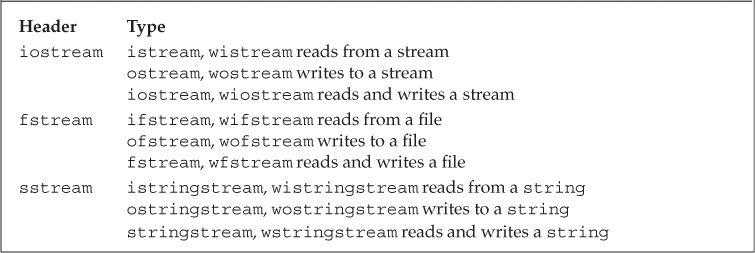

宽字符版本的IO类型和函数的名字以`w`开始，如`wcin`、`wcout`和`wcerr`分别对应`cin`、`cout`和`cerr`。它们与其对应的普通`char`版本都定义在同一个头文件中，如头文件`fstream`定义了`ifstream`和`wifstream`类型。

##### IO类型间的关系

标准库使我们进行IO操作时不用考虑不同类型的流之间的差异。这是通过**继承机制**(inheritance)实现的。【15】【18.3】会介绍C++如何支持继承机制的。

简单来说，我们可以声明一个特定类继承自另一个类，可以将派生类的对象当作其基类的对象使用。

#### 8.1.1 No Copy or Assign for IO Objects

IO对象无拷贝或赋值

```c++
ofstream out1, out2;
out1 = out2;    // error: cannot assign stream objects
ofstream print(ofstream);   // error: can't initialize the ofstream parameter
out2 = print(out2);     // error: cannot copy stream objects
```

由于IO对象不能拷贝，因此不能将函数形参或返回类型定义为流类型。进行IO操作的函数通常以引用方式传递和返回流。读写一个IO对象会改变其状态，因此传递和返回的引用不能是`const`的。****

#### 8.1.2 Condition States

IO库条件状态：


一个流一旦发生错误，其上后续的IO操作都会失败。

##### 查询流的状态

IO库定义了一个与机器无关的iostate类型，它提供了表达流状态的完整功能。IO库中定义了4个iostate类型的constexpr值。

`badbit`表示系统级错误，如不可恢复的读写错误。通常情况下，一旦`badbit`被置位，流就无法继续使用了。

在发生可恢复错误后，`failbit`会被置位，如期望读取数值却读出一个字符。如果到达文件结束位置，`eofbit`和`failbit`都会被置位。如果流未发生错误，则`goodbit`的值为0。如果`badbit`、`failbit`和`eofbit`任何一个被置位，检测流状态的条件都会失败。

```c++
while (cin >> word)
    // ok: read operation successful...
```

`good`函数在所有错误均未置位时返回`true`。而`bad`、`fail`和`eof`函数在对应错误位被置位时返回`true`。此外，在`badbit`被置位时，`fail`函数也会返回`true`。因此应该使用`good`或`fail`函数确定流的总体状态，`eof`和`bad`只能检测特定错误。

##### 管理条件状态

流对象的`rdstate`成员返回一个`iostate`值，表示流的当前状态。`setstate`成员用于将指定条件置位（叠加原始流状态）。`clear`成员的无参版本清除所有错误标志；含参版本接受一个`iostate`值，用于设置流的新状态（覆盖原始流状态）。

```c++
// remember the current state of cin
auto old_state = cin.rdstate();     // remember the current state of cin
cin.clear();    // make cin valid
process_input(cin);     // use cin
cin.setstate(old_state);    // now reset cin to its old state
```


#### 8.1.3 Managing the Output Buffer 管理输出缓冲

每个输出流都管理一个缓冲区，用于保存程序读写的数据。导致缓冲刷新（即数据真正写入输出设备或文件）的原因有很多：

- 程序正常结束。
- 缓冲区已满。
- 使用操纵符（如`endl`）显式刷新缓冲区。
- 在每个输出操作之后，可以用`unitbuf`操纵符设置流的内部状态，从而清空缓冲区。默认情况下，对`cerr`是设置`unitbuf`的，因此写到`cerr`的内容都是立即刷新的。
- 一个输出流可以被关联到另一个流。这种情况下，当读写被关联的流时，关联到的流的缓冲区会被刷新。默认情况下，`cin`和`cerr`都关联到`cout`，因此，读`cin`或写`cerr`都会刷新`cout`的缓冲区。

##### 刷新输出缓冲区

`flush`操纵符刷新缓冲区，但不输出任何额外字符。

`ends`向缓冲区插入一个空字符，然后刷新缓冲区。

```c++
cout << "hi!" << endl;   // writes hi and a newline, then flushes the buffer
cout << "hi!" << flush;  // writes hi, then flushes the buffer; adds no data
cout << "hi!" << ends;   // writes hi and a null, then flushes the buffer
```

##### unitbuf 操纵符

如果想在每次输出操作后都刷新缓冲区，可以使用`unitbuf`操纵符。它令流在接下来的每次写操作后都进行一次`flush`操作。而`nounitbuf`操纵符则使流恢复使用正常的缓冲区刷新机制。

```C++
cout << unitbuf;    // all writes will be flushed immediately
// any output is flushed immediately, no buffering
cout << nounitbuf;  // returns to normal buffering
```

##### 注意：如果程序异常终止，输出缓冲区不会被刷新。

所以在调试时，常常需要检查是无法正确输出还是卡在缓存区没输出来。

##### 关联输入和输出流

当一个输入流被关联到一个输出流时，任何试图从输入流读取数据的操作都会先刷新关联的输出流。标准库将`cout`和`cin`关联在一起，因此下面的语句会导致`cout`的缓冲区被刷新：

```c++
cin >> ival;
```

交互式系统通常应该关联输入流和输出流。这意味着包括用户提示信息在内的所有输出，都会在读操作之前被打印出来。

使用`tie`函数可以关联两个流。它有两个重载版本：无参版本返回指向输出流的指针。如果本对象已关联到一个输出流，则返回的就是指向这个流的指针，否则返回空指针。`tie`的第二个版本接受一个指向`ostream`的指针，将本对象关联到此`ostream`。

```c++
cin.tie(&cout);     // illustration only: the library ties cin and cout for us
// old_tie points to the stream (if any) currently tied to cin
ostream *old_tie = cin.tie(nullptr); // cin is no longer tied
// ties cin and cerr; not a good idea because cin should be tied to cout
cin.tie(&cerr);     // reading cin flushes cerr, not cout
cin.tie(old_tie);   // reestablish normal tie between cin and cout
```

每个流同时最多关联一个流，但多个流可以同时关联同一个`ostream`。向`tie`传递空指针可以解开流的关联。

### 8.2 File Input and Output

头文件`fstream`定义了三个类型来支持文件IO：`ifstream`从给定文件读取数据，`ofstream`向指定文件写入数据，`fstream`可以同时读写指定文件。

可以通过IO操作符`<<` `>>`来读写文件，可以通过getline从ifstream读取数据。

**fstream特有的一些操作**


### 

#### 8.2.1 Using File Stream Objects

每个文件流类型都定义了`open`函数，它完成一些系统操作，定位指定文件，并视情况打开为读或写模式。

创建文件流对象时，如果提供了文件名（可选），`open`会被自动调用。

```C++
ifstream in(ifile);   // construct an ifstream and open the given file
ofstream out;   // output file stream that is not associated with any file
```

在C++11中，文件流对象的文件名可以是`string`对象或C风格字符数组。旧版本的标准库只支持C风格字符数组。

##### 用fstream代替iostream&

在要求使用基类对象的地方，可以用继承类型的对象代替。因此一个接受`iostream`类型引用或指针参数的函数，可以用对应的`fstream`类型来调用。

```c++
ifstream input(argv[1]);			// 打开销售记录文件
ofstream output(argv[2]);			// 打开输出文件
Sales_data total;					// 保存销售总额的变量
if(read(input,total)) {
    Sales_data trans;
    while(read(input,trans)) {
        if(total.isbn() == trans.isbn())
            total.combine(trans);
        else {
            print(output,total) << endl;		// 注意，endl 换行同样会写入文件，因为print 返
            									// 回的仍然是 output
            total = trans;
        }
    }
    print(output,total) << endl;
} else 
    cerr << "No data?!" << endl;

// read 与 print
istream &read(istream &is,Sales_data &item) {
    double price = 0;							// price 表示某书单价
    is >> item.bookNo >> item.units_sold >> price;
    item.revenue = price * item.units_sold;
    return is;
}
ostream &print(ostream &os,const Sales_data &item) {
    os << item.isbn() << " " << item.units_sold << " "
       << item.revenue << " " << item.avg_price();
    return os;
}

```


> 当用&引用的方式进行值传递时，就相当将自己阉割成父类对象的样子，即将只属于自己的那一部分割去。然后将剩下的这一部分当作实参传递给函数。
>
> https://blog.csdn.net/weixin_45590473/article/details/108328192


##### 成员函数open和close

可以先定义空文件流对象，再调用`open`函数将其与指定文件关联。如果`open`调用失败，`failbit`会被置位。

**检测文件是否正常打开，是个好习惯**

对一个已经打开的文件流调用`open`会失败，并导致`failbit`被置位。随后试图使用文件流的操作都会失败。如果想将文件流关联到另一个文件，必须先调用`close`关闭当前文件，再调用`clear`重置流的条件状态（`close`不会重置流的条件状态）。

##### 自动构造和析构

当`fstream`对象被销毁时，`close`会自动被调用。

#### 8.2.2 File Modes

每个流都有一个关联的文件模式，用来指出如何使用文件。


我们在很多地方都可以指定文件格式，调用open打开文件时可以。用一个文件名初始化流来隐式打开文件时也可以。指定文件模式有以下限制。

- 只能对`ofstream`或`fstream`对象设定`out`模式。

- 只能对`ifstream`或`fstream`对象设定`in`模式。

- 只有当`out`被设定时才能设定`trunc`模式。

- 只要`trunc`没被设定，就能设定`app`模式。在`app`模式下，即使没有设定`out`模式，文件也是以输出方式打开。

- 默认情况下，即使没有设定`trunc`，以`out`模式打开的文件也会被截断。如果想保留以`out`模式打开的文件内容，就必须同时设定`app`模式，这会将数据追加写到文件末尾；或者同时设定`in`模式，即同时进行读写操作。

- `ate`和`binary`模式可用于任何类型的文件流对象，并可以和其他任何模式组合使用。

- 与`ifstream`对象关联的文件默认以`in`模式打开，与`ofstream`对象关联的文件默认以`out`模式打开，与`fstream`对象关联的文件默认以`in`和`out`模式打开。

默认情况下，打开`ofstream`对象时，文件内容会被丢弃，阻止文件清空的方法是同时指定`app`或`in`模式。

流对象每次打开文件时都可以改变其文件模式。

```c++
ofstream out;   // no file mode is set
out.open("scratchpad");    // mode implicitly out and trunc
out.close();    // close out so we can use it for a different file
out.open("precious", ofstream::app);   // mode is out and app 输出和追加
out.close();
```

第一个open 调用未显式指定输出模式，文件隐式地以out模式打开。一般地 ， out 模式同时使用trunc模式。

除非使用append模式，否则文件内容将被情况。

### 8.3 string Streams

头文件`sstream`定义了三个类型来支持内存IO：`istringstream`从`string`读取数据，`ostringstream`向`string`写入数据，`stringstream`可以同时读写`string`的数据。使得string就好像一个IO流一样。

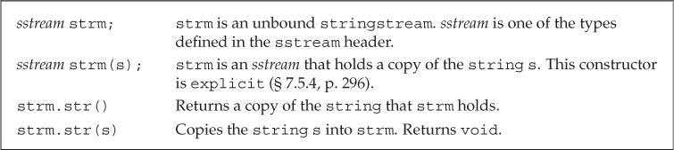

#### 8.3.1 Using an istringstream

### 使用istringstream（Using an istringstream）

```c++
// members are public by default
struct PersonInfo
{
    string name;
    vector<string> phones;
};

string line, word;   // will hold a line and word from input, respectively
vector<PersonInfo> people;    // will hold all the records from the input
// read the input a line at a time until cin hits end-of-file (or another error)
while (getline(cin, line))
{
    PersonInfo info;    // create an object to hold this record's data
    istringstream record(line);    // bind record to the line we just read
    record >> info.name;    // read the name
    while (record >> word)  // read the phone numbers
        info.phones.push_back(word);   // and store them
    people.push_back(info);    // append this record to people
}
```


> 流插入,流提取运算符重载和类型转换的讲解和实例
>
> https://bbs.huaweicloud.com/blogs/271271
>
> ```c++
> template<typename _Traits>
> inline basic_ostream<char, _Traits>&
> operator<<(basic_ostream<char, _Traits>& ___out, const char* __s)
> {
> if (!__s)
> 	___out.setstate(ios_base::badbit);
> else
> 	__ostream_insert(___out, __s,
> 			 static_cast<streamsize>(_Traits::length(__s)));
> return ___out;
> }
> ```
>
> <<的模板源码，在ostream600行左右，目前来看它可以过滤掉空格，回头等学完模板来研究一下。

#### 8.3.2 Using ostringstreams

### 使用ostringstream（Using ostringstreams）

对文本文件，进行构造后（修改，判断等操作），最后一起打印时，ostringstream很好用。

```C++
for (const auto &entry : people)
{ // for each entry in people
    ostringstream formatted, badNums;   // objects created on each loop
    for (const auto &nums : entry.phones)
    { // for each number
        if (!valid(nums))
        {
            badNums << " " << nums;  // string in badNums
        }
        else
            // ''writes'' to formatted's string
            formatted << " " << format(nums);
    }

    if (badNums.str().empty())   // there were no bad numbers
        os << entry.name << " "  // print the name
            << formatted.str() << endl;   // and reformatted numbers
    else  // otherwise, print the name and bad numbers
        cerr << "input error: " << entry.name
            << " invalid number(s) " << badNums.str() << endl;
}
```


### Chapter Summary 

C++使用标准库来处理面向流的输入和输出。

- iostream处理控制台IO
- fstream处理命名文件IO
- stringstream处理内存String的IO

fstream 以及stringstream都继承自iostream

### Defined Terms

| 中文     | 英文            | 含义                                                         |
| -------- | --------------- | ------------------------------------------------------------ |
| 条件状态 | condition state | 可被任何流类使用的一组标志和函数，用来指出给定流是否可用     |
| 文件流   | file stream     | 用来读写命名文件的流对象。                                   |
|          | open            | 接受一个string或C风格字符串参数，指定要打开的文件名，它还可以接受一个可选的参数。指明文件打开模式 |
|          | close           | 关闭流所关联的文件，调用close后才可以调用open打开另一个文件。 |
|          |                 |                                                              |
|          |                 |                                                              |
|          |                 |                                                              |
|          |                 |                                                              |


## Chapter 9 Sequential Containers

一个容器就是一些特定类型对象的集合。

顺序容器为程序员提供了控制元素存储和访问顺序的能力。这种顺序不依赖于元素的值，而是和元素加入容器的位置相对应。

### 9.1 Overview of the Sequential Containers

所有的顺序都提供了快速顺序访问元素的能力。但是这些容器在以下方面都有不同的性能折中。

- 向容器添加或从容器中删除元素的代价
- 非顺序访问容器中元素的代价

顺序容器类型：


|      类型      |                             特性                             |
| :------------: | :----------------------------------------------------------: |
|    `vector`    | 可变大小数组。支持快速随机访问。在尾部之外的位置插入/删除元素可能很慢 |
|    `deque`     |   双端队列。支持快速随机访问。在头尾位置插入/删除速度很快    |
|     `list`     | 双向链表。只支持双向顺序访问。在任何位置插入/删除速度都很快  |
| `forward_list` | 单向链表。只支持单向顺序访问。在任何位置插入/删除速度都很快  |
|    `array`     |      固定大小数组。支持快速随机访问。不能添加/删除元素       |
|    `string`    | 类似`vector`，但用于保存字符。支持快速随机访问。在尾部插入/删除速度很快 |

`forward_list`和`array`是C++11新增类型。与内置数组相比，`array`更安全易用。

为了避免开销，`forward_list`没有`size`操作。


#### 容器选择原则：

- 除非有合适的理由选择其他容器，否则应该使用`vector`。

- 如果程序有很多小的元素，且空间的额外开销很重要，则不要使用`list`或`forward_list`。

- 如果程序要求随机访问容器元素，则应该使用`vector`或`deque`。

- 如果程序需要在容器头尾位置插入/删除元素，但不会在中间位置操作，则应该使用`deque`。

- 如果程序只有在读取输入时才需要在容器中间位置插入元素，之后需要随机访问元素。则：

  - 先确定是否真的需要在容器中间位置插入元素。当处理输入数据时，可以先向`vector`追加数据，再调用标准库的`sort`函数重排元素，从而避免在中间位置添加元素。

  - 如果必须在中间位置插入元素，可以在输入阶段使用`list`。输入完成后将`list`中的内容拷贝到`vector`中。

- 不确定应该使用哪种容器时，可以先只使用`vector`和`list`的公共操作：使用迭代器，不使用下标操作，避免随机访问。这样在必要时选择`vector`或`list`都很方便。

### 9.2 Container Library Overview

这一节，会介绍适用于所有容器的操作。

每个容器都定义在一个头文件中，文件名与类型名相同。容器均为模板类型。


#### 9.2.1 Iterators 迭代器

类似容器，迭代器有着公共的接口：如果一个迭代器提供某个操作，那么所有提供相同操作的迭代器度这个操作的实现方式都是相同的。例如访问容器元素（解引用），递增运算符等等。

##### 标准迭代器支持的操作


`PS：forward_list`类型不支持递减运算符`--`。

##### 标准迭代器支持的算术运算

这些运算只支持`string`,`vector`,`deque`,`array`的迭代器。


##### 迭代器范围

**迭代器的范围是标准库的基础**

一个迭代器范围（iterator range）由一对迭代器表示。

这两个迭代器通常被称为`begin`和`end`，分别指向同一个容器中的元素或尾后地址。

`end`迭代器不会指向范围中的最后一个元素，而是指向尾元素之后的位置。这种元素范围被称为左闭合区间（left-inclusive interval），其标准数学描述为`[begin，end）`。迭代器`begin`和`end`必须指向相同的容器，`end`可以与`begin`指向相同的位置，但不能指向`begin`之前的位置（由程序员确保）。

##### 左闭合范围蕴含的编程假定

假定`begin`和`end`构成一个合法的迭代器范围，则：

- 如果`begin`等于`end`，则范围为空。

- 如果`begin`不等于`end`，则范围内至少包含一个元素，且`begin`指向该范围内的第一个元素。

- 可以递增`begin`若干次，令`begin`等于`end`。

```c++
while (begin != end)
{
    *begin = val;   // ok: range isn't empty so begin denotes an element
    ++begin;    // advance the iterator to get the next element
}
```


#### 9.2.2 Container Type Members

部分容器还提供反向迭代器（++就是--）【10.4.3】会介绍。

通过类型别名，可以在不了解容器元素类型的情况下使用元素。如果需要元素类型，可以使用容器的`value_type`。如果需要元素类型的引用，可以使用`reference`或`const_reference`。

> 这里我还疑惑，为什么要搞这个东西，比如`vector<int>::value_type x;`其实就是`int x`，这不是脱裤子放屁吗？但是稍微查了下，就发现这实际上是提供了一层抽象。
>
> > ```c++
> > typedef _Vector_base<_Tp, _Alloc>			_Base;
> > typedef typename _Base::_Tp_alloc_type		_Tp_alloc_type;
> > typedef __gnu_cxx::__alloc_traits<_Tp_alloc_type>	_Alloc_traits;
> > public:
> > typedef _Tp              value_type;
> > typedef typename _Base::pointer        pointer;
> > typedef typename _Alloc_traits::const_pointer    const_pointer;
> > typedef typename _Alloc_traits::reference       reference;
> > typedef typename _Alloc_traits::const_reference  const_reference;
> > ```
>
> 底层是用typedef _Tp来做的，所以实际上和`typedef double _DBX32`没啥区别。
>
> 都是为了方便后面的操作，比如改一下容器内部类型，不必一个个去修改变量前的类型名。
>
> 在模板里面肯定有更多的应用。

#### 9.2.3 begin and end Members

`begin`和`end`操作生成指向容器中第一个元素和尾后地址的迭代器。其常见用途是形成一个包含容器中所有元素的迭代器范围。

`begin`和`end`操作有多个版本：带`r`的版本返回反向迭代器。以`c`开头的版本（C++11新增）返回`const`迭代器。不以`c`开头的版本都是重载的，当对非常量对象调用这些成员时，返回普通迭代器，对`const`对象调用时，返回`const`迭代器。

```c++
list<string> a = {"Milton", "Shakespeare", "Austen"};
auto it1 = a.begin();    // list<string>::iterator
auto it2 = a.rbegin();   // list<string>::reverse_iterator
auto it3 = a.cbegin();   // list<string>::const_iterator
auto it4 = a.crbegin();  // list<string>::const_reverse_iterator
```

当`auto`与`begin`或`end`结合使用时，返回的迭代器类型依赖于容器类型。但调用以`c`开头的版本仍然可以获得`const`迭代器，与容器是否是常量无关。

当程序不需要写操作时，应该使用`cbegin`和`cend`。

#### 9.2.4 Defining and Initializing a Container 容器初始化

每个容器都有对应的构造函数，除了array之外，其他容器的默认构造函数都会创建一个指定类的空容器，也可以接受指定容器大小和元素初始值的参数。

容器定义和初始化方式：


##### 将一个容器初始化为另一个容器的拷贝

将一个容器初始化为另一个容器的拷贝时，两个容器的容器类型和元素类型都必须相同。

传递迭代器参数来拷贝一个范围时，不要求容器类型相同，而且新容器和原容器中的元素类型也可以不同，但是要能进行类型转换。

```c++
// each container has three elements, initialized from the given initializers
list<string> authors = {"Milton", "Shakespeare", "Austen"};
vector<const char*> articles = {"a", "an", "the"};
list<string> list2(authors);        // ok: types match
deque<string> authList(authors);    // error: container types don't match
vector<string> words(articles);     // error: element types must match
// ok: converts const char* elements to string
forward_list<string> words(articles.begin(), articles.end());
```

##### 列表初始化

C++11允许对容器进行列表初始化。

```c++
// each container has three elements, initialized from the given initializers
list<string> authors = {"Milton", "Shakespeare", "Austen"};
vector<const char*> articles = {"a", "an", "the"};
```

##### 与顺序容器大小相关的构造函数

```c++
vector<int> ivec(10,-1);
list<string>svec(10,"hi");
forward_list<int>ivec(10);	//10个空元素，每个都是0
deque<string> svec(10);  //10个空元素，都是空string
```

如果元素没有默认构造参数，除了元素大小外，必须制定一个显式的初始值。

注: 只有顺序容器的构造函数才接受大小参数，关联容器并不支持

##### 标准库array具有固定大小 

定义和使用`array`类型时，需要同时指定元素类型和容器大小。

```c++
array<int, 42>      // type is: array that holds 42 ints
array<string, 10>   // type is: array that holds 10 strings
array<int, 10>::size_type i;   // array type includes element type and size
array<int>::size_type j;       // error: array<int> is not a type
```

对`array`进行列表初始化时，初始值的数量不能大于`array`的大小。如果初始值的数量小于`array`的大小，则只初始化靠前的元素，剩余元素会被值初始化。如果元素类型是类类型，则该类需要一个默认构造函数。

可以对`array`进行拷贝或赋值操作，但要求二者的元素类型和大小都相同。

#### 9.2.5 Assignment and swap

容器赋值操作：


##### 使用assign（仅顺序容器）

赋值运算符两侧的运算对象必须类型相同。`assign`允许用不同但相容的类型赋值，或者用容器的子序列赋值。

```c++
list<string> names;
vector<const char*> oldstyle;
names = oldstyle;   // error: container types don't match
// ok: can convert from const char*to string
names.assign(oldstyle.cbegin(), oldstyle.cend());
```

由于其旧元素被替换，因此传递给`assign`的迭代器不能指向调用`assign`的容器本身。

assign的第二个版本接受一个整型值和一个元素值，它用指定数目且具有相同给定元素替换容器中原有的元素

```c++
list<string>alist1(1);
alist1.assign(10,"hello"); // 十个hello
```


##### 使用swap

`swap`交换两个相同类型容器的内容。除`array`外，`swap`不对任何元素进行拷贝、删除或插入操作，只交换两个容器的内部数据结构，因此可以保证快速完成。

```c++
vector<string> svec1(10);   // vector with ten elements
vector<string> svec2(24);   // vector with 24 elements
swap(svec1, svec2);
```

赋值相关运算会导致指向左边容器内部的迭代器、引用和指针失效。而`swap`操作交换容器内容，不会导致迭代器、引用和指针失效（`array`和`string`除外）。

**对于`array`，`swap`会真正交换它们的元素**。因此在`swap`操作后，指针、引用和迭代器所绑定的元素不变，但元素值已经被交换。

> std::array直接将数据保存在对象自身里，并不通过指针来间接访问。被保存的对象不是被管理的资源，而是array类本身的data member，没得“交换指针”。想自己做成交换指针也做不成。

```c++
array<int, 3> a = { 1, 2, 3 };
array<int, 3> b = { 4, 5, 6 };
auto p = a.cbegin(), q = a.cend();
a.swap(b);
// 输出交换后的值，即4、5、6
while (p != q)
{
    cout << *p << endl;
    ++p;
}
```

对于其他容器类型（除`string`），指针、引用和迭代器在`swap`操作后仍指向操作前的元素，但这些元素已经属于不同的容器了。

```c++
vector<int> a = { 1, 2, 3 };
vector<int> b = { 4, 5, 6 };
auto p = a.cbegin(), q = a.cend();
a.swap(b);
// 输出交换前的值，即1、2、3
while (p != q)
{
    cout << *p << endl;
    ++p;
}
```

`array`不支持`assign`，也不允许用花括号列表进行赋值。

```c++
array<int, 10> a1 = {0,1,2,3,4,5,6,7,8,9};
array<int, 10> a2 = {0};    // elements all have value 0
a1 = a2;    // replaces elements in a1
a2 = {0};   // error: cannot assign to an array from a braced list
```

新标准库同时提供了成员和非成员函数版本的`swap`。非成员版本的`swap`在泛型编程中非常重要，建议统一使用非成员版本的`swap`。

#### 9.2.6 Container Size Operations

`size`成员返回容器中元素的数量；`empty`当`size`为0时返回`true`，否则返回`false`；`max_size`返回一个大于或等于该类型容器所能容纳的最大元素数量的值。`forward_list`支持`max_size`和`empty`，但不支持`size`。

#### 9.2.7 Relational Operators

每个容器类型都支持相等运算符（`==`、`!=`）。除无序关联容器外，其他容器都支持关系运算符（`>`、`>=`、`<`、`<=`）。关系运算符两侧的容器类型和保存元素类型都必须相同。

两个容器的比较实际上是元素的逐对比较，其工作方式与`string`的关系运算符类似：

- 如果两个容器大小相同且所有元素对应相等，则这两个容器相等。

- 如果两个容器大小不同，但较小容器中的每个元素都等于较大容器中的对应元素，则较小容器小于较大容器。

- 如果两个容器都不是对方的前缀子序列，则两个容器的比较结果取决于第一个不等元素的比较结果。

```c++
vector<int> v1 = { 1, 3, 5, 7, 9, 12 };
vector<int> v2 = { 1, 3, 9 };
vector<int> v3 = { 1, 3, 5, 7 };
vector<int> v4 = { 1, 3, 5, 7, 9, 12 };
v1 < v2     // true; v1 and v2 differ at element [2]: v1[2] is less than v2[2]
v1 < v3     // false; all elements are equal, but v3 has fewer of them;
v1 == v4    // true; each element is equal and v1 and v4 have the same size()
v1 == v2    // false; v2 has fewer elements than v1
```

容器的相等运算符实际上是使用元素的`==`运算符实现的，而其他关系运算符则是使用元素的`<`运算符。如果元素类型不支持所需运算符，则保存该元素的容器就不能使用相应的关系运算。

### 9.3 Sequential Container Operations

顺序容器与关联容器的不同之处在于两者组织元素的方式，上一节介绍了所以元素都适用的操作，这一章将介绍顺序容器特有的操作。

#### 9.3.1 Adding Elements to a Sequential Container

除`array`外（因为这些操作会改变容器大小），所有标准库容器都提供灵活的内存管理，在运行时可以动态添加或删除元素。


**向一个vector、string、deque插入元素会使所以指向容器的迭代器，引用和指针失效**

根本原因是因为插入元素可能会引起内存空间的重新分配，可能会搬到新的空间去。自然就失效了。

> 向容器添加元素后：
>
> 1.对于vector 或者 string
> 如果存储空间被重新分配，则指向容器的迭代器，指针和引用都会失效。
> 如果存储空间未重新分配，指向插入位置之前元素的迭代器，指针和引用仍有效，但指向存在的元素的引用和指针不会失效。
>
> 2.对于deque
> 插入到除首尾位置之外的任何位置都会导致迭代器，指针和引用失效。
> 如果在首尾位置添加元素，迭代器会失效，但指向存在的元素的指针和引用不会失效。
>
> 3.对于list和forward_list
> 指向容器的迭代器（包括尾后迭代器和首前迭代器），指针和引用仍有效。
>
> 当我们从一个容器中删除元素后，指向被删除元素的迭代器，指针和引用会失效，这应该不会令人惊讶。毕竟，这些元素都已经被销毁了。当我们删除一个元素后：
>
> 1.对于list和forward_list
> 指向容器其它位置的迭代器，引用和指针仍有效。
>
> 2.对于deque
> 如果在首尾之外的任何位置删除元素，那么指向被删除元素外的其它元素的迭代器，引用和指针都会失效。
>
> 如果删除deque的尾元素，则尾后迭代器也会失效，但其它迭代器，指针和引用不受影响；如果删除首元素，这些也不会受影响。
>
> 3.对于vector和string
> 指向被删元素之前的迭代器，引用和指针仍有效。
>
> 注意：使用失效的迭代器，指针或引用是严重的运行时错误。因此必须保证每次改变容器的操作之后都正确的重新定位迭代器。这个建议对于vector,string和deque尤为重要。
> ————————————————
> 版权声明：本文为CSDN博主「拥抱@」的原创文章，遵循CC 4.0 BY-SA版权协议，转载请附上原文出处链接及本声明。
> 原文链接：https://blog.csdn.net/tonglin12138/article/details/88359618

##### push_back

`push_back`将一个元素追加到容器尾部，`push_front`将元素插入容器头部。

```c++
// read from standard input, putting each word onto the end of container
string word;
while (cin >> word)
    container.push_back(word);
```

##### push_front

list,forward_list,deque容器还支持push_front 插入容器头部。

##### insert 在特定位置添加元素

`insert`将元素插入到迭代器指定的位置之前。一些不支持`push_front`的容器可以使用`insert`将元素插入开始位置。

```c++
vector<string> svec;
list<string> slist;
// equivalent to calling slist.push_front("Hello!");
slist.insert(slist.begin(), "Hello!");
// no push_front on vector but we can insert before begin()
// warning: inserting anywhere but at the end of a vector might be slow
svec.insert(svec.begin(), "Hello!");
```

将元素插入到`vector`、`deque`或`string`的任何位置都是合法的，但可能会很耗时。

##### insert 插入范围内元素

insert 还可以接受更多的参数。

- 接受一个元素数目和一个值，将指定数量的元素添加到指定位置之前，且按照给定值初始化。
- 接受一对迭代器或一个初始化列表的insert，将给定范围中的元素插入到指定位置之前。

```c++
vector<string> v = {"quasi","simba","Lforl","fas"};
list<string> slist;
slist.insert(slist.begin(),v.end()-2,v.end());
slist.insert(slist.end(),{"a","b","v","d"});
```

在新标准库中，接受元素个数或范围的`insert`版本返回指向第一个新增元素的迭代器，而旧版本中这些操作返回`void`。如果范围为空，不插入任何元素，`insert`会返回第一个参数。

##### insert 使用insert返回值

```c++
list<string> 1st;
auto iter = 1st.begin();
while (cin >> word)
    iter = 1st.insert(iter, word);  // same as calling push_front
```

将读入的新元素插入iter所指向的元素之前的位置，insert返回的迭代器恰好指向这个新元素，如此重复循环。

##### 使用emplace

新标准库增加了三个直接构造而不是拷贝元素的操作：`emplace_front`、`emplace_back`和`emplace`，其分别对应`push_front`、`push_back`和`insert`。当调用`push`或`insert`时，元素对象被拷贝到容器中。而调用`emplace`时，则是将参数传递给元素类型的构造函数，直接在容器的内存空间中构造元素。

```c++
// construct a Sales_data object at the end of c
// uses the three-argument Sales_data constructor
c.emplace_back("978-0590353403", 25, 15.99);
// error: there is no version of push_back that takes three arguments
c.push_back("978-0590353403", 25, 15.99);
// ok: we create a temporary Sales_data object to pass to push_back
c.push_back(Sales_data("978-0590353403", 25, 15.99));
```

传递给`emplace`的参数必须与元素类型的构造函数相匹配。


注：

- `forward_list`有特殊版本的`insert`和`emplace`操作，且不支持`push_back`和`emplace_back`。

- `vector`和`string`不支持`push_front`和`emplace_front`。

#### 9.3.2 Accessing Elements 访问元素

包括`array`在内， 每个顺序容器都有一个`front`成员函数，而除了`forward_list`之外的顺序容器还有一个`back`成员函数。这两个操作分别返回首元素和尾元素的引用。

在调用`front`和`back`之前，要确保容器非空。

顺序容器的元素访问操作：

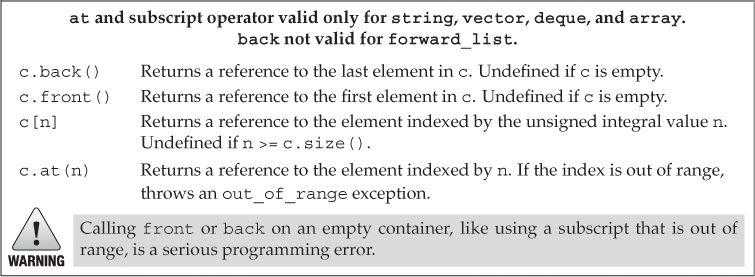

##### 访问成员函数返回的是引用

在容器中访问元素的成员函数都返回引用类型。如果容器是`const`对象，则返回`const`引用，否则返回普通引用。如果希望修改容器内的值，应该使用引用来取。

```c++
if (!c.empty()) {
	c.front() = 42; // assigns 42 to the first element in c
	auto &v = c.back(); // get a reference to the last element
	v = 1024; // changes the element in c
	auto v2 = c.back(); // v2 is not a reference; it’s a copy of c.back()
	v2 = 0; // no change to the element in c
}
```

##### 下标访问和安全的随机访问

可以快速随机访问的容器（`string`、`vector`、`deque`和`array`）都提供下标运算符。保证下标有效是程序员的责任。如果希望确保下标合法，可以使用`at`成员函数。

`at`类似下标运算，但如果下标越界，`at`会抛出`out_of_range`异常。

```c++
vector<string> svec;  // empty vector
cout << svec[0];      // run-time error: there are no elements in svec!
cout << svec.at(0);   // throws an out_of_range exception
```


#### 9.3.3 Erasing Elements

顺序容器的元素删除操作：


删除`deque`中除首尾位置之外的任何元素都会使所有迭代器、引用和指针失效。删除`vector`或`string`的元素后，指向删除点之后位置的迭代器、引用和指针也都会失效。

删除元素前，程序员必须确保目标元素存在。

`pop_front`和`pop_back`函数分别删除首元素和尾元素。`vector`和`string`类型不支持`pop_front`，`forward_list`类型不支持`pop_back`。

`erase`函数删除指定位置的元素。可以删除由一个迭代器指定的单个元素，也可以删除由一对迭代器指定的范围内的所有元素。两种形式的`erase`都返回指向删除元素（最后一个）之后位置的迭代器。

```c++
// delete the range of elements between two iterators
// returns an iterator to the element just after the last removed element
elem1 = slist.erase(elem1, elem2);  // after the call elem1 == elem2
```

`clear`函数删除容器内的所有元素。

#### 9.3.4 Specialized forward_list Operations

在`forward_list`中添加或删除元素的操作是通过改变给定元素之后的元素来完成的。

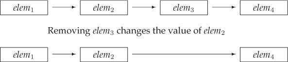

`forward_list`的插入和删除操作：


当在forward_list中添加或删除元素时，我们必须关注两个迭代器--一个指向我们要处理的元素，另一个指向其前驱。

```c++
forward_list<int> flst = {0,1,2,3,4,5,6,7,8,9};
auto prev = flst.before_begin(); // denotes element "off the start" of flst
auto curr = flst.begin(); // denotes the first element in flst
while (curr != flst.end()) { // while there are still elements to process
	if (*curr % 2) // if the element is odd
		curr = flst.erase_after(prev); // erase it and move curr
	else {
		prev = curr; // move the iterators to denote the next
		++curr; // element and one before the next element
		}
}
```


#### 9.3.5 Resizing a Container

`array` 不支持resize，当前大小大了，截取；当前大小小了，填充新元素。

顺序容器的大小操作：


`resize`函数接受一个可选的元素值参数，用来初始化添加到容器中的元素，否则新元素进行值初始化。如果容器保存的是类类型元素，且`resize`向容器添加新元素，则必须提供初始值，或元素类型提供默认构造函数。

#### 9.3.6 Container Operations May Invalidate Iterators

向容器中添加或删除元素可能会使指向容器元素的指针、引用或迭代器失效。失效的指针、引用或迭代器不再表示任何元素，使用它们是一种严重的程序设计错误。

- 向容器中添加元素后：

  - 如果容器是`vector`或`string`类型，且存储空间被重新分配，则指向容器的迭代器、指针和引用都会失效。如果存储空间未重新分配，指向插入位置之前元素的迭代器、指针和引用仍然有效，但指向插入位置之后元素的迭代器、指针和引用都会失效。

  - 如果容器是`deque`类型，添加到除首尾之外的任何位置都会使迭代器、指针和引用失效。如果添加到首尾位置，则迭代器会失效，而指针和引用不会失效。

  - 如果容器是`list`或`forward_list`类型，指向容器的迭代器、指针和引用仍然有效。

- 从容器中删除元素后，指向被删除元素的迭代器、指针和引用失效：

  - 如果容器是`list`或`forward_list`类型，指向容器其他位置的迭代器、指针和引用仍然有效。

  - 如果容器是`deque`类型，删除除首尾之外的任何元素都会使迭代器、指针和引用失效。如果删除尾元素，则尾后迭代器失效，其他迭代器、指针和引用不受影响。如果删除首元素，这些也不会受影响。

  - 如果容器是`vector`或`string`类型，指向删除位置之前元素的迭代器、指针和引用仍然有效。但尾后迭代器总会失效。

**必须保证在每次改变容器后都正确地重新定位迭代器。**

```c++
vector<int> vi = {0,1,2,3,4,5,6,7,8,9};
auto iter = vi.begin(); // call begin, not cbegin because we’re changing vi
while (iter != vi.end()) {
	if (*iter % 2) {
		iter = vi.insert(iter, *iter); // duplicate the current element
		iter += 2; // advance past this element and the one inserted before it
	} else
		iter = vi.erase(iter); // remove even elements
		// don’t advance the iterator; iter denotes the element after the one we erased
}
```

这段程序的目的是删除偶数，复制奇数。

那么要注意erase后，迭代器指向序列下一个元素；insert在给定位置前插入新元素，insert后，迭代器指向新插入元素的迭代器，所以要+2，越过这两个，指向下一个未处理的元素。

**不要保存`end`函数返回的迭代器。**

因为很容易混乱。

```c++
// safer:在每个循环步骤添加/删除元素后都重新计算end
while (begin != v.end())
{
    // do some processing
    ++begin;    // advance begin because we want to insert after this element
    begin = v.insert(begin, 42);    // insert the new value
    ++begin;    // advance begin past the element we just added
}
```


### 9.4 How a vector Grows

为了快速随机访问,vector 将元素连续存储。

> 所谓“随机存取”，指的是当存储器中的消息被读取或写入时，所需要的时间与这段信息所在的位置无关。相对的，读取或写入顺序访问（SequentialAccess）存储设备中的信息时，其所需要的时间与位置就会有关系（如磁带）。

而为了避免扩容带来的频繁内存移动，`vector`和`string`的实现通常会分配比新空间需求更大的内存空间，容器预留这些空间作为备用，可用来保存更多新元素。

容器大小管理操作：

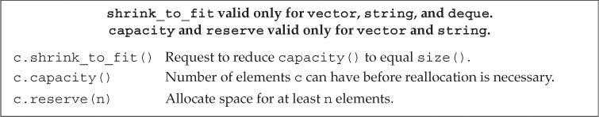

`capacity`函数返回容器在不扩充内存空间的情况下最多可以容纳的元素数量。`reserve`函数告知容器应该准备保存多少元素，它并不改变容器中元素的数量，仅影响容器预先分配的内存空间大小。


```c++
#include <iostream>
#include<vector>
using namespace std;
int main() {
    vector<int> a = {1,3,4};
    cout<<a.capacity()<<endl;
    cout<<a.size();
    cout<<endl;
    a.push_back(4);
    cout<<a.capacity()<<endl;
    cout<<a.size();
    cout<<endl;
    for(int i = 0;i<8;i++){
        a.push_back(4);
    }
    cout<<a.capacity()<<endl;
    cout<<a.size();
    cout<<endl;
    a.push_back(4);
    cout<<a.capacity()<<endl;
    cout<<a.size();
    return 0;
}

/*
3
3
6
4
12
12
24
13
*/
```

> 可以看到，当超出容器大小时，vector会扩容一倍

只有当需要的内存空间超过当前容量时，`reserve`才会真正改变容器容量，分配不小于需求大小的内存空间。当需求大小小于当前容量时，`reserve`并不会退回内存空间。因此在调用`reserve`之后，`capacity`会大于或等于传递给`reserve`的参数。

在C++11中可以使用`shrink_to_fit`函数来要求`deque`、`vector`和`string`退回不需要的内存空间（并不保证退回）。

### 9.5 Additional string Operations

#### 9.5.1 Other Ways to Construct strings 构建string的其他方法

构造`string`的其他三个构造函数：


这些构造函数接受一个string或一个const char* 参数。还接受（可选） 指定拷贝多少个字符的参数。

从另一个`string`对象拷贝字符构造`string`时，如果提供的拷贝开始位置（可选）大于给定`string`的大小，则构造函数会抛出`out_of_range`异常。

子字符串操作：


如果传递给`substr`函数的开始位置超过`string`的大小，则函数会抛出`out_of_range`异常。

#### 9.5.2 Other Ways to Change a string

修改`string`的操作：

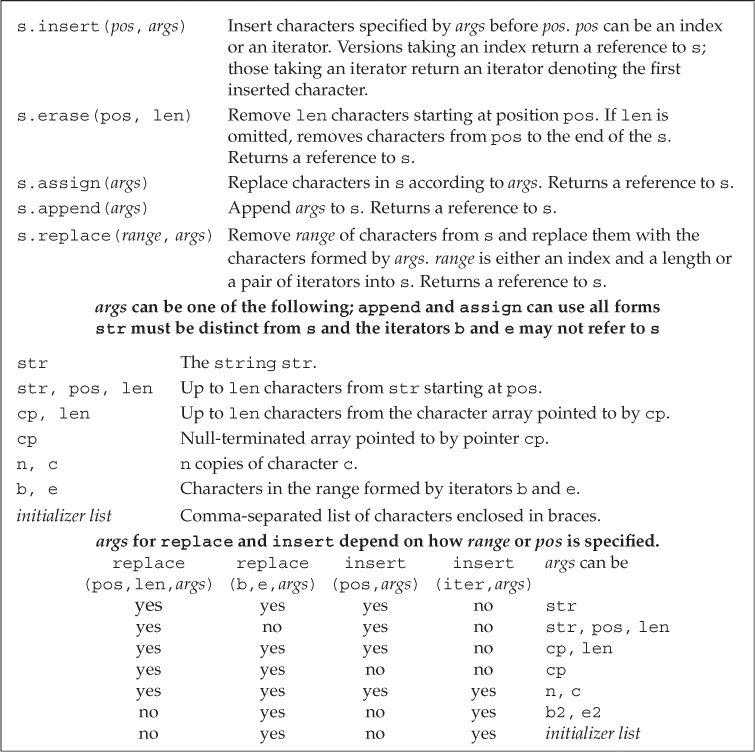

`append`函数是在`string`末尾进行插入操作的简写形式。

```c++
string s("C++ Primer"), s2 = s;     // initialize s and s2 to "C++ Primer"
s.insert(s.size(), " 4th Ed.");     // s == "C++ Primer 4th Ed."
s2.append(" 4th Ed.");     // equivalent: appends " 4th Ed." to s2; s == s2
```

`replace`函数是调用`erase`和`insert`函数的简写形式。

```c++
// equivalent way to replace "4th" by "5th"
s.erase(11, 3);         // s == "C++ Primer Ed."
s.insert(11, "5th");    // s == "C++ Primer 5th Ed."
// starting at position 11, erase three characters and then insert "5th"
s2.replace(11, 3, "5th");   // equivalent: s == s2
```

##### 改变string的多种重载函数

`append` `assign` `insert` `replace` 都有多个重载版本

- assign 和 append 无需指定要替换string中哪个部分，因为assign总是全部替换string，而append总是在string追加。

- replace函数提供两种删除元素方式的方法，可以通过一个位置和一个长度来指定范围，也可以通过一个迭代器范围来指定。
- insert函数允许我们用两个方式指定插入点：用一个下标或一个迭代器。这两种情况下，新元素都会插入到给定下标（或迭代器）之前的位置。

但是insert 不支持下标和初始化列表参数。如果我们希望使用迭代器指定插入点，就不能用字符指针来指定新字符的来源。

#### 9.5.3 string Search Operations

`string`的每个搜索操作都返回一个`string::size_type`值，表示匹配位置的下标。如果搜索失败，则返回一个名为`string::npos`的`static`成员。标准库将`npos`定义为`const string::size_type`类型，并初始化为-1。

不建议用`int`或其他带符号类型来保存`string`搜索函数的返回值。

`string`搜索操作：


#### 9.5.4 The compare Functions

`string`类型提供了一组`compare`函数进行字符串比较操作，类似C标准库的`strcmp`函数。

根据s是等于、大于还是小于参数指定的字符串，s.compare 返回0，正数或负数。

`compare`函数的几种参数形式：


#### 9.5.5 Numeric Conversions

C++11增加了`string`和数值之间的转换函数：


进行数值转换时，`string`参数的第一个非空白字符必须是符号（`+`或`-`）或数字。它可以以`0x`或`0X`开头来表示十六进制数。对于转换目标是浮点值的函数，`string`参数也可以以小数点开头，并可以包含`e`或`E`来表示指数部分。

如果给定的`string`不能转换为一个数值，则转换函数会抛出`invalid_argument`异常。如果转换得到的数值无法用任何类型表示，则抛出`out_of_range`异常。

### 9.6 Container Adaptors 适配器

标准库定义了`stack`、`queue`和`priority_queue`三种容器适配器。容器适配器可以改变已有容器的工作机制。

所有容器适配器都支持的操作和类型：


默认情况下，`stack`和`queue`是基于`deque`实现的，`priority_queue`是基于`vector`实现的。可以在创建适配器时将一个命名的顺序容器作为第二个类型参数，来重载默认容器类型。

```c++
// empty stack implemented on top of vector
stack<string, vector<string>> str_stk;
// str_stk2 is implemented on top of vector and initially holds a copy of svec
stack<string, vector<string>> str_stk2(svec);
```

所有适配器都要求容器具有添加和删除元素的能力，因此适配器不能构造在`array`上。适配器还要求容器具有添加、删除和访问尾元素的能力，因此也不能用`forward_list`构造适配器。

##### stack

栈适配器`stack`定义在头文件`stack`中，其支持的操作如下：


##### queue

队列适配器`queue`和`priority_queue`定义在头文件`queue`中，其支持的操作如下：


`queue`使用先进先出（first-in，first-out，FIFO）的存储和访问策略。进入队列的对象被放置到队尾，而离开队列的对象则从队首删除。

### Chapter Summary  

标准库容器是模板类型，用来保存给定类型的对象，在一个顺序容器中，元素是按顺序操作的。通过为止来访问，

除array外，所有的容器都提供高效的动态内存管理。不用关心元素存储位置。

当我们使用添加和删除元素的容器操作时，必须注意这些操作可能使得容器中的迭代器、指针、引用失效。

### Defined Terms

|    中文    |          英文           | 含义                                                         |
| :--------: | :---------------------: | ------------------------------------------------------------ |
|   适配器   |         adaptor         | 标准库类型、函数或迭代器，他们接受一个类型、函数或迭代器，使其行为像另外一个类型、函数或迭代器一样。 |
|  单向列表  |      forward_list       | forward_list的元素只能顺序访问，不支持--，与其他容器不同，插入和删除发生在给定的迭代器之后的位置。因此，除了通常的尾后迭代器外，它还有一个首前迭代器。在添加新元素后，原有的指向forward_list的迭代器仍有效。在删除元素后，只有原来指向被删除元素的迭代器才会失效。 |
| 左闭合区间 | left-inclusive interval | 值范围，包含首元素，不包括尾元素。                           |
|            |                         |                                                              |
|            |                         |                                                              |
|            |                         |                                                              |
|            |                         |                                                              |
|            |                         |                                                              |


## Chapter 10 Generic Algorithms 泛型算法

标准库定义了一组泛型算法，来实现各种有用的操作。

称他们为算法，是因为它们实现了一些经典算法的公共接口，如排序和搜索

称他们为泛型，是因为他们可以用于不同类型的元素和多种容器类型

### 10.1 Overview

大多数算法都定义在头文件`algorithm`中，此外标准库还在头文件`numeric`中定义了一组数值泛型算法。一般情况下，这些算法并不直接操作容器，而是遍历由两个迭代器指定的元素范围进行操作。

`find`函数将范围中的每个元素与给定值进行比较，返回指向第一个等于给定值的元素的迭代器。如果无匹配元素，则返回其第二个参数来表示搜索失败。

```c++
int val = 42;   // value we'll look for
// result will denote the element we want if it's in vec, or vec.cend() if not
auto result = find(vec.cbegin(), vec.cend(), val);
// report the result
cout << "The value " << val
    << (result == vec.cend() ? " is not present" : " is present") << endl;
```

另外指针就像内置数组上的迭代器，可以用find在数组中查找值：

```c++
int ia[] = {27, 210, 12, 47, 109, 83};
int val = 83;
int* result = find(begin(ia), end(ia), val);
//还可以在序列的子范围中查找
auto result = find(ia+1,ia+4,val);
```

迭代器参数令算法不依赖于特定容器，但依赖于元素类型操作。比如需要容器提供例如`<` `==`的重载版本。

泛型算法本身不会执行容器操作，它们只会运行于迭代器之上，执行迭代器操作。算法可能改变容器中元素的值，或者在容器内移动元素，但不会改变底层容器的大小（当算法操作插入迭代器`insert`时，迭代器可以向容器中添加元素，但算法自身不会进行这种操作）。

### 10.2 A First Look at the Algorithms

除了少数例外，标准库算法都对一个范围内的元素进行操作。我们将此元素范围称为“输入范围”。一般用两个迭代器来实现。

了解一个算法，最基本的就是了解它们是否读取元素、改变元素或是重排元素。

#### 10.2.1 Read-Only Algorithms 只读算法

一些算法只读取范围内元素，而不进行操作，如`find` `count`。

##### accumulate  求和

`accumulate`函数（定义在头文件`numeric`中）用于计算一个序列的和。它接受三个参数，前两个参数指定需要求和的元素范围，第三个参数是和的初值（第三个参数的类型决定加法运算符和返回值类型）。

```c++
// sum the elements in vec starting the summation with the value 0
int sum = accumulate(vec.cbegin(), vec.cend(), 0);
string sum = accumulate(v.cbegin(), v.cend(), string(""));
// error: no + on const char* 简单使用空串是不行的，因为这种类型没有定义+运算符。
string sum = accumulate(v.cbegin(), v.cend(), "");
```

建议在只读算法中使用`cbegin`和`cend`函数。

##### equal 相等

`equal`函数用于确定两个序列是否保存相同的值。它接受三个迭代器参数，前两个参数指定第一个序列范围，第三个参数指定第二个序列的首元素。

`equal`函数假定第二个序列至少与第一个序列一样长。

```c++
// roster2 should have at least as many elements as roster1
equal(roster1.cbegin(), roster1.cend(), roster2.cbegin());
```

注：只接受单一迭代器表示第二个操作序列的算法都假定**第二个序列至少与第一个序列一样长**

#### 10.2.2 Algorithms That Write Container Elements 写算法

一些算法将新值赋予序列中的元素，这时候要注意，由于算法不会进行容器操作，不会改变容器大小，所以容器大小至少不小于我们要求写入的元素数目。

##### fill 填充

`fill`函数接受两个迭代器参数表示序列范围，还接受一个值作为第三个参数，它将给定值赋予范围内的每个元素。

```c++
// reset each element to 0
fill(vec.begin(), vec.end(), 0);
fill(vec.begin(), vec.begin() + vec.size()/2, 10);
```

`fill_n`函数接受单个迭代器参数、一个计数值和一个值，它将给定值赋予迭代器指向位置开始的指定个元素。

```c++
// reset all the elements of vec to 0
fill_n(vec.begin(), vec.size(), 0);
```

向目的位置迭代器写入数据的算法都假定目的位置**足够大**，能容纳要写入的元素。

##### 算法不检查写操作

最容易犯的错误就是在空容器上写。

##### back_inserter

插入迭代器（insert iterator）是一种向容器内添加元素的迭代器。通过插入迭代器赋值时，一个与赋值号右侧值相等的元素会被添加到容器中。【10.4.1】会详细介绍迭代器。

`back_inserter`函数（定义在头文件`iterator`中）接受一个指向容器的引用，返回与该容器绑定的插入迭代器。通过此迭代器赋值时，赋值运算符会调用`push_back`将一个具有给定值的元素添加到容器中。

```c++
vector<int> vec;    // empty vector
auto it = back_inserter(vec);   // assigning through it adds elements to vec
*it = 42;   // vec now has one element with value 42
// ok: back_inserter creates an insert iterator that adds elements to vec
fill_n(back_inserter(vec), 10, 0);  // appends ten elements to vec
```

```c++
#include <iostream>
#include<vector>
#include<iterator>
using namespace std;
int main() {
    vector<int> vec;
    auto it = back_inserter(vec);
    for(int i = 0;i<10;i++){
        *it = i;
    }
    for(auto it : vec){
        cout<<it<<" ";
    }
    return 0;
}
/*
0 1 2 3 4 5 6 7 8 9
*/
```

##### copy 拷贝

`copy`函数接受三个迭代器参数，前两个参数指定输入范围，第三个参数指定目的序列的起始位置。

它将输入序列中的元素拷贝到目的序列中，返回目的位置迭代器（递增后）的值。

```c++
int a1[] = { 0,1,2,3,4,5,6,7,8,9 };
int a2[sizeof(a1) / sizeof(*a1)];     // a2 has the same size as a1
// ret points just past the last element copied into a2
auto ret = copy(begin(a1), end(a1), a2);    // copy a1 into a2
```

`copy` 返回的是其目的位置迭代器（递增后）的值。ret恰好指向拷贝到a2的尾元素之后的位置。

##### replace

`replace`函数接受四个参数，前两个迭代器参数指定输入序列，后两个参数指定要搜索的值和替换值。它将序列中所有等于第一个值的元素都替换为第二个值。

```c++
// replace any element with the value 0 with 42
replace(ilst.begin(), ilst.end(), 0, 42);
```

相对于`replace`，`replace_copy`函数可以保留原序列不变。它接受第三个迭代器参数，指定调整后序列的保存位置。

```c++
// use back_inserter to grow destination as needed
replace_copy(ilst.cbegin(), ilst.cend(), back_inserter(ivec), 0, 42);
```

很多算法都提供“copy”版本，这些版本不会将新元素放回输入序列，而是创建一个新序列保存结果。

#### 10.2.3 Algorithms That Reorder Container Elements 重排容器元素的算法.

##### sort

`sort`函数接受两个迭代器参数，指定排序范围。它利用元素类型的`<`运算符重新排列元素。

```c++
void elimDups(vector<string> &words)
{
    // sort words alphabetically so we can find the duplicates
    sort(words.begin(), words.end());
    // unique reorders the input range so that each word appears once in the
    // front portion of the range and returns an iterator one past the unique range
    auto end_unique = unique(words.begin(), words.end());
    // erase uses a vector operation to remove the nonunique elements
    words.erase(end_unique, words.end());
}
```

##### unique

`unique`函数重排输入序列，消除相邻的重复项，返回指向不重复值范围末尾的迭代器。

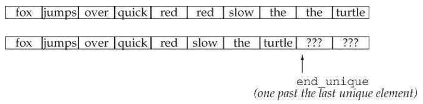

重复的元素并没有真的删除，而是通过迭代器限定范围将其屏蔽了。

##### 使用容器操作真正删除元素

本例使用了erase，而且用法比较规范，即使重复单词为空，也不会造成bug。

### 10.3 Customizing Operations 定制操作

默认情况下，很多算法会比较序列中的元素，这时候要使用元素类型的`<`或`==`运算符完成操作。

标准库允许我们可以为这些算法提供自定义操作来代替默认运算符。

#### 10.3.1 Passing a Function to an Algorithm

###### 谓词

谓词（predicate）是一个可调用的表达式，其返回结果是一个能用作条件的值。

标准库算法使用的谓词分为一元谓词（unary predicate，接受一个参数）和二元谓词（binary predicate，接受两个参数）。

接受谓词参数的算法会对输入序列中的元素调用谓词，因此元素类型必须能转换为谓词的参数类型。

```c++
// comparison function to be used to sort by word length
bool isShorter(const string &s1, const string &s2)
{
    return s1.size() < s2.size();
}

// sort on word length, shortest to longest
sort(words.begin(), words.end(), isShorter);
```

稳定排序函数`stable_sort`可以维持输入序列中相等元素的原有顺序。

> https://en.cppreference.com/w/cpp/algorithm/stable_sort
>
> ```c++
> #include <algorithm>
> #include <iostream>
> #include <string>
> #include <vector>
> 
> struct Employee
> {
>  int age;
>  std::string name;  // Does not participate in comparisons
> };
> 
> bool operator<(const Employee & lhs, const Employee & rhs)
> {
>  return lhs.age < rhs.age;
> }
> 
> int main()
> {
>  std::vector<Employee> v =
>  { 
>      {108, "Zaphod"},
>      {32, "Frthur"},
>      {32, "Arthur"},
>      {108, "Ford"},
>  };  
> 
>  std::stable_sort(v.begin(), v.end());
> 
>  for (const Employee & e : v)
>      std::cout << e.age << ", " << e.name << '\n';
> }
> 
> 
> /*
> 32, Frthur
> 32, Arthur
> 108, Zaphod
> 108, Ford
> */
> ```
>
> 简单来说，对于同名元素的排序后按照输入顺序。

#### 10.3.2 Lambda Expressions

`find_if`函数接受两个迭代器参数和一个谓词参数。迭代器参数用于指定序列范围，之后对序列中的每个元素调用给定谓词，并返回第一个使谓词返回非0值的元素。如果不存在，则返回尾迭代器。


##### 介绍lambda

对于一个对象或表达式，如果可以对其使用调用运算符`()`，则称它为可调用对象（callable object）。可以向算法传递任何类别的可调用对象。

> **可调用对象**
>
> - 函数
> - 函数指针
> - 重载了函数调用运算符的类 【14.8】
> - lambda表达式

一个`lambda`表达式表示一个可调用的代码单元，类似未命名的内联函数，但可以定义在函数内部。其形式如下：

```c++
[capture list] (parameter list) -> return type { function body }
```

其中，`capture list`（捕获列表）是一个由`lambda`所在函数定义的局部变量的列表（通常为空）。`return type`、`parameter list`和`function body`与普通函数一样，分别表示返回类型、参数列表和函数体。但与普通函数不同，`lambda`必须使用尾置返回类型，且不能有默认实参。

定义`lambda`时可以省略参数列表和返回类型，但必须包含捕获列表和函数体。省略参数列表等价于指定空参数列表。省略返回类型时，若函数体只是一个`return`语句，则返回类型由返回表达式的类型推断而来。否则返回类型为`void`。

```c++
auto f = [] { return 42; };
cout << f() << endl;    // prints 42
```

##### 向lambda 传递参数

与其他普通函数一样，调用lambda时放入的实参会用来初始化lambda的形参，实参与形参类型必须匹配。

但 lambda与普通函数不同，不能有默认参数。因此lambda的实参数量与形参数量必须相当。

##### 使用捕获列表

`lambda`可以使用其所在函数的局部变量，但必须先将其包含在捕获列表中。捕获列表只能用于局部非`static`变量，`lambda`可以直接使用局部`static`变量和其所在函数之外声明的名字。

```c++
// get an iterator to the first element whose size() is >= sz
auto wc = find_if(words.begin(), words.end(),
                    [sz](const string &a) { return a.size() >= sz; });
```

##### for_each 算法

`for_each`函数接受一个输入序列和一个可调用对象，它对输入序列中的每个元素调用此对象。

```c++
// print words of the given size or longer, each one followed by a space
for_each(wc, words.end(),
            [] (const string &s) { cout << s << " "; });
```

完整的代码

```c++
void biggies(vector<string> &words,vector<string>::size_type sz)
{
 elimDups(words); // put words in alphabetical order and remove
duplicates
 // sort words by size, but maintain alphabetical order for words of the same size
 stable_sort(words.begin(), words.end(), [](const string &a, const string &b) { return a.size() < b.size();});
 // get an iterator to the first element whose size() is >= sz
 auto wc = find_if(words.begin(), words.end(), [sz](const string &a) { return a.size() >= sz; });
 // compute the number of elements with size >= sz
 auto count = words.end() - wc; cout << count << " " << make_plural(count, "word", "s") << " of length " << sz << " or longer" << endl;
 // print words of the given size or longer, each one followed by a space
 for_each(wc, words.end(), [](const string &s){cout << s << " ";}); cout << endl;
}
```


#### 10.3.3 Lambda Captures and Returns

##### 值捕获

被`lambda`捕获的变量的值是在**`lambda`创建时拷贝，而不是调用时拷贝**。在`lambda`创建后修改局部变量不会影响`lambda`内对应的值。

```c++
size_t v1 = 42; // local variable
// copies v1 into the callable object named f
auto f = [v1] { return v1; };
v1 = 0;
auto j = f();   // j is 42; f stored a copy of v1 when we created it
```

##### 引用捕获

`lambda`可以以引用方式捕获变量，但必须保证`lambda`执行时变量存在。

```c++
size_t v1 = 42; // local variable
// the object f2 contains a reference to v1
auto f2 = [&v1] { return v1; };
v1 = 0;
auto j = f2();  // j is 0; f2 refers to v1; it doesn't store it
```

> 这里需要强调一点，就是需要尽量让lambda的变量捕获简单化，最好避免捕获指针或引用，因为把握不好它们的生存周期。

##### 隐式捕获

可以让编译器根据`lambda`代码隐式捕获函数变量，方法是在捕获列表中写一个`&`或`=`符号。`&`为引用捕获，`=`为值捕获。

可以混合使用显式捕获和隐式捕获。混合使用时，捕获列表中的第一个元素必须是`&`或`=`符号，用于指定默认捕获方式。显式捕获的变量必须使用与隐式捕获不同的方式。

```c++
// os implicitly captured by reference; c explicitly captured by value
for_each(words.begin(), words.end(),
            [&, c] (const string &s) { os << s << c; });
// os explicitly captured by reference; c implicitly captured by value
for_each(words.begin(), words.end(),
            [=, &os] (const string &s) { os << s << c; });
```

`lambda`捕获列表形式：


##### 可变lambda

默认情况下，对于值方式捕获的变量，`lambda`不能修改其值。如果希望修改，就必须在参数列表后添加关键字`mutable`。

```c++
#include <iostream>
using namespace std;
int main() {
    size_t v1 = 42; // local variable
// f can change the value of the variables it captures
    auto f = [v1] () mutable { return ++v1; };
    cout<<v1<<endl;
    v1 = 0;
    auto j = f();   // j is 43
    cout<<v1<<endl;
    cout<<j<<endl;
    return 0;
}
/*
42
0
43
*/
```

对于引用方式捕获的变量，`lambda`是否可以修改依赖于此引用指向的是否是`const`类型。

```c++
#include <iostream>
using namespace std;
int main() {
    size_t v1 = 42; // local variable
// f can change the value of the variables it captures
    auto f = [&v1] () mutable { return ++v1; };
    cout<<v1<<endl;
    v1 = 0;
    auto j = f();   // j is 43
    cout<<v1<<endl;
    cout<<j<<endl;
    return 0;
}
/*
42
1
1
*/
```

##### 指定lambda返回类型

默认情况下，如果一个lambda体包含return以外的任何语句，则编译器假定此lambda返回void。也就是说不能返回值。

`transform`函数接受三个迭代器参数和一个可调用对象。前两个迭代器参数指定输入序列，第三个迭代器参数表示目的位置。它对输入序列中的每个元素调用可调用对象，并将结果写入目的位置。

```c++
transform(vi.begin(), vi.end(), vi.begin(), 
            [](int i) { return i < 0 ? -i : i; });
```

这类使用运算符，只有一个return语句，但是如果是用了if来表示同样的意思就会出问题。

``` c++
transform(vi.begin(), vi.end(), vi.begin(),
 			[](int i) { if (i < 0) return -i; else return i;});
```

编译器推断这里返回void，但是你给了int值。

所以为`lambda`定义返回类型时，必须使用尾置返回类型。

```c++
transform(vi.begin(), vi.end(), vi.begin(), 
          [](int i) -> int 
          { if (i < 0) return -i; else return i; });
```


#### 10.3.4 Binding Arguments 参数绑定

如果lambda的捕获列表为空，通常可以用函数表示。但对于捕获局部变量的函数，就不容易用函数来替换了。

```c++
auto  wc = find_if(words.begin(),words.end(),
                  [sz](const string &a)
                   {return a.size() >= sz;}
                  );
```

这里的lambda表达式很容易写成函数

```c++
bool check_size(const string &s, string::size_type sz)
{
 return s.size() >= sz;
}
```

但是我们不能用这个函数作为find_if的一个参数。因为find_if接受一个一元谓词，因此传递给find_if的可调用对象必须接受一元参数。之前的lambda使用捕获列表来保存sz。

> 这里我废了一番功夫来理解，用自己的话理一下。
>
> find_if是一个标准库算法， 在不对其进行重载的情况下，那么我们只能去适应它。
>
> 而它要求的是一个一元谓词，那么这样我们就无法把需要的参数来传递给它。
>
> sz是一个形参，我们就需要在调用时传参过去。
>
> 这就需要函数绑定了。

##### 标准库bind函数

`bind`函数定义在头文件`functional`中，相当于一个函数适配器，它接受一个可调用对象，生成一个新的可调用对象来适配原对象的参数列表。一般形式如下：

```c++
auto newCallable = bind(callable, arg_list);
```

其中，`newCallable`本身是一个可调用对象，`arg_list`是一个以逗号分隔的参数列表，对应给定的`callable`的参数。之后调用`newCallable`时，`newCallable`会再调用`callable`，并传递给它`arg_list`中的参数。`arg_list`中可能包含形如`_n`的名字，其中`n`是一个整数。这些参数是占位符，表示`newCallable`的参数，它们占据了传递给`newCallable`的参数的位置。数值`n`表示生成的可调用对象中参数的位置：`_1`为`newCallable`的第一个参数，`_2`为`newCallable`的第二个参数，依次类推。


##### 使用placeholders名字

_n都定义在命名空间`placeholders`中，它又定义在命名空间`std`中，因此使用时应该进行双重限定。

```c++
using std::placeholders::_1;
```

这样做每个占位符都要声明一下，比较麻烦也容易出错。

可以使用另一种形式的using语句，【18.2.2】会讲。

```c++
using namespace namespace_name;
```

这表示希望所有来自namespace_namespace 的名字都可以在我们的程序中直接使用。

```c++
using namespace std::placeholders;
bool check_size(const string &s, string::size_type sz);

// check6 is a callable object that takes one argument of type string
// and calls check_size on its given string and the value 6
auto check6 = bind(check_size, _1, 6);
string s = "hello";
bool b1 = check6(s);    // check6(s) calls check_size(s, 6)
```

##### 用bind重排参数顺序

`bind`函数可以调整给定可调用对象中的参数顺序。

```c++
// sort on word length, shortest to longest
sort(words.begin(), words.end(), isShorter);
// sort on word length, longest to shortest
sort(words.begin(), words.end(), bind(isShorter, _2, _1));
```

##### 绑定引用参数

默认情况下，`bind`函数的非占位符参数被拷贝到`bind`返回的可调用对象中。但有些类型不支持拷贝操作。

如果希望传递给`bind`一个对象而又不拷贝它，则必须使用标准库的`ref`函数。`ref`函数返回一个对象，包含给定的引用，此对象是可以拷贝的。`cref`函数生成保存`const`引用的类。

```c++
ostream &print(ostream &os, const string &s, char c);
for_each(words.begin(), words.end(), bind(print, ref(os), _1, ' '));
```

函数ref返回一个对象，包含给定的引用，此对象是可以拷贝的。标准库中还有cref函数，生成一个保存const引用的类。与bind一样，这俩也在头文件functional中。

> 使用std::ref可以在模板传参的时候传入引用，否则无法传递
> &是类型说明符， std::ref 是一个函数，返回 std::reference_wrapper(类似于指针）
> 用std::ref 是考虑到c++11中的函数式编程，如 std::bind.
>
> C++11的设计者认为bind默认应该采用拷贝，如果使用者有需求，加上std::ref()即可。同理std::thread也是这样。
>
> 那么如果std::ref()返回的不是对象的引用，返回的是什么？查一下手册可以发现：函数模板 ref 与 cref 是生成 **std::reference_wrapper 类型对象**的帮助函数，它们用模板实参推导确定结果的模板实参。所以std::ref()返回的实际上是一个reference_wrapper而不是T&，可以从一个指向不能拷贝的类型的对象的引用生成一个可拷贝的对象。 std::reference_wrapper 的实例是对象（它们可被复制或存储于容器），但它们能隐式转换成 T& ，故能以之为以引用接收底层类型的函数的参数。
>
> 考虑了函数式编程(如std::bind)在使用时，是对参数直接拷贝，而不是引用。具体可以参照这一句话：std::reference_wrapper 用于按引用传递对象给 std::bind 或 std::thread 的构造函数
>
> 结论
> std::ref只是尝试模拟引用传递，并不能真正变成引用，在非模板情况下，std::ref根本没法实现引用传递，只有模板自动推导类型时，ref能用包装类型reference_wrapper来代替原本会被识别的值类型，而reference_wrapper能隐式转换为被引用的值的引用类型，但是并不能被用作&类型。
>
> 而回到刚开始的那个多线程代码，thread的方法传递引用的时候，我们希望使用的是参数的引用，而不是浅拷贝，所以必须用ref来进行引用传递。
> ————————————————
> 版权声明：本文为CSDN博主「另寻沧海」的原创文章，遵循CC 4.0 BY-SA版权协议，转载请附上原文出处链接及本声明。
> 原文链接：https://blog.csdn.net/weixin_42244181/article/details/123426590


### 10.4 Revisiting Iterators 再探迭代器

除了为每种容器定义的迭代器之外，标准库还在头文件`iterator`中定义了另外几种迭代器。

- 插入迭代器（insert iterator）：该类型迭代器被绑定到容器对象上，可用来向容器中插入元素。

- 流迭代器（stream iterator）：该类型迭代器被绑定到输入或输出流上，可用来遍历所关联的IO流。

- 反向迭代器（reverse iterator）：该类型迭代器向后而不是向前移动。除了`forward_list`之外的标准库容器都有反向迭代器。

- 移动迭代器（move iterator）：该类型迭代器用来移动容器元素。

#### 10.4.1 Insert Iterators

插入器是一种迭代器适配器，它接受一个容器参数，生成一个插入迭代器。通过插入迭代器赋值时，该迭代器调用容器操作向给定容器的指定位置插入一个元素。

插入迭代器操作：


插入器有三种类型，区别在于元素插入的位置：

- `back_inserter`：创建一个调用`push_back`操作的迭代器。

- `front_inserter`：创建一个调用`push_front`操作的迭代器。

- `inserter`：创建一个调用`insert`操作的迭代器。此函数接受第二个参数，该参数必须是一个指向给定容器的迭代器，元素会被插入到该参数指向的元素之前。

注：只有在容器支持push_front的情况下，我们才可以使用front_inserter。类似的，只有在容器支持push_back，我们才能使用back_inserter。

> 一开始感觉可能会有些难以理解，但是插入迭代器实际上完成这样一个操作
>
> ```c++
> *it = val;
> ==
> it = c.insert(it,val);
> +it;
> ```

front_inserter 生成的迭代器和inserter的不一样，它总是插入容器第一个元素之前，

```c++
list<int> lst = { 1,2,3,4 };
list<int> lst2, lst3;   // empty lists
// after copy completes, lst2 contains 4 3 2 1
copy(lst.cbegin(), lst.cend(), front_inserter(lst2));
// after copy completes, lst3 contains 1 2 3 4
copy(lst.cbegin(), lst.cend(), inserter(lst3, lst3.begin()));
```


#### 10.4.2 iostream Iterators

`istream_iterator`从输入流读取数据，`ostream_iterator`向输出流写入数据。这些迭代器将流当作特定类型的元素序列处理。

##### istream_iterator操作

创建流迭代器时，必须指定迭代器读写的对象类型。`istream_iterator`使用`>>`来读取流，因此`istream_iterator`要读取的类型必须定义了`>>`运算符。创建`istream_iterator`时，可以将其绑定到一个流。

如果默认初始化，则创建的是尾后迭代器。

```c++
istream_iterator<int> int_it(cin);  // reads ints from cin
istream_iterator<int> int_eof;      // end iterator value
ifstream in("afile");
istream_iterator<string> str_it(in);   // reads strings from "afile"
```

对于一个绑定到流的迭代器，一旦其关联的流遇到文件尾或IO错误，迭代器的值就与尾后迭代器相等。

```c++
istream_iterator<int> in_iter(cin);     // read ints from cin
istream_iterator<int> eof;      // istream ''end'' iterator
while (in_iter != eof)      // while there's valid input to read
    // postfix increment reads the stream and returns the old value of the iterator
    // we dereference that iterator to get the previous value read from the stream
    vec.push_back(*in_iter++);
```

可以直接使用流迭代器构造容器。

```c++
istream_iterator<int> in_iter(cin), eof;    // read ints from cin
vector<int> vec(in_iter, eof);      // construct vec from an iterator range
```

`istream_iterator`操作：

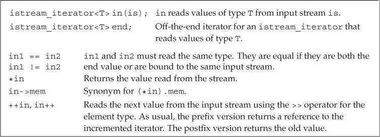

##### 使用算法操作流迭代器

因为泛型算法使用迭代器来操作数据，而流迭代器多多少少支持一些迭代器操作，所以流迭代器也支持一些算法。

```c++
istream_iterator<int> in(cin),eof;
cout << accumulate(in,eof,0)<<endl;
```

##### istream_iterator允许使用懒惰求值

将`istream_iterator`绑定到一个流时，标准库并不保证迭代器立即从流读取数据。但可以保证在第一次解引用迭代器之前，从流中读取数据的操作已经完成了。对大多数程序来说，立即读取和推迟读取没有区别，但如果创建的istream_iterator 没有使用就销毁了，或者从两个不同的对象同步读取同一个值，那么何时读取可能就很重要了。

> 惰性求值（Lazy evaluation）是在需要时才进行求值的计算方式。[表达式](https://so.csdn.net/so/search?q=表达式&spm=1001.2101.3001.7020)不在它被绑定到变量之后就立即求值，而是在该值被取用的时候求值。
>
> 除可以得到性能的提升（更小的[内存](https://so.csdn.net/so/search?q=内存&spm=1001.2101.3001.7020)占用）外，惰性计算的最重要的好处是它可以构造一个**无限的数据类型**。
>
> https://blog.csdn.net/shine19930820/article/details/71001689
>
> (虽然讲的是python，但是意思应该一样)

##### ostream_iterator 操作

创建一个ostream_iterator时，我们可以提供（可选）的第二参数，这样每次输出时候都会附带上。这个参数是C风格的字符串（一个字符串常量或者一个指向以空字符结尾的字符数组的指针）

定义`ostream_iterator`对象时，必须将其绑定到一个指定的流。不允许定义空的或者表示尾后位置的`ostream_iterator`。

```c++
#include <iostream>
#include<iterator>
#include<vector>
using namespace std;
int main() {
    vector<int> vec = {1,2,3,4,5};
    ostream_iterator<int> out_iter(cout,"d");
    for(auto e:vec){
        *out_iter++ = e;
    }
    cout<<endl;
    return 0;
}
//1d2d3d4d5d
```

`ostream_iterator`操作：


`*`和`++`运算符实际上不会对`ostream_iterator`对象做任何操作。但是建议代码写法与其他迭代器保持一致。

> 從概念上講，當寫入範圍時，您希望在寫入一個元素之後移至下一個元素。對於大多數迭代器，例如`std::vector::iterator`，必須明確完成。因此，僅出於一致性考慮，將其包括在內是有意義的。
>
> 在`std::ostream_iterator`的特定情況下，它沒有實際效果，因此可以忽略。無論如何，您都不能覆蓋輸出範圍的“元素”，前進是隱式的(並且只有隱式的，即在這種情況下，增量運算子和取消引用都是無操作的)。

> ```c++
> template <class T>
> class ostream_iterator {
> protected:
> ostream* stream;                                                          
> const char* string;                                                       //可以包含第二个参数，输出对应的数据后，输出此stream
> public:
> typedef output_iterator_tag iterator_category;                            //迭代器类型
> typedef void                value_type;
> typedef void                difference_type;
> typedef void                pointer;
> typedef void                reference;
> 
> ostream_iterator(ostream& s) : stream(&s), string(0) {}                 //缺省一个参数的构造函数，默认string为空
> ostream_iterator(ostream& s, const char* c) : stream(&s), string(c)  {} //包含string的构造函数
> ostream_iterator<T>& operator=(const T& value) {                        //重点！！！重载operator=操作，转换为输出此value
>  *stream << value;
>  if (string) *stream << string;
>  return *this;
> }
> ostream_iterator<T>& operator*() { return *this; }                       //都返回本身
> ostream_iterator<T>& operator++() { return *this; } 
> ostream_iterator<T>& operator++(int) { return *this; } 
> };
> ————————————————
> 版权声明：本文为CSDN博主「阿_波_」的原创文章，遵循CC 4.0 BY-SA版权协议，转载请附上原文出处链接及本声明。
> 原文链接：https://blog.csdn.net/li1615882553/article/details/83716065
> ```

> [STL中istream_iterator和ostream_iterator的基本用法](https://www.cnblogs.com/VIPler/p/4367308.html)
>
> 标准程序库定义有供输入及输出用的iostream iterator类，称为istream_iterator和ostream_iterator，分别支持单一型别的元素读取和写入。使用这两个iteratorclasses之前，先得含入iterator头文件:
>
> ```
> #include<iterator>
> ```
>
> 现在让我们看看如何利用istream_iterator从标准输人装置中读取字符串（即类似cin功能）：
>
> 
>
> 就像所有的iterators一样我们需要一对iterators：first和last，用来标示元素范围。这里想象一下istream_iterator的起始位置和结束位置分别是什么。
>
> 下面这行代码为我们提供了一个firstiterator，它将is定义为一个“连结至标准输人装置（cin）”的istream_iterator。
>
> ```
> istream_iterator<string> is( cin);
> ```
>
> 我们还需要一个lastiterator，表示“欲读取之最后元素的下一位置”。
>
> 对标准输入装置而言，end-of-file即代表last。这该如何表示呢？噢，只要在定义istreamiterator时不为它指定istream对象，它便代表了end-of-file。如下所示：
>
> ```
> istream_iterator<string> eof;
> ```
>
> 我们应该如何使用这对iterators呢?下面的例子中，我将它们，以及存储字符串元素的vector一起传给泛型算法。copy()由于不知道要为vector保留多少空间，所以我选用back_inserter：
>
> ```
> copy( is, eof, back_inserter( text ));
> ```
>
> 说明一下：back_inserter 是iterator适配器，它使得元素被插入到作为实参的某种容器的尾部，如vector等
>
> 现在我还需要一个ostream_iterator表示字符串元素的输出位置。以下程序代码将os定义为一个“连结至标准输出设备”的ostream_iterator，此标准输出设备供我们输出型别为string的元素。
>
> ```
> ostream_iterator<string> os( cout, " " );
> ```
>
> 上述第二个参数可以是C-Sty1e字符串，也可以是字符串常量。它用来表示各个元素被输出时的分隔符，默认情形下输出的各个元素并无任何分隔符。本例我选择在各输出字符串之间以空白加以分隔。以下便是可能的运用方式：
>
> ```
> copy( text.begin(), text.end(), os );
> ```
>
>
> copy()会将存储在text中的每个元素一一写到由os所表示的ostream上头，每个元素皆以空格符分隔开来。
>
> 完整示例代码如下：
>
> ```
> #include<iostream>
> #include<string>
> #include<iterator>
> #include<algorithm>
> using namespace std;
> int main()
> {
>  string text;
>  istream_iterator<int> is(cin);//绑定标准输入装置
>  istream_iterator<int> eof;//定义输入结束位置
>  copy(is,eof,back_inserter(text));
>  sort(text.begin(),text.end());
> 
>  ostream_iterator<int> os(cout,", ");//绑定标准输出装置
>  copy(text.begin(),text.end(),os);
> }
> ```
>
> 运行结果：
>
> https://www.cnblogs.com/VIPler/p/4367308.html

> ostream_iterator::operator*
>
> 输出迭代器的要求，`ostream_iterator`即必须满足的要求仅要求表达式 * *ii* = *无效，*并且对表达式或`operator=`本身没有说明任何内容**`operator`**。 此实现中的成员运算符返回 **`\*this`**。
>
> ostream_iterator::operator++
> 一种非功能性递增运算符，可向调用该运算之前所处理的同一对象返回 ostream_iterator。
>
> https://docs.microsoft.com/zh-cn/cpp/standard-library/ostream-iterator-class?view=msvc-170

```c++
ostream_iterator<int> out_iter(cout, " ");
for (auto e : vec)
    *out_iter++ = e;    // the assignment writes this element to cout
// out_iter = e; 其实也行
cout << endl;
```

##### 使用流迭代器处理类类型

可以为任何定义了`<<`运算符的类型创建`istream_iterator`对象，为定义了`>>`运算符的类型创建`ostream_iterator`对象。

#### 10.4.3 Reverse Iterators 反向迭代器

递增反向迭代器会移动到前一个元素，递减会移动到后一个元素。

除了forward_list，其他容器都支持反向迭代器。

```c++
sort(vec.begin(), vec.end());   // sorts vec in "normal" order
// sorts in reverse: puts the smallest element at the end of vec
sort(vec.rbegin(), vec.rend());
```

下图是一个名为vec的vector上的4种迭代器。


不能从`forward_list`或流迭代器创建反向迭代器。因为不可能在流中反向移动

**调用反向迭代器的`base`函数可以获得其对应的普通迭代器。**

```c++
#include <iostream>
#include<iterator>
#include<vector>
#include<string>
#include <algorithm>
using namespace std;
int main() {
    // find the last element in a comma-separated list
    string line = "hello world, yes minister";
    auto comma = find(line.cbegin(), line.cend(), ',');
    cout << string(line.cbegin(), comma) << endl;
    auto rcomma = find(line.crbegin(), line.crend(), ',');
// WRONG: will generate the word in reverse order
    cout << string(line.crbegin(), rcomma) << endl;
// ok: get a forward iterator and read to the end of line
    cout << string(rcomma.base(), line.cend()) << endl;
    return 0;
}
/*
hello world
retsinim sey
 yes minister
*/
```


反向迭代器的目的是表示元素范围，而这些范围是不对称的。

因为要使[line.crbegin(),rcomma]和[rcomma.base,line.cend]指向相同的元素，所有rcomma.base 和 rcomma生成在相邻位置而不是相同位置。

用普通迭代器初始化反向迭代器，或者给反向迭代器赋值时，结果迭代器与原迭代器指向的并不是相同元素。

### 10.5 Structure of Generic Algorithms

任何算法的最基本的特性是它要求其迭代器提供哪些操作。算法要求的迭代器操作可以分为5个迭代器类别（iterator category）：


每个算法都会对它的每个迭代器参数指明需要提供哪些迭代器。

另一种算法分类的形式是按照是否读、写或是重排序列中的元素来分类。

算法还共享一组参数传递规范和一组命名规范。

#### 10.5.1 The Five Iterator Categories

迭代器是按它们所提供的操作来分类的，而这种分类形成了一种层次。除了输出迭代器，一个高层类别的迭代器支持低层类别迭代器的所有操作。

C++标准指定了泛型和数值算法的每个迭代器参数的最小类别。对于迭代器实参来说，其能力必须大于或等于规定的最小类别。

向算法传递更低级的迭代器参数会产生错误（大部分编译器不会提示错误）。

##### 迭代器类别：

- 输入迭代器（input iterator）：可以读取序列中的元素，只能用于单遍扫描算法。必须支持以下操作：

  - 用于比较两个迭代器相等性的相等`==`和不等运算符`!=`。

  - 用于推进迭代器位置的前置和后置递增运算符`++`。

  - 用于读取元素的解引用运算符`*`；解引用只能出现在赋值运算符右侧。

  - 用于读取元素的箭头运算符`->`。

- 输出迭代器（output iterator）：可以读写序列中的元素，只能用于单遍扫描算法，通常指向目的位置。必须支持以下操作：

  - 用于推进迭代器位置的前置和后置递增运算符`++`。

  - 用于读取元素的解引用运算符`*`；解引用只能出现在赋值运算符左侧（向已经解引用的输出迭代器赋值，等价于将值写入其指向的元素）。

- 前向迭代器（forward iterator）：可以读写序列中的元素。只能在序列中沿一个方向移动。支持所有输入和输出迭代器的操作，而且可以多次读写同一个元素。因此可以使用前向迭代器对序列进行多遍扫描。

- 双向迭代器（bidirectional iterator）：可以正向/反向读写序列中的元素。除了支持所有前向迭代器的操作之外，还支持前置和后置递减运算符`--`。除`forward_list`之外的其他标准库容器都提供符合双向迭代器要求的迭代器。

- 随机访问迭代器（random-access iterator）：可以在常量时间内访问序列中的任何元素。除了支持所有双向迭代器的操作之外，还必须支持以下操作：

  - 用于比较两个迭代器相对位置的关系运算符`<`、`<=`、`>`、`>=`。

  - 迭代器和一个整数值的加减法运算`+`、`+=`、`-`、`-=`，计算结果是迭代器在序列中前进或后退给定整数个元素后的位置。

  - 用于两个迭代器上的减法运算符`-`，计算得到两个迭代器的距离。

  - 下标运算符`[]`。

#### 10.5.2 Algorithm Parameter Patterns

大多数算法的形参模式是以下四种形式之一：

```c++
alg(beg, end, other args);
alg(beg, end, dest, other args);
alg(beg, end, beg2, other args);
alg(beg, end, beg2, end2, other args);
```

其中`alg`是算法名称，`beg`和`end`表示算法所操作的输入范围。几乎所有算法都接受一个输入范围，是否有其他参数依赖于算法操作。`beg`和`end2`表示表示输出范围，`beg2`和`end2`表示第二个输入范围。 `dest`表示指定目的位置。

向输出迭代器写入数据的算法都假定目标空间足够容纳要写入的数据。

接受单独一个`beg2`表示第二个输入范围的算法都假定从迭代器参数开始的序列至少与第一个输入范围一样大。

#### 10.5.3 Algorithm Naming Conventions

接受谓词参数的算法都有附加的`_if`后缀。

```c++
find(beg, end, val);       // find the first instance of val in the input range
find_if(beg, end, pred);   // find the first instance for which pred is true
```

将执行结果写入额外目的空间的算法都有`_copy`后缀。

```c++
reverse(beg, end);              // reverse the elements in the input range
reverse_copy(beg, end, dest);   // copy elements in reverse order into dest
```

一些算法同时提供`_copy`和`_if`版本。

### 10.6 Container-Specific Algorithms

对于`list`和`forward_list`类型，它们定义了独有的函数，因为通用的版本需要交换元素，而对于链表来说，这样做成本代价太高。所有应该优先使用成员函数版本的算法，而非通用算法。

`list`和`forward_list`成员函数版本的算法：


`list`和`forward_list`的`splice`函数可以进行容器合并，其参数如下：


> list::[splice](https://so.csdn.net/so/search?q=splice&spm=1001.2101.3001.7020)实现list拼接的功能。将源list的内容部分或全部元素删除，拼插入到目的list。
>
> 函数有以下三种声明：
>
> 一：void splice ( [iterator](https://so.csdn.net/so/search?q=iterator&spm=1001.2101.3001.7020) position, list<T,Allocator>& x );
>
> 二：void splice ( iterator position, list<T,Allocator>& x, iterator it );
>
> 三：void splice ( iterator position, list<T,Allocator>& x, iterator first, iterator last );
>
> 解释：
>
> position 是要操作的list对象的迭代器
>
> list&x 被剪的对象
>
> 对于一：会在position后把list&x所有的元素到剪接到要操作的list对象
> 对于二：只会把it的值剪接到要操作的list对象中
> 对于三：把first 到 last 剪接到要操作的list对象中


##### 链表特有版本的算法操作会改变底层容器。

比如`merge` `splice`会销毁其参数。

### Chapter Summary  

序列可以是标准库容器类型中的元素、一个内置数组或是通过读写流来生成的。

标准库定义了约100个与类型无关的对序列进行操作的算法。算法通过迭代器对容器进行操作。

算法从不直接改变它们所操作的序列的大小。


### Defined Terms

| 中文       | 英文                    | 含义                                                         |
| ---------- | ----------------------- | ------------------------------------------------------------ |
|            | back_inserter           | 这是一个迭代器适配器，接受一个指向容器的引用，生成一个插入迭代器，该插入迭代器使用push_back添加元素 |
| 双向迭代器 | biodirectional iterator | 支持前向迭代器的所有操作，还具有用--在序列中反向移动的能力。 |
|            | istream_iterator        | 读取输入流的流迭代器                                         |
| 迭代器类别 | iterator category       | 根据支持的操作对迭代器进行的分类组织。迭代器类别形成一个层次，高级别的类别支持更弱级别的所有操作。只要迭代器达到所要求的最小类别，他就可以用于算法。 |
| 谓词       | predicate               | 返回可以转换为bool类型的值的函数。泛型算法常用来检测元素，标准库的谓词分为一元`unary`和二元的。 |
|            |                         |                                                              |
|            |                         |                                                              |

## Chapter 11 Associative Containers

关联容器中的元素是按关键字来保存和访问的。与之相对，顺序容器中的元素是按他们在容器中的位置来顺序保存和访问的。

两个主要的关联容器 Associative Containers 类型是`map` `set`。

- map 中的元素是一些键值对 --  字典。

- set中每个元素只包含一个关键字，支持高效的关键字查询操作。 --  集合


标准库提供了8个关联容器，它们之间的不同体现在三个方面：

- 是`map`还是`set`类型。

- 是否允许保存重复的关键字。

- 是否按顺序保存元素。

允许重复保存关键字的容器名字都包含单词`multi`；无序保存元素的容器名字都以单词`unordered`开头。


`map`和`multimap`类型定义在头文件`map`中；`set`和`multiset`类型定义在头文件`set`中；无序容器定义在头文件`unordered_map`和`unordered_set`中。

### 11.1 Using an Associative Container

##### 使用map

`map`类型通常被称为关联数组（associative array）。

从`map`中提取一个元素时，会得到一个`pair`类型的对象。`pair`【11.2.3】是一个模板类型，保存两个名为`first`和`second`的公有数据成员。`map`所使用的`pair`用`first`成员保存关键字，用`second`成员保存对应的值。

**下例是一个经典的统计单词在输入中出现的次数**

```c++
// count the number of times each word occurs in the input
map<string, size_t> word_count;     // empty map from string to size_t
string word;
while (cin >> word)
    ++word_count[word];     // fetch and increment the counter for word
for (const auto &w : word_count)    // for each element in the map
    // print the results
    cout << w.first << " occurs " << w.second
        << ((w.second > 1) ? " times" : " time") << endl;
```

##### 

##### 使用set

`set`类型的`find`成员返回一个迭代器。如果给定关键字在`set`中，则迭代器指向该关键字，否则返回的是尾后迭代器。

### 11.2 Overview of the Associative Containers

关联容器都支持【9.2】介绍的普通容器操作。

关联容器不支持顺序容器的位置相关的操作。例如push_front/push_back。因为关联容器按照关键字存储，位置对其没有意义。

另外关联容器不支持构造函数或插入操作这些接受一个元素值和一个数量值的操作。

关联容器的迭代器都是双向的。

#### 11.2.1 Defining an Associative Container

定义`map`时，必须指定关键字类型和值类型；定义`set`时，只需指定关键字类型。

初始化`map`时，提供的每个键值对用花括号`{}`包围。

```C++
map<string, size_t> word_count;   // empty
// list initialization
set<string> exclude = { "the", "but", "and" };
// three elements; authors maps last name to first
map<string, string> authors =
{
    {"Joyce", "James"},
    {"Austen", "Jane"},
    {"Dickens", "Charles"}
};
```

`map`和`set`中的关键字必须唯一，`multimap`和`multiset`没有此限制。

#### 11.2.2 Requirements on Key Type 关键字类型的要求

（关键字即键值对的键）

对于无序容器，会在【11.4】介绍。

对于有序容器——`map`、`multimap`、`set`和`multiset`，关键字类型必须定义元素比较的方法。默认情况下，标准库使用关键字类型的`<`运算符来进行比较操作。

##### 有序容器的关键字类型

可以向一个算法提供我们自己定义的比较操作。与之类似，也可以提供自己定义的操作来代替关键字上的`<`。所提供的操作必须在关键字类型上定义一个严格弱序（小于等于）。

##### 使用关键字类型的比较函数

用来组织容器元素的操作的类型也是该容器类型的一部分。如果需要使用自定义的比较操作，则必须在定义关联容器类型时提供此操作的类型。操作类型在尖括号中紧跟着元素类型给出。

```c++
bool compareIsbn(const Sales_data &lhs, const Sales_data &rhs)
{
    return lhs.isbn() < rhs.isbn();
}

// bookstore can have several transactions with the same ISBN
// elements in bookstore will be in ISBN order
multiset<Sales_data, decltype(compareIsbn)*> bookstore(compareIsbn);
```

使用decltype来指出自定义操作的类型。同时要加上`*`来指出我们要使用一个给定函数类型的指针。

#### 11.2.3 The `pair` Type

`pair`定义在头文件`utility`中。

```c++
pair<string, string> anon;        // holds two strings
pair<string, size_t> word_count;  // holds a string and an size_t
pair<string, vector<int>> line;   // holds string and vector<int>
```

`pair`的默认构造函数对数据成员进行值初始化。

`pair`的数据成员是public的。一个`pair`可以保存两个数据成员，分别命名为`first`和`second`。

`pair`支持的操作：


##### 创建pair对象的函数

在C++11中，如果函数需要返回`pair`，可以对返回值进行列表初始化。早期C++版本中必须显式构造返回值。

```c++
pair<string, int> process(vector<string> &v)
{
    // process v
    if (!v.empty())
        // list initialize
        return { v.back(), v.back().size() };
    else
        // explicitly constructed return value
        return pair<string, int>();
}
```


### 11.3 Operations on Associative Containers

关联容器定义了类型别名来表示容器关键字和值的类型：


对于`set`类型，`key_type`和`value_type`是一样的。`set`中保存的值就是关键字。对于`map`类型，元素是关键字-值对。即每个元素是一个`pair`对象，包含一个关键字和一个关联的值。

由于元素关键字不能改变，因此`pair`的关键字部分是`const`的。

另外，只有`map`类型（`unordered_map`、`unordered_multimap`、`multimap`、`map`）才定义了`mapped_type`。

```c++
set<string>::value_type v1;        // v1 is a string
set<string>::key_type v2;          // v2 is a string
map<string, int>::value_type v3;   // v3 is a pair<const string, int>
map<string, int>::key_type v4;     // v4 is a string
map<string, int>::mapped_type v5;  // v5 is an int
```


#### 11.3.1 Associative Container Iterators 关联容器迭代器

解引用关联容器迭代器时，会得到一个类型为容器的`value_type`的引用。对`map`而言，`value_type`是`pair`类型，其`first`成员保存`const`的关键字，`second`成员保存值。

注意：map的value_type 是一个pair，我们可以改变value，但是改变不了key。

```c++
// get an iterator to an element in word_count
auto map_it = word_count.begin();
// *map_it is a reference to a pair<const string, size_t> object
cout << map_it->first;          // prints the key for this element
cout << " " << map_it->second;  // prints the value of the element
map_it->first = "new key";      // error: key is const
++map_it->second;               // ok: we can change the value through an iterator
```

同理，虽然`set`同时定义了`iterator`和`const_iterator`类型，但两种迭代器都只允许只读访问`set`中的元素。类似`map`，`set`中的关键字也是`const`的。

##### 遍历关联容器

```c++
set<int> iset = {0,1,2,3,4,5,6,7,8,9};
set<int>::iterator set_it = iset.begin();
if (set_it != iset.end())
{
    *set_it = 42;       // error: keys in a set are read-only
    cout << *set_it << endl;    // ok: can read the key
}
```

`map`和`set`都支持`begin`和`end`操作。使用迭代器遍历`map`、`multimap`、`set`或`multiset`时，迭代器按关键字升序遍历元素。

##### 关联容器和算法

通常不对关联容器使用泛型算法。由于关键字（key）是const这一特性，意味着不能将关联容器传递给修改或重排容器的算法。

关联容器可用于只读取元素的算法。但是很多这类算法都需要搜索序列。由于关联容器中的元素不能通过它们的关键字进行快速查找，所以对其使用泛型搜索算法总不是个好主意。

在实际编程中，如果真要对一个关联容器使用算法，要么是将它当做一个源序列，要么当做一个目的位置。

#### 11.3.2 Adding Elements

使用`insert`成员可以向关联容器中添加元素。向`map`和`set`中添加已存在的元素对容器没有影响。

通常情况下，对于想要添加到`map`中的数据，并没有现成的`pair`对象。可以直接在`insert`的参数列表中创建`pair`。

构建pair可以使用花括号初始化，也可以用make_pair或显式构造pair。

```c++
// four ways to add word to word_count
word_count.insert({word, 1});
word_count.insert(make_pair(word, 1));
word_count.insert(pair<string, size_t>(word, 1));
word_count.insert(map<string, size_t>::value_type(word, 1));
```

关联容器的`insert`操作：


##### 检测insert的返回值

`insert`或`emplace`的返回值依赖于容器类型和参数：

- 对于不包含重复关键字的容器，添加单一元素的`insert`和`emplace`版本返回一个`pair`，表示操作是否成功。`pair`的`first`成员是一个迭代器，指向具有给定关键字的元素；`second`成员是一个`bool`值。如果关键字已在容器中，则`insert`直接返回，`bool`值为`false`。如果关键字不存在，元素会被添加至容器中，`bool`值为`true`。

- 对于允许包含重复关键字的容器，添加单一元素的`insert`和`emplace`版本返回指向新元素的迭代器。

使用insert重写单词计数程序。

```c++
// more verbose way to count number of times each word occurs in the input
map<string, size_t> word_count; // empty map from string to size_t
string word;
while (cin >> word) {
     // inserts an element with key equal to word and value 1;
     // if word is already in word_count, insert does nothing
     auto ret = word_count.insert({word, 1});
     if (!ret.second) // word was already in word_count
     	++ret.first->second; // increment the counter
}
```

感觉这句话挺美观的

```c++
++ret.first->second; // increment the counter
```

##### 向multiset或multimap添加元素

对允许重复关键字的容器，接受单个元素的insert操返回一个指向新元素的迭代器。这里无需返回bool值，因为总能插入一个新元素到容器里。


#### 11.3.3 Erasing Elements

关联容器定义了三个版本的erase

关联容器的删除操作：


后两个版本的erase与对应的顺序容器操作类似，都是删除指定（范围）的元素，函数返回void。

与顺序容器不同，关联容器提供了一个额外的`erase`操作。它接受一个`key_type`参数，删除所有匹配给定关键字的元素（如果存在），返回实际删除的元素数量。对于不包含重复关键字的容器，`erase`的返回值总是1或0。若返回值为0，则表示想要删除的元素并不在容器中。

#### 11.3.4 Subscripting a map map的下标操作

`map`下标运算符接受一个关键字，获取与此关键字相关联的值。如果关键字不在容器中，下标运算符会向容器中添加该关键字，并值初始化关联值。

由于下标运算符可能向容器中添加元素，所以只能对非`const`的`map`使用下标操作。

`map`和`unordered_map`的下标操作：


**建议使用at来取，find来找**

对`map`进行下标操作时，返回的是`mapped_type`类型的对象；解引用`map`迭代器时，返回的是`value_type`类型（pair类型）的对象。

#### 11.3.5 Accessing Elements 访问元素

关联容器的查找操作：


##### 在multimap或multiset中查找元素.

这类容器是一对多的映射关系，那么查找就比一对一麻烦一些。

如果`multimap`或`multiset`中有多个元素具有相同关键字，则这些元素在容器中会相邻存储。

```c++
multimap<string, string> authors;
// adds the first element with the key Barth, John
authors.insert({"Barth, John", "Sot-Weed Factor"});
// ok: adds the second element with the key Barth, John
authors.insert({"Barth, John", "Lost in the Funhouse"});

string search_item("Alain de Botton");      // author we'll look for
auto entries = authors.count(search_item);  // number of elements
auto iter = authors.find(search_item);      // first entry for this author
// loop through the number of entries there are for this author
while(entries)
{
    cout << iter->second << endl;   // print each title
    ++iter;      // advance to the next title
    --entries;   // keep track of how many we've printed
}
```

##### 另外一种不同的，面向迭代器的解决方法

`lower_bound`和`upper_bound`操作都接受一个关键字，返回一个迭代器。如果关键字在容器中，`lower_bound`返回的迭代器会指向第一个匹配给定关键字的元素，而`upper_bound`返回的迭代器则指向最后一个匹配元素之后的位置。如果关键字不在`multimap`中，则`lower_bound`和`upper_bound`会返回相等的迭代器，指向一个不影响排序的关键字插入位置。因此**用相同的关键字调用`lower_bound`和`upper_bound`会得到一个迭代器范围，表示所有具有该关键字的元素范围。**

```c++
// definitions of authors and search_item as above
// beg and end denote the range of elements for this author
for (auto beg = authors.lower_bound(search_item),
        end = authors.upper_bound(search_item);
    beg != end; ++beg)
    cout << beg->second << endl;    // print each title
```

`lower_bound`和`upper_bound`有可能返回尾后迭代器。如果查找的元素具有容器中最大的关键字，则`upper_bound`返回尾后迭代器。如果关键字不存在，且大于容器中任何关键字，则`lower_bound`也返回尾后迭代器。

简单记一下，就是这个就表示可用范围，如果没有对应的，那么这两个返回相同的迭代器，指向一个安全插入点

##### equal_range 函数

这种方式最为直接

`equal_range`操作接受一个关键字，返回一个迭代器`pair`。

若关键字存在，则第一个迭代器指向第一个匹配关键字的元素，第二个迭代器指向最后一个匹配元素之后的位置。若关键字不存在，则两个迭代器都指向一个不影响排序的关键字插入位置。

```c++
// definitions of authors and search_item as above
// pos holds iterators that denote the range of elements for this key
for (auto pos = authors.equal_range(search_item);
        pos.first != pos.second; ++pos.first)
    cout << pos.first->second << endl;  // print each title
```

#### 11.3.6 A Word Transformation Map

### 11.4 The Unordered Containers

新标准库定义了4个无序关联容器（unordered associative container），这些容器使用哈希函数（hash function）和关键字类型的`==`运算符组织元素。

无序容器和对应的有序容器通常可以相互替换。但是由于元素未按顺序存储，使用无序容器的程序输出一般会与有序容器的版本不同。

无序容器在存储上组织为一组桶，每个桶保存零或多个元素。无序容器使用一个哈希函数将元素映射到桶。为了访问一个元素，容器首先计算元素的哈希值，它指出应该搜索哪个桶。容器将具有一个特定哈希值的所有元素都保存在相同的桶中。因此无序容器的性能依赖于哈希函数的质量和桶的数量及大小。

无序容器管理操作：


##### 无序容器对关键字类型的要求

默认情况下，无序容器使用关键字类型的`==`运算符比较元素，还使用一个`hash<key_type>`类型的对象来生成每个元素的哈希值。标准库为内置类型和一些标准库类型提供了hash模板。因此可以直接定义关键字是这些类型的无序容器，而不能直接定义关键字类型为自定义类类型的无序容器，必须先提供对应的hash模板版本。【16.5】会讲怎么为自定义类型设计hash模板。

不能用默认的hash，我们可以使用重载的方式。来提供 ==  和hash函数。

```c++
size_t hasher(const Sales_data &sd)
{
 	return hash<string>()(sd.isbn());
}
bool eqOp(const Sales_data &lhs, const Sales_data &rhs)
{
 	return lhs.isbn() == rhs.isbn();
}
using SD_multiset = unordered_multiset<Sales_data, decltype(hasher)*, decltype(eqOp)*>;
// arguments are the bucket size and pointers to the hash function and equality operator
SD_multiset bookstore(42, hasher, eqOp);


```

如果类里已经重载了==，则可以只重载哈希函数

```c++
// use FooHash to generate the hash code; Foo must have an == operator
unordered_set<Foo, decltype(FooHash)*> fooSet(10, FooHash);
```

### Chapter Summary  

关联容器通过关键字高效查找和提取元素。

允许重复关键字的容器的名字都包含multi；而使用哈希技术的容器的名字都以unordered开头。

无论是在有序容器还是在无序容器中，具有相同关键字的元素都是相邻存储的。

### Defined Terms

| 中文     | 英文                  | 含义                                                 |
| -------- | --------------------- | ---------------------------------------------------- |
| 关联容器 | associative container | 类型，保存对象的集合，支持通过关键字的高效查找       |
|          | mapped_type           | 映射类型定义的类型，即映射中关键字关联的值的类型     |
|          | value_type            | 容器中元素的类型。                                   |
| *运算符  | 解引用运算符          | 生成一个value_type， 对map类型，value_type是一个pair |
| []运算符 | 下标运算符            | 接受一个key_type值，生成一个mapped_type值。          |
|          |                       |                                                      |
|          |                       |                                                      |


## Chapter 12 Dynamic Memory

截止这章之前，我们程序中的对象都有严格的生存周期

- 全局对象在程序启动时分配，在程序结束时销毁。
- 局部自动对象，当我们进入其定义所在的程序块是被创建，离开块时销毁。
- 局部static对象在第一次使用前分配，在程序结束时销毁。

除此之外，C++还支持动态分配对象。动态分配的对象的生存期与它们在哪里创造无关，只有显式地被释放时，这些对象才会被销毁。


程序用堆（heap）（或者称为自由空间 free store）来存储动态分配（dynamically allocate）的对象。动态对象的生存期由程序控制。

### 12.1 Dynamic Memory and Smart Pointers

C++中的动态内存管理通过一对运算符完成：`new`在动态内存中为对象分配空间并返回指向该对象的指针，可以选择对对象进行初始化；`delete`接受一个动态对象的指针，销毁该对象并释放与之关联的内存。

新标准库提供了两种智能指针（smart pointer）类型来管理动态对象。智能指针的行为类似常规指针，但它自动释放所指向的对象。这两种智能指针的区别在于管理底层指针的方式：`shared_ptr`允许多个指针指向同一个对象；`unique_ptr`独占所指向的对象。标准库还定义了一个名为`weak_ptr`的伴随类，它是一种弱引用，指向`shared_ptr`所管理的对象。这三种类型都定义在头文件`memory`中。

#### 12.1.1 The shared_ptr Class

智能指针是模板，创建时需要指明指针可以指向的类型。默认初始化的智能指针中保存着一个空指针。

```c++
shared_ptr<string> p1;      // shared_ptr that can point at a string
shared_ptr<list<int>> p2;   // shared_ptr that can point at a list of ints
```

`shared_ptr`和`unique_ptr`都支持的操作：


`shared_ptr`独有的操作：

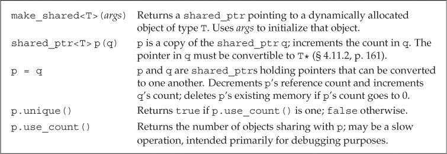

##### make_shared

最安全的分配和使用动态内存的方法是调用一个名为make_shared的标准库函数。

`make_shared`函数（定义在头文件`memory`中）在动态内存中分配一个对象并初始化它，返回指向此对象的`shared_ptr`。

```c++
// shared_ptr that points to an int with value 42
shared_ptr<int> p3 = make_shared<int>(42);
// p4 points to a string with value 9999999999
shared_ptr<string> p4 = make_shared<string>(10, '9');
// p5 points to an int that is value initialized
shared_ptr<int> p5 = make_shared<int>();
```

当然用auto来保存make_shared 的结果比较简单方便，就是阅读性可能会稍差。

```c++
auto p6 = make_shared<vector<string>>();
//p6指向一个动态分配的空vector<string>
```

##### shared_ptr的拷贝和赋值

进行拷贝或赋值操作时，每个`shared_ptr`会记录有多少个其他`shared_ptr`与其指向相同的对象。

```c++
auto p = make_shared<int>(42);  // object to which p points has one user
auto q(p);  // p and q point to the same object
            // object to which p and q point has two users
```

每个`shared_ptr`都有一个与之关联的计数器，通常称为**引用计数（reference count）**。拷贝`shared_ptr`时引用计数会递增。例如使用一个`shared_ptr`初始化另一个`shared_ptr`，或将它作为参数传递给函数以及作为函数的返回值返回。给`shared_ptr`赋予新值或`shared_ptr`被销毁时引用计数会递减。例如一个局部`shared_ptr`离开其作用域。一旦一个`shared_ptr`的引用计数变为0，它就会自动释放其所管理的对象。

```c++
auto r = make_shared<int>(42);  // int to which r points has one user
r = q;  // assign to r, making it point to a different address
        // increase the use count for the object to which q points
        // reduce the use count of the object to which r had pointed
        // the object r had pointed to has no users; that object is automatically freed
```

##### shared_ptr 自动销毁所管理的对象并自动释放相关联的内存

`shared_ptr`的析构函数会递减它所指向对象的引用计数。如果引用计数变为0，`shared_ptr`的析构函数会销毁对象并释放空间。

由于在最后一个shared_ptr销毁前内存都不会释放，因此保证shared_ptr在无用之后就不再保留十分有必要。比如将`shared_ptr`存放于容器中，而后不再需要全部元素，而只使用其中一部分，应该用`erase`删除不再需要的元素。

##### 使用了动态生存期的资源的类

程序使用动态内存通常出于以下三种原因之一：

- 不确定需要使用多少对象。

- 不确定所需对象的准确类型。【15】

- 需要在多个对象间共享数据。

#### 12.1.2 Managing Memory Directly 直接管理内存

相对于智能指针，使用`new`和`delete`管理内存很容易出错。

##### 使用new动态分配和初始化对象

在自由空间分配的内存是无名的，因此new无法为其分配的对象命名，而是返回一个指向该对象的指针。

默认情况下，动态分配的对象是默认初始化的。所以内置类型或组合类型的对象的值将是未定义的，而类类型对象将用默认构造函数进行初始化。

```c++
string *ps = new string;    // initialized to empty string
int *pi = new int;     // pi points to an uninitialized int
```

可以使用值初始化方式、直接初始化方式、传统构造方式（圆括号`()`）或新标准下的列表初始化方式（花括号`{}`）初始化动态分配的对象。

```c++
int *pi = new int(1024);            // object to which pi points has value 1024
string *ps = new string(10, '9');   // *ps is "9999999999"
// vector with ten elements with values from 0 to 9
vector<int> *pv = new vector<int>{0,1,2,3,4,5,6,7,8,9};
string *ps1 = new string;     // default initialized to the empty string
string *ps = new string();    // value initialized to the empty string
int *pi1 = new int;      // default initialized; *pi1 is undefined
int *pi2 = new int();    // value initialized to 0; *pi2 is 0
```

只有当初始化的括号中仅有单一初始化器时才可以使用`auto`。

```c++
auto p1 = new auto(obj);    // p points to an object of the type of obj
                            // that object is initialized from obj
auto p2 = new auto{a,b,c};  // error: must use parentheses for the initializer
```

##### 动态分配的const对象

可以用`new`分配`const`对象，返回指向`const`类型的指针。动态分配的`const`对象必须初始化。

对于一个定义了默认构造函数的类类型，其const动态对象可以隐式初始化，而其他类型的对象就必须显示初始化。由于分配的对象是const的，new返回的指针是一个指向const的指针。

##### 内存耗尽

默认情况下，如果`new`不能分配所要求的内存空间，会抛出`bad_alloc`异常。使用定位`new`（placement new）可以阻止其抛出异常。定位`new`表达式允许程序向`new`传递额外参数。如果将`nothrow`传递给`new`，则`new`在分配失败后会返回空指针。`bad_alloc`和`nothrow`都定义在头文件`new`中。

```c++
// if allocation fails, new returns a null pointer
int *p1 = new int;            // if allocation fails, new throws std::bad_alloc
int *p2 = new (nothrow) int;  // if allocation fails, new returns a null pointer
```

##### 释放动态内存

delete表达式执行两个动作：销毁给定的指针指向的对象；释放对应的内存。

传递给delete的指针必须指向动态分配的内存，或者是一个空指针。

使用`delete`释放一块并非`new`分配的内存，或者将相同的指针值释放多次的行为是未定义的。有的编译器往往会通过这个语句，尽管是错误的。

尽管const对象的值不能被改变，但是它本身是可以被销毁的。

##### 动态对象的生存期直到被释放时位置

由内置指针管理的动态对象在被显式释放前一直存在。

`delete`一个指针后，指针值就无效了（空悬指针，dangling pointer）。为了防止后续的错误访问，应该在`delete`之后将指针值置空`nullptr`。

但这也只是提供了有限的保护而言，譬如多个指针指向同一块内存，delete内存后重置指针的方法只对这个指针有效。对于其他任何仍指向（已释放）内存你的指针是没有作用的，这些指针都是空悬的。

#### 12.1.3 Using shared_ptrs with new

可以用`new`返回的指针初始化智能指针。该构造函数是`explicit`的，因此必须使用**直接初始化**形式。

```c++
shared_ptr<int> p1 = new int(1024);    // error: must use direct initialization 不支持隐式转换
shared_ptr<int> p2(new int(1024));     // ok: uses direct initialization 必须显式
```

默认情况下，用来初始化智能指针的内置指针必须指向动态内存，因为智能指针默认使用`delete`释放它所管理的对象。

如果要将智能指针绑定到一个指向其他类型资源的指针上，就必须提供自定义操作来代替`delete`。【12.1.4】

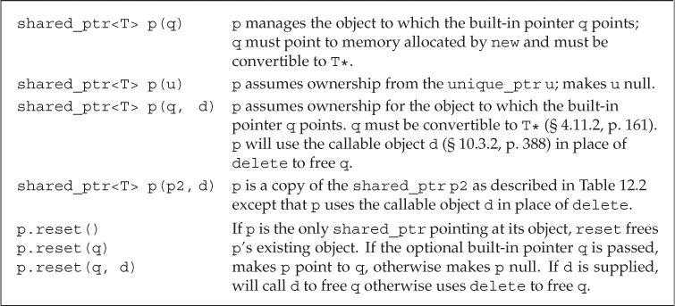

##### 不要混合使用内置指针和智能指针

A shared_ptr can coordinate destruction only with other shared_ptrs that are copies of itself. Indeed, this fact is one of the reasons we recommend using
make_shared rather than new.

shared_ptr 可以协调统一别的拷贝自它的指针的析构。这也是我们推荐使用make_shared而不是new的原因。这样我们就可以在分配对象的同时将share_ptr 与之绑定。从而避免无意中将同一块内存绑定到多个独立创建的share_ptr上。


当将`shared_ptr`绑定到内置指针后，资源管理就应该交由`shared_ptr`负责。不应该再使用内置指针访问`shared_ptr`指向的内存。这很危险，因为你不知道智能指针指向的对象何时被销毁。

```c++
// ptr is created and initialized when process is called
void process(shared_ptr<int> ptr)
{
    // use ptr
}   // ptr goes out of scope and is destroyed

shared_ptr<int> p(new int(42));   // reference count is 1
process(p);     // copying p increments its count; in process the reference count is 2
int i = *p;     // ok: reference count is 1

int *x(new int(1024));   // dangerous: x is a plain pointer, not a smart pointer
process(x);     // error: cannot convert int* to shared_ptr<int>
process(shared_ptr<int>(x));    // legal, but the memory will be deleted!
int j = *x;     // undefined: x is a dangling pointer!
```

##### 也不要用get初始化另一个智能指针或位智能指针赋值

智能指针的`get`函数返回一个内置指针，指向智能指针管理的对象。主要用于向不能使用智能指针的代码传递内置指针。使用`get`返回指针的代码不能`delete`此指针。 

```c++
shared_ptr<int> p(new int(42));    // reference count is 1
int *q = p.get();   // ok: but don't use q in any way that might delete its pointer
{   // new block
    // undefined: two independent shared_ptrs point to the same memory
    shared_ptr<int>(q);
} // block ends, q is destroyed, and the memory to which q points is freed
int foo = *p;   // undefined; the memory to which p points was freed
```

get用来将指针的访问权限传递给代码，你只有在确定代码不会delete指针的情况下，才能使用get。特别是，永远不要使用get初始化另一个智能指针或为另一个智能指针赋值。

```c++
#include <iostream>
#include<iterator>
#include<vector>
#include<string>
#include <algorithm>
#include<memory>
using namespace std;

int main() {
    shared_ptr<int> p (new int (42));
    cout<<"1P: "<<p<<" "<<*p<<endl;
    int *q = p.get();
    cout<<"2Q: "<<q<<" "<<*q<<endl;
    {
        cout<<"3Q: "<<q<<" ** "<<*q<<endl;
        shared_ptr<int>(q);
        //cout<<"4Q: "<<q<<" ** "<<*q<<endl;
    }
    int foo = *p;
    cout<<"5P: "<<p<<" "<<*p<<endl;
    cout<<"6P: "<<q<<" "<<*q<<endl;

    return 0;
}

/*
1P: 0x1cfc6302700 42
2Q: 0x1cfc6302700 42
3Q: 0x1cfc6302700 ** 42
//如果4Q会因为调用空指针指向的数据而中断。
5P: 0x1cfc6302700 42
6P: 0x1cfc6302700 42
*/
//不知道为什么q没有销毁p指向的空间
```

更新

```c++
#include <iostream>
#include<iterator>
#include<vector>
#include<string>
#include <algorithm>
#include<memory>
using namespace std;

int main() {
    shared_ptr<int> p (new int (42));
    cout<<"p usecount "<<p.use_count()<<endl;
    cout<<"1P: "<<p<<" "<<*p<<endl;
    int *q = p.get();
    cout<<"p usecount "<<p.use_count()<<endl;
    cout<<"2Q: "<<q<<" "<<*q<<endl;
    {
        cout<<"3Q: "<<q<<" ** "<<*q<<endl;
        //shared_ptr<int>temp (q) ;
        shared_ptr<int>{q} ;
        cout<<"p usecount "<<p.use_count()<<endl;
        //cout<<"temp usecount "<<temp.use_count()<<endl;
        //cout<<"4Q: "<<q<<" ** "<<*q<<endl;
    }
    cout<<"p usecount "<<p.use_count()<<endl;
    int foo = *p;
    cout<<"5P: "<<p<<" "<<*p<<endl;
    cout<<"6P: "<<q<<" "<<*q<<endl;
    cout<<"p usecount "<<p.use_count()<<endl;


    return 0;
}

/*
p usecount 1
1P: 0x208189129e0 42
p usecount 1
2Q: 0x208189129e0 42
3Q: 0x208189129e0 ** 42
p usecount 1
p usecount 1
5P: 0x208189129e0 412167504
6P: 0x208189129e0 412167504
p usecount 1
*/


```

这里想要做出那种结果有两种方式，第一是用{}，另一种是用temp

> 可以参考这个
>
> https://www.zhihu.com/question/51071372
>
> 作者：origin
> 链接：https://www.zhihu.com/question/51071372/answer/124454469
> 来源：知乎
> 著作权归作者所有。商业转载请联系作者获得授权，非商业转载请注明出处。
>
> 
>
> 根据C++标准 (5.2.3)，shared_ptr<int>(q)属于function style casting，而不是直接call constructor构造一个匿名对象 
>
> > A simple-type-specifier (7.1.6.2 ) or typename-specifier (14.6 ) followed by a parenthesized expression-list constructs a value of the specified type given the expression list. **If the expression list is a single expression, the type conversion expression is equivalent (in definedness, and if defined in meaning) to the corresponding cast expression (5.4 ).** If the type specified is a class type, the class type shall be complete. If the expression list specifies more than a single value, the type shall be a class with a suitably declared constructor (8.5 , 12.1 ), and the expression T(x1, x2, ...) is equivalent in effect to the declaration T t(x1, x2, ...); for some invented temporary variable t , with the result being the value of t as a prvalue.
>
> 然后由于shared_ptr<int>(q)这句放在一对花括号里，所以它属于expression-statement，根据标准 (6.8)
>
> > There is an ambiguity in the grammar involving expression-statement s and declarations: An expression-statement with a function-style explicit type conversion (5.2.3 ) as its leftmost [subexpression](https://www.zhihu.com/search?q=subexpression&search_source=Entity&hybrid_search_source=Entity&hybrid_search_extra={"sourceType"%3A"answer"%2C"sourceId"%3A124454469}) can be indistinguishable from a declaration where the first declarator starts with a ( . **In those cases the statement is a declaration.**
>
> ```text
> {
> shared_ptr<int>(q);
> }
> ```
>
> 这一句是一个declaration，相当于
>
> ```text
> {
> shared_ptr<int> q;
> }
> ```
>
> 声明了一个名字为q的空shared_ptr
>
> 综上，C++ Primer确实有问题，改成
>
> ```text
> {
> shared_ptr<int>{q};
> }
> ```
>
> 就可以了
>
> 关于function style casting
>
> [casting - What exactly is or was the purpose of C++ function-style casts?](https://link.zhihu.com/?target=http%3A//stackoverflow.com/questions/4474933/what-exactly-is-or-was-the-purpose-of-c-function-style-casts)[c++ - Function style casting vs calling constructor](https://link.zhihu.com/?target=http%3A//stackoverflow.com/questions/37255200/function-style-casting-vs-calling-constructor)

后来我看题主题目的更新，但是其实还是不对

```c++
#include <iostream>
#include<iterator>
#include<vector>
#include<string>
#include <algorithm>
#include<memory>
using namespace std;
class myclass{
public:
    
    myclass(int m):mem(m){cout<<"constructor"<<endl;}
    ~myclass(){cout<<name<<" destructor"<<endl;}

    int mem;
    string name;
public:
    void print(){cout<<"print "<<mem<<" and "<<name<<endl;}
    void changename(string newstr){this->name = newstr;}
};
int main() {
    shared_ptr<myclass>p(new myclass(42));
    p->changename("ptr_p");
    p->print();
    myclass *q = p.get();
    q->changename("ptr_q");
    {
        shared_ptr<myclass>(q);
        //q->print();
    }
    p->print();
    cout<<1<<endl;
    myclass foo = *p;
    foo.changename("foo");
    p->print();
    cout<<2<<endl;
    foo.print();
    return 0;
}
/*
constructor
print 42 and ptr_p
print 42 and ptr_q
1
print 42 and ptr_q
2
print 42 and foo
foo destructor
ptr_q destructor
*/
```

这里自己写个类还是只是创造了一个空的智能指针，与p其实没有关联，并不是真正把q变成智能指针。想达到理想效果非得列表初始化{}或者temp不可。

```c++
#include <iostream>
#include<iterator>
#include<vector>
#include<string>
#include <algorithm>
#include<memory>
using namespace std;
class myclass{
public:
    myclass(int m):mem(m){cout<<"constructor"<<endl;}
    ~myclass(){cout<<name<<" destructor"<<endl;}

    int mem;
    string name;
public:
    void print(){cout<<"print "<<mem<<" and "<<name<<endl;}
    void changename(string newstr){this->name = newstr;}
};
int main() {
    shared_ptr<myclass>p(new myclass(42));
    p->changename("ptr_p");
    p->print();
    myclass *q = p.get();
    q->changename("ptr_q");
    {
        shared_ptr<myclass>{q};
        //q->print();
    }
    p->print();
    cout<<1<<endl;
    myclass foo = *p;
    cout<<2<<endl;
    return 0;
}

/*
g++
constructor
print 42 and ptr_p
ptr_q destructor
print 7369456 and (p餽p?p墾艉晭s3i0(p?++P?饌?挟-??@0p€Pp p0@(pPgp€8嗟F(€[K?(鮇?<€8咝唉c?餖p狆d?CC0???c€8€颋L?


?T?


?tf?X?


?






















































































?癜F鷇?0鷇?`鷇?慂d?历d?瘊d? 鹍?P鹍?€鹍?胞d?帑d?黡?@黡?p黡?狘d?悬d?齞?0齞?`齞?慅d?
*/
#include <iostream>
#include<iterator>
#include<vector>
#include<string>
#include <algorithm>
#include<memory>
using namespace std;
class myclass{
public:
    myclass(){cout<<"default constructor"<<endl;}
    myclass(int m):mem(m){cout<<"constructor"<<endl;}
    ~myclass(){cout<<name<<" destructor"<<endl;}

    int mem;
    string name;
public:
    void print(){cout<<"print "<<mem<<" and "<<name<<endl;}
    void changename(string newstr){this->name = newstr;}
};
int main() {
    shared_ptr<myclass>p(new myclass(42));
    p->changename("ptr_p");
    p->print();
    myclass *q = p.get();
    q->changename("ptr_q");
    {
        shared_ptr<myclass>{q};
        //q->print();
    }
    p->print();
    cout<<1<<endl;
    myclass a;
    myclass foo = *p;
    foo.changename("foo");
    p->print();
    cout<<2<<endl;
    foo.print();
    return 0;
}


/*
constructor
print 42 and ptr_p
ptr_q destructor
print -1888997040 and  'h廡
1
default constructor
print -1888997040 and  'h廡
2
print -1888997040 and foo
foo destructor
 destructor
 'h廡 destructor
*/
```

注：我在调试的时候出现过，clion第一报错符合预期，修改一下（大括号变成小括号-编译-再变成大括号）。结果还是小括号的输出，但是重启一个新项目把代码拷过去，又符合大括号的情况。感觉cmake的问题，vstudio和g++ 没出现类似情况。

看来不同编译器对这种问题的处理还是有区别。

##### 其他shared_ptr操作

可以用`reset`函数将新的指针赋予`shared_ptr`。与赋值类似，`reset`会更新引用计数，如果需要的话，还会释放内存空间。`reset`经常与`unique`一起使用，来控制多个`shared_ptr`共享的对象。

在改变底层对象之前，我们检查自己是否是当前对象仅有的用户，如果不是，在改变之前要制作一份新的拷贝。 

```c++
if (!p.unique())
    p.reset(new string(*p));   // we aren't alone; allocate a new copy
*p += newVal;   // now that we know we're the only pointer, okay to change this object
```


#### 12.1.4 Smart Pointers and Exceptions

如果使用智能指针，即使程序块过早结束，智能指针类也能确保在内存不再需要时将其释放。

与之相对的，当发现异常时，我们直接管理的内存是不会自动释放的。如果使用内置指针管理内存，且在new之后在对应的delete之前发生了异常，则内存不会被释放。而一般也没有别的指针指向这块内存，这块内存就永远不会被释放。

```c++
void f()
{
    int *ip = new int(42);    // dynamically allocate a new object
    // code that throws an exception that is not caught inside f
    delete ip;     // free the memory before exiting
}

void f()
{
    shared_ptr<int> sp(new int(42));    // allocate a new object
    // code that throws an exception that is not caught inside f
} // shared_ptr freed automatically when the function ends
```

##### 智能指针和哑类--使用自己的释放操作。

并不是所有类都良好定义了析构函数。有的为C/C++定义的类，通常要求用户显式地释放所使用的任何资源。

默认情况下`shared_ptr`假定其指向动态内存，使用`delete`释放对象。创建`shared_ptr`时可以传递一个（可选）指向删除函数的指针参数，我们首先定义一个能够完成对shared_ptr中保存指针进行释放操作的deleter，用来代替`delete`。

```c++
struct destination;    // represents what we are connecting to
struct connection;     // information needed to use the connection
connection connect(destination*);   // open the connection
void disconnect(connection);    // close the given connection
void end_connection(connection *p)
{
    disconnect(*p);
}

void f(destination &d /* other parameters */)
{
    connection c = connect(&d);
    shared_ptr<connection> p(&c, end_connection);//如果没有这句话，那么如果在f退出当前忘记调用disconnect，那么就无法关闭c了。
    // use the connection
    // when f exits, even if by an exception, the connection will be properly closed
}
```

智能指针规范：

- 不使用相同的内置指针值初始化或`reset`多个智能指针。

- 不释放`get`返回的指针。

- 不使用`get`初始化或`reset`另一个智能指针。

- 使用`get`返回的指针时，如果最后一个对应的智能指针被销毁，指针就无效了。

- 使用`shared_ptr`管理并非`new`分配的资源时，应该传递删除函数。

#### 12.1.5 unique_ptr

与`shared_ptr`不同，同一时刻只能有一个`unique_ptr`指向给定的对象。

换句话说unique_ptr**拥有**它所指向的对象。

当`unique_ptr`被销毁时，它指向的对象也会被销毁。

`make_unique`函数（C++14新增，定义在头文件`memory`中）在动态内存中分配一个对象并初始化它，返回指向此对象的`unique_ptr`。

```c++
unique_ptr<int> p1(new int(42));
// C++14
unique_ptr<int> p2 = make_unique<int>(42);
```

由于`unique_ptr`独占其指向的对象，因此`unique_ptr`不支持普通的拷贝或赋值操作。

`unique_ptr`操作：

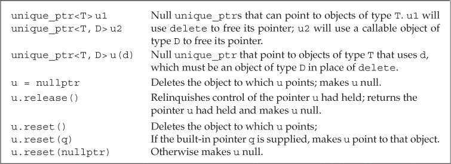

虽然我们不能拷贝或赋值unique_ptr，但可以通过调用release或reset，将指针的所有权从一个（非const） unique_ptr转移给另一个unique_ptr。 

- `release`函数返回`unique_ptr`当前保存的指针并将其置为空。

- `reset`函数成员接受一个可选的指针参数，重新设置`unique_ptr`保存的指针。如果`unique_ptr`不为空，则它原来指向的对象会被释放。

```c++
// transfers ownership from p1 (which points to the string Stegosaurus) to p2
unique_ptr<string> p2(p1.release());    // release makes p1 null
unique_ptr<string> p3(new string("Trex"));
// transfers ownership from p3 to p2
p2.reset(p3.release()); // reset deletes the memory to which p2 had pointed
```

调用`release`会切断`unique_ptr`和它原来管理的对象之间的联系。`release`返回的指针通常被用来初始化另一个智能指针或给智能指针赋值。如果没有用另一个智能指针保存`release`返回的指针，程序就要负责资源的释放。

```c++
p2.release();   // WRONG: p2 won't free the memory and we've lost the pointer
auto p = p2.release();   // ok, but we must remember to delete(p)
```

**所以release并不是真的release，并没有释放内存，而是切断了u对内存类的联系。打个比方，如果说reset就是复原游戏存档，release就是把存档从游戏文件夹踢出去，然后返回他的路径，但是如果你不保存这个路径，这个存档你也找不到了，而存档不在文件夹内，你在游戏里也读不到这个数据**

不能拷贝`unique_ptr`的规则有一个例外：可以拷贝或赋值一个即将被销毁的`unique_ptr`（移动构造、移动赋值）。【13.6.2】

```c++
unique_ptr<int> clone(int p)
{
    unique_ptr<int> ret(new int (p));
    // . . .
    return ret;
}
```

老版本的标准库包含了一个名为`auto_ptr`的类，

##### 向unique_ptr传递删除器·

类似`shared_ptr`，默认情况下`unique_ptr`用`delete`释放其指向的对象。`unique_ptr`的删除器同样可以重载，但`unique_ptr`管理删除器的方式与`shared_ptr`不同。【16.1.6】

定义`unique_ptr`时必须在尖括号中提供删除器类型。创建或`reset`这种`unique_ptr`类型的对象时，必须提供一个指定类型的可调用对象（删除器）。

```c++
// p points to an object of type objT and uses an object of type delT to free that object
// it will call an object named fcn of type delT
unique_ptr<objT, delT> p (new objT, fcn);

void f(destination &d /* other needed parameters */)
{
    connection c = connect(&d);  // open the connection
    // when p is destroyed, the connection will be closed
    unique_ptr<connection, decltype(end_connection)*> p(&c, end_connection);
    // use the connection
    // when f exits, even if by an exception, the connection will be properly closed
}
```


#### 12.1.6 weak_ptr

`weak_ptr`是一种不控制所指向对象生存期的智能指针，它指向一个由`shared_ptr`管理的对象。将`weak_ptr`绑定到`shared_ptr`不会改变`shared_ptr`的引用计数。如果`shared_ptr`被销毁，即使有`weak_ptr`指向对象，对象仍然有可能被释放。


创建一个`weak_ptr`时，**需要使用`shared_ptr`来初始化它。**

```c++
auto p = make_shared<int>(42);
weak_ptr<int> wp(p);    // wp weakly shares with p; use count in p is unchanged
```

因为weak_ptr指向的对象可能不存在，使用`weak_ptr`访问对象时，必须先调用`lock`函数。该函数检查`weak_ptr`指向的对象是否仍然存在。如果存在，则返回指向共享对象的`shared_ptr`，否则返回空指针。

```c++
if (shared_ptr<int> np = wp.lock())
{
    // true if np is not null
    // inside the if, np shares its object with p
}
```

> 关于弱引用的作用，这个举二叉树的例子讲的很好，
>
> 总之`shared_ptr`在环形引用中，带来了循环引用的弊端，所以，需要将其中一个设置为弱引用。 0
>
> https://blog.csdn.net/xiangbaohui/article/details/103628485

### 12.2 Dynamic Arrays

new和delete一次分配和释放一个对象，但是某些应用需要**一次为很多对象分配内存**的功能。

为此，C++语言和标准库提供了两种一次分配一个对象数组的方法。

- C++语言提供另一种new表达式语法。可以分配并初始化一个对象数组。
- 标准库包含一个`allocator`类，可以将内存分配和初始化过程分离，这通常会提供更好的性能和更灵活的内存管理能力。【12.2.2】

正常想要用可变长数组还是使用vector。【13.6】会介绍vector的诸多优势。

#### 12.2.1 new and Arrays

使用`new`分配对象数组时需要在类型名之后跟一对方括号，在其中指明要分配的对象数量（必须是整型，但不必是常量）。

`new`返回指向第一个对象的指针（元素类型）。

```c++
// call get_size to determine how many ints to allocate
int *pia = new int[get_size()];   // pia points to the first of these ints
```

由于`new`分配的内存并不是数组类型，我们得到的是一个数组元素类型的指针，因此不能对动态数组调用`begin`和`end`，也不能用范围`for`语句处理其中的元素。

**记住，动态数组并不是数组类型**

##### 初始化动态分配对象的数组

默认情况下，`new`分配的对象是默认初始化的。可以对数组中的元素进行值初始化，方法是在大小后面跟一对空括号`()`。在新标准中，还可以提供一个元素初始化器的花括号列表。**如果初始化器数量大于元素数量，则`new`表达式失败，不会分配任何内存，并抛出`bad_array_new_length`异常**。

```c++
int *pia = new int[10];     // block of ten uninitialized ints
int *pia2 = new int[10]();    // block of ten ints value initialized to 0
string *psa = new string[10];    // block of ten empty strings
string *psa2 = new string[10]();    // block of ten empty strings
// block of ten ints each initialized from the corresponding initializer
int *pia3 = new int[10] { 0, 1, 2, 3, 4, 5, 6, 7, 8, 9 };
// block of ten strings; the first four are initialized from the given initializers
// remaining elements are value initialized
string *psa3 = new string[10] { "a", "an", "the", string(3,'x') };
```

虽然可以使用空括号对`new`分配的数组元素进行值初始化，但不能在括号中指定初始化器。这意味着不能用`auto`分配数组。

> 关于初始化器
>
> https://blog.csdn.net/zhizhengguan/article/details/112305541

动态分配一个空数组是合法的，此时`new`会返回一个合法的非空指针。对于零长度的数组来说，该指针类似尾后指针，不能解引用。

使用`delete[]`释放动态数组。

```c++
delete p;       // p must point to a dynamically allocated object or be null
delete [] pa;   // pa must point to a dynamically allocated array or be null
```

如果在`delete`数组指针时忘记添加方括号，或者在`delete`单一对象时使用了方括号，编译器很可能不会给出任何警告，程序可能会在执行过程中行为异常。

##### 智能指针和动态数组

`unique_ptr`可以直接管理动态数组，定义时需要在对象类型后添加一对空方括号`[]`。

```c++
// up points to an array of ten uninitialized ints
unique_ptr<int[]> up(new int[10]);
up.release();   // automatically uses delete[] to destroy its pointer
```

指向数组的`unique_ptr`：

指向数组的`unique_ptr`不支持成员访问运算符（`.` 和  `->`）


与`unique_ptr`不同，`shared_ptr`不直接支持动态数组管理。如果想用`shared_ptr`管理动态数组，必须提供自定义的删除器。

```c++
// to use a shared_ptr we must supply a deleter
shared_ptr<int> sp(new int[10], [](int *p) { delete[] p; });
sp.reset();    // uses the lambda【10.3.2】 we supplied that uses delete[] to free the array
```

`shared_ptr`未定义下标运算符，智能指针类型也不支持指针算术运算。因此如果想访问`shared_ptr`管理的数组元素，必须先用`get`获取内置指针，再用内置指针进行访问。

```c++
// shared_ptrs don't have subscript operator and don't support pointer arithmetic
for (size_t i = 0; i != 10; ++i)
    *(sp.get() + i) = i;    // use get to get a built-in pointer
```


#### 12.2.2 The allocator Class

new有一些灵活性上的局限，其中一方面表现在它将内存分配和对象构造组合在一起。但当我们分配一大块内存时，通常计划在这块内存上按需构造对象，这时候我们希望将内存分配和对象构造分离，这样只在真正需要时才真正执行对象创建操作。

最典型的就是数组初始化，一开始定义的数组大小可能用不到那么多。这里的数组元素会经过两次赋值，即默认初始化以及赋值时。

而且更重要的是一些没有默认构造函数的类就不能动态分配数组了，

##### allocator类

allocator提供一种类型感知的内存分配方法，它分配的内存是原始的，未构造的。

`allocator`类是一个模板，定义时必须指定其可以分配的对象类型。

```c++
allocator<string> alloc;    // object that can allocate strings
auto const p = alloc.allocate(n);   // allocate n unconstructed strings
```

标准库`allocator`类及其算法：


##### `allocator`分配未构造的内存

`allocator`分配的内存是未构造的，程序需要在此内存中构造对象。

> In earlier versions of the library, construct took only two arguments: the pointer at which to construct an object and a value of the element type. As a result, we could only copy an element into unconstructed space, we could not use any other constructor for the element type.

新标准库的`construct`函数接受一个指针和零或多个额外参数，在给定位置构造一个元素。额外参数用来初始化构造的对象，必须与对象类型相匹配。

```c++
auto q = p;     // q will point to one past the last constructed element
alloc.construct(q++);    // *q is the empty string
alloc.construct(q++, 10, 'c');  // *q is cccccccccc
alloc.construct(q++, "hi");     // *q is hi!
```

直接使用`allocator`返回的未构造内存是错误行为，其结果是未定义的。

对象使用完后，必须对每个构造的元素调用`destroy`进行销毁。`destroy`函数接受一个指针，对指向的对象执行析构函数。

```c++
while (q != p)
    alloc.destroy(--q);  // free the strings we actually allocated
```

`deallocate`函数用于释放`allocator`分配的内存空间。传递给`deallocate`的指针不能为空，它必须指向由`allocator`分配的内存。而且传递给`deallocate`的大小参数必须与调用`allocator`分配内存时提供的大小参数相一致。

```c++
alloc.deallocate(p, n);
```

##### 拷贝和填充未初始化内存的算法

标准库为allocator定义了两个伴随算法，可以在未初始化内存中创建对象。

`allocator`算法：


传递给`uninitialized_copy`的目的位置迭代器必须指向未构造的内存，它直接在给定位置构造元素。返回（递增后的）目的位置迭代器。

### 12.3 Using the Library: A Text-Query Program 使用标准库 文本查询程序

#### 12.3.1 Design of the Query Program

#### 12.3.2 Defining the Query Program Classes

### Chapter Summary  

在C++中，内存是通过new来分配，delete表达式释放的。

标准库还定义了一个allocator来分配动态内存块。

内存的释放是一个大难题，现代c++编程建议使用智能指针。

### Defined Terms

| 中文     | 英文             | 含义                                                         |
| -------- | ---------------- | ------------------------------------------------------------ |
| 空悬指针 | dangling pointer | 一个指针，指向曾经保存一个对象但现在已释放的内存。           |
| 定位new  | placement new    | 一种new表达式形式，接受一些额外的参数，在new关键字后面的括号中给出，例如new(nothrow)告诉new不要抛出异常 |
| 智能指针 | shared_ptr       | 提供所有权共享的智能指针：对共享指针来说，当最后一个指向它的shared_ptr被销毁是会被释放 |
|          | unique_ptr       | 提供独享所有权的智能指针：当unique_ptr被销毁时，他指向的对象被释放。unique_ptr不能直接拷贝或复制。可以通过调用release或reset，将指针的所有权从一个（非const） unique_ptr转移给另一个unique_ptr。 |
|          | weak_ptr         | 一种智能指针，指向由shared_ptr管理的对象，在确定是否释放对象时，shared_ptr不将其考虑在内。 |
|          |                  |                                                              |
|          |                  |                                                              |


# Part III 类设计者的工具 Tools for Class Authors 

类是C++的核心概念。

第七章，我们已经介绍了类的所有基本知识

- 类作用域

- 数据隐藏

- 构造函数

- 重要特性

  - 成员函数
  - 隐式this指针
  - 友元
  - const、static、mutable成员

  

在Part 3，我们会介绍更多

- 拷贝控制
- 重载运算符
- 继承和模板

## Chapter 13 Copy Control 拷贝控制

当我们定义一个类时，我们显式或隐式地指定在此类型的对象拷贝、移动、赋值和销毁时做什么。

学习类如何控制类型对象拷贝、赋值、移动或销毁时做什么。

一个类通过定义五种特殊的成员函数来控制对象的拷贝、移动、赋值和销毁操作。

- 拷贝构造函数（copy constructor）

- 拷贝赋值运算符（copy-assignment operator）

- 移动构造函数（move constructor）

- 移动赋值运算符（move-assignment operator）

- 析构函数（destructor）

这些操作统称为拷贝控制操作（copy control）。

如果一个类没有定义所有这些拷贝控制成员，编译器会自动为它定义缺失的操作。但是有时候依赖这些默认操作会导致灾难。

**因此，认识到什么时候需要自己定义这些操作时实现拷贝控制操作最困难的地方**

### 13.1 Copy, Assign, and Destroy 拷贝、赋值和销毁

#### 13.1.1 The Copy Constructor

如果一个构造函数的第一个参数是自身类类型的引用（几乎总是`const`引用），且任何额外参数都有默认值，则此构造函数是拷贝构造函数。

```c++
class Foo
{
public:
    Foo();   // default constructor
    Foo(const Foo&);   // copy constructor
    // ...
};
```

由于拷贝构造函数在一些情况下会被隐式使用，因此通常不会声明为`explicit`的。

##### 合成拷贝构造函数

如果类未定义自己的拷贝构造函数，编译器会为类合成一个。一般情况下，合成拷贝构造函数（synthesized copy constructor）会将其参数的非`static`成员逐个拷贝到正在创建的对象中。

```c++
class Sales_data
{
public:
    // other members and constructors as before
    // declaration equivalent to the synthesized copy constructor
    Sales_data(const Sales_data&);
private:
    std::string bookNo;
    int units_sold = 0;
    double revenue = 0.0;
};

// equivalent to the copy constructor that would be synthesized for Sales_data
Sales_data::Sales_data(const Sales_data &orig):
    bookNo(orig.bookNo),    // uses the string copy constructor
    units_sold(orig.units_sold),    // copies orig.units_sold
    revenue(orig.revenue)   // copies orig.revenue
    { } // empty bod
```

##### 拷贝初始化

使用直接初始化时，实际上是要求编译器按照函数匹配规则来选择与实参最匹配的构造函数。使用拷贝初始化时，是要求编译器将右侧运算对象拷贝到正在创建的对象中，如果需要的话还要进行类型转换。

```c++
string dots(10, '.');   // direct initialization
string s(dots);         // direct initialization
string s2 = dots;       // copy initialization
string null_book = "9-999-99999-9";    // copy initialization
string nines = string(100, '9');       // copy initialization
```

拷贝初始化通常使用拷贝构造函数来完成。**但如果一个类拥有移动构造函数，则拷贝初始化有时会使用移动构造函数而非拷贝构造函数来完成。**

**发生拷贝初始化的情况：**

- 用`=`定义变量。

- 将对象作为实参传递给非引用类型的形参。

- 从返回类型为非引用类型的函数返回对象。

- 用花括号列表初始化数组中的元素或聚合类中的成员。

##### 拷贝构造函数的参数必须是引用类型：

因为在函数调用过程中，具有非引用类型的参数要进行拷贝初始化【6.2.1】，在函数具有非引用的返回类型时，返回值会被用来初始化调用方的结果【6.3.2】。

如果拷贝构造函数的参数不是引用，那么我们会拷贝他的实参，而为了拷贝实参，我们又需要调用拷贝构造函数。无限循环。

##### 拷贝初始化的限制

当传递一个实参或者从函数返回一个值时，不能隐式使用`explicit`构造函数。

```c++
vector<int> v1(10);     // ok: direct initialization
vector<int> v2 = 10;    // error: constructor that takes a size is explicit
void f(vector<int>);    // f's parameter is copy initialized
f(10);      // error: can't use an explicit constructor to copy an argument
f(vector<int>(10));     // ok: directly construct a temporary vector from an int
```

##### 编译器可以绕过拷贝构造函数

```c++
string null_book = "9999";
string null_book("9999");
```

但是即使编译器略过了拷贝/移动构造函数，但是在这个程序点上，拷贝/移动构造函数必须是存在且可访问的（不能是private)。

#### 13.1.2 The Copy-Assignment Operator 拷贝赋值运算符

##### 重载赋值运算符

先简单介绍一下重载运算符【14】

重载运算符（overloaded operator）本质上是函数，其名字由operator关键字接要定义的运算符的符号组成。类似其他函数，运算符函数也有一个返回类型和一个参数列表。

重载运算符的参数表示运算符的运算对象。一些重载运算符，必须定义为成员函数。

而如果一个运算符是成员函数，则其左侧运算对象会绑定到隐式的`this`参数上。

赋值运算符通常应该返回一个指向其左侧运算对象的引用。

```c++
class Foo
{
public:
    Foo& operator=(const Foo&);  // assignment operator
    // ...
};
```


##### 合成拷贝赋值运算符

标准库通常要求保存在容器中的类型要具有赋值运算符，且其返回值是左侧运算对象的引用。

如果类未定义自己的拷贝赋值运算符，编译器会为类合成一个合成拷贝赋值运算符（synthesized copy-assignment operator）。

类似拷贝构造函数，对于某些类，合成拷贝赋值运算符用来禁止该类型对象的赋值【13.1.6】。

如果不是出于此目的，那么他会将其右侧运算对象的非`static`成员逐个赋值给左侧运算对象的对应成员，之后返回左侧运算对象的引用。这一操作时通过成员类型的拷贝赋值运算符来完成的。

对于数组类型的成员，逐个赋值数组元素。合成拷贝赋值运算符返回一个指向其左值运算对象的引用。

```c++
// 等价于合成拷贝赋值运算符
Sales_data& Sales_data::operator=(const Sales_data &rhs)
{
    bookNo = rhs.bookNo;    // calls the string::operator=
    units_sold = rhs.units_sold;    // uses the built-in int assignment
    revenue = rhs.revenue;  // uses the built-in double assignment
    return *this;   // return a reference to this object
}
```


#### 13.1.3 The Destructor

析构函数负责释放对象使用的资源，并销毁对象的非`static`数据成员。

析构函数的名字由波浪号`~`接类名构成，它没有返回值，也不接受参数。

```c++
class Foo
{
public:
    ~Foo(); // destructor
    // ...
};
```

由于析构函数不接受参数，所以它不能被重载。一个给定类，只能有一个析构函数。

##### 析构函数完成的工作

如果类未定义自己的析构函数，编译器会为类合成一个。合成析构函数（synthesized destructor）的函数体为空。

析构函数首先执行函数体，然后再销毁数据成员。在整个对象销毁过程中，析构函数体是作为成员销毁步骤之外的另一部分而进行的。成员按照初始化顺序的逆序销毁。内置类型没有析构函数，销毁内置类型什么都不需要做。

隐式销毁一个内置指针类型的成员不会`delete`它所指向的对象。

无论何时一个对象被销毁，都会自动调用其析构函数。

##### 什么时候会调用析构函数

无论何时一个对象被销毁，就会自动调用其析构函数

- 变量在离开其作用域时被销毁
- 当一个对象被销毁时，其成员被销毁
- 容器（无论是标准库容器还是数组）被销毁时，其元素被销毁。
- 对于动态分配的对象，当对指向它的指针应用delete运算符时被销毁【12.1.2】
- 对于临时对象，当创建它的完整表达式结束时被销毁。

当指向一个对象的引用或指针离开作用域时，该对象的析构函数不会执行。

##### 合成构造函数

当一个类未定义自己的析构函数时，编译器会为它定义一个合成析构函数(synthesized destructor)

对于某些类，合成析构函数被用来阻止该类型的对象被销毁【13.1.6】，如果不是这个情况，合成构造函数为空。

认识到析构函数体本身并不直接销毁成员是非常重要的。成员是析构函数体之后隐含的析构结算中被销毁的。

在整个对象销毁过程中，析构函数体是作为成员销毁步骤之外的另一部分而进行的。

#### 13.1.4 The Rule of Three/Five 三五法则

如前所述，三个基本操作可以控制类的拷贝操作：

- 拷贝构造函数
- 拷贝赋值运算符
- 析构函数

在新标准下，一个类还可以定义一个移动构造函数和一个移动赋值运算符。【13.6】

##### 需要析构函数的类一般也需要拷贝和赋值操作。

- 当我们决定一个类是否要定义它自己版本的拷贝控制成员是，一个基本原则是首先确定这个类是否需要一个析构函数。
- 如果一个类需要一个析构函数，我们几乎可以肯定它也需要一个拷贝构造函数和一个拷贝赋值运算符。（这个更加常见）

```c++
HasPtr f(HasPtr hp){
    HasPtr ret = hp;
    //
    return ret;
}
//这里是传值，所以会拷贝hp，这会让两个对象指向相同的内存。
//在f返回时，hp和ret都会被销毁，所以这个指针会被delete两次。
```

##### 需要拷贝操作的类一般也需要赋值操作，反之亦然。

比如如果我构造的一个类，给每个对象一个独一无二的序号，那么每次拷贝以及赋值时都需要进行一些特定操作。但是这个类不需要自定义析构函数。

```c++
//13.14-13.17作业
#include <iostream>
#include <cstdlib>
#include <string>

class numbered
{
friend void f(const numbered&);
public:
	numbered() : mysn(std::to_string(std::rand())) { };
	numbered(const numbered&) : mysn(std::to_string(std::rand())) { };
	~numbered() { };
private:
	std::string mysn;
};

void f(const numbered &s)
{
	std::cout << s.mysn << std::endl;
}

int main()
{
	numbered a, b = a, c = b;
	f(a); f(b); f(c);

	return 0;
}
```

除此之外，并不意味着必然需要析构函数。

> 定义一个类时，我们显式地或隐式地指定了此类型的对象在拷贝、赋值和销毁时做什么。一个类通过定义三种特殊的成员函数来控制这些操作，分别是**拷贝构造函数**、**赋值运算符**和**析构函数**。
>
> - 拷贝构造函数定义了当用同类型的另一个对象初始化新对象时做什么，
>
> - 赋值运算符定义了将一个对象赋予同类型的另一个对象时做什么，
>
> - 析构函数定义了此类型的对象销毁时做什么。我们将这些操作称为**拷贝控制操作**。
>
> 由于拷贝控制操作是由三个特殊的成员函数来完成的，所以我们称此为“C++三法则”。在较新的 C++11 标准中，为了支持移动语义，又增加了移动构造函数和移动赋值运算符，这样共有五个特殊的成员函数，所以又称为“C++五法则”。也就是说，“三法则”是针对较旧的 C++89 标准说的，“五法则”是针对较新的 C++11 标准说的。为了统一称呼，后来人们干把它叫做“C++ 三/五法则”。[[1\]](https://zhuanlan.zhihu.com/p/157833251#ref_1)
>
> 如果一个类需要定义析构函数，那么几乎可以肯定这个类也需要一个拷贝构造函数和一个赋值运算符。默认的析构函数不会释放人为设置的内存，所以我们需要显式地定义一个析构函数来释放内存。
>
> 我们使用上一小节的Array类，假设我们为其定义了析构函数，但是用默认的拷贝构造函数和赋值运算符，，那么将导致不同对象之间相互干扰，修改一个对象的数据会影响另外的对象。此外还可能会导致内存操作错误：
>
> ```cpp
>     Array func(Array arr){ 
>         Array ret = arr; 
>         return ret; 
>     }
> ```
>
> 当 func() 返回时，arr 和 ret 都会被销毁，在两个对象上都会调用析构函数，此析构函数会 free() 掉 m_p 成员所指向的动态内存。但是，这两个对象的 m_p 成员指向的是同一块内存，所以该内存会被 free() 两次，这显然是一个错误，将要发生什么是未知的。
>
> 此外，func() 的调用者还会继续使用传递给 func() 的对象：
>
> ```cpp
>     Array arr1(10);
>     func(arr1);  
>     Array arr2 = arr1;  
> ```
>
> arr2（以及 arr1）指向的内存不再有效，在 arr（以及 ret）被销毁时系统已经归还给操作系统了。
>
> **如果一个类需要定义析构函数，那么几乎可以肯定它也需要定义拷贝构造函数和赋值运算符。**
>
> 需要拷贝操作的类也一定需要赋值操作，反之亦然。虽然很多类需要定义所有（或是不需要定义任何）拷贝控制成员，但某些类所要完成的工作，只需要拷贝或者赋值操作，不需要析构操作。
>
> 考虑一个类为每个对象分配一个独有的、唯一的编号。这个类除了需要一个拷贝构造函数为每个新创建的对象生成一个新的编号，还需要一个赋值运算符来避免将一个对象的编号赋值给另外一个对象。但是，这个类并不一定需要析构函数。
>
> **如果一个类需要一个拷贝构造函数，几乎可以肯定它也需要一个赋值运算符；反之亦然。然而，无论需要拷贝构造函数还是需要复制运算符，都不必然意味着也需要析构函数。**

#### 13.1.5 Using = default

可以通过将拷贝控制成员定义为`=default`来**显式地要求编译器生成合成版本**。

```c++
class Sales_data
{
public:
    // copy control; use defaults
    Sales_data() = default;
    Sales_data(const Sales_data&) = default;
    ~Sales_data() = default;
    // other members as before
};
```

在类内使用`=default`修饰成员声明时，合成的函数是隐式内联的。如果不希望合成的是内联函数，应该只对成员的类外定义使用`=default`。

只能对具有合成版本的成员函数使用`=default`。即默认构造函数或拷贝控制成员。

#### 13.1.6 Preventing Copies

大多数类应该定义默认构造函数、拷贝构造函数和拷贝赋值运算符，无论是显式地还是隐式地。

在C++11新标准中，将拷贝构造函数和拷贝赋值运算符定义为删除的函数（deleted function）可以阻止类对象的拷贝。删除的函数是一种虽然进行了声明，但是却不能以任何方式使用的函数。定义删除函数的方式是在函数的形参列表后面添加`=delete`。

```c++
struct NoCopy
{
    NoCopy() = default; // use the synthesized default constructor
    NoCopy(const NoCopy&) = delete; // no copy
    NoCopy &operator=(const NoCopy&) = delete; // no assignment
    ~NoCopy() = default; // use the synthesized destructor
    // other members
};
```

`=delete`和`=default`有两点不同：

- `=delete`可以对任何函数使用；`=default`只能对具有合成版本的函数使用。

- `=delete`必须出现在函数第一次声明的地方；`=default`既能出现在类内，也能出现在类外。

##### 析构函数不能是删除的函数。

对于析构函数被删除的类型，不能定义该类型的变量或者释放指向该类型动态分配对象的指针。

对于这类，我们不能定义，但是可以动态分配，但是不能释放。

##### 合成的拷贝控制成员可能是删除的

如果一个类中有数据成员不能默认构造、拷贝或销毁，则对应的合成拷贝控制成员将被定义为删除的。

【13.6.2】【15.7.2】【19.6】会进一步介绍类的拷贝构造函数定义为删除函数的其他原因。

##### private拷贝控制

在旧版本的C++标准中，类通过将拷贝构造函数和拷贝赋值运算符声明为`private`成员来阻止类对象的拷贝。

但友元函数仍能访问，为了避免，我们将这些拷贝控制成员定义为private，但不定义它们。这是合法的【6.1.2】有一个例外【15.2.1】。

试图访问一个未定义的成员将导致一个链接时错误。

通过声明（但不定义）private的拷贝构造函数，我们可以预先阻止任何拷贝该类型对象的企图：

- 试图拷贝对象的用户代码将在编译阶段被标记为错误；
- 成员函数或友元函数中的拷贝函数将在链接时错误。

在新标准中建议使用`=delete`而非`private`。

### 13.2 Copy Control and Resource Management 拷贝控制和资源管理

通常，管理类外资源的类必须定义拷贝控制成员。这种类需要析构函数来释放对象所分配的资源，而一旦一个类需要析构函数，那么它几乎肯定需要一个拷贝构造函数和一个拷贝赋值运算符。

定义拷贝操作，是类的行文看起来像个类或指针。

- 类的行为像一个值，意味着它应该有自己的状态，当我们拷贝一个像值的对象时，副本和原对象时完全独立的。改变副本不会对原对象有任何影响，反之亦然。 --- string
- 类的行为像一个指针，当我们拷贝一个这种类的对象是，副本和原对象使用相同的底层数据。改变副本你也会改变原对象，反之亦然。 --- shared_ptr

#### 13.2.1 Classes That Act Like Values 

为了提供类值的行为，对于类管理的资源，每个对象都应该拥有一份自己的拷贝。

为此，HasPtr类需要

- 定义一个拷贝构造函数，完成string的拷贝，而不是拷贝指针
- 定义一个析构函数来说释放string
- 定义一个拷贝赋值运算符来释放对象当前的string，并从右侧运算对象拷贝string

```C++
class HasPtr
{
public:
    HasPtr(const std::string &s = std::string())://构造函数
        ps(new std::string(s)), i(0) { }
    // each HasPtr has its own copy of the string to which ps points
    HasPtr(const HasPtr &p)://拷贝构造函数
        ps(new std::string(*p.ps)), i(p.i) { }
    HasPtr& operator=(const HasPtr &);//拷贝赋值运算符
    ~HasPtr() { delete ps; }//析构函数

private:
    std::string *ps;
    int i;
};
```

##### 类值拷贝赋值运算符

赋值运算符通常组合了析构函数䄦构造函数的操作。

编写赋值运算符时有两点需要注意：

- 即使将一个对象赋予它自身，赋值运算符也能正确工作。异常安全（当异常发生时，左侧运算符也应该是一个有意义的状态）

  ```c++
  // WRONG way to write an assignment operator!
  HasPtr& HasPtr::operator=(const HasPtr &rhs)
  {
      delete ps;   // frees the string to which this object points
      // if rhs and *this are the same object, we're copying from deleted memory!
      ps = new string(*(rhs.ps));
      i = rhs.i;
      return *this;
  }
  ```

- 赋值运算符通常结合了拷贝构造函数和析构函数的工作。

  编写赋值运算符时，一个好的方法是先将右侧运算对象拷贝到一个局部临时对象中。拷贝完成后，就可以安全地销毁左侧运算对象的现有成员了。

  ```c++
  HasPtr& HasPtr::operator=(const HasPtr &rhs)
  {
      auto newp = new string(*rhs.ps);    // copy the underlying string
      delete ps;   // free the old memory
      ps = newp;   // copy data from rhs into this object
      i = rhs.i;
      return *this;   // return this object
  }
  ```


#### 13.2.2 Defining Classes That Act Like Pointers

对于行为类似指针的类，我们需要为其定义拷贝构造函数和拷贝赋值运算符，来拷贝指针成员本身而不是它指向的string。但是析构函数不能单方面地释放关联的string。只有当最后一个指向string 的HasPtr销毁时，它才可以释放string。

达到如上效果的最好的方式是使用shared_ptr。但是有时我们希望直接管理资源，在这种情况下，使用引用计数（reference count）就有用了。

##### 引用计数

- 除了初始化对象外，每个构造函数（拷贝构造函数除外）还要创建一个引用计数，用来记录有多少对象与正在创建的对象共享状态。当我们创建一个对象时，只有一个对象共享状态，因此将计数器初始化为1。
- 拷贝构造函数不分配新的计数器，而是拷贝给定对象的数据成员，包括计数器。拷贝构造函数递增共享的计数器。指出给定对象的状态又被一个新用户所共享。
- 析构函数递减计数器，指出共享状态的用户少了一个。如果计数器变为0，则析构函数释放状态。
- 拷贝赋值运算符递增右侧运算对象的计数器，递减左侧运算对象的计数器。如果左侧运算对象的计数器变为0，意味着它的共享状态没有用户了，拷贝赋值运算符就必须销毁状态。

一个关键问题是在哪里存放引用计数？

解决此问题的一种方法是将计数器保存在动态内存中。当创建一个对象时，我们也分配一个新的计数器。当拷贝或赋值对象时，我们拷贝指向计数器的指针。使用这种方法，副本和原对象都会指向相同的计数器。

##### 定义一个使用引用计数的类

```c++
class HasPtr
{
public:
    // constructor allocates a new string and a new counter, which it sets to 1
    HasPtr(const std::string &s = std::string()):
        ps(new std::string(s)), i(0), use(new std::size_t(1)) {}
    // copy constructor copies all three data members and increments the counter
    HasPtr(const HasPtr &p):
        ps(p.ps), i(p.i), use(p.use) { ++*use; }
    HasPtr& operator=(const HasPtr&);
    ~HasPtr();

private:
    std::string *ps;
    int i;
    std::size_t *use; // 用来记录有多少个对象共享*ps的对象
};
```

##### 类指针的拷贝成员“篡改”引用计数

析构函数释放内存前应该判断是否还有其他对象指向这块内存。

拷贝赋值运算符：递增右侧运算符对象的引用计数（拷贝构造函数），并递减左侧运算对象的引用计数，在必要时释放使用的内存（析构函数）

```c++
HasPtr::~HasPtr()
{
    if (--*use == 0)
    {   // if the reference count goes to 0
        delete ps;   // delete the string
        delete use;  // and the counter
    }
}

HasPtr& HasPtr::operator=(const HasPtr &rhs)
{
    ++*rhs.use;    // increment the use count of the right-hand operand
    if (--*use == 0)
    {   // then decrement this object's counter
        delete ps; // if no other users
        delete use; // free this object's allocated members
    }
    ps = rhs.ps;    // copy data from rhs into this object
    i = rhs.i;
    use = rhs.use;
    return *this;   // return this object
}
```

这里也进行了自赋值检查，即先递增rhs中的计数然后再递减左侧运算对象中的计数来实现这一点。如此当两个对象相同时，在我们检查ps及use是否应该释放时，计数器已经被递增过了，不会被释放内存。

### 13.3 Swap 交换操作

通常，管理类外资源的类会定义`swap`函数。如果一个类定义了自己的`swap`函数，算法将使用自定义版本，否则将使用标准库定义的`swap`。

swap本质上是需要一次拷贝和两次赋值，相比于拷贝对象，我们更希望拷贝指针（节约空间）。

```c++
string *temp = v1.ps;
v1.ps = v2.ps;
v2.ps = temp;
```

###### 编写自己的swap函数

```c++
class HasPtr
{
    friend void swap(HasPtr&, HasPtr&);
    // other members as in § 13.2.1 (p. 511)
};

inline void swap(HasPtr &lhs, HasPtr &rhs)
{
    using std::swap;
    swap(lhs.ps, rhs.ps);   // swap the pointers, not the string data
    swap(lhs.i, rhs.i);     // swap the int members
}
```

首先将swap定义为friend，以便能访问HasPtr的private成员。

##### swap函数应该调用swap，而不是std::swap

> using std::swap 的作用
>
> http://dengzuoheng.github.io/cpp-swap
>
> https://stackoverflow.com/questions/4782692/what-does-using-stdswap-inside-the-body-of-a-class-method-implementation-mea

一些算法在交换两个元素时会调用`swap`函数，其中每个`swap`调用都应该是未加限定的。如果存在类型特定的`swap`版本，其匹配程度会优于`std`中定义的版本（假定作用域中有`using`声明）。

```c++
void swap(Foo &lhs, Foo &rhs)
{
    // WRONG: this function uses the library version of swap, not the HasPtr version
    std::swap(lhs.h, rhs.h);
    // swap other members of type Foo
}

void swap(Foo &lhs, Foo &rhs)
{
    using std::swap;//先using std::swap使得此处std::swap可见, 然后让编译器自己决定调用哪个版本的swap函数【18.2.3】
    swap(lhs.h, rhs.h);  // uses the HasPtr version of swap
    // swap other members of type Foo
}
```

与拷贝控制成员不同，`swap`函数并不是必要的。但是对于分配了资源的类，定义`swap`可能是一种重要的优化手段。

由于`swap`函数的存在就是为了优化代码，所以一般将其声明为内联函数。

##### 在赋值运算符中使用swap

定义了`swap`的类通常用`swap`来实现赋值运算符。在这种版本的赋值运算符中，右侧运算对象以值方式传递，然后将左侧运算对象与右侧运算对象的副本进行交换（拷贝并交换，copy and swap）。这种方式可以正确处理自赋值情况。

```c++
// note rhs is passed by value, which means the HasPtr copy constructor
// copies the string in the right-hand operand into rhs
HasPtr& HasPtr::operator=(HasPtr rhs)
{
    // swap the contents of the left-hand operand with the local variable rhs
    swap(*this, rhs);   // rhs now points to the memory this object had used
    return *this;       // rhs is destroyed, which deletes the pointer in rhs
}
```

在实际操作中我遇到过

```c++
	// 重载赋值函数
	ModelObject &ModelObject::operator=(ModelObject other)
	{
		this->swap(other);
		return *this;
	}
```

这种方式交换rhs和*this中的数据成员，赋值运算符结束时，rhs被销毁，HasPtr的析构函数将执行。此析构函数delete rhs现在指向的内存，即原来左值运算对象指向的内存。

### 13.4 A Copy-Control Example 

资源管理并不是一个类需要定义自己拷贝控制成员的唯一原因。一些类也需要拷贝控制成员的帮助来进行簿记工作或其他操作。 

```c++
#ifndef MESSAGE_H_
#define MESSAGE_H_

#include <string>
#include <set>

class Folder;

class Message
{
	friend class Folder;
	friend void swap(Message&, Message&);
public:
	explicit Message(const std::string &str = "") : contents(str) { };
	Message(const Message&); //拷贝构造函数
	Message& operator=(const Message&);//拷贝赋值运算符
	~Message();//析构函数
	void save(Folder&);
	void remove(Folder&);
private:
	std::string contents; // 实际消息文本
	std::set<Folder*> folders; // 包含本message的folder
	void add_to_Folders(const Message&); // 将本message加入folder
	void remove_from_Folders();//从每个folder删除message
	void addFldr(Folder *f) { folders.insert(f); }
	void remFldr(Folder *f) { folders.erase(f); }
};

class Folder
{
	friend void swap(Folder&, Folder&);
	friend class Message;
public:
	Folder() = default;
	Folder(const Folder &);
	Folder& operator=(const Folder&);
	~Folder();
private:
	std::set<Message*> msgs;
	void add_to_Message(const Folder&);
	void remove_from_Message();
	void addMsg(Message *m) { msgs.insert(m); }
	void remMsg(Message *m) { msgs.erase(m); }
};

void Message::save(Folder &f)
{
	folders.insert(&f);
	f.addMsg(this);//folder那边要提供的操作
}

void Message::remove(Folder &f)
{
	folders.erase(&f);
	f.remMsg(this);
}

void Message::add_to_Folders(const Message &m)
{
	for(auto f : m.folders)
		f->addMsg(this);
}

Message::Message(const Message & m) : contents(m.contents), folders(m.folders)//拷贝构造函数
{
	add_to_Folders(m);
}

void Message::remove_from_Folders()                    
{
	for(auto f : folders)
		f->remMsg(this);
}

Message::~Message()
{
	remove_from_Folders();
}

Message& Message::operator=(const Message &rhs)
{
	remove_from_Folders();
	contents = rhs.contents;
	folders = rhs.folders;
	add_to_Folders(rhs);
	return *this;
}

 void swap(Message &lhs, Message &rhs)
 {
 	using std::swap;
 	for(auto f : lhs.folders)
 		f->remMsg(&lhs);
 	for(auto f : rhs.folders)
 		f->remMsg(&rhs);//将msg从它们各自的folder删除
 	swap(lhs.folders, rhs.folders);
 	swap(lhs.contents, rhs.contents);//交换他们的contents和folder指针set
 	for(auto f : lhs.folders)
 		f->addMsg(&lhs);
 	for(auto f : rhs.folders)//再将交换后的message插入folder
 		f->addMsg(&rhs);
 }

void Folder::add_to_Message(const Folder &f)
{
	for(auto m : f.msgs)
		m->addFldr(this);
}

Folder::Folder(const Folder &f) : msgs(f.msgs)
{
	add_to_Message(f);
}

void Folder::remove_from_Message()
{
	for(auto m : msgs)
		m->remFldr(this);
}

Folder::~Folder()
{
	remove_from_Message();
}

Folder &Folder::operator=(const Folder &rhs)
{
	remove_from_Message();
	msgs = rhs.msgs;
	add_to_Message(rhs);
	return *this;
}

#endif
```


拷贝赋值运算符通常结合了拷贝构造函数和析构函数的工作。在这种情况下，公共部分应该放在`private`的工具函数中完成。

### 13.5 Classes That Manage Dynamic Memory

一般在运行时分配可变大小的内存，应该使用标准库容器来保存他们的数据。

但某些类需要自己进行内存分配，这些类一般必须定义自己的拷贝控制成员来管理所分配的内存。

#### 例子 设计一个简易`vector<string>`类`StrVec`

StrVec类的设计

* 使用allocator来获得原始内存
* 使用allocator的construct元素在分配的原始内中创建对象
* 使用destroy成员来销毁元素

每个StrVec有三个指针成员指向其元素所使用的内存

- elements，指向分配的内存中的首元素
- first_free，指向最后一个实际元素之后的位置
- cap，指向分配的内存末尾之后的位置

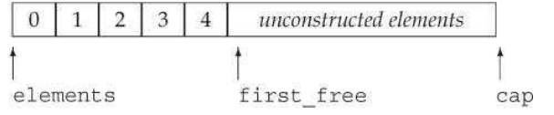

除了这些指针外，StrVec还有一个名为alloc的静态成员，其类型为`allocator<string>`。alloc成员会分配StrVec使用的内存。

该类还有四个成员函数：

- allo_n_copy 分配内存，并拷贝一个给定范围中的元素
- free会销毁构造的元素并释放内存
- chk_n_alloc保证StrVec至少有容纳一个新元素的空间，如果没有空间添加新元素，那么调用reallocate来分配更多内存。
- reallocate在内存用完时为StrVec分配新内存。

```c++
#ifndef STRVEC_H_
#define STRVEC_H_

#include <string>
#include <utility>
#include <memory>
#include <initializer_list>

class StrVec
{
public:
	StrVec() : elements(nullptr), first_free(nullptr), cap(nullptr) { }//allocator成员进行默认初始化
	StrVec(const StrVec&);
	StrVec &operator=(const StrVec&);
	~StrVec();
    
	void push_back(const std::string&);//拷贝元素
	size_t size() const { return first_free - elements; }
	size_t capacity() const { return cap - elements; }
	std::string *begin() const { return elements; }
	std::string *end() const { return first_free; }
	void reserve(size_t n);
	void resize(size_t n);
	void resize(size_t n, const std::string &s);
private:
	std::allocator<std::string> alloc;//分配元素
	void chk_n_alloc() { if(size() == capacity()) reallocate(); }
	std::pair<std::string*, std::string*> alloc_n_copy(const std::string*, const std::string*);
	void free();
	void reallocate();
	std::string *elements;
	std::string *first_free;
	std::string *cap;
};

void StrVec::push_back(const std::string &s)
{
	chk_n_alloc();//确保有空间容纳新元素
	alloc.construct(first_free++, s);
}

std::pair<std::string*,std::string*> StrVec::alloc_n_copy(const std::string *b, const std::string *e)
{
    //返回一个指针的pair，分别指向新科技的开始位置和拷贝的尾后位置。
	auto data = alloc.allocate(e-b);
	return {data, uninitialized_copy(b, e, data)};//【12.2】从迭代器b、e指出的输入范围中拷贝元素到data指定的未构造的原始内存中。data指向的空间必须足够大，可以容纳拷贝元素。
}

void StrVec::free()
{
	if(elements)//不能传递给destroy一个空指针
	{
		for(auto p = first_free; p != elements; )
			alloc.destroy(--p);//逆序删除旧元素
		alloc.deallocate(elements, cap-elements);
	}
}

StrVec::StrVec(const StrVec &s)
{
	auto newdata = alloc_n_copy(s.begin(), s.end());
	elements = newdata.first;
	first_free = cap = newdata.second;
}

StrVec::~StrVec()
{
	free();
}

void StrVec::reserve(size_t n)
{
	if(n <= capacity()) return;
	auto newdata = alloc.allocate(n);
	auto dest = newdata;
	auto elem = elements;
	for(size_t i = 0; i != size(); ++i)
		alloc.construct(dest++, std::move(*elem++));
	free();
	elements = newdata;
	first_free = dest;
	cap = elements + n;
}

void StrVec::resize(size_t n)
{
	resize(n,std::string());
}

void StrVec::resize(size_t n, const std::string &s)
{
	if(n < size())
	{
		while(n < size())
			alloc.destroy(--first_free);
	}else if(n > size())
	{
		while(n > size())
			push_back(s);
			// alloc.construct(first_free, s);
	}
}

StrVec &StrVec::operator=(const StrVec &rhs)
{
	auto data = alloc_n_copy(rhs.begin(), rhs.end());
	free();
	elements = data.first;
	first_free = cap = data.second;
	return *this;
}

void StrVec::reallocate()
{
	auto newcapacity = size() ? 2 * size() : 1;
	auto newdata = alloc.allocate(newcapacity);
	auto dest = newdata;
	auto elem = elements;
	for(size_t i = 0; i != size(); ++i)
		alloc.construct(dest++, std::move(*elem++));
	free();
	elements = newdata;
	first_free = dest;
	cap = elements + newcapacity;
}

#endif
```

##### 编写reallocate

###### 在重新分配内存的过程中移动而不是拷贝元素

reallocate应该做到

- 为一个新的，更大的string数组分配内存。
- 在内存空间的前一部分构造对象，保存现有元素
- 销毁原内存空间中的元素，并释放这块内存

这里我们看到，为一个StrVec出现分配空间会引起从旧内存空间到新内存空间逐个拷贝string。由于string具有类值行为，所以拷贝一个string时，新旧string是互相独立的， 每个string会有两个使用者，而如果是reallocate拷贝，每个string只有一个使用者。

所以实际上拷贝这个步骤是多余的。我们应避免分配和释放string的额外开销。

###### 移动构造函数和std::move

通过新标准库引入的两种机制，可以避免string的拷贝。

- 一些标准库类，都支持“移动构造函数”，并保证移后源依然保持一个有效的、可析构的状态。

- std::move ，定义在`utility`头文件里。
  - 当reallocate在新内存构造string时，他必须调用move来表示希望使用string 的移动构造函数【13.6.1】。如果漏掉，那么会使用String的拷贝构造函数。
  - 我们通常不会为move提供一个using声明，原因【18.2.3】，我们会直接使用std::move
  - 

```c++
void StrVec::reallocate()
{
	auto newcapacity = size() ? 2 * size() : 1;//分配当前大小两倍的空间，如果为空，就分配容纳一个元素的空间
	auto newdata = alloc.allocate(newcapacity);//分配新内存
    //准备移动数据
	auto dest = newdata;//指向新数组中下一个空闲位置
	auto elem = elements;//指向旧数组中下一个元素
	for(size_t i = 0; i != size(); ++i)
		alloc.construct(dest++, std::move(*elem++));
	free();//一旦移动完元素，就释放旧内存空间
    //更新数据结构
	elements = newdata;
	first_free = dest;
	cap = elements + newcapacity;
}
```


### 13.6 Moving Objects

新标准的一个最主要的特性是可以移动而非拷贝的能力。

如【13.1.1】所见，很多情况下都会发生对象拷贝。某些情况下，一个对象拷贝后就立即被销毁了，此时移动而非拷贝对象会大幅度提高性能。

在旧版本的标准库中，容器所能保存的类型必须是可拷贝的。但在新标准中，可以用容器保存不可拷贝，但可移动的类型。

标准库容器、`string`和`shared_ptr`类既支持移动也支持拷贝。IO类和`unique_ptr`类可以移动但不能拷贝。

#### 13.6.1 Rvalue References

为了支持移动操作，C++11引入了右值引用类型。右值引用就是必须绑定到右值的引用。可以通过`&&`来获得右值引用。

复习一下，【4.1.1】，一般而言，一个左值表达式表达的是一个对象的身份，而一个右值表达式表示的是对象的值。

常规的引用（左值引用），我们不能将其绑定到要求转换的表达式、字面值常量或是返回右值的表达式。

右值引用与其恰恰相反，我们可以将一个右值引用绑定到这类表达式上，但是不能将它直接绑定到左值上。

- 返回左值引用的函数，连同赋值、下标、解引用和前置递增/递减运算符，都是返回左值 的表达式的例子。我们可以将一个左值引用绑定到这类表达式的结果上。
- 返回非引用类型的函数，连同算术、关系、位以及后置递增/递减运算符，都生成右值。我们不能将左值引用绑定在这类表达式上，但我们可以将一个const的左值引用或者一个右值引用绑定在这类表达式上。

```c++
int i = 42;
int &r = i;         // ok: r refers to i
int &&rr = i;       // error: cannot bind an rvalue reference to an
int &r2 = i * 42;   // error: i * 42 is an rvalue
const int &r3 = i * 42;    // ok: we can bind a reference to const to an rvalue
int &&rr2 = i * 42;        // ok: bind rr2 to the result of the multiplication
```

##### 左值持久、右值短暂

右值要么是字面常量，要么是在表达式求值过程中创建的临时变量。

右值引用只能绑定到即将被销毁，并且没有其他用户的临时对象上。使用右值引用的代码可以自由地接管所引用对象的资源。

##### 变量是左值

变量表达式都是左值，所以不能将一个右值引用直接绑定到一个变量上，即使这个变量的类型是右值引用也不行。

```c++
int &&rr1 = 42;     // ok: literals are rvalues
int &&rr2 = rr1;    // error: the expression rr1 is an lvalue!
```

##### 标准库move函数

虽然不能直接将一个右值引用直接绑定在一个左值上，但我们可以显式地将一个左值转换为对应的右值引用类型。

通过调用`move`函数可以获得绑定在左值上的右值引用，此函数定义在头文件`utility`中。

```c++
int &&rr3 = std::move(rr1);
```

调用move后就意味着承诺：除了对rr1进行赋值或销毁它外，我们将不再使用它。调用move之后，我们不能对原对象的值做任何假设。

> After a call to move, we cannot make any assumptions about the value of the moved-from object

调用`move`函数的代码应该使用`std::move`而非`move`，这样做可以避免潜在的名字冲突。

#### 13.6.2 Move Constructor and Move Assignment 移动构造函数和移动赋值运算符

为了我们自己的类型也支持移动操作，需要为其定义移动构造函数和移动赋值运算符。

移动构造函数的第一个参数是该类类型的右值引用，其他任何额外参数都必须有默认实参。

除了完成资源移动，移动构造函数还必须确保移后源对象是可以安全销毁的。特别是一旦资源完成移动，源对象必须不再指向被移动的资源--这些资源的所有权已经归属新创建的对象。

```c++
StrVec::StrVec(StrVec &&s) noexcept // move won't throw any
exceptions
 // member initializers take over the resources in s
	 : elements(s.elements), first_free(s.first_free),cap(s.cap)
{
 // leave s in a state in which it is safe to run the destructor
 	s.elements = s.first_free = s.cap = nullptr;//析构安全
}
```


##### 移动操作、标准库容器和异常

在函数的形参列表后面添加关键字`noexcept`可以指明该函数不会抛出任何异常。

对于构造函数，`noexcept`位于形参列表和初始化列表开头的冒号之间。**在类的头文件声明和定义中（如果定义在类外）都应该指定`noexcept`。**

```c++
class StrVec
{
public:
    StrVec(StrVec&&) noexcept;  // move constructor
    // other members as before
};

StrVec::StrVec(StrVec &&s) noexcept : /* member initializers */
{ /* constructor body */ }
```

标准库容器能对异常发生时其自身的行为提供保障。虽然移动操作通常不抛出异常，但抛出异常也是允许的。

为了安全起见，除非容器确定元素类型的移动操作不会抛出异常，否则在重新分配内存的过程中，它就必须使用拷贝而非移动操作。

所以为了让编译器明确使用什么，不抛出异常的移动构造函数和移动赋值运算符必须标记为`noexcept`。

```c++
//https://blog.csdn.net/weixin_40179091/article/details/109481274
/*================================================================
*   Copyright (C) 2022 baichao All rights reserved.
*
*   文件名称：noexcept.cpp
*   创 建 者：baichao
*   创建日期：2022年05月14日
*   描    述：
*
================================================================*/

#include <iostream>
#include <utility>
#include <vector>

void may_throw();
void no_throw() noexcept;
auto lmay_throw = [] {};
auto lno_throw = []() noexcept {};
class T
{
public:
    ~T() {} // 因为显式声明了析构函数，所以不会隐式提供移动构造函数，从右值构造的时候会使用复制构造函数
            // 复制构造函数为 noexcept
};
class U
{
public:
    ~U() {} // 因为显式声明了析构函数，所以不会隐式提供移动构造函数，从右值构造的时候会使用复制构造函数
            // 复制构造函数为 noexcept(false),因为std::vector<int> v的存在
    std::vector<int> v;
};
class V
{
public:
    std::vector<int> v;
};

int main()
{
    T t;
    U u;
    V v;

    std::cout << std::boolalpha
              << "Is may_throw() noexcept? " << noexcept(may_throw()) << '\n'     // false
              << "Is no_throw() noexcept? " << noexcept(no_throw()) << '\n'       // true
              << "Is lmay_throw() noexcept? " << noexcept(lmay_throw()) << '\n'   // false
              << "Is lno_throw() noexcept? " << noexcept(lno_throw()) << '\n'     // true
              << "Is ~T() noexcept? " << noexcept(std::declval<T>().~T()) << '\n' //从c++11起析构函数默认带有noexcept属性
              // 注：以下各项测试也默认 ~T() 为 noexcept
              // 因为 noexccept 中的表达式构造并销毁了临时量
              << "Is T(rvalue T) noexcept? " << noexcept(T(std::declval<T>())) << '\n' //移动构造被显式析构阻挡，但是复制构造依旧为noexcept
              << "Is T(lvalue T) noexcept? " << noexcept(T(t)) << '\n'                 //复制构造为noexcept
              << "Is U(rvalue U) noexcept? " << noexcept(U(std::declval<U>())) << '\n' //移动构造被显式析构阻挡，复制构造为noexcept(false),因为std::vector<int> v的存在
              << "Is U(lvalue U) noexcept? " << noexcept(U(u)) << '\n'                 //复制构造为noexcept(false),因为std::vector<int> v的存在
              << "Is V(rvalue V) noexcept? " << noexcept(V(std::declval<V>())) << '\n' //移动构造隐式存在，且为noexcept
              << "Is V(lvalue V) noexcept? " << noexcept(V(v)) << '\n';                //复制构造为noexcept(false),因为std::vector<int> v的存在
}


```

##### 移动赋值运算符

别玩了检查自赋值

```c++
StrVec &StrVec::operator=(StrVec &&rhs) noexcept
{
    // direct test for self-assignment
    if (this != &rhs)
    {
        free();     // free existing elements
        elements = rhs.elements;    // take over resources from rhs
        first_free = rhs.first_free;
        cap = rhs.cap;
        // leave rhs in a destructible state
        rhs.elements = rhs.first_free = rhs.cap = nullptr;
    }
    return *this;
}
```


##### 移后源对象必须可析构

在移动操作之后，移后源对象必须保持有效的、可销毁的状态，但是用户不能使用它的值。

##### 合成的移动操作

**只有当一个类没有定义任何拷贝控制成员，且类的每个非`static`数据成员都可以移动时，编译器才会为类合成移动构造函数和移动赋值运算符。**

编译器可以移动内置类型的成员。如果一个成员是类类型，且该类有对应的移动操作，则编译器也能移动该成员。

```c++
// the compiler will synthesize the move operations for X and hasX
struct X
{
    int i;   // built-in types can be moved
    std::string s;   // string defines its own move operations
};

struct hasX
{
    X mem; // X has synthesized move operations
};

X x, x2 = std::move(x);         // uses the synthesized move constructor
hasX hx, hx2 = std::move(hx);   // uses the synthesized move constructor
```

与拷贝操作不同，**移动操作永远不会被隐式定义为删除的函数**。但如果显式地要求编译器生成`=default`的移动操作，且编译器不能移动全部成员，则移动操作会被定义为删除的函数。

> Unlike the copy operations, a move operation is never implicitly defined as a deleted function. However, if we explicitly ask the compiler to generate a move operation by using = default (§ 7.1.4, p. 264), and the compiler is unable to move all the members, then the move operation will be defined as deleted. With one important exception, the rules for when a synthesized move operation is defined as deleted are analogous to those for the copy operations (§ 13.1.6, p. 508):

此外【为了理解这个此外，废了我老大劲，翻译是除了一个重要例外，，，】，什么时候将合成的移动操作定义为删除的函数，遵循类似“将合成的拷贝构造函数定义删除”的原则

- 与拷贝构造函数不同：移动构造函数被定义为删除的函数的条件是：有类成员定义了自己的拷贝构造函数且未定义移动构造函数；或者有类成员未定义自己的拷贝构造函数且编译器不能为其合成移动构造函数。移动赋值运算符的情况类似。【有拷贝或者没法生成移动】
- 如果有类成员的移动构造函数或移动赋值运算符被定义为删除的或是不可访问的，则类的移动构造函数或移动赋值运算符被定义为删除的【类成员露馅】
- 类似拷贝构造函数，如果类的析构函数被定义为删除的或不可访问的，则类的移动构造函数被定义为删除的。
- 类似拷贝赋值运算符，如果有类成员是const的或是引用，则类的移动赋值运算符被定义为删除的。

移动操作和合成的拷贝控制成员还有最后一个相互关系：**如果类定义了一个移动构造函数和/或一个移动赋值运算符，则该类的合成拷贝构造函数和拷贝赋值运算符会被定义为删除的**

定义了移动构造函数或移动赋值运算符的类必须也定义自己的拷贝操作，否则这些成员会被默认地定义为删除的函数。

##### 移动右值，拷贝左值，但如果没有移动构造函数，右值也被拷贝

如果一个类有可用的拷贝构造函数而没有移动构造函数，则其对象是通过拷贝构造函数来“移动”的，即使调用`move`函数时也是如此。拷贝赋值运算符和移动赋值运算符的情况类似。

```c++
class Foo
{
public:
    Foo() = default;
    Foo(const Foo&);    // copy constructor
    // other members, but Foo does not define a move constructor
};

Foo x;
Foo y(x);   // copy constructor; x is an lvalue
Foo z(std::move(x));    // copy constructor, because there is no move constructor
```

move(x)，返回一个绑定到x的Foo&&。Foo的拷贝沟站函数可以，所以将Foo&&转为一个const Foo&，z将使用Foo的拷贝构造函数。

todo，关于为什么右值可以自动转化为const Foo&，还是不太理解，我知道const左引可以绑定右值。

> 关于左右值引用
>
> http://c.biancheng.net/view/7829.html.
>
> https://blog.csdn.net/nihao_2014/article/details/118275110?spm=1001.2101.3001.6650.7&utm_medium=distribute.pc_relevant.none-task-blog-2%7Edefault%7ECTRLIST%7ERate-7-118275110-blog-117920924.pc_relevant_default&depth_1-utm_source=distribute.pc_relevant.none-task-blog-2%7Edefault%7ECTRLIST%7ERate-7-118275110-blog-117920924.pc_relevant_default&utm_relevant_index=8
>
> 这两个关于右值引用以及折叠引用的还有意思
>
> https://docs.microsoft.com/zh-cn/cpp/cpp/rvalue-reference-declarator-amp-amp?view=msvc-170
>
> 如果函数参数是右值，则编译器将参数推导为右值引用。 例如，假设将 rvalue 引用（针对 `X` 类型的对象）传递给采用类型 `T&&` 作为其参数的模板函数。 模板参数推导推断 `T` 为 `X`，因此该参数具有类型 `X&&`。 如果函数参数是 lvalue 或 **`const`** lvalue，则编译器将其类型推导为该类型的 lvalue 引用或 **`const`** lvalue 引用。
>
> https://www.zhihu.com/question/40346748

##### 拷贝并交换赋值运算符和移动操作

使用非引用参数的单一赋值运算符可以实现拷贝赋值和移动赋值两种功能。依赖于实参的类型，左值被拷贝，右值被移动。

```c++
#include <iostream>
#include <string>
using namespace std;
class HasPtr {
public:
    friend void swap(HasPtr&, HasPtr&);
    HasPtr(const std::string &s = std::string()):
            ps(new std::string(s)), i(0) {cout<<"default build by s"<<endl;}
    HasPtr(const HasPtr &p):ps(p.ps), i(p.i){cout<<"this is a copy constructor"<<endl;}
    //HasPtr& operator=(const HasPtr&);
    HasPtr(HasPtr &&p) noexcept : ps(p.ps), i(p.i) {cout<<"this is a move constructor"<<endl;p.ps = 0;}
    ~HasPtr(){delete ps;};
    // assignment operator is both the move- and copy-assignment operator
    HasPtr& operator=(HasPtr rhs) { swap(*this, rhs); cout<<"this is both move and assignment"<<endl;return *this; }
    // other members as in § 13.2.1 (p. 511)
private:
    std::string *ps;
    int i;
};
inline void swap(HasPtr &lhs, HasPtr &rhs)
{
    using std::swap;
    swap(lhs.ps, rhs.ps);   // swap the pointers, not the string data
    swap(lhs.i, rhs.i);     // swap the int members
}

int main()
{
    HasPtr hp,hp2;
    cout<<"-----"<<endl;
    hp = hp2;
    hp = std::move(hp2);
    return 0;
}
/*
default build by s
default build by s
-----
this is a copy constructor
this is both move and assignment
this is a move constructor
this is both move and assignment
*/
```


**建议**将五个拷贝控制成员当成一个整体来对待。如果一个类需要任何一个拷贝操作，它就应该定义所有五个操作。在有些拷贝不必要的情况下，定义移动构造函数和移动赋值运算符可以表面

移动赋值运算符可以直接检查自赋值情况。

```c++
Message& Message::operator=(Message &&rhs)
{
 if (this != &rhs) { // direct check for self-assignment
 	remove_from_Folders();
 	contents = std::move(rhs.contents); // move assignment
 	move_Folders(&rhs); // reset the Folders to point to this Message
 } 
    return *this;
}
```

与任何赋值运算符引用，移动赋值运算符必须销毁左侧运算对象的旧状态。

##### 移动迭代器

C++11标准库定义了移动迭代器（move iterator）适配器。一个移动迭代器通过改变给定迭代器的解引用运算符的行为来适配此迭代器。

**移动迭代器的解引用运算符返回一个右值引用。**

调用`make_move_iterator`函数能将一个普通迭代器转换成移动迭代器。原迭代器的所有其他操作在移动迭代器中都照常工作。

由于移动一个对象可能销毁原对象，因此你只有在确信算法在为一个元素赋值或将其传递给一个用户定义的函数后不再访问它时，才能将移动迭代器传递给算法。

最好不要在移动构造函数和移动赋值运算符这些类实现代码之外的地方随意使用`move`操作。谨慎使用move。

#### 13.6.3 Rvalue References and Member Functions 右值引用和成员函数

一个成员函数同时提供拷贝和移动版本，也能从中受益。

区分移动和拷贝的重载函数通常有一个版本接受一个`const T&`参数，另一个版本接受一个`T&&`参数（`T`为类型）。

```c++
void push_back(const X&);   // copy: binds to any kind of X
void push_back(X&&);        // move: binds only to modifiable rvalues of type X
```

有时可以对右值赋值：

```c++
string s1, s2;
s1 + s2 = "wow!";
```

在旧标准中，没有办法阻止这种使用方式。为了维持向下兼容性，新标准库仍然允许向右值赋值。但是可以在自己的类中阻止这种行为，规定左侧运算对象（即`this`指向的对象）必须是一个左值。

在非`static`成员函数的形参列表后面添加**引用限定符**（reference qualifier）可以指定`this`的左值/右值属性。引用限定符可以是`&`或者`&&`，分别表示`this`可以指向一个左值或右值对象。引用限定符必须同时出现在函数的声明和定义中。

```c++
class Foo
{
public:
    Foo &operator=(const Foo&) &; // may assign only to modifiable lvalues
    // other members of Foo
};

Foo &Foo::operator=(const Foo &rhs) &
{
    // do whatever is needed to assign rhs to this object
    return *this;
}
```

一个非`static`成员函数可以同时使用`const`和引用限定符，此时引用限定符跟在`const`限定符之后。

```c++
class Foo
{
public:
    Foo someMem() & const;      // error: const qualifier must come first
    Foo anotherMem() const &;   // ok: const qualifier comes first
};
```

##### 重载和引用函数

引用限定符也可以区分成员函数的重载版本。

```c++
class Foo
{
public:
    Foo sorted() &&;        // may run on modifiable rvalues
    Foo sorted() const &;   // may run on any kind of Foo
};
Foo Foo::sorted() &&
{
 sort(data.begin(), data.end()); return *this;
}
// this object is either const or it is an lvalue; either way we can't sort in place
Foo Foo::sorted() const & {
 Foo ret(*this); // 因为const不能直接改变元素，得先拷贝一份
 sort(ret.data.begin(), ret.data.end()); // sort the copy
 return ret; // return the copy
}

retVal().sorted();   // retVal() is an rvalue, calls Foo::sorted() &&
retFoo().sorted();   // retFoo() is an lvalue, calls Foo::sorted() const &
```

如果一个成员函数有引用限定符，则具有相同参数列表的所有重载版本都必须有引用限定符。

```c++
class Foo
{
public:
    Foo sorted() &&;
    Foo sorted() const;    // error: must have reference qualifier
    // Comp is type alias for the function type
    // that can be used to compare int values
    using Comp = bool(const int&, const int&);
    Foo sorted(Comp*);  // ok: different parameter list
};
```


### Chapter Summary  

每个类都会控制该类型拷贝，移动，赋值以及销毁时发生什么。

特殊的成员函数--拷贝构造函数、移动构造函数、拷贝赋值运算符、移动赋值运算符以及析构函数定义了这些操作。

移动构造函数和移动赋值运算符接受一个（通常是非const的）右值引用。而拷贝版本通常是接受一个const的普通左值引用。

如果一个类未声明这些操作，编译器为自动为其自动生成。如果这些操作未定义成删除的，它们会逐成员初始化、移动、赋值或销毁对象：合成的操作依次处理每个非static数据成员，根据成员类型确定如何移动、拷贝、赋值或销毁它。

建议自己定义五个控制成员。如果一个类需要析构函数，那么他几乎肯定需要定义其他四个。

### Defined Terms

| 中文           | 英文                     | 含义                                                         |
| -------------- | ------------------------ | ------------------------------------------------------------ |
| 拷贝赋值运算符 | copy-assignment operator | 接受一个本类型对象的赋值运算符版本。通常，拷贝赋值运算符的参数是一个const的引用，并返回指向本对象的引用。如果类未显式定义拷贝赋值运算符，编译器会为它合成一个。 |
| 拷贝构造函数   | copy constructor         | 将新对象初始化为同类型另一个对象的副本。当向函数传递对象，获以传值方式从函数返回对象时，会隐式使用拷贝构造函数，如果我们未提供拷贝函数，编译器会为我们合成一个。 |
| 析构函数       | destructor               | 当对象离开作用域或被释放时进行清理工作，编译器会自动销毁每个数据成员。类类型的成员会调用其析构函数来销毁；内置类型或复合类型的成员的销毁不需要做任何操作。析构函数不会释放指针成员指向的对象。 |
| 移动赋值运算符 | move-assignment operator | 接受一个本类型右值引用参数的赋值运算符版本。通常，移动赋值运算符将数据从右侧运算对象移动到左侧运算对象。赋值之后，对右侧运算对象执行析构函数必须是安全的。 |
| 移动构造函数   | move constructor         | 接受一个本类型的右值引用。通常，移动构造函数将数据从其参数移动到新创建的对象中。移动之后，对给定的实参执行析构函数必须是安全的。 |
| 移动迭代器     | move iterator            | 迭代器适配器，它生成的迭代器在解引用时会得到一个右值引用。   |
|                |                          |                                                              |


## Chapter 14 Overloaded Operations and Conversions 重载运算与类型转换

### 14.1 Basic Concepts

重载的运算符是具有特殊名字的函数，它们的名字由关键字`operator`和其后要定义的运算符号组成。重载的运算符也包括返回类型、参数列表以及函数体。

重载运算符函数的参数数量和该运算符作用的运算对象数量一样多。对于二元运算符来说，左侧运算对象传递给第一个参数，右侧运算对象传递给第二个参数。除了重载的函数调用运算符`operator()`之外，其他重载运算符不能含有默认实参。

如果一个运算符函数是类的成员函数，则它的第一个运算对象会绑定到隐式的`this`指针上。因此成员运算符函数的显式参数数量比运算对象的数量少一个。

当运算符作用于内置类型的运算对象时，无法改变该运算符的含义。

只能重载大多数已有的运算符，无权声明新的运算符号。


重载运算符的优先级和结合律与对应的内置运算符一致。

##### 直接调用一个重载的运算符函数

可以像调用普通函数一样直接调用运算符函数。

```c++
// equivalent calls to a nonmember operator function
data1 + data2;              // normal expression
operator+(data1, data2);    // equivalent function call
data1 += data2;             // expression-based ''call''
data1.operator+=(data2);    // equivalent call to a member operator function
```

##### 某些运算符不该被重载

通常情况下，不应该重载逗号`,`、取地址`&`、逻辑与`&&`和逻辑或`||`运算符。因为上述运算符的重载版本无法保留求值顺序和/或短路求值属性，或是有内置的含义，不宜改动。

##### 使用与内置类型一致的含义

建议只有当操作的含义对于用户来说清晰明了时才使用重载运算符，重载运算符的返回类型也应该与其内置版本的返回类型兼容。

如果类中含有算术运算符或位运算符，则最好也提供对应的复合赋值运算符。

##### 选择作为成员或者非成员

如何选择将运算符定义为成员函数还是普通函数：

- 赋值`=`、下标`[]`、调用`()`和成员访问箭头`->`运算符必须是成员函数。

- 复合赋值运算符一般是成员函数，但并非必须。

- 改变对象状态或者与给定类型密切相关的运算符，如递增、递减、解引用运算符，通常是成员函数。

- 具有对称性的运算符可能转换任意一端的运算对象，如算术、相等性、关系和位运算符，通常是普通函数。

把运算符定义为成员函数时，它的左侧运算对象必须是运算符所属类型的对象。

```C++
string s = "world";
string t = s + "!";     // ok: we can add a const char* to a string
string u = "hi" + s;    // would be an error if + were a member of string
```

如果string将+定义为成员函数，那么"hi" + s就相当于”hi".operator+(s)，而hi是const char*。没有成员函数。

所以string将+定义为了普通的非成员函数，`"hi"+s`等价于opeartor+（“hi",s），而函数调用可以存在隐式转换，“hi"可以转换为string。

### 14.2 Input and Output Operators

IO库定义了>> << 用其读写内置类型的版本，而类需要自定义适合其对象的新版本以支持IO操作。

#### 14.2.1 Overloading the Output Operator <<

通常情况下，输出运算符的第一个形参是**`ostream`类型的普通引用**（非常量是因为写入内容会改变状态，引用是因为我们无法直接赋值一个ostream对象）

第二个形参是要打印类型的**常量引用**，该常量是我们想要打印的类类型。

返回值是它的`ostream`形参。

```c++
ostream &operator<<(ostream &os, const Sales_data &item)
{
    os << item.isbn() << " " << item.units_sold << " "
        << item.revenue << " " << item.avg_price();
    return os;
}
```

##### 输出运算符应该尽量减少格式化操作

如果运算符打印了换行符，那么用户就无法在对象的同一行内接着打印一些描述性文字。

##### 输入输出运算符必须是非成员函数

如果不是，这些运算符的左侧运算对象将是我们的类的一个对象，而我们无法给标准库中的类添加任何成员。所以必须将其定义为非成员函数。

而由于IO操作通常需要读写类的非公有数据，所以输入输出运算符一般被声明为友元。

#### 14.2.2 Overloading the Input Operator >>

通常情况下，输入运算符的第一个形参是**要读取的流**的普通引用，第二个形参是**要读入的目的对象**的普通引用，返回值是它的第一个形参。

```c++
istream &operator>>(istream &is, Sales_data &item)
{
    double price;   // no need to initialize; we'll read into price before we use it
    is >> item.bookNo >> item.units_sold >> price;
    if (is)    // check that the inputs succeeded
        item.revenue = item.units_sold * price;
    else
        item = Sales_data();    // input failed: give the object the default state
    return is;
}
```

输入运算符必须处理输入失败的情况，而输出运算符不需要。

##### 输入时可能造成的错误0

以下情况可能导致读取操作失败：

- 读取了错误类型的数据。

- 读取操作到达文件末尾。

- 遇到输入流的其他错误。

当读取操作发生错误时，输入操作符应该负责从错误状态中恢复。

##### 标识错误

如果输入的数据不符合规定的格式，即使从技术上看IO操作是成功的，输入运算符也应该设置流的条件状态以标示出失败信息。通常情况下，输入运算符只设置`failbit`状态。`eofbit`、`badbit`等错误最好由IO标准库自己标示。

### 14.3 Arithmetic and Relational Operators 算术和运算符

通常情况下，算术和关系运算符应该定义为非成员函数，以便两侧的运算对象进行转换。其次，由于这些运算符一般不会改变运算对象的状态，所以形参都是**常量引用**。

算术运算符通常会计算它的两个运算对象并得到一个新值，这个值通常存储在一个局部变量内，操作完成后返回该局部变量的副本作为结果（返回类型建议设置为原对象的`const`类型）。

```c++
// assumes that both objects refer to the same book
Sales_data operator+(const Sales_data &lhs, const Sales_data &rhs)
{
    Sales_data sum = lhs;   // copy data members from lhs into sum
    sum += rhs;     // add rhs into sum
    return sum;
}
```

如果类定义了算术运算符，则通常也会定义对应的复合赋值运算符，此时最有效的方式是使用复合赋值来实现算术运算符。

#### 14.3.1 Equality Operators

相等运算符设计准则：

- 如果类在逻辑上有相等性的含义，则应该定义`operator==`而非一个普通的命名函数。这样做便于使用标准库容器和算法，也更容易记忆。

- 通常情况下，`operator==`应该具有传递性。

- 如果类定义了`operator==`，则也应该定义`operator!=`。

- `operator==`和`operator!=`中的一个应该把具体工作委托给另一个。

  ```c++
  bool operator==(const Sales_data &lhs, const Sales_data &rhs)
  {
      return lhs.isbn() == rhs.isbn() &&
          lhs.units_sold == rhs.units_sold &&
          lhs.revenue == rhs.revenue;
  }
  
  bool operator!=(const Sales_data &lhs, const Sales_data &rhs)
  {
      return !(lhs == rhs);
  }
  ```


#### 14.3.2 Relational Operators

定义了相等运算符的类通常也会定义关系运算符。因为关联容器和一些算法要用到小于运算符，所以定义`operator<`会比较实用。

关系运算符设计准则：

- 定义顺序关系，令其与关联容器中对关键字的要求保持一致。

- 如果类定义了`operator==`，则关系运算符的定义应该与`operator==`保持一致。特别是，如果两个对象是不相等的，那么其中一个对象应该小于另一个对象。

- 只有存在唯一一种逻辑可靠的小于关系时，才应该考虑为类定义`operator<`。(考虑到一个类里面的需要考虑的参数很多)

如果类包含`==`，那么当且仅当`<`的定义和`==`产生的结果一致时才定义`<`运算符。

### 14.4 Assignment Operators 赋值运算符

赋值运算符必须定义为成员函数，复合赋值运算符通常也是如此。这两类运算符都应该返回其左侧运算对象的引用。

类似拷贝赋值和移动赋值，其他的重载运算符也必须先释放当前内存空间，再创建一片新的空间。

```c++
StrVec &StrVec::operator=(initializer_list<string> il)
{
    // alloc_n_copy allocates space and copies elements from the given range
    auto data = alloc_n_copy(il.begin(), il.end());
    free();     // destroy the elements in this object and free the space
    elements = data.first;      // update data members to point to the new
    space
    first_free = cap = data.second;
    return *this;
}

// member binary operator: left-hand operand is bound to the implicit this pointer
// assumes that both objects refer to the same book
Sales_data& Sales_data::operator+=(const Sales_data &rhs)
{
    units_sold += rhs.units_sold;
    revenue += rhs.revenue;
    return *this;
}
```


### 14.5 Subscript Operator [] 下标运算符

下标运算符必须定义为成员函数。

类通常会定义两个版本的下标运算符：一个返回普通引用，另一个是类的常量成员并返回常量引用。

```c++
class StrVec
{
public:
    std::string& operator[](std::size_t n)
    { return elements[n]; }
    const std::string& operator[](std::size_t n) const
    { return elements[n]; }

private:
    std::string *elements;  // pointer to the first element in the array
}
```


### 14.6 Increment and Decrement Operators

在迭代器类中通常会实现递增运算符和递减运算符，这两种运算符使得类可以在元素的序列中前后移动。

定义递增和递减运算符的类应该同时定义前置和后置版本，这些运算符通常定义为成员函数。

为了与内置操作保持一致，前置递增或递减运算符应该返回运算后对象的引用。

```c++
// prefix: return a reference to the incremented/decremented object
StrBlobPtr& StrBlobPtr::operator++()
{
    ++curr;     // advance the current state
    return *this;
}
```

##### 区分前知和后置运算符

后置递增或递减运算符接受一个额外的（不被使用）`int`类型形参，该形参的唯一作用就是区分运算符的前置和后置版本。

```c++
class StrBlobPtr
{
public:
    // increment and decrement
    StrBlobPtr& operator++();    // prefix operators
    StrBlobPtr& operator--();
    StrBlobPtr operator++(int);  // postfix operators
    StrBlobPtr operator--(int);
};
```

为了与内置操作保持一致，后置递增或递减运算符应该返回运算前对象的原值（返回类型建议设置为原对象的`const`类型）。

```c++
StrBlobPtr StrBlobPtr::operator++(int)
{
    StrBlobPtr ret = *this;    // save the current value
    ++*this;      // advance one element; prefix ++ checks the increment
    return ret;   // return the saved state
}
```

##### 显式地调用后置运算符

如果想通过函数调用的方式使用后置递增或递减运算符，则必须为它的整型参数传递一个值。

```c++
StrBlobPtr p(a1);   // p points to the vector inside a1
p.operator++(0);    // call postfix operator++
p.operator++();     // call prefix operator++
```


### 14.7 Member Access Operators 成员访问运算符

箭头运算符`->`必须定义为成员函数，解引用运算符`*`通常也是如此。

- 解引用运算符首先检查curr是否仍在作用范围内，如果是，则返回curr所指元素的一个引用。

- 箭头运算符不执行任何自己的操作，而是调用解引用运算符并返回解引用结果元素的地址。

注意，我们将这两个运算符定义为const成员，这是因为获取一个元素并不会改变对象的状态。他们的返回值分别是非常量的引用或指针。因为StrBlobPtr是weak指针【12.1.6】，只能绑定到非常量StrBlob。//todo，这边再理解一下

##### 对箭头运算符返回值的限定

重载的箭头运算符必须返回类的指针或者自定义了箭头运算符的类的对象。

```c++
class StrBlobPtr
{
public:
    std::string& operator*() const
    {
        return (*p)[curr];   // (*p) is the vector to which this object points
    }
    std::string* operator->() const
    {   // delegate the real work to the dereference operator
        return & this->operator*();
    }
};
```

对于形如`point->mem`的表达式来说，`point`必须是指向类对象的指针或者是一个重载了`operator->`的类的对象。`point`类型不同，`point->mem`的含义也不同。

- 如果`point`是指针，则调用内置箭头运算符，表达式等价于`(*point).mem`。

- 如果`point`是重载了`operator->`的类的对象，则使用`point.operator->()`的结果来获取`mem`，表达式等价于`(point.operator->())->mem`。其中，如果该结果是一个指针，则执行内置操作，否则重复调用当前操作。

### 14.8 Function-Call Operator

函数调用运算符必须定义为成员函数。一个类可以定义多个不同版本的调用运算符，相互之间必须在参数数量或类型上有所区别。

#####  含有状态的函数对象类

```c++
class PrintString
{
public:
    PrintString(ostream &o = cout, char c = ' '):
        os(o), sep(c) { }
    void operator()(const string &s) const
    {
        os << s << sep;
    }

private:
    ostream &os;   // stream on which to write
    char sep;      // character to print after each output
};
string s = "false answer";
PrintString printer;  // uses the defaults; prints to cout
printer(s);     // prints s followed by a space on cout
```

函数对象常常作为泛型算法的实参，如果类定义了调用运算符，则该类的对象被称作函数对象（function object），

```c++
for_each(vs.begin(), vs.end(), PrintString(cerr, '\n'));
```

#### 14.8.1 Lambdas Are Function Objects

编写一个`lambda`后，编译器会将该表达式转换成一个未命名类的未命名对象，类中含有一个重载的函数调用运算符。

```c++
// sort words by size, but maintain alphabetical order for words of the same size
stable_sort(words.begin(), words.end(),
    [](const string &a, const string &b) { return a.size() < b.size(); });

// acts like an unnamed object of a class that would look something like
class ShorterString
{
public:
    bool operator()(const string &s1, const string &s2) const
    {
        return s1.size() < s2.size();
    }
};
```

`lambda`默认不能改变它捕获的变量。因此在默认情况下，由`lambda`产生的类中的函数调用运算符是一个`const`成员函数。如果`lambda`被声明为可变的，则调用运算符就不再是`const`函数了。

##### 表示lambda及相应捕获行为的类

`lambda`通过引用捕获变量时，由程序负责确保`lambda`执行时该引用所绑定的对象确实存在。因此编译器可以直接使用该引用而无须在`lambda`产生的类中将其存储为数据成员。

相反，通过值捕获的变量被拷贝到`lambda`中，此时`lambda`产生的类必须为每个值捕获的变量建立对应的数据成员，并创建构造函数，用捕获变量的值来初始化数据成员。

```c++
// get an iterator to the first element whose size() is >= sz
auto wc = find_if(words.begin(), words.end(),
            [sz](const string &a) { return a.size() >= sz; });

// would generate a class that looks something like
class SizeComp
{
public:
    SizeComp(size_t n): sz(n) { }   // parameter for each captured variable
    // call operator with the same return type, parameters, and body as the lambda
    bool operator()(const string &s) const
    {
        return s.size() >= sz;
    }

private:
    size_t sz;   // a data member for each variable captured by value
};
```

`lambda`产生的类不包含默认构造函数、赋值运算符和默认析构函数，它是否包含默认拷贝/移动构造函数则通常要视捕获的变量类型而定。

#### 14.8.2 Library-Defined Function Objects 标准库定义的函数对象

标准库在头文件`functional`中定义了一组表示算术运算符、关系运算符和逻辑运算符的类，每个类分别定义了一个执行命名操作的调用运算符。这些类都被定义为模板的形式，可以为其指定具体的应用类型（即调用运算符的形参类型）。


关系运算符的函数对象类通常被用来替换算法中的默认运算符，这些类对于指针同样适用。

```c++
vector<string *> nameTable;    // vector of pointers
// error: the pointers in nameTable are unrelated, so < is undefined
sort(nameTable.begin(), nameTable.end(),
        [](string *a, string *b) { return a < b; });
// ok: library guarantees that less on pointer types is well defined
sort(nameTable.begin(), nameTable.end(), less<string*>());
```

关联容器使用less<key_type>对元素排序，因此我们可以定义一个指针的set或者在map中使用指针作为关键值而无需直接声明less。

#### 14.8.3 Callable Objects and function

C++中 有几种可调用的对象：函数、函数指针、lambda表达式、bind创建的对象以及重载了函数调用运算符的类。

与其他对象一样，可调用的对象也有类型，即使是lambda也有它自己唯一的未命名类型。函数及函数指针的类型则由其返回值类型和实参类型决定。

然而两个不同类型的可调用对象却可能共享同一种调用形式。

##### 不同的可调用对象可能具有相同的调用形式

调用形式指明了调用返回的类型以及传递给调用的实参类型。不同的可调用对象可能具有相同的调用形式。

为了存在这些可调用对象的“指针”，我们需要一个函数表。c++可以使用map实现，但是lambda不能，因为lambda有自己的类类型，和map的值不匹配

##### 标准库function类型

标准库`function`类型是一个模板，定义在头文件`functional`中，用来表示对象的调用形式。


创建一个具体的`function`类型时必须提供其所表示的对象的调用形式。

```c++
// ordinary function
int add(int i, int j) { return i + j; }
// function-object class
struct div
{
    int operator()(int denominator, int divisor)
    {
        return denominator / divisor;
    }
};

function<int(int, int)> f1 = add;      // function pointer
function<int(int, int)> f2 = div();    // object of a function-object class
function<int(int, int)> f3 = [](int i, int j) { return i * j; };  // lambda

cout << f1(4,2) << endl;   // prints 6
cout << f2(4,2) << endl;   // prints 2
cout << f3(4,2) << endl;   // prints 8
```

##### 重载的函数与function

不能直接将重载函数的名字存入`function`类型的对象中，这样做会产生二义性错误。消除二义性的方法是**使用`lambda`或者存储函数指针**而非函数名字。

C++11新标准库中的`function`类与旧版本中的`unary_function`和`binary_function`没有关系，后两个类已经被`bind`函数代替。

### 14.9 Overloading, Conversions, and Operators 重载、类型转换与运算符

转换构造函数【7.5.4】和类型转换运算符共同定义了类类型转换（class-type conversion）。

#### 14.9.1 Conversion Operators

类型转换运算符是类的一种特殊**成员函数**，负责将一个类类型的值转换成其他类型。它不能声明返回类型，形参列表也必须为空，通常是const，

一般形式如下：

```c++
operator type() const;
```

类型转换运算符可以面向除了`void`以外的任意类型（该类型要能作为函数的返回类型）进行定义。

```c++
class SmallInt
{
public:
    SmallInt(int i = 0): val(i)
    {
        if (i < 0 || i > 255)
            throw std::out_of_range("Bad SmallInt value");
    }
    operator int() const { return val; }

private:
    std::size_t val;
};
```

隐式的用户定义类型转换可以置于一个标准（内置）类型转换之前或之后，并与其一起使用。

```c++
// the double argument is converted to int using the built-in conversion
SmallInt si = 3.14;     // calls the SmallInt(int) constructor
// the SmallInt conversion operator converts si to int;
si + 3.14;     // that int is converted to double using the built-in conversion
```

应该避免过度使用类型转换函数。如果在类类型和转换类型之间不存在明显的映射关系，则这样的类型转换可能具有误导性。

##### 显式的类型转换运算符

C++11引入了显式的类型转换运算符（explicit conversion operator）。和显式构造函数一样，编译器通常不会将显式类型转换运算符用于隐式类型转换。

```c++
class SmallInt
{
public:
    // the compiler won't automatically apply this conversion
    explicit operator int() const { return val; }
    // other members as before
};

SmallInt si = 3;    // ok: the SmallInt constructor is not explicit
si + 3;     // error: implicit is conversion required, but operator int is explicit
static_cast<int>(si) + 3;    // ok: explicitly request the conversion
```

如果表达式被用作条件，则编译器会隐式地执行显式类型转换。

- `if`、`while`、`do-while`语句的条件部分。
- `for`语句头的条件表达式。
- 条件运算符`? :`的条件表达式。
- 逻辑非运算符`!`、逻辑或运算符`||`、逻辑与运算符`&&`的运算对象。

##### 转化为bool

无论我们什么时候杂条件中使用流对象，都会使用为IO类型定义的operator bool

```c++
while(std::cin >> value)
```

while 语句的条件执行输入运算符，它负责将数据读入到value并返回cin，为了对条件求值，cin 被istream operator bool 类型转换函数隐式地执行了转换。

类类型向`bool`的类型转换通常用在条件部分，因此`operator bool`一般被定义为显式的。

#### 14.9.2 Avoiding Ambiguous Conversions 避免有二义性的类型转换 

todo

在两种情况下可能产生多重转换路径：

- `A`类定义了一个接受`B`类对象的转换构造函数，同时`B`类定义了一个转换目标是`A`类的类型转换运算符。

  ```c++
  // usually a bad idea to have mutual conversions between two class types
  struct B;
  struct A
  {
      A() = default;
      A(const B&); // converts a B to an A
      // other members
  };
  
  struct B
  {
      operator A() const; // also converts a B to an A
      // other members
  };
  
  A f(const A&);
  B b;
  A a = f(b);    // error ambiguous: f(B::operator A())
                 // or f(A::A(const B&))
  ```

- 类定义了多个类型转换规则，而这些转换涉及的类型本身可以通过其他类型转换联系在一起。

  ```c++
  struct A
  {
      A(int = 0);     // usually a bad idea to have two
      A(double);      // conversions from arithmetic types
      operator int() const;       // usually a bad idea to have two
      operator double() const;    // conversions to arithmetic types
      // other members
  };
  
  void f2(long double);
  A a;
  f2(a);    // error ambiguous: f(A::operator int())
            // or f(A::operator double())
  long lg;
  A a2(lg);   // error ambiguous: A::A(int) or A::A(double)
  ```

可以通过显式调用类型转换运算符或转换构造函数解决二义性问题，但不能使用强制类型转换，因为强制类型转换本身也存在二义性。

```c++
A a1 = f(b.operator A());    // ok: use B's conversion operator
A a2 = f(A(b));     // ok: use A's constructor
```

通常情况下，不要为类定义相同的类型转换，也不要在类中定义两个及两个以上转换源或转换目标都是算术类型的转换。

使用两个用户定义的类型转换时，如果转换前后存在标准类型转换，则由标准类型转换决定最佳匹配。

如果在调用重载函数时需要使用构造函数或者强制类型转换来改变实参的类型，通常意味着程序设计存在不足。

调用重载函数时，如果需要额外的标准类型转换，则该转换只有在所有可行函数都请求同一个用户定义类型转换时才有用。如果所需的用户定义类型转换不止一个，即使其中一个调用能精确匹配而另一个调用需要额外的标准类型转换，也会产生二义性错误。

```c++
struct C
{
    C(int);
    // other members
};

struct E
{
    E(double);
    // other members
};

void manip2(const C&);
void manip2(const E&);
// error ambiguous: two different user-defined conversions could be used
manip2(10);    // manip2(C(10) or manip2(E(double(10)))
```


#### 14.9.3 Function Matching and Overloaded Operators

表达式中运算符的候选函数集既包括成员函数，也包括非成员函数。

```c++
class SmallInt
{
    friend SmallInt operator+(const SmallInt&, const SmallInt&);

public:
    SmallInt(int = 0);    // conversion from int
    operator int() const { return val; }    // conversion to int

private:
    std::size_t val;
};

SmallInt s1, s2;
SmallInt s3 = s1 + s2;    // uses overloaded operator+
int i = s3 + 0;    // error: ambiguous
```

如果类既定义了转换目标是算术类型的类型转换，也定义了重载的运算符，则会遇到重载运算符与内置运算符的二义性问题。

### Chapter Summary  

一个重载的运算符必须是某个类的成员或者至少拥有一个类类型的运算对象。

重载运算符的运算对象数量、结合律、优先级与对应的用于内置类型的运算符完全一致。

当运算符被定义为类的成员时，类对象的隐式this指针绑定到第一个运算对象。赋值、下标、函数调用和箭头运算符必须作为类的成员。

如果类重载了函数调用符 operator()，则该类的对象被称为“函数对象”。这样的对象常用在标准函数中。lambda表达式是一种简便的定义函数对象类的方式。

在类中可以定义转换源或转换目的是该类型本身的类型转换，这样的类型转换将自动执行。

只接受单独一个实参和非显式构造函数定义了从实参类型到类类型的类型转换；而非显式的类型转换运算符则定义了从类类型到其他类型的转换。

### Defined Terms

| 中文           | 英文                  | 含义                                                         |
| -------------- | --------------------- | ------------------------------------------------------------ |
| 调用形式       | call signature        | 表示一个可调用的接口。在调用形式中包括返回类型以及一个实参类型列表，该列表在一对圆括号内，实参类型之间以逗号分隔。 |
| 类类型转换     | class-type conversion | Conversions to or from class types are defined by constructors and conversion operators, respectively. Non-explicit constructors that take a single argument define a conversion from the argument type to the class type. Conversion operators define conversions from the class type to the specified type.<br/>包括从构造函数定义的从其他类型到类类型的转换，以及由类型转换运算符定义的从类类型到其他类型的转换。只接受单独一个实参的非显式构造定义了从实参类型到类类型的转换。而类型转换 |
| 类型转换运算符 | conversion operator   | 类的成员函数，定义了从类类型到其他类型的转换。类型转换运算符必须是它要转换的类的成员，并且通常被定义为常量成员。<br/>这类运算符既没有返回类型，也不接受参数，他们返回一个可变为转换运算符类型的值。 |
|                |                       |                                                              |
|                |                       |                                                              |
|                |                       |                                                              |
|                |                       |                                                              |


## Chapter 15 Object-Oriented Programming

面向对象程序设计（object-oriented programming）的核心思想是

- 数据抽象（封装）
- 继承
- 动态绑定（多态）

通过使用数据抽象，我们可以将类的接口与实现分离；使用继承可以定义相似的类型并对其相似关系建模；使用动态绑定，可以在一定程度上忽略相似类型的区别，而以统一的方式使用他们的对象。

### 15.1 OOP: An Overview

##### 继承 inheritance

通过继承（inheritance）联系在一起的类构成一种层次关系。通常在层次关系的根部有一个基类（base class），其他类则直接或间接地从基类继承而来，这些继承得到的类叫做派生类（derived class）。基类负责定义在层次关系中所有类共同拥有的成员，而每个派生类定义各自特有的成员。

对于某些函数，基类希望它的派生类各自定义适合自身的版本，此时基类应该将这些函数声明为**虚函数**（virtual function）。方法是在函数名称前添加`virtual`关键字。

```C++
class Quote
{
public:
    std::string isbn() const;
    virtual double net_price(std::size_t n) const;
};
```

派生类必须通过类派生列表（class derivation list）明确指出它是从哪个或哪些基类继承而来的。类派生列表的形式首先是一个冒号，后面紧跟以逗号分隔的基类列表，其中每个基类前面可以添加访问说明符。

```c++
class Bulk_quote : public Quote
{ // Bulk_quote inherits from Quote
public:
    double net_price(std::size_t) const override;
};
```

派生类必须在其内部对所有重新定义的虚函数进行声明。

##### 动态绑定

使用基类的引用或指针调用一个虚函数时将发生动态绑定（dynamic binding），也叫运行时绑定（run-time binding）。函数的运行版本将由实参决定。

### 15.2 Defining Base and Derived Classes

#### 15.2.1 Defining a Base Class

**基类通常都应该定义一个虚析构函数，即使该函数不执行任何实际操作也是如此。**

> 当基类指针指向派生类的时候，若基类析构函数不声明为虚函数，在析构时，只会调用基类而不会调用派生类的析构函数，从而导致内存泄露。
>
> https://blog.csdn.net/ENSHADOWER/article/details/96481661

##### 成员函数与继承

C++语言中，基类必须将它的两种成员函数区分开：

- 基类希望其派生类进行覆盖的函数
- 基类希望派生类直接继承而不要改变的函数

除构造函数之外的任何非静态函数都能定义为虚函数。`virtual`关键字只能出现在类内部的声明语句之前而不能用于类外部的函数定义。如果基类把一个函数声明为虚函数，则该函数在派生类中隐式地也是虚函数。

成员函数如果没有被声明为虚函数，则其解析过程发生在编译阶段而非运行阶段。

##### 访问控制和继承

派生类能访问基类的公有成员，不能访问私有成员。

如果基类希望定义外部代码无法访问，但是派生类对象可以访问的成员，可以使用受保护的（protected）访问运算符进行说明。

#### 15.2.2 Defining a Derived Class

类派生列表中的访问说明符(public、private、protected)用于控制派生类从基类继承而来的成员是否对派生类的用户可见。

##### 派生类中的虚函数

如果派生类没有覆盖其基类的某个虚函数，则该虚函数的行为类似于其他的普通函数，派生类会直接继承其在基类中的版本。

C++11新标准允许派生类显式地注明它使用某个成员函数覆盖了它继承的虚函数。在函数后面加override

##### 派生类对象及派生类向基类的类型转换

C++标准并没有明确规定派生类的对象在内存中如何分布，一个对象中继承自基类的部分和派生类自定义的部分不一定是连续存储的。

因为在派生类对象中含有与其基类对应的组成部分，所以能**把派生类的对象当作基类对象来使用**，也能将基类的指针或引用绑定到派生类对象中的基类部分上。这种转换通常称为派生类到基类的（derived-to-base）类型转换，编译器会隐式执行。

```c++
Quote item;         // object of base type
Bulk_quote bulk;    // object of derived type
Quote *p = &item;   // p points to a Quote object
p = &bulk;          // p points to the Quote part of bulk
Quote &r = bulk;    // r bound to the Quote part of bulk
```

##### 派生类构造函数

每个类控制它自己的成员初始化过程，派生类必须使用基类的构造函数来初始化它的基类部分。派生类的构造函数通过构造函数初始化列表来将实参传递给基类构造函数。

```c++
Bulk_quote(const std::string& book, double p,
            std::size_t qty, double disc) :
    Quote(book, p), min_qty(qty), discount(disc) { }
```

除非特别指出，否则派生类对象的基类部分会像数据成员一样执行默认初始化。

派生类初始化时首先初始化基类部分，然后按照声明的顺序依次初始化派生类成员。

##### 派生类使用基类的成员

派生类可以访问基类的公有成员和受保护成员。

遵循基类的接口，调用基类的构造函数初始化基类的成员。

##### 继承和静态成员

如果基类定义了一个静态成员，则在整个继承体系中只存在该成员的唯一定义。

如果某静态成员是可访问的，则既能通过基类也能通过派生类使用它。

##### 被用作基类的类

已经完整定义的类才能被用作基类。

```c++
class Base { /* ... */ } ;
class D1: public Base { /* ... */ };
class D2: public D1 { /* ... */ };
```

`Base`是`D1`的直接基类（direct base），是`D2`的间接基类（indirect base）。最终的派生类将包含它直接基类的子对象以及每个间接基类的子对象。

##### 防止继承的发生

C++11中，在类名后面添加`final`关键字可以禁止其他类继承它。

```c++
class NoDerived final { /* */ };    // NoDerived can't be a base class
class Base { /* */ };
// Last is final; we cannot inherit from Last
class Last final : Base { /* */ };  // Last can't be a base class
class Bad : NoDerived { /* */ };    // error: NoDerived is final
class Bad2 : Last { /* */ };        // error: Last is final
```


#### 15.2.3 Conversions and Inheritance

一般来说，将引用或指针绑定在一个对象上，则引用或指针的类型应与对象类型一致。或者对象的类型含有一个可接受的const类型转换规则。

和内置指针一样，智能指针类也支持派生类到基类的类型转换，所以可以将一个派生类对象的指针存储在一个基类的智能指针内。

##### 静态类型与动态类型

表达式的静态类型（static type）在编译时总是已知的，它是变量声明时的类型或表达式生成的类型；动态类型（dynamic type）则是变量或表达式表示的内存中对象的类型，只有运行时才可知。

> 在输出商品价格的时候就很明显，可以根据商品类型不同，可能输出浮点型或者是整型。这种类型只有在运行时才得知。

如果表达式既不是引用也不是指针，则它的动态类型永远与静态类型一致。

##### 不存在从基类到派生类的隐式类型转换

即使一个基类指针或引用绑定在一个派生类对象上也不行，因为编译器只能通过检查指针或引用的静态类型来判断转换是否合法。

```c++
Quote base;
Bulk_quote* bulkP = &base;   // error: can't convert base to derived
Bulk_quote& bulkRef = base;  // error: can't convert base to derived
```

如果在基类中含有一个或多个虚函数，可以使用`dynamic_cast`运算符，用于将基类的指针或引用安全地转换成派生类的指针或引用，该转换的安全检查将在运行期间执行。

如果已知某个基类到派生类的转换是安全的，可以使用`static_cast`强制覆盖掉编译器的检查工作。

##### 在对象之间不存在类型转换

派生类到基类的自动类型转换只对指针或引用有效，在派生类类型和基类类型之间不存在这种转换。

> 要深刻的认识到一点，就是对类类型的对象进行初始化或赋值时，本质上是在调用函数，而这些成员接受一个参数类型为类类型的const版本的引用。

派生类到基类的转换允许我们给基类的拷贝/移动操作传递一个派生类的对象，这些操作是基类定义的，只会处理基类自己的成员，派生类的部分被**切掉**（sliced down）了。

```c++
Bulk_quote bulk;    // object of derived type
Quote item(bulk);   // uses the Quote::Quote(const Quote&) constructor
item = bulk;        // calls Quote::operator=(const Quote&)
```

用一个派生类对象为一个基类对象初始化或赋值时，只有该对象中的基类部分会被拷贝、移动或赋值，它的派生类部分会被忽略掉。

### 15.3 Virtual Functions  虚函数

动态绑定当且仅当通过指针或引用调用虚函数时，才会在运行过程解析该调用，也只有在这种情况下对象的动态类型有可能与静态类型不同。

> OOP 的核心思想是多态性。polymorphism。即多种形式。
>
> 我们把具有继承关系的多种类型称为多态类型。
>
> 引用或指针的静态类型与动态类型不同这一事实正是C++语言支持多态性的根本所在。
>
> When we call a function defined in a base class through a reference or pointer to the base class, we do not know the type of the object on which that member is executed. The object can be a base-class object or an object of a derived class. If the function is virtual, then the decision as to which function to run is delayed until run time. The version of the virtual function that is run is the one defined by the type of the object to which the reference is bound or to which the pointer points.
> On the other hand, calls to nonvirtual functions are bound at compile time. Similarly, calls to any function (virtual or not) on an object are also bound at
> compile time. The type of an object is fixed and unvarying—there is nothing we can do to make the dynamic type of an object differ from its static type.
> Therefore, calls made on an object are bound at compile time to the version defined by the type of the object.
>
> https://segmentfault.com/a/1190000012372372

##### 派生类中的虚函数

在派生类中覆盖某个虚函数时，可以再次使用`virtual`关键字说明函数性质，但这并非强制要求。因为一旦某个函数被声明为虚函数，则在所有派生类中它都是虚函数。

在派生类中覆盖某个虚函数时，该函数在基类中的形参必须与派生类中的形参严格匹配。.

##### final 和 override说明符

派生类可以定义一个与基类中的虚函数名字相同但形参列表不同的函数，但编译器会认为该函数与基类中原有的函数是相互独立的，此时派生类的函数并没有覆盖掉基类中的版本。

C++11允许派生类使用`override`关键字显式地注明虚函数。如果`override`标记了某个函数，但该函数并没有覆盖已存在的虚函数，编译器将报告错误。`override`位于函数参数列表之后。

override，首先是要是虚函数，第二要求形参列表完全匹配。

```c++
struct B
{
    virtual void f1(int) const;
    virtual void f2();
    void f3();
};

struct D1 : B
{
    void f1(int) const override;    // ok: f1 matches f1 in the base
    void f2(int) override;      // error: B has no f2(int) function
    void f3() override;     // error: f3 not virtual
    void f4() override;     // error: B doesn't have a function named f4
}
```

与禁止类继承类似，函数也可以通过添加`final`关键字来禁止覆盖操作。

```c++
struct D2 : B
{
    // inherits f2() and f3() from B and overrides f1(int)
    void f1(int) const final;   // subsequent classes can't override f1(int)
};
```

`final`和`override`关键字出现在形参列表（包括任何`const`或引用修饰符）以及尾置返回类型之后。

##### 虚函数与默认实参

虚函数也可以有默认实参，每次函数调用的默认实参值由本次调用的静态类型决定。如果通过基类的指针或引用调用函数，则使用基类中定义的默认实参，即使实际运行的是派生类中的函数版本也是如此。

如果虚函数使用默认实参，则基类和派生类中定义的默认实参值最好一致。

##### 回避虚函数的机制

使用作用域运算符`::`可以强制执行虚函数的某个版本，不进行动态绑定。

```c++
// calls the version from the base class regardless of the dynamic type of baseP
double undiscounted = baseP->Quote::net_price(42);
```

通常情况下，只有成员函数或友元中的代码才需要使用作用域运算符来回避虚函数的动态绑定机制。

如果一个派生类虚函数需要调用它的基类版本，但没有使用作用域运算符，则在运行时该调用会被解析为对派生类版本自身的调用，从而导致无限递归。

### 15.4 Abstract Base Classes 抽象基类

在类内部虚函数声明语句的分号前添加`=0`可以将一个虚函数声明为纯虚（pure virtual）函数。一个纯虚函数无须定义。

```c++
double net_price(std::size_t) const = 0;
```

可以为纯虚函数提供定义，但函数体必须定义在类的外部。

含有（或未经覆盖直接继承）纯虚函数的类是抽象基类。抽象基类负责定义接口，而后续的其他类可以覆盖该接口。

不能创建抽象基类的对象。

派生类构造函数只初始化它的直接基类。（只照顾自己父母，爷奶由父母照顾，一辈管一辈）

> 重构（refactoring）负责重新设计类的体系以便将操作或数据从一个类移动到另一个类中。

### 15.5 Access Control and Inheritance 访问控制与继承

每个类控制自己的成员初始化过程， 也控制着自己的成员对于派生类来说是否可用访问。

Protected

- 类似private ， protected成员对于类的用户来说是不可访问的
- 类似public  ,  protected成员对于派生类和友元是可以访问的
- 派生类的成员或友元只能通过派生类对象来访问基类的`protected`成员。派生类对于一个基类对象中的`protected`成员没有任何访问权限。

> 第三句话我花了很多功夫去理解，英文原文是这样的。
>
> In addition, protected has another important property:
> • A derived class member or friend may access the protected members of the base class only through a derived object. The derived class has no special access to the protected members of base-class objects.
>
> > 先看前一句：派生类对象或许可以（比如派生类的成员或友员函数就可以）访问基类的protected成员，但也只能通过派生类对象去访问。
> >
> > 这句话换个说法就是：派生类的成员或友员函数只能通过派生类对象去访问基类的protected成员。注：重点是通过**派生类**对象访问，可以理解为访问的是派生类的成员（由基类继承而来）。重要的事情说三遍，派生类，派生类，派生类。
> >
> > 再看后一句：派生类是无法访问**基类**中的protected成员的。注：重点是基类中的protected成员，重要的事情说三遍，基类，基类，基类。
> >
> > ```c++
> > #include <iostream>
> > using namespace std;
> > 
> > class Base
> > {
> > public:
> >         Base(){};
> >         Base(int pm):protected_member(pm){};
> > protected:
> >         int protected_member;
> > };
> > 
> > class Derived:public Base
> > {
> > public:
> >         Derived(){};
> >         Derived(int pm):Base(pm){};
> > 
> >         friend void test(Derived &d);
> >         friend void test(Base &b);
> > };
> > 
> > //形参为派生类对象的test友员函数
> > void test(Derived &d)
> > {
> >         d.protected_member = 12;
> >         cout << "protected_member = " << d.protected_member << endl;
> > }
> > 
> > //形参为基类对象的test友员函数
> > //编译不通过，派生类无法访问基类的protected成员
> > /*void test(Base &b)
> > {
> >         b.protected_member = 12;
> >         cout << "protected_member = " << b.protected_member << endl;
> > }*/
> > 
> > int main()
> > {
> >         Derived d(5);   //protected成员初始值为5
> >         test(d);        //改变protected成员的值(通过派生类对象)
> > 
> >         //test(Base&)函数无法编译通过
> >         //Base b(5);
> >         //test(b);
> > 
> >         return 0;
> > }
> > ```
> >
> > ```c++
> > #include <iostream>
> > using namespace std;
> > 
> > class Base
> > {
> > public:
> >         Base(){};
> > protected:
> >         int protected_member;
> > };
> > 
> > class Derived:public Base
> > {
> > public:
> >         Derived(){};
> >         Base b;
> >         //test()为成员函数
> >         void test(){
> >                 protected_member = 12;
> >                 cout << "protected_member of Derived : " << protected_member << endl;
> > 
> >                 //该句无法编译通过，派生类对法访问基类的protected成员
> >                 //b.protected_member = 12;
> >                 //cout << "protected_member of Base: " << b.protected_member << endl;
> >         }
> > };
> > 
> > int main()
> > {
> >         Derived d;
> >         d.test();
> > 
> >         return 0;
> > }
> > ```
> >
> > 
> >
> > https://dulishu.top/cpp-protected/
>
> 我个人看到的比较好的理解是这个
>
> > 对此，我是这么理解的，protected成员是可以继承下来，继承下来了后，他的获取权限是属于这个派生类了，再也不属于基类了，就可套用private规则，只适用于本类，其它的类（包括基类）都不能直接操作。
> >
> > https://blog.codingnow.com/2010/03/cpp_protected.html
> >
> > 有个大佬就不喜欢用Protected，
> >
> > > protected数据成员本身就是一个不好的习惯（在我编写的《C++编程规范》里是明令禁止的），会导致基类与派生类的高度耦合。推荐的做法是private数据成员，再protected/public给出getter/setter（protected还是public取决于接口抽象）
> > >
> > > 举个例子：基类几个数据成员之间是要保证一致的（如String类的const char* _str和size_t _len）如果声明为protected，则编写派生类的程序员很可能改了_str而没改_len，或者给_str传了个非法值如NULL等。
> > >
> > > proected方法成员有个很重要的用处是作callback。比如说你写个Parser，则你可以把分析到某个terminal的on_xxx()方法声明为protected virtual method。这些方法显然不适宜声明为poublic
>
> 多学习多看吧。目前就先这样理解。

```c++
class Base
{
protected:
    int prot_mem;   // protected member
};

class Sneaky : public Base
{
    friend void clobber(Sneaky&);   // can access Sneaky::prot_mem
    friend void clobber(Base&);     // can't access Base::prot_mem
    int j;   // j is private by default
};

// ok: clobber can access the private and protected members in Sneaky objects
void clobber(Sneaky &s) { s.j = s.prot_mem = 0; }
// error: clobber can't access the protected members in Base
void clobber(Base &b) { b.prot_mem = 0; }
```

```c++
class CBase {
    private: int nPrivate;   //私有成员
    public:  int nPublic;    //公有成员
    protected: int nProtected;   // 保护成员
};
class CDerived :public CBase
{
    void AccessBase ()
    {
        nPublic = 1;      // OK
        nPrivate = 1;    // 错，不能访问基类私有成员
        nProtected = 1;  // OK，访问从基类继承的protected成员
        CBase f;
        f.nProtected = 1; //错，f不是函数所作用的对象
    }
};
int main()
{
    CBase b;
    CDerived d;
    int n = b.nProtected ;  //错，不在派生类成员函数内，不能访问基类保护成员
    n = d.nPrivate;          //错，此处不能访问d的私有成员
    int m = d.nPublic;      //OK
    return 0;
}
```


##### 公有、私有和受保护继承

基类中成员的访问说明符和派生列表中的访问说明符都会影响某个类对其继承成员的访问权限。

派生访问说明符对于派生类的成员及友元能否访问其直接基类的成员没有影响，对基类成员的访问权限只与基类中的访问说明符有关。

派生访问说明符的作用是控制派生类（包括派生类的派生类）用户对于基类成员的访问权限。

- 如果使用公有继承，则基类的公有成员和受保护成员在派生类中属性不发生改变。

- 如果使用受保护继承，则基类的公有成员和受保护成员在派生类中变为受保护成员。

- 如果使用私有继承，则基类的公有成员和受保护成员在派生类中变为私有成员。

派生类到基类转换的可访问性（假定`D`继承自`B`）：

- 只有当`D`公有地继承`B`时，用户代码才能使用派生类到基类的转换。

- 不论`D`以什么方式继承`B`，`D`的成员函数和友元都能使用派生类到基类的转换。

- 如果`D`继承`B`的方式是公有的或者受保护的，则`D`的派生类的成员函数和友元可以使用`D`到`B`的类型转换；反之，如果`D`继承`B`的方式是私有的，则不能使用。

对于代码中的某个给定节点来说，如果基类的公有成员是可访问的，则派生类到基类的类型转换也是可访问的。反之不可。

##### 友元和继承

友元对基类的访问权限由基类自身控制，即使对于派生类中的基类部分也是如此。

```c++
class Base
{
    // added friend declaration; other members as before
    friend class Pal;   // Pal has no access to classes derived from Base
};

class Pal
{
public:
    int f(Base b) { return b.prot_mem; }     // ok: Pal is a friend of Base
    int f2(Sneaky s) { return s.j; }         // error: Pal not friend of Sneaky
    // access to a base class is controlled by the base class, even inside a derived object
    int f3(Sneaky s) { return s.prot_mem; }  // ok: Pal is a friend
};
```

友元关系不能继承，每个类负责控制各自成员的访问权限。

当一个类将另一个类声明为友元是，这种友元关系只对做出声明的类有效。对于原来的那个类来说，其友元的基类或者派生类不具有特殊的访问能力。

```c++
// D2 has no access to protected or private members in Base
class D2 : public Pal {
public:
 int mem(Base b)
 { return b.prot_mem; } // error: friendship doesn't inherit
};
```

##### 改变个别成员的可访问性

使用`using`声明可以改变派生类继承的某个名字的访问级别。新的访问级别由该`using`声明之前的访问说明符决定。

```c++
class Base
{
public:
    std::size_t size() const { return n; }
protected:
    std::size_t n;
};

class Derived : private Base
{ // note: private inheritance
public:
    // maintain access levels for members related to the size of the object
    using Base::size;
protected:
    using Base::n;
};
```

派生类只能为那些它可以访问的名字提供`using`声明。

##### 默认的继承保护级别

默认情况下，使用`class`关键字定义的派生类是私有继承的，而使用`struct`关键字定义的派生类是公有继承的。

建议显式地声明派生类的继承方式，不要仅仅依赖于默认设置。

### 15.6 Class Scope under Inheritance 继承中的类作用域

当存在继承关系时，派生类的作用域嵌套在其基类的作用域之内。

如果一个名字在派生类的作用域内无法正确解析，则编译器将继续在外层的基类作用域中寻找该名字的定义。

> Each class defines its own scope (§7.4, p. 282) within which its members are defined.
> Under inheritance, the scope of a derived class is nested (§2.2.4, p. 48) inside the scope of its base classes. If a name is unresolved within the scope of the derived class, the enclosing base-class scopes are searched for a definition of that name.
>
> 这个enclosing迷惑我了一会。

##### 编译时按照名字查找

一个对象、引用或指针的静态类型决定了该对象的哪些成员是可见的。

##### 名字冲突与继承

派生类定义的成员会隐藏同名的基类成员。

```c++
struct Base
{
protected:
    int mem;
};

struct Derived : Base
{
    int get_mem() { return mem; }   // returns Derived::mem
protected:
    int mem;    // hides mem in the base
};
```

##### 使用作用域运算符来使用隐藏的成员

可以通过作用域运算符`::`来使用被隐藏的基类成员。

```c++
struct Derived : Base
{
    int get_base_mem() { return Base::mem; }
    // ...
};
```

注：除了覆盖继承而来的虚函数之外，派生类最好不要重用其他定义在基类中的名字。

> ### 名字查找与继承
>
> ###### 

#####  名字查找先于类型检查

派生类的成员与基类某个成员同名，则派生类在其作用域内隐藏该基类成员。

即使派生类成员和基类成员的形参列表不一致，基类依旧会被隐藏掉。

##### :star:虚函数与作用域

（这部分我觉得还是有必要说清楚的）

如果基类与派生类的虚函数接受的实参不同，则我们就无法通过基类的引用或指针调用派生类的虚函数。

一篇好文（https://www.cnblogs.com/zhjblogs/p/15421003.html）

> ## 静态多态、动态多态
>
> `静态多态`：程序在`编译阶段`就可以确定调用哪个函数。这种情况叫做静态多态。比如重载，编译器根据传递给函数的参数和函数名决定具体要使用哪一个函数。
> `动态多态`：在`运行期间`才可以确定最终调用的函数。需要通过虚函数+封装+继承实现。
>
> ## 虚函数
>
> - 虚函数都必须有定义
> - 虚函数一般用在`继承`中。多个子类继承同一基类，若在某种行为上不同的派生类有着自己的实现方式。这种情况我们就会用到`多态`。采用在基类中将此函数定义成虚函数，派生类中定义这个函数的不同实现。当我们使用基类的引用或指针调用一个虚成员函数时会执行动态绑定。因为直到运行的时候才能知道到底调用了哪个版本的虚函数，判断依据是根据引用或指针所绑定的对象的真实类型。
> - 若子类中重写了父类的方法，但是父类中此方法并没有设置为虚函数。那么通过指向子类的指针或引用调用此方法的时候，调用的是父类的方法。
> - 基类中某个函数一旦被声明为虚函数，则在所有派生类中它都是虚函数，不需要在派生类中再一次通过virtual关键字指出该函数的性质。
> - 当且仅当通过指针或引用调用虚函数时，才会在运行时解析该调用。
>
> ### 哪些函数类型不可以被定义成虚函数？
>
> - `内联函数`
> - `构造函数`
> - `静态成员函数`：static成员函数是属于类的。不属于任何对象。
> - `友元函数`：不支持继承，没有实现为虚函数的必要
> - `赋值运算符`：赋值运算符要求形参类型与本身类型相同，基类中赋值操作符形参为基类类型，即使声明成虚函数，也不能作为子类的赋值操作符
>
> **内联函数为什么不能被定义成虚函数？**
> 内联函数是为了在代码中直接展开，减少函数调用花费的代价。
> inline 函数是在`编译`时确定的，而 virtual 属性是在`运行`时确定的，因此这个两个属性是不可能同时定义的。
> 即使`虚函数被声明为内联函数`，编译器遇到这种情况根本`不会把这样的函数内联展开`，而是当作`普通函数`来处理。
>
> **构造函数为什么不能被定义成虚函数？**
> 如下：
> 1：`继承`情况下，构造函数的执行顺序时：A() B()，`先执行父类`的构造函数，`在执行子类`的构造函数
>
> 2：如果A的构造函数是虚函数，B类也定义了构造函数（即也为虚函数），则`只会执行子类的构造函数`。即只会执行B类的构造函数，不会再执行A类的构造函数，这样的话`父类A就不能构造了`。
>
> 这样的话1和2就发生了矛盾。并且 virtual 函数是在不同类型的`对象`产生不同的动作，现在对象还没产生，是不存在通过virtual实现不同动作的想法的。
>
> 
>
> ```c++
> class A
> {
>     A() {}
> };
> 
> class B : public A
> {
>     B() : A() {}
> };
> 
> int main()
> {
>     B b;
>     B * pb = &b;
> }
> ```
>
> ### 虚函数的访问方式
>
> - **对象名：** 通过`对象名访问虚函数`的时候，此时采用的是`静态联编`。调用哪个类的函数取决于定义`对象名的类型`。对象类型是基类时，就调用基类的函数；对象类型是子类时，就调用子类的函数。
> - **指针：** 通过`指针访问虚函数`的时候，编译器根据`指针所指对象的类型`来决定要调用哪个函数（`动态联编`），而与指针本身的类型无关
> - **引用：** 与`指针访问虚函数类似`。不同之处在于，引用`一经声明后，引用变量本身无论如何改变，其调用的函数就不会在改变`，始终指向其开始定义时的函数。引用在一定程度上提高了代码的安全性，可以将引用理解为一种“受限制的指针”。
>
> ### 析构函数中的虚函数
>
> 如 B：A，A是基类，B是子类
> `构造`子类对象时，`先运行基类构造函数`初始化基类部分，`再执行子类的构造函数`初始化子类部分。在执行基类构造函数时，派生部分还是未初始化的。实际上，此时对象还不是一个派生类对象。即先 A 后 B
> `撤销`子类对象时，首`先撤销子类`部分，然后按照`与构造顺序的逆序撤销它的基类`部分。即先B 后 A
>
> 下面看一个例子：
>
> 
>
> ```c++
> #include <iostream>
> using namespace std;
> 
> 
> class Father
> {
>     public:
>         Father()
>         {
>             cout << "Father Constructor" << endl;
>         }
>         void calcMethod()
>         {
>             cout << "Father calcMethod()" << endl;
>         }
>         virtual void virtualMethod()
>         {
>             cout << "Father virtualMethod()" << endl;
>         }
>         virtual void virtualCommon()
>         {
>             cout << "Father virtualCommon()" << endl;
>         }
>         ~Father()
>         {
>             cout << "Father disConstruct" << endl;
>         }
> };
> 
> class Son:public Father
> {
>     public:
>         Son()
>         {
>             cout << "Son Constructor" << endl;
>         }
>         void calcMethod()
>         {
>             cout << "Son calcMethod()" << endl;
>         }
>         void virtualMethod()
>         {
>             cout << "Son virtualMethod()" << endl;
>         }
>         ~Son()
>         {
>             cout << "Son disConstruct" << endl;
>         }
> };
> 
> 
> int main()
> {
>     Father *f = new Son();          //先执行father构造函数，在执行son构造函数
>     f->calcMethod();                //Father calcMethod()。父，子--->父。如果父类中的方法有自己的实现，则会去调用父类的方法。  见上述第3条。
>     f->virtualMethod();             //Son virtualMethod()。父虚，子虚--->子。若把父类中的方法定义成虚函数，子类中有自己的实现，则会去调用指向的子类中对应的方法。  见上述第2条。
>     f->virtualCommon();                //Father virtualCommon()。父虚，子无--->父。若把父类中的方法定义成虚函数，子类中有没有覆盖这个虚函数，则会直接调用父类的虚函数。
>     
>     delete f;
>     return 0;
> }
> ```
>
> 控制台打印：
>
> 
>
> ```
> Father Constructor
> Son Constructor
> Father calcMethod()
> Son virtualMethod()
> Father disConstruct
> ```
>
> 可以发现调用 delete 的时候只执行了父类的析构函数，没有执行子类的析构函数。因为父类的析构函数不是虚函数，这不是造成了`内存泄漏`？怎么解决这个问题呢？
>
> **虚析构函数**
>
> delete后面跟`父类指针`，则`只会执行父类`的析构函数。
> delete后面跟`子类指针`，那么`即会执行子类`的析构函数，`也会执行父类`的析构函数。
>
> 可以通过在`基类中把析构函数定义成虚函数`来解决这个问题。因为若不定义成虚函数，通过指向子类的指针或引用调用delete的时候会默认执行父类的析构函数(可参考上述虚函数介绍的第3条)，而不会去执行子类的析构函数。
>
> 
>
> ```c++
> #include <iostream>
> using namespace std;
> 
> 
> class Father
> {
>     public:
>         Father()
>         {
>             cout << "Father Constructor" << endl;
>         }
>         virtual ~Father()
>         {
>             cout << "Father Destruct" << endl;
>         }
> };
> 
> class Son:public Father
> {
>     public:
>         Son()
>         {
>             cout << "Son Constructor" << endl;
>         }
>         ~Son()
>         {
>             cout << "Son Destruct" << endl;
>         }
>     
> };
> 
> 
> int main()
> {
>     Father *f = new Son();            
>     delete f;
>     
>     cout << "--------------" << endl;
>     
>     Son *s = new Son();
>     delete s;
>     
>     return 0;
> }
> ```
>
> 控制台打印：
>
> 
>
> ```c++
> Father Constructor
> Son Constructor
> Son Destruct
> Father Destruct
> --------------
> Father Constructor
> Son Constructor
> Son Destruct
> Father Destruct
> ```
>
> ### 虚函数表指针 vptr
>
> 
>
> ```c++
> class Base
> {
>     public:
>         virtual void f() 
>         {
>             cout << "Base::f" << endl;
>         }
>         
>         virtual void g() 
>         {
>             cout << "Base::g" << endl;
>         }
>             
>         virtual void h() 
>         {
>             cout << "Base::h" << endl;
>         }        
> };
> 
> 
> int main()
> {
>     // 函数指针
>     typedef void (*Func) (void);
>     
>     Base b;
>     
>     cout << sizeof(b) << endl;                // B 函数只有一个虚函数表指针，即 4 
>     cout << "虚函数表地址:" << (int*)(&b) << endl; 
>     cout << "虚函数表-第一个函数地址：" << (int *)*(int *)(&b) << endl;
>     
>     Func pFunc = NULL;
>     pFunc = (Func)*((int*)*(int*)(&b));            // 通过 Func * 把 int*强制转换成函数指针 
>     pFunc();
>     
>     return 0;
> }
> ```
>
> [](https://img2020.cnblogs.com/blog/1959382/202110/1959382-20211018160737320-78296787.png)
>
> ### 多继承下的虚函数表
>
> 
>
> ```c++
> class A
> {
>     public:
>         virtual void a() { cout << "a() in A" << endl; }    
>         virtual void b() { cout << "b() in A" << endl; }    
>         virtual void c() { cout << "c() in A" << endl; }    
>         virtual void d() { cout << "d() in A" << endl; }    
> };
>  
> class B : public A
> {
>     public:
>         virtual void a() { cout << "a() in B" << endl; }    
>         virtual void b() { cout << "b() in B" << endl; }    
> };
> 
> class C : public A
> {
>     public:
>         virtual void a() { cout << "a() in C" << endl; }    
>         virtual void b() { cout << "b() in C" << endl; }    
> };
> 
> class D : public B, public C
> {
>     public:
>         virtual void a() { cout << "a() in D" << endl; }    
>         virtual void d() { cout << "d() in D" << endl; }    
> };
> ```
>
> 每个类的`虚函数表`结构如下：
> [](https://img-blog.csdnimg.cn/20200213204559992.png)
>
> `B ：public A` 重写了 `a() b()`
> [](https://img-blog.csdnimg.cn/20200213204614259.png)
>
> `C ：public A` 重写了 `a() b()`
> [](https://img-blog.csdnimg.cn/20200213204636600.png)
>
> `D ：public B , public C` 重写了 `a() d()`
> [](https://img-blog.csdnimg.cn/20200213204655777.png)
>
> 可见，`多继承时，有几个基类就有几个vptr`。D类中的函数 a与d 覆盖了B类中的同名函数
>
> ### 虚基类表指针 bptr
>
> 菱形继承即如下图继承方式：B、C `虚拟`继承A，D`普通`继承B，C
>
> 
>
> ```c++
> B : virtual public A
> C : virtual public A
> D : public B, public C
> ```
>
> [](https://img2020.cnblogs.com/blog/1959382/202110/1959382-20211018160942739-831472974.png)
>
>  
>
>  
>
>  在`虚拟继承`情况下，基类不管在继承串链中被派生多少次，永远`只会存在一个实体`。
>
> 在虚拟继承基类的子类中，`子类会增加某种形式的指针`，指向虚基类子对象或指向相关表格（表格中存放的不是虚基类子对象的地址，就是其偏移量），此指针被称为 `bptr`
>
> 菱形继承时的对象布局：
> [](https://img-blog.csdnimg.cn/20200213213409544.png?x-oss-process=image/watermark,type_ZmFuZ3poZW5naGVpdGk,shadow_10,text_aHR0cHM6Ly9ibG9nLmNzZG4ubmV0L3FxXzM2NzQ4Mjc4,size_16,color_FFFFFF,t_70)
>
> 
>
> ```c++
> // 菱形继承
> class A {};
>  
> class B : virtual public A {};
> class C : virtual public A {};
> 
> class D : public B, public C {};
> 
> 
> int main()
> {
>     cout << "sizeof(A) : " << sizeof(A) << endl;    // 1 空类，编译器会为空类安插一个字节
>     cout << "sizeof(B) : " << sizeof(B) << endl;    // 4 bptr指针
>     cout << "sizeof(C) : " << sizeof(C) << endl;    // 4 bptr指针
>     cout << "sizeof(D) : " << sizeof(D) << endl;    // 8 一个虚基类子对象只会在继承类中存在一份实体，即A占用1B（现在编译器做了优化，可以为0），0 + 4 + 4 = 8
> }
> ```
>
> ## 纯虚函数
>
> 纯虚函数相当于定义了一个接口，不同的子类必须定义自己的实现。
>
> 
>
> ```c++
> #include <iostream>
> using namespace std;
> 
> 
> //抽象类
> class Father
> {
>     public:
>         virtual void calcMem() = 0;         //=0表示这是个纯虚函数。纯虚函数不需要定义，没有方法体。
>         virtual void anotherMethod() = 0;    //纯虚函数，也可以定义。
> };
> 
> void Father::anotherMethod()
> {
>     cout << "Father anotherMethod" << endl;
> }
> 
> class Son:public Father
> {
>     public:
>         virtual void calcMem()                //这里的virtual也可以不显示声明。
>         {
>             cout << "son calcMem" << endl;
>         }
>         
>         void anotherMethod()
>         {
>             cout << "Son anotherMethod" << endl;
>         }
> };
> 
> int main()
> {
>     Son *s = new Son();
>     s->calcMem();                //son calcMem
>     s->anotherMethod();            //Son anotherMethod
> 
>     Father *f = new Son();
>     f->calcMem();                //son calcMem
>     f->anotherMethod();            //Son anotherMethod
>     f->Father::anotherMethod();    //Father anotherMethod。也可以显示的调用父类的方法
> 
>    
>     return 0;
> }
> ```
>
> 控制台打印：
>
> 
>
> ```c++
> son calcMem
> Son anotherMethod
> son calcMem
> Son anotherMethod
> Father anotherMethod
> ```
>
> ### 抽象类
>
> `抽象类`不能声明对象，`只是作为基类的派生类服务`。
> `抽象类`不能定义对象，但是可以`作为指针或者引用类型使用`。
>
> 1：`含有纯虚函数的类`成为抽象类。
>    除非派生类中完全`实现基类中所有的纯虚函数`，否则，派生类也是抽象类，不能实例化对象。
>
> 2：`只定义了protected型构造函数`的类也是抽象类。因为无论是在外部还是派生类中都不能创建该对象。但是可以由其派生出新的类。
>
> 这种能派生出新类，但是不能创建自己对象的类时另一种形式的抽象类。
>
> **抽象类为什么不能实例化？**
> 因为抽象类中的纯虚函数没有具体的实现，所以没办法实例化。
>
> ## 虚函数和纯虚函数的比较
>
> （1）如果基类中定义了虚函数AF，派生类中对于这个虚函数可以覆盖也可以不覆盖。
> 派生类中如果覆盖了这个虚函数AZ，则通过指向子类的指针或引用调用的就是派生类中AZ
> 如果派生类中没有对这个AF进行覆盖，那么通过指向子类的指针或引用调用的就是基类中AF
>
> （2）如果基类中定义了纯虚函数AAF，相当于是个接口。那么在派生类中就**必须覆盖**基类的这个纯虚函数。
>
> 转自：https://blog.csdn.net/qq_36748278/article/details/80433777
>
> **内联函数为什么不能被定义成虚函数？**
> 内联函数是为了在代码中直接展开，减少函数调用花费的代价。
> inline 函数是在`编译`时确定的，而 virtual 属性是在`运行`时确定的，因此这个两个属性是不可能同时定义的。静态多态、动态多态
>
> `静态多态`：程序在`编译阶段`就可以确定调用哪个函数。这种情况叫做静态多态。比如重载，编译器根据传递给函数的参数和函数名决定具体要使用哪一个函数。
> `动态多态`：在`运行期间`才可以确定最终调用的函数。需要通过虚函数+封装+继承实现。
>
> ## 虚函数
>
> - 虚函数都必须有定义
> - 虚函数一般用在`继承`中。多个子类继承同一基类，若在某种行为上不同的派生类有着自己的实现方式。这种情况我们就会用到`多态`。采用在基类中将此函数定义成虚函数，派生类中定义这个函数的不同实现。当我们使用基类的引用或指针调用一个虚成员函数时会执行动态绑定。因为直到运行的时候才能知道到底调用了哪个版本的虚函数，判断依据是根据引用或指针所绑定的对象的真实类型。
> - 若子类中重写了父类的方法，但是父类中此方法并没有设置为虚函数。那么通过指向子类的指针或引用调用此方法的时候，调用的是父类的方法。
> - 基类中某个函数一旦被声明为虚函数，则在所有派生类中它都是虚函数，不需要在派生类中再一次通过virtual关键字指出该函数的性质。
> - 当且仅当通过指针或引用调用虚函数时，才会在运行时解析该调用。
>
> ### 哪些函数类型不可以被定义成虚函数？
>
> - `内联函数`
> - `构造函数`
> - `静态成员函数`：static成员函数是属于类的。不属于任何对象。
> - `友元函数`：不支持继承，没有实现为虚函数的必要
> - `赋值运算符`：赋值运算符要求形参类型与本身类型相同，基类中赋值操作符形参为基类类型，即使声明成虚函数，也不能作为子类的赋值操作符
>
> **内联函数为什么不能被定义成虚函数？**
> 内联函数是为了在代码中直接展开，减少函数调用花费的代价。
> inline 函数是在`编译`时确定的，而 virtual 属性是在`运行`时确定的，因此这个两个属性是不可能同时定义的。
> 即使`虚函数被声明为内联函数`，编译器遇到这种情况根本`不会把这样的函数内联展开`，而是当作`普通函数`来处理。
>
> **构造函数为什么不能被定义成虚函数？**
> 如下：
> 1：`继承`情况下，构造函数的执行顺序时：A() B()，`先执行父类`的构造函数，`在执行子类`的构造函数
>
> 2：如果A的构造函数是虚函数，B类也定义了构造函数（即也为虚函数），则`只会执行子类的构造函数`。即只会执行B类的构造函数，不会再执行A类的构造函数，这样的话`父类A就不能构造了`。
>
> 这样的话1和2就发生了矛盾。并且 virtual 函数是在不同类型的`对象`产生不同的动作，现在对象还没产生，是不存在通过virtual实现不同动作的想法的。
>
> 
>
> ```c++
> class A
> {
>     A() {}
> };
> 
> class B : public A
> {
>     B() : A() {}
> };
> 
> int main()
> {
>     B b;
>     B * pb = &b;
> }
> ```
>
> ### 虚函数的访问方式
>
> - **对象名：** 通过`对象名访问虚函数`的时候，此时采用的是`静态联编`。调用哪个类的函数取决于定义`对象名的类型`。对象类型是基类时，就调用基类的函数；对象类型是子类时，就调用子类的函数。
> - **指针：** 通过`指针访问虚函数`的时候，编译器根据`指针所指对象的类型`来决定要调用哪个函数（`动态联编`），而与指针本身的类型无关
> - **引用：** 与`指针访问虚函数类似`。不同之处在于，引用`一经声明后，引用变量本身无论如何改变，其调用的函数就不会在改变`，始终指向其开始定义时的函数。引用在一定程度上提高了代码的安全性，可以将引用理解为一种“受限制的指针”。
>
> ### 析构函数中的虚函数
>
> 如 B：A，A是基类，B是子类
> `构造`子类对象时，`先运行基类构造函数`初始化基类部分，`再执行子类的构造函数`初始化子类部分。在执行基类构造函数时，派生部分还是未初始化的。实际上，此时对象还不是一个派生类对象。即先 A 后 B
> `撤销`子类对象时，首`先撤销子类`部分，然后按照`与构造顺序的逆序撤销它的基类`部分。即先B 后 A
>
> 下面看一个例子：
>
> 
>
> ```c++
> #include <iostream>
> using namespace std;
> 
> 
> class Father
> {
>     public:
>         Father()
>         {
>             cout << "Father Constructor" << endl;
>         }
>         void calcMethod()
>         {
>             cout << "Father calcMethod()" << endl;
>         }
>         virtual void virtualMethod()
>         {
>             cout << "Father virtualMethod()" << endl;
>         }
>         virtual void virtualCommon()
>         {
>             cout << "Father virtualCommon()" << endl;
>         }
>         ~Father()
>         {
>             cout << "Father disConstruct" << endl;
>         }
> };
> 
> class Son:public Father
> {
>     public:
>         Son()
>         {
>             cout << "Son Constructor" << endl;
>         }
>         void calcMethod()
>         {
>             cout << "Son calcMethod()" << endl;
>         }
>         void virtualMethod()
>         {
>             cout << "Son virtualMethod()" << endl;
>         }
>         ~Son()
>         {
>             cout << "Son disConstruct" << endl;
>         }
> };
> 
> 
> int main()
> {
>     Father *f = new Son();          //先执行father构造函数，在执行son构造函数
>     f->calcMethod();                //Father calcMethod()。父，子--->父。如果父类中的方法有自己的实现，则会去调用父类的方法。  见上述第3条。
>     f->virtualMethod();             //Son virtualMethod()。父虚，子虚--->子。若把父类中的方法定义成虚函数，子类中有自己的实现，则会去调用指向的子类中对应的方法。  见上述第2条。
>     f->virtualCommon();                //Father virtualCommon()。父虚，子无--->父。若把父类中的方法定义成虚函数，子类中有没有覆盖这个虚函数，则会直接调用父类的虚函数。
>     
>     delete f;
>     return 0;
> }
> ```
>
> 控制台打印：
>
> 
>
> ```
> Father Constructor
> Son Constructor
> Father calcMethod()
> Son virtualMethod()
> Father disConstruct
> ```
>
> 可以发现调用 delete 的时候只执行了父类的析构函数，没有执行子类的析构函数。因为父类的析构函数不是虚函数，这不是造成了`内存泄漏`？怎么解决这个问题呢？
>
> **虚析构函数**
>
> delete后面跟`父类指针`，则`只会执行父类`的析构函数。
> delete后面跟`子类指针`，那么`即会执行子类`的析构函数，`也会执行父类`的析构函数。
>
> 可以通过在`基类中把析构函数定义成虚函数`来解决这个问题。因为若不定义成虚函数，通过指向子类的指针或引用调用delete的时候会默认执行父类的析构函数(可参考上述虚函数介绍的第3条)，而不会去执行子类的析构函数。
>
> 
>
> ```c++
> #include <iostream>
> using namespace std;
> 
> 
> class Father
> {
>     public:
>         Father()
>         {
>             cout << "Father Constructor" << endl;
>         }
>         virtual ~Father()
>         {
>             cout << "Father Destruct" << endl;
>         }
> };
> 
> class Son:public Father
> {
>     public:
>         Son()
>         {
>             cout << "Son Constructor" << endl;
>         }
>         ~Son()
>         {
>             cout << "Son Destruct" << endl;
>         }
>     
> };
> 
> 
> int main()
> {
>     Father *f = new Son();            
>     delete f;
>     
>     cout << "--------------" << endl;
>     
>     Son *s = new Son();
>     delete s;
>     
>     return 0;
> }
> ```
>
> 控制台打印：
>
> 
>
> ```c++
> Father Constructor
> Son Constructor
> Son Destruct
> Father Destruct
> --------------
> Father Constructor
> Son Constructor
> Son Destruct
> Father Destruct
> ```
>
> ### 虚函数表指针 vptr
>
> 
>
> ```c++
> class Base
> {
>     public:
>         virtual void f() 
>         {
>             cout << "Base::f" << endl;
>         }
>         
>         virtual void g() 
>         {
>             cout << "Base::g" << endl;
>         }
>             
>         virtual void h() 
>         {
>             cout << "Base::h" << endl;
>         }        
> };
> 
> 
> int main()
> {
>     // 函数指针
>     typedef void (*Func) (void);
>     
>     Base b;
>     
>     cout << sizeof(b) << endl;                // B 函数只有一个虚函数表指针，即 4 
>     cout << "虚函数表地址:" << (int*)(&b) << endl; 
>     cout << "虚函数表-第一个函数地址：" << (int *)*(int *)(&b) << endl;
>     
>     Func pFunc = NULL;
>     pFunc = (Func)*((int*)*(int*)(&b));            // 通过 Func * 把 int*强制转换成函数指针 
>     pFunc();
>     
>     return 0;
> }
> ```
>
> [](https://img2020.cnblogs.com/blog/1959382/202110/1959382-20211018160737320-78296787.png)
>
> ### 多继承下的虚函数表
>
> 
>
> ```c++
> class A
> {
>     public:
>         virtual void a() { cout << "a() in A" << endl; }    
>         virtual void b() { cout << "b() in A" << endl; }    
>         virtual void c() { cout << "c() in A" << endl; }    
>         virtual void d() { cout << "d() in A" << endl; }    
> };
>  
> class B : public A
> {
>     public:
>         virtual void a() { cout << "a() in B" << endl; }    
>         virtual void b() { cout << "b() in B" << endl; }    
> };
> 
> class C : public A
> {
>     public:
>         virtual void a() { cout << "a() in C" << endl; }    
>         virtual void b() { cout << "b() in C" << endl; }    
> };
> 
> class D : public B, public C
> {
>     public:
>         virtual void a() { cout << "a() in D" << endl; }    
>         virtual void d() { cout << "d() in D" << endl; }    
> };
> ```
>
> 每个类的`虚函数表`结构如下：
> [](https://img-blog.csdnimg.cn/20200213204559992.png)
>
> `B ：public A` 重写了 `a() b()`
> [](https://img-blog.csdnimg.cn/20200213204614259.png)
>
> `C ：public A` 重写了 `a() b()`
> [](https://img-blog.csdnimg.cn/20200213204636600.png)
>
> `D ：public B , public C` 重写了 `a() d()`
> [](https://img-blog.csdnimg.cn/20200213204655777.png)
>
> 可见，`多继承时，有几个基类就有几个vptr`。D类中的函数 a与d 覆盖了B类中的同名函数
>
> ### 虚基类表指针 bptr
>
> 菱形继承即如下图继承方式：B、C `虚拟`继承A，D`普通`继承B，C
>
> 
>
> ```c++
> B : virtual public A
> C : virtual public A
> D : public B, public C
> ```
>
> [](https://img2020.cnblogs.com/blog/1959382/202110/1959382-20211018160942739-831472974.png)
>
>  
>
>  
>
>  在`虚拟继承`情况下，基类不管在继承串链中被派生多少次，永远`只会存在一个实体`。
>
> 在虚拟继承基类的子类中，`子类会增加某种形式的指针`，指向虚基类子对象或指向相关表格（表格中存放的不是虚基类子对象的地址，就是其偏移量），此指针被称为 `bptr`
>
> 菱形继承时的对象布局：
> [](https://img-blog.csdnimg.cn/20200213213409544.png?x-oss-process=image/watermark,type_ZmFuZ3poZW5naGVpdGk,shadow_10,text_aHR0cHM6Ly9ibG9nLmNzZG4ubmV0L3FxXzM2NzQ4Mjc4,size_16,color_FFFFFF,t_70)
>
> 
>
> ```c++
> // 菱形继承
> class A {};
>  
> class B : virtual public A {};
> class C : virtual public A {};
> 
> class D : public B, public C {};
> 
> 
> int main()
> {
>     cout << "sizeof(A) : " << sizeof(A) << endl;    // 1 空类，编译器会为空类安插一个字节
>     cout << "sizeof(B) : " << sizeof(B) << endl;    // 4 bptr指针
>     cout << "sizeof(C) : " << sizeof(C) << endl;    // 4 bptr指针
>     cout << "sizeof(D) : " << sizeof(D) << endl;    // 8 一个虚基类子对象只会在继承类中存在一份实体，即A占用1B（现在编译器做了优化，可以为0），0 + 4 + 4 = 8
> }
> ```
>
> ## 纯虚函数
>
> 纯虚函数相当于定义了一个接口，不同的子类必须定义自己的实现。
>
> 
>
> ```c++
> #include <iostream>
> using namespace std;
> 
> 
> //抽象类
> class Father
> {
>     public:
>         virtual void calcMem() = 0;         //=0表示这是个纯虚函数。纯虚函数不需要定义，没有方法体。
>         virtual void anotherMethod() = 0;    //纯虚函数，也可以定义。
> };
> 
> void Father::anotherMethod()
> {
>     cout << "Father anotherMethod" << endl;
> }
> 
> class Son:public Father
> {
>     public:
>         virtual void calcMem()                //这里的virtual也可以不显示声明。
>         {
>             cout << "son calcMem" << endl;
>         }
>         
>         void anotherMethod()
>         {
>             cout << "Son anotherMethod" << endl;
>         }
> };
> 
> int main()
> {
>     Son *s = new Son();
>     s->calcMem();                //son calcMem
>     s->anotherMethod();            //Son anotherMethod
> 
>     Father *f = new Son();
>     f->calcMem();                //son calcMem
>     f->anotherMethod();            //Son anotherMethod
>     f->Father::anotherMethod();    //Father anotherMethod。也可以显示的调用父类的方法
> 
>    
>     return 0;
> }
> ```
>
> 控制台打印：
>
> 
>
> ```c++
> son calcMem
> Son anotherMethod
> son calcMem
> Son anotherMethod
> Father anotherMethod
> ```
>
> ### 抽象类c++
>
> `抽象类`不能声明对象，`只是作为基类的派生类服务`。
> `抽象类`不能定义对象，但是可以`作为指针或者引用类型使用`。
>
> 1：`含有纯虚函数的类`成为抽象类。
>    除非派生类中完全`实现基类中所有的纯虚函数`，否则，派生类也是抽象类，不能实例化对象。
>
> 2：`只定义了protected型构造函数`的类也是抽象类。因为无论是在外部还是派生类中都不能创建该对象。但是可以由其派生出新的类。
>
> 这种能派生出新类，但是不能创建自己对象的类时另一种形式的抽象类。
>
> **抽象类为什么不能实例化？**
> 因为抽象类中的纯虚函数没有具体的实现，所以没办法实例化。
>
> ## 虚函数和纯虚函数的比较
>
> （1）如果基类中定义了虚函数AF，派生类中对于这个虚函数可以覆盖也可以不覆盖。
> 派生类中如果覆盖了这个虚函数AZ，则通过指向子类的指针或引用调用的就是派生类中AZ
> 如果派生类中没有对这个AF进行覆盖，那么通过指向子类的指针或引用调用的就是基类中AF
>
> （2）如果基类中定义了纯虚函数AAF，相当于是个接口。那么在派生类中就**必须覆盖**基类的这个纯虚函数。
>
> 转自：https://blog.csdn.net/qq_36748278/article/details/80433777
>
> **内联函数为什么不能被定义成虚函数？**
> 内联函数是为了在代码中直接展开，减少函数调用花费的代价。
> inline 函数是在`编译`时确定的，而 virtual 属性是在`运行`时确定的，因此这个两个属性是不可能同时定义的。

另外一篇（https://cloud.tencent.com/developer/article/1827440）

> # C++多态虚函数动态绑定
>
> 发布于2021-05-21 15:40:07 阅读 594
>
> ## **定义**
>
> 动态绑定是将一个过程调用与相应代码链接起来的行为。是指与给定的过程调用相关联的代码，只有在运行期才可知的一种绑定，它是多态实现的具体形式。
>
> ## **原理**
>
> C++中，通过基类的引用或指针调用虚函数时，发生动态绑定。引用(或指针)既可以指向基类对象也可以指向派生类对象，这一事实是动态绑定的关键。用引用(或指针)调用的虚函数在运行时确定，被调用的函数是引用(或指针)所指对的实际类型所定义的。 C++中动态绑定是通过虚函数实现的。而虚函数是通过一张虚函数表实现的。这个表中记录了虚函数的地址，解决继承、覆盖的问题，保证动态绑定时能够根据对象的实际类型调用正确的函数。 在C++的标准规格说明书中说到，编译器必需要保证虚函数表的指针存在于对象实例中最前面的位置(这是为了保证正确取到虚函数的偏移量)。这意味着我们通过对象实例的地址得到这张虚函数表，然后就可以遍历其中函数指针，并调用相应的函数。
>
> ## **缺点**
>
> 1.动态绑定在函数调用时需要在虚函数表中查找，所以性能比静态函数调用稍低。 2.通过基类类型的指针访问派生类自己的虚函数将发生错误。
>
> 虚函数、动态绑定、运行时多态之间的关系： 虚函数是动态绑定的基础；动态绑定是实现运行时多态的基础。
>
> ## **动态绑定两个条件**
>
> (1) 只有虚函数才能进行动态绑定，非虚函数不进行动态绑定。 (2) 必须通过基类类型的引用或指针进行函数调用。
>
> 对应的有静态绑定 静态绑定是指不需要考虑表达式的执行期语义，仅分析程序文本而决定的表达式类型。静态绑定仅依赖于包含表达式的程序文本的形式，而在程序运行时不会改变。简单的讲，就是上下文无关，在编译时就可以确定其类型。
>
> 动态绑定与静态绑定 静态绑定：编译时绑定，通过对象调用 动态绑定：运行时绑定，通过地址实现
>
> ### **代码实例**
>
> C++
>
> ```c++
> #include <iostream>
> using namespace std;
> class Base
> {
> public:
>     virtual void f1()
>     {
>         cout<<"Base"<<endl;
>     }
> };
> class Drived1:public Base
> {
> public:
>     void f1()
>     {
>         cout<<"Drived1"<<endl;
>     }
> };
> class Drived2:public Base
> {
> public:
>     void f1()
>     {
>         cout<<"Drived2"<<endl;
>     }
> };
> void Test(Base* pB)
> {
>     pB->f1 ();
> }
> int main()
> {
>     Base b;
>     Drived1 d1;
>     Drived2 d2;
>     Test(&b);
>     Test(&d1);
>     Test(&d2);
>     return 0;
> }
> ```
>
> 输出结果： Base Drived1 Drived12
>
> ## **多继承中的问题**
>
> 声明一个车(vehicle)基类，有Run、Stop等成员函数，由此派生出自行车(bicycle)类、汽车(motorcar)类，从bicycle和motorcar派生出摩托车(motorcycle)类，它们都有Run、Stop等成员函数。观察虚函数的作用。 其中令基类（vehicle）的Run和Stop函数设为虚函数
>
> 代码：
>
> ```c++
> #include<iostream>
> using namespace std;
> 
> class vehicle{
> public:
>     virtual void Run()const{cout<<"Vehicle Run"<<endl;}
>     virtual void Stop()const{cout<<"Vehicle Stop"<<endl;}
> };
> 
> class bicycle:public vehicle{
> private:
>     int Height;
> public:
>     void Run()const{cout<<"Bicycle Run"<<endl;}
>     void Stop()const{cout<<"Bicycle Stop"<<endl;}
> };
> 
> class motorcar:public vehicle{
> private:
>     int SeatNum;
> public:
>     void Run()const{cout<<"Motorcar Run"<<endl;}
>     void Stop()const{cout<<"Motorcar Stop"<<endl;}
> };
> 
> 
> class motorcycle:public bicycle,public motorcar{
> private:
> public:
>     void Run()const{cout<<"Motorcycle Run"<<endl;}
>     void Stop()const{cout<<"Motorcycle Stop"<<endl;}
> };
> 
> void fun(vehicle *ptr)
> {
>     ptr->Run();
>     ptr->Stop();
> }
> 
> void fun(motorcycle *ptr)
> {
>     ptr->Run();
>     ptr->Stop();
> }
> 
> int main()
> {
>     vehicle v;
>     bicycle b;
>     motorcar m;
>     motorcycle x;
>     fun(&v);
>     fun(&b);
>     fun(&m);
>     fun(&x);
> }
> ```
>
> 复制
>
> 
>
> 程序类中类vehicle，motorcar，bicycle均属于同一个类组，而且是通过公有派生来的，因此满足赋值兼容规则。同时基类vehicle的函数成员Run和Stop声明为虚函数，程序中使用对象指针来访问函数成员，完成了动态绑定。
>
> **为什么motorcycle单独设置了一个函数（使用指针）？**
>
> 此时如果还用上面的第一个fun函数对于vehicle则产生二义性（多继承），解决方法是使用虚基类（注意不是虚函数）或者重载，不使用动态绑定。

```c++
class Base {
public:
 virtual int fcn();
};
class D1 : public Base {
public:
 // hides fcn in the base; this fcn is not virtual
 // D1 inherits the definition of Base::fcn()
 int fcn(int); // parameter list differs from fcn in Base 这个fcn隐藏了虚函数，D1有两个fcn函数
 virtual void f2(); // new virtual function that does not exist in Base
};
class D2 : public D1 {
public:
 int fcn(int); // nonvirtual function hides D1::fcn(int)  
 int fcn(); // overrides virtual fcn from Base
 void f2(); // overrides virtual f2 from D1
};


Base bobj; D1 d1obj; D2 d2obj;
Base *bp1 = &bobj, *bp2 = &d1obj, *bp3 = &d2obj;
bp1->fcn(); // virtual call, will call Base::fcn at run time
bp2->fcn(); // virtual call, will call Base::fcn at run time
bp3->fcn(); // virtual call, will call D2::fcn at run time
D1 *d1p = &d1obj; D2 *d2p = &d2obj;
bp2->f2(); // error: Base has no member named f2
d1p->f2(); // virtual call, will call D1::f2() at run time
d2p->f2(); // virtual call, will call D2::f2() at run time

Base *p1 = &d2obj; D1 *p2 = &d2obj; D2 *p3 = &d2obj;
p1->fcn(42); // error: Base has no version of fcn that takes an int
p2->fcn(42); // statically bound, calls D1::fcn(int)
p3->fcn(42); // statically bound, calls D2::fcn(int)
```


##### 覆盖重载的函数

和其他函数一样，成员函数无论是否是虚函数都能被重载。

派生类可以覆盖重载函数的0个或多个实例。如果派生类希望所有的重载版本对它来说都是可见的，那么它就需要覆盖所有版本，或者一个也不覆盖。

有时一个类仅需覆盖重载集合中的一些而非全部函数，此时如果我们不得不覆盖基类中的每一个版本的话，操作会极其繁琐。为了简化操作，可以为重载成员提供`using`声明。`using`声明指定了一个函数名字但不指定形参列表，所以一条基类成员函数的`using`声明语句就可以把该函数的所有重载实例添加到派生类作用域中。

```c++
class Base
{
private:
    int x;

public:
    virtual void mf1() = 0;
    virtual void mf1(int);
    virtual void mf2();
    void mf3();
    void mf3(double);
};

class Derived : public Base
{
public:
    // 让Base内名为mf1和mf3的所有定义
    // 在Derived作用域内可见
    using Base::mf1;
    using Base::mf3;
    virtual void mf1();
    void mf3();
    void mf4();
};
```


类内使用`using`声明改变访问级别的规则同样适用于重载函数的名字。

### 15.7 Constructors and Copy Control 构造函数与拷贝控制

#### 15.7.1 Virtual Destructors

继承关系对基类拷贝控制最直接的影响是基类通常需要定义一个虚析构函数。

一般来说，如果一个类需要析构函数，那么它也需要拷贝和赋值操作。但基类的析构函数不遵循该规则。

```c++
class Quote
{
public:
    // virtual destructor needed if a base pointer pointing to a derived object is deleted
    virtual ~Quote() = default;   // dynamic binding for the destructor
};
```

如果基类的析构函数不是虚函数，则`delete`一个指向派生类对象的基类指针会产生未定义的结果。

```c++
Quote *itemP = new Quote;   // same static and dynamic type
delete itemP;     // destructor for Quote called
itemP = new Bulk_quote;     // static and dynamic types differ
delete itemP;     // destructor for Bulk_quote called
```

虚析构函数会阻止编译器为类合成移动操作。

> 只有当一个类没有任何自己版本的拷贝控制成员，且它的所有数据成员都能移动构造或移动赋值时，编译器才会为它合成移动构造函数或移动赋值运算符。P476

#### 15.7.2 Synthesized Copy Control and Inheritance

对于派生类的析构函数来说，它除了销毁派生类自己的成员外，还负责销毁派生类直接基类的成员。

派生类中删除的拷贝控制与基类的关系：

- 如果基类中的默认构造函数、拷贝构造函数、拷贝赋值运算符或析构函数是被删除的或者不可访问的函数，则派生类中对应的成员也会是被删除的。因为编译器不能使用基类成员来执行派生类对象中基类部分的构造、赋值或销毁操作。

- 如果基类的析构函数是被删除的或者不可访问的，则派生类中合成的默认和拷贝构造函数也会是被删除的。因为编译器无法销毁派生类对象中的基类部分。

- 编译器不会合成一个被删除的移动操作。当我们使用`=default`请求一个移动操作时，如果基类中对应的操作是被删除的或者不可访问的，则派生类中的操作也会是被删除的。因为派生类对象中的基类部分不能移动。同样，如果基类的析构函数是被删除的或者不可访问的，则派生类的移动构造函数也会是被删除的。

在实际编程中，如果基类没有默认、拷贝或移动构造函数，则一般情况下派生类也不会定义相应的操作。

因为基类缺少移动操作会阻止编译器为派生类合成自己的移动操作，所以当我们确实需要执行移动操作时，应该首先在基类中进行定义。

#### 15.7.3 Derived-Class Copy-Control Members

当派生类定义了拷贝或移动操作时，该操作负责拷贝或移动包括基类成员在内的整个对象。

当为派生类定义拷贝或移动构造函数时，通常使用对应的基类构造函数初始化对象的基类部分。

##### 定义派生类的拷贝或移动构造函数

在默认情况下，基类默认构造函数初始化派生类对象的基类部分。

如果想拷贝或移动基类部分，则必须在派生类的构造函数初始化列表中显式地使用基类的拷贝或移动构造函数。

```c++
class Base { /* ... */ } ;
class D: public Base
{
public:
    // by default, the base class default constructor initializes the base part of an object
    // to use the copy or move constructor, we must explicitly call that
    // constructor in the constructor initializer list
    D(const D& d): Base(d)   // copy the base members
    /* initializers for members of D */ { /* ... */ }
    D(D&& d): Base(std::move(d))    // move the base members
    /* initializers for members of D */ { /* ... */ }
};

// probably incorrect definition of the D copy constructor
// base-class part is default initialized, not copied
D(const D& d)   /* member initializers, but no base-class initializer */
{ /* ... */ }
```

##### 派生类赋值运算符

派生类的赋值运算符必须显式地为其基类部分赋值。

```c++
// Base::operator=(const Base&) is not invoked automatically
D &D::operator=(const D &rhs)
{
    Base::operator=(rhs);   // assigns the base part
    // assign the members in the derived class, as usual,
    // handling self-assignment and freeing existing resources as appropriate
    return *this;
}
```

派生类的析构函数只负责销毁派生类自己分配的资源。

```c++
class D: public Base
{
public:
    // Base::~Base invoked automatically
    ~D() { /* do what it takes to clean up derived members */ }
};
```

如果构造函数或析构函数调用了某个虚函数，则应该执行与构造函数或析构函数所属类型相对应的虚函数版本。

#### 15.7.4 Inherited Constructors 继承的构造函数

C++11新标准允许派生类重用（非常规方式继承）其直接基类定义的构造函数。继承方式是提供一条注明了直接基类名的`using`声明语句。

```c++
class Bulk_quote : public Disc_quote
{
public:
    using Disc_quote::Disc_quote;   // inherit Disc_quote's constructors
    double net_price(std::size_t) const;
};
```

通常情况下，`using`声明语句只是令某个名字在当前作用域内可见。而作用于构造函数时，`using`声明将令编译器产生代码。对于基类的每个构造函数，编译器都会生成一个与其形参列表完全相同的派生类构造函数。

这些构造函数形如：

`derived(parms):base(args) { }`

如果派生类含有自己的数据成员，则这些成员会被默认初始化。

构造函数的`using`声明不会改变该函数的访问级别，不能指定`explicit`或`constexpr`属性。

定义在派生类中的构造函数会替换继承而来的具有相同形参列表的构造函数。

派生类不能继承默认、拷贝和移动构造函数。如果派生类没有直接定义这些构造函数，则编译器会为其合成它们。

当一个基类构造函数含有默认实参时，这些默认值不会被继承。相反，派生类会获得多个继承的构造函数，其中每个构造函数分别省略掉一个含有默认值的形参。

如果基类含有几个构造函数，则除了两种特殊情况：大多数情况下会全部继承这些构造函数。

- 派生类继承一部分构造函数，而为其他构造函数定义自己的版本，如果自己定义的构造函数和基类的构造函数具有相同的参数列表，则该构造函数不会被继承。定义在派生类中的构造函数会替换继承而来的构造函数。
- 默认、拷贝、移动构造函数不会被继承。这些构造函数按照正常规则被合成。继承的构造函数也不会作为用户定义的构造函数来使用。因此，如果一个类只含有继承的构造函数，则它也将有一个合成的默认构造函数。

### 15.8 Containers and Inheritance

因为容器中不能保存不同类型的元素，所以不能把具有继承关系的多种类型的对象直接存储在容器中。

容器不能和存在继承关系的类型兼容。

如果想在容器中存储具有继承关系的对象，则应该存放基类的指针（建议使用智能指针）。

#### 15.8.1 Writing a Basket Class

### 15.9 Text Queries Revisited

#### 15.9.1 An Object-Oriented Solution

#### 15.9.2 The Query_base and Query Classes

#### 15.9.3 The Derived Classes

#### 15.9.4 The eval Functions

### Chapter Summary  

继承使得我们可以编写一些新的类，这些新类既能共享其基类的行为，又能根据需要覆盖或添加行为。动态绑定使得我们可以忽略类型之间的差异，其机理是在运行时根据对象的动态类型来选择运行函数的哪个版本。继承和动态绑定的结合使得我们能够编写具有特定的类型行为但又独立于类型的程序。

C++中，动态绑定至作用于虚函数，并且需要通过指针或引用调用。

构造时先基后派生，析构时先派生后基。

将基类的析构函数定义成虚函数。

> https://blog.csdn.net/King_weng/article/details/89263215

### Defined Terms

| 中文     | 英文                | 含义                                                         |
| -------- | ------------------- | ------------------------------------------------------------ |
| 抽象基类 | abstract base class | 含有一个或多个纯虚函数的类，我们无法创建抽象基类的对象       |
| 动态绑定 | dynamic binding     | 知道运行时才确定到底执行函数的哪个版本。在C++语言中，动态绑定的意思是在运行时根据引用或指针所绑定的实际类型来选择执行虚函数的某一个版本。 |
| 继承     | inheritance         | 由一个已有的类定义一个新类的编程技术，派生类将继承基类的成员 |
| 多态性   | polymorphism        | 当用于面向对象编程的范畴时，多态性的含意是指程序能通过引用或指针的动态类型获取类型特定行为的能力。 |
|          |                     |                                                              |
|          |                     |                                                              |
|          |                     |                                                              |


## Chapter 16 Templates and Generic Programming 模板与泛型编程

面向对象编程和泛型编程都能处理在编写程序时不知道类型的情况，但是OOP能处理在程序运行之前都未知的情况；而在泛型编程中，在编译时就知道类型了。

### 16.1 Defining a Template

模板是C++中泛型编程的基础。一个模板就是一个创建类或函数的蓝图或者说公式（或者说种子）

#### 16.1.1 Function Templates

函数模板可以用来生成针对特定类型的函数版本。

模板定义以关键字`template`开始，后跟一个模板参数列表（template parameter list）。模板参数列表以尖括号`<>`包围，内含用逗号分隔的一个或多个模板参数（template parameter）。

```c++
template <typename T>
int compare(const T &v1, const T &v2)
{
    if (v1 < v2) return -1;
    if (v2 < v1) return 1;
    return 0;
}
```

定义模板时，模板参数列表不能为空。

模板参数表示在类或函数定义中用到的类型或值。当使用模板时，需要显式或隐式地指定模板实参（template argument），并将其绑定到模板参数上。

##### 实例化函数实参

使用函数模板时，编译器（通常）用推断出的模板参数来实例化（instantiate）一个特定版本的函数，这些生成的函数通常被称为模板的实例（instantiation）。

```c++
// instantiates int compare(const int&, const int&)
cout << compare(1, 0) << endl;    // T is int
// instantiates int compare(const vector<int>&, const vector<int>&)
vector<int> vec1{1, 2, 3}, vec2{4, 5, 6};
cout << compare(vec1, vec2) << endl;    // T is vector<int>
```

模板类型参数（type parameter）可以用来指定函数的返回类型或参数类型，以及在函数体内用于变量声明和类型转换。类型参数前必须使用关键字`class`或`typename`。

```c++
// ok: same type used for the return type and parameter
template <typename T>
T foo(T* p)
{
    T tmp = *p; // tmp will have the type to which p points
    // ...
    return tmp;
}

// error: must precede U with either typename or class
template <typename T, U> T calc(const T&, const U&); 
// ok: no distinction between typename and class in a template parameter list
template <typename T, class U> calc (const T&, const U&);
```

这两个参数同义，可以互换使用。建议使用`typename`而不是`class`来指定模板类型参数，这样更加直观。

##### 非类型模板参数

模板非类型参数（nontype parameter）需要用特定的类型名来指定，**表示一个值而非一个类型**。

非类型参数可以是整型、指向对象或函数类型的指针或左值引用。

```c++
template<unsigned N, unsigned M>
int compare(const char (&p1)[N], const char (&p2)[M])
{
    return strcmp(p1, p2);
}

int compare(const char (&p1)[3], const char (&p2)[4]);
```

绑定到整型非类型参数的实参必须是一个常量表达式。绑定到指针或引用非类型参数的实参必须具有静态的生存期，不能用普通局部变量或动态对象作为指针或引用非类型参数的实参。

##### inline和constexpr的函数模板

函数模板也可以声明为`inline`或`constexpr`的，说明符放在模板参数列表之后，返回类型之前。

```c++
// ok: inline specifier follows the template parameter list
template <typename T> inline T min(const T&, const T&);
// error: incorrect placement of the inline specifier
inline template <typename T> T min(const T&, const T&);
```

##### 编写类型无关的代码

编写泛型代码的两个重要原则

- 模板中的函数是const的引用						->	使函数可以适用于不能被拷贝的类型
- 函数体中的条件判断仅使用`<`比较运算	   ->	降低对处理类型的要求，即至少支持`<`，不必支持`>`

模板程序应该尽量减少对实参类型的要求。使用下面的版本，即使是指针也可以适配

```c++
// expected comparison
if (v1 < v2) return -1;
if (v1 > v2) return 1;
return 0;

// version of compare that will be correct even if used on pointers
template <typename T>
int compare(const T &v1, const T &v2)
{
    if (less<T>()(v1, v2)) return -1;
    if (less<T>()(v2, v1)) return 1;
    return 0;
}
```

##### 模板编译大多数编译错误在实例化期间报告

只有当模板的一个特定版本被实例化时，编译器才会生成代码。此时编译器需要掌握生成代码所需的信息，因此函数模板和类模板成员函数的定义通常放在头文件中。

使用模板时，所有不依赖于模板参数的名字都必须是可见的，这是由模板的设计者来保证的。模板设计者应该提供一个头文件，包含模板定义以及在类模板或成员定义中用到的所有名字的声明。

调用者负责保证传递给模板的实参能正确支持模板所要求的操作。

#### 16.1.2 Class Templates

使用一个类模板时，必须提供显式模板实参（explicit template argument）列表，编译器使用这些模板实参来实例化出特定的类。

```c++
template <typename T>
class Blob
{
public:
    Blob();
    Blob(std::initializer_list<T> il);
    void push_back(const T &t) { data->push_back(t); }
    void push_back(T &&t) { data->push_back(std::move(t)); }
    // ...

private:
    std::shared_ptr<std::vector<T>> data;
};

Blob<int> ia;   // empty Blob<int>
Blob<int> ia2 = { 0, 1, 2, 3, 4 };    // Blob<int> with five elements
// these definitions instantiate two distinct Blob types
Blob<string> names;     // Blob that holds strings
Blob<double> prices;    // different element type
```

一个类模板的每个实例都形成一个独立的类，相互之间没有关联。

##### 在模板作用域中引用模板类型

在阅读模板类代码时，应该记住类模板的名字不是一个类型名。

如果一个类模板中的代码使用了另一个模板，通常不会将一个实际类型（或值）的名字用作其模板实参，而是将模板自己的参数用作被使用模板的实参。

##### 类模板的成员函数

与其他任何类相同，我们可以在类模板内外定义其成员函数，且定义在类模板内部的成员函数被隐式声明为内联函数。

类模板的成员函数具有和类模板相同的模板参数，因此定义在类模板外的成员函数必须以关键字`template`开始，后跟类模板参数列表。

```c++
template <typename T>
ret-type Blob<T>::member-name(parm-list)
```


##### 类模板成员函数的实例化

默认情况下，一个类模板的成员函数只有当程序用到它时才进行实例化

##### 在类代码内简化模板类名的使用

在类模板自己的作用域内，可以直接使用模板名而不用提供模板实参。

```c++
template <typename T>
class BlobPtr
{
public:
    // 类模板作用域内不需要写成BlobPtr<T>形式
    BlobPtr& operator++();
}

// 而在类外定义时需要提供模板实参
template <typename T>
BlobPtr<T>& BlobPtr<T>::operator++()
{
    // 进入类模板作用域
    BlobPtr Ret = *this;
}
```


##### 类模板和友元

当一个类包含一个友元声明时，类与友元各自是否是模板并无关联。如果一个类模板包含一个非模板友元，则友元可以访问所有类模板实例。如果友元自身是模板，则类可以给所有友元模板实例授予访问权限，也可以只授权给特定实例。

- 一对一友元关系

  为了引用模板的一个特定实例，必须首先声明模板自身。模板声明包括模板参数列表。

  ```c++
  // forward declarations needed for friend declarations in Blob
  template <typename> class BlobPtr;
  template <typename> class Blob;    // needed for parameters in operator==
  
  template <typename T>
  bool operator==(const Blob<T>&, const Blob<T>&);
  
  template <typename T>
  class Blob
  {
      // each instantiation of Blob grants access to the version of
      // BlobPtr and the equality operator instantiated with the same type
      friend class BlobPtr<T>;
      friend bool operator==<T>(const Blob<T>&, const Blob<T>&);
  };
  ```

- 通用和特定的模板友元关系

  为了让模板的所有实例成为友元，友元声明中必须使用与类模板本身不同的模板参数。

  ```c++
  // forward declaration necessary to befriend a specific instantiation of a template
  template <typename T> class Pal;
  
  class C
  { // C is an ordinary, nontemplate class
      friend class Pal<C>;    // Pal instantiated with class C is a friend to C
      // all instances of Pal2 are friends to C;
      // no forward declaration required when we befriend all instantiations
      template <typename T> friend class Pal2;
  };
  
  template <typename T>
  class C2
  { // C2 is itself a class template
      // each instantiation of C2 has the same instance of Pal as a friend
      friend class Pal<T>;    // a template declaration for Pal must be in scope
      // all instances of Pal2 are friends of each instance of C2, prior declaration needed
      template <typename X> friend class Pal2;
      // Pal3 is a nontemplate class that is a friend of every instance of C2
      friend class Pal3;      // prior declaration for Pal3 not needed
  };
  ```

C++11中，类模板可以将模板类型参数声明为友元。

```c++
template <typename Type>
class Bar
{
    friend Type;   // grants access to the type used to instantiate Bar
    // ...
};
```

C++11允许使用`using`为类模板定义类型别名。

```c++
template<typename T> using twin = pair<T, T>;
twin<string> authors;   // authors is a pair<string, string>
//也可以固定一个或多个模板参数
template <typename T> using partNo = pair<T, unsigned>;
partNo<string> books; // books is a pair<string, unsigned>
partNo<Vehicle> cars; // cars is a pair<Vehicle, unsigned>
partNo<Student> kids; // kids is a pair<Student, unsigned>
```

类模板可以声明`static`成员。

```c++
template <typename T>
class Foo
{
public:
    static std::size_t count() { return ctr; }

private:
    static std::size_t ctr;
};

// instantiates static members Foo<string>::ctr and Foo<string>::count
Foo<string> fs;
// all three objects share the same Foo<int>::ctr and Foo<int>::count members
Foo<int> fi, fi2, fi3;
```

类模板的每个实例都有一个独有的`static`对象，而每个`static`成员必须有且只有一个定义。因此与定义模板的成员函数类似，`static`成员也应该定义成模板。

```c++
template <typename T>
size_t Foo<T>::ctr = 0;    // define and initialize ctr
```

类似任何其他成员函数，一个static成员函数只有在使用时才会实例化。

#### 16.1.3 Template Parameters 模板参数

##### 模板参数与作用域

模板参数遵循普通的作用域规则。与其他任何名字一样，模板参数会隐藏外层作用域中声明的相同名字。但是在模板内不能重用模板参数名。

```c++
typedef double A;
template <typename A, typename B>
void f(A a, B b)
{
    A tmp = a;   // tmp has same type as the template parameter A, not double
    double B;    // error: redeclares template parameter B
}
```

由于模板参数名不能重用，所以一个名字在一个特定模板参数列表中只能出现一次。

```c++
// error: illegal reuse of template parameter name V
template <typename V, typename V> // ...
```

##### 模板声明

与函数参数一样，声明中模板参数的名字不必与定义中的相同。

一个特定文件所需要的所有模板声明通常一起放置在文件开始位置，出现在任何使用这些模板的代码之前。

##### 使用类的类型成员

模板中的代码使用作用域运算符`::`时，编译器无法确定其访问的名字是类型还是`static`成员。

默认情况下，C++假定模板中通过作用域运算符访问的名字是`static`成员。

因此，如果需要使用一个模板类型参数的类型成员，就必须使用关键字`typename`显式地告知编译器该名字是一个类型。

```c++
template <typename T>
typename T::value_type top(const T& c)
{
    if (!c.empty())
        return c.back();
    else
        return typename T::value_type();
}
```

##### 默认模板实参

C++11允许为函数和类模板提供默认实参。

```c++
// compare has a default template argument, less<T>
// and a default function argument, F()
template <typename T, typename F = less<T>>
int compare(const T &v1, const T &v2, F f = F())
{
    if (f(v1, v2)) return -1;
    if (f(v2, v1)) return 1;
    return 0;
}
```

##### 模板默认实参与类模板

如果一个类模板为其所有模板参数都提供了默认实参，在使用这些默认实参时，必须在模板名后面跟一个空尖括号对`<>`。

```c++
template <class T = int>
class Numbers
{ // by default T is int
public:
    Numbers(T v = 0): val(v) { }
    // various operations on numbers
private:
    T val;
};

Numbers<long double> lots_of_precision;
Numbers<> average_precision;    // empty <> says we want the default type
```


#### 16.1.4 Member Templates 成员模板

一个类（无论是普通类还是模板类）可以包含本身是模板的成员函数，这种成员被称为成员模板。成员模板不能是虚函数。

```c++
class DebugDelete
{
public:
    DebugDelete(std::ostream &s = std::cerr): os(s) { }
    // as with any function template, the type of T is deduced by the compiler
    template <typename T>
    void operator()(T *p) const
    {
        os << "deleting unique_ptr" << std::endl;
        delete p;
    }

private:
    std::ostream &os;
};
```

在类模板外定义一个成员模板时，必须同时为类模板和成员模板提供模板参数列表。

```c++
template <typename T>
class Blob
{
    template <typename It>
    Blob(It b, It e);
};

template <typename T>   // type parameter for the class
template <typename It>  // type parameter for the constructor
Blob<T>::Blob(It b, It e):
    data(std::make_shared<std::vector<T>>(b, e))
    { }
```

为了实例化一个类模板的成员模板，必须同时提供类和函数模板的实参。


> 复刻了一下，却发现一些问题
>
> ```c++
> #include <iostream>
> #include <vector>
> #include <algorithm>
> #include <memory>
> 
> using namespace std;
> 
> class DebugDelete {
> public:
>     DebugDelete(std::ostream &s = std::cerr): os(s) { }
>     // as with any function template, the type of T is deduced by the compiler
>     template <typename T> void operator()(T *p) const { os << "deleting unique_ptr" << std::endl; delete p;
>     }
> private:
>     std::ostream &os;
> };
> //void DebugDelete::operator()(int *p) const { delete p; }
> //void DebugDelete::operator()(string *p) const { delete p; }
> 
> 
> int main() {
>     double* p = new double;
>     *p = 1.5;
>     DebugDelete d; // an object that can act like a delete expression
>     cout<<"1"<<endl;
>     d(p); // calls DebugDelete::operator()(double*), which deletes p
>     int* ip = new int;
>     *ip = 2;
> // calls operator()(int*) on a temporary DebugDelete object
>     DebugDelete()(ip);
>     cout<<"2"<<endl;
>     unique_ptr<int, DebugDelete> wp(new int, DebugDelete());
> // destroying the the object to which sp points
> // instantiates DebugDelete::operator()<string>(string*)
>     unique_ptr<string, DebugDelete> sp(new string,DebugDelete());
> 
> 
> 
>     return 0;
> }
> ```
>
> 在clion上
>
> 
>
> 在vs上
>
> 
>
> 但是我clion调试的结果是和vs一样的
>
> 另外在ubuntu上跑不出来
>
> 以后再研究吧。todo

#### 16.1.5 Controlling Instantiations 控制实例化


因为模板在使用时才会进行实例化，所以相同的实例可能出现在多个对象文件中。当两个或多个独立编译的源文件使用了相同的模板，并提供了相同的模板参数时，每个文件中都会有该模板的一个实例。

在大型程序中，多个文件实例化相同模板的额外开销可能非常严重。C++11允许通过显式实例化（explicit instantiation）来避免这种开销。

> 在C++中，显式实例化是指在编译时生成模板的具体实例的过程。当使用模板时，编译器会根据模板的参数生成具体的实例。但是，如果你想在编译时手动生成模板的具体实例，就可以使用显式实例化。
>
> 例如，如果你有一个名为MyTemplate的模板，并希望生成一个int类型的实例，可以使用如下语法：
>
> template class MyTemplate<int>;
>
> 这样，编译器会在编译时生成一个MyTemplate<int>类型的实例。
>
> 显式实例化的主要作用是可以在编译时生成模板的具体实例，从而避免在运行时生成实例的时间开销。这对于那些需要高效执行的程序来说是非常有用的。
>
> 另外，显式实例化的另一个用途是用来解决模板元编程中的一些常见问题。例如，在模板元编程中，某些操作需要模板的具体实例才能进行，但是在编译期间不知道模板的具体类型。在这种情况下，可以使用显式实例化来生成模板的具体实例，然后使用这个实例来进行操作。
>
> 另外，显式实例化还可以用来避免二义性。如果你使用了两个不同的模板，但是它们在某些情况下可以产生相同的代码，那么编译器就会报二义性错误。在这种情况下，可以使用显式实例化来指定使用哪个模板。
>
> 显式实例化还可以用来提升编译速度。如果你的代码使用了大量的模板，那么编译器需要花费大量的时间来生成所有模板的具体实例。如果你只使用了其中的少数几个模板，那么可以使用显式实例化来生成这些模板的具体实例，从而提升编译速度。
>
> 另外，显式实例化也可以用来解决编译器在模板元编程中的一些限制。例如，编译器有时会拒绝在编译期间执行一些操作，因为它无法确定操作的结果。在这种情况下，可以使用显式实例化来生成模板的具体实例，然后使用这个实例来执行操作。
>
> 总的来说，显式实例化是一种有用的技术，可以用来提升编译速度、解决二义性、解决模板元编程中的一些限制以及其他一些问题。但是，使用显式实例化也有一些限制，例如只能在头文件中使用，不能对函数模板进行显式实例化等。
>
> 显式实例化还有一些其他的限制。例如，只能在头文件中使用，不能对函数模板进行显式实例化，也不能对具有默认模板参数的模板进行显式实例化。
>
> 另外，如果你在头文件中使用了显式实例化，那么在源文件中就不能再对相同的模板进行显式实例化。如果你在源文件中对相同的模板进行显式实例化，那么编译器会报错。
>
> 因此，在使用显式实例化时，需要注意这些限制。
>
> 此外，显式实例化并不是总是必要的。如果你的代码只使用了少量的模板，那么编译器可能就能够快速生成所有模板的具体实例，因此你可能就不需要使用显式实例化。

显式实例化的形式如下：

```c++
extern template declaration;    // instantiation declaration
template declaration;           // instantiation definition
```

`declaration`是一个类或函数声明，其中所有模板参数已被替换为模板实参。当编译器遇到`extern`模板声明时，它不会在本文件中生成实例化代码。对于一个给定的实例化版本，可能有多个`extern`声明，但必须只有一个定义。

```c++
// templateBuild.cc
// instantiation file must provide a (nonextern) definition for every
// type and function that other files declare as extern
template int compare(const int&, const int&);
template class Blob<string>;    // instantiates all members of the class template

// Application.cc
// these template types must be instantiated elsewhere in the program
extern template class Blob<string>;
extern template int compare(const int&, const int&);
Blob<string> sa1, sa2;    // instantiation will appear elsewhere
// Blob<int> and its initializer_list constructor instantiated in this file
Blob<int> a1 = { 0, 1, 2, 3, 4, 5, 6, 7, 8, 9 };
Blob<int> a2(a1);    // copy constructor instantiated in this file
int i = compare(a1[0], a2[0]);    // instantiation will appear elsewhere
```

当编译器遇到类模板的实例化定义时，它不清楚程序会使用哪些成员函数。和处理类模板的普通实例化不同，编译器会实例化该模板的所有成员，包括内联的成员函数。因此，用来显式实例化类模板的类型必须能用于模板的所有成员。

#### 16.1.6 Efficiency and Flexibility 效率与灵活性

`unique_ptr`在编译时绑定删除器，避免了间接调用删除器的运行时开销。`shared_ptr`在运行时绑定删除器，使用户重载删除器的操作更加方便。

### 16.2 Template Argument Deduction 模板实参推断

对于函数模板，编译器通过调用的函数实参来确定其模板参数。这个过程被称作模板实参推断。

#### 16.2.1 Conversions and Template Type Parameters 类型转换与模板类型参数

与非模板函数一样，调用函数模板时传递的实参被用来初始化函数的形参。如果一个函数形参的类型使用了模板类型参数，则会采用特殊的初始化规则，只有有限的几种类型转换会自动地应用于这些实参。编译器通常会生成新的模板实例而不是对实参进行类型转换。

有3种类型转换可以在调用中应用于函数模板：

- 顶层`const`会被忽略。

- 可以将一个非`const`对象的引用或指针传递给一个`const`引用或指针形参。

- 如果函数形参不是引用类型，则可以对数组或函数类型的实参应用正常的指针转换。数组实参可以转换为指向其首元素的指针。函数实参可以转换为该函数类型的指针。

其他的类型转换，如算术转换、派生类向基类的转换以及用户定义的转换，都不能应用于函数模板。

 一个模板类型参数可以作为多个函数形参的类型。由于允许的类型转换有限，因此传递给这些形参的实参必须具有相同的类型，否则调用失败。

```c++
long lng;
compare(lng, 1024);   // error: cannot instantiate compare(long, int)
```

如果想增强函数的兼容性，可以使用两个类型参数定义函数模板。

```c++
// argument types can differ but must be compatible
template <typename A, typename B>
int flexibleCompare(const A& v1, const B& v2)
{
    if (v1 < v2) return -1;
    if (v2 < v1) return 1;
    return 0;
}

long lng;
flexibleCompare(lng, 1024);   // ok: calls flexibleCompare(long, int)
```

注：需要定义能比较这些类型的运算符！

函数模板中使用普通类型定义的参数可以进行正常的类型转换。

如果函数参数类型不是模板参数，则对实参进行正常的类型转换。

```c++
template <typename T>
ostream &print(ostream &os, const T &obj)
{
    return os << obj;
}

print(cout, 42);   // instantiates print(ostream&, int)
ofstream f("output");
print(f, 10);      // uses print(ostream&, int); converts f to ostream&
```


#### 16.2.2 Function-Template Explicit Arguments

某些情况下，编译器无法推断出模板实参的类型。

```c++
// T1 cannot be deduced: it doesn't appear in the function parameter list
template <typename T1, typename T2, typename T3>
T1 sum(T2, T3);
```

显式模板实参（explicit template argument）可以让用户自己控制模板的实例化。提供显式模板实参的方式与定义类模板实例的方式相同。显式模板实参在尖括号`<>`中指定，位于函数名之后，实参列表之前。

```c++
// T1 is explicitly specified; T2 and T3 are inferred from the argument types
auto val3 = sum<long long>(i, lng);   // long long sum(int, long)
```

显式模板实参按照从左到右的顺序与对应的模板参数匹配，只有尾部参数的显式模板实参才可以忽略，而且前提是它们可以从函数参数推断出来。

```c++
// poor design: users must explicitly specify all three template parameters
template <typename T1, typename T2, typename T3>
T3 alternative_sum(T2, T1);
// error: can't infer initial template parameters
auto val3 = alternative_sum<long long>(i, lng);
// ok: all three parameters are explicitly specified
auto val2 = alternative_sum<long long, int, long>(i, lng);
```

对于模板类型参数已经显式指定了的函数实参，可以进行正常的类型转换。

```c++
long lng;
compare(lng, 1024);         // error: template parameters don't match
compare<long>(lng, 1024);   // ok: instantiates compare(long, long)
compare<int>(lng, 1024);    // ok: instantiates compare(int, int)
```


#### 16.2.3 Trailing Return Types and Type Transformation 尾置返回类型与类型转换

由于尾置返回出现在函数列表之后，因此它可以使用函数参数来声明返回类型。

```c++
// a trailing return lets us declare the return type after the parameter list is seen
template <typename It>
auto fcn(It beg, It end) -> decltype(*beg)
{
    // process the range
    return *beg;   // return a reference to an element from the range
}
```

##### 进行类型转换的标准库模板类

标准库在头文件`type_traits`中定义了类型转换模板，这些模板常用于模板元程序设计。其中每个模板都有一个名为`type`的公有类型成员，表示一个类型。此类型与模板自身的模板类型参数相关。如果不可能（或不必要）转换模板参数，则`type`成员就是模板参数类型本身。


使用`remove_reference`可以获得引用对象的元素类型，如果用一个引用类型实例化`remove_reference`，则`type`表示被引用的类型。因为`type`是一个类的类型成员，所以在模板中必须使用关键字`typename`来告知编译器其表示一个类型。

```c++
// must use typename to use a type member of a template parameter
template <typename It>
auto fcn2(It beg, It end) -> typename remove_reference<decltype(*beg)>::type
{
    // process the range
    return *beg;  // return a copy of an element from the range
}
```


#### 16.2.4 Function Pointers and Argument Deduction 函数指针与实参推断

使用函数模板初始化函数指针或为函数指针赋值时，编译器用指针的类型来推断模板实参。

```c++
template <typename T> int compare(const T&, const T&);
// pf1 points to the instantiation int compare(const int&, const int&)
int (*pf1)(const int&, const int&) = compare;
```

如果编译器不能从函数指针类型确定模板实参，则会产生错误。使用显式模板实参可以消除调用歧义。

```c++
// overloaded versions of func; each takes a different function pointer type
void func(int(*)(const string&, const string&));
void func(int(*)(const int&, const int&));
func(compare);     // error: which instantiation of compare?
// ok: explicitly specify which version of compare to instantiate
func(compare<int>);    // passing compare(const int&, const int&)
```

注：当参数是一个函数模板实例的地址时，程序上下文必须满足：对每个模板参数。能唯一确定其类型或值。

#### 16.2.5 Template Argument Deduction and References 模板实参推断和引用

当一个函数参数是模板类型参数的普通（左值）引用（形如`T&`）时，只能传递给它一个左值（如一个变量或一个返回引用类型的表达式）。`T`被推断为实参所引用的类型，如果实参是`const`的，则`T`也为`const`类型。

```c++
template <typename T> void f1(T&);    // argument must be an lvalue
// calls to f1 use the referred-to type of the argument as the template parameter type
f1(i);     // i is an int; template parameter T is int
f1(ci);    // ci is a const int; template parameter T is const int
f1(5);     // error: argument to a & parameter must be an lvalue
```

当一个函数参数是模板类型参数的常量引用（形如`const T&`）时，可以传递给它任何类型的实参。函数参数本身是`const`时，`T`的类型推断结果不会是`const`类型。`const`已经是函数参数类型的一部分了，因此不会再是模板参数类型的一部分。

```c++
template <typename T> void f2(const T&);    // can take an rvalue
// parameter in f2 is const &; const in the argument is irrelevant
// in each of these three calls, f2's function parameter is inferred as const int&
f2(i);     // i is an int; template parameter T is int
f2(ci);    // ci is a const int, but template parameter T is int
f2(5);     // a const & parameter can be bound to an rvalue; T is int
```

当一个函数参数是模板类型参数的右值引用（形如`T&&`）时，如果传递给它一个右值，类型推断过程类似普通左值引用函数参数的推断过程，推断出的`T`类型是该右值实参的类型。

```c++
template <typename T> void f3(T&&);
f3(42);    // argument is an rvalue of type int; template parameter T is int
```

##### 引用折叠和右值引用参数（move 的基础）

**模板参数绑定的两个例外规则**：

- 如果将一个左值传递给函数的右值引用参数，且此右值引用指向模板类型参数时，编译器推断模板类型参数为实参的左值引用类型。

- 如果间接创建了一个引用的引用（通过类型别名或者模板类型参数间接定义），则这些引用会被“折叠”。右值引用的右值引用会被折叠为右值引用。其他情况下，引用都被折叠为普通左值引用。

  |          折叠前          | 折叠后 |
  | :----------------------: | :----: |
  | `T& &`、`T& &&`、`T&& &` |  `T&`  |
  |         `T&& &&`         | `T&&`  |

```c++
f3(i);    // argument is an lvalue; template parameter T is int&
f3(ci);   // argument is an lvalue; template parameter T is const int&

// invalid code, for illustration purposes only
void f3<int&>(int& &&);    // when T is int&, function parameter is int& &&
void f3<int&>(int&);       // when T is int&, function parameter collapses to int&
```

模板参数绑定的两个例外规则导致了两个结果：

- 如果一个函数参数是指向模板类型参数的右值引用，则可以传递给它任意类型的实参。

- 如果将一个左值传递给这样的参数，则函数参数被实例化为一个普通的左值引用。

##### 编写接受右值引用参数的模板函数

当代码中涉及的类型可能是普通（非引用）类型，也可能是引用类型时，编写正确的代码就变得异常困难。

```c++
template <typename T>
void f3(T&& val)
{
    T t = val;     // copy or binding a reference?
    t = fcn(t);    // does the assignment change only t or val and t?
    if (val == t) { /* ... */ }    // always true if T is a reference type
}
```

- 比如说用右值来调用f3，比如字面值42，那么T为int，t也为int。通过拷贝val的值被初始化，对t赋值时，val不变。
- 而用左值来调用f3，T就为int &，t 类型也为int &，那么对t的初始化实际上是将其绑定到val。我们改变t，同时改变val，在这种情况下，这个if判断永远为真。

所以代码中涉及的类型，可能是普通（非引用）类型也可能是引用类型时，编写正确的代码就会有难度。

实际编程中，模板的右值引用参数通常用于两种情况：模板转发其实参或者模板被重载。函数模板的常用重载形式如下：

```c++
template <typename T> void f(T&&);         // binds to nonconst rvalues
template <typename T> void f(const T&);    // lvalues and const rvalues
```


#### 16.2.6 Understanding std::move

`std::move`的定义如下：

```c++
template <typename T>
typename remove_reference<T>::type&& move(T&& t)
{
    return static_cast<typename remove_reference<T>::type&&>(t);
}
```

`std::move`的工作过程：

```c++
string s1("hi!"), s2;
s2 = std::move(string("bye!"));     // ok: moving from an rvalue
s2 = std::move(s1);     // ok: but after the assigment s1 has indeterminate value
```

- 在`std::move(string("bye!"))`中传递的是右值。

  - 推断出的`T`类型为`string`。

  - `remove_reference`用`string`进行实例化。

  - `remove_reference<string>`的`type`成员是`string`。

  - `move`的返回类型是`string&&`。

  - `move`的函数参数`t`的类型为`string&&`。

- 在`std::move(s1)`中传递的是左值。

  - 推断出的`T`类型为`string&`。

  - `remove_reference`用`string&`进行实例化。

  - `remove_reference<string&>`的`type`成员是`string`。

  - `move`的返回类型是`string&&`。

  - `move`的函数参数`t`的类型为`string& &&`，会折叠成`string&`。

可以使用`static_cast`显式地将一个左值转换为一个右值引用。

> 这里可以结合effective modern c++ 一起看。
>
> https://cntransgroup.github.io/EffectiveModernCppChinese/1.DeducingTypes/item1.html

#### 16.2.7 Forwarding 转发

某些函数需要将其一个或多个实参连同类型不变地转发给其他函数。在这种情况下，需要保持被转发实参的所有性质，包括实参的`const`属性以及左值/右值属性。

```c++
// template that takes a callable and two parameters
// and calls the given callable with the parameters ''flipped''
// flip1 is an incomplete implementation: top-level const and references are lost
template <typename F, typename T1, typename T2>
void flip1(F f, T1 t1, T2 t2)
{
    f(t2, t1);
}

void f(int v1, int &v2)   // note v2 is a reference
{
    cout << v1 << " " << ++v2 << endl;
}

f(42, i);   // f changes its argument i
flip1(f, j, 42);    // f called through flip1 leaves j unchanged
                    // void flip1(void(*fcn)(int, int&), int t1, int t2)
```

上例中，`j`被传递给`flip1`的参数`t1`，该参数是一个普通（非引用）类型`int`，而非`int&`，因此`flip1(f, j, 42)`调用会被实例化为`void flip1(void(*fcn)(int, int&), int t1, int t2)`。`j`的值被拷贝至`t1`中，`f`中的引用参数被绑定至`t1`，而非`j`，因此`j`不会被修改。

将函数参数定义为指向模板类型参数的右值引用（形如`T&&`），通过引用折叠，可以保持翻转实参的左值/右值属性。并且引用参数（无论是左值还是右值）可以保持实参的`const`属性，因为在引用类型中的`const`是底层的。

```c++
template <typename F, typename T1, typename T2>
void flip2(F f, T1 &&t1, T2 &&t2)
{
    f(t2, t1);
}
```

对于修改后的版本，若调用`flip2(f, j, 42)`，会传递给参数`t1`一个左值`j`，但此时推断出的`T1`类型为`int&`，`t1`的类型会被折叠为`int&`，从而解决了`flip1`的错误。

但`flip2`只能用于接受左值引用的函数，不能用于接受右值引用的函数。函数参数与其他变量一样，都是左值表达式。所以即使是指向模板类型的右值引用参数也只能传递给接受左值引用的函数，不能传递给接受右值引用的函数。

```c++
void g(int &&i, int& j)
{
    cout << i << " " << j << endl;
}

// error: can't initialize int&& from an lvalue
flip2(g, i, 42);  // flip2 passes an lvalue to g's rvalue reference parameter
```

C++11在头文件`utility`中定义了`forward`。与`move`不同，`forward`必须通过显式模板实参调用，返回该显式实参类型的右值引用。即`forward<T>`返回类型`T&&`。

通常情况下，可以使用`forward`传递定义为指向模板类型参数的右值引用函数参数。通过其返回类型上的引用折叠，`forward`可以保持给定实参的左值/右值属性。

```c++
template <typename Type>
intermediary(Type &&arg)
{
    finalFcn(std::forward<Type>(arg));
    // ...
}
```

- 如果实参是一个右值，则`Type`是一个普通（非引用）类型，`forward<Type>`返回类型`Type&&`。

- 如果实参是一个左值，则通过引用折叠，`Type`也是一个左值引用类型，`forward<Type>`返回类型`Type&& &`，对返回类型进行引用折叠，得到`Type&`。

使用`forward`编写完善的转发函数。

```c++
template <typename F, typename T1, typename T2>
void flip(F f, T1 &&t1, T2 &&t2)
{
    f(std::forward<T2>(t2), std::forward<T1>(t1));
}
```

与`std::move`一样，对`std::forward`也不应该使用`using`声明。

### 16.3 Overloading and Templates

函数模板可以被另一个模板或普通非模板函数重载。

```c++
#include <iostream>
#include <vector>
#include <algorithm>
#include <memory>
#include <sstream>

using namespace std;


template <typename T> string debug_rep(const T &t)
{
    ostringstream ret; // see § 8.3 (p. 321)
    ret << t; // uses T's output operator to print a representation of t
    return ret.str(); // return a copy of the string to which ret is bound
}
template <typename T> string debug_rep(T *p)
{
    ostringstream ret;
    ret << "pointer: " << p; // print the pointer's own value
    if (p)
        ret << " " << debug_rep(*p); // print the value to which p points
    else
    ret << " null pointer"; // or indicate that the p is null
    return ret.str(); // return a copy of the string to which ret is bound
}
int main() {

    string s("hi");
    cout<<debug_rep(&s)<<endl;
    return 0;
}

/*
pointer: 0xc441dff760 hi
*/
```

如果重载涉及函数模板，则函数匹配规则会受到一些影响：

- 对于一个调用，其候选函数包括所有模板实参推断成功的函数模板实例。

- 候选的函数模板都是可行的，因为模板实参推断会排除任何不可行的模板。

- 和往常一样，可行函数（模板与非模板）按照类型转换（如果需要的话）来排序。但是可以用于函数模板调用的类型转换非常有限。

- 和往常一样，如果恰有一个函数提供比其他任何函数都更好的匹配，则选择此函数。但是如果多个函数都提供相同级别的匹配，则：

  - 如果同级别的函数中只有一个是非模板函数，则选择此函数。

  - 如果同级别的函数中没有非模板函数，而有多个函数模板，且其中一个模板比其他模板更特例化，则选择此模板。

  - 否则该调用有歧义。

通常，如果使用了一个没有声明的函数，代码将无法编译。但对于重载函数模板的函数而言，如果编译器可以从模板实例化出与调用匹配的版本，则缺少的声明就不再重要了。

```c++
template <typename T> string debug_rep(const T &t);
template <typename T> string debug_rep(T *p);
// the following declaration must be in scope
// for the definition of debug_rep(char*) to do the right thing
string debug_rep(const string &);
string debug_rep(char *p)
{
    // if the declaration for the version that takes a const string& is not in scope
    // the return will call debug_rep(const T&) with T instantiated to string
    return debug_rep(string(p));
}
```

在定义任何函数之前，应该声明所有重载的函数版本。这样编译器就不会因为未遇到你希望调用的函数而实例化一个并非你所需要的版本。

### 16.4 Variadic Templates

可变参数模板指可以接受可变数量参数的模板函数或模板类。可变数量的参数被称为参数包（parameter pack），分为两种：

- 模板参数包（template parameter pack），表示零个或多个模板参数。

- 函数参数包（function parameter pack），表示零个或多个函数参数。

用一个省略号`…`来指出模板参数或函数参数表示一个包。在一个模板参数列表中，`class…`或`typename…`指出接下来的参数表示零个或多个类型的列表；一个类型名后面跟一个省略号表示零个或多个给定类型的非类型参数列表。在函数参数列表中，如果一个参数的类型是模板参数包，则此参数也是函数参数包。

```C++
// Args is a template parameter pack; rest is a function parameter pack
// Args represents zero or more template type parameters
// rest represents zero or more function parameters
template <typename T, typename... Args>
void foo(const T &t, const Args& ... rest);
```

对于一个可变参数模板，编译器会推断模板参数类型和参数数量。

可以使用`sizeof…`运算符获取参数包中的元素数量。类似`sizeof`，`sizeof…`也返回一个常量表达式，而且不会对其实参求值。

```c++
template<typename ... Args>
void g(Args ... args)
{
    cout << sizeof...(Args) << endl;    // number of type parameters
    cout << sizeof...(args) << endl;    // number of function parameters
}
```


#### 16.4.1 Writing a Variadic Function Template

可变参数函数通常是递归的，第一步调用参数包中的第一个实参，然后用剩余实参调用自身。为了终止递归，还需要定义一个非可变参数的函数。

```c++
// function to end the recursion and print the last element
// this function must be declared before the variadic version of print is defined
template<typename T>
ostream &print(ostream &os, const T &t)
{
    return os << t;   // no separator after the last element in the pack
}

// this version of print will be called for all but the last element in the pack
template <typename T, typename... Args>
ostream &print(ostream &os, const T &t, const Args&... rest)
{
    os << t << ", ";    // print the first argument
    return print(os, rest...);   // recursive call; print the other arguments
}
```

|          Call           |  t   | rest... |
| :---------------------: | :--: | :-----: |
| `print(cout, i, s, 42)` |  i   |  s, 42  |
|  `print(cout, s, 42)`   |  s   |   42    |
|    `print(cout, 42)`    |      |         |


#### 16.4.2 Pack Expansion

对于一个参数包，除了获取其大小外，唯一能对它做的事情就是扩展。当扩展一个包时，需要提供用于每个扩展元素的模式（pattern）。扩展一个包就是将其分解为构成的元素，对每个元素应用模式，获得扩展后的列表。通过在模式右边添加一个省略号`…`来触发扩展操作。

包扩展工作过程：

```c++
template <typename T, typename... Args>
ostream& print(ostream &os, const T &t, const Args&... rest)   // expand Args
{
    os << t << ", ";
    return print(os, rest...);   // expand rest
}
```

- 第一个扩展操作扩展模板参数包，为`print`生成函数参数列表。编译器将模式`const Args&`应用到模板参数包`Args`中的每个元素上。因此该模式的扩展结果是一个以逗号分隔的零个或多个类型的列表，每个类型都形如`const type&`。

  ```c++
  print(cout, i, s, 42);   // two parameters in the pack
  ostream& print(ostream&, const int&, const string&, const int&);
  ```

- 第二个扩展操作扩展函数参数包，模式是函数参数包的名字。扩展结果是一个由包中元素组成、以逗号分隔的列表。

  ```c++
  print(os, s, 42);
  ```

扩展操作中的模式会独立地应用于包中的每个元素。

```c++
// call debug_rep on each argument in the call to print
template <typename... Args>
ostream &errorMsg(ostream &os, const Args&... rest)
{
    // print(os, debug_rep(a1), debug_rep(a2), ..., debug_rep(an)
    return print(os, debug_rep(rest)...);
}

// passes the pack to debug_rep; print(os, debug_rep(a1, a2, ..., an))
print(os, debug_rep(rest...));   // error: no matching function to call
```


#### 16.4.3 Forwarding Parameter Packs

在C++11中，可以组合使用可变参数模板和`forward`机制来编写函数，实现将其实参不变地传递给其他函数。

```c++
// fun has zero or more parameters each of which is
// an rvalue reference to a template parameter type
template<typename... Args>
void fun(Args&&... args)    // expands Args as a list of rvalue references
{
    // the argument to work expands both Args and args
    work(std::forward<Args>(args)...);
}
```


### 16.5 Template Specializations

在某些情况下，通用模板的定义对特定类型是不合适的，可能编译失败或者操作不正确。如果不希望或不能使用模板版本时，可以定义类或函数模板的特例化版本。一个特例化版本就是模板的一个独立定义，其中的一个或多个模板参数被指定为特定类型。

```c++
// first version; can compare any two types
template <typename T> int compare(const T&, const T&);
// second version to handle string literals
template<size_t N, size_t M>
int compare(const char (&)[N], const char (&)[M]);

const char *p1 = "hi", *p2 = "mom";
compare(p1, p2);        // calls the first template
compare("hi", "mom");   // calls the template with two nontype parameters

// special version of compare to handle pointers to character arrays
template <>
int compare(const char* const &p1, const char* const &p2)
{
    return strcmp(p1, p2);
}
```

特例化一个函数模板时，必须为模板中的每个模板参数都提供实参。为了指明我们正在实例化一个模板，应该在关键字`template`后面添加一个空尖括号对`<>`。

特例化版本的参数类型必须与一个先前声明的模板中对应的类型相匹配。

定义特例化函数版本本质上是接管编译器的工作，为模板的一个特殊实例提供了定义。特例化并非重载，因此不影响函数匹配。

将一个特殊版本的函数定义为特例化模板还是独立的非模板函数会影响到重载函数匹配。

模板特例化遵循普通作用域规则。为了特例化一个模板，原模板的声明必须在作用域中。而使用模板实例时，也必须先包含特例化版本的声明。

通常，模板及其特例化版本应该声明在同一个头文件中。所有同名模板的声明放在文件开头，后面是这些模板的特例化版本。

类模板也可以特例化。与函数模板不同，类模板的特例化不必为所有模板参数提供实参，可以只指定一部分模板参数。一个类模板的部分特例化（partial specialization）版本本身还是一个模板，用户使用时必须为那些未指定的模板参数提供实参。

只能部分特例化类模板，不能部分特例化函数模板。

由于类模板的部分特例化版本是一个模板，所以需要定义模板参数。对于每个未完全确定类型的模板参数，在特例化版本的模板参数列表中都有一项与之对应。在类名之后，需要为特例化的模板参数指定实参，这些实参位于模板名之后的尖括号中，与原始模板中的参数按位置相对应。

```c++
// 通用版本
template <typename T>
struct remove_reference
{
    typedef T type;
};

// 部分特例化版本
template <typename T>
struct remove_reference<T &>   // 左值引用
{
    typedef T type;
};

template <typename T>
struct remove_reference<T &&>  // 右值引用
{
    typedef T type;
};
```

类模板部分特例化版本的模板参数列表是原始模板参数列表的一个子集或特例化版本。

可以只特例化类模板的指定成员函数，而不用特例化整个模板。

```c++
template <typename T>
struct Foo
{
    Foo(const T &t = T()): mem(t) { }
    void Bar() { /* ... */ }
    T mem;
    // other members of Foo
};

template<>      // we're specializing a template
void Foo<int>::Bar()    // we're specializing the Bar member of Foo<int>
{
    // do whatever specialized processing that applies to ints
}

Foo<string> fs;     // instantiates Foo<string>::Foo()
fs.Bar();    // instantiates Foo<string>::Bar()
Foo<int> fi;    // instantiates Foo<int>::Foo()
fi.Bar();    // uses our specialization of Foo<int>::Bar()
```


### Chapter Summary

###   

### Defined Terms

| 中文 | 英文 | 含义 |
| ---- | ---- | ---- |
|      |      |      |
|      |      |      |
|      |      |      |
|      |      |      |
|      |      |      |
|      |      |      |
|      |      |      |


# Part IV Advanced Topics

## Chapter 17 Specialized Library Facilities

### 17.1 The tuple Type

#### 17.1.1 Defining and Initializing tuples

#### 17.1.2 Using a tuple to Return Multiple Values

### 17.2 The bitset Type

#### 17.2.1 Defining and Initializing bitsets

#### 17.2.2 Operations on bitsets

### 17.3 Regular Expressions

#### 17.3.1 Using the Regular Expression Library

#### 17.3.2 The Match and Regex Iterator Types

#### 17.3.3 Using Subexpressions

#### 17.3.4 Using regex_replace

### 17.4 Random Numbers

#### 17.4.1 Random-Number Engines and Distribution

#### 17.4.2 Other Kinds of Distributions

### 17.5 The IO Library Revisited

#### 17.5.1 Formatted Input and Output

#### 17.5.2 Unformatted Input/Output Operations

#### 17.5.3 Random Access to a Stream

### Chapter Summary  

### Defined Terms

| 中文 | 英文 | 含义 |
| ---- | ---- | ---- |
|      |      |      |
|      |      |      |
|      |      |      |
|      |      |      |
|      |      |      |
|      |      |      |
|      |      |      |


## Chapter 18 Tools for Large Programs

### 18.1 Exception Handling

#### 18.1.1 Throwing an Exception

#### 18.1.2 Catching an Exception

#### 18.1.3 Function try Blocks and Constructors

#### 18.1.4 The noexcept Exception Specification

#### 18.1.5 Exception Class Hierarchies

### 18.2 Namespaces

#### 18.2.1 Namespace Definitions

#### 18.2.2 Using Namespace Members

#### 18.2.3 Classes, Namespaces, and Scope

#### 18.2.4 Overloading and Namespaces

### 18.3 Multiple and Virtual Inheritance

#### 18.3.1 Multiple Inheritance

#### 18.3.2 Conversions and Multiple Base Classes

#### 18.3.3 Class Scope under Multiple Inheritance

#### 18.3.4 Virtual Inheritance

#### 18.3.5 Constructors and Virtual Inheritance

### Chapter Summary  

### Defined Terms

| 中文 | 英文 | 含义 |
| ---- | ---- | ---- |
|      |      |      |
|      |      |      |
|      |      |      |
|      |      |      |
|      |      |      |
|      |      |      |
|      |      |      |


## Chapter 19 Specialized Tools and Techniques

### 19.1 Controlling Memory Allocation

#### 19.1.1 Overloading new and delete

#### 19.1.2 Placement new Expressions

### 19.2 Run-Time Type Identification

#### 19.2.1 The dynamic_cast Operator

#### 19.2.2 The typeid Operator

#### 19.2.3 Using RTTI

#### 19.2.4 The type_info Class

### 19.3 Enumerations

### 19.4 Pointer to Class Member

#### 19.4.1 Pointers to Data Members

#### 19.4.2 Pointers to Member Functions

#### 19.4.3 Using Member Functions as Callable Objects

### 19.5 Nested Classes

### 19.6 union: A Space-Saving Class

### 19.7 Local Classes

### 19.8 Inherently Nonportable Features

#### 19.8.1 Bit-fields

#### 19.8.2 volatile Qualifier

#### 19.8.3 Linkage Directives: extern "C"

### Chapter Summary  

### Defined Terms

| 中文 | 英文 | 含义 |
| ---- | ---- | ---- |
|      |      |      |
|      |      |      |
|      |      |      |
|      |      |      |
|      |      |      |
|      |      |      |
|      |      |      |


# some code


```c++
#include <fstream>
#include <iostream>
#include<string>
using namespace std;

int main()
{
    //给每个以#开头的，加一个#以降低它的等级
    string line;
    // 以写模式打开文件
    ifstream outfile;
    string a = "#";
    outfile.open("test.md", ios::out);
    while (getline(outfile, line)) {
        if (line[0] == '#') {
            line.insert(0, a);
        }
        cout << line <<endl;
    }
    while (getline(outfile, line)) {
        cout << line << endl;
    }
    outfile.close();
    return 0;
}
```

### Defined Terms

| 中文 | 英文 | 含义 |
| ---- | ---- | ---- |
|      |      |      |
|      |      |      |
|      |      |      |
|      |      |      |
|      |      |      |
|      |      |      |
|      |      |      |

d