# C++ Primer 5th

[TOC]

# Part I The Basics

- 第二章  详述内置类型，并逐步介绍自定义数据类型的方法
- 第三章 介绍了string和vector，以及array
- 第四到六章 一次介绍了表达式、语句和函数
- 第七章 描述了怎么构建我们自己的类

## Chapter 2 Variables and Basic Types

数据类型是程序的基础，它告诉我们数据的意义以及能在数据上执行的操作。

### 2.1 Primitive Built-in Types 基本内置类型

#### 2.1.1 Arithmetic Types 算术类型

算术类型分为两类：整型 integral types（包括字符型和布尔型）和浮点型 floating-point types

##### 算术类型的大小

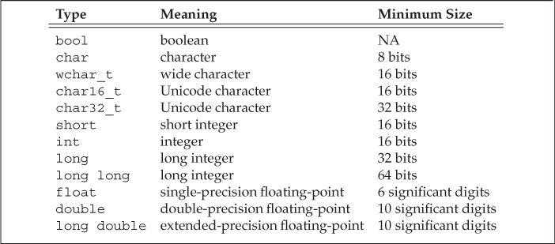

这里需要注意一些，这里是最小大小，现在基本上int 都是4个字节，也就是32位的数据了

c++ 里规定，一个int至少和一个short一样大，一个long至少和一个int一样大，一个long long至少和一个long一样大

```c++
#include<iostream>
using namespace std;
int main() {
	cout << "bool's size is " << sizeof(bool) << endl;
	cout << "char's size is " << sizeof(char) << endl;
	cout << "wchar_t's size is " << sizeof(wchar_t) << endl;
	cout << "char16_t's size is " << sizeof(char16_t) << endl;
	cout << "char32_t's size is " << sizeof(char32_t) << endl;
	cout << "short's size is " << sizeof(short) << endl;
	cout << "int's size is " << sizeof(int) << endl;
	cout << "long's size is " << sizeof(long) << endl;
	cout << "long long's size is " << sizeof(long long) << endl;
	cout << "float's size is " << sizeof(float) << endl;
	cout << "double's size is " << sizeof(double) << endl;
	cout << "long double's size is " << sizeof(long double) << endl;
    return 0;
}

/*
//在win10 vs2019下
bool's size is 1
char's size is 1
wchar_t's size is 2
char16_t's size is 2
char32_t's size is 4
short's size is 2
int's size is 4
long's size is 4
long long's size is 8
float's size is 4
double's size is 8
long double's size is 8
*/
```

在[ubuntu](https://so.csdn.net/so/search?q=ubuntu&spm=1001.2101.3001.7020) 18.04，64位 环境下测试，long占据8个字节。


注意，这里的wchar_t, long, long double 有一定区别


> 网上搜索发现，long占据的字节数还和编译器的数据模型相关，具体如下：
>
> | Datetype  | LP64 | ILP64 | LLP64 | ILP32 | LP32 |
> | :-------- | :--- | :---- | :---- | :---- | :--- |
> | char      | 8    | 8     | 8     | 8     | 8    |
> | short     | 16   | 16    | 16    | 16    | 16   |
> | int       | 32   | 64    | 32    | 32    | 16   |
> | long      | 64   | 64    | 32    | 32    | 32   |
> | long long | 64   |       |       |       |      |
> | pointer   | 64   | 64    | 64    | 32    | 32   |
>
> 另外一般情况下windows64位一般使用LLP64模型，64位Unix，Linux使用的是LP64模型
>
> > https://blog.csdn.net/weixin_40997360/article/details/79948968

细节的部分在于内置类的的机械实现

在内存中，数据以0-1存储，那么取多大尺寸的数据，就首先要知道数据的类型。类型决定了数据所占的比特数以及该如何解释这些比特的内容。

##### 带符号类型和无符号类型

无符号类型仅能表示大于0的值，同时会比同类型的带符号的类型多一位存储数据，显得多些,实际一样。

比如unsigned char [0-255]。char [-128(10000000) -- 127(01111111)]

##### 选择类型的一些原则

1. 当你明确知道类型不可能为负时，使用unsigned类型
2. 整数运算，使用int，int不够大，直接上long long
3. 算术表达式中，不要用char或bool值。因为类型char是否有符号在不同的机器上可能不一样。非要用它来表达一个不大的整数的话，那么要标明是否带符号。
4. 执行浮点数运算用double。float常不够用，且有时候double比float更快，而long double就没啥必要，损耗也不容忽视。

#### 2.1.2 Type Conversions

对象的类型定义了对象能包含的数据和能参与的运算（加减乘除也是需要定义的），其中一种运算被大多数类型支持，也就是将对象从一种给定的类型转换（convert) 为另一种类型。

##### 类型转换的一些规则

|                转换类型                |                           转换方法                           |
| :------------------------------------: | :----------------------------------------------------------: |
|          非布尔值 -> 布尔类型          |                   0 -> false ; 非0 -> true                   |
|         布尔类型 -> 非布尔类型         |                   false -> 0  ; true -> 1                    |
|           浮点数 -> 整数类型           |                      仅保留小数点前部分                      |
|           整数值 -> 浮点类型           | 小数部分记为0，如果该整数空间超过浮点类型的容量，精度会有所损失 |
| 给一个无符号类型一个超出它表示范围的值 |               结果为对其进行取余(%容量)的余数                |
| 给一个带符号类型一个超出它表示范围的值 |        结果是未定义的，此时程序可能崩溃，可能继续工作        |

直接cout输出，由于无法正确识别类型，所以在终端输出结果也就不如预期，


debug可以看出值是按照书中类型变化了

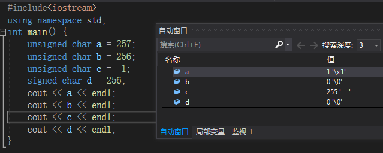

其实加上int强制类型转换就好了

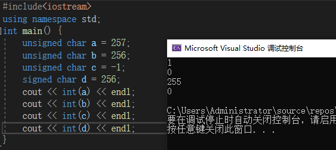

注意：切勿混用带符号类型和无符号类型，因为无符号类型很容易被搞成负值，带符号的负数被当成无符号数，那么也会产生意料之外的结果。

##### 2.1.2小练习

```c++
#include<iostream>
using namespace std;
int main() {
	unsigned u = 10, u2 = 42;
	cout << u2 - u << endl;//32
	cout << UINT32_MAX << endl;
	cout << u - u2 << endl;//-32 转化为 INT32MAX -31  4294967264 11111111 11111111 11111111 11100000
	int i = 10, i2 = 42;
	cout << i2 - i << endl;//32
	cout << i - i2 << endl;//-32
	cout << i - u << endl;//0
	cout << u - i << endl;//0
    return 0;
}
```

题解：

> 计算机内的数据是以补码形式存储的，负数的补码为按位取反后加1
>
> 那么-32为
>
> 10000000000000000000000000100000
>
> 取反后
>
> 01111111111111111111111111011111
>
> 加1
>
> 11111111111111111111111111100000


#### 2.1.3 Literals

字面值常量，即那种值一望而知的数据，每个字面值常量都对应一种数据类型。字面值常量的形式和值决定了他的数据类型。

##### 整型字面值

这里需要考虑一点，就是进制

decimal	十进制			20

octal	八进制				024

hexadecimal	十六进制		0x24

```c++
#include <iostream>
#include<string>
#include<fstream>
using namespace std;
int main()
{
	int a = 20;
	int b = 020;
	int c = 0x20;
	cout << a << endl;
	cout << b << endl;
	cout << c << endl;
    return 0;
}
```


这里要注意一点，整型字面值具体的数据类型是由它的值和符号决定。默认情况下，十进制字面值是带符号数，八进制和十六进制可能带也可能不带。

十进制字面值的类型是int，long，long long中尺寸最小的那个。

八进制和十六进制字面值的类型是能容纳其数值的int，unsigned int，long，unsignedlong，long long，unsigned long long中尺寸最小者。

类型short没有与之对应的字面值。

注意：严格来说，十进制字面值不会是负数，-42，那个符号并不在字面值之内。

##### 浮点型字面值

默认浮点型字面值是一个double

##### 字符和字符串字面值

单括号括起来的一个字符，被称为char型字面值，

双括号括起来的0-多个字符构成字符串型字面值。

**字符串字面值实际上是由常量字符构成的一个数组，编译器在每个字符串结尾加上\0**

'A' = 'A'

"A" = 'A' + '\0'

**两个字符串字面值位置紧邻且仅由空格、缩进、和换行符分隔，那么他们实际上是一个字符串**

```c++
#include <iostream>
#include<string>
#include<fstream>
using namespace std;
int main()
{
	cout << "hello world " "this is a space "	"this is a tab "
		"this is a enter" << endl;
	return 0;

}
```

##### 转义序列 Escape Sequences

有一些字符是不可打印的，有一些字符是在C++中有特殊含义的字符，这些都需要使用到转义序列。

C++中规定的转义序列：

|          含义          | 转义字符 |
| :--------------------: | :------: |
|        newline         |   `\n`   |
| 横向制表horizontal tab |   `\t`   |
|      alert (bell)      |   `\a`   |
|  纵向制表vertical tab  |   `\v`   |
|       backspace        |   `\b`   |
|   双引号double quote   |   `\"`   |
|    反斜线backslash     |   `\\`   |
|     question mark      |   `\?`   |
|      single quote      |   `\'`   |
| 回车符carriage return  |   `\r`   |
|     进纸符formfeed     |   `\f`   |

```c++
std::cout << '\n';      // prints a newline
std::cout << "\tHi!\n"; // prints a tab followd by "Hi!" and a newline
```

泛化转义序列的形式是

- `\x`后紧跟1个或多个十六进制数字，

- 或者`\`后紧跟1个、2个或3个八进制数字，其中数字部分表示字符对应的数值。

  如果`\`后面跟着的八进制数字超过3个，则只有前3个数字与`\`构成转义序列。相反，`\x`要用到后面跟着的所有数字。

```c++
std::cout << "Hi \x4dO\115!\n"; // prints Hi MOM! followed by a newline
std::cout << '\115' << '\n';    // prints M followed by a newline
```


>**进一步研究了一些\后面跟着八进制超过3个后的情况**
>
>```c++
>#include <iostream>
>#include<string>
>#include<fstream>
>using namespace std;
>int main()
>{
>	char a = '\1156';
>	string b = "\1156";
>	std::cout << '\115' << endl;    // prints M followed by a newline
>	std::cout << '\1156' << endl;
>	std::cout << '\000' << endl;
>	std::cout << '\0000' << endl;
>	std::cout << '\001' << endl;
>	std::cout << '\0010' << endl;
>	std::cout << '\00000' << endl;
>	std::cout << '\11500' << endl;
>	std::cout << '\11500' - '\00000' << endl;5046272 = 77 * 256 * 256
>	std::cout << '\21500' << endl;
>	std::cout << '\12500' << endl;
>	std::cout << '\11510' << endl;
>	std::cout << '\11610' << endl;
>	std::cout << '\11520' << endl;
>	std::cout << a << '\n';   
>	std::cout << b << '\n';   
>	return 0;
>}
>```
>
>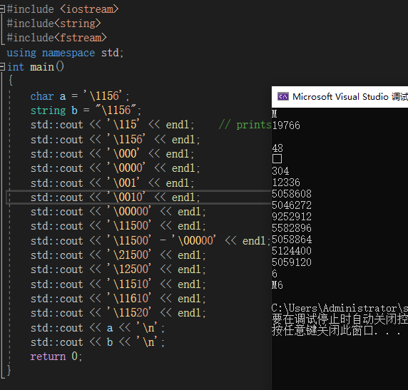
>
>可以看到当你直接输出'\1156'时，会输出19766，而这实际上是77*256+48(‘0’)+6，而77的八进制就是115。
>
>而你将这个数赋给char类型时，会进行识别截断，得到可用的字符'6'。
>
>当你输入'\11500时' 数据为5058608 = 5046272（77\*256\*256）+ 12336(256*48+48)
>
>当你输入'\11566时' 数据为5060150 = 5046272（77\*256\*256）+ 13878(256\*48+48+256*6+6)
>
>当你输入'\115777'时 数据为1295464247 = 1291845632（77\*256\*256）+ 3618615(256\*256\*48+256\*48+48+256\*256\*7+256\*7+7)
>
>这里就可以看出来，这里的组织形式是\115作为八进制参与数的组合，每一位进256。同时在后面的位数上，先预置了48。
>
>
>
>

##### 指定字面值的类型

添加特定的前缀和后缀，可以改变整型、浮点型和字符型字面值的默认类型。


使用一个长整型字面值时，最好使用大写字母`L`进行标记，小写字母`l`和数字`1`容易混淆。

然后nullptr，和true/false 分别为指针和布尔的字面值。

### 2.2 Variable

C++ 中的每个变量都有其数据类型，数据类型决定着变量所占内存空间的大小和布局方式、该空间能存储值的范围，以及变量能参与的运算。

#### 2.2.1 Variable Definitions

变量定义是一个类型说明符（type specifier）， 随后紧跟一个或多个变量名组成的列表，变量名以逗号分隔，最后以分号结束。

> **什么是对象？**
>
> 对象是一块能存储数据并具有某种类型的内存空间。
>
> 本书对对象的定义比较泛化，并不严格区分是类还是内置类型，也不区分是否命名或是否可读。

##### 初始值 initializers

初始化与赋值并不相同。

初始化的含义是创建变量是赋予其一个初始值

赋值的含义是将对象的当前值擦除，而以一个新值来代替

##### 列表初始化

C++ 支持很多种初始化的方式。

```c++
int num = 0;
int num = {0};
int num{0};
int num(0);
```

C++ 11 标准下，用花括号来初始化变量得到了全面应用

而用花括号初始化变量称为列表初始化（list initialization）。当用于内置类型的变量时，如果使用了列表初始化并且初始值存在丢失信息的风险，则编译器会报错。

```c++
long double ld = 3.1415926536;
int a{ld}, b = {ld};    // error: narrowing conversion required
int c(ld), d = ld;      // ok: but value will be truncated
```

这样编译器在赋值时就会进行检查，避免丢失信息的风险。

##### 默认初始化

如果定义变量时未指定初值，则变量被默认初始化（default initialized）。

如果是内置类型的变量未被显式初始化，它的值由定义的位置决定：

- 定义于任何函数体之外的变量被初始化为0；
- 定义于函数体内部的变量将不被初始化； 一个未被初始化的内置类型变量的值是未定义的，如果试图拷贝或以其他形式访问此类值将引发错误。

每个类各自决定其初始化对象的方式。

**建议初始化每一个内置类型的变量**。

#### 2.2.2 Variable Declarations and Definitions

C++支持分离式编译(separate compilation)，这就要求需要有在文件间共享代码的方法，特别是文件间变量的互用。

为了支持这一点，C++ 语言将声明和定义分开。声明 declaration 使得名字为程序所知。 定义 definition 负责创建与名字关联的实体(associated entity)。

如果想声明一个变量而不定义它，就在变量名前添加关键字`extern`，并且不要显式地初始化变量。

```c++
extern int i; // declares but does not define i
int j;      // declares and defines j
extern double pi = 3.1416; // definition
```

**`extern`语句如果包含了初始值就不再是声明了，而变成了定义。**

变量能且只能被定义一次，但是可以被声明多次。

如果要在多个文件中使用同一个变量，就必须将声明和定义分开。此时变量的定义必须出现且只能出现在一个文件中，其他使用该变量的文件必须对其进行声明，但绝对不能重复定义。

#### 静态类型 statically typed

C++ 是一种静态类型语言，其含义是在编译阶段检查变量。

程序越复杂，静态类型检查越有助于发现问题。然而，前提是编译器必须知道每一个实体对象的类型，这就要求我们在使用某个变量之前必须声明其类型。

#### 2.2.3 Identifiers 标识符

C++ 的标识符由字母、数字和下划线组成。必须以字母或下划线开头，长度没有限制，对大小写字母敏感。

##### 命名规范：

- 要能体现现实实际意义
- 变量名一般使用小写字母，不要用大写开头
- 用户自定义的类名，一般以大写字母开头， 如 Sales_items
- 如果标识符由多个单词组成，则单词间应有明显区分。
- 避免C++ 关键字


#### 2.2.4 Scope of a Name 作用域

作用域 scope 是程序的一部分，在其中名字有其特定的含义。C++语言中大多数作用域都以花括号分隔。

同一个名字在不同的作用域中可能指向不同的实体。名字的有效区域始于名字的声明语句，以声明语句所在的作用域末端为结束。

全局作用域 global scope	一次声明，整个程序范围都可使用

块作用域 block scope	仅仅在那块可以使用

> 一般来说，杂对象第一次被使用的地方附近定义它是一种好的选择。

##### 嵌套的作用域 Nested Scopes

作用域中一旦声明了某个名字，它所嵌套着的所有作用域中都能访问该名字，同时，允许在内层作用域中重新定义外层作用域已有的名字。

不过函数内部不宜定义与全局变量同名的新变量。

```c++
#include <iostream>
// Program for illustration purposes only: It is bad style for a function
// to use a global variable and also define a local variable with the same name
int reused = 42;    // reused has global scope
int main()
{
    int unique = 0; // unique has block scope
    // output #1: uses global reused; prints 42 0
    std::cout << reused << " " << unique << std::endl;
    int reused = 0; // new, local object named reused hides global reused
    // output #2: uses local reused; prints 0 0
    std::cout << reused << " " << unique << std::endl;
    // output #3: explicitly requests the global reused; prints 42 0
    std::cout << ::reused << " " << unique << std::endl;
    return 0;
}
```

可以用作用域操作符`::`来覆盖默认的作用域规则。因为全局作用域本身并没有名字，所以当作用域操作符的左侧为空时，会向全局作用域发出请求获取作用域操作符右侧名字对应的变量。

### 2.3 Compound Types 复合类型

复合类型指基于其他类型定义的定义，这里介绍两种，即引用和指针。

声明语句的通用描述是：**一条声明语句由一个基本数据类型 base type 和紧随其后的一个声明符 declarator列表组成。**

#### 2.3.1 References

> C++ 支持了右值引用，rvalue reference 在【13.6.1】 中会讲,这种引用主要用于内置类，一般来说我们使用“引用”这个词，是指左值引用。

简而言之，引用为对象起了另一个名字(alternative name)。

定义引用时，程序把引用和它的初始值绑定（bind）在一起，而不是将初始值拷贝给引用。

一旦初始化完成，将无法再令引用重新绑定到另一个对象，因为无法将引用重新绑定到另一个对象，因此**引用必须初始化。**

引用不是对象，仅仅是别名，所以不能定义引用的引用。

#### 2.3.2 Pointers

类似引用，指针也实现了对其他变量的间接访问。

而不同于引用的是：

* 指针本身就是一个对象，允许对指针赋值和拷贝，在指针的生命周期，他可以被指向几个不同的对象。
* 指针无须在定义时赋初值。和其他内置类型一样，在块作用域内定义的指针如果没有被初始化，也将拥有一个不确定的值。


通过将声明符写成`*d`的形式来定义指针类型，其中`d`是变量名称。如果在一条语句中定义了多个指针变量，则每个量前都必须有符号`*`。

```c++
int *ip1, *ip2;     // both ip1 and ip2 are pointers to int
double dp, *dp2;    // dp2 is a pointer to double; dp is a double
```

指针存放某个对象的地址，要想获取对象的地址，需要使用取地址符`&`。

```c++
int ival = 42;
int *p = &ival; // p holds the address of ival; p is a pointer to ival
```

因为引用不是对象，没有实际地址，所以不能定义指向引用的指针。


大部分情况下，指针的类型要和它指向的对象严格匹配。

有两个例外，一是允许令一个指向常量的指针指向一个非常量对象【2.4.2】；二是存在继承关系的类，可以将基类的指针或引用绑定到派生类对象上【15.2.3】。


##### 指针的值（即地址）

应属于下列状态之一：

- 指向一个对象。
- 指向紧邻对象所占空间的下一个位置。
- 空指针，即指针没有指向任何对象。
- 无效指针，即上述情况之外的其他值。

试图拷贝或以其他方式访问无效指针的值都会引发错误。

##### 解引用

如果指针指向一个对象，可以使用解引用（dereference）符`*`来访问该对象。

```c++
int ival = 42;
int *p = &ival; // p holds the address of ival; p is a pointer to ival
cout << *p;     // * yields the object to which p points; prints 42
```

给解引用的结果赋值就是给指针所指向的对象赋值。

解引用操作仅适用于那些确实指向了某个对象的有效指针。

##### 空指针

空指针（null pointer）不指向任何对象，在试图使用一个指针前代码可以先检查它是否为空。得到空指针最直接的办法是用字面值`nullptr`（c++11最新支持）来初始化指针。

旧版本程序通常使用`NULL`（预处理变量，定义于头文件`cstdlib`中，值为0）给指针赋值，但在C++11中，最好使用`nullptr`初始化空指针。

老程序还会用NULL，这是一个在cstdlib头文件里定义的预处理变量(preprocessor variable)。

关于预处理器，2.6.3会稍微介绍一些。简单说它运行于编译之前，不属于命名空间std。

```c++
int *p1 = nullptr;  // equivalent to int *p1 = 0;
int *p2 = 0;        // directly initializes p2 from the literal constant 0
// must #include cstdlib
int *p3 = NULL;     // equivalent to int *p3 = 0;
```

建议初始化所有指针。

注意，不能用int变量直接赋给指针，哪怕这个int变量为0；

##### 赋值和指针

指针和引用的最大区别就在于引用只是别名，而指针是真实存在的对象，可以改变指向的对象。

给指针赋值就是令它存放一个新的地址，从而指向一个新的对象。

具体分清楚到底改变的是指针还是指针指向的对象，可以通过看表达式等式左边是什么。


指针非空，参与条件表达式，则为true，空指针为false。


##### void*指针

`void*`是一种特殊的指针类型，可以存放任意对象的地址，**但不能直接操作`void*`指针所指的对象**。只能拿它和别的指针进行比较，作为函数的输入输出，或是赋给另一个void*指针。

概括说来，从void* 的视角来看，内存空间仅仅是内存空间，没办法访问内存空间中的对象。  【19.1.1】节会详细描述。【4.11.3】 会描述获取void*指针的方法。

#### 2.3.3 Understanding Compound Type Declarations

##### 基本数据类型和类型修饰符的关系

变量的定义包括一个基本数据类型和一组声明符。

```c++
int i = 1024, *p = &i, &r = i;
```

> 很多程序员会迷惑于基本数据类型和类型修饰符的关系，其实后者不过是声明符的一部分罢了。
>
> 特别是因为我们可以写成int*
>
> 比如
>
> ```c++
> int* a,b;
> //其中a是指针，b是int型变量。
> ```
>
> > 当声明符包含未修改的标识符时，正在声明的项将具有基类型。 如果星号 (**`\*`**) 显示在标识符的左侧，则将类型修改为指针类型。 如果标识符后跟方括号 (**`[ ]`**)，则将类型修改为数组类型。 如果标识符后跟圆括号，则将类型修改为函数类型。 若要详细了解如何解释声明中的优先级，请查看[解释更复杂的声明符](https://docs.microsoft.com/zh-cn/cpp/c-language/interpreting-more-complex-declarators?view=msvc-170)。
> >
> > ```c++
> > int i;
> > int a[];
> > int print();
> > ```
> >
> > 每个声明符至少声明一个标识符。 声明符必须包含一个类型说明符才能成为完整声明。 类型说明符显示：数组类型的元素的类型、指针类型寻址的对象的类型，或者函数的返回类型。
>
> > http://www.morecpp.cn/cpluspluc-declarations/


##### 指向指针的指针（Pointers to Pointers）：

一般来说，声明符中修饰符的个数没有限制。

```c++
int ival = 1024;
int *pi = &ival;    // pi points to an int
int **ppi = &pi;    // ppi points to a pointer to an int
```


##### 指向指针的引用（References to Pointers）：

```C++
int i = 42;
int *p;         // p is a pointer to int
int *&r = p;    // r is a reference to the pointer p
r = &i;         // r refers to a pointer; assigning &i to r makes p point to i
*r = 0;         // dereferencing r yields i, the object to which p points; changes i to 0
```

面对一条比较复杂的指针或引用的声明语句时，从右向左阅读有助于弄清它的真实含义。

**离变量名最近的符号对变量的类型有最直接的影响。**其余部分用来确定这个类型是什么。

### 2.4 const Qualifier

有时候我们想要定义一个不会被轻易改变的常量，那么就可以在变量前面添加const。

**const常量必须被初始化。**

任何对const对象进行赋值（擦写）都会引发错误。

对象的类型决定了其能做什么操作，所以只能在const类型的对象上执行不改变其内容的操作。

##### const变量的作用范围

默认情况下，`const`对象被设定成**仅在文件内有效**。当多个文件中出现了同名的`const`变量时，其实等同于在不同文件中分别定义了独立的变量。

如果想在多个文件间共享`const`对象：

- 若`const`对象的值在编译时已经确定，则应该定义在头文件中。其他源文件包含该头文件时，不会产生重复定义错误。

- 若`const`对象的值直到运行时才能确定，则应该在头文件中声明，在源文件中定义。此时`const`变量的声明和定义前都应该添加`extern`关键字。

  ```c++
  // file_1.cc defines and initializes a const that is accessible to other files
  extern const int bufSize = fcn();
  // file_1.h
  extern const int bufSize;   // same bufSize as defined in file_1.cc
  ```

#### 2.4.1 References to const

把引用绑定在`const`对象上即为对常量的引用（reference to const）。对常量的引用不能被用作修改它所绑定的对象。

```c++
const int ci = 1024;
const int &r1 = ci;     // ok: both reference and underlying object are const
r1 = 42;        // error: r1 is a reference to const
int &r2 = ci;   // error: non const reference to a const object
```

> 常量引用
>
> const Reference is a reference to Const
>
> 有些人会将const类型的引用叫做常量引用，这是有些歧义的。
>
> 因为引用不是一个对象，我们没法让它本身const。而且C++语言并不允许随意改变引用所绑定的对象，所以这层意义上所有的引用都算是常量。

##### 初始化和对const的引用

大部分情况下，引用的类型要和与之绑定的对象严格匹配。但是有两个例外：

- 初始化常量引用时允许用任意表达式作为初始值，只要该表达式的结果能转换成引用的类型即可。

  ```c++
  int i = 42;
  const int &r1 = i;      // we can bind a const int& to a plain int object
  const int &r2 = 42;     // ok: r1 is a reference to const
  const int &r3 = r1 * 2;     // ok: r3 is a reference to const
  int &r4 = r * 2;        // error: r4 is a plain, non const reference
  ```

- 允许为一个常量引用绑定非常量的对象、字面值或者一般表达式。

  ```c++
  double dval = 3.14;
  const int &ri = dval;
  ```


> 当一个常量引用被绑定到另外一个类型时，
> ```c++
> double dval = 3.14;
> const int &ri = dval;
> ```
>
> 发生的其实是
>
> ```c++
> double dval = 3.14;
> const int temp = dval;
> const int &ri = temp;
> ```
>
> 这种情况下，ri绑定了一个临时量。这玩意是编译器生成的,为了确保ri绑定一个整数。
>
> 如果ri不是常量，那么就会让ri绑定上temp，而我们ri引用想绑定的是dval，于是c++就禁止将非常量引用绑定到类型不同的对象上。
>
> > ```c++
>> #include <iostream>
> > using namespace std;
> > int main()
> > {
> >     double dval = 3.14;
> >     int &ri = dval;
> >     cout<<ri<<endl;
> >    }
> >    /*
> > PS C:\Users\Administrator\Desktop> g++ .\Untitled-1.cpp
> > .\Untitled-1.cpp: In function 'int main()':
> > .\Untitled-1.cpp:9:16: error: invalid initialization of reference of type 'int&' from expression of type 'double

常量引用仅对引用可参与的操作做了限定，但是对于引用的对象本身是不是一个常量未做限定。由于对象可能是非常量，那么允许通过其他方式修改它的值。

```c++
#include <iostream>
using namespace std;
int main()
{
    int i = 42;
    int &r1 = i;      // we can bind a const int& to a plain int object
    const int &r2 = i;     // ok: r1 is a reference to const
    cout << r1 <<endl;
    cout << r2 <<endl;
    r1 = 0;
    cout<<"change"<<endl;
    cout << r1 <<endl;
    cout << r2 <<endl;
}
/*
42
42
change
0
0
*/
```

#### 2.4.2 Pointers and const

指向常量的指针(pointer to const) 不能用于改变其所指对象的值。

要想存放常量对象的地址，只能使用指向常量的指针。

```c++
const double pi = 3.14;     // pi is const; its value may not be changed
double *ptr = &pi;          // error: ptr is a plain pointer
const double *cptr = &pi;   // ok: cptr may point to a double that is const
*cptr = 42;         // error: cannot assign to *cptr
double dval = 3.14; // dval is a double; its value can be changed
cptr = &dval;       // ok: but can't change dval through cptr
```

常量指针（const pointer）必须初始化，而放在指针中的那个地址也就不能再改变了。

定义语句中把`*`放在`const`之前用来说明指针本身是一个常量。这也暗示了不变的是指针而不是指向的那个值。

```c++
int errNumb = 0;
int *const curErr = &errNumb;   // curErr will always point to errNumb
const double pi = 3.14159;
const double *const pip = &pi;  // pip is a const pointer to a const object
```

指针本身是常量并不代表不能通过指针修改其所指向的对象的值，能否这样做完全依赖于其指向对象的类型。

> 举个例子，就好像你把钱存银行定期，从你这边你规定了自己的行为，这笔钱是const的，你不去动它，而在银行那边，钱是有可能会被动的，甚至说动是应该的（变量）。但银行不应该影响我的取款，可是一些无良的银行甚至会挪用（糟糕的操作），在你要取回定期是发现没钱了，这就不好了。
>
> 当然如果你存的东西也是个const，比如一些很难动的东西，比如古董啊，雕像啊什么的，那么两边都不会动了。

```c++
#include <iostream>
using namespace std;
int main()
{
    int i2 = 5;
    int *const p2 = &i2;
    cout<<*p2<<endl;
    *p2 = 6;
    cout<<*p2<<endl;
    cout<<i2<<endl;
    const int * const p3 = &i2;
    //*p3 = 7;
    cout<<*p3<<endl;
    return 0;
}
/*
PS C:\Users\Administrator\Desktop> g++ .\Untitled-1.cpp
PS C:\Users\Administrator\Desktop> .\a.exe
5
6
6
6
如果把注释去掉，可以看到
.\Untitled-1.cpp: In function 'int main()':
.\Untitled-1.cpp:12:11: error: assignment of read-only location '*(const int*)p3'
*/
```

所以说 p2是一个指向变量的常量指针，可以改变i2，而p3 是一个指向常量的常量指针。


> 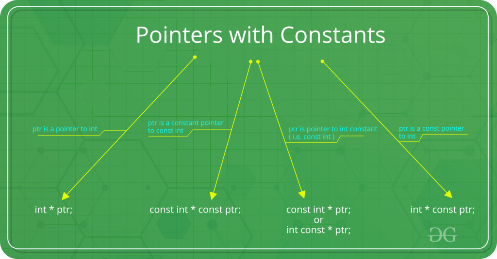
>
> https://www.geeksforgeeks.org/difference-between-const-int-const-int-const-and-int-const/
>
> | 语句                  | 含义                                                         | 介绍                                                         | 备注                                               |
> | --------------------- | ------------------------------------------------------------ | ------------------------------------------------------------ | -------------------------------------------------- |
> | const int \*ptr       | const int \* is pointer to constant integer                  |                                                              |                                                    |
> | int const\* ptr       | **int const\*** is pointer to constant integer               | This means that the variable being declared is a pointer, pointing to a constant integer. Effectively, this implies that the pointer is pointing to a value that shouldn’t be changed. Const qualifier doesn’t affect the pointer in this scenario so the pointer is allowed to point to some other address.<br/>The first const keyword can go either side of data type, hence **int const\*** is equivalent to **const int\***. | 更推荐这种，可以很容易读出 ptr is a * to const int |
> | const int * const ptr | **const int\* const** is a constant pointer to constant integer | This means that the variable being declared is a constant pointer pointing to a constant integer. Effectively, this implies that a constant pointer is pointing to a constant value. Hence, neither the pointer should point to a new address nor the value being pointed to should be changed.<br/>The first const keyword can go either side of data type, hence **const int\* const** is equivalent to **int const\* const**. | ptr is a const * to const int                      |
> | int* const ptr        | **int \*const** is **const** **pointer** to **int**          | This means that the variable being declared is a constant pointer pointing to an integer. Effectively, this implies that the pointer shouldn’t point to some other address. Const qualifier doesn’t affect the value of integer in this scenario so the value being stored in the address is allowed to change. | ptr is a const * to int                            |
>
> 这种从右向左读的方法很有用
>
> Using this rule, even complex declarations can be decoded like,
>
> - **int \** const** is a **const** **pointer** to **pointer** to an **int**.
> - **int \* const \*** is a **pointer** to **const** **pointer** to an **int**.
> - **int const \**** is a **pointer** to a **pointer** to a **const** **int**.
> - **int \* const \* const** is a **const** **pointer** to a **const** **pointer** to an **int**.

#### 2.4.3 Top-Level const

由于指针是个对象，那么它本事是不是常量，和它指的对象是不是常量，这是两个问题。

所以用名词顶层来表示指针是const。而用名词底层表示指针所指的对象是const。

类似的，顶层可以表示任意对象是常量。

底层则与一些复合类型的基本类型有关。

```c++
int i = 0;
int *const p1 = &i;     // we can't change the value of p1; const is top-level
const int ci = 42;      // we cannot change ci; const is top-level
const int *p2 = &ci;    // we can change p2; const is low-level
const int *const p3 = p2; // right-most const is top-level, left-most is not
const int &r = ci;      // const in reference types is always low-level
```

当执行拷贝操作时，常量是顶层`const`还是底层`const`区别明显：

- 顶层`const`没有影响。拷贝操作不会改变被拷贝对象的值，因此拷入和拷出的对象是否是常量无关紧要。

  ```c++
  i = ci;     // ok: copying the value of ci; top-level const in ci is ignored
  p2 = p3;    // ok: pointed-to type matches; top-level const in p3 is ignored
  ```

- 拷入和拷出的对象必须具有相同的底层`const`资格。或者两个对象的数据类型可以相互转换。一般来说，非常量可以转换成常量，反之则不行。

  ```c++
  int *p = p3;    // error: p3 has a low-level const but p doesn't
  p2 = p3;        // ok: p2 has the same low-level const qualification as p3
  p2 = &i;        // ok: we can convert int* to const int*
  int &r = ci;    // error: can't bind an ordinary int& to a const int object
  const int &r2 = i;  // ok: can bind const int& to plain int
  ```

> 这个讲的很好。https://blog.csdn.net/TeFuirnever/article/details/103011514

#### 2.4.4 constexpr and Constant Expressions

常量表达式（constant expressions）指值不会改变并且在**编译过程**就能得到计算结果的表达式。

字面值显然是常量表达式。

一个对象是否为常量表达式由它的数据类型和初始值共同决定。

```c++
const int max_files = 20;           // max_files is a constant expression
const int limit = max_files + 1;    // limit is a constant expression
int staff_size = 27;        // staff_size is not a constant expression
const int sz = get_size();  // sz is not a constant expression 它的值要到运行时才能得到。
```

##### constexpr变量

C++11允许将变量声明为`constexpr`类型以便由编译器来验证变量的值是否是一个常量表达式。

```c++
constexpr int mf = 20;          // 20 is a constant expression
constexpr int limit = mf + 1;   // mf + 1 is a constant expression
constexpr int sz = size();      // ok only if size is a constexpr function
```

声明为constexpr类型一定是一个常量，且必须用常量表达式初始化。6.5.2节会介绍constexpr函数。

##### 字面值类型

目前接触的类型中，算术类型、引用和指针都属于字面值类型。

自定义类，IO库，string类型则不属于字面值类型。

【7.5.6】 【19.3】 会进一步介绍其他字面值类型

##### 指针与constexpr

指针和引用都能定义成`constexpr`，但是初始值受到严格限制。`constexpr`指针的初始值必须是0、`nullptr`或者是存储在某个固定地址中的对象。

函数体内定义的普通变量一般并非存放在固定地址中，因此`constexpr`指针不能指向这样的变量。相反，函数体外定义的变量地址固定不变，可以用来初始化`constexpr`指针。

在`constexpr`声明中如果定义了一个指针，限定符`constexpr`仅对指针本身有效，与指针所指的对象无关。`constexpr`把它所定义的对象置为了顶层`const`。

```c++
constexpr int *p = nullptr;     // p是指向int的const指针
constexpr int i = 0;
constexpr const int *cp = &i;   // cp是指向const int的const指针
```

`const`和`constexpr`限定的值都是常量。但`constexpr`对象的值必须在编译期间确定，而`const`对象的值可以延迟到运行期间确定。

建议使用`constexpr`修饰表示数组大小的对象，因为数组的大小必须在编译期间确定且不能改变。

### 2.5 Dealing with Types

#### 2.5.1 Type Aliases 类型别名

类型别名是某种类型的同义词，传统方法是使用关键字`typedef`定义类型别名。

```c++
typedef double wages;   // wages is a synonym for double
typedef wages base, *p; // base is a synonym for double, p for double*
```

C++11新规定可以使用关键字`using`进行别名声明（alias declaration），作用是把等号左侧的名字规定成等号右侧类型的别名。

##### ！易错点

```c++
typedef char *pstring;	//pstring 实际上是指向char的指针
const pstring cstr = 0; // 指向char类型的常量指针
const char *cstr = 0;	//指向const char 的指针。数据类型不是char* ，*成为声明符的一部分，而是char
//所以不能直接将类型别名替换成原来的样子来理解他。
```

#### 2.5.2 The auto Type Specifier

C++11新增`auto`类型说明符，能让编译器自动分析表达式所属的类型。

`auto`定义的变量必须有初始值。

```c++
// the type of item is deduced from the type of the result of adding val1 and val2
auto item = val1 + val2;    // item initialized to the result of val1 + val2
```

使用auto也能在一条语句中声明多个变量，但因为一个声明语句只能有一个基本类型，所以该语句中所有变量的初始基本数据类型必须一样。

##### 复合类型、常量和auto

编译器推断出来的`auto`类型有时和初始值的类型并不完全一样。

- 当引用被用作初始值时，编译器以引用对象的类型作为`auto`的类型。

  ```c++
  int i = 0, &r = i;
  auto a = r;     // a is an int (r is an alias for i, which has type int)
  ```

- `auto`一般会忽略顶层`const`。

  ```c++
  const int ci = i, &cr = ci;
  auto b = ci;    // b is an int (top-level const in ci is dropped)
  auto c = cr;    // c is an int (cr is an alias for ci whose const is top-level)
  auto d = &i;    // d is an int*(& of an int object is int*)
  auto e = &ci;   // e is const int*(& of a const object is low-level const)
  ```

  如果希望推断出的`auto`类型是一个顶层`const`，需要显式指定`const auto`。

  ```C++
  const auto f = ci;  // deduced type of ci is int; f has type const int
  ```


设置类型为`auto`的引用时，原来的初始化规则仍然适用，初始值中的顶层常量属性仍然保留。

```c++
auto &g = ci;   // g is a const int& that is bound to ci
auto &h = 42;   // error: we can't bind a plain reference to a literal
const auto &j = 42;     // ok: we can bind a const reference to a literal
```

还需要注意，在一个语句定义多个变量时，& * 都只从属于某个声明符，而不是基本数据类型的一部分。因此初始值必须是同一类型。

```c++
int  i = 0;
const int ci = i; 

auto k = ci,&l = i;		// k是整数，l是整型引用
auto &m = ci,*p = &ci;//m 是整型常量的引用， p是指向整型常量的指针
auto &n = i, *p2 = &ci;//错误  i的类型是int，&ci的类型是const int
```


#### 2.5.3 The decltype Type Specifier

C++11新增`decltype`类型指示符，作用是选择并返回操作数的数据类型，此过程中编译器不实际计算表达式的值。

```c++
decltype(f()) sum = x;  // sum has whatever type f returns
```

`decltype`处理顶层`const`和引用的方式与`auto`有些不同，如果`decltype`使用的表达式是一个变量，则`decltype`返回该变量的类型（包括顶层`const`和引用）。

```c++
const int ci = 0, &cj = ci;
decltype(ci) x = 0;     // x has type const int
decltype(cj) y = x;     // y has type const int& and is bound to x
decltype(cj) z;     // error: z is a reference and must be initialized
```

因为cj是一个引用，所以z也是引用，那么z必须被初始化。

引用从来都是作为其所指对象的同义词出现，只有用在decltype处是一个例外。


如果`decltype`使用的表达式不是一个变量，则`decltype`返回表达式结果对应的类型。

如果表达式的内容是解引用操作，则`decltype`将得到引用类型。

如果`decltype`使用的是一个不加括号的变量，则得到的结果就是该变量的类型；

如果给变量加上了一层或多层括号，则`decltype`会得到引用类型，因为**变量是一种可以作为赋值语句左值的特殊表达式。**

**`decltype((var))`的结果永远是引用，而`decltype(var)`的结果只有当`var`本身是一个引用时才会是引用。**

### 2.6 Defining Our Own Data Structures

在C++中，我们以类的形式定义数据结构。C++对类的支持甚多，本书三四部分都将大幅介绍类的知识。Sales_item看似简单，但是要实现它得在14章介绍自定义运算符之后。

#### 2.6.1 Defining the Sales_data Type

C++11规定可以为类的数据成员（data member）提供一个类内初始值（in-class initializer）。创建对象时，类内初始值将用于初始化数据成员，没有初始值的成员将被默认初始化。

**类内初始值不建议使用圆括号。**(不过目前我还是这样用) 参考【2.2.1】

> https://www.open-std.org/jtc1/sc22/wg21/docs/papers/2008/n2628.html
>
> 因为我们无法避免这样的情况
>
> ```cpp
> class Widget 
> {
> private: 
>   typedef int x;
>   int z(x);
> };
> ```
>
> 这样的话，就会变为函数声明。

类定义的最后应该加上分号。（很多人会犯错）

> 另外个人经验，构造函数，参数表最后一个,不要有

#### 2.6.2 Using the Sales_data Class

#### 2.6.3 Writing Our Own Header Files

19.7 将会讲在函数体内定义类，但是这种类毕竟受了一些限制，所以类一般都不定义在函数体内。

头文件（header file）通常包含那些只能被定义一次的实体，如类、`const`和`constexpr`变量。

头文件一旦改变，相关的源文件必须重新编译以获取更新之后的声明。

##### 预处理器概述

头文件保护符（header guard）依赖于预处理变量（preprocessor variable）(2.3.2)。

预处理变量有两种状态：已定义和未定义。

`#define`指令把一个名字设定为预处理变量。

`#ifdef`指令当且仅当变量已定义时为真，

`#ifndef`指令当且仅当变量未定义时为真，一旦检查结果为真，则执行后续操作直至遇到`#endif`指令为止。

```c++
#ifndef SALES_DATA_H
#define SALES_DATA_H
#include <string>
struct Sales_data
{
    std::string bookNo;
    unsigned units_sold = 0;
    double revenue = 0.0;
};
#endif
```

在高级版本的IDE环境中，可以直接使用`#pragma once`命令来防止头文件的重复包含。

预处理变量无视C++语言中关于作用域的规则。

整个程序中的预处理变量，包括头文件保护符必须唯一。预处理变量的名字一般均为大写。

头文件即使目前还没有被包含在任何其他头文件中，也应该设置保护符。

### Chapter Summary  

​	类型是C++编程的基础。

​	类型规定了其对象的存储要求和所能执行的操作。C++语言提供了一套基础内置类型，这些类型与机器硬件密切相关。类型还分为非常量和常量，一个常量对象必须初始化，而且一旦初始化就不能再改变。此外还可以定义复合类型，比如指针和引用等。复合类型的定义以其他类型为基础。

​	C++语言允许用户以类的形式自定义类型。C++库通过类提供了一套高级抽象类型。如输入输出和string等。

### Defined Terms

| 中文                 | 英文             | 含义                                                |
| -------------------- | ---------------- | --------------------------------------------------- |
| 常量表达式           | const expression | 能在编译时计算并获得结果的表达式                    |
|                      | constexpr        | 一种函数，用于代表一条常量表达式  6.5.2节会详细介绍 |
| preprocessor         | 预处理器         | 在C++编译过程中执行的一段程序                       |
| separate compilation | 分离式编译       | 把程序分割为多个单独文件的能力                      |
|                      |                  |                                                     |
|                      |                  |                                                     |
|                      |                  |                                                     |


## Chapter 3 Strings, Vectors, and Arrays

除了内置类型，标准库提供了一些具有更高级性质的类型。

string 表示可变长的字符序列。

vector 存放的是某种给定类型对象的可变长序列。

array（内置数组类） 数组的实现与硬件密切相关

### 3.1 Namespace using Declarations

命名空间

最安全的方法就是使用using 声明，18.2.2 会介绍另一种方法。

使用`using`声明后就无须再通过专门的前缀去获取所需的名字了。

```c++
using std::cout;
```

程序中使用的每个名字都需要用独立的`using`声明引入。

头文件中通常不应该包含`using`声明。因为头文件里有了这个声明，所有含有这个头文件的文件都会有，可能会造成命名冲突。

### 3.2 Library string Type

#### 3.2.1 Defining and Initializing strings

初始化`string`最常见的的方式：


##### 直接初始化和拷贝初始化

如果使用等号初始化一个变量，实际上执行的是拷贝初始化（copy initialization），编译器把等号右侧的初始值拷贝到新创建的对象中去。

如果不使用等号，则执行的是直接初始化（direct initialization）。

初始值只有一个时，使用两种方法都可以，但是如果初始化的参数有多个，那么一般来说只能用直接初始化的形式。非要用拷贝初始化也得显式地创建一个临时对象用于拷贝。

```c++
string s7(10,'c');
string s8 = string (10,'d'); //可读性差，也没什么优势
```


#### 3.2.2 Operations on strings

`string`的大多数操作：


##### 读写string

在执行读取操作时，`string`对象会自动忽略开头的空白（空格符、换行符、制表符等）并从第一个真正的字符开始读取，直到遇见下一处空白为止。

##### 使用getline读取一整行

使用`getline`函数可以读取一整行字符（包括输入时的空白符）。该函数只要遇到**换行符**就结束读取并返回结果，如果输入的开始就是一个换行符，则得到空`string`。触发`getline`函数返回的那个换行符实际上被丢弃掉了，得到的`string`对象中并不包含该换行符。

##### string的empty和size操作

`empty`会返回一个字符串是否为空的bool值。

`size`函数返回`string`对象的长度，返回值是`string::size_type`类型，这是一种无符号类型。要使用`size_type`，必须先指定它是由哪种类型定义的。

如果一个表达式中已经有了`size`函数就不要再使用`int`了，这样可以避免混用`int`和`unsigned int`可能带来的问题。因为负数会被转化为很大的无符号值。

##### 比较string

逐位比较，且大小写敏感。

- 长度不同，且短的字符每个字符都与长字符对应位置长度相同，那么短的string小于较长string
- 如果两个string对象在某些对应的位置上不一致，则string对象比较的结果其实是string对象中第一对相异字符比较结果

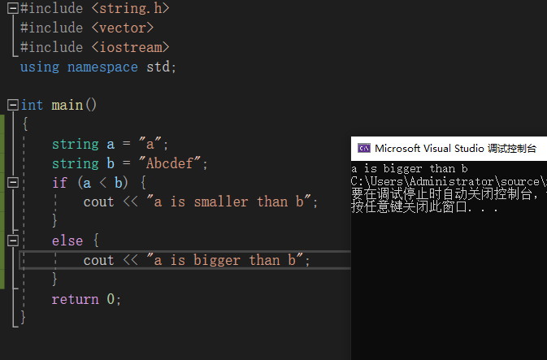

##### string 的加法

- 两个string相加

- 字面值和string相加

  编译器允许我们使用并非所需类型来实现同样的效果，前提是这种类型可以自动转换为所需的类型。因为标准库允许把字符字面值和字符串字面值转换为string对象。所以可以在用字符串的地方用这些字面值。

当把`string`对象和字符字面值及字符串字面值混合在一条语句中使用时，必须确保每个加法运算符两侧的运算对象中至少有一个是`string`。

```c++
string s4 = s1 + ", ";          // ok: adding a string and a literal
string s5 = "hello" + ", ";     // error: no string operand
string s6 = s1 + ", " + "world";    // ok: each + has a string operand
```

而字面值和字面值是不能直接相加的。

```c++
string s7 = ("hello" + ",") + s2; //error
```

需要注意的是，为了与C兼容，C++语言中的字符串字面值并不是标准库`string`的对象。

#### 3.2.3 Dealing with the Characters in a string

##### string操作头文件

头文件`cctype`中的字符操作函数：


建议使用C++版本的C标准库头文件。C语言中名称为`name.h`的头文件，在C++中则被命名为`cname`。

##### string 与 for循环

C++11提供了范围`for`（range for）语句，可以遍历给定序列中的每个元素并执行某种操作。

```c++
for (declaration : expression)
    statement
```

`expression`部分是一个对象，用于表示一个序列。`declaration`部分负责定义一个变量，该变量被用于访问序列中的基础元素。每次迭代，`declaration`部分的变量都会被初始化为`expression`部分的下一个元素值。

一般来说我们会用auto来定义元素类型。

```c++
string str("some string");
// print the characters in str one character to a line
for (auto c : str)      // for every char in str
    cout << c << endl;  // print the current character followed by a newline
```

如果想在范围`for`语句中改变`string`对象中字符的值，必须把循环变量定义成引用类型。

```c++
string str("some string");
for (auto &c : str)      // for every char in str
    c = toupper(c);
cout<<str<<endl;

```

##### 只处理string内的一部分字符?

想要访问string对象中的单个字符有两种方式：一种是使用下标，另外一种是迭代器（3.4 和 第九章介绍）

下标运算符`[]`接收的输入参数是`string::size_type`类型的值，表示要访问字符的位置，返回值是该位置上字符的引用。

下标数值从0记起，范围是0至`size - 1`。使用超出范围的下标将引发不可预知的后果。

C++标准并不要求标准库检测下标是否合法。但是编程时需要时时刻刻注意这一点。

编程时可以把下标的类型定义为相应的`size_type`，这是一种无符号数，可以确保下标不会小于0，此时代码只需要保证下标小于`size`的值就可以了。另一种确保下标合法的有效手段就是使用范围`for`语句。


### 3.3 Library vector Type

标准库类型`vector`表示对象的集合，也叫做容器（container）（第二部分会对这有更一步的讲解），定义在头文件`vector`中。`vector`中所有对象的类型都相同，每个对象都有一个索引与之对应并用于访问该对象。

> 模板本身不是类或函数，相反可以将模板看做为编译器生成类或函数编写的一份说明。编译器根据模板创建类或函数的过程称之为实例化(instantiation)，当使用模板时，需要指出编译器应把类或类型实例化为何种类型。

`vector`是模板（template）而非类型，由`vector`生成的类型必须包含`vector`中元素的类型，如`vector<int>`。

因为引用不是对象，所以不存在包含引用的`vector`。

在早期的C++标准中，如果`vector`的元素还是`vector`，定义时必须在外层`vector`对象的右尖括号和其元素类型之间添加一个空格，如`vector<vector<int> >`。但是在C++11标准中，可以直接写成`vector<vector<int>>`，不需要添加空格。

#### 3.3.1 Defining and Initializing vectors

定义`vector`对象的常用方法：


初始化`vector`对象时如果使用圆括号，可以说提供的值是用来构造（construct）`vector`对象的；如果使用的是花括号，则是在列表初始化（list initialize）该`vector`对象。

> 列表初始化
>
> C++ 提供初始化方法可以相互等价使用，但也有一些例外情况。
>
> - 使用拷贝初始化时（=），只能提供一个初始值
> - 如果提供的是一个类内初始值，则只能使用拷贝初始化或使用花括号的形式初始化
> - 如果提供的初始元素值的列表，则只能把初始值都放在花括号里进列表初始化

##### 值初始化

可以只提供`vector`对象容纳的元素数量而省略初始值，此时会创建一个值初始化（value-initialized）的元素初值，并把它赋给容器中的所有元素。这个初值由`vector`对象中的元素类型决定。

这种初始化有两个特殊限制，其一，有些类要求必须明确地提供初始值，或vector对象不支持默认初始化，我们就必须设置初始的元素值；其二，如果只提供了元素的数量而没有设定初始值，只能使用直接初始化。

```c++
vector<int> vi = 10; // error
```

##### 列表初始化还是元素数量？

有时候初始化的真实含义需要通过圆括号还是花括号来区分

```c++
vector<int>v1(10,1); // 十个元素
vector<int>v1{10,1}; // 两个元素
```

- 如果我们使用的是圆括号，那么我们可以说提供的值是用来构造vector对象的。
  - 一个元素-容器大小
  - 两个元素-容量，初始值
- 如果我们使用的是花括号，那么我们可以说是想要列表初始化，初始化时会尽可能把花括号内的值当成是元素初始值的列表来处理。如果想要列表初始化，那么花括号里的值必须与元素类型相同，确认无法执行列表初始化后，编译器会尝试用默认值初始化对象。

#### 3.3.2 Adding Elements to a vector

push_back()

> vector 对象能高速增长
>
> 开始时创建空的vector对象，运行时动态添加元素，【9.4】节还会对其有更一步的描述。

> C++支持能高效地朝vector对象中添加元素，但是这也要求我们确保写的循环正确无误，特别是在循环可能改变vector对象容量时。

#### 3.3.3 Other vector Operations


`size`函数返回`vector`对象中元素的个数，返回值是由`vector`定义的`size_type`类型。`vector`对象的类型包含其中元素的类型。

```c++
vector<int>::size_type  // ok
vector::size_type       // error
```

##### 不能用下标形式添加元素

`vector`和`string`对象的下标运算符只能用来访问已经存在的元素，而不能用来添加元素。

```c++
vector<int> ivec;   // empty vector
for (decltype(ivec.size()) ix = 0; ix != 10; ++ix)
{
    ivec[ix] = ix;  // disaster: ivec has no elements
    ivec.push_back(ix); // ok: adds a new element with value ix
}
```

### 3.4 Introducing Iterators 迭代器

迭代器的作用和下标类似，但是更加通用。所有标准库容器都可以使用迭代器，但是其中只有少数几种同时支持下标运算符。

类似指针，迭代器有有效无效的区别。有效的迭代器指向某个元素或指向容器中尾元素的下一位置，其他所有情况都算无效。

#### 3.4.1 Using Iterators

定义了迭代器的类型都拥有`begin`和`end`两个成员函数。`begin`函数返回指向第一个元素的迭代器，`end`函数返回指向容器“尾元素的下一位置（one past the end）”的迭代器，通常被称作尾后迭代器（off-the-end iterator）或者简称为尾迭代器（end iterator）。尾后迭代器仅是个标记，表示程序已经处理完了容器中的所有元素。

迭代器一般为`iterator`类型。具体是什么类型我们一般并不能确定。

```c++
// b denotes the first element and e denotes one past the last element in ivec
auto b = ivec.begin(), e = ivec.end();    // b and e have the same type
```

如果容器为空，则`begin`和`end`返回的是同一个迭代器，都是尾后迭代器。

标准容器迭代器的运算符：


- 类似指针，也可以通过解引用来获取它所指示的元素，执行解引用的迭代器必须合法且确实指示着某个元素。试图解引用一个非法迭代器或尾后迭代器都是未被定义的行为。因为`end`返回的迭代器并不实际指向某个元素，所以不能对其进行递增或者解引用的操作。

- 在`for`或者其他循环语句的判断条件中，最好使用`!=`而不是`<`。所有标准库容器的迭代器都定义了`==`和`!=`，但是只有其中少数同时定义了`<`运算符。所以为了泛型编程以及日常使用考虑，养成使用迭代器和`!=`的习惯。

```c++
for (auto it = s.begin(); it != s.end() && !isspace(*it);++it)
```

- 迭代器也有iterator和const_iterator的类型区分，如果`vector`或`string`对象是常量，则只能使用`const_iterator`迭代器，该迭代器只能读元素，不能写元素。

- `begin`和`end`返回的迭代器具体类型由对象是否是常量决定，如果对象是常量，则返回`const_iterator`；如果对象不是常量，则返回`iterator`。

  ```c++
  vector<int> v;
  const vector<int> cv;
  auto it1 = v.begin();   // it1 has type vector<int>::iterator
  auto it2 = cv.begin();  // it2 has type vector<int>::const_iterator
  ```

  C++11新增了`cbegin`和`cend`函数，不论`vector`或`string`对象是否为常量，都返回`const_iterator`迭代器。

- 箭头运算符->

  箭头运算符将解引用和成员访问两个操作结合在一起。省略了步骤，还不必考虑什么结合优先级的问题。【4.1.2】

  ```c++
  it->mem; == (*it).men;
  ```

- 某些vector对象的操作会使迭代器失效

  ef: 不能在范围for循环中向vector对象添加元素；任何一种可能改变vector对象容量的操作，也会是vector迭代器失效。【9.3.6】会解释为什么失效

谨记：但凡是使用了迭代器的循环体，都不要向迭代器所属的容器添加元素。

#### 3.4.2 Iterator Arithmetic 迭代器运算

`vector`和`string`迭代器支持的操作：

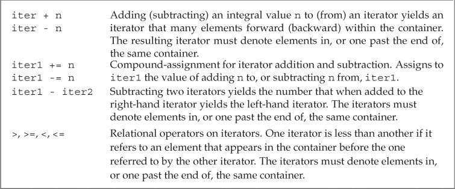

两个有效的迭代器可以相减，所得结果是两个迭代器的距离，类型名为difference_type的带符号整型数。string 和vector都支持这个类型。

### 3.5 Arrays

与vector类型不同，数字大小固定，不能随意向数组中随意添加元素。

#### 3.5.1 Defining and Initializing Built-in Arrays

数组是一种复合类型，声明形式为`a[d]`，其中`a`是数组名称，`d`是数组维度（dimension）。维度必须是一个大于0的常量表达式。

默认情况下，数组的元素被默认初始化【2.2.1】。

定义数组的时候必须指定数组的类型，不允许用`auto`关键字由初始值列表推断类型。

类似vector，数组的元素必须为对象，因此不存在引用的数组。

##### 显式初始化数组元素

如果定义数组时提供了元素的初始化列表，则允许省略数组维度，编译器会根据初始值的数量计算维度。但如果显式指明了维度，那么初始值的数量不能超过指定的大小。如果维度比初始值的数量大，则用提供的值初始化数组中靠前的元素，剩下的元素被默认初始化。

```c++
const unsigned sz = 3;
int ia1[sz] = {0,1,2};  // array of three ints with values 0, 1, 2
int a2[] = {0, 1, 2};   // an array of dimension 3
int a3[5] = {0, 1, 2};  // equivalent to a3[] = {0, 1, 2, 0, 0}
string a4[3] = {"hi", "bye"};   // same as a4[] = {"hi", "bye", ""}
int a5[2] = {0,1,2};    // error: too many initializers
```

##### 字符数组的特殊性

可以用字符串字面值初始化字符数组，但字符串字面值结尾处的空字符也会一起被拷贝到字符数组中。

```c++
char a1[] = {'C', '+', '+'};        // list initialization, no null
char a2[] = {'C', '+', '+', '\0'};  // list initialization, explicit null
char a3[] = "C++";      // null terminator added automatically
const char a4[6] = "Daniel";    // error: no space for the null!
```

字符串会自动添加表示字符串结束的空字符，所以要注意留足空间。

##### 数组不允许拷贝和赋值

不能用一个数组初始化或直接赋值给另一个数组。

有的编译器支持，这就是所谓的编译器拓展（compiler extension），但是一般来说最好避免使用非标准特性。

##### 理解复杂的数组声明

从数组的名字开始由内向外阅读有助于理解复杂数组声明的含义。

```c++
int *ptrs[10];              // ptrs is an array of ten pointers to int
int &refs[10] = /* ? */;    // error: no arrays of references
int (*Parray)[10] = &arr;   // Parray points to an array of ten ints
int (&arrRef)[10] = arr;    // arrRef refers to an array of ten ints
```

#### 3.5.2 Accessing the Elements of an Array

数组下标通常被定义成`size_t`类型，这是一种机器相关的无符号类型，可以表示内存中任意对象的大小。`size_t`定义在头文件`cstddef`中。这个文件是`stddef.h`的c++版本

大多数常见的安全问题都源于缓冲区溢出错误。当数组或其他类似数据结构的下标越界并试图访问非法内存区域时，就会产生此类错误。这种错误除了小心检查，加强测试之外，没有什么好的方法。即使通过编译执行也不能证明不会发生这类错误。

#### 3.5.3 Pointers and Arrays

使用数组时，编译器一般会把它转化为指针。

而数组有个特性，在大多数表达式中，使用数组类型的对象其实是在使用一个指向该数组首元素的指针。

当使用数组作为一个`auto`变量的初始值时，推断得到的类型是指针而非数组。但`decltype`关键字【2.5.3】不会发生这种转换，直接返回数组类型。

```c++
int ia[] = {0,1,2,3,4,5,6,7,8,9};   // ia is an array of ten ints
auto ia2(ia);   // ia2 is an int* that points to the first element in ia
ia2 = 42;       // error: ia2 is a pointer, and we can't assign an int to a pointer
auto ia2(&ia[0]);   // now it's clear that ia2 has type int*
// ia3 is an array of ten ints
decltype(ia) ia3 = {0,1,2,3,4,5,6,7,8,9};
ia3 = p;    // error: can't assign an int* to an array
ia3[4] = i;     // ok: assigns the value of i to an element in ia3
```

##### 指针也可以用作迭代器

为了实现迭代器的效果，我们需要数组的首地址以及尾元素后一位的地址。

```c++
int a[10] = {...};
int *start = a;
int *end = a[10];
for(int *p = start;p!=end;++p){
    cout<<*p<<endl;
}
```

> 建议使用++i而不是i++，少一步拷贝。

##### 标准库函数begin和end.

上面的使用很容易出错。为此C++11在头文件`iterator`中定义了两个名为`begin`和`end`的函数，功能与容器中的两个同名成员函数类似，参数是一个数组。

```c++
int ia[] = {0,1,2,3,4,5,6,7,8,9};   // ia is an array of ten ints
int *beg = begin(ia);   // pointer to the first element in ia
int *last = end(ia);    // pointer one past the last element in ia
```

- 一个指针如果指向了某种内置类型数组的尾元素的“下一位置”，则其具备end()类似的功能，特别注意，尾后指针不能用于解引用和递增操作。

##### 指针运算

迭代器操作指针都能做。

两个指针相减的结果类型是`ptrdiff_t`，这是一种定义在头文件`cstddef`中的带符号类型。

##### 下标与指针

只要指针指向的是数组中的元素(或尾指针下一个位置)，都可以进行下标操作。

```c++
int *p = &ia[2];
int j = p[1];	== ia[3]
int k = p[-2];  == ia[0]
```

标准库类型限定使用的下标必须是无符号类型，而内置的下标运算无此要求。

内置的下标运算可以处理负值，当然指的元素必须有效。

#### 3.5.4 C-Style Character Strings

C++标准支持C风格字符串，但是最好不要在C++程序中使用它们。对大多数程序来说，使用标准库`string`要比使用C风格字符串更加安全和高效。

字符串字面值是一种通用结构的实例，这种结构是C++由C继承而来的C风格字符串--将字符串存放在字符数组中，并以空字符结束（null terminated）。这不是一种类型，而是一种为了表达和使用字符串而形成的书写方法。

##### C标准库String函数

C风格字符串的函数，被定义在cstring头文件中，cstring是string.h的c++版本


C风格字符串函数不负责验证其参数的正确性，传入此类函数的指针必须指向以空字符作为结尾的数组。

##### 比较字符串

标准string 对象可以直接进行比较，但是如果用在c风格字符串上，实际比较的将会是指针而不是字符串，如果想比较需要用strcmp；

##### 目标字符串的大小由调用者指定

不同于c++ 标准string类可以直接将两个字符串相加，c风格的字符串相加需要使用strcmp和strcat，将两个字符串赋给另一个有足够空间的C风格字符串。而这个空间并不容易估计准确，充满了风险。

#### 3.5.5 Interfacing to Older Code

##### 混用string对象和C风格字符串

任何出现字符串字面值的地方都可以用以空字符结束的字符数组来代替：

- 允许使用以空字符结束的字符数组来初始化`string`对象或为`string`对象赋值。

- 在`string`对象的加法运算中，允许使用以空字符结束的字符数组作为其中一个运算对象（不能两个运算对象都是）。

- 在`string`对象的复合赋值运算中，允许使用以空字符结束的字符数组作为右侧运算对象。

不能用`string`对象直接初始化指向字符的指针。为了实现该功能，`string`提供了一个名为`c_str`的成员函数，返回`const char*`类型的指针，指向一个以空字符结束的字符数组，数组的数据和`string`对象一样。

```c++
string s("Hello World");    // s holds Hello World
char *str = s;  // error: can't initialize a char* from a string
const char *str = s.c_str();    // ok
```

针对`string`对象的后续操作有可能会让`c_str`函数之前返回的数组失去作用，如果程序想一直都能使用其返回的数组，**最好将该数组重新拷贝一份**。

##### 使用数组初始化vector对象

可以使用数组来初始化`vector`对象，但是需要指明要拷贝区域的首元素地址和尾后地址。

```c++
int int_arr[] = {0, 1, 2, 3, 4, 5};
// ivec has six elements; each is a copy of the corresponding element in int_arr
vector<int> ivec(begin(int_arr), end(int_arr));
```

在新版本的C++程序中应该尽量使用`vector`、`string`和迭代器，避免使用内置数组、C风格字符串和指针。

### 3.6 Multidimensional Arrays

C++中的多维数组其实就是数组的数组。当一个数组的元素仍然是数组时，通常需要用两个维度定义它：一个维度表示数组本身的大小，另一个维度表示其元素（也是数组）的大小。通常把二维数组的第一个维度称作行，第二个维度称作列。

##### 多维数组的初始化

多维数组初始化的几种方式：

初始化时的内嵌的花括号并不是必须的。

```c++
int ia[3][4] =
{   // three elements; each element is an array of size 4
    {0, 1, 2, 3},   // initializers for the row indexed by 0
    {4, 5, 6, 7},   // initializers for the row indexed by 1
    {8, 9, 10, 11}  // initializers for the row indexed by 2
};
// equivalent initialization without the optional nested braces for each row
int ib[3][4] = {0, 1, 2, 3, 4, 5, 6, 7, 8, 9, 10, 11};
// explicitly initialize only element 0 in each row
int ic[3][4] = {{ 0 }, { 4 }, { 8 }};//初始化每行首元素
// explicitly initialize row 0; the remaining elements are value initialized
int id[3][4] = {0, 3, 6, 9};//初始化第一行
```

##### 多维数组的下标引用

可以使用下标访问多维数组的元素，数组的每个维度对应一个下标运算符。

- 如果表达式中下标运算符的数量和数组维度一样多，则表达式的结果是给定类型的元素。
- 如果下标运算符数量比数组维度小，则表达式的结果是给定索引处的一个内层数组。

```c++
// assigns the first element of arr to the last element in the last row of ia
ia[2][3] = arr[0][0][0];
int (&row)[4] = ia[1];  // binds row to the second four-element array in ia
```

##### 使用范围for语句处理多维数组

使用范围`for`语句处理多维数组时，为了避免数组被自动转换成指针【3.5.3】，语句中的外层循环控制变量必须声明成引用类型。

```c++
for (const auto &row : ia)  // for every element in the outer array
    for (auto col : row)    // for every element in the inner array
        cout << col << endl;
```

如果`row`不是引用类型，编译器初始化`row`时会自动将数组形式的元素转换成指向该数组内首元素的指针，这样得到的`row`就是`int*`类型，而之后的内层循环则试图在一个`int*`内遍历，程序将无法通过编译。

```c++
for (auto row : ia)
    for (auto col : row)
```

**使用范围`for`语句处理多维数组时，除了最内层的循环，其他所有外层循环的控制变量都应该定义成引用类型。如果要对元素进行改写，最内层也得用引用**

##### 指针和多维数组

因为多维数组实际上是数组的数组，所以由多维数组名称转换得到的指针指向第一个内层数组的指针。

```c++
int ia[3][4];       // array of size 3; each element is an array of ints of size 4
int (*p)[4] = ia;   // p points to an array of four ints
p = &ia[2];         // p now points to the last element in ia
```

声明指向数组类型的指针时，必须带有圆括号。

```c++
int *ip[4];     // array of pointers to int
int (*ip)[4];   // pointer to an array of four ints
```

使用`auto`和`decltype`能省略复杂的指针定义。

```c++
// print the value of each element in ia, with each inner array on its own line
// p points to an array of four ints
for (auto p = ia; p != ia + 3; ++p)
{
    // q points to the first element of an array of four ints; that is, q points to an int
    for (auto q = *p; q != *p + 4; ++q)
        cout << *q << ' ';
    cout << endl;
}
```

使用`begin`和`end`也能实现相同的功能，看起来还更简单鲁棒。

```c
for (auto p = begin(ia);p != end(ia);++p){
    for(auto q = begin(*p);q != end(*p);++q){
        cout<<*q<<" ";
    }
	cout<<endl;
}
```

##### 类型别名简化多维数组的指针

```c++
using int_array = int[4];
typedef int int_array[4];
```

两者相同。

> 解释typedef int int_array[4];
> 关键字typedef用来自定义数据类型，这是所有教材都这样讲的，但不要理解为新创建了一个数据类型，而是将已有的一个类型赋予个新名称而已，即起一个别名。
> 具体对这个语句来说，别名就是：int_array。而[4]不属于名字，而表示一种已有的数据类型，即：给一个大小为4的int数组取一个别名为int_array。
> 那如何知道是这样定义的呢？很简单。
> 首先，int a[4];这可是常见的定义格式。再在其前面添加关键字typedef，变成 typedef int a[4];最后将数组名a改为自己想要的一个别名int_array即可。注意：原本的a本意是数组名，属于变量范畴，而int_array则是新数据类型名（即别名），本质不一样了哦。祥见谭浩强的那本经典教材。

> **typedef常见用法**
>
> https://www.shuzhiduo.com/A/D85476oWJE/
>
> 1.常规变量类型定义
>
> 例如：typedef unsigned char uchar
> 描述：uchar等价于unsigned char类型定义 uchar c声明等于unsigned char c声明
>
> 2.数组类型定义
> 例如： typedef int array[2];
> 描述： array等价于 int [2]定义; array a声明等价于int a[2]声明
>
> 扩展： typedef int array[M][N];
> 描述： array等价于 int [M][N]定义; array a声明等价于int a[M][N]声明
>
> 3.指针类型定义
> 例如： typedef int *pointer;
> 描述： pointer等价于 int *定义;pointer p声明等价于int *p声明
>
> 例如： typedef int *pointer[M];
> 描述： pointer等价于 int *[M]定义 pointer p声明等价于int *p[M]声明明
>
> 4.函数地址说明
> 描述：C把函数名字当做函数的首地址来对待，我们可以使用最简单的方法得到函数地址
> 例如： 函数:int func(void); unsigned long funcAddr=(unsigned long)func， funcAddr的值是func函数的首地址
>
> 5.函数声明
> 例如： typedef int func(void); func等价于 int (void)类型函数
> 描述1： func f声明等价于 int f(void)声明，用于文件的函数声明
> 描述2： func *pf声明等价于 int (*pf)(void)声明，用于函数指针的生命，见下一条
>
> 6.函数指针
> 例如： typedef int (*func)(void)
> 描述： func等价于int (*)(void)类型
> func pf等价于int (*pf)(void)声明，pf是一个函数指针变量
>
> 7.识别typedef的方法：
> a).第一步。使用已知的类型定义替代typdef后面的名称,直到只剩下一个名字不识别为正确
> 如typedef u32 (*func)(u8);
> 从上面的定义中找到 typedef __u32 u32;typedef __u8 u8
> 继续找到 typedef unsigned int __u32;typedef unsigned char __u8;
> 替代位置名称 typedef unsigned int (*func)(void);
> 现在只有func属于未知。
> b).第二步.未知名字为定义类型，类型为取出名称和typedef的所有部分，如上为
> func等价于unsigned unsigned int (*)(unsigned char);
> c).第三部.定义一个变量时，变量类型等价于把变量替代未知名字的位置所得到的类型
> func f等价于unsigned unsigned int (*f)(unsigned char)


### Chapter Summary  

- `string`和 `vector`是最重要的两种标准库类型，string对象是一个可变长的字符序列，vector对象是一组同类型对象的容器。
- 迭代器允许对容器中的对象进行间接访问，对于string对象和vector对象来说，可以通过迭代器访问元素或者在元素间移动。
- 数组和指向数组元素的指针在一个较低层次上实现了与标准库string和vector类似的功能。一般来说尽量使用标准库提供的类型，之后在考虑C++语言内置的低层的替代品数组或指针。

### Defined Terms

| 中文       | 英文                  | 含义                                                         |
| ---------- | --------------------- | ------------------------------------------------------------ |
| 缓冲器溢出 | buffer overflow       | 一种严重的程序故障，主要原因是试图通过一个越界的索引访问容器内容，容器类型包括string、vector、数组等。 |
| 拷贝初始化 | copy initialization   | 使用赋值号的初始化形式，新创建的对象是初始值的一个副本       |
| 直接初始化 | direct initialization | 不使用赋值号的初始化形式                                     |
| 实例化     | instantiation         | 编译器生成一个指定的模板类或函数的过程                       |
|            | difference_type       | 由string和vector定义的一种带符号整数类型，表示两个迭代器之间的距离。 |
|            | size_type             | 由string和vector定义的一种无符号整数类型，能存放下任意string对象或vector对象的大小 |
|            | prtdiff_t             | cstddef头文件定义的一种与机器实现有关的带符号整数类型，空间足够大，足以表示数组中任意两个指针之间的距离 |
|            | size_t                | cstddef头文件定义的一种与机器实现有关的带符号整数类型，空间足够大，足以表示任意数组的大小 |


## Chapter 4 Expressions 表达式
### 4.1 Fundamentals

表达式（expression）由一个或多个运算对象（operand）组成，对表达式求值将得到一个结果（result）。字面值和变量是最简单的表达式，其结果就是字面值和变量的值。

#### 4.1.1 Basic Concepts

C++定义了一元运算符（unary operator）和二元运算符（binary operator）。除此之外，还有一个作用于三个运算对象的三元运算符。函数调用`()`也是一种特殊的运算符，它对运算对象的数量没有限制。

另外一些符号既可以作为一元运算符，也可以作为二元运算符，诸如*，一元它是解引用，二元它是乘法。具体是什么取决于上下文。

##### 运算对象转换

表达式求值过程中，小整数类型（如`bool`、`char`、`short`等）通常会被提升（promoted）为较大的整数类型，主要是`int`。【4.11】

##### 重载运算符

C++定义了运算符作用于内置类型和复合类型的运算对象时所执行的操作。当运算符作用于类类型的运算对象时，用户可以自定义其含义，这被称作运算符重载（overloaded operator）。

我们使用重载运算符时，包括运算对象的类型和返回值的类型，都是由该运算符定义的，但是运算对象的个数，运算符的优先级和结合律都是无法改变的。

##### 左值和右值

C++的表达式分为右值（rvalue）和左值（lvalue）。

- 当一个对象被用作右值的时候，用的是对象的值（内容）；

- 当对象被用作左值时，用的是对象的身份（在内存中的位置）-- 地址。

  **一个重要原则**：需要右值的地方可以用左值代替，反之则不行。

> ## 1、左值和右值的概念
>
> C++中左值（lvalue）和右值（rvalue）是比较基础的概念，虽然平常几乎用不到，但C++11之后变得十分重要，它是理解 move/forward 等新语义的基础。
>
> 左值与右值这两个概念是从 C 中传承而来的，左值指既能够出现在等号左边，也能出现在等号右边的变量；右值则是只能出现在等号右边的变量。
>
> ```cpp
> int a; // a 为左值
> a = 3; // 3 为右值
> ```
>
> - 左值是可寻址的变量，有持久性；
> - 右值一般是不可寻址的常量，或在表达式求值过程中创建的无名临时对象，短暂性的。
>
> 左值和右值主要的区别之一是左值可以被修改，而右值不能。
>
> ## 2、左值引用和右值引用
>
> - 左值引用：引用一个对象；
> - 右值引用：就是必须绑定到右值的引用，C++11中右值引用可以实现“移动语义”，通过 && 获得右值引用。
>
> ```cpp
> int x = 6; // x是左值，6是右值
> int &y = x; // 左值引用，y引用x
> 
> int &z1 = x * 6; // 错误，x*6是一个右值
> const int &z2 =  x * 6; // 正确，可以将一个const引用绑定到一个右值
> 
> int &&z3 = x * 6; // 正确，右值引用
> int &&z4 = x; // 错误，x是一个左值
> ```
>
> 右值引用和相关的移动语义是C++11标准中引入的最强大的特性之一，通过std::move()可以避免无谓的复制，提高程序性能。

一些需要使用左值的运算符：

- 赋值运算符需要一个非常量左值作为其左侧运算对象，返回结果也是一个左值。

- 取地址符作用于左值运算对象，返回指向该运算对象的指针，该指针是一个右值。

- 内置解引用运算符、下标运算符、迭代器解引用运算符、`string`和`vector`的下标运算符都返回左值。

- 内置类型和迭代器的递增递减运算符作用于左值运算对象。前置版本返回左值，后置版本返回右值。


如果`decltype`作用于一个求值结果是左值的表达式，会得到引用类型。

`decltype((variable))`一定会返回引用 `decltype(variable)`只有variable为引用类型会返回引用

```c++
#include <iostream>
#include<typeinfo>
using namespace std;
int main()
{
    int m = 6;
    int* p = &m;
    int& n = m;
    decltype(*p) a= *p;
    decltype(&p) b;
    cout << "a的类型是" << typeid(a).name() << endl;
    cout << "b的类型是" << typeid(b).name() << endl;
    cout << "n的类型是" << typeid(n).name() << endl;
    std::cout << "Hello World!\n";
}
/*
a的类型是int
b的类型是int * *
n的类型是int
Hello World!
*/
//还学习到typeid会返回引用指向的类型，不会返回啥reference的。不过visual studio 的智能提示能看到。
```

##### :sunny:关于decltype推导

> ## MSDN
>
> 编译器使用以下规则来确定 *表达式* 参数的类型。
>
> - 如果 *表达式* 参数是标识符或 [类成员访问](https://docs.microsoft.com/zh-cn/cpp/cpp/member-access-operators-dot-and?view=msvc-170)， `decltype(expression)` 则为由 *表达式*命名的实体的类型。 如果没有此类实体或 *表达式* 参数为一组重载函数命名，编译器将生成错误消息。
> - 如果 *表达式* 参数是对函数或重载运算符函数的调用， `decltype(expression)` 则为函数的返回类型。 将忽略重载运算符两边的括号。
> - 如果 *表达式* 参数是 [右值](https://docs.microsoft.com/zh-cn/cpp/cpp/lvalues-and-rvalues-visual-cpp?view=msvc-170)， `decltype(expression)` 则表示 *表达式*的类型。 如果*表达式*参数是[左值](https://docs.microsoft.com/zh-cn/cpp/cpp/lvalues-and-rvalues-visual-cpp?view=msvc-170)，`decltype(expression)`则为对*表达式*类型的[左值引用](https://docs.microsoft.com/zh-cn/cpp/cpp/lvalue-reference-declarator-amp?view=msvc-170)。


> ## decltype推导四规则
>
> 1. 如果e是一个没有带括号的标记符表达式或者类成员访问表达式，那么的decltype（e）就是e所命名的实体的类型。此外，如果e是一个被重载的函数，则会导致编译错误。
> 2. 否则 ，假设e的类型是T，如果e是一个将亡值，那么decltype（e）为T&&
> 3. 否则，假设e的类型是T，如果e是一个左值，那么decltype（e）为T&。
> 4. 否则，假设e的类型是T，则decltype（e）为T。

##### :sunny:关于值的类型

> **在前面**
>
>    C++中有“左值”、“右值”的概念，C++11以后，又有了“左值”、“纯右值”、“将亡值”的概念。关于这些概念，许多资料上都有介绍，本文在拾人牙慧的基础上又加入了一些自己的一些理解，同时提出了一些需要读者特别注意的地方，主要目的有二：
>    1.尽可能地将这些概念介绍清楚。
>    2.为后续介绍完美转发和移动语义做好铺垫。
>
> **正文**
>
> 一、表达式
>
> ​    要说清“三值”，首先要说清表达式。
>
> ​    定义
> ​      由运算符(operator)和运算对象(operand)①构成的计算式（类似于数学上的算术表达式）。
>    举例
> ​      字面值(literal)和变量(variable)是最简单的表达式，函数的返回值也被认为是表达式。
>
> 二、值类别
>
> ​    表达式是可求值的，对表达式求值将得到一个结果(result)。这个结果有两个属性：类型和值类别（value categories）。下面我们将详细讨论表达式的值类别②。
>
> ​    在c++11以后，表达式按值类别分，必然属于以下三者之一：左值(left value,lvalue)，将亡值(expiring value,xvalue)，纯右值(pure rvalue,pralue)。其中，左值和将亡值合称泛左值(generalized lvalue,glvalue)，纯右值和将亡值合称右值(right value,rvalue)。见下图
>
>  
>
> 
>
>  
>
>    有一点需要说明，严格来讲，“左值”是表达式的结果的一种属性，但更为普遍地，我们通常用“左值”来指代左值表达式（正如上边一段中做的那样）。所谓左值表达式，就是指求值结果的值类别为左值的表达式。通常我们无需区分“左值”指的是前者还是后者，因为它们表达的是同一个意思，不会引起歧义。在后文中，我们依然用左值指代左值表达式。对于纯右值和将亡值，亦然。
>
> 三、详细说明
>
>    事实上，无论是左值、将亡值还是纯右值，我们目前都没有一个精准的定义。它们事实上表征了表达式的属性，而这种属性的区别主要体现在使用上，如能否做运算符的左操作数、能否使用移动语义（关于移动语义，在下的后续文章中会详细介绍）等。因此，从实际应用出发，我们首先需要做到的是：给定一个表达式，能够正确地判断出它的值类别。为了使读者能够做到这一点，在下采取了一个实际的方式：先对各个值类别的特征加以描述，然后指出常见的表达式里边，哪些属于该类别。
>
> **左值**
>
> 描述
>    **能够用&取地址的表达式是左值表达式。**
> 举例
>    函数名和变量名（实际上是函数指针③和具名变量，具名变量如std::cin、std::endl等）、返回左值引用的函数调用、前置自增/自减运算符连接的表达式++i/--i、由赋值运算符或复合赋值运算符连接的表达式(a=b、a+=b、a%=b）、解引用表达式*p、字符串字面值"abc"（关于这一点，后面会详细说明）等。
>
> **纯右值**
>
> 描述
>    满足下列条件之一：
>    1）本身就是赤裸裸的、纯粹的字面值，如3、false；
>    2）求值结果相当于字面值或是一个不具名的临时对象。
> 举例
>    除字符串字面值以外的字面值、返回非引用类型的函数调用、后置自增/自减运算符连接的表达式i++/i--、算术表达式（a+b、a&b、a<<b）、逻辑表达式（a&&b、a||b、~a）、比较表达式（a==b、a>=b、a<b）、取地址表达式（&a）等。
>
>    下面从上面的例子中选取若干典型详细说明左值和纯右值的判断。
>
>    1）++i是左值，i++是右值。
>    前者，对i加1后再赋给i，最终的返回值就是i，所以，++i的结果是具名的，名字就是i；而对于i++而言，是先对i进行一次拷贝，将得到的副本作为返回结果，然后再对i加1，由于i++的结果是对i加1前i的一份拷贝，所以它是不具名的。假设自增前i的值是6，那么，++i得到的结果是7，这个7有个名字，就是i；而i++得到的结果是6，这个6是i加1前的一个副本，它没有名字，i不是它的名字，i的值此时也是7。可见，++i和i++都达到了使i加1的目的，但两个表达式的结果不同。
>
>    2）解引用表达式*p是左值，取地址表达式&a是纯右值。
>    &(*p)一定是正确的，因为*p得到的是p指向的实体，&(*p)得到的就是这一实体的地址，正是p的值。由于&(*p)的正确，所以*p是左值。而对&a而言，得到的是a的地址，相当于unsigned int型的字面值，所以是纯右值。
>
>    3）a+b、a&&b、a`==`b都是纯右值
>    a+b得到的是不具名的临时对象，而a&&b和a`==`b的结果非true即false，相当于字面值。
>
> **将亡值**
>
> 描述
>    在C++11之前的右值和C++11中的纯右值是等价的。C++11中的将亡值是随着右值引用④的引入而新引入的。换言之，“将亡值”概念的产生，是由右值引用的产生而引起的，将亡值与右值引用息息相关。所谓的将亡值表达式，就是下列表达式：
>    1）返回右值引用的函数的调用表达式
>    2）转换为右值引用的转换函数的调用表达式
>    读者会问：这与“将亡”有什么关系？
>    在C++11中，我们用左值去初始化一个对象或为一个已有对象赋值时，会调用拷贝构造函数或拷贝赋值运算符来拷贝资源（所谓资源，就是指new出来的东西），而当我们用一个右值（包括纯右值和将亡值）来初始化或赋值时，会调用移动构造函数或移动赋值运算符⑤来移动资源，从而避免拷贝，提高效率（关于这些知识，在后续文章讲移动语义时，会详细介绍）。当该右值完成初始化或赋值的任务时，它的资源已经移动给了被初始化者或被赋值者，同时该右值也将会马上被销毁（析构）。也就是说，当一个右值准备完成初始化或赋值任务时，它已经“将亡”了。而上面1）和2）两种表达式的结果都是不具名的右值引用，它们属于右值（关于“不具名的右值引用是右值”这一点，后面还会详细解释）。又因为
>     1）这种右值是与C++11新生事物——“右值引用”相关的“新右值”
>     2）这种右值常用来完成移动构造或移动赋值的特殊任务，扮演着“将亡”的角色
>     所以C++11给这类右值起了一个新的名字——将亡值。
> 举例
>     std::move()、tsatic_cast<X&&>(x)（X是自定义的类，x是类对象，这两个函数常用来将左值强制转换成右值，从而使拷贝变成移动，提高效率，关于这些，后续文章中会详细介绍。）
> 附注
>    事实上，将亡值不过是C++11提出的一块晦涩的语法糖。它与纯右值在功能上及其相似，如都不能做操作符的左操作数，都可以使用移动构造函数和移动赋值运算符。当一个纯右值来完成移动构造或移动赋值任务⑥时，其实它也具有“将亡”的特点。一般我们不必刻意区分一个右值到底是纯右值还是将亡值。 
>
>    关于“三值”的大体介绍，就到此结束了。想要获知更加详细的内容，读者可以参考cppreference上的文章：
>    http://naipc.uchicago.edu/2015/ref/cppreference/en/cpp/language/value_category.html （精简版）  
>    和
>    http://en.cppreference.com/w/cpp/language/value_category （详细版）
>    文章对“三值”进行了详细地讲述，同时讲出了将左值和将亡值合称泛左值的原因（这是本文未详细讨论的），如两者都可以使用多态，都可以隐式转换成纯右值，都可以是不完全类型（[incomplete type](http://en.cppreference.com/w/cpp/language/type#Incomplete_type)）等。之所以不展开叙述，是因为在下实在举不出合适的代码来加以佐证。这里在下恳请各位读者不吝赐教。另外，关于文章（特别是详细版）中的一些观点，在下不敢苟同，篇幅原因，在下就不一一叙述了。
>
> 四、特别注意
>
> ​    最后，关于“三值”，有些地方需要大家特别注意。
>
>    1）字符串字面值是左值。
>
>    不是所有的字面值都是纯右值，字符串字面值是唯一例外。
>    早期C++将字符串字面值实现为char型数组，实实在在地为每个字符都分配了空间并且允许程序员对其进行操作，所以类似
>
> ```
> cout<<&("abc")<<endl;
> char *p_char="abc";//注意不是char *p_char=&("abc");
> ```
>
> 这样的代码都是可以编译通过的。
>     注意上面代码中的注释，"abc"可以直接初始化指针p_char，p_char的值为字符串"abc"的首字符a的地址。而&("abc")被编译器编译为const的指向数组的指针const char (*) [4]（之所以是4，是因为编译器会在"abc"后自动加上一个'\0'），它不能初始化char *类型，即使是const char *也不行。另外，对于char *p_char="abc";，在GCC编译器上,GCC4.9(C++14)及以前的版本会给出警告，在GCC5.3(C++14)及以后的版本则直接报错：ISO C++ forbids converting a string constant to 'char*'（ISO C++禁止string常量向char*转换）。但这并不影响“字符串字面值是左值”这一结论的正确性，因为cout<<&("abc")<<endl;一句在各个版本的编译器上都能编译通过，没有警告和错误。
>
> ​    2)具名的右值引用是左值，不具名的右值引用是右值。
>
>    见下例（例一）
>
> ```
> void foo(X&& x)
> {
>     X anotherX = x;
>    //后面还可以访问x
>  }
> ```
>
>    上面X是自定义类，并且，其有一个指针成员p指向了在堆中分配的内存；参数x是X的右值引用。如果将x视为右值，那么，X anotherX=x;一句将调用X类的移动构造函数，而我们知道，这个移动构造函数的主要工作就是将x的p指针的值赋给anotherX的p指针，然后将x的p指针置为nullptr。（后续文章讲移动构造函数时会详细说明）。而在后面，我们还可以访问x，也就是可以访问x.p，而此时x.p已经变成了nullptr，这就可能发生意想不到的错误。 
>
>    又如下例（例二）
>
> ```
> X& foo(X&& x)
> {
>      //对x进行一些操作
>      return x;
> }
> 
> //调用
> foo(get_a_X());//get_a_X()是返回类X的右值引用的函数
> ```
>
> [](javascript:void(0);)
>
>    上例中，foo的调用以右值（确切说是将亡值）get_a_X()为实参，调用类X的移动构造函数构造出形参x，然后在函数体内对x进行一些操作，最后return X，这样的代码很常见，也很符合我们的编写思路。注意foo函数的返回类型定义为X的引用，如果x为右值，那么，一个右值是不能绑定到左值引用上去的。 
>    为避免这种情况的出现，C++规定：具名的右值引用是左值。这样一来，例一中X anotherX = x;一句将调用X的拷贝构造函数，执行后x不发生变化，继续访问x不会出问题；例二中，return x也将得到允许。
>    例二中，get_a_X返回一个不具名右值引用，这个不具名右值引用的唯一作用就是初始化形参x，在后面的代码中，我们不会也无法访问这个不具名的右值引用。C++将其归为右值，是合理的，一方面，可以使用移动构造函数，提高效率；另一方面，这样做不会出问题。
>
>    至此，关于“三值”的内容就全部介绍完了。
>
> 注释：
>
>    ①只有当存在两个或两个以上的运算对象时才需要运算符连接，单独的运算对象也可以是表达式，例如上面提到的字面值和变量。
>    ②确切说，是表达式的结果的值类别，但我们一般不刻意区分表达式和表达式的求值结果，所以这里称“表达式的值类别”。
>    ③当我们将函数名作为一个值来使用时，该函数名自动转换为指向对应函数的指针。
>    ④关于右值引用本身，没什么可说的，就是指可以绑定到右值上的引用，用"&&"表示，如int &&rra=6;。相比之下，与右值引用相关的一些主题，如移动语义、引用叠加、完美转发等，更值得我们深入探讨。这些内容，在下在后续文章中都会详细介绍。
>    ⑤前提是该右值（如自定义的类X）有移动构造函数或移动赋值运算符可供调用（有时候是没有的，关于这些知识，后续文章在讲移动构造函数和移动赋值运算符时会详述）。
>    ⑥在本文的例二中，如果将get_a_X()的返回值由X的右值引用改为X对象，则get_a_X()是纯右值表达式（如前所述，返回非引用类型的函数调用是纯右值），此时Foo(get_a_X());一句调用的仍然是类X的移动构造函数，这就是一个纯右值完成移动构造的例子。
>
> **写在后面**
>
> ​    在下在参阅许多资料之后，再结合自己的理解，整理出了这篇文章，力图能实现在下写博客（不光是这篇，是所有）的初衷——为初学者服务，尽量把话说明白。但是，由于“三值”问题本身较为复杂，再加上在下才疏学浅，表达能力有限，错误疏漏及其它不足之处在所难免。所以，希望广大读者能够用批判的眼光来阅读这篇文章，更恳请大家对在下的错误疏漏提出批评指正。您的批评指正，既是对在下莫大的帮助，更是在下进步的力量源泉。
>
> https://www.cnblogs.com/zpcdbky/p/5275959.html
>
> [« ](https://www.cnblogs.com/zpcdbky/p/5027481.html)上一篇： [一文说尽C++赋值运算符重载函数(operator=)](https://www.cnblogs.com/zpcdbky/p/5027481.html)
> [» ](https://www.cnblogs.com/zpcdbky/p/5284711.html)下一篇： [图说函数模板右值引用参数(T&&)类型推导规则（C++11）](https://www.cnblogs.com/zpcdbky/p/5284711.html)
>
> posted @ 2016-03-14 18:16 [同勉共进](https://www.cnblogs.com/zpcdbky/) 阅读(15562) 评论(9) [编辑](https://i.cnblogs.com/EditPosts.aspx?postid=5275959) [收藏](javascript:void(0)) [举报](javascript:void(0))

#### 4.1.2 Precedence and Associativity 优先级和结合律

复合表达式（compound expression）指含有两个或多个运算符的表达式。优先级与结合律决定了运算对象的组合方式。

括号无视优先级与结合律，表达式中括号括起来的部分被当成一个单元来求值，然后再与其他部分一起按照优先级组合。

#### 4.1.3 Order of Evaluation 求值顺序

对于那些没有指定执行顺序的运算符来说，如果表达式指向并修改了同一个对象，将会引发错误并产生未定义的行为。

```c++
int i = 0;
cout << i << " " << ++i << endl;    // undefined
```

注意：**C++只规定了很少的二元运算符的运算顺序（与、或、`,`）**，其他的则没加限制，这调高了代码生成的效率，但是也可能引发潜在的问题。

处理复合表达式时建议遵循以下两点：

- 不确定求值顺序时，使用括号来强制让表达式的组合关系符合程序逻辑的要求。

- 如果表达式改变了某个运算对象的值，则在表达式的其他位置不要再使用这个运算对象。

当改变运算对象的子表达式本身就是另一个子表达式的运算对象时，第二条规则无效。如`*++iter`，递增运算符改变了`iter`的值，而改变后的`iter`又是解引用运算符的运算对象。类似情况下，求值的顺序不会成为问题。

### 4.2 Arithmetic Operators 算术运算符

算术运算符（左结合律）(优先级从高到低)：

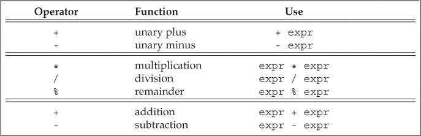

一元正号运算符作用于一个指针或算术值时，返回运算对象值的一个（提升后的）副本；

```c++
    char c = 42;
    cout << typeid(c).name() << endl;
    cout << typeid(+c).name() << endl;
    char *p = &c;
    cout << typeid(p).name() << endl;
    cout << typeid(+p).name() << endl;
/*
char
int
char *
char *
*/
用于指针没有变化。其实这不是什么“提升”，+c其实相当于0+c，因为0是int型，所以+c也是int型
指针+0还是指针
```

bool型不应该参加运算

```c++
bool b = true;
bool b2 = -b;   // error  b2 == true!
```

因为bool型参与运算被提升为int，int 型的-1 有值，所以不为假。


在除法运算中，C++语言的早期版本允许结果为负数的商向上或向下取整，C++11新标准则规定商一律向0取整（即直接去除小数部分）。


### 4.3 Logical and Relational Operators

关系运算符作用于算术类型和指针类型，逻辑运算符作用于任意能转换成布尔值的类型。逻辑运算符和关系运算符的返回值都是**布尔类型**。


**短路求值**

逻辑与（logical AND）运算符`&&`和逻辑或（logical OR）运算符`||`都是先计算左侧运算对象的值再计算右侧运算对象的值，当且仅当左侧运算对象无法确定表达式的结果时才会去计算右侧运算对象的值。这种策略称为短路求值（short-circuit evaluation）。

- 对于逻辑与运算符来说，当且仅当左侧运算对象为真时才对右侧运算对象求值。

- 对于逻辑或运算符来说，当且仅当左侧运算对象为假时才对右侧运算对象求值。

进行比较运算时，除非比较的对象是布尔类型，否则不要使用布尔字面值`true`和`false`作为运算对象。

### 4.4 Assignment Operators

赋值运算符`=`的左侧运算对象必须是一个**可修改**的**左值**。

C++11新标准允许使用花括号括起来的初始值列表作为赋值语句的右侧运算对象。

```c++
vector<int> vi;     // initially empty
vi = {0,1,2,3,4,5,6,7,8,9};     // vi now has ten elements, values 0 through 9
```

如果左侧运算对象是内置类型，那么初始值列表最多只能包含一个值，而且该值即使转换的话，所占空间也不应该大于目标类型的空间。

注：使用列表初始化有个方便之处，即初始值存在丢失信息的风险，编译器会报错。

##### 赋值运算符满足右结合律。

```c++
int ival, jval;
ival = jval = 0;    // ok: each assigned 0
```

##### 赋值运算符优先级较低

因为赋值运算符的优先级低于关系运算符的优先级，所以在条件语句中，赋值部分通常应该加上括号。

##### **不要混淆相等运算符`==`和赋值运算符`=`。**

##### 复合赋值运算符

包括`+=`、`-=`、`*=`、`/=`、`%=`、`<<=`、`>>=`、`&=`、`^=`和`|=`。任意一种复合运算都完全等价于*a = a op b*。唯一的区别在于求值次数，几乎可以忽略不计。

### 4.5 Increment and Decrement Operators

递增和递减运算符是为对象加1或减1的简洁书写形式。很多不支持算术运算的迭代器可以使用递增和递减运算符。

递增和递减运算符分为前置版本和后置版本：

- 前置版本首先将运算对象加1（或减1），然后将改变后的对象作为求值结果。

- 后置版本也会将运算对象加1（或减1），但求值结果是运算对象改变前的值的副本。

```c++
int i = 0, j;
j = ++i;    // j = 1, i = 1: prefix yields the incremented value
j = i++;    // j = 1, i = 2: postfix yields the unincremented value
```

> **除非必须，否则不应该使用递增或递减运算符的后置版本。后置版本需要将原始值存储下来以便于返回修改前的内容，如果我们不需要这个值，那么后置版本的操作就是一种浪费。**

##### 在一条语句中混用解引用和递增运算符

如果我们想在一条复合表达式中既将变量加/减1又能使用它原来的值，这时候就可以用后置递增/递减符，可以使程序更简洁。

```c++
auto pbeg = v.begin();
while(pbeg!=v.end() && *pbeg >= 0){
    cout << *pbeg++ << endl;
}
//输出v直到遇到第一个负值。
```

后置递增运算符优先级高于解引用，所以`*pbeg++` 相当于`*(pbeg++)`。先将pbeg加1，然后将原始副本给求值结果，然后输出，并移动指针。

##### 运算对象可按任意顺序求值

```c++
while (beg != s.end() && !isspace(*beg))
    *beg = toupper(*beg++)  // error ,这句话是未定义明确
    
编译器可能以以下任一思路分析
    *beg = toupper(*beg);		//先求左值
	*(beg + 1) = toupper(*beg)	//先求右值
```

所以要仔细注意求值顺序

### 4.6 The Member Access Operators

点运算符`.`和箭头运算符`->`都可以用来访问成员，表达式`ptr->mem`等价于`(*ptr).mem`。

```c++
string s1 = "a string", *p = &s1;
auto n = s1.size();  // run the size member of the string s1
n = (*p).size();    // run size on the object to which p points
n = p->size();      // equivalent to (*p).size()
```

解引用的优先级低于`.`运算符，所以第三局需要加括号，不然`*p.size()`通不过编译。

### 4.7 The Conditional Operator

条件运算符的使用形式如下：

```c++
cond ? expr1 : expr2;
```

其中`cond`是判断条件的表达式，如果`cond`为真则对`expr1`求值并返回该值，否则对`expr2`求值并返回该值。

只有当条件运算符的两个表达式都是左值或者能转换成同一种左值类型时，运算的结果才是左值，否则运算的结果就是右值。

条件运算符可以嵌套，但是考虑到代码的可读性，运算的嵌套层数最好不要超过两到三层。

条件运算符的优先级**非常低**，因此当一个长表达式中嵌套了条件运算子表达式时，通常需要在它两端加上括号。

### 4.8 The Bitwise Operators 位运算符

位运算符作用于整数类型的运算对象，并把运算对象看成是二进制位的集合。位运算符提供检查和设置二进制的功能【17.2 - bitset.h】

##### 位运算符（左结合律）：

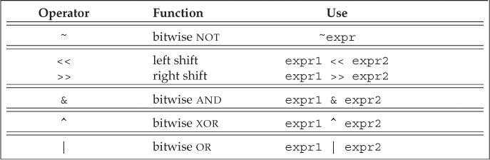

**在位运算中符号位如何处理并没有明确的规定，所以建议仅将位运算符用于无符号类型的处理。**


##### 移位运算符

这两种运算符的内置含义是对其运算对象执行基于二进制位的移动操作，首先令左侧运算对象的内容按照右侧运算对象的要求移动指定位数，然后将经过移动的（可能还进行了提升）左侧运算对象的拷贝作为求值结果。其中，右侧的运算对象一定不能为负，而且值必须严格小于结果的位数。而且值必须小于结果的位数，否则就会产生未定义的行为。二进制位或者向左移或者向右移，移出边界之外的位就被舍弃掉了。

- 左移运算符`<<`在运算对象右侧插入值为0的二进制位。

- 右移运算符`>>`的行为依赖于其左侧运算对象的类型：如果该运算对象是无符号类型，在其左侧插入值为0的二进制位；如果是带符号类型，在其左侧插入符号位的副本或者值为0的二进制位，如何选择视具体环境而定。

##### 位取反运算符

按位取反，char型会被提升为int类型。

##### 位与位或位异或

##### 移位运算符(IO运算符)满足左结合律

很多人可能没使用过移位运算符，但是肯定用过它们的重载版本进行IO操作。

### 4.9 The sizeof Operator

`sizeof`运算符返回一个表达式或一个类型名字所占的字节数，返回值是`size_t`类型。

在`sizeof`的运算对象中解引用一个无效指针仍然是一种安全的行为，因为指针实际上并没有被真正使用。

同样的，C++11允许我们通过作用域运算符来获取类成员的大小。通常情况下只有通过类的对象才能访问到类的成员，但是sizeof运算符无须我们提供一个具体的对象，因为想要知道类成员的大小无须真的获取该成员。

`sizeof`运算符的结果部分依赖于其作用的类型：

- 对`char`或者类型为`char`的表达式执行`sizeof`运算，返回值为1。
- 对引用类型执行`sizeof`运算得到被引用对象所占空间的大小。
- 对指针执行`sizeof`运算得到指针本身所占空间的大小。
- 对解引用指针执行`sizeof`运算得到指针指向的对象所占空间的大小，指针不需要有效。
- 对数组执行`sizeof`运算得到整个数组所占空间的大小。
- 对`string`或`vector`对象执行`sizeof`运算只返回该类型固定部分的大小，不会计算对象中元素所占空间的大小。

```c++
	//可以通过下面的方式获得数组的大小。
	int a[10];
    cout << sizeof(a) / sizeof(*a) << endl;//10
```


### 4.10 Comma Operator

逗号运算符`,`含有两个运算对象，按照从左向右的顺序依次求值，首先对左侧的表达式求值，然后丢弃掉，逗号运算符真正的幽魂算结果是右侧表达式的值。逗号运算符经常用在`for`循环中。

```c++
vector<int>::size_type cnt = ivec.size();
// assign values from size... 1 to the elements in ivec
for(vector<int>::size_type ix = 0; ix != ivec.size(); ++ix, --cnt)
    ivec[ix] = cnt;
```

### 4.11 Type Conversions

如果两种类型可以相互转换，那么它们就是关联的。

无须程序员介入，会自动执行的类型转换叫做隐式转换（implicit conversions）。

##### 何时发生隐式类型转换

- 在大多数表达式中，比int类型小的整型值首先提升较大的整数类型
- 在条件中，非布尔值转换成布尔类型
- 初始化过程中，初始值转变成变量的类型；在赋值语句中，右侧运算对象转换成左侧运算对象的类型。
- 算术运算或关系运算的运算对象有多种类型，需要转换成同一种类型。
- 【6】，函数调用时也会发生类型转换。

#### 4.11.1 The Arithmetic Conversions

把一种算术类型转换成另一种算术类型叫做算术转换。

整型提升（integral promotions）负责把小整数类型转换成较大的整数类型。前提是转换后的类型要能容纳原类型所有可能的值。

无符号与有符号类型之间的转换：

- 如果无符号类型不小于带符号类型，则带符号类型转换成无符号的。如果是负的可能会有意料之外的错误。
- 如果带符号类型大于无符号类型，此时转换结果依赖于机器，如果无符号类型的所有值都能存在带符号类型中，则无符号转化为带符号，否则带符号转换为无符号；

#### 4.11.2 Other Implicit Conversions

##### 数组转化为指针

在大多数表达式中，数组名字自动转换成指向数组首元素的指针。

##### 指针的转换

常量整数值0或字面值`nullptr`能转换成任意指针类型；指向任意非常量的指针能转换成`void*`；指向任意对象的指针能转换成`const void*`。【15.2.2】还会介绍在有继承关系的类型之间还有另外一种指针转换的方式。

##### 转换成布尔类型

任意一种算术类型或指针类型都能转换成布尔类型。如果指针或算术类型的值为0，转换结果是`false`，否则是`true`。

##### 转换成常量

指向非常量类型的指针能转换成指向相应的常量类型的指针。相反的操作不行，因为这试图删除底层的const。

##### 类类型定义的转换

编译器每次只能执行一种类类型的转换，【7.5.4】会看到一个拒绝同时转化多个请求的例子

举例子：

```c++
while(cin >> s)
```

`while()`实际是检查istream类型的值，不过因为IO库定义了从istream型向布尔值转换的规则，所以可以进行成功转换。

#### 4.11.3 Explicit Conversions

显式类型转换也叫做强制类型转换（cast）。虽然有时不得不使用强制类型转换，但这种方法本质上是非常危险的。建议尽量避免强制类型转换。

命名的强制类型转换（named cast）形式如下：

```c++
cast-name<type>(expression);
```

其中`type`是转换的目标类型，`expression`是要转换的值。如果`type`是引用类型，则转换结果是左值。`cast-name`是`static_cast`、`dynamic_cast`、`const_cast`和`reinterpret_cast`中的一种，用来指定转换的方式。

- `dynamic_cast`支持运行时类型识别。【19.2】

- 任何具有明确定义的类型转换，只要不包含底层`const`，都能使用`static_cast`。

- `const_cast`只能改变运算对象的底层`const`，不能改变表达式的类型。同时也只有`const_cast`能改变表达式的常量属性。`const_cast`常常用于函数重载。

- `reinterpret_cast`通常为运算对象的位模式提供底层上的重新解释。十分危险，类型改变了，但编译器不会给出任何警告或错误的提示信息。【6.4】

早期版本的C++语言中，显式类型转换包含两种形式：

```c++
type (expression);    // function-style cast notation
(type) expression;    // C-language-style cast notation
```

> # C++中的类型转换（static_cast、const_cast、dynamic_cast、reinterpret_cast）
>
> **1. c强制转换与c++强制转换**
>
> c语言[强制类型转换](https://so.csdn.net/so/search?q=强制类型转换&spm=1001.2101.3001.7020)主要用于基础的数据类型间的转换，语法为：
>
> ```
> (type-id)expression//转换格式1
> 
> type-id(expression)//转换格式2123
> ```
>
> c++除了能使用c语言的强制类型转换外，还新增了四种强制类型转换：static_cast、dynamic_cast、const_cast、reinterpret_cast，主要运用于继承关系类间的强制转化，语法为：
>
> ```
> static_cast<new_type>      (expression)
> dynamic_cast<new_type>     (expression) 
> const_cast<new_type>       (expression) 
> reinterpret_cast<new_type> (expression)1234
> ```
>
> 备注：new_type为目标数据类型，expression为原始数据类型变量或者表达式。
>
> 《Effective C++》中将c语言强制类型转换称为旧式转型，c++强制类型转换称为新式转型。
>
> **2. static_cast、dynamic_cast、const_cast、reinterpret_cast**
>
> **static_cast**
>
> static_cast相当于传统的C语言里的强制转换，该运算符把expression转换为new_type类型，用来强迫隐式转换，例如non-const对象转为const对象，编译时检查，用于非多态的转换，可以转换指针及其他，***但没有运行时类型检查来保证转换的安全性\***。它主要有如下几种用法：
> ①用于类层次结构中基类（父类）和派生类（子类）之间指针或引用的转换。
> ***进行上行转换（把派生类的指针或引用转换成基类表示）是安全的；\***
> ***进行下行转换（把基类指针或引用转换成派生类表示）时，由于没有动态类型检查，所以是不安全的。\***
> ②用于基本数据类型之间的转换，如把int转换成char，把int转换成enum。这种转换的安全性也要开发人员来保证。
> ③把空指针转换成目标类型的空指针。
> ④把任何类型的表达式转换成void类型。
> 注意：static_cast不能转换掉expression的const、volatile、或者__unaligned属性。
>
> 基本类型数据转换举例如下：
>
> ```
> char a = 'a';
> int b = static_cast<char>(a);//正确，将char型数据转换成int型数据
> 
> double *c = new double;
> void *d = static_cast<void*>(c);//正确，将double指针转换成void指针
> 
> int e = 10;
> const int f = static_cast<const int>(e);//正确，将int型数据转换成const int型数据
> 
> const int g = 20;
> int *h = static_cast<int*>(&g);//编译错误，static_cast不能转换掉g的const属性1234567891011
> ```
>
> 类上行和下行转换：
>
> ```
> if(Derived *dp = static_cast<Derived *>(bp)){//下行转换是不安全的
>   //使用dp指向的Derived对象  
> }
> else{
>   //使用bp指向的Base对象  
> }
> 
> if(Base*bp = static_cast<Derived *>(dp)){//上行转换是安全的
>   //使用bp指向的Derived对象  
> }
> else{
>   //使用dp指向的Base对象  
> }12345678910111213
> ```
>
> **dynamic_cast**
>
> ```
> dynamic_cast<type*>(e)
> dynamic_cast<type&>(e)
> dynamic_cast<type&&>(e)123
> ```
>
> type必须是一个类类型，在第一种形式中，type必须是一个有效的指针，在第二种形式中，type必须是一个左值，在第三种形式中，type必须是一个右值。在上面所有形式中，e的类型必须符合以下三个条件中的任何一个：e的类型是是目标类型type的公有派生类、e的类型是目标type的共有基类或者e的类型就是目标type的的类型。如果一条dynamic_cast语句的转换目标是指针类型并且失败了，则结果为0。如果转换目标是引用类型并且失败了，则dynamic_cast运算符将抛出一个std::bad_cast异常(该异常定义在typeinfo标准库头文件中)。e也可以是一个空指针，结果是所需类型的空指针。
>
> dynamic_cast主要用于类层次间的上行转换和下行转换，还可以用于类之间的交叉转换（cross cast）。
> 在类层次间进行上行转换时，dynamic_cast和static_cast的效果是一样的；
> ***在进行下行转换时，dynamic_cast具有类型检查的功能，比static_cast更安全。dynamic_cast是唯一无法由旧式语法执行的动作，也是唯一可能耗费重大运行成本的转型动作。\***
>
> （1）指针类型
> 举例，Base为包含至少一个虚函数的基类，Derived是Base的共有派生类，如果有一个指向Base的指针bp，我们可以在运行时将它转换成指向Derived的指针，代码如下：
>
> ```
> if(Derived *dp = dynamic_cast<Derived *>(bp)){
>   //使用dp指向的Derived对象  
> }
> else{
>   //使用bp指向的Base对象  
> }123456
> ```
>
> 值得注意的是，在上述代码中，if语句中定义了dp，这样做的好处是可以在一个操作中同时完成[类型转换](https://so.csdn.net/so/search?q=类型转换&spm=1001.2101.3001.7020)和条件检查两项任务。
>
> （2）引用类型
>
> 因为不存在所谓空引用，所以引用类型的dynamic_cast转换与指针类型不同，在引用转换失败时，会抛出std::bad_cast异常，该异常定义在头文件typeinfo中。
>
> ```
> void f(const Base &b){
>  try{
>    const Derived &d = dynamic_cast<const Base &>(b);  
>    //使用b引用的Derived对象
>  }
>  catch(std::bad_cast){
>    //处理类型转换失败的情况
>  }
> }123456789
> ```
>
> **const_cast**
>
> const_cast，用于修改类型的const或volatile属性。
> 该运算符用来修改类型的const(唯一有此能力的C++-style转型操作符)或volatile属性。除了const 或volatile修饰之外， new_type和expression的类型是一样的。
> ①常量指针被转化成非常量的指针，并且仍然指向原来的对象；
> ②常量引用被转换成非常量的引用，并且仍然指向原来的对象；
> ③const_cast一般用于修改底指针。如const char *p形式。
>
> 举例转换如下：
>
> ```
> const int g = 20;
> int *h = const_cast<int*>(&g);//去掉const常量const属性
> 
> const int g = 20;
> int &h = const_cast<int &>(g);//去掉const引用const属性
> 
>  const char *g = "hello";
> char *h = const_cast<char *>(g);//去掉const指针const属性12345678
> ```
>
> **reinterpret_cast**
>
> new_type必须是一个指针、引用、算术类型、函数指针或者成员指针。它可以把一个指针转换成一个整数，也可以把一个整数转换成一个指针（先把一个指针转换成一个整数，再把该整数转换成原类型的指针，还可以得到原先的指针值）。
>
> ***reinterpret_cast意图执行低级转型，实际动作（及结果）可能取决于编辑器，这也就表示它不可移植。\***
>
> 举一个错误使用reintepret_cast例子，将整数类型转换成函数指针后，vc++在执行过程中会报”…中的 0xxxxxxxxx 处有未经处理的异常: 0xC0000005: Access violation”错误：
>
> ```
> #include <iostream>
> using namespace std;
> int output(int p){
>     cout << p <<endl;
> 　　return 0;
> }
> 
> typedef int (*test_func)(int );//定义函数指针test_func
> int main(){
>     int p = 10;
>     test_func fun1 = output;
>     fun1(p);//正确
>     test_func fun2 = reinterpret_cast<test_func>(&p);
>     fun2(p);//...处有未经处理的异常: 0xC0000005: Access violation
>     return 0;
> }12345678910111213141516
> ```
>
> IBM的C++指南、C++之父Bjarne Stroustrup的FAQ网页和MSDN的Visual C++也都指出：错误的使用reinterpret_cast很容易导致程序的不安全，***只有将转换后的类型值转换回到其原始类型，这样才是正确使用reinterpret_cast方式。\***
>
> MSDN中也提到了，实际中可将reinterpret_cast应用到哈希函数中，如下（64位系统中需将unsigned int修改为unsigned long）：
>
> ```
> // expre_reinterpret_cast_Operator.cpp
> // compile with: /EHsc
> #include <iostream>
> 
> // Returns a hash code based on an address
> unsigned short Hash( void *p ) {
>    unsigned int val = reinterpret_cast<unsigned int>( p );
>    return ( unsigned short )( val ^ (val >> 16));
> }
> 
> using namespace std;
> int main() {
>    int a[20];
>    for ( int i = 0; i < 20; i++ )
>       cout << Hash( a + i ) << endl;
> }12345678910111213141516
> ```
>
> 另外，static_cast和reinterpret_cast的区别主要在于多重继承，比如
>
> ```
> class A {
>     public:
>     int m_a;
> };
> 
> class B {
>     public:
>     int m_b;
> };
> 
> class C : public A, public B {};1234567891011
> ```
>
> 那么对于以下代码：
>
> ```
> C c;
> printf("%p, %p, %p", &c, reinterpret_cast<B*>(&c), static_cast <B*>(&c));12
> ```
>
> 前两个的输出值是相同的，最后一个则会在原基础上偏移4个字节，这是因为static_cast计算了父子类指针转换的偏移量，并将之转换到正确的地址（c里面有m_a,m_b，转换为B*指针后指到m_b处），而reinterpret_cast却不会做这一层转换。
>
> 因此, 你需要谨慎使用 reinterpret_cast。
>
> **3. c++强制转换注意事项**
>
> 新式转换较旧式转换更受欢迎。原因有二，一是新式转型较易辨别，能简化“找出类型系统在哪个地方被破坏”的过程；二是各转型动作的目标愈窄化，编译器愈能诊断出错误的运用。
> 尽量少使用转型操作，尤其是dynamic_cast，耗时较高，会导致性能的下降，尽量使用其他方法替代。

### :sunny:4.12 Operator Precedence Table 优先级

####  [C++ 运算符优先级和关联性表](https://docs.microsoft.com/zh-cn/cpp/cpp/cpp-built-in-operators-precedence-and-associativity?view=msvc-170)

下表显示 C++ 运算符的优先级和关联性（从最高优先级到最低优先级）。 优先级别编号相同的运算符具有等同的优先级别，除非由括号显式施加另一种关系。

| 运算符说明                                                   | 运算符                                                       | 替代项       |
| :----------------------------------------------------------- | :----------------------------------------------------------- | :----------- |
| **组 1 优先级，无关联性**                                    |                                                              |              |
| [范围解析](https://docs.microsoft.com/zh-cn/cpp/cpp/scope-resolution-operator?view=msvc-170) | [`::`](https://docs.microsoft.com/zh-cn/cpp/cpp/scope-resolution-operator?view=msvc-170) |              |
| **组 2 优先级，从左到右关联**                                |                                                              |              |
| [成员选择（对象或指针）](https://docs.microsoft.com/zh-cn/cpp/cpp/member-access-operators-dot-and?view=msvc-170) | 或 `->`                                                      |              |
| [数组下标](https://docs.microsoft.com/zh-cn/cpp/cpp/subscript-operator?view=msvc-170) | [`[\]`](https://docs.microsoft.com/zh-cn/cpp/cpp/subscript-operator?view=msvc-170) |              |
| [函数调用](https://docs.microsoft.com/zh-cn/cpp/cpp/function-call-operator-parens?view=msvc-170) | [`()`](https://docs.microsoft.com/zh-cn/cpp/cpp/function-call-operator-parens?view=msvc-170) |              |
| [后缀递增](https://docs.microsoft.com/zh-cn/cpp/cpp/postfix-increment-and-decrement-operators-increment-and-decrement?view=msvc-170) | [`++`](https://docs.microsoft.com/zh-cn/cpp/cpp/postfix-increment-and-decrement-operators-increment-and-decrement?view=msvc-170) |              |
| [后缀递减](https://docs.microsoft.com/zh-cn/cpp/cpp/postfix-increment-and-decrement-operators-increment-and-decrement?view=msvc-170) | [`--`](https://docs.microsoft.com/zh-cn/cpp/cpp/postfix-increment-and-decrement-operators-increment-and-decrement?view=msvc-170) |              |
| [类型名称](https://docs.microsoft.com/zh-cn/cpp/cpp/typeid-operator?view=msvc-170) | [`typeid`](https://docs.microsoft.com/zh-cn/cpp/cpp/typeid-operator?view=msvc-170) |              |
| [常量类型转换](https://docs.microsoft.com/zh-cn/cpp/cpp/const-cast-operator?view=msvc-170) | [`const_cast`](https://docs.microsoft.com/zh-cn/cpp/cpp/const-cast-operator?view=msvc-170) |              |
| [动态类型转换](https://docs.microsoft.com/zh-cn/cpp/cpp/dynamic-cast-operator?view=msvc-170) | [`dynamic_cast`](https://docs.microsoft.com/zh-cn/cpp/cpp/dynamic-cast-operator?view=msvc-170) |              |
| [重新解释的类型转换](https://docs.microsoft.com/zh-cn/cpp/cpp/reinterpret-cast-operator?view=msvc-170) | [`reinterpret_cast`](https://docs.microsoft.com/zh-cn/cpp/cpp/reinterpret-cast-operator?view=msvc-170) |              |
| [静态类型转换](https://docs.microsoft.com/zh-cn/cpp/cpp/static-cast-operator?view=msvc-170) | [`static_cast`](https://docs.microsoft.com/zh-cn/cpp/cpp/static-cast-operator?view=msvc-170) |              |
| **组 3 优先级，从右到左关联**                                |                                                              |              |
| [对象或类型的大小](https://docs.microsoft.com/zh-cn/cpp/cpp/sizeof-operator?view=msvc-170) | [`sizeof`](https://docs.microsoft.com/zh-cn/cpp/cpp/sizeof-operator?view=msvc-170) |              |
| [前缀递增](https://docs.microsoft.com/zh-cn/cpp/cpp/prefix-increment-and-decrement-operators-increment-and-decrement?view=msvc-170) | [`++`](https://docs.microsoft.com/zh-cn/cpp/cpp/prefix-increment-and-decrement-operators-increment-and-decrement?view=msvc-170) |              |
| [前缀递减](https://docs.microsoft.com/zh-cn/cpp/cpp/prefix-increment-and-decrement-operators-increment-and-decrement?view=msvc-170) | [`--`](https://docs.microsoft.com/zh-cn/cpp/cpp/prefix-increment-and-decrement-operators-increment-and-decrement?view=msvc-170) |              |
| [一个补充](https://docs.microsoft.com/zh-cn/cpp/cpp/one-s-complement-operator-tilde?view=msvc-170) | [`~`](https://docs.microsoft.com/zh-cn/cpp/cpp/one-s-complement-operator-tilde?view=msvc-170) | **`compl`**  |
| [逻辑不是](https://docs.microsoft.com/zh-cn/cpp/cpp/logical-negation-operator-exclpt?view=msvc-170) | [`!`](https://docs.microsoft.com/zh-cn/cpp/cpp/logical-negation-operator-exclpt?view=msvc-170) | **`not`**    |
| [一元否定](https://docs.microsoft.com/zh-cn/cpp/cpp/unary-plus-and-negation-operators-plus-and?view=msvc-170) | [`-`](https://docs.microsoft.com/zh-cn/cpp/cpp/unary-plus-and-negation-operators-plus-and?view=msvc-170) |              |
| [一元加](https://docs.microsoft.com/zh-cn/cpp/cpp/unary-plus-and-negation-operators-plus-and?view=msvc-170) | [`+`](https://docs.microsoft.com/zh-cn/cpp/cpp/unary-plus-and-negation-operators-plus-and?view=msvc-170) |              |
| [地址](https://docs.microsoft.com/zh-cn/cpp/cpp/address-of-operator-amp?view=msvc-170) | [`&`](https://docs.microsoft.com/zh-cn/cpp/cpp/address-of-operator-amp?view=msvc-170) |              |
| [间接寻址](https://docs.microsoft.com/zh-cn/cpp/cpp/indirection-operator-star?view=msvc-170) | [`*`](https://docs.microsoft.com/zh-cn/cpp/cpp/indirection-operator-star?view=msvc-170) |              |
| [创建对象](https://docs.microsoft.com/zh-cn/cpp/cpp/new-operator-cpp?view=msvc-170) | [`new`](https://docs.microsoft.com/zh-cn/cpp/cpp/new-operator-cpp?view=msvc-170) |              |
| [销毁对象](https://docs.microsoft.com/zh-cn/cpp/cpp/delete-operator-cpp?view=msvc-170) | [`delete`](https://docs.microsoft.com/zh-cn/cpp/cpp/delete-operator-cpp?view=msvc-170) |              |
| [投](https://docs.microsoft.com/zh-cn/cpp/cpp/cast-operator-parens?view=msvc-170) | [`()`](https://docs.microsoft.com/zh-cn/cpp/cpp/cast-operator-parens?view=msvc-170) |              |
| **组 4 优先级，从左到右关联**                                |                                                              |              |
| [指向成员的指针（对象或指针）](https://docs.microsoft.com/zh-cn/cpp/cpp/pointer-to-member-operators-dot-star-and-star?view=msvc-170) | 或 `->*`                                                     |              |
| **组 5 优先级，从左到右关联**                                |                                                              |              |
| [乘法](https://docs.microsoft.com/zh-cn/cpp/cpp/multiplicative-operators-and-the-modulus-operator?view=msvc-170) | [`*`](https://docs.microsoft.com/zh-cn/cpp/cpp/multiplicative-operators-and-the-modulus-operator?view=msvc-170) |              |
| [部门](https://docs.microsoft.com/zh-cn/cpp/cpp/multiplicative-operators-and-the-modulus-operator?view=msvc-170) | [`/`](https://docs.microsoft.com/zh-cn/cpp/cpp/multiplicative-operators-and-the-modulus-operator?view=msvc-170) |              |
| [模](https://docs.microsoft.com/zh-cn/cpp/cpp/multiplicative-operators-and-the-modulus-operator?view=msvc-170) | [`%`](https://docs.microsoft.com/zh-cn/cpp/cpp/multiplicative-operators-and-the-modulus-operator?view=msvc-170) |              |
| **组 6 优先级，从左到右关联**                                |                                                              |              |
| [加法](https://docs.microsoft.com/zh-cn/cpp/cpp/additive-operators-plus-and?view=msvc-170) | [`+`](https://docs.microsoft.com/zh-cn/cpp/cpp/additive-operators-plus-and?view=msvc-170) |              |
| [减法](https://docs.microsoft.com/zh-cn/cpp/cpp/additive-operators-plus-and?view=msvc-170) | [`-`](https://docs.microsoft.com/zh-cn/cpp/cpp/additive-operators-plus-and?view=msvc-170) |              |
| **组 7 优先级，从左到右关联**                                |                                                              |              |
| [左移](https://docs.microsoft.com/zh-cn/cpp/cpp/left-shift-and-right-shift-operators-input-and-output?view=msvc-170) | [`<<`](https://docs.microsoft.com/zh-cn/cpp/cpp/left-shift-and-right-shift-operators-input-and-output?view=msvc-170) |              |
| [右移](https://docs.microsoft.com/zh-cn/cpp/cpp/left-shift-and-right-shift-operators-input-and-output?view=msvc-170) | [`>>`](https://docs.microsoft.com/zh-cn/cpp/cpp/left-shift-and-right-shift-operators-input-and-output?view=msvc-170) |              |
| **组 8 优先级，从左到右关联**                                |                                                              |              |
| [小于](https://docs.microsoft.com/zh-cn/cpp/cpp/relational-operators-equal-and-equal?view=msvc-170) | [`<`](https://docs.microsoft.com/zh-cn/cpp/cpp/relational-operators-equal-and-equal?view=msvc-170) |              |
| 大于                                                         | [`>`](https://docs.microsoft.com/zh-cn/cpp/cpp/relational-operators-equal-and-equal?view=msvc-170) |              |
| 小于或等于                                                   | [`<=`](https://docs.microsoft.com/zh-cn/cpp/cpp/relational-operators-equal-and-equal?view=msvc-170) |              |
| 大于或等于                                                   | [`>=`](https://docs.microsoft.com/zh-cn/cpp/cpp/relational-operators-equal-and-equal?view=msvc-170) |              |
| **组 9 优先级，从左到右关联**                                |                                                              |              |
| [等式](https://docs.microsoft.com/zh-cn/cpp/cpp/equality-operators-equal-equal-and-exclpt-equal?view=msvc-170) | [`==`](https://docs.microsoft.com/zh-cn/cpp/cpp/equality-operators-equal-equal-and-exclpt-equal?view=msvc-170) |              |
| [不相等](https://docs.microsoft.com/zh-cn/cpp/cpp/equality-operators-equal-equal-and-exclpt-equal?view=msvc-170) | [`!=`](https://docs.microsoft.com/zh-cn/cpp/cpp/equality-operators-equal-equal-and-exclpt-equal?view=msvc-170) | **`not_eq`** |
| **组 10 优先级从左到右关联**                                 |                                                              |              |
| [按位 AND](https://docs.microsoft.com/zh-cn/cpp/cpp/bitwise-and-operator-amp?view=msvc-170) | [`&`](https://docs.microsoft.com/zh-cn/cpp/cpp/bitwise-and-operator-amp?view=msvc-170) | **`bitand`** |
| **组 11 优先级，从左到右关联**                               |                                                              |              |
| [位异或](https://docs.microsoft.com/zh-cn/cpp/cpp/bitwise-exclusive-or-operator-hat?view=msvc-170) | [`^`](https://docs.microsoft.com/zh-cn/cpp/cpp/bitwise-exclusive-or-operator-hat?view=msvc-170) | **`xor`**    |
| **组 12 优先级，从左到右关联**                               |                                                              |              |
| [位或](https://docs.microsoft.com/zh-cn/cpp/cpp/bitwise-inclusive-or-operator-pipe?view=msvc-170) | [`|`](https://docs.microsoft.com/zh-cn/cpp/cpp/bitwise-inclusive-or-operator-pipe?view=msvc-170) | **`bitor`**  |
| **组 13 优先级，从左到右关联**                               |                                                              |              |
| [逻辑与](https://docs.microsoft.com/zh-cn/cpp/cpp/logical-and-operator-amp-amp?view=msvc-170) | [`&&`](https://docs.microsoft.com/zh-cn/cpp/cpp/logical-and-operator-amp-amp?view=msvc-170) | **`and`**    |
| **组 14 优先级，从左到右关联**                               |                                                              |              |
| [逻辑或](https://docs.microsoft.com/zh-cn/cpp/cpp/logical-or-operator-pipe-pipe?view=msvc-170) | [`||`](https://docs.microsoft.com/zh-cn/cpp/cpp/logical-or-operator-pipe-pipe?view=msvc-170) | **`or`**     |
| **组 15 优先级，从右到左关联**                               |                                                              |              |
| [条件逻辑](https://docs.microsoft.com/zh-cn/cpp/cpp/conditional-operator-q?view=msvc-170) | [`? :`](https://docs.microsoft.com/zh-cn/cpp/cpp/conditional-operator-q?view=msvc-170) |              |
| [分配](https://docs.microsoft.com/zh-cn/cpp/cpp/assignment-operators?view=msvc-170) | [`=`](https://docs.microsoft.com/zh-cn/cpp/cpp/assignment-operators?view=msvc-170) |              |
| [乘法赋值](https://docs.microsoft.com/zh-cn/cpp/cpp/assignment-operators?view=msvc-170) | [`*=`](https://docs.microsoft.com/zh-cn/cpp/cpp/assignment-operators?view=msvc-170) |              |
| [除法赋值](https://docs.microsoft.com/zh-cn/cpp/cpp/assignment-operators?view=msvc-170) | [`/=`](https://docs.microsoft.com/zh-cn/cpp/cpp/assignment-operators?view=msvc-170) |              |
| [取模赋值](https://docs.microsoft.com/zh-cn/cpp/cpp/assignment-operators?view=msvc-170) | [`%=`](https://docs.microsoft.com/zh-cn/cpp/cpp/assignment-operators?view=msvc-170) |              |
| [加法赋值](https://docs.microsoft.com/zh-cn/cpp/cpp/assignment-operators?view=msvc-170) | [`+=`](https://docs.microsoft.com/zh-cn/cpp/cpp/assignment-operators?view=msvc-170) |              |
| [减法赋值](https://docs.microsoft.com/zh-cn/cpp/cpp/assignment-operators?view=msvc-170) | [`-=`](https://docs.microsoft.com/zh-cn/cpp/cpp/assignment-operators?view=msvc-170) |              |
| [左移赋值](https://docs.microsoft.com/zh-cn/cpp/cpp/assignment-operators?view=msvc-170) | [`<<=`](https://docs.microsoft.com/zh-cn/cpp/cpp/assignment-operators?view=msvc-170) |              |
| [右移赋值](https://docs.microsoft.com/zh-cn/cpp/cpp/assignment-operators?view=msvc-170) | [`>>=`](https://docs.microsoft.com/zh-cn/cpp/cpp/assignment-operators?view=msvc-170) |              |
| [按位“与”赋值](https://docs.microsoft.com/zh-cn/cpp/cpp/assignment-operators?view=msvc-170) | [`&=`](https://docs.microsoft.com/zh-cn/cpp/cpp/assignment-operators?view=msvc-170) | **`and_eq`** |
| [按位“与或”赋值](https://docs.microsoft.com/zh-cn/cpp/cpp/assignment-operators?view=msvc-170) | [`|=`](https://docs.microsoft.com/zh-cn/cpp/cpp/assignment-operators?view=msvc-170) | **`or_eq`**  |
| [按位“异或”赋值](https://docs.microsoft.com/zh-cn/cpp/cpp/assignment-operators?view=msvc-170) | [`^=`](https://docs.microsoft.com/zh-cn/cpp/cpp/assignment-operators?view=msvc-170) | **`xor_eq`** |
| [引发表达式](https://docs.microsoft.com/zh-cn/cpp/cpp/try-throw-and-catch-statements-cpp?view=msvc-170) | [`throw`](https://docs.microsoft.com/zh-cn/cpp/cpp/try-throw-and-catch-statements-cpp?view=msvc-170) |              |
| **组 16 优先级，从左到右关联**                               |                                                              |              |
| [逗号](https://docs.microsoft.com/zh-cn/cpp/cpp/comma-operator?view=msvc-170) | [,](https://docs.microsoft.com/zh-cn/cpp/cpp/comma-operator?view=msvc-170) |              |

### Chapter Summary  

​	C++ 提供了丰富的运算符，还支持运算符重载的机制，允许我们自定义运算符作用于类类型时的定义。【14】

​	对于复杂的表达式，需要理解其含义关键要理解优先级、结合律和求值顺序。

​	大多数运算符并不明确规定运算对象的求值顺序：编译器来处理这部分问题。但时在编程时，需要特别谨慎处理两个运算对象指向同一个对象而且其中一个改变了对象的值。

​	运算对象经常从原始类型自动转换从某种关联的类型，我们也可以自己进行强制类型转换。 

### Defined Terms

| 中文     | 英文                     | 含义                                                         |
| -------- | ------------------------ | ------------------------------------------------------------ |
| 算术转换 | arithmetic conversion    | 从一种算术类型转成另一种，为了保留精度，通常是小类型转换成大类型。 |
| 结合律   | associativity            | 规定具有相同优先级的运算符如何组合在一起，分为左结合律和右结合律。 |
| 左值     | lvalue                   | 那些求职结果为对象或函数的表达式。一个表示对象的非常量左值可以作为赋值运算符的左侧运算对象。 |
| 短路求值 | short-circuit evaluation | 专有名词，描述逻辑与和逻辑或运算符的执行过程，如果运算符的第一个运算对象就能判断整个表达式的值，求值终止。 |
|          |                          |                                                              |
|          |                          |                                                              |
|          |                          |                                                              |


## Chapter 5 Statements 语句

通常情况下，语句是顺序执行的，但这远远不够，所以C++提供了一组控制流语句以支持更复杂而定执行路径。

### 5.1 Simple Statements

##### 表达式语句

简单执行表达式并丢弃掉求值结果

##### 空语句

如果在程序的某个地方，语法上需要一条语句但是逻辑上不需要，则应该使用空语句（null statement）。空语句中只含有一个单独的分号`;`。

```c++
// read until we hit end-of-file or find an input equal to sought
while (cin >> s && s != sought)
    ;   // null statement
```

使用空语句时应该加上注释，从而令读这段代码的人知道该语句是有意省略的。

##### 别漏写分号，也别多写

多余的空语句并非总是无害的。

```c++
// disaster: extra semicolon: loop body is this null statement
while (iter != svec.end()) ;    // the while body is the empty statement
    ++iter;     // increment is not part of the loop
```

跟在循环体后面的那一个分号，会让循环体就是那个空语句，从而无法跳出循环；

所以一方面要注意分号的使用，一方面尽量循环用花括号将循环体括起来。

##### 复合语句块

复合语句（compound statement）是指用花括号括起来的（可能为空）语句和声明的序列。复合语句也叫做块（block），一个块就是一个作用域。在块中引入的名字只能在块内部以及嵌套在块中的子块里访问。通常，名字在有限的区域内可见，该区域从名字定义处开始，到名字所在（最内层）块的结尾处为止。

语句块不以分号作为结束。

空块的作用等价于空语句。

### 5.2 Statement Scope

可以在`if`、`switch`、`while`和`for`语句的控制结构内定义变量，这些变量只在相应语句的内部可见，一旦语句结束，变量也就超出了其作用范围。

```c++
while (int i = get_num())   // i is created and initialized on each iteration
    cout << i << endl;
i = 0;  // error: i is not accessible outside the loop
```

### 5.3 Conditional Statements

C++ 语句提供了两种按条件执行的语句，一种是if，它根据条件决定控制流，另一种是switch语句，它计算一个整型表达式的值，然后根据这个值从几条执行路径中选择一条。

#### 5.3.1 The if Statement

##### `if`语句的形式：

```c++
if (condition)
    statement
```

##### `if-else`语句的形式：

```c++
if (condition)
    statement
else
    statement2
```

其中`condition`是判断条件，可以是一个表达式或者初始化了的变量声明。`condition`必须用圆括号括起来。

- 如果`condition`为真，则执行`statement`。执行完成后，程序继续执行`if`语句后面的其他语句。
- 如果`condition`为假，则跳过`statement`。对于简单`if`语句来说，程序直接执行`if`语句后面的其他语句；对于`if-else`语句来说，程序先执行`statement2`，再执行`if`语句后面的其他语句。

##### 嵌套if语句

`if`语句可以嵌套，其中`else`与离它最近的尚未匹配的`if`相匹配。

##### 注意使用花括号

##### 悬垂else（dangling else）

C++ 规定，else与离它最近的，尚未匹配的if匹配。可以通过花括号包成块，使else与想要的if进行匹配。

#### 5.3.2 The switch Statement

`switch`语句先对括号里的表达式求值，值转换成整数类型后再与每个`case`标签（case label）的值进行比较。如果表达式的值和某个`case`标签匹配，程序从该标签之后的第一条语句开始执行，**直到到达`switch`的结尾或者遇到`break`语句为止。**

**`case`标签必须是整型常量表达式。**

##### break语句

通常情况下每个`case`分支后都有`break`语句。如果确实不应该出现`break`语句，最好写一段注释说明程序的逻辑。

尽管`switch`语句没有强制要求在最后一个`case`标签后写上`break`，但为了安全起见，最好添加`break`。这样即使以后增加了新的`case`分支，也不用再在前面补充`break`语句了。

##### default语句

`switch`语句中可以添加一个`default`标签（default label），如果没有任何一个`case`标签能匹配上`switch`表达式的值，程序将执行`default`标签后的语句。

即使不准备在`default`标签下做任何操作，程序中也应该定义一个`default`标签。其目的在于告诉他人我们已经考虑到了默认情况，只是目前不需要实际操作。

标签不应该孤零零的存在，它后面必须跟一条语句或另一个case标签。如果switch结构以一个空default标签为结束，则该default标签后必须更上一条空语句或空块。

##### switch内部的变量定义

不允许跨过变量的初始化语句直接跳转到该变量作用域内的另一个位置。如果需要为`switch`的某个`case`分支定义并初始化一个变量，则应该把变量定义在块内。从而确保后面的所有case标签都在变量的作用域之外。

```c++
case true:
{
    // ok: declaration statement within a statement block
    string file_name = get_file_name();
    // ...
}
```

### 5.4 Iterative Statements 迭代语句 -- 循环

迭代语句通常称为循环，它重复执行操作直到满足某个条件才停止。

`while`和`for`语句在执行循环体之前检查条件，`do-while`语句先执行循环体再检查条件。

#### 5.4.1 The while Statement

`while`语句的形式：

```c++
while (condition)
    statement
```

只要`condition`的求值结果为`true`，就一直执行`statement`（通常是一个块）。

`condition`不能为空，如果`condition`第一次求值就是`false`，`statement`一次都不会执行。

定义在`while`条件部分或者循环体内的变量每次迭代都经历从创建到销毁的过程。

在不确定迭代次数，或者想在循环结束后访问循环控制变量时，使用`while`比较合适。

#### 5.4.2 Traditional for Statement

`for`语句的形式：

```c++
for (initializer(init-statement); condition; expression)
    statement
```

`init-statement` 必须是以下三种形式中的一种：声明语句、表达式语句或者空语句。

一般情况下，

- `initializer`负责初始化一个值，这个值会随着循环的进行而改变。

- `condition`作为循环控制的条件，只要`condition`的求值结果为`true`，就执行一次`statement`。

- 执行后再由`expression`负责修改`initializer`初始化的变量，这个变量就是`condition`检查的对象。

注：

- 如果`condition`第一次求值就是`false`，`statement`一次都不会执行。

- `initializer`中也可以定义多个对象，但是只能有一条声明语句，因此所有变量的基础类型必须相同。

- `for`语句头中定义的对象只在`for`循环体内可见。

##### 省略for语句头的某些部分

- 如果无需初始化，`init-statement`可以是空语句。
- 省略`condition` 等价于在条件部分写了个true。所以在循环体内必须有语句负责退出循环，否则循环会无休止地执行下去。
- 省略`expression` 那么就要求条件部分或者循环体必须能改变迭代变量的值。

#### 5.4.3 Range for Statement

C++11 引入新的循环形式

范围`for`语句的形式：

```c++
for (declaration : expression)
    statement
```

其中`expression`表示一个序列，拥有能返回迭代器的`begin`和`end`成员。`declaration`定义一个变量，序列中的每个元素都应该能转换成该变量的类型（可以使用`auto`）。如果需要对序列中的元素执行写操作，循环变量必须声明成引用类型。每次迭代都会重新定义循环控制变量，并将其初始化为序列中的下一个值，之后才会执行`statement`。

#### 5.4.4 The do while Statement

`do-while`语句的形式：

```c++
do
    statement
while (condition);
```

计算`condition`的值之前会先执行一次`statement`，`condition`不能为空。如果`condition`的值为`false`，循环终止，否则重复执行`statement`。

因为`do-while`语句先执行语句或块，再判断条件，所以不允许在条件部分定义变量。

### 5.5 Jump Statements 跳转语句

跳转语句中断当前的执行过程。C++ 中提供了四中跳转语句, `break` `continue` `goto` `return` 	(`return`放到【6.3】再进行介绍)

#### 5.5.1 The break Statement

`break`语句只能出现在迭代语句或者`switch`语句的内部，负责终止**离它最近**的`while`、`do-while`、`for`或者`switch`语句，并从这些语句之后的第一条语句开始执行。

```c++
string buf;
while (cin >> buf && !buf.empty())
{
    switch(buf[0])
    {
        case '-':
            // process up to the first blank
            for (auto it = buf.begin()+1; it != buf.end(); ++it)
            {
                if (*it == ' ')
                break;  // #1, leaves the for loop
                // . . .
            }
            // break #1 transfers control here
            // remaining '-' processing:
            break;  // #2, leaves the switch statement
        case '+':
    // . . .
    } // end switch
// end of switch: break #2 transfers control here
} // end while
```

#### 5.5.2 The continue Statement

`continue`语句只能出现在迭代语句的内部，负责终止离它最近的循环的当前一次迭代并立即开始下一次迭代。和`break`语句不同的是，只有当`switch`语句嵌套在迭代语句内部时，才能在`switch`中使用`continue`。

`continue`语句中断当前迭代后，具体操作视迭代语句类型而定：

- 对于`while`和`do-while`语句来说，继续判断条件的值。

- 对于传统的`for`语句来说，继续执行`for`语句头中的第三部分，之后判断条件的值。

- 对于范围`for`语句来说，是用序列中的下一个元素初始化循环变量。

#### 5.5.3 The goto Statement

`goto`语句（labeled statement）是一种特殊的语句，在它之前有一个标识符和一个冒号。

```c++
end: return; // labeled statement; may be the target of a goto
```

标签标识符独立于变量和其他标识符的名字，它们之间不会相互干扰。

`goto`语句的形式：

```c++
goto label;
```

`goto`语句使程序无条件跳转到标签为`label`的语句处执行，但两者必须位于同一个函数内，同时`goto`语句也不能将程序的控制权从变量的作用域之外转移到作用域之内。

向后跳过一个已经执行的定义是合法的，跳回到变量定义之前意味着系统将销毁该变量，然后重新创建它。

建议不要在程序中使用`goto`语句，它使得程序既难理解又难修改。

### 5.6 try Blocks and Exception Handling

异常（exception）是指程序运行时的反常行为，这些行为超出了函数正常功能的范围。当程序的某一部分检测到一个它无法处理的问题时，需要使用异常处理（exception handling）。

异常处理机制包括`throw`表达式（throw expression）、`try`语句块（try block）和异常类（exception class）。

- 异常检测部分使用**`throw`表达式**表示它遇到了无法处理的问题（`throw`引发了异常）。
- 异常处理部分使用**`try`语句块**处理异常。`try`语句块以关键字`try`开始，并以一个或多个`catch`子句（catch clause）结束。`try`语句块中代码抛出的异常通常会被某个`catch`子句处理，`catch`子句也被称作异常处理代码（exception handler）。
- **异常类**用于在`throw`表达式和相关的`catch`子句之间传递异常的具体信息。

【18.1】 会进一步介绍关于异常的知识。

#### 5.6.1 A throw Expression

`throw`表达式包含关键字`throw`和紧随其后的一个表达式，其中表达式的类型就是抛出的异常类型。

#### 5.6.2 The try Block

`try`语句块的通用形式：

```c++
try
{
    program-statements
}
catch (exception-declaration)
{
    handler-statements
}
catch (exception-declaration)
{
    handler-statements
} // . . .
```

`try`语句块中的`program-statements`组成程序的正常逻辑，其内部声明的变量在块外无法访问，即使在`catch`子句中也不行。

`catch`子句包含关键字`catch`、括号内一个对象的声明（异常声明，exception declaration）和一个块。

当选中了某个`catch`子句处理异常后，执行与之对应的块。`catch`一旦完成，程序会**跳过剩余的所有`catch`子句**，继续执行最后一个`catch`子句之后的那条语句后面的语句。

##### 编写处理代码

try 语句块对应一个catch子句，该子句负责处理对应类型的异常。

##### 函数在寻找处理代码的过程中退出

如果最终没能找到与异常相匹配的`catch`子句，程序会执行名为`terminate`的标准库函数。该函数的行为与系统有关，一般情况下，执行该函数将导致程序非正常退出。类似的，如果一段程序没有`try`语句块且发生了异常，系统也会调用`terminate`函数并终止当前程序的执行。

#### 5.6.3 Standard Exceptions

异常类分别定义在4个头文件中：

- 头文件`exception`定义了最通用的异常类`exception`。它只报告异常的发生，不提供任何额外信息。
- 头文件`stdexcept`定义了几种常用的异常类。


- 头文件`new`定义了`bad_alloc`异常类。【12.1.2】
- 头文件`type_info`定义了`bad_cast`异常类。【19.2】


只能以默认初始化的方式初始化`exception`、`bad_alloc`和`bad_cast`对象，不允许为这些对象提供初始值。其他异常类的对象在初始化时必须提供一个`string`或一个C风格字符串，通常表示异常信息。


异常类型之定义了一个名为`what`的成员函数，该函数没有任何参数，返回值是一个指向C风格字符串的`const char *`，该字符串是为了提供关于异常的一些文本信息。

what返回的C风格字符串的内容与异常对象的类型有关。如果异常类型有一个字符串初始值，则what返回该字符串。对于其他无初始值的异常来说，what返回的内容由编译器决定。

### Chapter Summary  

C++ 语言仅提供了有限的语句类型，它们中的大多数会影响程序的控制流程。

- `while` `for` `do while` ,执行迭代操作
- `if` 和`switch `语句，提供条件分支结构
- `continue` 语句。终止循环的当前一次迭代
- `break`语句，退出循环或者`switch`语句
- `goto`语句，将控制权转移到一条带标签的语句
- `try`和`catch`，将一段可能抛出异常的语句序列扩在花括号里构成try语句块。`catch`子句负责处理代码抛出的异常
- `throw`表达式语句，存在于代码块中，将控制权转移到相关的`catch`子句。
- `return `语句，终止函数的执行。

### Defined Terms

| 中文         | 英文                  | 含义                                                         |
| ------------ | --------------------- | ------------------------------------------------------------ |
| 悬垂else     | dangling else         | else 应该与前一个未匹配的if匹配在一起                        |
| 异常类       | exception class       | 标准库定义的一组类，用于表示程序发生的错误                   |
| 异常声明     | exception declaration | 位于catch子句中的声明，指定了该catch子句能处理的异常类型     |
| 异常处理代码 | exception handler     | 程序某处引发异常后，用于处理该异常的另一处代码，与catch子句是同义词。 |
| 异常安全     | exception safe        | 术语：当抛出异常后，程序能执行正确的行为。                   |
|              |                       |                                                              |
|              |                       |                                                              |


## Chapter 6 Functions 函数

函数是一个命名了的代码块，我们通过调用函数执行相应的代码，函数可以有0个或多个参数，而且通常会产生一个结果，可以重载函数，也就是说，同一个名字可以对应几个不同的函数。

### 6.1 Function Basics

典型的函数定义包括返回类型（return type）、函数名字、由0个或多个形式参数（parameter，简称形参）组成的列表和函数体（function body）。函数执行的操作在函数体中指明。

程序通过调用运算符（call operator）来执行函数。调用运算符的形式之一是一对圆括号`()`，作用于一个表达式，该表达式是函数或者指向函数的指针；圆括号内是一个用逗号隔开的实际参数（argument，简称实参）列表，用来初始化函数形参。调用表达式的类型就是函数的返回类型。

##### 编写函数

```c++
// factorial of val is val * (val - 1) * (val - 2) . . . * ((val - (val - 1)) * 1)
int fact(int val)
{
    int ret = 1;    // local variable to hold the result as we calculate it
    while (val > 1)
    ret *= val--;   // assign ret * val to ret and decrement val
    return ret;     // return the result
}
```

##### 调用函数

```c++
int main()
{
    int j = fact(5);    // j equals 120, i.e., the result of fact(5)
    cout << "5! is " << j << endl;
    return 0;
}
```

###### 函数调用完成两项工作：

- 用实参初始化对应的形参。
- 将控制权从主调函数转移给被调函数。此时，主调函数（calling function）的执行被暂时中断，被调函数（called function）开始执行。

###### `return`语句结束函数的执行过程，完成两项工作：

- 返回`return`语句中的值（可能没有值）。
- 将控制权从被调函数转移回主调函数，函数的返回值用于初始化调用表达式的结果。

##### 形参和实参

实参是形参的初始值，两者的顺序和类型必须一一对应。

类型如果可以转换为所需的类型，也可以使用不完全一致的类型。

##### 函数的形参列表

函数的形参列表可以为空，但是不能省略。可以隐式表示，也可以用C风格的void显示表示。

```c++
void f1() { /* ... */ }      // implicit void parameter list
void f2(void) { /* ... */ }  // explicit void parameter list
```

形参列表中的形参通常用逗号隔开，每个形参都是含有一个声明符的声明，即使两个形参类型一样，也必须把两个类型声明都写出来。

```c++
int f3(int v1, v2) { /* ... */ }      // error
int f4(int v1, int v2) { /* ... */ }  // ok
```

函数的任意两个形参不能同名，函数最外层作用域中的局部变量也不能使用与函数形参一样的名字。

形参的名字是可选的，但是无法使用未命名的形参。即使某个形参不被函数使用，也必须为它提供一个实参。

##### 函数返回类型

函数的返回类型不能是数组类型或者函数类型，但可以是指向数组或函数的指针。

#### 6.1.1 Local Objects

在C++ 语言中，名字有作用域，对象有生命周期；这个概念需要深刻理解。

- 名字的作用域是程序文本的一部分，名字在其中可见。
- 对象的生命周期是程序执行过程中该对象存在的一段时间。

形参和函数体内定义的变量统称为局部变量（local variable）。它们对函数而言是“局部”的，仅在函数的作用域内可见，同时局部变量还会隐藏在外层作用域中同名的其他所有声明中。

在所有函数体以外定义的对象存在于程序的整个执行过程中。此类对象在程序启动是被创建，直到程序结束才会销毁。

局部变量的生命周期依赖于定义的方式。

##### 自动对象

对于普通局部变量对应的对象来说，当函数的控制路径经过变量定义语句时创建该对象，当到达定义所在的块末尾时销毁它。我们把只存在于块执行期间的对象称为自动对象（automatic object）。当块的执行结束后，块中创建的自动对象的值就变成未定义的了。

> **自动变量**（auto variable）： 默认情况下，在代码块内声明的变量都是自动变量，函数中的局部变量，如果不用关键字static加以声明，编译系统会对他们自动分配存储空间的，函数的形参和在函数中定义的变量，在调用函数时，系统给形参和定义的变量分配存储空间，数据存储在动态区中。在函数调用结束时就自动释放这些空间。如果是在复合语句	中定义的变量，则在变量定义时分配存储空间，在复合语句结束时自动释放空间。

##### 局部静态对象

局部静态对象（local static object）在程序的执行路径第一次经过对象定义语句时初始化，并且直到程序结束才被销毁，对象所在的函数结束执行并不会对它产生影响。在变量类型前添加关键字`static`可以定义局部静态对象。

如果局部静态对象没有显式的初始值，它将执行值初始化。

#### 6.1.2 Function Declarations

和变量类似，函数只能定义一次，但可以声明多次。函数声明也叫做函数原型（function prototype）。

函数声明可以只有类型名而没有形参的名字，不过建议还是写上方便理解。

函数应该在头文件中声明，在源文件中定义。定义函数的源文件应该包含含有函数声明的头文件。

#### 6.1.3 Separate Compilation

分离式编译允许我们把程序按照逻辑关系分割到几个文件中去，每个文件独立编译。这一过程通常会产生后缀名是`.obj`或`.o`的文件，该文件包含对象代码（object code）。之后编译器把对象文件链接（link）在一起形成可执行文件。

### 6.2 Argument Passing 参数传递

一如前言，每次调用函数会重写创建它的形参，并用传入的实参对形参进行初始化。

形参的类型决定了形参和实参交互的方式：

- 当形参是引用类型时，它对应的实参被引用传递（passed by reference），函数被传引用调用（called by reference）。引用形参是它对应实参的别名。

- 当形参不是引用类型时，形参和实参是两个相互独立的对象，实参的值会被拷贝给形参（值传递，passed by value），函数被传值调用（called by value）。

#### 6.2.1 Passing Arguments by Value

如果形参不是引用类型，则函数对形参做的所有操作都不会影响实参。

使用指针类型的形参可以访问或修改函数外部的对象。

```c++
// function that takes a pointer and sets the pointed-to value to zero
void reset(int *ip)
{
    *ip = 0;  // changes the value of the object to which ip points
    ip = 0;   // changes only the local copy of ip; the argument is unchanged
}
```

如果想在函数体内访问或修改函数外部的对象，建议使用引用形参代替指针形参。（统一使用C++标准，另外也是因为传指针实际上是会有两个不同指针指向同一块内存，有一定风险）

#### 6.2.2 Passing Arguments by Reference

通过使用引用形参，函数可以改变实参的值。

```c++
// function that takes a reference to an int and sets the given object to zero
void reset(int &i)  // i is just another name for the object passed to reset
{
    i = 0;  // changes the value of the object to which i refers
}
```

##### 使用引用避免拷贝

使用引用形参可以避免拷贝操作，拷贝大的类类型对象或容器对象比较低效。另外有的类类型（如IO类型）根本就不支持拷贝操作，这时只能通过引用形参访问该类型的对象。

除了内置类型、函数对象和标准库迭代器外，其他类型的参数建议以引用方式传递。

如果函数无须改变引用形参的值（比如比较两个字符串的长度大小），最好将其声明为常量引用。

##### 使用引用形参返回额外信息

一个函数只能返回一个值，但利用引用形参可以使函数返回额外信息。实际上就是用引用来传递函数外的值。

#### 6.2.3 const Parameters and Arguments

用实参初始化形参是会忽略掉顶层const。当形参有顶层`const`时，传递给它常量对象或非常量对象都是可以的。

># const形参和实参
>
>顶层const： 表示任意的对象是常量。
>
>底层const： 与指针和引用等复合类型有关。
>
>    对指针而言， 顶层const表示指针本身是个常量， 而底层const表示指针所指的对象是一个常量。
>
>```c++
>int i = 22;
>const int ci = 20; //顶层const， 不能修改ci的值
>const int *p1= &ci; //底层const， 允许修改p1的值， 但是不能通过*p1修改ci
>的值。
>int *const p2 = &i; //顶层const， 不能修改p2的值， 但是允许通过*p2修改i
>的值
>```
>
>
>    用实参初始化形参时， 会忽略掉顶层const， 也就是说，当形参有顶层const时， 传给它常量对象或者非常量对象都是可以的。
>
>#### 总结
>
>     int cube(int i); 实参可以为int类型， 也可以为const int类型。 在函数体中可以修改i的值， 函数不会修改实参的值。
>
>    int cube(const int i); 实参可以为int类型， 也可以为const int类型。 在函数体中不可以修改i的值， 函数不会修改实参的值。
>
>    int pCube(int * pi); 实参为int * 类型的指针， 不能为const int * 类型。 可以通过修改* pi 的值修改实参指向的对象的值， 修改pi对实参没有影响。
>
>    int pCube(const int pi)； 实参可以为const int 类型，也可以为int * 类型。 不可以通过修改* pi 的值修改实参指向的对象的值， 修改pi对实参没有影响。
>
>    int pCube(int * const pi)； 实参为 int * 类型， 不能为const int * 类型。 可以通过修改* pi 的值修改实参指向的对象的值， 不可以给pi赋值。
>
>    void reset(int &r)； 实参为int类型， 不可以为const int 类型。 可以通过修改r的值， 从而修改实参的值。
>
>    void print(const int &r)； 实参可以为int类型， 也可以为const int类型， 不可以修改r的值。
>
>```c++
>#include<iostream>
>
>using namespace std;
>
>int fun1(int i);
>int fun2(const int i);
>int pfun1(int *pi);
>int pfun2(const int *pi);
>int pfun3(int *const pi);
>int rfun1(int &r);
>int rfun2(const int &r);
>int main()
>{
>    //num1为int类型的变量，可以修改它的值
>    //num2为int类型的常量，不可以修改它的值
>    int num1 = 10;
>    const int num2 = 10;
>    num1 = 20;
>    //num2 = 20;
>
>    //普通指针，可以修改p1的值，也以通过修改*p1来修改num1的值。
>    //所以只能用int类型的数据来初始化，不能用const int类型，不能修改常量的值
>    int *p1 = &num1;
>    //int *p2 = &num2; //出错
>
>    //底层const，可以修改指针（p3,p4），但是不可以通过*p3,*p4，去修改num1, num2的值。
>    //可以使用int类型或const int类型的数据来初始化
>    const int *p3 = &num1;
>    const int *p4 = &num2;
>
>    //顶层const，不可以修改指针（p5,p6），但是可以通过*p5去修改num1的值。
>    //所以只能使用int类型的数据来初始化，不能const int类型
>    int * const p5 = &num1;
>    //int * const p6 = &num2;  //错误
>
>    //int类型的引用，可以通过r1去修改num1的值，所以只能用int类型去初始化，不能使用const int类型
>    int &r1 = num1;
>    //int &r2 = num2; //出错
>
>    //const int类型的引用，不能修改r3,r4的值
>    //可以使用int类型的数据来初始化，也可以使用const int类型
>    const int &r3 = num1;
>    const int &r4 = num2;
>
>    //实参为int类型或const int类型
>    cout << fun1(num1)  << " "<< fun1(num2) << endl;
>    cout << fun2(num1) << " " << fun2(num2) << endl;
>
>    //实参只能为int类型
>    cout << pfun1(&num1) << endl;
>    //cout << pfun1(&num2) << endl; //出错
>
>    //所以实参可以是int类型，也可以是const int类型
>    cout << pfun2(&num1) << " " << pfun2(&num2) << endl;
>
>    //所以实参类型只能是int类型
>    cout << pfun3(&num1) << endl;
>    //cout << pfun3(&num2) << endl; //出错
>
>    //实参类型只能是int类型
>    cout << rfun1(num1) << endl;
>    //cout << rfun1(num2) << endl; //出错
>
>    //实参类型可以是int类型，也可以是const int类型
>    cout << rfun2(num1) << " " << rfun2(num2) << endl;
>    return 0;
>}
>
>//可以修改形参i
>int fun1(int i)
>{
>    //i = 0;
>    return i * i * i;
>}
>//不可以修改形参i
>int fun2(const int i)
>{
>    //i = 0;  //出错
>    return i * i * i;
>}
>
>int pfun1(int *pi)
>{
>    //*pi = 0;
>    return *pi * (*pi) *(*pi);
>}
>
>//可以修改pi，但是不可以修改*pi。所以实参可以是int类型，也可以是const int类型
>int pfun2(const int *pi)
>{
>    //*pi = 0;  //出错
>    return *pi * (*pi) *(*pi);
>}
>
>//不可以修改pi，但是可以修改*pi，所以实参类型只能是int类型
>int pfun3(int *const pi)
>{
>    //*pi = 0;
>    return *pi * (*pi) *(*pi);
>}
>
>//可以修改r，实参类型只能是int类型
>int rfun1(int &r)
>{
>    //r = r * r * r;
>    return r * r * r;
>}
>//不可以修改r,实参类型可以是int类型，也可以是const int类型
>int rfun2(const int &r)
>{
>    //r = r * r * r; //出错
>    return r * r * r;
>}
>
>
>```
>
>
>
>————————————————
>版权声明：本文为CSDN博主「菠萝小笨笨」的原创文章，遵循CC 4.0 BY-SA版权协议，转载请附上原文出处链接及本声明。
>原文链接：https://blog.csdn.net/xiaokunzhang/article/details/80977375

```c++
void fcn(const int i)
void fcn(int i)//错误，因为初始化形参时会忽略const，所以两个调用的形参列表其实是一样的，因此第二个会报错。
```


##### 指针或引用形参与const

类似通用的初始化规则，可以使用非常量对象初始化一个底层`const`形参，但是反过来不行。

- 如果想用引用版本的reset

```c++
void reset(int &i){
    i = 0;
}
```

那么就只能使用int类型的对象，而不能使用字面值，求值结果为int的表达式，需要转换的对象或者const int 类型的对象。

- 类似的，如果想使用指针版本的reset，只能使用int*

```c++
void reset(int* p) {
    *p = 0;
     p = nullptr;
}
```

- 另外C++ 允许使用字面值初始化常量引用。


##### 尽量使用常量引用

把函数不会改变的形参定义成普通引用会极大地限制函数所能接受的实参类型，同时也会给别人一种误导，即函数可以修改实参的值。

#### 6.2.4 Array Parameters

数组有两个特殊性质：

- 不能拷贝数组，所以无法以值传递的方式使用数组参数，但是可以把形参写成类似数组的形式。
- 数组在使用时会被转换成指针，所以当我们传递给函数一个数组时，实际上传递的是指向数组首元素的指针。

```c++
// each function has a single parameter of type const int*
void print(const int*);
void print(const int[]);    // shows the intent that the function takes an array
void print(const int[10]);  // dimension for documentation purposes (at best)
```

因为数组是以指针的形式传递给函数的，所以一开始函数并不知道数组的确切尺寸，调用者应该为此提供一些额外信息。管理指针形参有三种常用的技术。

- 使用标记指定数组长度

  适用于类似C风格字符串，有明确结束标记且不易混淆的情况。

- 使用标准库规范、

  传递数组首元素和尾后元素的指针

  ```c++
  void print(const int *beg, const int *end){
      while(beg != end){
          cout << *beg++ <<endl;
      }
  }
  int j[20] = { ... };
  print(begin(j),end(j));
  ```

- 显式传递一个表示数组大小的形参

  ```c++
  void print(const int ia[],size_t size){
      for(size_t i = 0; i != size; ++i){
          cout << ia[i] <<endl;
      }
  }
  ```

  

以数组作为形参的函数必须确保使用数组时不会越界。

如果函数不需要对数组元素执行写操作，应该把数组形参定义成指向常量的指针。

##### 数组引用形参

形参可以是数组的引用，但此时维度是形参类型的一部分，函数只能作用于**指定大小**的数组。

将多维数组传递给函数时，数组第二维（以及后面所有维度）的大小是数组类型的一部分，不能省略。

&arr两端的括号不可少，这是因为[]的优先级比&高。【4.12】

```c++
f(int &arr[10])     // error: declares arr as an array of references
f(int (&arr)[10])   // ok: arr is a reference to an array of ten ints
```

类似的

```c++
int *matrix[10];		//10个指针构成的数组
int (*matrix)[10];		//执行含有是个整数的数组的指针
```

##### 多维数组当做形参

编译器一如既往会忽略掉第一个维度。

> ### 二维数组存放方式
>
> https://blog.csdn.net/wokaowokaowokao12345/article/details/52999502
>
> 二维数组中元素排列的顺序是按行存放的，即在内存中先顺序存放第一行的元素，再存放第二行的元素…
>
> #### 二维数组作为函数参数
>
> 二维数组作为函数参数，实参可以直接使用二维数组名，在被调用函数中对形参数组定义可以指定所有维数的大小，也可以省略第一维的大小说明，如：
>
> void f(int a[3][4]);  
> void f(int a[][4]); 
>
> 它们是合法且等价，也可以使用如下形式：
>
> void f(int (*a)[4]); 
> 但不能省略第二维的大小，如下面的定义是不合法的，编译时会出错：
>
> void f(int a[][]);  
> void f(int a[3][]);  
> 因为从实参传递来的是数组的起始地址，如果在形参中不说明列数，编译器将无法定位元素的的位置。
>
> #### 各个维数不固定的二维数组
>
> 如果二维数组的各个维数不固定，我们将不能使用以上定义方法，可以通过以下2种简单的方法实现。
>
> 将二维数组当一维数组操作
> 被调用函数定义：
>
> void f(int *a,int n); 
> 实参传递：
>
> int a[3][4];  
> f(*a,12);  
> 手工转变寻址方式
> 被调用函数定义：
>
> void f(int **a,int m,int n);  
> 实参传递：
>
> int a[3][4];  
> f((int **)a,3,4);  
> 这样在被调用数组中对对元素a[i][j]的访问可以使用如下形式：
>
> `*((int *)a+n*i+j);  `
> 注意不能使用a[i][j]来直接访问，因为编译器无法为其定位。
>
> 代码
>
> ```c++
> 
> #include <stdio.h>
> /********************************* 
> * 方法1: 第一维的长度可以不指定 * 
> *                但必须指定第二维的长度 *                             
> *********************************/ 
> void print_a(int a[][5], int n, int m)     
> { 
>           int i, j; 
> 
>           for(i = 0; i < n; i++) 
>           { 
>                       for(j = 0; j < m; j++) 
>                             printf("%d ", a[i][j]); 
> 
>                       printf("\n"); 
>           } 
> } 
> /***************************************** 
> *方法2: 指向一个有5个元素一维数组的指针 * 
> *****************************************/ 
> void print_b(int (*a)[5], int n, int m)         
> { 
>           int i, j; 
> 
>           for(i = 0; i < n; i++) 
>           { 
>                       for(j = 0; j < m; j++) 
>                             printf("%d ", a[i][j]);
>                       printf("\n"); 
>           } 
> }
> /*********************************** 
> *方法3: 利用数组是顺序存储的特性, * 
> *              通过降维来访问原数组!          * 
> ***********************************/ 
> void print_c(int *a, int n, int m)                           
> { 
>           int i, j; 
> 
>           for(i = 0; i < n; i++) 
>           { 
>                       for(j = 0; j < m; j++) 
>                             printf("%d ", *(a + i*m + j)); 
> 
>                       printf("\n"); 
>           } 
> }
> int main(void) 
> { 
>         int a[5][5] = {{1, 2}, {3, 4, 5}, {6}, {7}, {0, 8}}; 
> 
>         printf("\n方法1:\n");   
>         print_a(a, 5, 5); 
> 
>         printf("\n方法2:\n");   
>         print_b(a, 5, 5);   
> 
>         printf("\n方法3:\n");   
>         print_c(&a[0][0], 5, 5); 
> 
>         getch(); 
>         return 0; 
> } 
> 参考
> http://guoyiqi.iteye.com/blog/1626922
> ```
>

#### 6.2.5 main: Handling Command-Line Options

可以在命令行中向`main`函数传递参数，形式如下：

```c++
int main(int argc, char *argv[]) { /*...*/ }
int main(int argc, char **argv) { /*...*/ }
```

第二个形参`argv`是一个数组，数组元素是指向C风格字符串的指针；第一个形参`argc`表示数组中字符串的数量。

当实参传递给`main`函数后，`argc`表示数组中字符串的数量。`argv`的第一个元素指向程序的名字或者一个空字符串，接下来的元素依次传递命令行提供的实参。最后一个指针之后的元素值保证为0。

##### 个人实验

````c++
#include<iostream>
using namespace std;
int main(int argc,char **argv){
    
    string str;
    for (int i = 0;i != argc; ++i) {
        str += " ";
        str += argv[i];
    }
    cout << str << endl;
    cout<<endl;
    cout<<argc<<endl;
    cout<<endl;
    for (int i = 0;i != argc; ++i) {
        
        cout<< argv[i] <<endl;
    }

    cout<<"start"<<endl;
    if(argv[argc] == nullptr){//if(argv[argc] == 0){
        cout<<"argv[argc] is a nullptr"<<endl;
    }
    cout<< argv[argc]<<endl;
    cout<<"hello"<<endl;
    return 0;
}

/*
PS C:\Users\Administrator\Desktop> g++ .\0620.cpp     
PS C:\Users\Administrator\Desktop> .\a.exe hello world
 C:\Users\Administrator\Desktop\a.exe hello world

3

C:\Users\Administrator\Desktop\a.exe
hello
world
start
argv[argc] is a nullptr
*/
````

可以看到 argv[argc] 确实是一个空指针。只不过我们用不到。

todo 不知道为什么那个` cout<<"hello"<<endl;` 没有正常输出。

> # C语言main()函数
>
> http://c.biancheng.net/view/328.html
>
> C 语言有两种可能的运行环境中，它们之间有一定差别：
>
> (1) 独立环境（freestanding）
>    在独立环境中，C 程序的运行没有操作系统的支持，因此，只具有最小部分的标准库能力。
>
> (2) 宿主环境（hosted）
>    在宿主环境中，C 程序会在操作系统的控制和支持下运行。可得到完整的标准库能力。
>
> 在独立环境中，程序开始时所调用的第一个函数，其类型和名称是由正在运行的 C 语言实现版本所决定的。除非是在嵌入式系统上进行 C 程序开发，否则程序一般都运行在宿主环境中。
>
> 在宿主环境中编译的 C 程序必须定义一个名为 main 的函数，这是程序开始时调用的第一个函数。main（）函数的定义有以下两种形式：
> (1) 函数没有参数，返回值为 int 类型。
>
> int main( void ) { /* … */ }
>
> (2) 函数有两个参数，类型分别是 int 和 char**，返回值是 int 类型。
>
> int main( int argc, char *argv[ ] ) { /* … */ }
>
> 这两种定义方式都符合 C 语言标准。除此之外，许多 C 的实现版本还支持第三种、非标准语法的定义方式：
>
> int main( int argc, char *argv[ ], char *envp[ ] ) { /* … */ }
>
>
> 函数返回值是 int，有 3 个参数：第一个是 int，另外两个是 char**。
>
> 在上面所有的例子中，main（）函数都会把最终的执行状态以整数的方式传递给操作系统。返回值如果是 0 或 EXIT_SUCCESS，就表示程序执行过程一切顺利；任何非 0 的返回值，尤其是 EXIT_FAILURE，则表示程序执行时出现了某种问题。
>
> 头文件 stdlib.h 中定义了上述的两个常量 EXIT_SUCCESS 和 EXIT_FAILURE。main（）函数不一定要有 return 语句。如果程序运行到 main（）函数块的右括号（}），那么就会自动向执行环境返回状态值 0。
>
> main（）函数结束等效于调用标准库函数 exit（），main（）的返回值作为 exit（）的参数。
>
> 参数 argc 和 argv（也可以根据需要另外命名），代表了程序的命令行参数。它们的作用如下：
>
> (1) argc（全称为 argument count）的值为 0 或者为命令行中启动该程序的字符串的数量。程序本身的名称也算作该字符串，也要计算进去。
>
> (2) argv（全称为 arguments vector）是一个 char 指针数组，每个指针都独立的指向命令行中每个字符串：
> 　  数组中元素的个数，比 argc 的值多 1；最后一个元素 argv[argc] 是空指针。
> 　  如果 argc 大于 0，那么第一个字符串，argv[0]，就是程序本身的名称。如果运行环境不支持程序名称，那么 argv[0] 为空。
> 　  如果 argc 大于 1，从字符串 argv[1] 到 argv[argc-1] 包含该程序命令行参数。
>
> (3) envp（全称为 environment pointer）在非标准的、有 3 个参数的 main（）函数版本中，是一个指针数组，每个指针都指向组成程序环境的一个字符串。通常，这个字符串的格式是“名称=值”。在标准 C 语言中，可以利用函数 getenv（）获取得这些环境变量。

在*Visual Studio*中可以设置`main`函数调试参数：(不知道为什么我的vs2019不行)


#### 6.2.6 Functions with Varying Parameters

C++11新标准提供了两种主要方法处理实参数量不定的函数。

- 如果实参类型相同，可以使用`initializer_list`标准库类型。

  ```c++
  void error_msg(initializer_list<string> il)
  {
      for (auto beg = il.begin(); beg != il.end(); ++beg)
      cout << *beg << " " ;
      cout << endl;
  }
  ```

- 如果实参类型不同，可以定义可变参数模板。【16.4】

C++还可以使用**省略符形参**传递可变数量的实参，但这种功能一般只用在与C函数交换的接口程序中。


`initializer_list`是一种标准库类型，定义在头文件`initializer_list`中，表示某种特定类型的值的数组。

`initializer_list`提供的操作：

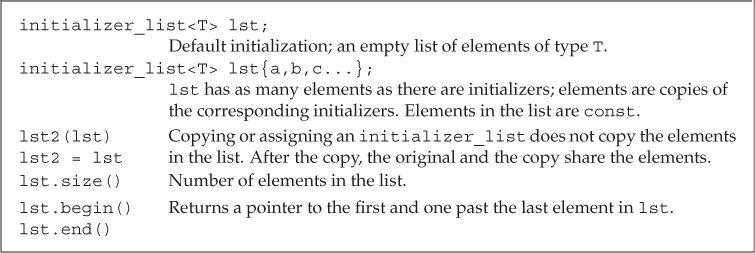

拷贝或赋值一个`initializer_list`对象不会拷贝列表中的元素。拷贝后，原始列表和副本共享元素。

类似vector，initializer_list 也是一种模板类型，定义时必须说明列表中所含元素的类型。

```c++
initializer_list<string> ls;
initializer_list<int> li;
```

不同于`vector`，`initializer_list`对象中的元素永远是常量值。无法改变initializer_list对象中元素的值。

如果想向`initializer_list`形参传递一个值的序列，则必须把序列放在一对花括号内。

```c++
if (expected != actual)
    error_msg(ErrCode(42), {"functionX", expected, actual});
else
    error_msg(ErrCode(0), {"functionX", "okay"});
```

因为`initializer_list`包含`begin`和`end`成员，所以可以使用范围`for`循环处理其中的元素。

##### 省略符形参

省略符形参是为了便于C++程序访问某些特殊的C代码而设置的，这些代码使用了名为`varargs`的C标准库功能。通常，省略符形参不应该用于其他目的。

省略符形参应该仅仅用于C和C++通用的类型，大多数类类型的对象在传递给省略符形参时都无法正确拷贝。

省略符形参只能出现在形参列表的最后一个位置。它的形式无外乎两种。

```c++
void foo (para_list,...);
void foo (...)
```

第一种形式指定了foo函数的部分形参的类型，对应于这些形参的实参将会执行正常的类型检查。形参后面的逗号 可选。

省略符形参对应的实参无须类型检查。

##### C++ 中 省略符形参示例

```c++
#include<cstdarg>
#include<iostream>
using namespace std;

int add(int pre,...)  
//求和函数
{
    va_list arg_ptr;
    int sum=0;
    int nArgValue;
    sum+=pre;
    va_start(arg_ptr,pre);
    do
    {
        nArgValue=va_arg(arg_ptr,int);
        sum+=nArgValue;       
    }while(nArgValue!=0);   
//自定义结束条件是输入参数为0
   va_end(arg_ptr);
    return sum;
}
int main()
{
   cout<<add(1,2,3,0)<<endl;  
//必须以0结尾，因为参数列表结束的判断条件是读到0停止
   return 0;
}
```

##### C中省略符形参示例

> 注意：省略号的优先级别最低，所以在函数解析时，只有当其它所有的函数都无法调用时，编译器才会考虑调用省略号函数的。
>
> （以下C语言的代码来解释）
>
> #include <stdio.h>
>
> #include <stdarg.h>
>
> void Function(const char *str, … )
> {
>      va_list ap;
>
> ```c
>  int n = 3;
> 
>  char *a = NULL;
> 
> int b = 0;
> 
>  double c = 0.0;
> 
>  va_start(ap, str); // 注意！这里第二个参数是本函数的第一个形参
> 
>  a = va_arg(ap, char*);
> 
>  b = va_arg(ap, int);
> 
>  c = va_arg(ap, double);
>  // 浮点最好用double类型，而不要用float类型；否则数据会有问题
> 
>  va_end(ap);
> 
>  printf("%s is %s %d, %f", str, a, b, c);
> ```
> }
>
> void main()
> {
>        Function(“Hello”, “world”, 1, 3.14);
> }
>
> 对于void Function(const char *str, …)：
>
> 1、处理不定参数的函数要包含头文件：#include <stdarg.h>
> 然后在处理不定参数的函数中先定义一个参数列表变量：va_list ap。
>
> 2、确定不定参数所在的位置。在这里，第一个参数为str，因此要从第二个参数进行获取参数列表。va_start(ap, str);表示在str参数之后获取参数。由于C调用是从右到左依次将参数压入堆栈的，因此处理起来比较容易。
>
> 3、获取参数并指明类型，如：va_arg(ap, char*);获取第一个参数，并指明类型为char* 。
> 在main()函数中就对应着实参"world"；va_arg(ap, int);紧接着再取一个参数，并指明类型为int，对应main()函数中的实参1；va_arg(ap, double);再接着取第三个参数，并指明类型为double，对应main()中的实参3.14。
>
> 4、最后注意要有va_end(ap)。
> ————————————————
> 版权声明：本文为CSDN博主「outsiderJT」的原创文章，遵循CC 4.0 BY-SA版权协议，转载请附上原文出处链接及本声明。
> 原文链接：https://blog.csdn.net/weixin_45781313/article/details/105547263

### 6.3 Return Types and the return Statement

`return`语句有两种形式，作用是终止当前正在执行的函数并返回到调用该函数的地方。

```c++
return;
return expression;
```

#### 6.3.1 Functions with No Return Value

没有返回值的`return`语句只能用在返回类型是`void`的函数中。返回`void`的函数可以省略`return`语句，因为在这类函数的最后一条语句后面会隐式地执行`return`。

通常情况下，如果`void`函数想在其中间位置提前退出，可以使用`return`语句。

一个返回类型是`void`的函数也能使用`return`语句的第二种形式，不过此时`return`语句的`expression`必须是另一个返回`void`的函数。

强行令`void`函数返回其他类型的表达式将产生编译错误。

#### 6.3.2 Functions That Return a Value

`return`语句的第二种形式提供了函数的结果。只要函数的返回类型不是`void`，该函数内的每条`return`语句就必须返回一个值，并且返回值的类型必须与函数的返回类型相同，或者能隐式地转换成函数的返回类型（`main`函数例外）。

（C++ 无法检查返回结果的正确性，但是可以检查返回类型是否正确）

**在含有`return`语句的循环后面应该也有一条`return`语句，否则程序就是错误的，但很多编译器无法发现此错误。**


##### 值是如何被返回的？

函数返回一个值的方式和初始化一个变量或形参的方式完全一样：返回的值用于初始化调用点的一个临时量，该临时量就是函数调用的结果。

如果函数返回引用类型，则该引用仅仅是它所引用对象的一个别名。

##### 不要返回局部对象的引用或指针

函数不应该返回局部对象的指针或引用，因为一旦函数完成，局部对象将被释放。指针将指向一个不存在的对象。

```c++
// disaster: this function returns a reference to a local object
const string &manip()
{
    string ret;
    // transform ret in some way
    if (!ret.empty())
        return ret;   // WRONG: returning a reference to a local object!
    else
        return "Empty";   // WRONG: "Empty" is a local temporary string
}
```

##### 返回类类型的函数和调用运算符

如果函数返回指针、引用或类的对象，则可以使用函数调用的结果访问结果对象的成员。

##### 引用返回左值

调用一个返回引用的函数会得到左值，其他返回类型得到右值。

##### 列表初始化返回值

C++11规定，函数可以返回用花括号包围的值的列表。同其他返回类型一样，列表也用于初始化表示函数调用结果的临时量。如果列表为空，临时量执行值**初始化**；否则返回的值由函数的返回类型决定。

- 如果函数返回内置类型，则列表内最多包含一个值，且该值所占空间不应该大于目标类型的空间。

- 如果函数返回类类型，由类本身定义初始值如何使用。

  ```c++
  vector<string> process()
  {
      // . . .
      // expected and actual are strings
      if (expected.empty())
          return {};  // return an empty vector
      else if (expected == actual)
          return {"functionX", "okay"};  // return list-initialized vector
      else
          return {"functionX", expected, actual};
  }
  ```

##### 主函数main的返回值

`main`函数可以没有`return`语句直接结束。如果控制流到达了`main`函数的结尾处并且没有`return`语句，编译器会隐式地插入一条返回0的`return`语句。

`main`函数的返回值可以看作是状态指示器。返回0表示执行成功，返回其他值表示执行失败，其中非0值的具体含义依机器而定。

为了使`main`函数的返回值与机器无关，头文件`cstdlib`定义了`EXIT_SUCCESS`和`EXIT_FAILURE`这两个预处理变量，分别表示执行成功和失败。

```c++
int main()
{
    if (some_failure)
        return EXIT_FAILURE; // defined in cstdlib
    else
        return EXIT_SUCCESS; // defined in cstdlib
}
```

建议使用预处理变量`EXIT_SUCCESS`和`EXIT_FAILURE`表示`main`函数的执行结果。

##### 递归

如果一个函数调用了它自身，不管这种调用是直接的还是间接的，都称该函数为递归函数（recursive function）。

```c++
// calculate val!, which is 1 * 2 * 3 . . . * val
int factorial(int val)
{
    if (val > 1)
        return factorial(val-1) * val;
    return 1;
}
```

在递归函数中，一定有某条路径是不包含递归调用的，否则函数会一直递归下去，直到程序栈空间耗尽为止。

相对于循环迭代，递归的效率较低。但在某些情况下使用递归可以增加代码的可读性。循环迭代适合处理线性问题（如链表，每个节点有唯一前驱、唯一后继），而递归适合处理非线性问题（如树，每个节点的前驱、后继不唯一）。

`main`函数不能调用它自身。

#### 6.3.3 Returning a Pointer to an Array

因为数组不能被拷贝(https://blog.csdn.net/weixin_45756796/article/details/104755556),所以函数不能返回数组，但可以返回数组的指针或引用。

语法上来说，定义一个返回数组的指针或引用的函数比较繁琐，但是有些方法可以简化这一任务。最直接的方法就是使用类型别名。

```c++
typedef int arrT[0];
using arrT = int[10];
arrT* fun (int i); 	//函数声明 -- func 返回一个指向含有10个整数的数组的指针。
```


##### 声明一个返回数组指针的函数

如果想在声明是不使用类型别名，那么必须牢记被定义的名字后面数组的维度。

返回数组指针的函数形式如下：

```c++
Type (*function(parameter_list))[dimension]
```

其中`Type`表示元素类型，`dimension`表示数组大小，`(*function(parameter_list))`两端的括号必须存在。类似`int (*p2)[10] = &arr;` 定义了一个指向含有10个整数的数组的指针。

##### 使用尾置返回类型

C++11允许使用尾置返回类型（trailing return type）简化复杂函数声明。尾置返回类型跟在形参列表后面，并以一个`->`符号开头。为了表示函数真正的返回类型在形参列表之后，需要在本应出现返回类型的地方添加`auto`关键字。

```c++
// fcn takes an int argument and returns a pointer to an array of ten ints
auto func(int i) -> int(*)[10];
```

任何函数的定义都能使用尾置返回类型，但是这种形式更适用于返回类型比较复杂的函数。

##### 使用decltype

如果我们知道函数返回的指针将指向哪个数组，就可以使用`decltype`关键字声明返回类型。但`decltype`并不会把数组类型转换成指针类型，所以还要在函数声明中添加一个`*`符号。

```c++
int odd[] = {1,3,5,7,9};
int even[] = {0,2,4,6,8};
// returns a pointer to an array of five int elements
decltype(odd) *arrPtr(int i)
{
    return (i % 2) ? &odd : &even;  // returns a pointer to the array
}
```


### 6.4 Overloaded Functions

同一作用域内的几个名字相同但形参列表不同的函数叫做重载函数。编译器根据传递的实参类型推断想使用的是哪个参数。

`main`函数不能重载。

##### 定义重载函数

重载的函数，应该在形参数量或形参类型上有所不同。不允许两个函数除了返回类型以外的其他所有要素都相同。

##### 判断两个形参类型是否相异

省略 某个形参名字，或者类型看似不同实际是别名，都不能说他们类型相异。

##### 重载与const形参

如【6.2.3】提到的，顶层`const`不影响传入函数的对象，一个拥有顶层`const`的形参无法和另一个没有顶层`const`的形参区分开来。

```c++
Record lookup(Phone);
Record lookup(const Phone);  // redeclares Record lookup(Phone)
Record lookup(Phone*);
Record lookup(Phone* const); // redeclares Record lookup(Phone*)
```

如果形参是某种类型的指针或引用，则通过区分其指向的对象是常量还是非常量可以实现函数重载，此时的`const`是底层的（指向对象是常量）。当我们传递给重载函数一个非常量对象或者指向非常量对象的指针时，编译器会优先选用非常量版本的函数。

```c++
// functions taking const and nonconst references or pointers have different parameters
// declarations for four independent, overloaded functions
Record lookup(Account&);        // function that takes a reference to Account
Record lookup(const Account&);  // new function that takes a const reference
Record lookup(Account*);        // new function, takes a pointer to Account
Record lookup(const Account*);  // new function, takes a pointer to const
```

##### const_cast 和重载

【4.11.3】提到`const_cast`可以用于函数的重载。当函数的实参不是常量时，将得到普通引用。

`const_cast`可以擦写对象的底层const性质。

这个版本的函数中， 首先将实参强制转换成对const的引用，然后调用了`shortString`函数的const版本，const版本返回对`const string`的引用，这个引用实际上绑定在某个初始的非常量实参上，因此我们可以将其转换回一个普通的`string&`

，这是安全的。

```c++
// return a reference to the shorter of two strings
const string &shorterString(const string &s1, const string &s2)
{
    return s1.size() <= s2.size() ? s1 : s2;
}

string &shorterString(string &s1, string &s2)
{
    auto &r = shorterString(const_cast<const string&>(s1),
                    const_cast<const string&>(s2));
    return const_cast<string&>(r);
}
```

##### 调用重载的函数

函数匹配（function matching）也叫做重载确定（overload resolution），是指编译器将函数调用与一组重载函数中的某一个进行关联的过程。

调用重载函数时有三种可能的结果：

- 编译器找到一个与实参最佳匹配（best match）的函数，并生成调用该函数的代码。

- 编译器找不到任何一个函数与实参匹配，发出无匹配（no match）的错误信息。

- 有一个以上的函数与实参匹配，但每一个都不是明显的最佳选择，此时编译器发出二义性调用（ambiguous call）的错误信息。

#### 6.4.1 Overloading and Scope

在不同的作用域中无法重载函数名。**一旦在当前作用域内找到了所需的名字，编译器就会忽略掉外层作用域中的同名实体。**

```c++
string read();
void print(const string &);
void print(double);     // overloads the print function
void fooBar(int ival)
{
    bool read = false;  // new scope: hides the outer declaration of read
    string s = read();  // error: read is a bool variable, not a function
    // bad practice: usually it's a bad idea to declare functions at local scope
    void print(int);    // new scope: hides previous instances of print
    print("Value: ");   // error: print(const string &) is hidden
    print(ival);    // ok: print(int) is visible
    print(3.14);    // ok: calls print(int); print(double) is hidden
}
```

在C++中，名字查找发生在类型检查之前。

### 6.5 Features for Specialized Uses

#### 6.5.1 Default Arguments

默认实参作为形参的初始值出现在形参列表中。可以为一个或多个形参定义默认值。

**不过一旦某个形参被赋予了默认值，它后面的所有形参都必须有默认值。**

```c++
typedef string::size_type sz;
string screen(sz ht = 24, sz wid = 80, char backgrnd = ' ');
```

##### 使用默认实参调用函数

调用含有默认实参的函数时，可以包含该实参，也可以省略该实参。

如果想使用默认实参，只要在调用函数的时候省略该实参即可。

虽然多次声明同一个函数是合法的，但是在给定的作用域中一个形参只能被赋予一次默认实参。函数的后续声明只能为之前那些没有默认值的形参添加默认实参，而且该形参右侧的所有形参必须都有默认值。

```c++
// no default for the height or width parameters
string screen(sz, sz, char = ' ');
string screen(sz, sz, char = '*');      // error: redeclaration
string screen(sz = 24, sz = 80, char);  // ok: adds default
```

##### 默认实参声明

默认实参只能出现在函数声明和定义其中一处。通常应该在函数声明中指定默认实参，并将声明放在合适的头文件中。

```c++
// 函数声明
void fun(int n);

int main()
{
    // Error: 编译器向前查找函数声明
    //        fun调用形式与声明不符
    fun();
    return EXIT_SUCCESS;
}

// 函数定义
void fun(int n = 0) { /*...*/ }
```

##### 默认参数初始值

局部变量不能作为函数的默认实参。

用作默认实参的名字在函数声明所在的作用域内解析，但名字的求值过程发生在函数调用时。

```c++
// the declarations of wd, def, and ht must appear outside a function
sz wd = 80;
char def = ' ';
sz ht();
string screen(sz = ht(), sz = wd, char = def);
string window = screen();   // calls screen(ht(), 80, ' ')

void f2()
{
    def = '*';      // changes the value of a default argument
    sz wd = 100;    // hides the outer definition of wd but does not change the
    default
    window = screen();  // calls screen(ht(), 80, '*')
}
```


#### 6.5.2 Inline and constexpr Functions 内联函数和常量表达式函数

操作定义为函数又很多好处

- 阅读和理解函数调用比读懂等价的条件表达式容易的多。
- 使用函数可以确保行为的统一，每次相关操作都能保证按照同样的方式进行。
- 如果我们需要修改计算过程，显然修改函数要比先找到等价表达式所以出现的地方再逐一修改更容易。
- 函数可以被其他应用重复利用，省去了程序员重新编写的代价。

##### 内联函数可避免函数调用的开销

​	将函数指定为内联函数，会在每个调用点上“内联地”展开，省去函数调用所需的一系列工作。定义内联函数时需要在函数的返回类型前添加关键字`inline`。

```c++
// inline version: find the shorter of two strings
inline const string &
shorterString(const string &s1, const string &s2)
{
    return s1.size() <= s2.size() ? s1 : s2;
}
```

在函数声明和定义中都能使用关键字`inline`，但是建议只在函数定义时使用。

内联说明只是向编译器发出的一个请求，编译器可以选择忽略这个请求。

一般来说，内联机制适用于优化规模较小、流程直接、调用频繁的函数。内联函数中不允许有循环语句和`switch`语句，否则函数会被编译为普通函数。

##### constexpr函数

`constexpr`函数是指能用于常量表达式的函数。

`constexpr`函数的返回类型及所有形参的类型都得是**字面值类型**。另外C++11标准要求`constexpr`函数体中必须有且只有一条`return`语句，但是此限制在C++14标准中被删除。

```c++
constexpr int new_sz()
{
    return 42;
}

constexpr int foo = new_sz();   // ok: foo is a constant expression
```

`constexpr`函数的返回值未必是常量表达式。

```c++
// scale(arg) is a constant expression if arg is a constant expression
constexpr size_t scale(size_t cnt)
{
    return new_sz() * cnt;
}

int arr[scale(2)];  // ok: scale(2) is a constant expression
int i = 2;          // i is not a constant expression
int a2[scale(i)];   // error: scale(i) is not a constant expression
```

`constexpr`函数被隐式地指定为内联函数。

和其他函数不同，内联函数和`constexpr`函数可以在程序中多次定义。因为在编译过程中，编译器需要函数的定义来随时展开函数。对于某个给定的内联函数或`constexpr`函数，它的多个定义必须完全一致。因此内联函数和`constexpr`函数通常定义在头文件中。

#### 6.5.3 Aids for Debugging

##### assert 预处理宏

assert 定义在 cassert头文件中，预处理名字有预处理器管理而非编译器，所以我们可以直接使用预处理名字而无需提供`using `声明。

要注意宏名字的唯一。

assert 宏常用于检查“不能发生”的条件。

```c++
assert(word.size() > threshold);
```

##### NDEBUG 预处理变量

assert 行为依赖于一个名为NDEBUG 的预处理变量的状态。如果定义了NDEBUG，则assert什么也不做。默认状态下没有定义NDEBUG，此时assert将执行运行时检查。

定义NDEBUG 能避免检查各种条件所需的运行时开销，当然此时根本就不会执行运行时检查，因此assert应该仅用于检验那些确实不可能发生的事情，仅仅起到调试程序的辅助作用，无法代替真正运行时的逻辑检查。

|  变量名称  |     内容     |
| :--------: | :----------: |
| `__func__` | 当前函数名称 |
| `__FILE__` | 当前文件名称 |
| `__LINE__` |   当前行号   |
| `__TIME__` | 文件编译时间 |
| `__DATE__` | 文件编译日期 |

### 6.6 Function Matching

##### 寻找最佳匹配

函数实参类型与形参类型越接近，它们匹配得越好。

重载函数集中的函数称为候选函数（candidate function）。

可行函数（viable function）的形参数量与函数调用所提供的实参数量相等，并且每个实参的类型与对应的形参类型相同，或者能转换成形参的类型。

调用重载函数时应该尽量避免强制类型转换。如果实际操作中使用了，那么说明我们设计的形参集合不合理。

#### 6.6.1 Argument Type Conversions

为了确定最佳匹配，编译器将实参类型到形参类型的转换划分为几个类型。

1. 精确匹配
   - 实参类型和形参类型相同
   - 实参从数组类型或函数类型转换成对应的指针类型【6.7 - 函数指针】
   - 向实参添加顶层const或者从实参中删除顶层const
2. 通过const转换【4.11.2】实现的匹配（非常量变成常量）
3. 通过类型提升【4.11.1】实现的匹配
4. 通过算术类型转换【4.11.1】或指针转换【4.11.2】实现的匹配
5. 通过类类型转换实现的匹配【14.9】

所有算术类型转换的级别都一样。int->unsigned int 并不比int -> double 高。

```c++
void manip(long);
void manip(float);
manip(3.14) // error 二义性调用
```

##### 函数匹配和const实参

如果重载函数的区别在于它们的引用或指针类型的形参是否含有底层`const`，则调用发生时编译器通过实参是否是常量来决定函数的版本。

```c++
Record lookup(Account&);    // function that takes a reference to Account
Record lookup(const Account&);  // new function that takes a const reference

const Account a;
Account b;
lookup(a);  // calls lookup(const Account&)
lookup(b);  // calls lookup(Account&)
```

### 6.7 Pointers to Functions

函数指针指向某种特定类型，函数的类型由它的返回类型和形参类型共同决定。与函数名无关。

##### 使用函数指针

要想声明一个可以指向某种函数的指针，只需要用指针替换函数名称即可。

```c++
// compares lengths of two strings
bool lengthCompare(const string &, const string &);
// pf points to a function returning bool that takes two const string references
bool (*pf)(const string &, const string &); // uninitialized
```

可以直接使用指向函数的指针来调用函数，无须提前解引用指针。

```c++
pf = lengthCompare; // pf now points to the function named lengthCompare
pf = &lengthCompare; // equivalent assignment: address-of operator is optional
// 以上两个是等价的。
bool b1 = pf("hello", "goodbye");       // calls lengthCompare
bool b2 = (*pf)("hello", "goodbye");    // equivalent call
bool b3 = lengthCompare("hello", "goodbye");    // equivalent call
```

##### 重载函数的指针

对于重载函数，编译器通过指针类型决定函数版本，指针类型必须与重载函数中的某一个精确匹配（返回值和形参列表都要匹配的上）。

```c++
void ff(int*);
void ff(unsigned int);
void (*pf1)(unsigned int) = ff; // pf1 points to ff(unsigned)
```

##### 函数指针形参

可以把函数的形参定义成指向函数的指针。

**调用时允许直接把函数名当作实参使用，它会自动转换成指针。**

```c++
// third parameter is a function type and is automatically treated as a pointer to function
void useBigger(const string &s1, const string &s2, bool pf(const string &, const string &));
// equivalent declaration: explicitly define the parameter as a pointer to function
void useBigger(const string &s1, const string &s2, bool (*pf)(const string &, const string &));
//以上两个等价
// automatically converts the function lengthCompare to a pointer to function
useBigger(s1, s2, lengthCompare);
```

直接使用函数指针类型显得冗长易错，所以可以使用类型别名和decltype进行简化

关键字`decltype`作用于函数时，返回的是函数类型，而不是函数指针类型。所以只有在结果前面加上*才能得到指针。

```c++
bool lengthCompare(const string &, const string &);
typedef bool Func(const string &, const string &);
typedef decltype(lengthCompare) Func2;
//Func Func2 是函数类型
typedef bool(*FuncP)(const string &, const string &);
typedef decltype(lengthCompare) *FuncP2;
//FuncP FuncP2 是函数指针
```

```c++
void useBigger(const string &, const string &,Func);
void useBigger(const string &, const string &, FuncP2);
//以上两个等价，因为编译器自动地将Func转化为指针。
```

##### 返回指向函数的指针

和数组类似，不能返回一个函数，但是可以返回指向函数的指针。

但返回类型不会像函数类型的形参一样自动地转换成指针，必须显式地将其指定为指针类型。类似的，想要声明一个返回函数指针的函数，最简单的方法就是使用类型别名。

```c++
using F = int(int*, int);		//函数类型
using PF = int(*)(int*, int);	//函数指针

PF f1(int);		//正确，PF是指向函数的指针，f1返回一个函数指针
F f1(int);		//错误，F是函数类型，f1不能返回一个函数
F *f1(int);		//正确，显式指定返回类型是函数指针
```

如果不用类型别名，也可以直接这样直接声明f1

```c++
  int (*f1(int))(int*,int);
```

从内向外阅读：f1有形参列表，f1是个函数，f1前面有*，所以f1返回一个指针，指针的类型也有形参列表，因此指针指向函数，函数返回类型为int。

考虑到完整性，我们也可以使用尾置返回类型【6.3.3】

```c++
 auto f1(int) -> int(*)(int*, int);
```


##### 将auto、decltype用于函数指针类型

如果明确知道返回的函数是哪一个，那么就能用`decltype`简化书写函数指针返回类型的过程。

比如两个函数，返回类型相同，形参相同，那么我们可以编写第三个函数，接受一个string类型的参数，返回一个指针，指向前两个函数中的一个。

```c++
string::size_type sumLength(const string&, const string&);
string::size_type largerLength(const string&, const string&);
decltype(sumLength) *getFcn(const string &);
```


### Chapter Summary 

​	函数是命名了的计算单元，它对程序的结构化至关重要。每个函数都包含返回类型、名字、（可能为空的）形参列表以及函数体。

​	函数体是一个块，当函数被调用的时候执行该块的内容。此时，传递给函数的实参类型必须与对应的形参类型相容。

​	在C++语言中，函数可以被重载：同一个名字可用于定义多个函数，只要这些函数的形参数量或形参类型不同就行。根据调用时所使用的实参，编译器可以自动地选定被调用的函数。从一组重载函数中选取最佳函数的过程称为函数匹配。

### Defined Terms

| 中文         | 英文                  | 含义                                                         |
| ------------ | --------------------- | ------------------------------------------------------------ |
| 自动对象     | automatic object      | 仅存在于函数执行过程中的对象，当程序的控制流经过此类对象的定义语句是，创建该对象。当到达了定义所在块的末尾时，销毁该对象。 |
| 函数原型     | function prototype    | 函数的声明，包含函数名字、韩慧类型和形参类型。想要调用某函数，在调用点之前必须声明该函数的原型。 |
|              | initializer_list      | 是一个标准类，表达的是一组花括号包围的类型相同的对象，对象之间以逗号隔开。 |
| 重载确定     | overloaded resolution | 同函数匹配，编译器解析重载函数调用的过程，在此过程中，实参与每个重载函数的形参列表逐一比较。 |
| 尾置返回类型 | trailing return type  | 在参数列表后面指定返回类型【6.3.3】                          |
|              |                       |                                                              |
|              |                       |                                                              |


## Chapter 7 Classes 类

类的基本思想是**数据抽象（data abstraction）**和**封装（encapsulation）**。

- 数据抽象是一种依赖于**接口（interface）**和实现**（implementation）**分离的编程及设计技术。
  - 类的接口包括用户所能执行的操作；类的实现包括类的数据成员、负责接口实现的函数体以及其他私有函数。
- 封装实现了类的接口和实现的分离。封装后的类隐藏了它的实现细节，也就是说，类的用户只能使用接口而无法访问实现部分。

类想要实现数据抽象和封装，需要首先定义一个**抽象数据类型（abstract data type）**。

### 7.1 Defining Abstract Data Types

封装（隐藏）

#### 7.1.1 Designing the Sales_data Class

类的用户是程序员，而非应用程序的最终使用者。

#### 7.1.2 Defining the Revised Sales_data Class

##### 定义成员函数

成员函数（member function）的声明必须在类的内部，定义则既可以在类的内部也可以在类的外部。定义在类内部的函数是隐式的内联函数。

```c++
struct Sales_data
{
    // new members: operations on Sales_data objects
    std::string isbn() const { return bookNo; }
    Sales_data& combine(const Sales_data&);
    double avg_price() const;

    // data members
    std::string bookNo;
    unsigned units_sold = 0;
    double revenue = 0.0;
};
```

##### 引入this

成员函数通过一个名为`this`的隐式额外参数来访问调用它的对象。`this`参数是一个常量指针，被初始化为调用该函数的对象地址。在函数体内可以显式使用`this`指针。

```c++
total.isbn()
// pseudo-code illustration of how a call to a member function is translated
Sales_data::isbn(&total)

std::string isbn() const { return this->bookNo; }
std::string isbn() const { return bookNo; }
```

##### 引入const成员函数

默认情况下，`this`的类型是指向类类型非常量版本的常量指针 `类 *const`。

> 因为this总指向这个对象，所以this是一个常量指针（*const），不允许改变this中保存的地址！

`this`也遵循初始化规则，即"想存放常量对象的地址，只能使用指向常量的指针"。

所以按照该规则，默认生成的`this`不能绑定到一个常量对象上，即不能在常量对象上调用普通的成员函数。这就不能符合要求。

如果this 是个普通的指针，那么就该声明this 为`const 类 *const`类型，但是由于this是隐式的，所以C++允许在成员函数的参数列表后面添加关键字`const`，表示`this`是一个指向常量的指针`const 类 *const`，使用关键字`const`的成员函数被称作常量成员函数（const member function）。

```c++
std::string Sales_data::isbn() const { return bookNo};

// pseudo-code伪代码 illustration of how the implicit this pointer is used
// this code is illegal: we may not explicitly define the this pointer ourselves
// note that this is a pointer to const because isbn is a const member
std::string Sales_data::isbn(const Sales_data *const this)
{
    return this->isbn;
}
```

常量对象和指向常量对象的引用或指针都只能调用常量成员函数。

##### 类作用域和成员函数

类本身就是一个作用域，成员函数的定义嵌套在类的作用域之内。编译器处理类时，会先编译成员声明，再编译成员函数体（如果有的话），因此成员函数可以随意使用类的其他成员而无须在意这些成员的出现顺序。

##### 在类的外部定义成员函数

在类的外部定义成员函数时，成员函数的定义必须与它的声明相匹配。如果成员函数被声明为常量成员函数，那么它的定义也必须在参数列表后面指定`const`属性。同时，类外部定义的成员名字必须包含它所属的类名。

```c++
double Sales_data::avg_price() const
{
    if (units_sold)
        return revenue / units_sold;
    else
        return 0;
}
```

##### 定义返回this对象的函数

combine类似于`+=`。

```c++
Sales_data& Sales_data::combine(const Sales_data &rhs)
{
    units_sold += rhs.units_sold;   // add the members of rhs into
    revenue += rhs.revenue;     // the members of 'this' object
    return *this;       // return the object on which the function was called
}
```

比如调用`total.combine(trans)`，那么total这个对象的地址就被绑定到隐式的this参数上。rhs被绑定到trans上。因为返回类型是Sales_data&，所以我们把调用函数的对象(total)作为一个整体来访问，return 语句解引用this指针以获得执行该函数的对象。即返回total 的引用。


> ```c++
> class Test
> {
>  public: 
>     Test()
>     { 
>       return this;  //返回的当前对象的地址
>     }
>     Test&()
>     { 
>       return *this;  //返回的是当前对象本身 
>     }
>     Test()
>     { 
>       return *this;   //返回的当前对象的克隆
>     }
>  private:  //...
> };
> ```
>
> `this`是类自带的指针，指代的是对象本身。`*this`对指针[解引用](https://so.csdn.net/so/search?q=解引用&spm=1001.2101.3001.7020)，因此使用`*this`返回的就是一个对象本身。这样的操作可以满足连续的= (赋值操作)。
>
> return *this返回的是当前对象的克隆或者本身（若返回类型为A， 则是拷贝， 若返回类型为A&， 则是本身 ）。return this返回当前对象的地址（指向当前对象的指针）
>
> Watch out that if you try to use `return *this;` on a function whose return type is `Type` and not `Type&`, C++ will try to make a copy of the object and then immediately call the destructor, usually not the intended behaviour. So the return type should be a reference as in your example.

~~todo~~，这边还需要研究一下，为什么不是引用的返回类型会返回拷贝并立即析构

> 解释：
>
> 【6.3.2 】
>
> 返回值和初始化一个变量或形参是一样的。函数会返回对象的副本。
>
> 函数返回引用，那么该引用只是它所引对象的一个别名，调用和返回时不会发生拷贝。

#### 7.1.3 Defining Nonmember Class-Related Functions

类的作者通常会定义一些辅助函数，尽管这些函数从概念上来说属于类接口的组成部分，但实际上它们并不属于类本身。

```c++
// input transactions contain ISBN, number of copies sold, and sales price
istream &read(istream &is, Sales_data &item)
{
    double price = 0;
    is >> item.bookNo >> item.units_sold >> price;
    item.revenue = price * item.units_sold;
    return is;
}

ostream &print(ostream &os, const Sales_data &item)
{
    os << item.isbn() << " " << item.units_sold << " "
        << item.revenue << " " << item.avg_price();
    return os;
}
```

如果非成员函数是类接口的组成部分，则这些函数的声明应该与类放在同一个头文件中。

一般来说，执行输出任务的函数应该尽量减少对格式的控制。

#### 7.1.4 Constructors 构造函数

类通过一个或几个特殊的成员函数来控制其对象的初始化操作，这些函数被称作构造函数。只要类的对象被创建，就会执行构造函数。【7.5】【15.7】【18.1.3】【13】

构造函数的名字和类名相同，没有返回类型，可以重载。

不同于其他成员函数，构造函数不能被声明为`const`，当我们创建类的一个对象时，知道构造函数完成初始化过程，对象才能真正取得其“常量”属性。构造函数在`const`对象的构造过程中可以向其写值。

```c++
struct Sales_data
{
    // constructors added
    Sales_data() = default;
    Sales_data(const std::string &s): bookNo(s) { }
    Sales_data(const std::string &s, unsigned n, double p):
        bookNo(s), units_sold(n), revenue(p*n) { }
    Sales_data(std::istream &);
    // other members as before
};
```

##### 合成构造函数（synthesized default constructor）

类通过默认构造函数（default constructor）来控制默认初始化过程，默认构造函数无须任何实参。

如果类没有显式地定义构造函数，则编译器会为类隐式地定义一个默认构造函数，该构造函数也被称为合成的默认构造函数（synthesized default constructor）。对于大多数类来说，合成的默认构造函数初始化数据成员的规则如下：

- 如果存在类内初始值，则用它来初始化成员。

- 否则默认初始化该成员。

##### 某些类不能依赖于合成的默认构造函数。

合成的默认构造函数只适合非常简单的类。对于普通的类，必须dingi定义自己的默认构造函数。

- 只有当类没有声明任何构造函数时，编译器才会自动生成默认构造函数。一旦类定义了其他构造函数，那么除非再显式地定义一个默认的构造函数，否则类将没有默认构造函数。
- 如果类包含内置类型或者复合类型的成员，则只有当这些成员全部存在类内初始值时，这个类才适合使用合成的默认构造函数。否则用户在创建类的对象时就可能得到**未定义的值。**
- 编译器不能为某些类合成默认构造函数。例如类中包含一个其他类类型的成员，且该类型没有默认构造函数，那么编译器将无法初始化该成员。

##### `=default` 的含意

在C++11中，如果类需要默认的函数行为，可以通过在参数列表后面添加`=default`来要求编译器生成构造函数。其中`=default`既可以和函数声明一起出现在类的内部，也可以作为定义出现在类的外部。和其他函数一样，如果`=default`在类的内部，则默认构造函数是内联的。

```c++
Sales_data() = default;
```

如果编译器不支持类内初始值，那么默认构造函数就得使用构造函数初始值列表。

##### 构造函数初始值列表

构造函数初始值列表（constructor initializer list）负责为新创建对象的一个或几个数据成员赋初始值。形式是每个成员名字后面紧跟括号括起来的（或者在花括号内的）成员初始值，不同成员的初始值通过逗号分隔。

```c++
Sales_data(const std::string &s): bookNo(s) { }
Sales_data(const std::string &s, unsigned n, double p):
    bookNo(s), units_sold(n), revenue(p*n) { }
```

当某个数据成员被构造函数初始值列表忽略时，它会以与合成默认构造函数相同的方式隐式初始化。

```c++
// has the same behavior as the original constructor defined above
Sales_data(const std::string &s):
    bookNo(s), units_sold(0), revenue(0) { }
```

构造函数不应该轻易覆盖掉类内初始值，除非新值与原值不同。如果编译器不支持类内初始值，则所有构造函数都应该显式初始化每个内置类型的成员。

##### 在类的外部定义构造函数

```c++
#include<iostream>
using namesapce std;
int main(void) {
	class A
	{
	public:
		A();//声明构造函数
	};
	A::A()//定义构造函数
	{
	};
	return 0;
}
//在类内声明构造函数，在类的外面定义构造函数，
//这种方式有的编译器能通过，有的编译器不能通过
————————————————
版权声明：本文为CSDN博主「atohome」的原创文章，遵循CC 4.0 BY-SA版权协议，转载请附上原文出处链接及本声明。
原文链接：https://blog.csdn.net/qq_45812941/article/details/107883716
```


#### 7.1.5 Copy, Assignment, and Destruction

对象在几种情况下会被拷贝：

- 初始化变量【6.2.1】
- 以值的方式传递或返回一个对象【6.3.2】

##### 某些类不能依赖于合成的版本

编译器能合成拷贝、赋值和析构函数，但是对于某些类来说合成的版本无法正常工作。特别是当类需要分配类对象之外的资源时，合成的版本通常会失效。例如【12】分配和管理动态内存【13.1.4】管理动态内存的类通常不能依赖于上述操作的合成版本。

### 7.2 Access Control and Encapsulation

使用访问说明符（access specifier）可以加强类的封装性：

- 定义在`public`说明符之后的成员在整个程序内都可以被访问。`public`成员定义类的接口。

- 定义在`private`说明符之后的成员可以被类的成员函数访问，但是不能被使用该类的代码访问。`private`部分封装了类的实现细节。

```c++
class Sales_data
{
public: // access specifier added
    Sales_data() = default;
    Sales_data(const std::string &s, unsigned n, double p):
    bookNo(s), units_sold(n), revenue(p*n) { }
    Sales_data(const std::string &s): bookNo(s) { }
    Sales_data(std::istream&);
    std::string isbn() const { return bookNo; }
    Sales_data &combine(const Sales_data&);

private: // access specifier added
    double avg_price() const { return units_sold ? revenue/units_sold : 0; }
    std::string bookNo;
    unsigned units_sold = 0;
    double revenue = 0.0;
};
```

一个类可以包含零或多个访问说明符，每个访问说明符指定了接下来的成员的访问级别，其有效范围到出现下一个访问说明符或类的结尾处为止。

使用关键字`struct`定义类时，定义在第一个访问说明符之前的成员是`public`的；而使用关键字`class`时，这些成员是`private`的。二者唯一的区别就是默认访问权限不同。

#### 7.2.1 Friends 友元

类可以允许其他类或函数访问它的非公有成员，方法是使用关键字`friend`将其他类或函数声明为它的友元。

```C++
class Sales_data
{
    // friend declarations for nonmember Sales_data operations added
    friend Sales_data add(const Sales_data&, const Sales_data&);
    friend std::istream &read(std::istream&, Sales_data&);
    friend std::ostream &print(std::ostream&, const Sales_data&);

    // other members and access specifiers as before
public:
    Sales_data() = default;
    Sales_data(const std::string &s, unsigned n, double p):
    bookNo(s), units_sold(n), revenue(p*n) { }
    Sales_data(const std::string &s): bookNo(s) { }
    Sales_data(std::istream&);
    std::string isbn() const { return bookNo; }
    Sales_data &combine(const Sales_data&);

private:
    std::string bookNo;
    unsigned units_sold = 0;
    double revenue = 0.0;
};

// declarations for nonmember parts of the Sales_data interface
Sales_data add(const Sales_data&, const Sales_data&);
std::istream &read(std::istream&, Sales_data&);
std::ostream &print(std::ostream&, const Sales_data&);
```

友元声明只能出现在类定义的内部，具体位置不限。

友元不是类的成员，也不受它所在区域访问级别的约束。

通常情况下，最好在类定义开始或结束前的位置集中声明友元。

##### 封装的好处：

- 确保用户代码不会无意间破坏封装对象的状态。
- 被封装的类的具体实现细节可以随时改变，而无须调整用户级别的代码。

##### 友元的声明

友元声明仅仅指定了访问权限，而并非一个通常意义上的函数声明。如果希望类的用户能调用某个友元函数，就必须在友元声明之外再专门对函数进行一次声明（部分编译器没有该限制）。

为了使友元对类的用户可见，通常会把友元的声明（类的外部）与类本身放在同一个头文件中。

### 7.3 Additional Class Features

#### 7.3.1 Class Members Revisited

##### 定义一个类型成员

由类定义的类型名字和其他成员一样存在访问限制，可以是`public`或`private`中的一种。

```c++
class Screen
{
public:
    // alternative way to declare a type member using a type alias
    using pos = std::string::size_type;
    // other members as before
};
```

与普通成员不同，**用来定义类型的成员必须先定义后使用**【7.4.1】。类型成员通常位于类起始处。

##### 令成员作为内联函数

定义在类内部的成员函数是自动内联的。

如果需要显式声明内联成员函数，建议只在类外部定义的位置说明`inline`。

`inline`成员函数该与类定义在同一个头文件中。

##### 可变数据成员

使用关键字`mutable`可以声明可变数据成员（mutable data member）。可变数据成员永远不会是`const`的，即使它在`const`对象内。因此`const`成员函数可以修改可变成员的值。

```c++
class Screen
{
public:
    void some_member() const;
private:
    mutable size_t access_ctr;  // may change even in a const object
    // other members as before
};

void Screen::some_member() const
{
    ++access_ctr;   // keep a count of the calls to any member function
    // whatever other work this member needs to do
}
```

提供**类内初始值**时，必须使用`=`或花括号形式。

#### 7.3.2 Functions That Return *this

与【7.1.2】类似的，为了连续的左值调用，需要返回对象本身而不是副本拷贝，所以返回类型得是引用。

##### 从const成员函数返回*this

`const`成员函数如果以引用形式返回`*this`，则返回类型是常量引用。无法嵌入一组动作的序列中去。

```c++
Screen myScreen;
my Screen.display(cout).set('*');//如果display的const版本返回，会是常量引用，显然set函数无法set一个常量。
```

##### 基于const 的重载

通过区分成员函数是否为`const`的，可以对其进行重载。在常量对象上只能调用`const`版本的函数；在非常量对象上，尽管两个版本都能调用，但会选择非常量版本。

```c++
public:
    Screen &display(std::ostream &os) 
                  { do_display(os); return *this; }
    const Screen &display(std::ostream &os) const
                  { do_display(os); return *this; }
private:
     // function to do the work of displaying a Screen
     void do_display(std::ostream &os) const {os << contents;}
};
```

调用过程描述：

​	一个成员在调用另一个成员时，this指针在其中隐式地传递。

- display是非常量版本时，this指针将隐式地从执行非常量的指针转换成执行常量的指针【4.11.2】；do_display完成后，display函数各自`return *this`，非常量版本中，this指向一个非常量对象，因此display返回一个普通的非常量引用。
- 如果说const成员返回一个常量引用。

> ## const 在函数中的位置与作用
>
> ```c++
> const int fun(const int var) const;
> ```
>
> 1、 第一个const：函数的返回值是const。
>
> 此处返回const值,意思指返回的原函数里的变量的初值不能被修改,但是函数按值返回的这个变量被制成副本,能不能被修改就没有了意义,它可以被赋给任何的const或非const类型变量,完全不需要加上这个const关键字.但这只对于内部类型而言(因为内部类型返回的肯定是一个值,而不会返回一个变量,不会作为左值使用),对于用户自定义类型,返回值是常量是非常重要的 [2].
>
> ```c++
> #include <iostream>
> using namespace std;
> 
> class A
> {
> public:
> int _a;
> A(int a):_a(a){}
> friend const A operator +(const A& lft,const A& rgt)
> {
>   return A(lft._a + rgt._a);
> }
> };
> 
> int main()
> {
> A a(1),b(3),c(7);
> a + b = c; //error: passing 'const A' as 'this' argument discards qualifiers [-fpermissive]|
> A result = a + b + c; // 11
> cout << result._a << endl;
> return 0;
> }
> 
> ```
>
>
> + 运算符重载加const 约束 对 a+b+c 这样的运算没有影响，因为a+b 运算的结果是const ，但对其只是只读操作，会创建一个新的 A 类返回。
>
> 2、第二个const：函数参数是const。传递过来的参数var在函数内不可以改变，一般我们的只读参数需要使用const来加以保护；
>
> 3、第三个const：该函数是const。编译器会对这个函数进行检查,在这个函数中的任何试图改变成员变量和调用非const成员函数的操作都被视为非法。
> 如：
> ```c++
> int Stack::functiont(void)  const 
> { 
>    ++ m_num; // 编译错误，企图修改数据成员 m_num 
>    Pop();  // 编译错误，企图调用非const 函数 
>    return m_num; 
>  }
> ```
> 参考：
> [c++函数返回类型什么情况带const](https://www.cnblogs.com/Azhu/p/4352613.html)
> [C++中const的不同位置的用法](https://blog.csdn.net/liujuan0827/article/details/73692774)
> ————————————————
> 版权声明：本文为CSDN博主「十一月zz」的原创文章，遵循CC 4.0 BY-SA版权协议，转载请附上原文出处链接及本声明。
> 原文链接：https://blog.csdn.net/baidu_35679960/article/details/83504018


#### 7.3.3 Class Types

每个类定义了唯一的类型。即使两个类的成员列表完全一致，它们也是不同的类型。

可以仅仅声明一个类而暂时不定义它。这种声明被称作前向声明（forward declaration），用于引入类的名字。在类声明之后定义之前都是一个不完全类型（incomplete type）。

```c++
class Screen;   // declaration of the Screen class
```

可以定义指向不完全类型的指针或引用，也可以声明（不能定义）以不完全类型作为参数或返回类型的函数。

创建一个类的对象前，类必须被完整定义，而不是仅仅被声明。不然编译器不知道这样的对象需要多少空间。也不知道类里有哪些成员。所以一个类的成员类型不能是该类本身。

但是一旦类的名字出现，就可以被认为是声明过了，因此类可以包含指向它自身类型的引用或指针。

```c++
class Link_screen
{
    Screen window;
    Link_screen *next;
    Link_screen *prev;
};
```

> 这里中文版书上有些问题，在P250页，“在7.6节中我们将描述一种例外的情况`：`”,他用了冒号，但从语义上来说，后面他接着说“直到类被定义之后数据成员才能被声明成这种类类型”，并不是例外啊。
>
> 所谓的7.6节的例外，是指静态成员，P271，静态类型成员可以是不完全类型，因为静态类型成员内存位置可以在其他位置。
>
> 另外英文版，这里不是冒号而是逗号。
>
> 要是我翻译会是，除了我们在7.6提到的例外，只有在类被定义后，数据成员菜鸟被声明为这种类类型。
>
> 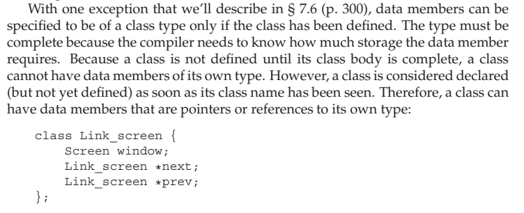
>
> 应该算个瑕疵吧。


#### 7.3.4 Friendship Revisited

##### 类之间的友元关系

除了普通函数，类还可以把其他类或其他类的成员函数声明为友元。友元类的成员函数可以访问此类包括非公有成员在内的所有成员。

```c++
class Screen
{
    // Window_mgr members can access the private parts of class Screen
    friend class Window_mgr;// 这样window_mgr就可以使用screen里面的参数了。
    // ... rest of the Screen class
};
```

友元关系不存在传递性，每个类负责控制自己的友元类或友元函数。

##### 令成员函数作为友元

除了令整个类作为友元外，还可以只为某个成员函数设定友元，不过需要明确指出该成员函数属于哪个类。

##### 函数重载和友元

重载函数实际上是不同的函数，那么是否友元也得一个个声明

##### 友元声明和作用域

友元函数可以直接定义在类的内部，这种函数是隐式内联的。但是必须在类外部提供相应声明令函数可见。

```c++
struct X
{
    friend void f() { /* friend function can be defined in the class body */ }
    X() { f(); }   // error: no declaration for f
    void g();
    void h();
};

void X::g() { return f(); }     // error: f hasn't been declared
void f();   // declares the function defined inside X
void X::h() { return f(); }     // ok: declaration for f is now in scope
```

需要理解友元声明的作用是影响访问权限，而不是普通意义上的声明。

### 7.4 Class Scope 类作用域

一个类就是一个作用域，当成员函数定义在类外时，返回类型中使用的名字位于类的作用域之外，此时返回类型必须指明它是哪个类的成员。

```c++
class Window_mgr
{
public:
    // add a Screen to the window and returns its index
    ScreenIndex addScreen(const Screen&);
    // other members as before
};

// return type is seen before we're in the scope of Window_mgr
Window_mgr::ScreenIndex Window_mgr::addScreen(const Screen &s)
{
    screens.push_back(s);
    return screens.size() - 1;
}
```


#### 7.4.1 Name Lookup and Class Scope

之前我们接触到的都是名字查找，过程大致如下：

- 首先，在名字所在的块中寻找其声明语句，只考虑在名字的使用之前出现的声明。
- 如果没找到，继续查找外层作用域。
- 如果最终没有找到匹配的声明，则程序报错。

对于定义在类内部的成员函数来说，解析其中名字的方式与上述的查找规则有些差异，类的定义分两步处理：

- 首先，编译成员的声明
- 知道类全部可见后才编译函数体

正因为成员函数体直到整个类可见后才会被处理，因此它能使用类中定义的任何名字。

##### 用于类成员声明的名字查找

这种两阶段的处理方式只适用于成员函数中使用的名字。声明中使用的名字，包括返回类型或参数列表，都必须确保使用前可见。

##### 类型名要特殊处理

如果类的成员使用了外层作用域的某个名字，而该名字表示一种类型，则类不能在之后重新定义该名字。

```c++
typedef double Money;
class Account
{
public:
    Money balance() { return bal; } // uses Money from the outer scop
private:
    typedef double Money; // error: cannot redefine Money
    Money bal;
    // ...
};
```

类型名定义通常出现在类起始处，这样能确保所有使用该类型的成员都位于类型名定义之后。

##### 成员定义中的普通块作用域的名字查找

成员函数中名字的解析顺序：

- 在成员函数内查找该名字的声明，只有在函数使用之前出现的声明才会被考虑。

- 如果在成员函数内没有找到，则会在类内继续查找，这时会考虑类的所有成员。

- 如果类内也没有找到，会在成员函数定义之前的作用域查找。

```c++
// it is generally a bad idea to use the same name for a parameter and a member
int height;   // defines a name subsequently used inside Screen
class Screen
{
public:
    typedef std::string::size_type pos;
    void dummy_fcn(pos height)
    {
        cursor = width * height;  // which height? the parameter
    }

private:
    pos cursor = 0;
    pos height = 0, width = 0;
};
```

这里的height参数隐藏了同名的成员。dummy_fun函数体内使用的名字是参数声明。

可以通过作用域运算符`::`或显式`this`指针来强制访问被隐藏的类成员。

```c++
// bad practice: names local to member functions shouldn't hide member names
void Screen::dummy_fcn(pos height)
{
    cursor = width * this->height;  // member height
    // alternative way to indicate the member
    cursor = width * Screen::height;  // member height
}

// good practice: don't use a member name for a parameter or other local variable
//建议不要将成员名字作为参数或其他局部变量使用。最好给参数起个别的名字。
void Screen::dummy_fcn(pos ht)
{
    cursor = width * height;  // member height
}
```

##### 在文件中名字的出现处对其进行解析

当成员定义在类的外部时，名字查找的第三步不仅要考虑定义之前的全局作用域中的声明，还需要考虑在成员函数定义之前的全局作用域中的声明。

```c++
int height; // defines a name subsequently used inside Screen
class Screen {
public:
typedef std::string::size_type pos;
void setHeight(pos);
pos height = 0; // hides the declaration of height in the outer scope
};
Screen::pos verify(Screen::pos);
void Screen::setHeight(pos var) {
// var: refers to the parameter
// height: refers to the class member
// verify: refers to the global function
height = verify(var);
}
```

全局函数verify的声明（8）在Screen定义（2）前不可见，但是名字查找第三步包括了成员函数出现前的全局作用域。

此例中verify声明位于setHeight定义之前，因此可以正常使用。如果放在之后就不行了。

### 7.5 Constructors Revisited

#### 7.5.1 Constructor Initializer List

如果没有在构造函数初始值列表中显式初始化成员，该成员会在构造函数体之前执行默认初始化。

##### 构造函数的初始值有时候必不可少

如果成员是`const`、引用，或者是某种未定义默认构造函数的类类型，必须在初始值列表中将其初始化。这是唯一赋初值的机会。

```c++
class ConstRef
{
public:
    ConstRef(int ii);
private:
    int i;
    const int ci;	//错误，不能给const赋值
    int &ri;		//错误，ri没被初始化
};

// ok: explicitly initialize reference and const members
ConstRef::ConstRef(int ii): i(ii), ci(ii), ri(i) { }
```

##### 成员初始化的顺序

最好令构造函数初始值的顺序与成员声明的顺序一致，并且尽量避免使用某些成员初始化其他成员。

##### 默认实参与构造函数

如果一个构造函数为所有参数都提供了默认实参，则它实际上也定义了默认构造函数。


#### 7.5.2 Delegating Constructors


C++11扩展了构造函数初始值功能，可以定义所谓委托构造函数。

委托构造函数使用它所属类的其他构造函数执行它自己的初始化过程。

```c++
class Sales_data
{
public:
    // defines the default constructor as well as one that takes a string argument
    Sales_data(std::string s = ""): bookNo(s) { }
    // remaining constructors unchanged
    Sales_data(std::string s, unsigned cnt, double rev):
        bookNo(s), units_sold(cnt), revenue(rev*cnt) { }
    Sales_data(std::istream &is) : Sales_data() { read(is, *this); } // 调用默认构造，默认构造又调用三参数构造
    // remaining members as before
}
```

当一个构造函数委托给另一个构造函数时，受委托的构造函数的初始值列表和函数体被依次执行。在Sales_data 类中，受委托的构造函数体恰好是空的，家兔函数体包含有代码的话，将先执行这些代码，然后才会交还给委托者的函数体。

#### 7.5.3 The Role of the Default Constructor

当对象被默认初始化或值初始化时会自动执行默认构造函数。

默认初始化的发生情况：

- 在块作用域内不使用初始值定义非静态变量或数组。

- 类本身含有类类型的成员且使用合成默认构造函数。

- 类类型的成员没有在构造函数初始值列表中显式初始化。

值初始化的发生情况：

- 数组初始化时提供的初始值数量少于数组大小。

- 不使用初始值定义局部静态变量。

- 通过`T()`形式（`T`为类型）的表达式显式地请求值初始化。

类必须包含一个默认构造函数。

##### 使用默认构造函数

如果想定义一个使用默认构造函数进行初始化的对象，应该去掉对象名后的空括号对。不然声明的是一个函数而不是对象。

```c++
Sales_data obj();   // oops! declares a function, not an object
Sales_data obj2;    // ok: obj2 is an object, not a function
```

#### 7.5.4 Implicit Class-Type Conversions

如果构造函数只接受一个实参，则它实际上定义了转换为此类类型的隐式转换机制。这种构造函数被称为转换构造函数（converting constructor）。【14.9】将介绍如何定义将一种类类型转换为另一种类类型的转换规则。

如果只接受一个实参，那么实际上就是参数类型隐式转化为类类型，在需要使用类类型的时候，可以用参数类型作为代替。

```c++
string null_book = "9-999-99999-9";
// constructs a temporary Sales_data object
// with units_sold and revenue equal to 0 and bookNo equal to null_book
item.combine(null_book);
```

编译器只会自动执行一步类型转换。

```c++
// error: requires two user-defined conversions:
//   (1) convert "9-999-99999-9" to string
//   (2) convert that (temporary) string to Sales_data
item.combine("9-999-99999-9");
// ok: explicit conversion to string, implicit conversion to Sales_data
item.combine(string("9-999-99999-9"));
// ok: implicit conversion to string, explicit conversion to Sales_data
item.combine(Sales_data("9-999-99999-9"));
```

##### 类类型转换并不是总是有效

```c++
item.combine(cin);
```

这段代码隐式地将cin转换成Sales_data，这样执行了一个接受istream 的构造函数，该构造函数创建了一个临时的Sales_data对象。将得到的对象传递给combine，一旦完成combine完成我们就不能再访问它了。实际上我们构建了一个对象，先将它的值加到item中，随后将其丢弃。

##### 抑制构造函数定义的隐式转换

在要求隐式转换的程序上下文中，可以通过将构造函数声明为`explicit`的加以阻止。

```c++
class Sales_data
{
public:
    Sales_data() = default;
    Sales_data(const std::string &s, unsigned n, double p):
        bookNo(s), units_sold(n), revenue(p*n) { }
    explicit Sales_data(const std::string &s): bookNo(s) { }
    explicit Sales_data(std::istream&);
    // remaining members as before
};
```

`explicit`关键字只对接受一个实参的构造函数有效。

只能在类内声明构造函数时使用`explicit`关键字，在类外定义时不能重复。

##### explicit构造函数只能用于直接初始化

执行拷贝初始化时（使用`=`）会发生隐式转换，所以`explicit`构造函数只能用于直接初始化。

```c++
Sales_data item1 (null_book);   // ok: direct initialization
// error: cannot use the copy form of initialization with an explicit constructor
Sales_data item2 = null_book;
```

##### 为转换显式地使用构造函数

可以使用`static_cast`构造函数显式地强制转换类型。

```c++
// ok: 实参是个显式构造的Sales_data 对象
item.combine(Sales_data(null_book));
// ok: static_cast 可以使用explicit 的构造函数
item.combine(static_cast<Sales_data>(cin));
```


#### 7.5.5 Aggregate Classes 聚合类

聚合类使得用户可以直接访问其成员，并且具有特殊的初始化语法形式。

聚合类满足如下条件：

- 所有成员都是`public`的。

- 没有定义任何构造函数。

- 没有类内初始值。

- 没有基类。

- 没有虚函数。

```c++
struct Data
{
    int ival;
    string s;
};
```

可以使用一个用花括号包围的成员初始值列表初始化聚合类的数据成员。初始值顺序必须与声明顺序一致。如果初始值列表中的元素个数少于类的成员个数，则靠后的成员被值初始化。

```c++
// val1.ival = 0; val1.s = string("Anna")
Data val1 = { 0, "Anna" };
```

显式地初始化类的对象有很多缺点，不建议使用。

#### 7.5.6 Literal Classes

todo 这边有些没有理解，不过感觉这部分也不重要。

数据成员都是字面值类型的聚合类是字面值常量类。或者一个类不是聚合类，但符合下列条件，则也是字面值常量类：

- 数据成员都是字面值类型。
- 类至少含有一个`constexpr`构造函数。
- 如果数据成员含有类内初始值，则内置类型成员的初始值必须是常量表达式。如果成员属于类类型，则初始值必须使用成员自己的`constexpr`构造函数。
- 类必须使用析构函数的默认定义。

##### constexpr构造函数

`constexpr`构造函数用于生成`constexpr`对象以及`constexpr`函数的参数或返回类型。

`constexpr`构造函数必须初始化所有数据成员，初始值使用`constexpr`构造函数或常量表达式。


> ## 聚合类
>
> 聚合类（aggregate class）允许利用者直接访问其成员，并且具有特殊的初始化形式。聚合类满足以下条件：
>
> - 所有成员都是public的
>
> - 没有定义构造函数
>
> - 没有类内初始值
>
> - 没有基类，也没有虚函数
>
> 
>
> 怎么理解呢？
>
> 首先，看来看去聚合类其实就是一个C结构体；其次，聚合这个词，应该是相对组合的，表明了成员和类之间的松散关系。
>
> 当一个类是聚合类时，就可以使用初始值列表像下面这样初始化了：
>
> ```c++
> struct Point{
>     int x;
>     int y;
> };
> Point pt = {10, 10};
> ```
>
> 
>
> ### 字面值常量类
>
> 前面讲过constexpr函数，它的参数和返回值都必须是常量表达式。而常量表达式的最基本要素就是字面值类型。字面值类型除了包括算数类型，引用和指针以外，某些类也属于字面值类型，C++11称之为字面值常量类。主要包括两种情况：
>
>  
>
> 首先数据成员都是字面类型的聚合类就是一种。上面的Point类就是一个例子。我们可以这样理解，字面值的聚合继续具有字面值的特征，这里主要是编译阶段可以求值。
>
> 
>
> 还有一种情况，虽然不是聚合类，但是只要满足下面的条件，也是字面值常量类：
>
> - 数据成员必须都必须是字面值类型。
>
> - 类必须至少含有一个constexpr构造函数。
>
> + 如果一个数据成员含有类内初始值，则初始值必须是常量表达式；如果成员属于某种类，初始值必须使用该类的constexpr构造函数。
>
> - 类必须使用析构函数的默认定义。
>
> 
>
> 对于这几个条件，作者这样理解：
>
> 满足条件1，就可以在编译阶段求值，这一点和聚合类一样。
>
> 满足条件2，就可以创建这个类的constexpr类型的对象。
>
> 满足条件3，就可以保证即使有类内初始化，也可以在编译阶段解决。
>
> 满足条件4，就可以保证析构函数没有不能预期的操作。
>
> 
>
> ### constexpr构造函数
>
> 
>
> 通过前置constexpr关键字，就可以声明constexpr构造函数，同时：
>
> 除了声明为=default或者=delete以外，constexpr构造函数的函数体一般为空，使用初始化列表或者其他的constexpr构造函数初始化所有数据成员。
>
> ```c++
> struct Point{
>     constexpr Point(int _x, int _y)
>         :x(_x),y(_y){}
>     constexpr Point()
>         :Point(0,0){}
>     int x;
>     int y;
> };
> 
> constexpr Point pt = {10, 10};
> ```
>
>
> 这样声明以后，就可以在使用constexpr表达式或者constexpr函数的地方使用字面值常量类了。
>
> ### 作者观点
>
> 定义各种名称的目的往往是因为经常需要将具有某种特征的事物从其他事物中分离出来。
> ————————————————
> 版权声明：本文为CSDN博主「面向对象思考」的原创文章，遵循CC 4.0 BY-SA版权协议，转载请附上原文出处链接及本声明。
> 原文链接：https://blog.csdn.net/craftsman1970/article/details/80244873

### 7.6 static Class Members

##### 声明静态成员

使用关键字`static`可以声明类的静态成员。静态成员存在于任何对象之外，对象中不包含与静态成员相关的数据。

```c++
class Account
{
public:
    void calculate() { amount += amount * interestRate; }
    static double rate() { return interestRate; }
    static void rate(double);

private:
    std::string owner;
    double amount;
    static double interestRate;
    static double initRate();
};
```

由于静态成员不与任何对象绑定，因此静态成员函数不能声明为`const`的，也不能在静态成员函数内使用`this`指针。

##### 使用类的静态成员

用户代码可以使用作用域运算符访问静态成员，也可以通过类对象、引用或指针访问。类的成员函数可以直接访问静态成员。

```c++
double r;
r = Account::rate(); // access a static member using the scope operator

Account ac1;
Account *ac2 = &ac1;
// equivalent ways to call the static member rate function
r = ac1.rate(); // through an Account object or reference
r = ac2->rate(); // through a pointer to an Account object

class Account
{
public:
    void calculate() { amount += amount * interestRate; }
private:
    static double interestRate;
    // remaining members as before
};
```

##### 定义静态成员

在类外部定义静态成员时，不能重复`static`关键字，其只能用于类内部的声明语句。

由于静态数据成员不属于类的任何一个对象，因此它们并不是在创建类对象时被定义的。通常情况下，不应该在类内部初始化静态成员。而**必须在类外部定义并初始化每个静态成员**。一个静态成员只能被定义一次。一旦它被定义，就会一直存在于程序的整个生命周期中。

```c++
// define and initialize a static class member
double Account::interestRate = initRate();
```

建议把静态数据成员的定义与其他非内联函数的定义放在同一个源文件中，这样可以确保对象只被定义一次。

##### 静态成员的类内初始化

尽管在通常情况下，不应该在类内部初始化静态成员。但是可以为静态成员提供`const`整数类型的类内初始值，不过要求静态成员必须是字面值常量类型的`constexpr`。初始值必须是常量表达式。

```c++
class Account
{
public:
    static double rate() { return interestRate; }
    static void rate(double);
private:
    static constexpr int period = 30;  // period is a constant
    double daily_tbl[period];
};
```

> 相同点：const和consexpr都是用来定义常量的。
> 不同点：const声明的常量，初始值引用的对象不一定是一个常量；constexpr声明的常量，初始值一定是常量表达式。

##### 静态成员能用于某些场景，而普通成员不能

静态数据成员的类型可以是不完全类型，可以是它所属的类类型。而非静态数据成员则受到限制，只能声明成它所属类的指针或引用。

```c++
class Bar
{
    static Bar mem1;   // ok: static member can have incomplete type
    Bar *mem2;    // ok: pointer member can have incomplete type
    Bar mem3;   // error: data members must have complete type
}
```

可以使用静态成员作为函数的默认实参。

```c++
class Screen
{
public:
    // bkground refers to the static member
    // declared later in the class definition
    Screen& clear(char = bkground);
private:
    static const char bkground;
};
```


### Chapter Summary  

类是C++ 语言中最基本的特性。类允许我们为自己的应用定义新类型。从而使得程序更加简洁且易于修改。

类有两项基本能力，一是数据抽象，即定义数据成员和函数成员的能力；二是封装，即保护类的成员不被随意访问的能力。

类可以定义一种特殊的成员函数：构造函数。其作用是控制初始化对象的方式。构造函数可以重载，构造函数应该使用构造函数初始值列表来初始化所有数据成员。

类还能定义可变或者静态成员。一个可变成员永远不会是const，即使是在const成员函数内也能修改它的值；一个静态成员可以是函数也可以是数据，静态成员存在于所有对象之外。

### Defined Terms

| 中文               | 英文                            | 含义                                                         |
| ------------------ | ------------------------------- | ------------------------------------------------------------ |
| 访问说明符         | access specifier                | 包括关键字public和private。用于定义成员对类的用户可见还是只对类的友元和成员可见。在类中说明符可以出现多次，每个说明符的有效范围从它自身开始，到下一个说明符为止。 |
| 构造函数初始值列表 | constructor initializer         | 说明一个类的数据成员的初始值，在构造函数体执行之前首先用初始值列表中的值初始化数据成员。未经初始值列表初始化的成员将被默认初始化。 |
| 封装               | encapsulation                   | 分离类的实现与接口，从而隐藏了类的实现细节。在C++语言中，通过把实现部分设为private完成封装的任务。 |
| 合成默认构造函数   | synthesized default constructor | 对于没有显式地定义任何构造函数的类、编译器为其创造(合成)的默认构造函数。该构造函数检查类的数据成员，如果提供了类内初始值，就用他执行初始化操作；否则就对数据成员执行默认初始化。 |
|                    | `=default`                      | 一种语法形式，位于类内部默认构造函数声明语句的参数列表之后，要求编译器生成构造函数，而不管类是否已经有了其他构造函数。 |
|                    |                                 |                                                              |
|                    |                                 |                                                              |


### 


