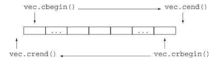
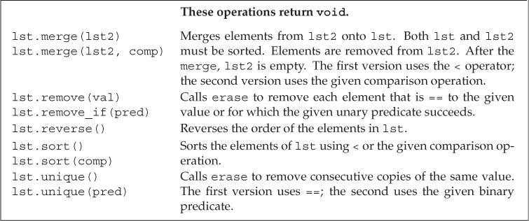
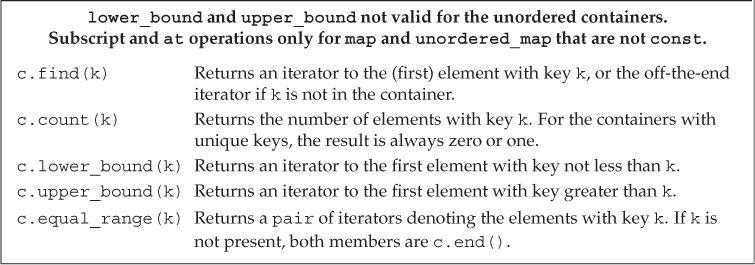
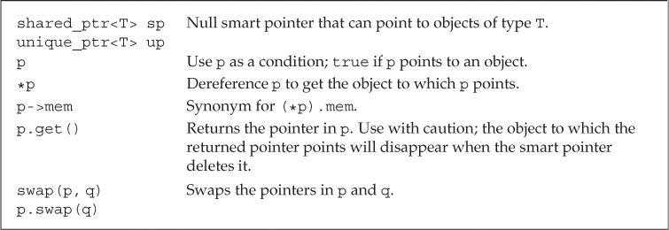

# Part II The C++ Library

新的C++标准目前大约2/3 用来描述标准库

## Chapter 8 The IO Library

部分IO库设施：

- `istream`：输入流类型，提供输入操作。

- `ostream`：输出流类型，提供输出操作。

- `cin`：`istream`对象，从标准输入读取数据。

- `cout`：`ostream`对象，向标准输出写入数据。

- `cerr`：`ostream`对象，向标准错误写入数据。

- `>>`运算符：从`istream`对象读取输入数据。

- `<<`运算符：向`ostream`对象写入输出数据。

- `getline`函数：从`istream`对象读取一行数据，写入`string`对象。

### 8.1 The IO Classes

IO**处理头文件**

- `iostream`定义了用于读写流的基本类型，

- `fstream`定义了读写命名文件的类型，

- `sstream`定义了读写内存中`string`对象的类型。


宽字符版本的IO类型和函数的名字以`w`开始，如`wcin`、`wcout`和`wcerr`分别对应`cin`、`cout`和`cerr`。它们与其对应的普通`char`版本都定义在同一个头文件中，如头文件`fstream`定义了`ifstream`和`wifstream`类型。

##### IO类型间的关系

标准库使我们进行IO操作时不用考虑不同类型的流之间的差异。这是通过**继承机制**(inheritance)实现的。【15】【18.3】会介绍C++如何支持继承机制的。

简单来说，我们可以声明一个特定类继承自另一个类，可以将派生类的对象当作其基类的对象使用。

#### 8.1.1 No Copy or Assign for IO Objects

IO对象无拷贝或赋值

```c++
ofstream out1, out2;
out1 = out2;    // error: cannot assign stream objects
ofstream print(ofstream);   // error: can't initialize the ofstream parameter
out2 = print(out2);     // error: cannot copy stream objects
```

由于IO对象不能拷贝，因此不能将函数形参或返回类型定义为流类型。进行IO操作的函数通常以引用方式传递和返回流。读写一个IO对象会改变其状态，因此传递和返回的引用不能是`const`的。****

#### 8.1.2 Condition States

IO库条件状态：


一个流一旦发生错误，其上后续的IO操作都会失败。

##### 查询流的状态

IO库定义了一个与机器无关的iostate类型，它提供了表达流状态的完整功能。IO库中定义了4个iostate类型的constexpr值。

`badbit`表示系统级错误，如不可恢复的读写错误。通常情况下，一旦`badbit`被置位，流就无法继续使用了。

在发生可恢复错误后，`failbit`会被置位，如期望读取数值却读出一个字符。如果到达文件结束位置，`eofbit`和`failbit`都会被置位。如果流未发生错误，则`goodbit`的值为0。如果`badbit`、`failbit`和`eofbit`任何一个被置位，检测流状态的条件都会失败。

```c++
while (cin >> word)
    // ok: read operation successful...
```

`good`函数在所有错误均未置位时返回`true`。而`bad`、`fail`和`eof`函数在对应错误位被置位时返回`true`。此外，在`badbit`被置位时，`fail`函数也会返回`true`。因此应该使用`good`或`fail`函数确定流的总体状态，`eof`和`bad`只能检测特定错误。

##### 管理条件状态

流对象的`rdstate`成员返回一个`iostate`值，表示流的当前状态。`setstate`成员用于将指定条件置位（叠加原始流状态）。`clear`成员的无参版本清除所有错误标志；含参版本接受一个`iostate`值，用于设置流的新状态（覆盖原始流状态）。

```c++
// remember the current state of cin
auto old_state = cin.rdstate();     // remember the current state of cin
cin.clear();    // make cin valid
process_input(cin);     // use cin
cin.setstate(old_state);    // now reset cin to its old state
```


#### 8.1.3 Managing the Output Buffer 管理输出缓冲

每个输出流都管理一个缓冲区，用于保存程序读写的数据。导致缓冲刷新（即数据真正写入输出设备或文件）的原因有很多：

- 程序正常结束。
- 缓冲区已满。
- 使用操纵符（如`endl`）显式刷新缓冲区。
- 在每个输出操作之后，可以用`unitbuf`操纵符设置流的内部状态，从而清空缓冲区。默认情况下，对`cerr`是设置`unitbuf`的，因此写到`cerr`的内容都是立即刷新的。
- 一个输出流可以被关联到另一个流。这种情况下，当读写被关联的流时，关联到的流的缓冲区会被刷新。默认情况下，`cin`和`cerr`都关联到`cout`，因此，读`cin`或写`cerr`都会刷新`cout`的缓冲区。

##### 刷新输出缓冲区

`flush`操纵符刷新缓冲区，但不输出任何额外字符。

`ends`向缓冲区插入一个空字符，然后刷新缓冲区。

```c++
cout << "hi!" << endl;   // writes hi and a newline, then flushes the buffer
cout << "hi!" << flush;  // writes hi, then flushes the buffer; adds no data
cout << "hi!" << ends;   // writes hi and a null, then flushes the buffer
```

##### unitbuf 操纵符

如果想在每次输出操作后都刷新缓冲区，可以使用`unitbuf`操纵符。它令流在接下来的每次写操作后都进行一次`flush`操作。而`nounitbuf`操纵符则使流恢复使用正常的缓冲区刷新机制。

```C++
cout << unitbuf;    // all writes will be flushed immediately
// any output is flushed immediately, no buffering
cout << nounitbuf;  // returns to normal buffering
```

##### 注意：如果程序异常终止，输出缓冲区不会被刷新。

所以在调试时，常常需要检查是无法正确输出还是卡在缓存区没输出来。

##### 关联输入和输出流

当一个输入流被关联到一个输出流时，任何试图从输入流读取数据的操作都会先刷新关联的输出流。标准库将`cout`和`cin`关联在一起，因此下面的语句会导致`cout`的缓冲区被刷新：

```c++
cin >> ival;
```

交互式系统通常应该关联输入流和输出流。这意味着包括用户提示信息在内的所有输出，都会在读操作之前被打印出来。

使用`tie`函数可以关联两个流。它有两个重载版本：无参版本返回指向输出流的指针。如果本对象已关联到一个输出流，则返回的就是指向这个流的指针，否则返回空指针。`tie`的第二个版本接受一个指向`ostream`的指针，将本对象关联到此`ostream`。

```c++
cin.tie(&cout);     // illustration only: the library ties cin and cout for us
// old_tie points to the stream (if any) currently tied to cin
ostream *old_tie = cin.tie(nullptr); // cin is no longer tied
// ties cin and cerr; not a good idea because cin should be tied to cout
cin.tie(&cerr);     // reading cin flushes cerr, not cout
cin.tie(old_tie);   // reestablish normal tie between cin and cout
```

每个流同时最多关联一个流，但多个流可以同时关联同一个`ostream`。向`tie`传递空指针可以解开流的关联。

### 8.2 File Input and Output

头文件`fstream`定义了三个类型来支持文件IO：`ifstream`从给定文件读取数据，`ofstream`向指定文件写入数据，`fstream`可以同时读写指定文件。

可以通过IO操作符`<<` `>>`来读写文件，可以通过getline从ifstream读取数据。

**fstream特有的一些操作**


### 

#### 8.2.1 Using File Stream Objects

每个文件流类型都定义了`open`函数，它完成一些系统操作，定位指定文件，并视情况打开为读或写模式。

创建文件流对象时，如果提供了文件名（可选），`open`会被自动调用。

```C++
ifstream in(ifile);   // construct an ifstream and open the given file
ofstream out;   // output file stream that is not associated with any file
```

在C++11中，文件流对象的文件名可以是`string`对象或C风格字符数组。旧版本的标准库只支持C风格字符数组。

##### 用fstream代替iostream&

在要求使用基类对象的地方，可以用继承类型的对象代替。因此一个接受`iostream`类型引用或指针参数的函数，可以用对应的`fstream`类型来调用。

```c++
ifstream input(argv[1]);			// 打开销售记录文件
ofstream output(argv[2]);			// 打开输出文件
Sales_data total;					// 保存销售总额的变量
if(read(input,total)) {
    Sales_data trans;
    while(read(input,trans)) {
        if(total.isbn() == trans.isbn())
            total.combine(trans);
        else {
            print(output,total) << endl;		// 注意，endl 换行同样会写入文件，因为print 返
            									// 回的仍然是 output
            total = trans;
        }
    }
    print(output,total) << endl;
} else 
    cerr << "No data?!" << endl;

// read 与 print
istream &read(istream &is,Sales_data &item) {
    double price = 0;							// price 表示某书单价
    is >> item.bookNo >> item.units_sold >> price;
    item.revenue = price * item.units_sold;
    return is;
}
ostream &print(ostream &os,const Sales_data &item) {
    os << item.isbn() << " " << item.units_sold << " "
       << item.revenue << " " << item.avg_price();
    return os;
}

```


> 当用&引用的方式进行值传递时，就相当将自己阉割成父类对象的样子，即将只属于自己的那一部分割去。然后将剩下的这一部分当作实参传递给函数。
>
> https://blog.csdn.net/weixin_45590473/article/details/108328192


##### 成员函数open和close

可以先定义空文件流对象，再调用`open`函数将其与指定文件关联。如果`open`调用失败，`failbit`会被置位。

**检测文件是否正常打开，是个好习惯**

对一个已经打开的文件流调用`open`会失败，并导致`failbit`被置位。随后试图使用文件流的操作都会失败。如果想将文件流关联到另一个文件，必须先调用`close`关闭当前文件，再调用`clear`重置流的条件状态（`close`不会重置流的条件状态）。

##### 自动构造和析构

当`fstream`对象被销毁时，`close`会自动被调用。

#### 8.2.2 File Modes

每个流都有一个关联的文件模式，用来指出如何使用文件。


我们在很多地方都可以指定文件格式，调用open打开文件时可以。用一个文件名初始化流来隐式打开文件时也可以。指定文件模式有以下限制。

- 只能对`ofstream`或`fstream`对象设定`out`模式。

- 只能对`ifstream`或`fstream`对象设定`in`模式。

- 只有当`out`被设定时才能设定`trunc`模式。

- 只要`trunc`没被设定，就能设定`app`模式。在`app`模式下，即使没有设定`out`模式，文件也是以输出方式打开。

- 默认情况下，即使没有设定`trunc`，以`out`模式打开的文件也会被截断。如果想保留以`out`模式打开的文件内容，就必须同时设定`app`模式，这会将数据追加写到文件末尾；或者同时设定`in`模式，即同时进行读写操作。

- `ate`和`binary`模式可用于任何类型的文件流对象，并可以和其他任何模式组合使用。

- 与`ifstream`对象关联的文件默认以`in`模式打开，与`ofstream`对象关联的文件默认以`out`模式打开，与`fstream`对象关联的文件默认以`in`和`out`模式打开。

默认情况下，打开`ofstream`对象时，文件内容会被丢弃，阻止文件清空的方法是同时指定`app`或`in`模式。

流对象每次打开文件时都可以改变其文件模式。

```c++
ofstream out;   // no file mode is set
out.open("scratchpad");    // mode implicitly out and trunc
out.close();    // close out so we can use it for a different file
out.open("precious", ofstream::app);   // mode is out and app 输出和追加
out.close();
```

第一个open 调用未显式指定输出模式，文件隐式地以out模式打开。一般地 ， out 模式同时使用trunc模式。

除非使用append模式，否则文件内容将被情况。

### 8.3 string Streams

头文件`sstream`定义了三个类型来支持内存IO：`istringstream`从`string`读取数据，`ostringstream`向`string`写入数据，`stringstream`可以同时读写`string`的数据。使得string就好像一个IO流一样。


#### 8.3.1 Using an istringstream

### 使用istringstream（Using an istringstream）

```c++
// members are public by default
struct PersonInfo
{
    string name;
    vector<string> phones;
};

string line, word;   // will hold a line and word from input, respectively
vector<PersonInfo> people;    // will hold all the records from the input
// read the input a line at a time until cin hits end-of-file (or another error)
while (getline(cin, line))
{
    PersonInfo info;    // create an object to hold this record's data
    istringstream record(line);    // bind record to the line we just read
    record >> info.name;    // read the name
    while (record >> word)  // read the phone numbers
        info.phones.push_back(word);   // and store them
    people.push_back(info);    // append this record to people
}
```


> 流插入,流提取运算符重载和类型转换的讲解和实例
>
> https://bbs.huaweicloud.com/blogs/271271
>
> ```c++
> template<typename _Traits>
>  inline basic_ostream<char, _Traits>&
>  operator<<(basic_ostream<char, _Traits>& ___out, const char* __s)
>  {
>    if (!__s)
> 	___out.setstate(ios_base::badbit);
>    else
> 	__ostream_insert(___out, __s,
> 			 static_cast<streamsize>(_Traits::length(__s)));
>    return ___out;
>  }
> ```
>
> <<的模板源码，在ostream600行左右，目前来看它可以过滤掉空格，回头等学完模板来研究一下。

#### 8.3.2 Using ostringstreams

### 使用ostringstream（Using ostringstreams）

对文本文件，进行构造后（修改，判断等操作），最后一起打印时，ostringstream很好用。

```C++
for (const auto &entry : people)
{ // for each entry in people
    ostringstream formatted, badNums;   // objects created on each loop
    for (const auto &nums : entry.phones)
    { // for each number
        if (!valid(nums))
        {
            badNums << " " << nums;  // string in badNums
        }
        else
            // ''writes'' to formatted's string
            formatted << " " << format(nums);
    }

    if (badNums.str().empty())   // there were no bad numbers
        os << entry.name << " "  // print the name
            << formatted.str() << endl;   // and reformatted numbers
    else  // otherwise, print the name and bad numbers
        cerr << "input error: " << entry.name
            << " invalid number(s) " << badNums.str() << endl;
}
```


### Chapter Summary 

C++使用标准库来处理面向流的输入和输出。

- iostream处理控制台IO
- fstream处理命名文件IO
- stringstream处理内存String的IO

fstream 以及stringstream都继承自iostream

### Defined Terms

| 中文     | 英文            | 含义                                                         |
| -------- | --------------- | ------------------------------------------------------------ |
| 条件状态 | condition state | 可被任何流类使用的一组标志和函数，用来指出给定流是否可用     |
| 文件流   | file stream     | 用来读写命名文件的流对象。                                   |
|          | open            | 接受一个string或C风格字符串参数，指定要打开的文件名，它还可以接受一个可选的参数。指明文件打开模式 |
|          | close           | 关闭流所关联的文件，调用close后才可以调用open打开另一个文件。 |
|          |                 |                                                              |
|          |                 |                                                              |
|          |                 |                                                              |
|          |                 |                                                              |


## Chapter 9 Sequential Containers

一个容器就是一些特定类型对象的集合。

顺序容器为程序员提供了控制元素存储和访问顺序的能力。这种顺序不依赖于元素的值，而是和元素加入容器的位置相对应。

### 9.1 Overview of the Sequential Containers

所有的顺序都提供了快速顺序访问元素的能力。但是这些容器在以下方面都有不同的性能折中。

- 向容器添加或从容器中删除元素的代价
- 非顺序访问容器中元素的代价

顺序容器类型：


|      类型      |                             特性                             |
| :------------: | :----------------------------------------------------------: |
|    `vector`    | 可变大小数组。支持快速随机访问。在尾部之外的位置插入/删除元素可能很慢 |
|    `deque`     |   双端队列。支持快速随机访问。在头尾位置插入/删除速度很快    |
|     `list`     | 双向链表。只支持双向顺序访问。在任何位置插入/删除速度都很快  |
| `forward_list` | 单向链表。只支持单向顺序访问。在任何位置插入/删除速度都很快  |
|    `array`     |      固定大小数组。支持快速随机访问。不能添加/删除元素       |
|    `string`    | 类似`vector`，但用于保存字符。支持快速随机访问。在尾部插入/删除速度很快 |

`forward_list`和`array`是C++11新增类型。与内置数组相比，`array`更安全易用。

为了避免开销，`forward_list`没有`size`操作。


#### 容器选择原则：

- 除非有合适的理由选择其他容器，否则应该使用`vector`。

- 如果程序有很多小的元素，且空间的额外开销很重要，则不要使用`list`或`forward_list`。

- 如果程序要求随机访问容器元素，则应该使用`vector`或`deque`。

- 如果程序需要在容器头尾位置插入/删除元素，但不会在中间位置操作，则应该使用`deque`。

- 如果程序只有在读取输入时才需要在容器中间位置插入元素，之后需要随机访问元素。则：

  - 先确定是否真的需要在容器中间位置插入元素。当处理输入数据时，可以先向`vector`追加数据，再调用标准库的`sort`函数重排元素，从而避免在中间位置添加元素。

  - 如果必须在中间位置插入元素，可以在输入阶段使用`list`。输入完成后将`list`中的内容拷贝到`vector`中。

- 不确定应该使用哪种容器时，可以先只使用`vector`和`list`的公共操作：使用迭代器，不使用下标操作，避免随机访问。这样在必要时选择`vector`或`list`都很方便。

### 9.2 Container Library Overview

这一节，会介绍适用于所有容器的操作。

每个容器都定义在一个头文件中，文件名与类型名相同。容器均为模板类型。


#### 9.2.1 Iterators 迭代器

类似容器，迭代器有着公共的接口：如果一个迭代器提供某个操作，那么所有提供相同操作的迭代器度这个操作的实现方式都是相同的。例如访问容器元素（解引用），递增运算符等等。

##### 标准迭代器支持的操作


`PS：forward_list`类型不支持递减运算符`--`。

##### 标准迭代器支持的算术运算

这些运算只支持`string`,`vector`,`deque`,`array`的迭代器。


##### 迭代器范围

**迭代器的范围是标准库的基础**

一个迭代器范围（iterator range）由一对迭代器表示。

这两个迭代器通常被称为`begin`和`end`，分别指向同一个容器中的元素或尾后地址。

`end`迭代器不会指向范围中的最后一个元素，而是指向尾元素之后的位置。这种元素范围被称为左闭合区间（left-inclusive interval），其标准数学描述为`[begin，end）`。迭代器`begin`和`end`必须指向相同的容器，`end`可以与`begin`指向相同的位置，但不能指向`begin`之前的位置（由程序员确保）。

##### 左闭合范围蕴含的编程假定

假定`begin`和`end`构成一个合法的迭代器范围，则：

- 如果`begin`等于`end`，则范围为空。

- 如果`begin`不等于`end`，则范围内至少包含一个元素，且`begin`指向该范围内的第一个元素。

- 可以递增`begin`若干次，令`begin`等于`end`。

```c++
while (begin != end)
{
    *begin = val;   // ok: range isn't empty so begin denotes an element
    ++begin;    // advance the iterator to get the next element
}
```


#### 9.2.2 Container Type Members

部分容器还提供反向迭代器（++就是--）【10.4.3】会介绍。

通过类型别名，可以在不了解容器元素类型的情况下使用元素。如果需要元素类型，可以使用容器的`value_type`。如果需要元素类型的引用，可以使用`reference`或`const_reference`。

> 这里我还疑惑，为什么要搞这个东西，比如`vector<int>::value_type x;`其实就是`int x`，这不是脱裤子放屁吗？但是稍微查了下，就发现这实际上是提供了一层抽象。
>
> > ```c++
> > typedef _Vector_base<_Tp, _Alloc>			_Base;
> >    typedef typename _Base::_Tp_alloc_type		_Tp_alloc_type;
> >    typedef __gnu_cxx::__alloc_traits<_Tp_alloc_type>	_Alloc_traits;
> > public:
> > typedef _Tp              value_type;
> > typedef typename _Base::pointer        pointer;
> > typedef typename _Alloc_traits::const_pointer    const_pointer;
> > typedef typename _Alloc_traits::reference       reference;
> > typedef typename _Alloc_traits::const_reference  const_reference;
> > ```
>
> 底层是用typedef _Tp来做的，所以实际上和`typedef double _DBX32`没啥区别。
>
> 都是为了方便后面的操作，比如改一下容器内部类型，不必一个个去修改变量前的类型名。
>
> 在模板里面肯定有更多的应用。

#### 9.2.3 begin and end Members

`begin`和`end`操作生成指向容器中第一个元素和尾后地址的迭代器。其常见用途是形成一个包含容器中所有元素的迭代器范围。

`begin`和`end`操作有多个版本：带`r`的版本返回反向迭代器。以`c`开头的版本（C++11新增）返回`const`迭代器。不以`c`开头的版本都是重载的，当对非常量对象调用这些成员时，返回普通迭代器，对`const`对象调用时，返回`const`迭代器。

```c++
list<string> a = {"Milton", "Shakespeare", "Austen"};
auto it1 = a.begin();    // list<string>::iterator
auto it2 = a.rbegin();   // list<string>::reverse_iterator
auto it3 = a.cbegin();   // list<string>::const_iterator
auto it4 = a.crbegin();  // list<string>::const_reverse_iterator
```

当`auto`与`begin`或`end`结合使用时，返回的迭代器类型依赖于容器类型。但调用以`c`开头的版本仍然可以获得`const`迭代器，与容器是否是常量无关。

当程序不需要写操作时，应该使用`cbegin`和`cend`。

#### 9.2.4 Defining and Initializing a Container 容器初始化

每个容器都有对应的构造函数，除了array之外，其他容器的默认构造函数都会创建一个指定类的空容器，也可以接受指定容器大小和元素初始值的参数。

容器定义和初始化方式：


##### 将一个容器初始化为另一个容器的拷贝

将一个容器初始化为另一个容器的拷贝时，两个容器的容器类型和元素类型都必须相同。

传递迭代器参数来拷贝一个范围时，不要求容器类型相同，而且新容器和原容器中的元素类型也可以不同，但是要能进行类型转换。

```c++
// each container has three elements, initialized from the given initializers
list<string> authors = {"Milton", "Shakespeare", "Austen"};
vector<const char*> articles = {"a", "an", "the"};
list<string> list2(authors);        // ok: types match
deque<string> authList(authors);    // error: container types don't match
vector<string> words(articles);     // error: element types must match
// ok: converts const char* elements to string
forward_list<string> words(articles.begin(), articles.end());
```

##### 列表初始化

C++11允许对容器进行列表初始化。

```c++
// each container has three elements, initialized from the given initializers
list<string> authors = {"Milton", "Shakespeare", "Austen"};
vector<const char*> articles = {"a", "an", "the"};
```

##### 与顺序容器大小相关的构造函数

```c++
vector<int> ivec(10,-1);
list<string>svec(10,"hi");
forward_list<int>ivec(10);	//10个空元素，每个都是0
deque<string> svec(10);  //10个空元素，都是空string
```

如果元素没有默认构造参数，除了元素大小外，必须制定一个显式的初始值。

注: 只有顺序容器的构造函数才接受大小参数，关联容器并不支持

##### 标准库array具有固定大小 

定义和使用`array`类型时，需要同时指定元素类型和容器大小。

```c++
array<int, 42>      // type is: array that holds 42 ints
array<string, 10>   // type is: array that holds 10 strings
array<int, 10>::size_type i;   // array type includes element type and size
array<int>::size_type j;       // error: array<int> is not a type
```

对`array`进行列表初始化时，初始值的数量不能大于`array`的大小。如果初始值的数量小于`array`的大小，则只初始化靠前的元素，剩余元素会被值初始化。如果元素类型是类类型，则该类需要一个默认构造函数。

可以对`array`进行拷贝或赋值操作，但要求二者的元素类型和大小都相同。

#### 9.2.5 Assignment and swap

容器赋值操作：


##### 使用assign（仅顺序容器）

赋值运算符两侧的运算对象必须类型相同。`assign`允许用不同但相容的类型赋值，或者用容器的子序列赋值。

```c++
list<string> names;
vector<const char*> oldstyle;
names = oldstyle;   // error: container types don't match
// ok: can convert from const char*to string
names.assign(oldstyle.cbegin(), oldstyle.cend());
```

由于其旧元素被替换，因此传递给`assign`的迭代器不能指向调用`assign`的容器本身。

assign的第二个版本接受一个整型值和一个元素值，它用指定数目且具有相同给定元素替换容器中原有的元素

```c++
list<string>alist1(1);
alist1.assign(10,"hello"); // 十个hello
```


##### 使用swap

`swap`交换两个相同类型容器的内容。除`array`外，`swap`不对任何元素进行拷贝、删除或插入操作，只交换两个容器的内部数据结构，因此可以保证快速完成。

```c++
vector<string> svec1(10);   // vector with ten elements
vector<string> svec2(24);   // vector with 24 elements
swap(svec1, svec2);
```

赋值相关运算会导致指向左边容器内部的迭代器、引用和指针失效。而`swap`操作交换容器内容，不会导致迭代器、引用和指针失效（`array`和`string`除外）。

**对于`array`，`swap`会真正交换它们的元素**。因此在`swap`操作后，指针、引用和迭代器所绑定的元素不变，但元素值已经被交换。

> std::array直接将数据保存在对象自身里，并不通过指针来间接访问。被保存的对象不是被管理的资源，而是array类本身的data member，没得“交换指针”。想自己做成交换指针也做不成。

```c++
array<int, 3> a = { 1, 2, 3 };
array<int, 3> b = { 4, 5, 6 };
auto p = a.cbegin(), q = a.cend();
a.swap(b);
// 输出交换后的值，即4、5、6
while (p != q)
{
    cout << *p << endl;
    ++p;
}
```

对于其他容器类型（除`string`），指针、引用和迭代器在`swap`操作后仍指向操作前的元素，但这些元素已经属于不同的容器了。

```c++
vector<int> a = { 1, 2, 3 };
vector<int> b = { 4, 5, 6 };
auto p = a.cbegin(), q = a.cend();
a.swap(b);
// 输出交换前的值，即1、2、3
while (p != q)
{
    cout << *p << endl;
    ++p;
}
```

`array`不支持`assign`，也不允许用花括号列表进行赋值。

```c++
array<int, 10> a1 = {0,1,2,3,4,5,6,7,8,9};
array<int, 10> a2 = {0};    // elements all have value 0
a1 = a2;    // replaces elements in a1
a2 = {0};   // error: cannot assign to an array from a braced list
```

新标准库同时提供了成员和非成员函数版本的`swap`。非成员版本的`swap`在泛型编程中非常重要，建议统一使用非成员版本的`swap`。

#### 9.2.6 Container Size Operations

`size`成员返回容器中元素的数量；`empty`当`size`为0时返回`true`，否则返回`false`；`max_size`返回一个大于或等于该类型容器所能容纳的最大元素数量的值。`forward_list`支持`max_size`和`empty`，但不支持`size`。

#### 9.2.7 Relational Operators

每个容器类型都支持相等运算符（`==`、`!=`）。除无序关联容器外，其他容器都支持关系运算符（`>`、`>=`、`<`、`<=`）。关系运算符两侧的容器类型和保存元素类型都必须相同。

两个容器的比较实际上是元素的逐对比较，其工作方式与`string`的关系运算符类似：

- 如果两个容器大小相同且所有元素对应相等，则这两个容器相等。

- 如果两个容器大小不同，但较小容器中的每个元素都等于较大容器中的对应元素，则较小容器小于较大容器。

- 如果两个容器都不是对方的前缀子序列，则两个容器的比较结果取决于第一个不等元素的比较结果。

```c++
vector<int> v1 = { 1, 3, 5, 7, 9, 12 };
vector<int> v2 = { 1, 3, 9 };
vector<int> v3 = { 1, 3, 5, 7 };
vector<int> v4 = { 1, 3, 5, 7, 9, 12 };
v1 < v2     // true; v1 and v2 differ at element [2]: v1[2] is less than v2[2]
v1 < v3     // false; all elements are equal, but v3 has fewer of them;
v1 == v4    // true; each element is equal and v1 and v4 have the same size()
v1 == v2    // false; v2 has fewer elements than v1
```

容器的相等运算符实际上是使用元素的`==`运算符实现的，而其他关系运算符则是使用元素的`<`运算符。如果元素类型不支持所需运算符，则保存该元素的容器就不能使用相应的关系运算。

### 9.3 Sequential Container Operations

顺序容器与关联容器的不同之处在于两者组织元素的方式，上一节介绍了所以元素都适用的操作，这一章将介绍顺序容器特有的操作。

#### 9.3.1 Adding Elements to a Sequential Container

除`array`外（因为这些操作会改变容器大小），所有标准库容器都提供灵活的内存管理，在运行时可以动态添加或删除元素。


**向一个vector、string、deque插入元素会使所以指向容器的迭代器，引用和指针失效**

根本原因是因为插入元素可能会引起内存空间的重新分配，可能会搬到新的空间去。自然就失效了。

> 向容器添加元素后：
>
> 1.对于vector 或者 string
> 如果存储空间被重新分配，则指向容器的迭代器，指针和引用都会失效。
> 如果存储空间未重新分配，指向插入位置之前元素的迭代器，指针和引用仍有效，但指向存在的元素的引用和指针不会失效。
>
> 2.对于deque
> 插入到除首尾位置之外的任何位置都会导致迭代器，指针和引用失效。
> 如果在首尾位置添加元素，迭代器会失效，但指向存在的元素的指针和引用不会失效。
>
> 3.对于list和forward_list
> 指向容器的迭代器（包括尾后迭代器和首前迭代器），指针和引用仍有效。
>
> 当我们从一个容器中删除元素后，指向被删除元素的迭代器，指针和引用会失效，这应该不会令人惊讶。毕竟，这些元素都已经被销毁了。当我们删除一个元素后：
>
> 1.对于list和forward_list
> 指向容器其它位置的迭代器，引用和指针仍有效。
>
> 2.对于deque
> 如果在首尾之外的任何位置删除元素，那么指向被删除元素外的其它元素的迭代器，引用和指针都会失效。
>
> 如果删除deque的尾元素，则尾后迭代器也会失效，但其它迭代器，指针和引用不受影响；如果删除首元素，这些也不会受影响。
>
> 3.对于vector和string
> 指向被删元素之前的迭代器，引用和指针仍有效。
>
> 注意：使用失效的迭代器，指针或引用是严重的运行时错误。因此必须保证每次改变容器的操作之后都正确的重新定位迭代器。这个建议对于vector,string和deque尤为重要。
> ————————————————
> 版权声明：本文为CSDN博主「拥抱@」的原创文章，遵循CC 4.0 BY-SA版权协议，转载请附上原文出处链接及本声明。
> 原文链接：https://blog.csdn.net/tonglin12138/article/details/88359618

##### push_back

`push_back`将一个元素追加到容器尾部，`push_front`将元素插入容器头部。

```c++
// read from standard input, putting each word onto the end of container
string word;
while (cin >> word)
    container.push_back(word);
```

##### push_front

list,forward_list,deque容器还支持push_front 插入容器头部。

##### insert 在特定位置添加元素

`insert`将元素插入到迭代器指定的位置之前。一些不支持`push_front`的容器可以使用`insert`将元素插入开始位置。

```c++
vector<string> svec;
list<string> slist;
// equivalent to calling slist.push_front("Hello!");
slist.insert(slist.begin(), "Hello!");
// no push_front on vector but we can insert before begin()
// warning: inserting anywhere but at the end of a vector might be slow
svec.insert(svec.begin(), "Hello!");
```

将元素插入到`vector`、`deque`或`string`的任何位置都是合法的，但可能会很耗时。

##### insert 插入范围内元素

insert 还可以接受更多的参数。

- 接受一个元素数目和一个值，将指定数量的元素添加到指定位置之前，且按照给定值初始化。
- 接受一对迭代器或一个初始化列表的insert，将给定范围中的元素插入到指定位置之前。

```c++
vector<string> v = {"quasi","simba","Lforl","fas"};
list<string> slist;
slist.insert(slist.begin(),v.end()-2,v.end());
slist.insert(slist.end(),{"a","b","v","d"});
```

在新标准库中，接受元素个数或范围的`insert`版本返回指向第一个新增元素的迭代器，而旧版本中这些操作返回`void`。如果范围为空，不插入任何元素，`insert`会返回第一个参数。

##### insert 使用insert返回值

```c++
list<string> 1st;
auto iter = 1st.begin();
while (cin >> word)
    iter = 1st.insert(iter, word);  // same as calling push_front
```

将读入的新元素插入iter所指向的元素之前的位置，insert返回的迭代器恰好指向这个新元素，如此重复循环。

##### 使用emplace

新标准库增加了三个直接构造而不是拷贝元素的操作：`emplace_front`、`emplace_back`和`emplace`，其分别对应`push_front`、`push_back`和`insert`。当调用`push`或`insert`时，元素对象被拷贝到容器中。而调用`emplace`时，则是将参数传递给元素类型的构造函数，直接在容器的内存空间中构造元素。

```c++
// construct a Sales_data object at the end of c
// uses the three-argument Sales_data constructor
c.emplace_back("978-0590353403", 25, 15.99);
// error: there is no version of push_back that takes three arguments
c.push_back("978-0590353403", 25, 15.99);
// ok: we create a temporary Sales_data object to pass to push_back
c.push_back(Sales_data("978-0590353403", 25, 15.99));
```

传递给`emplace`的参数必须与元素类型的构造函数相匹配。


注：

- `forward_list`有特殊版本的`insert`和`emplace`操作，且不支持`push_back`和`emplace_back`。

- `vector`和`string`不支持`push_front`和`emplace_front`。

#### 9.3.2 Accessing Elements 访问元素

包括`array`在内， 每个顺序容器都有一个`front`成员函数，而除了`forward_list`之外的顺序容器还有一个`back`成员函数。这两个操作分别返回首元素和尾元素的引用。

在调用`front`和`back`之前，要确保容器非空。

顺序容器的元素访问操作：


##### 访问成员函数返回的是引用

在容器中访问元素的成员函数都返回引用类型。如果容器是`const`对象，则返回`const`引用，否则返回普通引用。如果希望修改容器内的值，应该使用引用来取。

```c++
if (!c.empty()) {
	c.front() = 42; // assigns 42 to the first element in c
	auto &v = c.back(); // get a reference to the last element
	v = 1024; // changes the element in c
	auto v2 = c.back(); // v2 is not a reference; it’s a copy of c.back()
	v2 = 0; // no change to the element in c
}
```

##### 下标访问和安全的随机访问

可以快速随机访问的容器（`string`、`vector`、`deque`和`array`）都提供下标运算符。保证下标有效是程序员的责任。如果希望确保下标合法，可以使用`at`成员函数。

`at`类似下标运算，但如果下标越界，`at`会抛出`out_of_range`异常。

```c++
vector<string> svec;  // empty vector
cout << svec[0];      // run-time error: there are no elements in svec!
cout << svec.at(0);   // throws an out_of_range exception
```


#### 9.3.3 Erasing Elements

顺序容器的元素删除操作：


删除`deque`中除首尾位置之外的任何元素都会使所有迭代器、引用和指针失效。删除`vector`或`string`的元素后，指向删除点之后位置的迭代器、引用和指针也都会失效。

删除元素前，程序员必须确保目标元素存在。

`pop_front`和`pop_back`函数分别删除首元素和尾元素。`vector`和`string`类型不支持`pop_front`，`forward_list`类型不支持`pop_back`。

`erase`函数删除指定位置的元素。可以删除由一个迭代器指定的单个元素，也可以删除由一对迭代器指定的范围内的所有元素。两种形式的`erase`都返回指向删除元素（最后一个）之后位置的迭代器。

```c++
// delete the range of elements between two iterators
// returns an iterator to the element just after the last removed element
elem1 = slist.erase(elem1, elem2);  // after the call elem1 == elem2
```

`clear`函数删除容器内的所有元素。

#### 9.3.4 Specialized forward_list Operations

在`forward_list`中添加或删除元素的操作是通过改变给定元素之后的元素来完成的。


`forward_list`的插入和删除操作：


当在forward_list中添加或删除元素时，我们必须关注两个迭代器--一个指向我们要处理的元素，另一个指向其前驱。

```c++
forward_list<int> flst = {0,1,2,3,4,5,6,7,8,9};
auto prev = flst.before_begin(); // denotes element "off the start" of flst
auto curr = flst.begin(); // denotes the first element in flst
while (curr != flst.end()) { // while there are still elements to process
	if (*curr % 2) // if the element is odd
		curr = flst.erase_after(prev); // erase it and move curr
	else {
		prev = curr; // move the iterators to denote the next
		++curr; // element and one before the next element
		}
}
```


#### 9.3.5 Resizing a Container

`array` 不支持resize，当前大小大了，截取；当前大小小了，填充新元素。

顺序容器的大小操作：


`resize`函数接受一个可选的元素值参数，用来初始化添加到容器中的元素，否则新元素进行值初始化。如果容器保存的是类类型元素，且`resize`向容器添加新元素，则必须提供初始值，或元素类型提供默认构造函数。

#### 9.3.6 Container Operations May Invalidate Iterators

向容器中添加或删除元素可能会使指向容器元素的指针、引用或迭代器失效。失效的指针、引用或迭代器不再表示任何元素，使用它们是一种严重的程序设计错误。

- 向容器中添加元素后：

  - 如果容器是`vector`或`string`类型，且存储空间被重新分配，则指向容器的迭代器、指针和引用都会失效。如果存储空间未重新分配，指向插入位置之前元素的迭代器、指针和引用仍然有效，但指向插入位置之后元素的迭代器、指针和引用都会失效。

  - 如果容器是`deque`类型，添加到除首尾之外的任何位置都会使迭代器、指针和引用失效。如果添加到首尾位置，则迭代器会失效，而指针和引用不会失效。

  - 如果容器是`list`或`forward_list`类型，指向容器的迭代器、指针和引用仍然有效。

- 从容器中删除元素后，指向被删除元素的迭代器、指针和引用失效：

  - 如果容器是`list`或`forward_list`类型，指向容器其他位置的迭代器、指针和引用仍然有效。

  - 如果容器是`deque`类型，删除除首尾之外的任何元素都会使迭代器、指针和引用失效。如果删除尾元素，则尾后迭代器失效，其他迭代器、指针和引用不受影响。如果删除首元素，这些也不会受影响。

  - 如果容器是`vector`或`string`类型，指向删除位置之前元素的迭代器、指针和引用仍然有效。但尾后迭代器总会失效。

**必须保证在每次改变容器后都正确地重新定位迭代器。**

```c++
vector<int> vi = {0,1,2,3,4,5,6,7,8,9};
auto iter = vi.begin(); // call begin, not cbegin because we’re changing vi
while (iter != vi.end()) {
	if (*iter % 2) {
		iter = vi.insert(iter, *iter); // duplicate the current element
		iter += 2; // advance past this element and the one inserted before it
	} else
		iter = vi.erase(iter); // remove even elements
		// don’t advance the iterator; iter denotes the element after the one we erased
}
```

这段程序的目的是删除偶数，复制奇数。

那么要注意erase后，迭代器指向序列下一个元素；insert在给定位置前插入新元素，insert后，迭代器指向新插入元素的迭代器，所以要+2，越过这两个，指向下一个未处理的元素。

**不要保存`end`函数返回的迭代器。**

因为很容易混乱。

```c++
// safer:在每个循环步骤添加/删除元素后都重新计算end
while (begin != v.end())
{
    // do some processing
    ++begin;    // advance begin because we want to insert after this element
    begin = v.insert(begin, 42);    // insert the new value
    ++begin;    // advance begin past the element we just added
}
```


### 9.4 How a vector Grows

为了快速随机访问,vector 将元素连续存储。

> 所谓“随机存取”，指的是当存储器中的消息被读取或写入时，所需要的时间与这段信息所在的位置无关。相对的，读取或写入顺序访问（SequentialAccess）存储设备中的信息时，其所需要的时间与位置就会有关系（如磁带）。

而为了避免扩容带来的频繁内存移动，`vector`和`string`的实现通常会分配比新空间需求更大的内存空间，容器预留这些空间作为备用，可用来保存更多新元素。

容器大小管理操作：


`capacity`函数返回容器在不扩充内存空间的情况下最多可以容纳的元素数量。`reserve`函数告知容器应该准备保存多少元素，它并不改变容器中元素的数量，仅影响容器预先分配的内存空间大小。


```c++
#include <iostream>
#include<vector>
using namespace std;
int main() {
    vector<int> a = {1,3,4};
    cout<<a.capacity()<<endl;
    cout<<a.size();
    cout<<endl;
    a.push_back(4);
    cout<<a.capacity()<<endl;
    cout<<a.size();
    cout<<endl;
    for(int i = 0;i<8;i++){
        a.push_back(4);
    }
    cout<<a.capacity()<<endl;
    cout<<a.size();
    cout<<endl;
    a.push_back(4);
    cout<<a.capacity()<<endl;
    cout<<a.size();
    return 0;
}

/*
3
3
6
4
12
12
24
13
*/
```

> 可以看到，当超出容器大小时，vector会扩容一倍

只有当需要的内存空间超过当前容量时，`reserve`才会真正改变容器容量，分配不小于需求大小的内存空间。当需求大小小于当前容量时，`reserve`并不会退回内存空间。因此在调用`reserve`之后，`capacity`会大于或等于传递给`reserve`的参数。

在C++11中可以使用`shrink_to_fit`函数来要求`deque`、`vector`和`string`退回不需要的内存空间（并不保证退回）。

### 9.5 Additional string Operations

#### 9.5.1 Other Ways to Construct strings 构建string的其他方法

构造`string`的其他三个构造函数：


这些构造函数接受一个string或一个const char* 参数。还接受（可选） 指定拷贝多少个字符的参数。

从另一个`string`对象拷贝字符构造`string`时，如果提供的拷贝开始位置（可选）大于给定`string`的大小，则构造函数会抛出`out_of_range`异常。

子字符串操作：


如果传递给`substr`函数的开始位置超过`string`的大小，则函数会抛出`out_of_range`异常。

#### 9.5.2 Other Ways to Change a string

修改`string`的操作：


`append`函数是在`string`末尾进行插入操作的简写形式。

```c++
string s("C++ Primer"), s2 = s;     // initialize s and s2 to "C++ Primer"
s.insert(s.size(), " 4th Ed.");     // s == "C++ Primer 4th Ed."
s2.append(" 4th Ed.");     // equivalent: appends " 4th Ed." to s2; s == s2
```

`replace`函数是调用`erase`和`insert`函数的简写形式。

```c++
// equivalent way to replace "4th" by "5th"
s.erase(11, 3);         // s == "C++ Primer Ed."
s.insert(11, "5th");    // s == "C++ Primer 5th Ed."
// starting at position 11, erase three characters and then insert "5th"
s2.replace(11, 3, "5th");   // equivalent: s == s2
```

##### 改变string的多种重载函数

`append` `assign` `insert` `replace` 都有多个重载版本

- assign 和 append 无需指定要替换string中哪个部分，因为assign总是全部替换string，而append总是在string追加。

-  replace函数提供两种删除元素方式的方法，可以通过一个位置和一个长度来指定范围，也可以通过一个迭代器范围来指定。
- insert函数允许我们用两个方式指定插入点：用一个下标或一个迭代器。这两种情况下，新元素都会插入到给定下标（或迭代器）之前的位置。

但是insert 不支持下标和初始化列表参数。如果我们希望使用迭代器指定插入点，就不能用字符指针来指定新字符的来源。

#### 9.5.3 string Search Operations

`string`的每个搜索操作都返回一个`string::size_type`值，表示匹配位置的下标。如果搜索失败，则返回一个名为`string::npos`的`static`成员。标准库将`npos`定义为`const string::size_type`类型，并初始化为-1。

不建议用`int`或其他带符号类型来保存`string`搜索函数的返回值。

`string`搜索操作：


#### 9.5.4 The compare Functions

`string`类型提供了一组`compare`函数进行字符串比较操作，类似C标准库的`strcmp`函数。

根据s是等于、大于还是小于参数指定的字符串，s.compare 返回0，正数或负数。

`compare`函数的几种参数形式：


#### 9.5.5 Numeric Conversions

C++11增加了`string`和数值之间的转换函数：


进行数值转换时，`string`参数的第一个非空白字符必须是符号（`+`或`-`）或数字。它可以以`0x`或`0X`开头来表示十六进制数。对于转换目标是浮点值的函数，`string`参数也可以以小数点开头，并可以包含`e`或`E`来表示指数部分。

如果给定的`string`不能转换为一个数值，则转换函数会抛出`invalid_argument`异常。如果转换得到的数值无法用任何类型表示，则抛出`out_of_range`异常。

### 9.6 Container Adaptors 适配器

标准库定义了`stack`、`queue`和`priority_queue`三种容器适配器。容器适配器可以改变已有容器的工作机制。

所有容器适配器都支持的操作和类型：


默认情况下，`stack`和`queue`是基于`deque`实现的，`priority_queue`是基于`vector`实现的。可以在创建适配器时将一个命名的顺序容器作为第二个类型参数，来重载默认容器类型。

```c++
// empty stack implemented on top of vector
stack<string, vector<string>> str_stk;
// str_stk2 is implemented on top of vector and initially holds a copy of svec
stack<string, vector<string>> str_stk2(svec);
```

所有适配器都要求容器具有添加和删除元素的能力，因此适配器不能构造在`array`上。适配器还要求容器具有添加、删除和访问尾元素的能力，因此也不能用`forward_list`构造适配器。

##### stack

栈适配器`stack`定义在头文件`stack`中，其支持的操作如下：


##### queue

队列适配器`queue`和`priority_queue`定义在头文件`queue`中，其支持的操作如下：


`queue`使用先进先出（first-in，first-out，FIFO）的存储和访问策略。进入队列的对象被放置到队尾，而离开队列的对象则从队首删除。

### Chapter Summary  

标准库容器是模板类型，用来保存给定类型的对象，在一个顺序容器中，元素是按顺序操作的。通过为止来访问，

除array外，所有的容器都提供高效的动态内存管理。不用关心元素存储位置。

当我们使用添加和删除元素的容器操作时，必须注意这些操作可能使得容器中的迭代器、指针、引用失效。

### Defined Terms

|    中文    |          英文           | 含义                                                         |
| :--------: | :---------------------: | ------------------------------------------------------------ |
|   适配器   |         adaptor         | 标准库类型、函数或迭代器，他们接受一个类型、函数或迭代器，使其行为像另外一个类型、函数或迭代器一样。 |
|  单向列表  |      forward_list       | forward_list的元素只能顺序访问，不支持--，与其他容器不同，插入和删除发生在给定的迭代器之后的位置。因此，除了通常的尾后迭代器外，它还有一个首前迭代器。在添加新元素后，原有的指向forward_list的迭代器仍有效。在删除元素后，只有原来指向被删除元素的迭代器才会失效。 |
| 左闭合区间 | left-inclusive interval | 值范围，包含首元素，不包括尾元素。                           |
|            |                         |                                                              |
|            |                         |                                                              |
|            |                         |                                                              |
|            |                         |                                                              |
|            |                         |                                                              |


## Chapter 10 Generic Algorithms 泛型算法

标准库定义了一组泛型算法，来实现各种有用的操作。

称他们为算法，是因为它们实现了一些经典算法的公共接口，如排序和搜索

称他们为泛型，是因为他们可以用于不同类型的元素和多种容器类型

### 10.1 Overview

大多数算法都定义在头文件`algorithm`中，此外标准库还在头文件`numeric`中定义了一组数值泛型算法。一般情况下，这些算法并不直接操作容器，而是遍历由两个迭代器指定的元素范围进行操作。

`find`函数将范围中的每个元素与给定值进行比较，返回指向第一个等于给定值的元素的迭代器。如果无匹配元素，则返回其第二个参数来表示搜索失败。

```c++
int val = 42;   // value we'll look for
// result will denote the element we want if it's in vec, or vec.cend() if not
auto result = find(vec.cbegin(), vec.cend(), val);
// report the result
cout << "The value " << val
    << (result == vec.cend() ? " is not present" : " is present") << endl;
```

另外指针就像内置数组上的迭代器，可以用find在数组中查找值：

```c++
int ia[] = {27, 210, 12, 47, 109, 83};
int val = 83;
int* result = find(begin(ia), end(ia), val);
//还可以在序列的子范围中查找
auto result = find(ia+1,ia+4,val);
```

迭代器参数令算法不依赖于特定容器，但依赖于元素类型操作。比如需要容器提供例如`<` `==`的重载版本。

泛型算法本身不会执行容器操作，它们只会运行于迭代器之上，执行迭代器操作。算法可能改变容器中元素的值，或者在容器内移动元素，但不会改变底层容器的大小（当算法操作插入迭代器`insert`时，迭代器可以向容器中添加元素，但算法自身不会进行这种操作）。

### 10.2 A First Look at the Algorithms

除了少数例外，标准库算法都对一个范围内的元素进行操作。我们将此元素范围称为“输入范围”。一般用两个迭代器来实现。

了解一个算法，最基本的就是了解它们是否读取元素、改变元素或是重排元素。

#### 10.2.1 Read-Only Algorithms 只读算法

一些算法只读取范围内元素，而不进行操作，如`find` `count`。

##### accumulate  求和

`accumulate`函数（定义在头文件`numeric`中）用于计算一个序列的和。它接受三个参数，前两个参数指定需要求和的元素范围，第三个参数是和的初值（第三个参数的类型决定加法运算符和返回值类型）。

```c++
// sum the elements in vec starting the summation with the value 0
int sum = accumulate(vec.cbegin(), vec.cend(), 0);
string sum = accumulate(v.cbegin(), v.cend(), string(""));
// error: no + on const char* 简单使用空串是不行的，因为这种类型没有定义+运算符。
string sum = accumulate(v.cbegin(), v.cend(), "");
```

建议在只读算法中使用`cbegin`和`cend`函数。

##### equal 相等

`equal`函数用于确定两个序列是否保存相同的值。它接受三个迭代器参数，前两个参数指定第一个序列范围，第三个参数指定第二个序列的首元素。

`equal`函数假定第二个序列至少与第一个序列一样长。

```c++
// roster2 should have at least as many elements as roster1
equal(roster1.cbegin(), roster1.cend(), roster2.cbegin());
```

注：只接受单一迭代器表示第二个操作序列的算法都假定**第二个序列至少与第一个序列一样长**

#### 10.2.2 Algorithms That Write Container Elements 写算法

一些算法将新值赋予序列中的元素，这时候要注意，由于算法不会进行容器操作，不会改变容器大小，所以容器大小至少不小于我们要求写入的元素数目。

##### fill 填充

`fill`函数接受两个迭代器参数表示序列范围，还接受一个值作为第三个参数，它将给定值赋予范围内的每个元素。

```c++
// reset each element to 0
fill(vec.begin(), vec.end(), 0);
fill(vec.begin(), vec.begin() + vec.size()/2, 10);
```

`fill_n`函数接受单个迭代器参数、一个计数值和一个值，它将给定值赋予迭代器指向位置开始的指定个元素。

```c++
// reset all the elements of vec to 0
fill_n(vec.begin(), vec.size(), 0);
```

向目的位置迭代器写入数据的算法都假定目的位置**足够大**，能容纳要写入的元素。

##### 算法不检查写操作

最容易犯的错误就是在空容器上写。

##### back_inserter

插入迭代器（insert iterator）是一种向容器内添加元素的迭代器。通过插入迭代器赋值时，一个与赋值号右侧值相等的元素会被添加到容器中。【10.4.1】会详细介绍迭代器。

`back_inserter`函数（定义在头文件`iterator`中）接受一个指向容器的引用，返回与该容器绑定的插入迭代器。通过此迭代器赋值时，赋值运算符会调用`push_back`将一个具有给定值的元素添加到容器中。

```c++
vector<int> vec;    // empty vector
auto it = back_inserter(vec);   // assigning through it adds elements to vec
*it = 42;   // vec now has one element with value 42
// ok: back_inserter creates an insert iterator that adds elements to vec
fill_n(back_inserter(vec), 10, 0);  // appends ten elements to vec
```

```c++
#include <iostream>
#include<vector>
#include<iterator>
using namespace std;
int main() {
    vector<int> vec;
    auto it = back_inserter(vec);
    for(int i = 0;i<10;i++){
        *it = i;
    }
    for(auto it : vec){
        cout<<it<<" ";
    }
    return 0;
}
/*
0 1 2 3 4 5 6 7 8 9
*/
```

##### copy 拷贝

`copy`函数接受三个迭代器参数，前两个参数指定输入范围，第三个参数指定目的序列的起始位置。

它将输入序列中的元素拷贝到目的序列中，返回目的位置迭代器（递增后）的值。

```c++
int a1[] = { 0,1,2,3,4,5,6,7,8,9 };
int a2[sizeof(a1) / sizeof(*a1)];     // a2 has the same size as a1
// ret points just past the last element copied into a2
auto ret = copy(begin(a1), end(a1), a2);    // copy a1 into a2
```

`copy` 返回的是其目的位置迭代器（递增后）的值。ret恰好指向拷贝到a2的尾元素之后的位置。

##### replace

`replace`函数接受四个参数，前两个迭代器参数指定输入序列，后两个参数指定要搜索的值和替换值。它将序列中所有等于第一个值的元素都替换为第二个值。

```c++
// replace any element with the value 0 with 42
replace(ilst.begin(), ilst.end(), 0, 42);
```

相对于`replace`，`replace_copy`函数可以保留原序列不变。它接受第三个迭代器参数，指定调整后序列的保存位置。

```c++
// use back_inserter to grow destination as needed
replace_copy(ilst.cbegin(), ilst.cend(), back_inserter(ivec), 0, 42);
```

很多算法都提供“copy”版本，这些版本不会将新元素放回输入序列，而是创建一个新序列保存结果。

#### 10.2.3 Algorithms That Reorder Container Elements 重排容器元素的算法.

##### sort

`sort`函数接受两个迭代器参数，指定排序范围。它利用元素类型的`<`运算符重新排列元素。

```c++
void elimDups(vector<string> &words)
{
    // sort words alphabetically so we can find the duplicates
    sort(words.begin(), words.end());
    // unique reorders the input range so that each word appears once in the
    // front portion of the range and returns an iterator one past the unique range
    auto end_unique = unique(words.begin(), words.end());
    // erase uses a vector operation to remove the nonunique elements
    words.erase(end_unique, words.end());
}
```

##### unique

`unique`函数重排输入序列，消除相邻的重复项，返回指向不重复值范围末尾的迭代器。


重复的元素并没有真的删除，而是通过迭代器限定范围将其屏蔽了。

##### 使用容器操作真正删除元素

本例使用了erase，而且用法比较规范，即使重复单词为空，也不会造成bug。

### 10.3 Customizing Operations 定制操作

默认情况下，很多算法会比较序列中的元素，这时候要使用元素类型的`<`或`==`运算符完成操作。

标准库允许我们可以为这些算法提供自定义操作来代替默认运算符。

#### 10.3.1 Passing a Function to an Algorithm

###### 谓词

谓词（predicate）是一个可调用的表达式，其返回结果是一个能用作条件的值。

标准库算法使用的谓词分为一元谓词（unary predicate，接受一个参数）和二元谓词（binary predicate，接受两个参数）。

接受谓词参数的算法会对输入序列中的元素调用谓词，因此元素类型必须能转换为谓词的参数类型。

```c++
// comparison function to be used to sort by word length
bool isShorter(const string &s1, const string &s2)
{
    return s1.size() < s2.size();
}

// sort on word length, shortest to longest
sort(words.begin(), words.end(), isShorter);
```

稳定排序函数`stable_sort`可以维持输入序列中相等元素的原有顺序。

> https://en.cppreference.com/w/cpp/algorithm/stable_sort
>
> ```c++
> #include <algorithm>
> #include <iostream>
> #include <string>
> #include <vector>
>  
> struct Employee
> {
>     int age;
>     std::string name;  // Does not participate in comparisons
> };
>  
> bool operator<(const Employee & lhs, const Employee & rhs)
> {
>     return lhs.age < rhs.age;
> }
>  
> int main()
> {
>     std::vector<Employee> v =
>     { 
>         {108, "Zaphod"},
>         {32, "Frthur"},
>         {32, "Arthur"},
>         {108, "Ford"},
>     };  
>  
>     std::stable_sort(v.begin(), v.end());
>  
>     for (const Employee & e : v)
>         std::cout << e.age << ", " << e.name << '\n';
> }
> 
> 
> /*
> 32, Frthur
> 32, Arthur
> 108, Zaphod
> 108, Ford
> */
> ```
>
> 简单来说，对于同名元素的排序后按照输入顺序。

#### 10.3.2 Lambda Expressions

`find_if`函数接受两个迭代器参数和一个谓词参数。迭代器参数用于指定序列范围，之后对序列中的每个元素调用给定谓词，并返回第一个使谓词返回非0值的元素。如果不存在，则返回尾迭代器。


##### 介绍lambda

对于一个对象或表达式，如果可以对其使用调用运算符`()`，则称它为可调用对象（callable object）。可以向算法传递任何类别的可调用对象。

> **可调用对象**
>
> - 函数
> - 函数指针
> - 重载了函数调用运算符的类 【14.8】
> - lambda表达式

一个`lambda`表达式表示一个可调用的代码单元，类似未命名的内联函数，但可以定义在函数内部。其形式如下：

```c++
[capture list] (parameter list) -> return type { function body }
```

其中，`capture list`（捕获列表）是一个由`lambda`所在函数定义的局部变量的列表（通常为空）。`return type`、`parameter list`和`function body`与普通函数一样，分别表示返回类型、参数列表和函数体。但与普通函数不同，`lambda`必须使用尾置返回类型，且不能有默认实参。

定义`lambda`时可以省略参数列表和返回类型，但必须包含捕获列表和函数体。省略参数列表等价于指定空参数列表。省略返回类型时，若函数体只是一个`return`语句，则返回类型由返回表达式的类型推断而来。否则返回类型为`void`。

```c++
auto f = [] { return 42; };
cout << f() << endl;    // prints 42
```

##### 向lambda 传递参数

与其他普通函数一样，调用lambda时放入的实参会用来初始化lambda的形参，实参与形参类型必须匹配。

但 lambda与普通函数不同，不能有默认参数。因此lambda的实参数量与形参数量必须相当。

##### 使用捕获列表

`lambda`可以使用其所在函数的局部变量，但必须先将其包含在捕获列表中。捕获列表只能用于局部非`static`变量，`lambda`可以直接使用局部`static`变量和其所在函数之外声明的名字。

```c++
// get an iterator to the first element whose size() is >= sz
auto wc = find_if(words.begin(), words.end(),
                    [sz](const string &a) { return a.size() >= sz; });
```

##### for_each 算法

`for_each`函数接受一个输入序列和一个可调用对象，它对输入序列中的每个元素调用此对象。

```c++
// print words of the given size or longer, each one followed by a space
for_each(wc, words.end(),
            [] (const string &s) { cout << s << " "; });
```

完整的代码

```c++
void biggies(vector<string> &words,vector<string>::size_type sz)
{
 elimDups(words); // put words in alphabetical order and remove
duplicates
 // sort words by size, but maintain alphabetical order for words of the same size
 stable_sort(words.begin(), words.end(), [](const string &a, const string &b) { return a.size() < b.size();});
 // get an iterator to the first element whose size() is >= sz
 auto wc = find_if(words.begin(), words.end(), [sz](const string &a) { return a.size() >= sz; });
 // compute the number of elements with size >= sz
 auto count = words.end() - wc; cout << count << " " << make_plural(count, "word", "s") << " of length " << sz << " or longer" << endl;
 // print words of the given size or longer, each one followed by a space
 for_each(wc, words.end(), [](const string &s){cout << s << " ";}); cout << endl;
}
```


#### 10.3.3 Lambda Captures and Returns

##### 值捕获

被`lambda`捕获的变量的值是在**`lambda`创建时拷贝，而不是调用时拷贝**。在`lambda`创建后修改局部变量不会影响`lambda`内对应的值。

```c++
size_t v1 = 42; // local variable
// copies v1 into the callable object named f
auto f = [v1] { return v1; };
v1 = 0;
auto j = f();   // j is 42; f stored a copy of v1 when we created it
```

##### 引用捕获

`lambda`可以以引用方式捕获变量，但必须保证`lambda`执行时变量存在。

```c++
size_t v1 = 42; // local variable
// the object f2 contains a reference to v1
auto f2 = [&v1] { return v1; };
v1 = 0;
auto j = f2();  // j is 0; f2 refers to v1; it doesn't store it
```

> 这里需要强调一点，就是需要尽量让lambda的变量捕获简单化，最好避免捕获指针或引用，因为把握不好它们的生存周期。

##### 隐式捕获

可以让编译器根据`lambda`代码隐式捕获函数变量，方法是在捕获列表中写一个`&`或`=`符号。`&`为引用捕获，`=`为值捕获。

可以混合使用显式捕获和隐式捕获。混合使用时，捕获列表中的第一个元素必须是`&`或`=`符号，用于指定默认捕获方式。显式捕获的变量必须使用与隐式捕获不同的方式。

```c++
// os implicitly captured by reference; c explicitly captured by value
for_each(words.begin(), words.end(),
            [&, c] (const string &s) { os << s << c; });
// os explicitly captured by reference; c implicitly captured by value
for_each(words.begin(), words.end(),
            [=, &os] (const string &s) { os << s << c; });
```

`lambda`捕获列表形式：


##### 可变lambda

默认情况下，对于值方式捕获的变量，`lambda`不能修改其值。如果希望修改，就必须在参数列表后添加关键字`mutable`。

```c++
#include <iostream>
using namespace std;
int main() {
    size_t v1 = 42; // local variable
// f can change the value of the variables it captures
    auto f = [v1] () mutable { return ++v1; };
    cout<<v1<<endl;
    v1 = 0;
    auto j = f();   // j is 43
    cout<<v1<<endl;
    cout<<j<<endl;
    return 0;
}
/*
42
0
43
*/
```

对于引用方式捕获的变量，`lambda`是否可以修改依赖于此引用指向的是否是`const`类型。

```c++
#include <iostream>
using namespace std;
int main() {
    size_t v1 = 42; // local variable
// f can change the value of the variables it captures
    auto f = [&v1] () mutable { return ++v1; };
    cout<<v1<<endl;
    v1 = 0;
    auto j = f();   // j is 43
    cout<<v1<<endl;
    cout<<j<<endl;
    return 0;
}
/*
42
1
1
*/
```

##### 指定lambda返回类型

默认情况下，如果一个lambda体包含return以外的任何语句，则编译器假定此lambda返回void。也就是说不能返回值。

`transform`函数接受三个迭代器参数和一个可调用对象。前两个迭代器参数指定输入序列，第三个迭代器参数表示目的位置。它对输入序列中的每个元素调用可调用对象，并将结果写入目的位置。

```c++
transform(vi.begin(), vi.end(), vi.begin(), 
            [](int i) { return i < 0 ? -i : i; });
```

这类使用运算符，只有一个return语句，但是如果是用了if来表示同样的意思就会出问题。

``` c++
transform(vi.begin(), vi.end(), vi.begin(),
 			[](int i) { if (i < 0) return -i; else return i;});
```

编译器推断这里返回void，但是你给了int值。

所以为`lambda`定义返回类型时，必须使用尾置返回类型。

```c++
transform(vi.begin(), vi.end(), vi.begin(), 
          [](int i) -> int 
          { if (i < 0) return -i; else return i; });
```


#### 10.3.4 Binding Arguments 参数绑定

如果lambda的捕获列表为空，通常可以用函数表示。但对于捕获局部变量的函数，就不容易用函数来替换了。

```c++
auto  wc = find_if(words.begin(),words.end(),
                  [sz](const string &a)
                   {return a.size() >= sz;}
                  );
```

这里的lambda表达式很容易写成函数

```c++
bool check_size(const string &s, string::size_type sz)
{
 return s.size() >= sz;
}
```

但是我们不能用这个函数作为find_if的一个参数。因为find_if接受一个一元谓词，因此传递给find_if的可调用对象必须接受一元参数。之前的lambda使用捕获列表来保存sz。

> 这里我废了一番功夫来理解，用自己的话理一下。
>
> find_if是一个标准库算法， 在不对其进行重载的情况下，那么我们只能去适应它。
>
> 而它要求的是一个一元谓词，那么这样我们就无法把需要的参数来传递给它。
>
> sz是一个形参，我们就需要在调用时传参过去。
>
> 这就需要函数绑定了。

##### 标准库bind函数

`bind`函数定义在头文件`functional`中，相当于一个函数适配器，它接受一个可调用对象，生成一个新的可调用对象来适配原对象的参数列表。一般形式如下：

```c++
auto newCallable = bind(callable, arg_list);
```

其中，`newCallable`本身是一个可调用对象，`arg_list`是一个以逗号分隔的参数列表，对应给定的`callable`的参数。之后调用`newCallable`时，`newCallable`会再调用`callable`，并传递给它`arg_list`中的参数。`arg_list`中可能包含形如`_n`的名字，其中`n`是一个整数。这些参数是占位符，表示`newCallable`的参数，它们占据了传递给`newCallable`的参数的位置。数值`n`表示生成的可调用对象中参数的位置：`_1`为`newCallable`的第一个参数，`_2`为`newCallable`的第二个参数，依次类推。


##### 使用placeholders名字

_n都定义在命名空间`placeholders`中，它又定义在命名空间`std`中，因此使用时应该进行双重限定。

```c++
using std::placeholders::_1;
```

这样做每个占位符都要声明一下，比较麻烦也容易出错。

可以使用另一种形式的using语句，【18.2.2】会讲。

```c++
using namespace namespace_name;
```

这表示希望所有来自namespace_namespace 的名字都可以在我们的程序中直接使用。

```c++
using namespace std::placeholders;
bool check_size(const string &s, string::size_type sz);

// check6 is a callable object that takes one argument of type string
// and calls check_size on its given string and the value 6
auto check6 = bind(check_size, _1, 6);
string s = "hello";
bool b1 = check6(s);    // check6(s) calls check_size(s, 6)
```

##### 用bind重排参数顺序

`bind`函数可以调整给定可调用对象中的参数顺序。

```c++
// sort on word length, shortest to longest
sort(words.begin(), words.end(), isShorter);
// sort on word length, longest to shortest
sort(words.begin(), words.end(), bind(isShorter, _2, _1));
```

##### 绑定引用参数

默认情况下，`bind`函数的非占位符参数被拷贝到`bind`返回的可调用对象中。但有些类型不支持拷贝操作。

如果希望传递给`bind`一个对象而又不拷贝它，则必须使用标准库的`ref`函数。`ref`函数返回一个对象，包含给定的引用，此对象是可以拷贝的。`cref`函数生成保存`const`引用的类。

```c++
ostream &print(ostream &os, const string &s, char c);
for_each(words.begin(), words.end(), bind(print, ref(os), _1, ' '));
```

函数ref返回一个对象，包含给定的引用，此对象是可以拷贝的。标准库中还有cref函数，生成一个保存const引用的类。与bind一样，这俩也在头文件functional中。

> 使用std::ref可以在模板传参的时候传入引用，否则无法传递
> &是类型说明符， std::ref 是一个函数，返回 std::reference_wrapper(类似于指针）
> 用std::ref 是考虑到c++11中的函数式编程，如 std::bind.
>
> C++11的设计者认为bind默认应该采用拷贝，如果使用者有需求，加上std::ref()即可。同理std::thread也是这样。
>
> 那么如果std::ref()返回的不是对象的引用，返回的是什么？查一下手册可以发现：函数模板 ref 与 cref 是生成 **std::reference_wrapper 类型对象**的帮助函数，它们用模板实参推导确定结果的模板实参。所以std::ref()返回的实际上是一个reference_wrapper而不是T&，可以从一个指向不能拷贝的类型的对象的引用生成一个可拷贝的对象。 std::reference_wrapper 的实例是对象（它们可被复制或存储于容器），但它们能隐式转换成 T& ，故能以之为以引用接收底层类型的函数的参数。
>
> 考虑了函数式编程(如std::bind)在使用时，是对参数直接拷贝，而不是引用。具体可以参照这一句话：std::reference_wrapper 用于按引用传递对象给 std::bind 或 std::thread 的构造函数
>
> 结论
> std::ref只是尝试模拟引用传递，并不能真正变成引用，在非模板情况下，std::ref根本没法实现引用传递，只有模板自动推导类型时，ref能用包装类型reference_wrapper来代替原本会被识别的值类型，而reference_wrapper能隐式转换为被引用的值的引用类型，但是并不能被用作&类型。
>
> 而回到刚开始的那个多线程代码，thread的方法传递引用的时候，我们希望使用的是参数的引用，而不是浅拷贝，所以必须用ref来进行引用传递。
> ————————————————
> 版权声明：本文为CSDN博主「另寻沧海」的原创文章，遵循CC 4.0 BY-SA版权协议，转载请附上原文出处链接及本声明。
> 原文链接：https://blog.csdn.net/weixin_42244181/article/details/123426590


### 10.4 Revisiting Iterators 再探迭代器

除了为每种容器定义的迭代器之外，标准库还在头文件`iterator`中定义了另外几种迭代器。

- 插入迭代器（insert iterator）：该类型迭代器被绑定到容器对象上，可用来向容器中插入元素。

- 流迭代器（stream iterator）：该类型迭代器被绑定到输入或输出流上，可用来遍历所关联的IO流。

- 反向迭代器（reverse iterator）：该类型迭代器向后而不是向前移动。除了`forward_list`之外的标准库容器都有反向迭代器。

- 移动迭代器（move iterator）：该类型迭代器用来移动容器元素。

#### 10.4.1 Insert Iterators

插入器是一种迭代器适配器，它接受一个容器参数，生成一个插入迭代器。通过插入迭代器赋值时，该迭代器调用容器操作向给定容器的指定位置插入一个元素。

插入迭代器操作：


插入器有三种类型，区别在于元素插入的位置：

- `back_inserter`：创建一个调用`push_back`操作的迭代器。

- `front_inserter`：创建一个调用`push_front`操作的迭代器。

- `inserter`：创建一个调用`insert`操作的迭代器。此函数接受第二个参数，该参数必须是一个指向给定容器的迭代器，元素会被插入到该参数指向的元素之前。

注：只有在容器支持push_front的情况下，我们才可以使用front_inserter。类似的，只有在容器支持push_back，我们才能使用back_inserter。

> 一开始感觉可能会有些难以理解，但是插入迭代器实际上完成这样一个操作
>
> ```c++
> *it = val;
> ==
> it = c.insert(it,val);
> +it;
> ```

front_inserter 生成的迭代器和inserter的不一样，它总是插入容器第一个元素之前，

```c++
list<int> lst = { 1,2,3,4 };
list<int> lst2, lst3;   // empty lists
// after copy completes, lst2 contains 4 3 2 1
copy(lst.cbegin(), lst.cend(), front_inserter(lst2));
// after copy completes, lst3 contains 1 2 3 4
copy(lst.cbegin(), lst.cend(), inserter(lst3, lst3.begin()));
```


#### 10.4.2 iostream Iterators

`istream_iterator`从输入流读取数据，`ostream_iterator`向输出流写入数据。这些迭代器将流当作特定类型的元素序列处理。

##### istream_iterator操作

创建流迭代器时，必须指定迭代器读写的对象类型。`istream_iterator`使用`>>`来读取流，因此`istream_iterator`要读取的类型必须定义了`>>`运算符。创建`istream_iterator`时，可以将其绑定到一个流。

如果默认初始化，则创建的是尾后迭代器。

```c++
istream_iterator<int> int_it(cin);  // reads ints from cin
istream_iterator<int> int_eof;      // end iterator value
ifstream in("afile");
istream_iterator<string> str_it(in);   // reads strings from "afile"
```

对于一个绑定到流的迭代器，一旦其关联的流遇到文件尾或IO错误，迭代器的值就与尾后迭代器相等。

```c++
istream_iterator<int> in_iter(cin);     // read ints from cin
istream_iterator<int> eof;      // istream ''end'' iterator
while (in_iter != eof)      // while there's valid input to read
    // postfix increment reads the stream and returns the old value of the iterator
    // we dereference that iterator to get the previous value read from the stream
    vec.push_back(*in_iter++);
```

可以直接使用流迭代器构造容器。

```c++
istream_iterator<int> in_iter(cin), eof;    // read ints from cin
vector<int> vec(in_iter, eof);      // construct vec from an iterator range
```

`istream_iterator`操作：


##### 使用算法操作流迭代器

因为泛型算法使用迭代器来操作数据，而流迭代器多多少少支持一些迭代器操作，所以流迭代器也支持一些算法。

```c++
istream_iterator<int> in(cin),eof;
cout << accumulate(in,eof,0)<<endl;
```

##### istream_iterator允许使用懒惰求值

将`istream_iterator`绑定到一个流时，标准库并不保证迭代器立即从流读取数据。但可以保证在第一次解引用迭代器之前，从流中读取数据的操作已经完成了。对大多数程序来说，立即读取和推迟读取没有区别，但如果创建的istream_iterator 没有使用就销毁了，或者从两个不同的对象同步读取同一个值，那么何时读取可能就很重要了。

> 惰性求值（Lazy evaluation）是在需要时才进行求值的计算方式。[表达式](https://so.csdn.net/so/search?q=表达式&spm=1001.2101.3001.7020)不在它被绑定到变量之后就立即求值，而是在该值被取用的时候求值。
>
> 除可以得到性能的提升（更小的[内存](https://so.csdn.net/so/search?q=内存&spm=1001.2101.3001.7020)占用）外，惰性计算的最重要的好处是它可以构造一个**无限的数据类型**。
>
> https://blog.csdn.net/shine19930820/article/details/71001689
>
> (虽然讲的是python，但是意思应该一样)

##### ostream_iterator 操作

创建一个ostream_iterator时，我们可以提供（可选）的第二参数，这样每次输出时候都会附带上。这个参数是C风格的字符串（一个字符串常量或者一个指向以空字符结尾的字符数组的指针）

定义`ostream_iterator`对象时，必须将其绑定到一个指定的流。不允许定义空的或者表示尾后位置的`ostream_iterator`。

```c++
#include <iostream>
#include<iterator>
#include<vector>
using namespace std;
int main() {
    vector<int> vec = {1,2,3,4,5};
    ostream_iterator<int> out_iter(cout,"d");
    for(auto e:vec){
        *out_iter++ = e;
    }
    cout<<endl;
    return 0;
}
//1d2d3d4d5d
```

`ostream_iterator`操作：


`*`和`++`运算符实际上不会对`ostream_iterator`对象做任何操作。但是建议代码写法与其他迭代器保持一致。

> 從概念上講，當寫入範圍時，您希望在寫入一個元素之後移至下一個元素。對於大多數迭代器，例如`std::vector::iterator`，必須明確完成。因此，僅出於一致性考慮，將其包括在內是有意義的。
>
> 在`std::ostream_iterator`的特定情況下，它沒有實際效果，因此可以忽略。無論如何，您都不能覆蓋輸出範圍的“元素”，前進是隱式的(並且只有隱式的，即在這種情況下，增量運算子和取消引用都是無操作的)。

> ```c++
> template <class T>
> class ostream_iterator {
> protected:
>   ostream* stream;                                                          
>   const char* string;                                                       //可以包含第二个参数，输出对应的数据后，输出此stream
> public:
>   typedef output_iterator_tag iterator_category;                            //迭代器类型
>   typedef void                value_type;
>   typedef void                difference_type;
>   typedef void                pointer;
>   typedef void                reference;
>  
>   ostream_iterator(ostream& s) : stream(&s), string(0) {}                 //缺省一个参数的构造函数，默认string为空
>   ostream_iterator(ostream& s, const char* c) : stream(&s), string(c)  {} //包含string的构造函数
>   ostream_iterator<T>& operator=(const T& value) {                        //重点！！！重载operator=操作，转换为输出此value
>     *stream << value;
>     if (string) *stream << string;
>     return *this;
>   }
>   ostream_iterator<T>& operator*() { return *this; }                       //都返回本身
>   ostream_iterator<T>& operator++() { return *this; } 
>   ostream_iterator<T>& operator++(int) { return *this; } 
> };
> ————————————————
> 版权声明：本文为CSDN博主「阿_波_」的原创文章，遵循CC 4.0 BY-SA版权协议，转载请附上原文出处链接及本声明。
> 原文链接：https://blog.csdn.net/li1615882553/article/details/83716065
> ```

> [STL中istream_iterator和ostream_iterator的基本用法](https://www.cnblogs.com/VIPler/p/4367308.html)
>
> 标准程序库定义有供输入及输出用的iostream iterator类，称为istream_iterator和ostream_iterator，分别支持单一型别的元素读取和写入。使用这两个iteratorclasses之前，先得含入iterator头文件:
>
> ```
> #include<iterator>
> ```
>
> 现在让我们看看如何利用istream_iterator从标准输人装置中读取字符串（即类似cin功能）：
>
> 
>
> 就像所有的iterators一样我们需要一对iterators：first和last，用来标示元素范围。这里想象一下istream_iterator的起始位置和结束位置分别是什么。
>
> 下面这行代码为我们提供了一个firstiterator，它将is定义为一个“连结至标准输人装置（cin）”的istream_iterator。
>
> ```
> istream_iterator<string> is( cin);
> ```
>
> 我们还需要一个lastiterator，表示“欲读取之最后元素的下一位置”。
>
> 对标准输入装置而言，end-of-file即代表last。这该如何表示呢？噢，只要在定义istreamiterator时不为它指定istream对象，它便代表了end-of-file。如下所示：
>
> ```
> istream_iterator<string> eof;
> ```
>
> 我们应该如何使用这对iterators呢?下面的例子中，我将它们，以及存储字符串元素的vector一起传给泛型算法。copy()由于不知道要为vector保留多少空间，所以我选用back_inserter：
>
> ```
> copy( is, eof, back_inserter( text ));
> ```
>
> 说明一下：back_inserter 是iterator适配器，它使得元素被插入到作为实参的某种容器的尾部，如vector等
>
> 现在我还需要一个ostream_iterator表示字符串元素的输出位置。以下程序代码将os定义为一个“连结至标准输出设备”的ostream_iterator，此标准输出设备供我们输出型别为string的元素。
>
> ```
> ostream_iterator<string> os( cout, " " );
> ```
>
> 上述第二个参数可以是C-Sty1e字符串，也可以是字符串常量。它用来表示各个元素被输出时的分隔符，默认情形下输出的各个元素并无任何分隔符。本例我选择在各输出字符串之间以空白加以分隔。以下便是可能的运用方式：
>
> ```
> copy( text.begin(), text.end(), os );
> ```
>
>
> copy()会将存储在text中的每个元素一一写到由os所表示的ostream上头，每个元素皆以空格符分隔开来。
>
> 完整示例代码如下：
>
> ```
> #include<iostream>
> #include<string>
> #include<iterator>
> #include<algorithm>
> using namespace std;
> int main()
> {
>     string text;
>     istream_iterator<int> is(cin);//绑定标准输入装置
>     istream_iterator<int> eof;//定义输入结束位置
>     copy(is,eof,back_inserter(text));
>     sort(text.begin(),text.end());
> 
>     ostream_iterator<int> os(cout,", ");//绑定标准输出装置
>     copy(text.begin(),text.end(),os);
> }
> ```
>
> 运行结果：
>
> https://www.cnblogs.com/VIPler/p/4367308.html

> ostream_iterator::operator*
>
> 输出迭代器的要求，`ostream_iterator`即必须满足的要求仅要求表达式 * *ii* = *无效，*并且对表达式或`operator=`本身没有说明任何内容**`operator`**。 此实现中的成员运算符返回 **`\*this`**。
>
> ostream_iterator::operator++
> 一种非功能性递增运算符，可向调用该运算之前所处理的同一对象返回 ostream_iterator。
>
> https://docs.microsoft.com/zh-cn/cpp/standard-library/ostream-iterator-class?view=msvc-170

```c++
ostream_iterator<int> out_iter(cout, " ");
for (auto e : vec)
    *out_iter++ = e;    // the assignment writes this element to cout
// out_iter = e; 其实也行
cout << endl;
```

##### 使用流迭代器处理类类型

可以为任何定义了`<<`运算符的类型创建`istream_iterator`对象，为定义了`>>`运算符的类型创建`ostream_iterator`对象。

#### 10.4.3 Reverse Iterators 反向迭代器

递增反向迭代器会移动到前一个元素，递减会移动到后一个元素。

除了forward_list，其他容器都支持反向迭代器。

```c++
sort(vec.begin(), vec.end());   // sorts vec in "normal" order
// sorts in reverse: puts the smallest element at the end of vec
sort(vec.rbegin(), vec.rend());
```

下图是一个名为vec的vector上的4种迭代器。



不能从`forward_list`或流迭代器创建反向迭代器。因为不可能在流中反向移动

**调用反向迭代器的`base`函数可以获得其对应的普通迭代器。**

```c++
#include <iostream>
#include<iterator>
#include<vector>
#include<string>
#include <algorithm>
using namespace std;
int main() {
    // find the last element in a comma-separated list
    string line = "hello world, yes minister";
    auto comma = find(line.cbegin(), line.cend(), ',');
    cout << string(line.cbegin(), comma) << endl;
    auto rcomma = find(line.crbegin(), line.crend(), ',');
// WRONG: will generate the word in reverse order
    cout << string(line.crbegin(), rcomma) << endl;
// ok: get a forward iterator and read to the end of line
    cout << string(rcomma.base(), line.cend()) << endl;
    return 0;
}
/*
hello world
retsinim sey
 yes minister
*/
```


反向迭代器的目的是表示元素范围，而这些范围是不对称的。

因为要使[line.crbegin(),rcomma]和[rcomma.base,line.cend]指向相同的元素，所有rcomma.base 和 rcomma生成在相邻位置而不是相同位置。

用普通迭代器初始化反向迭代器，或者给反向迭代器赋值时，结果迭代器与原迭代器指向的并不是相同元素。

### 10.5 Structure of Generic Algorithms

任何算法的最基本的特性是它要求其迭代器提供哪些操作。算法要求的迭代器操作可以分为5个迭代器类别（iterator category）：


每个算法都会对它的每个迭代器参数指明需要提供哪些迭代器。

另一种算法分类的形式是按照是否读、写或是重排序列中的元素来分类。

算法还共享一组参数传递规范和一组命名规范。

#### 10.5.1 The Five Iterator Categories

迭代器是按它们所提供的操作来分类的，而这种分类形成了一种层次。除了输出迭代器，一个高层类别的迭代器支持低层类别迭代器的所有操作。

C++标准指定了泛型和数值算法的每个迭代器参数的最小类别。对于迭代器实参来说，其能力必须大于或等于规定的最小类别。

向算法传递更低级的迭代器参数会产生错误（大部分编译器不会提示错误）。

##### 迭代器类别：

- 输入迭代器（input iterator）：可以读取序列中的元素，只能用于单遍扫描算法。必须支持以下操作：

  - 用于比较两个迭代器相等性的相等`==`和不等运算符`!=`。

  - 用于推进迭代器位置的前置和后置递增运算符`++`。

  - 用于读取元素的解引用运算符`*`；解引用只能出现在赋值运算符右侧。

  - 用于读取元素的箭头运算符`->`。

- 输出迭代器（output iterator）：可以读写序列中的元素，只能用于单遍扫描算法，通常指向目的位置。必须支持以下操作：

  - 用于推进迭代器位置的前置和后置递增运算符`++`。

  - 用于读取元素的解引用运算符`*`；解引用只能出现在赋值运算符左侧（向已经解引用的输出迭代器赋值，等价于将值写入其指向的元素）。

- 前向迭代器（forward iterator）：可以读写序列中的元素。只能在序列中沿一个方向移动。支持所有输入和输出迭代器的操作，而且可以多次读写同一个元素。因此可以使用前向迭代器对序列进行多遍扫描。

- 双向迭代器（bidirectional iterator）：可以正向/反向读写序列中的元素。除了支持所有前向迭代器的操作之外，还支持前置和后置递减运算符`--`。除`forward_list`之外的其他标准库容器都提供符合双向迭代器要求的迭代器。

- 随机访问迭代器（random-access iterator）：可以在常量时间内访问序列中的任何元素。除了支持所有双向迭代器的操作之外，还必须支持以下操作：

  - 用于比较两个迭代器相对位置的关系运算符`<`、`<=`、`>`、`>=`。

  - 迭代器和一个整数值的加减法运算`+`、`+=`、`-`、`-=`，计算结果是迭代器在序列中前进或后退给定整数个元素后的位置。

  - 用于两个迭代器上的减法运算符`-`，计算得到两个迭代器的距离。

  - 下标运算符`[]`。

#### 10.5.2 Algorithm Parameter Patterns

大多数算法的形参模式是以下四种形式之一：

```c++
alg(beg, end, other args);
alg(beg, end, dest, other args);
alg(beg, end, beg2, other args);
alg(beg, end, beg2, end2, other args);
```

其中`alg`是算法名称，`beg`和`end`表示算法所操作的输入范围。几乎所有算法都接受一个输入范围，是否有其他参数依赖于算法操作。`beg`和`end2`表示表示输出范围，`beg2`和`end2`表示第二个输入范围。 `dest`表示指定目的位置。

向输出迭代器写入数据的算法都假定目标空间足够容纳要写入的数据。

接受单独一个`beg2`表示第二个输入范围的算法都假定从迭代器参数开始的序列至少与第一个输入范围一样大。

#### 10.5.3 Algorithm Naming Conventions

接受谓词参数的算法都有附加的`_if`后缀。

```c++
find(beg, end, val);       // find the first instance of val in the input range
find_if(beg, end, pred);   // find the first instance for which pred is true
```

将执行结果写入额外目的空间的算法都有`_copy`后缀。

```c++
reverse(beg, end);              // reverse the elements in the input range
reverse_copy(beg, end, dest);   // copy elements in reverse order into dest
```

一些算法同时提供`_copy`和`_if`版本。

### 10.6 Container-Specific Algorithms

对于`list`和`forward_list`类型，它们定义了独有的函数，因为通用的版本需要交换元素，而对于链表来说，这样做成本代价太高。所有应该优先使用成员函数版本的算法，而非通用算法。

`list`和`forward_list`成员函数版本的算法：



`list`和`forward_list`的`splice`函数可以进行容器合并，其参数如下：


> list::[splice](https://so.csdn.net/so/search?q=splice&spm=1001.2101.3001.7020)实现list拼接的功能。将源list的内容部分或全部元素删除，拼插入到目的list。
>
> 函数有以下三种声明：
>
> 一：void splice ( [iterator](https://so.csdn.net/so/search?q=iterator&spm=1001.2101.3001.7020) position, list<T,Allocator>& x );
>
> 二：void splice ( iterator position, list<T,Allocator>& x, iterator it );
>
> 三：void splice ( iterator position, list<T,Allocator>& x, iterator first, iterator last );
>
> 解释：
>
> position 是要操作的list对象的迭代器
>
> list&x 被剪的对象
>
> 对于一：会在position后把list&x所有的元素到剪接到要操作的list对象
> 对于二：只会把it的值剪接到要操作的list对象中
> 对于三：把first 到 last 剪接到要操作的list对象中


##### 链表特有版本的算法操作会改变底层容器。

比如`merge` `splice`会销毁其参数。

### Chapter Summary  

序列可以是标准库容器类型中的元素、一个内置数组或是通过读写流来生成的。

标准库定义了约100个与类型无关的对序列进行操作的算法。算法通过迭代器对容器进行操作。

算法从不直接改变它们所操作的序列的大小。


### Defined Terms

| 中文       | 英文                    | 含义                                                         |
| ---------- | ----------------------- | ------------------------------------------------------------ |
|            | back_inserter           | 这是一个迭代器适配器，接受一个指向容器的引用，生成一个插入迭代器，该插入迭代器使用push_back添加元素 |
| 双向迭代器 | biodirectional iterator | 支持前向迭代器的所有操作，还具有用--在序列中反向移动的能力。 |
|            | istream_iterator        | 读取输入流的流迭代器                                         |
| 迭代器类别 | iterator category       | 根据支持的操作对迭代器进行的分类组织。迭代器类别形成一个层次，高级别的类别支持更弱级别的所有操作。只要迭代器达到所要求的最小类别，他就可以用于算法。 |
| 谓词       | predicate               | 返回可以转换为bool类型的值的函数。泛型算法常用来检测元素，标准库的谓词分为一元`unary`和二元的。 |
|            |                         |                                                              |
|            |                         |                                                              |

## Chapter 11 Associative Containers

关联容器中的元素是按关键字来保存和访问的。与之相对，顺序容器中的元素是按他们在容器中的位置来顺序保存和访问的。

两个主要的关联容器 Associative Containers 类型是`map` `set`。

- map 中的元素是一些键值对 --  字典。

- set中每个元素只包含一个关键字，支持高效的关键字查询操作。 --  集合


标准库提供了8个关联容器，它们之间的不同体现在三个方面：

- 是`map`还是`set`类型。

- 是否允许保存重复的关键字。

- 是否按顺序保存元素。

允许重复保存关键字的容器名字都包含单词`multi`；无序保存元素的容器名字都以单词`unordered`开头。


`map`和`multimap`类型定义在头文件`map`中；`set`和`multiset`类型定义在头文件`set`中；无序容器定义在头文件`unordered_map`和`unordered_set`中。

### 11.1 Using an Associative Container

##### 使用map

`map`类型通常被称为关联数组（associative array）。

从`map`中提取一个元素时，会得到一个`pair`类型的对象。`pair`【11.2.3】是一个模板类型，保存两个名为`first`和`second`的公有数据成员。`map`所使用的`pair`用`first`成员保存关键字，用`second`成员保存对应的值。

**下例是一个经典的统计单词在输入中出现的次数**

```c++
// count the number of times each word occurs in the input
map<string, size_t> word_count;     // empty map from string to size_t
string word;
while (cin >> word)
    ++word_count[word];     // fetch and increment the counter for word
for (const auto &w : word_count)    // for each element in the map
    // print the results
    cout << w.first << " occurs " << w.second
        << ((w.second > 1) ? " times" : " time") << endl;
```

##### 

##### 使用set

`set`类型的`find`成员返回一个迭代器。如果给定关键字在`set`中，则迭代器指向该关键字，否则返回的是尾后迭代器。

### 11.2 Overview of the Associative Containers

关联容器都支持【9.2】介绍的普通容器操作。

关联容器不支持顺序容器的位置相关的操作。例如push_front/push_back。因为关联容器按照关键字存储，位置对其没有意义。

另外关联容器不支持构造函数或插入操作这些接受一个元素值和一个数量值的操作。

关联容器的迭代器都是双向的。

#### 11.2.1 Defining an Associative Container

定义`map`时，必须指定关键字类型和值类型；定义`set`时，只需指定关键字类型。

初始化`map`时，提供的每个键值对用花括号`{}`包围。

```C++
map<string, size_t> word_count;   // empty
// list initialization
set<string> exclude = { "the", "but", "and" };
// three elements; authors maps last name to first
map<string, string> authors =
{
    {"Joyce", "James"},
    {"Austen", "Jane"},
    {"Dickens", "Charles"}
};
```

`map`和`set`中的关键字必须唯一，`multimap`和`multiset`没有此限制。

#### 11.2.2 Requirements on Key Type 关键字类型的要求

（关键字即键值对的键）

对于无序容器，会在【11.4】介绍。

对于有序容器——`map`、`multimap`、`set`和`multiset`，关键字类型必须定义元素比较的方法。默认情况下，标准库使用关键字类型的`<`运算符来进行比较操作。

##### 有序容器的关键字类型

可以向一个算法提供我们自己定义的比较操作。与之类似，也可以提供自己定义的操作来代替关键字上的`<`。所提供的操作必须在关键字类型上定义一个严格弱序（小于等于）。

##### 使用关键字类型的比较函数

用来组织容器元素的操作的类型也是该容器类型的一部分。如果需要使用自定义的比较操作，则必须在定义关联容器类型时提供此操作的类型。操作类型在尖括号中紧跟着元素类型给出。

```c++
bool compareIsbn(const Sales_data &lhs, const Sales_data &rhs)
{
    return lhs.isbn() < rhs.isbn();
}

// bookstore can have several transactions with the same ISBN
// elements in bookstore will be in ISBN order
multiset<Sales_data, decltype(compareIsbn)*> bookstore(compareIsbn);
```

使用decltype来指出自定义操作的类型。同时要加上`*`来指出我们要使用一个给定函数类型的指针。

#### 11.2.3 The `pair` Type

`pair`定义在头文件`utility`中。

```c++
pair<string, string> anon;        // holds two strings
pair<string, size_t> word_count;  // holds a string and an size_t
pair<string, vector<int>> line;   // holds string and vector<int>
```

`pair`的默认构造函数对数据成员进行值初始化。

`pair`的数据成员是public的。一个`pair`可以保存两个数据成员，分别命名为`first`和`second`。

`pair`支持的操作：


##### 创建pair对象的函数

在C++11中，如果函数需要返回`pair`，可以对返回值进行列表初始化。早期C++版本中必须显式构造返回值。

```c++
pair<string, int> process(vector<string> &v)
{
    // process v
    if (!v.empty())
        // list initialize
        return { v.back(), v.back().size() };
    else
        // explicitly constructed return value
        return pair<string, int>();
}
```


### 11.3 Operations on Associative Containers

关联容器定义了类型别名来表示容器关键字和值的类型：


对于`set`类型，`key_type`和`value_type`是一样的。`set`中保存的值就是关键字。对于`map`类型，元素是关键字-值对。即每个元素是一个`pair`对象，包含一个关键字和一个关联的值。

由于元素关键字不能改变，因此`pair`的关键字部分是`const`的。

另外，只有`map`类型（`unordered_map`、`unordered_multimap`、`multimap`、`map`）才定义了`mapped_type`。

```c++
set<string>::value_type v1;        // v1 is a string
set<string>::key_type v2;          // v2 is a string
map<string, int>::value_type v3;   // v3 is a pair<const string, int>
map<string, int>::key_type v4;     // v4 is a string
map<string, int>::mapped_type v5;  // v5 is an int
```


#### 11.3.1 Associative Container Iterators 关联容器迭代器

解引用关联容器迭代器时，会得到一个类型为容器的`value_type`的引用。对`map`而言，`value_type`是`pair`类型，其`first`成员保存`const`的关键字，`second`成员保存值。

注意：map的value_type 是一个pair，我们可以改变value，但是改变不了key。

```c++
// get an iterator to an element in word_count
auto map_it = word_count.begin();
// *map_it is a reference to a pair<const string, size_t> object
cout << map_it->first;          // prints the key for this element
cout << " " << map_it->second;  // prints the value of the element
map_it->first = "new key";      // error: key is const
++map_it->second;               // ok: we can change the value through an iterator
```

同理，虽然`set`同时定义了`iterator`和`const_iterator`类型，但两种迭代器都只允许只读访问`set`中的元素。类似`map`，`set`中的关键字也是`const`的。

##### 遍历关联容器

```c++
set<int> iset = {0,1,2,3,4,5,6,7,8,9};
set<int>::iterator set_it = iset.begin();
if (set_it != iset.end())
{
    *set_it = 42;       // error: keys in a set are read-only
    cout << *set_it << endl;    // ok: can read the key
}
```

`map`和`set`都支持`begin`和`end`操作。使用迭代器遍历`map`、`multimap`、`set`或`multiset`时，迭代器按关键字升序遍历元素。

##### 关联容器和算法

通常不对关联容器使用泛型算法。由于关键字（key）是const这一特性，意味着不能将关联容器传递给修改或重排容器的算法。

关联容器可用于只读取元素的算法。但是很多这类算法都需要搜索序列。由于关联容器中的元素不能通过它们的关键字进行快速查找，所以对其使用泛型搜索算法总不是个好主意。

在实际编程中，如果真要对一个关联容器使用算法，要么是将它当做一个源序列，要么当做一个目的位置。

#### 11.3.2 Adding Elements

使用`insert`成员可以向关联容器中添加元素。向`map`和`set`中添加已存在的元素对容器没有影响。

通常情况下，对于想要添加到`map`中的数据，并没有现成的`pair`对象。可以直接在`insert`的参数列表中创建`pair`。

构建pair可以使用花括号初始化，也可以用make_pair或显式构造pair。

```c++
// four ways to add word to word_count
word_count.insert({word, 1});
word_count.insert(make_pair(word, 1));
word_count.insert(pair<string, size_t>(word, 1));
word_count.insert(map<string, size_t>::value_type(word, 1));
```

关联容器的`insert`操作：


##### 检测insert的返回值

`insert`或`emplace`的返回值依赖于容器类型和参数：

- 对于不包含重复关键字的容器，添加单一元素的`insert`和`emplace`版本返回一个`pair`，表示操作是否成功。`pair`的`first`成员是一个迭代器，指向具有给定关键字的元素；`second`成员是一个`bool`值。如果关键字已在容器中，则`insert`直接返回，`bool`值为`false`。如果关键字不存在，元素会被添加至容器中，`bool`值为`true`。

- 对于允许包含重复关键字的容器，添加单一元素的`insert`和`emplace`版本返回指向新元素的迭代器。

使用insert重写单词计数程序。

```c++
// more verbose way to count number of times each word occurs in the input
map<string, size_t> word_count; // empty map from string to size_t
string word;
while (cin >> word) {
     // inserts an element with key equal to word and value 1;
     // if word is already in word_count, insert does nothing
     auto ret = word_count.insert({word, 1});
     if (!ret.second) // word was already in word_count
     	++ret.first->second; // increment the counter
}
```

感觉这句话挺美观的

```c++
++ret.first->second; // increment the counter
```

##### 向multiset或multimap添加元素

对允许重复关键字的容器，接受单个元素的insert操返回一个指向新元素的迭代器。这里无需返回bool值，因为总能插入一个新元素到容器里。


#### 11.3.3 Erasing Elements

关联容器定义了三个版本的erase

关联容器的删除操作：


后两个版本的erase与对应的顺序容器操作类似，都是删除指定（范围）的元素，函数返回void。

与顺序容器不同，关联容器提供了一个额外的`erase`操作。它接受一个`key_type`参数，删除所有匹配给定关键字的元素（如果存在），返回实际删除的元素数量。对于不包含重复关键字的容器，`erase`的返回值总是1或0。若返回值为0，则表示想要删除的元素并不在容器中。

#### 11.3.4 Subscripting a map map的下标操作

`map`下标运算符接受一个关键字，获取与此关键字相关联的值。如果关键字不在容器中，下标运算符会向容器中添加该关键字，并值初始化关联值。

由于下标运算符可能向容器中添加元素，所以只能对非`const`的`map`使用下标操作。

`map`和`unordered_map`的下标操作：


**建议使用at来取，find来找**

对`map`进行下标操作时，返回的是`mapped_type`类型的对象；解引用`map`迭代器时，返回的是`value_type`类型（pair类型）的对象。

#### 11.3.5 Accessing Elements 访问元素

关联容器的查找操作：



##### 在multimap或multiset中查找元素.

这类容器是一对多的映射关系，那么查找就比一对一麻烦一些。

如果`multimap`或`multiset`中有多个元素具有相同关键字，则这些元素在容器中会相邻存储。

```c++
multimap<string, string> authors;
// adds the first element with the key Barth, John
authors.insert({"Barth, John", "Sot-Weed Factor"});
// ok: adds the second element with the key Barth, John
authors.insert({"Barth, John", "Lost in the Funhouse"});

string search_item("Alain de Botton");      // author we'll look for
auto entries = authors.count(search_item);  // number of elements
auto iter = authors.find(search_item);      // first entry for this author
// loop through the number of entries there are for this author
while(entries)
{
    cout << iter->second << endl;   // print each title
    ++iter;      // advance to the next title
    --entries;   // keep track of how many we've printed
}
```

##### 另外一种不同的，面向迭代器的解决方法

`lower_bound`和`upper_bound`操作都接受一个关键字，返回一个迭代器。如果关键字在容器中，`lower_bound`返回的迭代器会指向第一个匹配给定关键字的元素，而`upper_bound`返回的迭代器则指向最后一个匹配元素之后的位置。如果关键字不在`multimap`中，则`lower_bound`和`upper_bound`会返回相等的迭代器，指向一个不影响排序的关键字插入位置。因此**用相同的关键字调用`lower_bound`和`upper_bound`会得到一个迭代器范围，表示所有具有该关键字的元素范围。**

```c++
// definitions of authors and search_item as above
// beg and end denote the range of elements for this author
for (auto beg = authors.lower_bound(search_item),
        end = authors.upper_bound(search_item);
    beg != end; ++beg)
    cout << beg->second << endl;    // print each title
```

`lower_bound`和`upper_bound`有可能返回尾后迭代器。如果查找的元素具有容器中最大的关键字，则`upper_bound`返回尾后迭代器。如果关键字不存在，且大于容器中任何关键字，则`lower_bound`也返回尾后迭代器。

简单记一下，就是这个就表示可用范围，如果没有对应的，那么这两个返回相同的迭代器，指向一个安全插入点

##### equal_range 函数

这种方式最为直接

`equal_range`操作接受一个关键字，返回一个迭代器`pair`。

若关键字存在，则第一个迭代器指向第一个匹配关键字的元素，第二个迭代器指向最后一个匹配元素之后的位置。若关键字不存在，则两个迭代器都指向一个不影响排序的关键字插入位置。

```c++
// definitions of authors and search_item as above
// pos holds iterators that denote the range of elements for this key
for (auto pos = authors.equal_range(search_item);
        pos.first != pos.second; ++pos.first)
    cout << pos.first->second << endl;  // print each title
```

#### 11.3.6 A Word Transformation Map

### 11.4 The Unordered Containers

新标准库定义了4个无序关联容器（unordered associative container），这些容器使用哈希函数（hash function）和关键字类型的`==`运算符组织元素。

无序容器和对应的有序容器通常可以相互替换。但是由于元素未按顺序存储，使用无序容器的程序输出一般会与有序容器的版本不同。

无序容器在存储上组织为一组桶，每个桶保存零或多个元素。无序容器使用一个哈希函数将元素映射到桶。为了访问一个元素，容器首先计算元素的哈希值，它指出应该搜索哪个桶。容器将具有一个特定哈希值的所有元素都保存在相同的桶中。因此无序容器的性能依赖于哈希函数的质量和桶的数量及大小。

无序容器管理操作：


##### 无序容器对关键字类型的要求

默认情况下，无序容器使用关键字类型的`==`运算符比较元素，还使用一个`hash<key_type>`类型的对象来生成每个元素的哈希值。标准库为内置类型和一些标准库类型提供了hash模板。因此可以直接定义关键字是这些类型的无序容器，而不能直接定义关键字类型为自定义类类型的无序容器，必须先提供对应的hash模板版本。【16.5】会讲怎么为自定义类型设计hash模板。

不能用默认的hash，我们可以使用重载的方式。来提供 ==  和hash函数。

```c++
size_t hasher(const Sales_data &sd)
{
 	return hash<string>()(sd.isbn());
}
bool eqOp(const Sales_data &lhs, const Sales_data &rhs)
{
 	return lhs.isbn() == rhs.isbn();
}
using SD_multiset = unordered_multiset<Sales_data, decltype(hasher)*, decltype(eqOp)*>;
// arguments are the bucket size and pointers to the hash function and equality operator
SD_multiset bookstore(42, hasher, eqOp);


```

如果类里已经重载了==，则可以只重载哈希函数

```c++
// use FooHash to generate the hash code; Foo must have an == operator
unordered_set<Foo, decltype(FooHash)*> fooSet(10, FooHash);
```

### Chapter Summary  

关联容器通过关键字高效查找和提取元素。

允许重复关键字的容器的名字都包含multi；而使用哈希技术的容器的名字都以unordered开头。

无论是在有序容器还是在无序容器中，具有相同关键字的元素都是相邻存储的。

### Defined Terms

| 中文     | 英文                  | 含义                                                 |
| -------- | --------------------- | ---------------------------------------------------- |
| 关联容器 | associative container | 类型，保存对象的集合，支持通过关键字的高效查找       |
|          | mapped_type           | 映射类型定义的类型，即映射中关键字关联的值的类型     |
|          | value_type            | 容器中元素的类型。                                   |
| *运算符  | 解引用运算符          | 生成一个value_type， 对map类型，value_type是一个pair |
| []运算符 | 下标运算符            | 接受一个key_type值，生成一个mapped_type值。          |
|          |                       |                                                      |
|          |                       |                                                      |


## Chapter 12 Dynamic Memory

截止这章之前，我们程序中的对象都有严格的生存周期

- 全局对象在程序启动时分配，在程序结束时销毁。
- 局部自动对象，当我们进入其定义所在的程序块是被创建，离开块时销毁。
- 局部static对象在第一次使用前分配，在程序结束时销毁。

除此之外，C++还支持动态分配对象。动态分配的对象的生存期与它们在哪里创造无关，只有显式地被释放时，这些对象才会被销毁。


程序用堆（heap）（或者称为自由空间 free store）来存储动态分配（dynamically allocate）的对象。动态对象的生存期由程序控制。

### 12.1 Dynamic Memory and Smart Pointers

C++中的动态内存管理通过一对运算符完成：`new`在动态内存中为对象分配空间并返回指向该对象的指针，可以选择对对象进行初始化；`delete`接受一个动态对象的指针，销毁该对象并释放与之关联的内存。

新标准库提供了两种智能指针（smart pointer）类型来管理动态对象。智能指针的行为类似常规指针，但它自动释放所指向的对象。这两种智能指针的区别在于管理底层指针的方式：`shared_ptr`允许多个指针指向同一个对象；`unique_ptr`独占所指向的对象。标准库还定义了一个名为`weak_ptr`的伴随类，它是一种弱引用，指向`shared_ptr`所管理的对象。这三种类型都定义在头文件`memory`中。

#### 12.1.1 The shared_ptr Class

智能指针是模板，创建时需要指明指针可以指向的类型。默认初始化的智能指针中保存着一个空指针。

```c++
shared_ptr<string> p1;      // shared_ptr that can point at a string
shared_ptr<list<int>> p2;   // shared_ptr that can point at a list of ints
```

`shared_ptr`和`unique_ptr`都支持的操作：



`shared_ptr`独有的操作：


##### make_shared

最安全的分配和使用动态内存的方法是调用一个名为make_shared的标准库函数。

`make_shared`函数（定义在头文件`memory`中）在动态内存中分配一个对象并初始化它，返回指向此对象的`shared_ptr`。

```c++
// shared_ptr that points to an int with value 42
shared_ptr<int> p3 = make_shared<int>(42);
// p4 points to a string with value 9999999999
shared_ptr<string> p4 = make_shared<string>(10, '9');
// p5 points to an int that is value initialized
shared_ptr<int> p5 = make_shared<int>();
```

当然用auto来保存make_shared 的结果比较简单方便，就是阅读性可能会稍差。

```c++
auto p6 = make_shared<vector<string>>();
//p6指向一个动态分配的空vector<string>
```

##### shared_ptr的拷贝和赋值

进行拷贝或赋值操作时，每个`shared_ptr`会记录有多少个其他`shared_ptr`与其指向相同的对象。

```c++
auto p = make_shared<int>(42);  // object to which p points has one user
auto q(p);  // p and q point to the same object
            // object to which p and q point has two users
```

每个`shared_ptr`都有一个与之关联的计数器，通常称为**引用计数（reference count）**。拷贝`shared_ptr`时引用计数会递增。例如使用一个`shared_ptr`初始化另一个`shared_ptr`，或将它作为参数传递给函数以及作为函数的返回值返回。给`shared_ptr`赋予新值或`shared_ptr`被销毁时引用计数会递减。例如一个局部`shared_ptr`离开其作用域。一旦一个`shared_ptr`的引用计数变为0，它就会自动释放其所管理的对象。

```c++
auto r = make_shared<int>(42);  // int to which r points has one user
r = q;  // assign to r, making it point to a different address
        // increase the use count for the object to which q points
        // reduce the use count of the object to which r had pointed
        // the object r had pointed to has no users; that object is automatically freed
```

##### shared_ptr 自动销毁所管理的对象并自动释放相关联的内存

`shared_ptr`的析构函数会递减它所指向对象的引用计数。如果引用计数变为0，`shared_ptr`的析构函数会销毁对象并释放空间。

由于在最后一个shared_ptr销毁前内存都不会释放，因此保证shared_ptr在无用之后就不再保留十分有必要。比如将`shared_ptr`存放于容器中，而后不再需要全部元素，而只使用其中一部分，应该用`erase`删除不再需要的元素。

##### 使用了动态生存期的资源的类

程序使用动态内存通常出于以下三种原因之一：

- 不确定需要使用多少对象。

- 不确定所需对象的准确类型。【15】

- 需要在多个对象间共享数据。

#### 12.1.2 Managing Memory Directly 直接管理内存

相对于智能指针，使用`new`和`delete`管理内存很容易出错。

##### 使用new动态分配和初始化对象

在自由空间分配的内存是无名的，因此new无法为其分配的对象命名，而是返回一个指向该对象的指针。

默认情况下，动态分配的对象是默认初始化的。所以内置类型或组合类型的对象的值将是未定义的，而类类型对象将用默认构造函数进行初始化。

```c++
string *ps = new string;    // initialized to empty string
int *pi = new int;     // pi points to an uninitialized int
```

可以使用值初始化方式、直接初始化方式、传统构造方式（圆括号`()`）或新标准下的列表初始化方式（花括号`{}`）初始化动态分配的对象。

```c++
int *pi = new int(1024);            // object to which pi points has value 1024
string *ps = new string(10, '9');   // *ps is "9999999999"
// vector with ten elements with values from 0 to 9
vector<int> *pv = new vector<int>{0,1,2,3,4,5,6,7,8,9};
string *ps1 = new string;     // default initialized to the empty string
string *ps = new string();    // value initialized to the empty string
int *pi1 = new int;      // default initialized; *pi1 is undefined
int *pi2 = new int();    // value initialized to 0; *pi2 is 0
```

只有当初始化的括号中仅有单一初始化器时才可以使用`auto`。

```c++
auto p1 = new auto(obj);    // p points to an object of the type of obj
                            // that object is initialized from obj
auto p2 = new auto{a,b,c};  // error: must use parentheses for the initializer
```

##### 动态分配的const对象

可以用`new`分配`const`对象，返回指向`const`类型的指针。动态分配的`const`对象必须初始化。

对于一个定义了默认构造函数的类类型，其const动态对象可以隐式初始化，而其他类型的对象就必须显示初始化。由于分配的对象是const的，new返回的指针是一个指向const的指针。

##### 内存耗尽

默认情况下，如果`new`不能分配所要求的内存空间，会抛出`bad_alloc`异常。使用定位`new`（placement new）可以阻止其抛出异常。定位`new`表达式允许程序向`new`传递额外参数。如果将`nothrow`传递给`new`，则`new`在分配失败后会返回空指针。`bad_alloc`和`nothrow`都定义在头文件`new`中。

```c++
// if allocation fails, new returns a null pointer
int *p1 = new int;            // if allocation fails, new throws std::bad_alloc
int *p2 = new (nothrow) int;  // if allocation fails, new returns a null pointer
```

##### 释放动态内存

delete表达式执行两个动作：销毁给定的指针指向的对象；释放对应的内存。

传递给delete的指针必须指向动态分配的内存，或者是一个空指针。

使用`delete`释放一块并非`new`分配的内存，或者将相同的指针值释放多次的行为是未定义的。有的编译器往往会通过这个语句，尽管是错误的。

尽管const对象的值不能被改变，但是它本身是可以被销毁的。

##### 动态对象的生存期直到被释放时位置

由内置指针管理的动态对象在被显式释放前一直存在。

`delete`一个指针后，指针值就无效了（空悬指针，dangling pointer）。为了防止后续的错误访问，应该在`delete`之后将指针值置空`nullptr`。

但这也只是提供了有限的保护而言，譬如多个指针指向同一块内存，delete内存后重置指针的方法只对这个指针有效。对于其他任何仍指向（已释放）内存你的指针是没有作用的，这些指针都是空悬的。

#### 12.1.3 Using shared_ptrs with new

可以用`new`返回的指针初始化智能指针。该构造函数是`explicit`的，因此必须使用**直接初始化**形式。

```c++
shared_ptr<int> p1 = new int(1024);    // error: must use direct initialization 不支持隐式转换
shared_ptr<int> p2(new int(1024));     // ok: uses direct initialization 必须显式
```

默认情况下，用来初始化智能指针的内置指针必须指向动态内存，因为智能指针默认使用`delete`释放它所管理的对象。

如果要将智能指针绑定到一个指向其他类型资源的指针上，就必须提供自定义操作来代替`delete`。【12.1.4】


##### 不要混合使用内置指针和智能指针

A shared_ptr can coordinate destruction only with other shared_ptrs that are copies of itself. Indeed, this fact is one of the reasons we recommend using
make_shared rather than new.

shared_ptr 可以协调统一别的拷贝自它的指针的析构。这也是我们推荐使用make_shared而不是new的原因。这样我们就可以在分配对象的同时将share_ptr 与之绑定。从而避免无意中将同一块内存绑定到多个独立创建的share_ptr上。


当将`shared_ptr`绑定到内置指针后，资源管理就应该交由`shared_ptr`负责。不应该再使用内置指针访问`shared_ptr`指向的内存。这很危险，因为你不知道智能指针指向的对象何时被销毁。

```c++
// ptr is created and initialized when process is called
void process(shared_ptr<int> ptr)
{
    // use ptr
}   // ptr goes out of scope and is destroyed

shared_ptr<int> p(new int(42));   // reference count is 1
process(p);     // copying p increments its count; in process the reference count is 2
int i = *p;     // ok: reference count is 1

int *x(new int(1024));   // dangerous: x is a plain pointer, not a smart pointer
process(x);     // error: cannot convert int* to shared_ptr<int>
process(shared_ptr<int>(x));    // legal, but the memory will be deleted!
int j = *x;     // undefined: x is a dangling pointer!
```

##### 也不要用get初始化另一个智能指针或位智能指针赋值

智能指针的`get`函数返回一个内置指针，指向智能指针管理的对象。主要用于向不能使用智能指针的代码传递内置指针。使用`get`返回指针的代码不能`delete`此指针。 

```c++
shared_ptr<int> p(new int(42));    // reference count is 1
int *q = p.get();   // ok: but don't use q in any way that might delete its pointer
{   // new block
    // undefined: two independent shared_ptrs point to the same memory
    shared_ptr<int>(q);
} // block ends, q is destroyed, and the memory to which q points is freed
int foo = *p;   // undefined; the memory to which p points was freed
```

get用来将指针的访问权限传递给代码，你只有在确定代码不会delete指针的情况下，才能使用get。特别是，永远不要使用get初始化另一个智能指针或为另一个智能指针赋值。

```c++
#include <iostream>
#include<iterator>
#include<vector>
#include<string>
#include <algorithm>
#include<memory>
using namespace std;

int main() {
    shared_ptr<int> p (new int (42));
    cout<<"1P: "<<p<<" "<<*p<<endl;
    int *q = p.get();
    cout<<"2Q: "<<q<<" "<<*q<<endl;
    {
        cout<<"3Q: "<<q<<" ** "<<*q<<endl;
        shared_ptr<int>(q);
        //cout<<"4Q: "<<q<<" ** "<<*q<<endl;
    }
    int foo = *p;
    cout<<"5P: "<<p<<" "<<*p<<endl;
    cout<<"6P: "<<q<<" "<<*q<<endl;

    return 0;
}

/*
1P: 0x1cfc6302700 42
2Q: 0x1cfc6302700 42
3Q: 0x1cfc6302700 ** 42
//如果4Q会因为调用空指针指向的数据而中断。
5P: 0x1cfc6302700 42
6P: 0x1cfc6302700 42
*/
//不知道为什么q没有销毁p指向的空间
```

更新

```c++
#include <iostream>
#include<iterator>
#include<vector>
#include<string>
#include <algorithm>
#include<memory>
using namespace std;

int main() {
    shared_ptr<int> p (new int (42));
    cout<<"p usecount "<<p.use_count()<<endl;
    cout<<"1P: "<<p<<" "<<*p<<endl;
    int *q = p.get();
    cout<<"p usecount "<<p.use_count()<<endl;
    cout<<"2Q: "<<q<<" "<<*q<<endl;
    {
        cout<<"3Q: "<<q<<" ** "<<*q<<endl;
        //shared_ptr<int>temp (q) ;
        shared_ptr<int>{q} ;
        cout<<"p usecount "<<p.use_count()<<endl;
        //cout<<"temp usecount "<<temp.use_count()<<endl;
        //cout<<"4Q: "<<q<<" ** "<<*q<<endl;
    }
    cout<<"p usecount "<<p.use_count()<<endl;
    int foo = *p;
    cout<<"5P: "<<p<<" "<<*p<<endl;
    cout<<"6P: "<<q<<" "<<*q<<endl;
    cout<<"p usecount "<<p.use_count()<<endl;


    return 0;
}

/*
p usecount 1
1P: 0x208189129e0 42
p usecount 1
2Q: 0x208189129e0 42
3Q: 0x208189129e0 ** 42
p usecount 1
p usecount 1
5P: 0x208189129e0 412167504
6P: 0x208189129e0 412167504
p usecount 1
*/


```

这里想要做出那种结果有两种方式，第一是用{}，另一种是用temp

> 可以参考这个
>
> https://www.zhihu.com/question/51071372
>
> 作者：origin
> 链接：https://www.zhihu.com/question/51071372/answer/124454469
> 来源：知乎
> 著作权归作者所有。商业转载请联系作者获得授权，非商业转载请注明出处。
>
> 
>
> 根据C++标准 (5.2.3)，shared_ptr<int>(q)属于function style casting，而不是直接call constructor构造一个匿名对象 
>
> > A simple-type-specifier (7.1.6.2 ) or typename-specifier (14.6 ) followed by a parenthesized expression-list constructs a value of the specified type given the expression list. **If the expression list is a single expression, the type conversion expression is equivalent (in definedness, and if defined in meaning) to the corresponding cast expression (5.4 ).** If the type specified is a class type, the class type shall be complete. If the expression list specifies more than a single value, the type shall be a class with a suitably declared constructor (8.5 , 12.1 ), and the expression T(x1, x2, ...) is equivalent in effect to the declaration T t(x1, x2, ...); for some invented temporary variable t , with the result being the value of t as a prvalue.
>
> 然后由于shared_ptr<int>(q)这句放在一对花括号里，所以它属于expression-statement，根据标准 (6.8)
>
> > There is an ambiguity in the grammar involving expression-statement s and declarations: An expression-statement with a function-style explicit type conversion (5.2.3 ) as its leftmost [subexpression](https://www.zhihu.com/search?q=subexpression&search_source=Entity&hybrid_search_source=Entity&hybrid_search_extra={"sourceType"%3A"answer"%2C"sourceId"%3A124454469}) can be indistinguishable from a declaration where the first declarator starts with a ( . **In those cases the statement is a declaration.**
>
> ```text
> {
> shared_ptr<int>(q);
> }
> ```
>
> 这一句是一个declaration，相当于
>
> ```text
> {
> shared_ptr<int> q;
> }
> ```
>
> 声明了一个名字为q的空shared_ptr
>
> 综上，C++ Primer确实有问题，改成
>
> ```text
> {
> shared_ptr<int>{q};
> }
> ```
>
> 就可以了
>
> 关于function style casting
>
> [casting - What exactly is or was the purpose of C++ function-style casts?](https://link.zhihu.com/?target=http%3A//stackoverflow.com/questions/4474933/what-exactly-is-or-was-the-purpose-of-c-function-style-casts)[c++ - Function style casting vs calling constructor](https://link.zhihu.com/?target=http%3A//stackoverflow.com/questions/37255200/function-style-casting-vs-calling-constructor)

后来我看题主题目的更新，但是其实还是不对

```c++
#include <iostream>
#include<iterator>
#include<vector>
#include<string>
#include <algorithm>
#include<memory>
using namespace std;
class myclass{
public:
    
    myclass(int m):mem(m){cout<<"constructor"<<endl;}
    ~myclass(){cout<<name<<" destructor"<<endl;}

    int mem;
    string name;
public:
    void print(){cout<<"print "<<mem<<" and "<<name<<endl;}
    void changename(string newstr){this->name = newstr;}
};
int main() {
    shared_ptr<myclass>p(new myclass(42));
    p->changename("ptr_p");
    p->print();
    myclass *q = p.get();
    q->changename("ptr_q");
    {
        shared_ptr<myclass>(q);
        //q->print();
    }
    p->print();
    cout<<1<<endl;
    myclass foo = *p;
    foo.changename("foo");
    p->print();
    cout<<2<<endl;
    foo.print();
    return 0;
}
/*
constructor
print 42 and ptr_p
print 42 and ptr_q
1
print 42 and ptr_q
2
print 42 and foo
foo destructor
ptr_q destructor
*/
```

这里自己写个类还是只是创造了一个空的智能指针，与p其实没有关联，并不是真正把q变成智能指针。想达到理想效果非得列表初始化{}或者temp不可。

```c++
#include <iostream>
#include<iterator>
#include<vector>
#include<string>
#include <algorithm>
#include<memory>
using namespace std;
class myclass{
public:
    myclass(int m):mem(m){cout<<"constructor"<<endl;}
    ~myclass(){cout<<name<<" destructor"<<endl;}

    int mem;
    string name;
public:
    void print(){cout<<"print "<<mem<<" and "<<name<<endl;}
    void changename(string newstr){this->name = newstr;}
};
int main() {
    shared_ptr<myclass>p(new myclass(42));
    p->changename("ptr_p");
    p->print();
    myclass *q = p.get();
    q->changename("ptr_q");
    {
        shared_ptr<myclass>{q};
        //q->print();
    }
    p->print();
    cout<<1<<endl;
    myclass foo = *p;
    cout<<2<<endl;
    return 0;
}

/*
g++
constructor
print 42 and ptr_p
ptr_q destructor
print 7369456 and (p餽p?p墾艉晭s3i0(p?++P?饌?挟-??@0p€Pp p0@(pPgp€8嗟F(€[K?(鮇?<€8咝唉c?餖p狆d?CC0???c€8€颋L?


?T?


?tf?X?


?






















































































?癜F鷇?0鷇?`鷇?慂d?历d?瘊d? 鹍?P鹍?€鹍?胞d?帑d?黡?@黡?p黡?狘d?悬d?齞?0齞?`齞?慅d?
*/
#include <iostream>
#include<iterator>
#include<vector>
#include<string>
#include <algorithm>
#include<memory>
using namespace std;
class myclass{
public:
    myclass(){cout<<"default constructor"<<endl;}
    myclass(int m):mem(m){cout<<"constructor"<<endl;}
    ~myclass(){cout<<name<<" destructor"<<endl;}

    int mem;
    string name;
public:
    void print(){cout<<"print "<<mem<<" and "<<name<<endl;}
    void changename(string newstr){this->name = newstr;}
};
int main() {
    shared_ptr<myclass>p(new myclass(42));
    p->changename("ptr_p");
    p->print();
    myclass *q = p.get();
    q->changename("ptr_q");
    {
        shared_ptr<myclass>{q};
        //q->print();
    }
    p->print();
    cout<<1<<endl;
    myclass a;
    myclass foo = *p;
    foo.changename("foo");
    p->print();
    cout<<2<<endl;
    foo.print();
    return 0;
}


/*
constructor
print 42 and ptr_p
ptr_q destructor
print -1888997040 and  'h廡
1
default constructor
print -1888997040 and  'h廡
2
print -1888997040 and foo
foo destructor
 destructor
 'h廡 destructor
*/
```

注：我在调试的时候出现过，clion第一报错符合预期，修改一下（大括号变成小括号-编译-再变成大括号）。结果还是小括号的输出，但是重启一个新项目把代码拷过去，又符合大括号的情况。感觉cmake的问题，vstudio和g++ 没出现类似情况。

看来不同编译器对这种问题的处理还是有区别。

##### 其他shared_ptr操作

可以用`reset`函数将新的指针赋予`shared_ptr`。与赋值类似，`reset`会更新引用计数，如果需要的话，还会释放内存空间。`reset`经常与`unique`一起使用，来控制多个`shared_ptr`共享的对象。

在改变底层对象之前，我们检查自己是否是当前对象仅有的用户，如果不是，在改变之前要制作一份新的拷贝。 

```c++
if (!p.unique())
    p.reset(new string(*p));   // we aren't alone; allocate a new copy
*p += newVal;   // now that we know we're the only pointer, okay to change this object
```


#### 12.1.4 Smart Pointers and Exceptions

如果使用智能指针，即使程序块过早结束，智能指针类也能确保在内存不再需要时将其释放。

与之相对的，当发现异常时，我们直接管理的内存是不会自动释放的。如果使用内置指针管理内存，且在new之后在对应的delete之前发生了异常，则内存不会被释放。而一般也没有别的指针指向这块内存，这块内存就永远不会被释放。

```c++
void f()
{
    int *ip = new int(42);    // dynamically allocate a new object
    // code that throws an exception that is not caught inside f
    delete ip;     // free the memory before exiting
}

void f()
{
    shared_ptr<int> sp(new int(42));    // allocate a new object
    // code that throws an exception that is not caught inside f
} // shared_ptr freed automatically when the function ends
```

##### 智能指针和哑类--使用自己的释放操作。

并不是所有类都良好定义了析构函数。有的为C/C++定义的类，通常要求用户显式地释放所使用的任何资源。

默认情况下`shared_ptr`假定其指向动态内存，使用`delete`释放对象。创建`shared_ptr`时可以传递一个（可选）指向删除函数的指针参数，我们首先定义一个能够完成对shared_ptr中保存指针进行释放操作的deleter，用来代替`delete`。

```c++
struct destination;    // represents what we are connecting to
struct connection;     // information needed to use the connection
connection connect(destination*);   // open the connection
void disconnect(connection);    // close the given connection
void end_connection(connection *p)
{
    disconnect(*p);
}

void f(destination &d /* other parameters */)
{
    connection c = connect(&d);
    shared_ptr<connection> p(&c, end_connection);//如果没有这句话，那么如果在f退出当前忘记调用disconnect，那么就无法关闭c了。
    // use the connection
    // when f exits, even if by an exception, the connection will be properly closed
}
```

智能指针规范：

- 不使用相同的内置指针值初始化或`reset`多个智能指针。

- 不释放`get`返回的指针。

- 不使用`get`初始化或`reset`另一个智能指针。

- 使用`get`返回的指针时，如果最后一个对应的智能指针被销毁，指针就无效了。

- 使用`shared_ptr`管理并非`new`分配的资源时，应该传递删除函数。

#### 12.1.5 unique_ptr

与`shared_ptr`不同，同一时刻只能有一个`unique_ptr`指向给定的对象。

换句话说unique_ptr**拥有**它所指向的对象。

当`unique_ptr`被销毁时，它指向的对象也会被销毁。

`make_unique`函数（C++14新增，定义在头文件`memory`中）在动态内存中分配一个对象并初始化它，返回指向此对象的`unique_ptr`。

```c++
unique_ptr<int> p1(new int(42));
// C++14
unique_ptr<int> p2 = make_unique<int>(42);
```

由于`unique_ptr`独占其指向的对象，因此`unique_ptr`不支持普通的拷贝或赋值操作。

`unique_ptr`操作：


虽然我们不能拷贝或赋值unique_ptr，但可以通过调用release或reset，将指针的所有权从一个（非const） unique_ptr转移给另一个unique_ptr。 

- `release`函数返回`unique_ptr`当前保存的指针并将其置为空。

- `reset`函数成员接受一个可选的指针参数，重新设置`unique_ptr`保存的指针。如果`unique_ptr`不为空，则它原来指向的对象会被释放。

```c++
// transfers ownership from p1 (which points to the string Stegosaurus) to p2
unique_ptr<string> p2(p1.release());    // release makes p1 null
unique_ptr<string> p3(new string("Trex"));
// transfers ownership from p3 to p2
p2.reset(p3.release()); // reset deletes the memory to which p2 had pointed
```

调用`release`会切断`unique_ptr`和它原来管理的对象之间的联系。`release`返回的指针通常被用来初始化另一个智能指针或给智能指针赋值。如果没有用另一个智能指针保存`release`返回的指针，程序就要负责资源的释放。

```c++
p2.release();   // WRONG: p2 won't free the memory and we've lost the pointer
auto p = p2.release();   // ok, but we must remember to delete(p)
```

**所以release并不是真的release，并没有释放内存，而是切断了u对内存类的联系。打个比方，如果说reset就是复原游戏存档，release就是把存档从游戏文件夹踢出去，然后返回他的路径，但是如果你不保存这个路径，这个存档你也找不到了，而存档不在文件夹内，你在游戏里也读不到这个数据**

不能拷贝`unique_ptr`的规则有一个例外：可以拷贝或赋值一个即将被销毁的`unique_ptr`（移动构造、移动赋值）。【13.6.2】

```c++
unique_ptr<int> clone(int p)
{
    unique_ptr<int> ret(new int (p));
    // . . .
    return ret;
}
```

老版本的标准库包含了一个名为`auto_ptr`的类，

##### 向unique_ptr传递删除器·

类似`shared_ptr`，默认情况下`unique_ptr`用`delete`释放其指向的对象。`unique_ptr`的删除器同样可以重载，但`unique_ptr`管理删除器的方式与`shared_ptr`不同。【16.1.6】

定义`unique_ptr`时必须在尖括号中提供删除器类型。创建或`reset`这种`unique_ptr`类型的对象时，必须提供一个指定类型的可调用对象（删除器）。

```c++
// p points to an object of type objT and uses an object of type delT to free that object
// it will call an object named fcn of type delT
unique_ptr<objT, delT> p (new objT, fcn);

void f(destination &d /* other needed parameters */)
{
    connection c = connect(&d);  // open the connection
    // when p is destroyed, the connection will be closed
    unique_ptr<connection, decltype(end_connection)*> p(&c, end_connection);
    // use the connection
    // when f exits, even if by an exception, the connection will be properly closed
}
```


#### 12.1.6 weak_ptr

`weak_ptr`是一种不控制所指向对象生存期的智能指针，它指向一个由`shared_ptr`管理的对象。将`weak_ptr`绑定到`shared_ptr`不会改变`shared_ptr`的引用计数。如果`shared_ptr`被销毁，即使有`weak_ptr`指向对象，对象仍然有可能被释放。


创建一个`weak_ptr`时，**需要使用`shared_ptr`来初始化它。**

```c++
auto p = make_shared<int>(42);
weak_ptr<int> wp(p);    // wp weakly shares with p; use count in p is unchanged
```

因为weak_ptr指向的对象可能不存在，使用`weak_ptr`访问对象时，必须先调用`lock`函数。该函数检查`weak_ptr`指向的对象是否仍然存在。如果存在，则返回指向共享对象的`shared_ptr`，否则返回空指针。

```c++
if (shared_ptr<int> np = wp.lock())
{
    // true if np is not null
    // inside the if, np shares its object with p
}
```

> 关于弱引用的作用，这个举二叉树的例子讲的很好，
>
> 总之`shared_ptr`在环形引用中，带来了循环引用的弊端，所以，需要将其中一个设置为弱引用。 0
>
> https://blog.csdn.net/xiangbaohui/article/details/103628485

### 12.2 Dynamic Arrays

new和delete一次分配和释放一个对象，但是某些应用需要**一次为很多对象分配内存**的功能。

为此，C++语言和标准库提供了两种一次分配一个对象数组的方法。

- C++语言提供另一种new表达式语法。可以分配并初始化一个对象数组。
- 标准库包含一个`allocator`类，可以将内存分配和初始化过程分离，这通常会提供更好的性能和更灵活的内存管理能力。【12.2.2】

正常想要用可变长数组还是使用vector。【13.6】会介绍vector的诸多优势。

#### 12.2.1 new and Arrays

使用`new`分配对象数组时需要在类型名之后跟一对方括号，在其中指明要分配的对象数量（必须是整型，但不必是常量）。

`new`返回指向第一个对象的指针（元素类型）。

```c++
// call get_size to determine how many ints to allocate
int *pia = new int[get_size()];   // pia points to the first of these ints
```

由于`new`分配的内存并不是数组类型，我们得到的是一个数组元素类型的指针，因此不能对动态数组调用`begin`和`end`，也不能用范围`for`语句处理其中的元素。

**记住，动态数组并不是数组类型**

##### 初始化动态分配对象的数组

默认情况下，`new`分配的对象是默认初始化的。可以对数组中的元素进行值初始化，方法是在大小后面跟一对空括号`()`。在新标准中，还可以提供一个元素初始化器的花括号列表。**如果初始化器数量大于元素数量，则`new`表达式失败，不会分配任何内存，并抛出`bad_array_new_length`异常**。

```c++
int *pia = new int[10];     // block of ten uninitialized ints
int *pia2 = new int[10]();    // block of ten ints value initialized to 0
string *psa = new string[10];    // block of ten empty strings
string *psa2 = new string[10]();    // block of ten empty strings
// block of ten ints each initialized from the corresponding initializer
int *pia3 = new int[10] { 0, 1, 2, 3, 4, 5, 6, 7, 8, 9 };
// block of ten strings; the first four are initialized from the given initializers
// remaining elements are value initialized
string *psa3 = new string[10] { "a", "an", "the", string(3,'x') };
```

虽然可以使用空括号对`new`分配的数组元素进行值初始化，但不能在括号中指定初始化器。这意味着不能用`auto`分配数组。

> 关于初始化器
>
> https://blog.csdn.net/zhizhengguan/article/details/112305541

动态分配一个空数组是合法的，此时`new`会返回一个合法的非空指针。对于零长度的数组来说，该指针类似尾后指针，不能解引用。

使用`delete[]`释放动态数组。

```c++
delete p;       // p must point to a dynamically allocated object or be null
delete [] pa;   // pa must point to a dynamically allocated array or be null
```

如果在`delete`数组指针时忘记添加方括号，或者在`delete`单一对象时使用了方括号，编译器很可能不会给出任何警告，程序可能会在执行过程中行为异常。

##### 智能指针和动态数组

`unique_ptr`可以直接管理动态数组，定义时需要在对象类型后添加一对空方括号`[]`。

```c++
// up points to an array of ten uninitialized ints
unique_ptr<int[]> up(new int[10]);
up.release();   // automatically uses delete[] to destroy its pointer
```

指向数组的`unique_ptr`：

指向数组的`unique_ptr`不支持成员访问运算符（`.` 和  `->`）


与`unique_ptr`不同，`shared_ptr`不直接支持动态数组管理。如果想用`shared_ptr`管理动态数组，必须提供自定义的删除器。

```c++
// to use a shared_ptr we must supply a deleter
shared_ptr<int> sp(new int[10], [](int *p) { delete[] p; });
sp.reset();    // uses the lambda【10.3.2】 we supplied that uses delete[] to free the array
```

`shared_ptr`未定义下标运算符，智能指针类型也不支持指针算术运算。因此如果想访问`shared_ptr`管理的数组元素，必须先用`get`获取内置指针，再用内置指针进行访问。

```c++
// shared_ptrs don't have subscript operator and don't support pointer arithmetic
for (size_t i = 0; i != 10; ++i)
    *(sp.get() + i) = i;    // use get to get a built-in pointer
```


#### 12.2.2 The allocator Class

new有一些灵活性上的局限，其中一方面表现在它将内存分配和对象构造组合在一起。但当我们分配一大块内存时，通常计划在这块内存上按需构造对象，这时候我们希望将内存分配和对象构造分离，这样只在真正需要时才真正执行对象创建操作。

最典型的就是数组初始化，一开始定义的数组大小可能用不到那么多。这里的数组元素会经过两次赋值，即默认初始化以及赋值时。

而且更重要的是一些没有默认构造函数的类就不能动态分配数组了，

##### allocator类

allocator提供一种类型感知的内存分配方法，它分配的内存是原始的，未构造的。

`allocator`类是一个模板，定义时必须指定其可以分配的对象类型。

```c++
allocator<string> alloc;    // object that can allocate strings
auto const p = alloc.allocate(n);   // allocate n unconstructed strings
```

标准库`allocator`类及其算法：


##### `allocator`分配未构造的内存

`allocator`分配的内存是未构造的，程序需要在此内存中构造对象。

> In earlier versions of the library, construct took only two arguments: the pointer at which to construct an object and a value of the element type. As a result, we could only copy an element into unconstructed space, we could not use any other constructor for the element type.

新标准库的`construct`函数接受一个指针和零或多个额外参数，在给定位置构造一个元素。额外参数用来初始化构造的对象，必须与对象类型相匹配。

```c++
auto q = p;     // q will point to one past the last constructed element
alloc.construct(q++);    // *q is the empty string
alloc.construct(q++, 10, 'c');  // *q is cccccccccc
alloc.construct(q++, "hi");     // *q is hi!
```

直接使用`allocator`返回的未构造内存是错误行为，其结果是未定义的。

对象使用完后，必须对每个构造的元素调用`destroy`进行销毁。`destroy`函数接受一个指针，对指向的对象执行析构函数。

```c++
while (q != p)
    alloc.destroy(--q);  // free the strings we actually allocated
```

`deallocate`函数用于释放`allocator`分配的内存空间。传递给`deallocate`的指针不能为空，它必须指向由`allocator`分配的内存。而且传递给`deallocate`的大小参数必须与调用`allocator`分配内存时提供的大小参数相一致。

```c++
alloc.deallocate(p, n);
```

##### 拷贝和填充未初始化内存的算法

标准库为allocator定义了两个伴随算法，可以在未初始化内存中创建对象。

`allocator`算法：


传递给`uninitialized_copy`的目的位置迭代器必须指向未构造的内存，它直接在给定位置构造元素。返回（递增后的）目的位置迭代器。

### 12.3 Using the Library: A Text-Query Program 使用标准库 文本查询程序

#### 12.3.1 Design of the Query Program

#### 12.3.2 Defining the Query Program Classes

### Chapter Summary  

在C++中，内存是通过new来分配，delete表达式释放的。

标准库还定义了一个allocator来分配动态内存块。

内存的释放是一个大难题，现代c++编程建议使用智能指针。

### Defined Terms

| 中文     | 英文             | 含义                                                         |
| -------- | ---------------- | ------------------------------------------------------------ |
| 空悬指针 | dangling pointer | 一个指针，指向曾经保存一个对象但现在已释放的内存。           |
| 定位new  | placement new    | 一种new表达式形式，接受一些额外的参数，在new关键字后面的括号中给出，例如new(nothrow)告诉new不要抛出异常 |
| 智能指针 | shared_ptr       | 提供所有权共享的智能指针：对共享指针来说，当最后一个指向它的shared_ptr被销毁是会被释放 |
|          | unique_ptr       | 提供独享所有权的智能指针：当unique_ptr被销毁时，他指向的对象被释放。unique_ptr不能直接拷贝或复制。可以通过调用release或reset，将指针的所有权从一个（非const） unique_ptr转移给另一个unique_ptr。 |
|          | weak_ptr         | 一种智能指针，指向由shared_ptr管理的对象，在确定是否释放对象时，shared_ptr不将其考虑在内。 |
|          |                  |                                                              |
|          |                  |                                                              |

