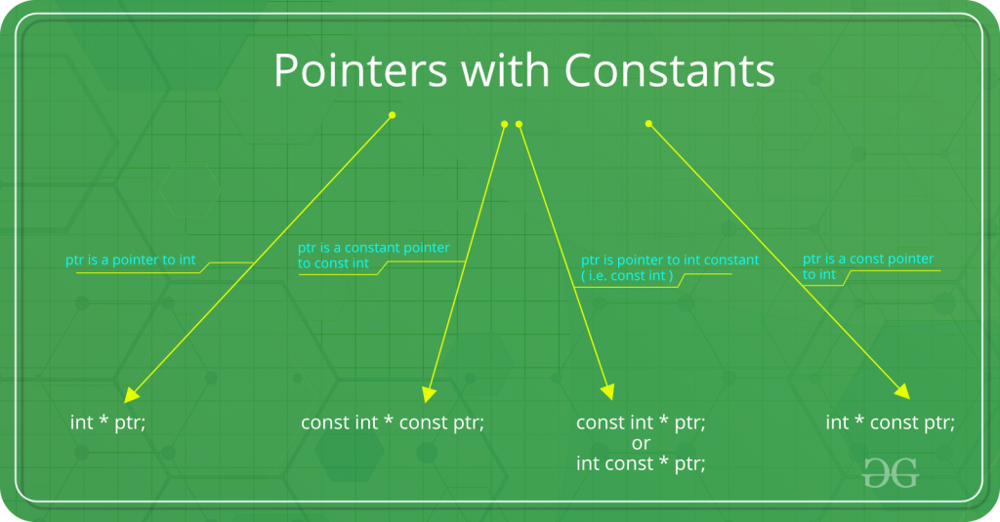

# C++ Primer 5th -- Special Notes

## Part I The Basics

### Chapter 2 Variables and Basic Types

- c++ 里规定，一个int至少和一个short一样大，一个long至少和一个int一样大，一个long long至少和一个long一样大

- long占据的字节数

  > 网上搜索发现，long占据的字节数还和编译器的数据模型相关，具体如下：
  >
  > | Datetype  | LP64 | ILP64 | LLP64 | ILP32 | LP32 |
  > | :-------- | :--- | :---- | :---- | :---- | :--- |
  > | char      | 8    | 8     | 8     | 8     | 8    |
  > | short     | 16   | 16    | 16    | 16    | 16   |
  > | int       | 32   | 64    | 32    | 32    | 16   |
  > | long      | 64   | 64    | 32    | 32    | 32   |
  > | long long | 64   |       |       |       |      |
  > | pointer   | 64   | 64    | 64    | 32    | 32   |
  >
  > 另外一般情况下windows64位一般使用LLP64模型，64位Unix，Linux使用的是LP64模型
  >
  > > https://blog.csdn.net/weixin_40997360/article/details/79948968

- 字面值常量，即那种值一望而知的数据，每个字面值常量都对应一种数据类型。字面值常量的形式和值决定了他的数据类型。

- **字符串字面值**实际上是由常量字符构成的一个数组，编译器在每个字符串结尾加上`\0`

- 初始化与赋值并不相同。初始化的含义是创建变量是赋予其一个初始值；赋值的含义是将对象的当前值擦除，而以一个新值来代替。

- **列表初始化**

  用花括号初始化变量称为列表初始化（list initialization）。当用于内置类型的变量时，如果使用了列表初始化并且初始值存在丢失信息的风险，则编译器会报错。

- 如果想声明一个变量而不定义它，就在变量名前添加关键字`extern`，并且不要显式地初始化变量。**`extern`语句如果包含了初始值就不再是声明了，而变成了定义。**

- 引用为对象起了另一个名字(alternative name)。

  定义引用时，程序把引用和它的初始值绑定（bind）在一起，而不是将初始值拷贝给引用。**引用必须初始化。**

- **const常量必须被初始化。**

  任何对const对象进行赋值（擦写）都会引发错误。

  对象的类型决定了其能做什么操作，所以只能在const类型的对象上执行不改变其内容的操作。

- 常量引用被绑定到另外一个类型

  > 当一个常量引用被绑定到另外一个类型时，
  >
  > ```c++
  > double dval = 3.14;
  > const int &ri = dval;
  > ```
  >
  > 发生的其实是
  >
  > ```c++
  > double dval = 3.14;
  > const int temp = dval;
  > const int &ri = temp;
  > ```
  >
  > 这种情况下，ri绑定了一个临时量。这玩意是编译器生成的,为了确保ri绑定一个整数。
  >
  > 如果ri不是常量，那么就会让ri绑定上temp，而我们ri引用想绑定的是dval，于是c++就禁止将非常量引用绑定到类型不同的对象上。
  >
  > > ```c++
  > > #include <iostream>
  > > using namespace std;
  > > int main()
  > > {
  > >  double dval = 3.14;
  > >  int &ri = dval;
  > >  cout<<ri<<endl;
  > > }
  > > /*
  > > PS C:\Users\Administrator\Desktop> g++ .\Untitled-1.cpp
  > > .\Untitled-1.cpp: In function 'int main()':
  > > .\Untitled-1.cpp:9:16: error: invalid initialization of reference of type 'int&' from expression of type 'double
  > > ```

- :sunny:常量指针&“指针常量”

  

  > 
  >
  > https://www.geeksforgeeks.org/difference-between-const-int-const-int-const-and-int-const/
  >
  > | 语句                  | 含义                                                         | 介绍                                                         | 备注                                               |
  > | --------------------- | ------------------------------------------------------------ | ------------------------------------------------------------ | -------------------------------------------------- |
  > | const int \*ptr       | const int \* is pointer to constant integer                  |                                                              |                                                    |
  > | int const\* ptr       | **int const\*** is pointer to constant integer               | This means that the variable being declared is a pointer, pointing to a constant integer. Effectively, this implies that the pointer is pointing to a value that shouldn’t be changed. Const qualifier doesn’t affect the pointer in this scenario so the pointer is allowed to point to some other address.<br/>The first const keyword can go either side of data type, hence **int const\*** is equivalent to **const int\***. | 更推荐这种，可以很容易读出 ptr is a * to const int |
  > | const int * const ptr | **const int\* const** is a constant pointer to constant integer | This means that the variable being declared is a constant pointer pointing to a constant integer. Effectively, this implies that a constant pointer is pointing to a constant value. Hence, neither the pointer should point to a new address nor the value being pointed to should be changed.<br/>The first const keyword can go either side of data type, hence **const int\* const** is equivalent to **int const\* const**. | ptr is a const * to const int                      |
  > | int* const ptr        | **int \*const** is **const** **pointer** to **int**          | This means that the variable being declared is a constant pointer pointing to an integer. Effectively, this implies that the pointer shouldn’t point to some other address. Const qualifier doesn’t affect the value of integer in this scenario so the value being stored in the address is allowed to change. | ptr is a const * to int                            |
  >
  > 这种从右向左读的方法很有用
  >
  > Using this rule, even complex declarations can be decoded like,
  >
  > - **int \** const** is a **const** **pointer** to **pointer** to an **int**.
  > - **int \* const \*** is a **pointer** to **const** **pointer** to an **int**.
  > - **int const \**** is a **pointer** to a **pointer** to a **const** **int**.
  > - **int \* const \* const** is a **const** **pointer** to a **const** **pointer** to an **int**.

- 顶层&底层指针

  用名词顶层来表示指针是const。而用名词底层表示指针所指的对象是const。

  类似的，顶层可以表示任意对象是常量。

- 类型别名

  ##### ！易错点

  ```c++
  typedef char *pstring;	//pstring 实际上是指向char的指针
  const pstring cstr = 0; // 指向char类型的常量指针
  //如果仅仅是将pstring 换回 char *
  const char *cstr = 0;	//指向const char 的指针。数据类型不是char* ，*成为声明符的一部分，而是char
  //所以不能直接将类型别名替换成原来的样子来理解他。
  ```


### Chapter 3 Strings, Vectors, and Arrays

- **直接初始化和拷贝初始化**

  如果使用等号初始化一个变量，实际上执行的是拷贝初始化（copy initialization），编译器把等号右侧的初始值拷贝到新创建的对象中去。

  如果不使用等号，则执行的是直接初始化（direct initialization）。

  初始值只有一个时，使用两种方法都可以，但是如果初始化的参数有多个，那么一般来说只能用直接初始化的形式。非要用拷贝初始化也得显式地创建一个临时对象用于拷贝。

- **迭代器**的作用和下标类似，但是更加通用。所有标准库容器都可以使用迭代器，但是其中只有少数几种同时支持下标运算符。

- 而数组有个特性，在大多数表达式中，使用数组类型的对象其实是在使用一个指向该数组首元素的指针。

- **typedef**

  ```c++
  using int_array = int[4];
  typedef int int_array[4];
  ```

  > 解释typedef int int_array[4];
  > 关键字typedef用来自定义数据类型，这是所有教材都这样讲的，但不要理解为新创建了一个数据类型，而是将已有的一个类型赋予个新名称而已，即起一个别名。
  > 具体对这个语句来说，别名就是：int_array。而[4]不属于名字，而表示一种已有的数据类型，即：给一个大小为4的int数组取一个别名为int_array。
  > 那如何知道是这样定义的呢？很简单。
  > 首先，int a[4];这可是常见的定义格式。再在其前面添加关键字typedef，变成 typedef int a[4];最后将数组名a改为自己想要的一个别名int_array即可。注意：原本的a本意是数组名，属于变量范畴，而int_array则是新数据类型名（即别名），本质不一样了哦。祥见谭浩强的那本经典教材。

  > **typedef常见用法**
  >
  > https://www.shuzhiduo.com/A/D85476oWJE/
  >

### Chapter 4 Expressions 表达式

- 左值与右值这两个概念是从 C 中传承而来的，左值指既能够出现在等号左边，也能出现在等号右边的变量；右值则是只能出现在等号右边的变量。

  - 左值是可寻址的变量，有持久性；
  - 右值一般是不可寻址的常量，或在表达式求值过程中创建的无名临时对象，短暂性的。

- 赋值运算符满足右结合律。

  ```c++
  int ival, jval;
  ival = jval = 0;    // ok: each assigned 0
  ```

  ##### 赋值运算符优先级较低

- 后置递增运算符优先级高于解引用，所以`*pbeg++` 相当于`*(pbeg++)`。先将pbeg加1，然后将原始副本给求值结果，然后输出，并移动指针。

- **类型转换**

  > ### C++中的类型转换（static_cast、const_cast、dynamic_cast、reinterpret_cast）
  >
  > **1. c强制转换与c++强制转换**
  >
  > c语言[强制类型转换](https://so.csdn.net/so/search?q=强制类型转换&spm=1001.2101.3001.7020)主要用于基础的数据类型间的转换，语法为：
  >
  > ```
  > (type-id)expression//转换格式1
  > 
  > type-id(expression)//转换格式2123
  > ```
  >
  > c++除了能使用c语言的强制类型转换外，还新增了四种强制类型转换：static_cast、dynamic_cast、const_cast、reinterpret_cast，主要运用于继承关系类间的强制转化，语法为：
  >
  > ```
  > static_cast<new_type>      (expression)
  > dynamic_cast<new_type>     (expression) 
  > const_cast<new_type>       (expression) 
  > reinterpret_cast<new_type> (expression)1234
  > ```
  >
  > 备注：new_type为目标数据类型，expression为原始数据类型变量或者表达式。
  >
  > 《Effective C++》中将c语言强制类型转换称为旧式转型，c++强制类型转换称为新式转型。
  >
  > **2. static_cast、dynamic_cast、const_cast、reinterpret_cast**
  >
  > **static_cast**
  >
  > static_cast相当于传统的C语言里的强制转换，该运算符把expression转换为new_type类型，用来强迫隐式转换，例如non-const对象转为const对象，编译时检查，用于非多态的转换，可以转换指针及其他，***但没有运行时类型检查来保证转换的安全性\***。它主要有如下几种用法：
  > ①用于类层次结构中基类（父类）和派生类（子类）之间指针或引用的转换。
  > ***进行上行转换（把派生类的指针或引用转换成基类表示）是安全的；\***
  > ***进行下行转换（把基类指针或引用转换成派生类表示）时，由于没有动态类型检查，所以是不安全的。\***
  > ②用于基本数据类型之间的转换，如把int转换成char，把int转换成enum。这种转换的安全性也要开发人员来保证。
  > ③把空指针转换成目标类型的空指针。
  > ④把任何类型的表达式转换成void类型。
  > 注意：static_cast不能转换掉expression的const、volatile、或者__unaligned属性。
  >
  > 基本类型数据转换举例如下：
  >
  > ```
  > char a = 'a';
  > int b = static_cast<char>(a);//正确，将char型数据转换成int型数据
  > 
  > double *c = new double;
  > void *d = static_cast<void*>(c);//正确，将double指针转换成void指针
  > 
  > int e = 10;
  > const int f = static_cast<const int>(e);//正确，将int型数据转换成const int型数据
  > 
  > const int g = 20;
  > int *h = static_cast<int*>(&g);//编译错误，static_cast不能转换掉g的const属性1234567891011
  > ```
  >
  > 类上行和下行转换：
  >
  > ```
  > if(Derived *dp = static_cast<Derived *>(bp)){//下行转换是不安全的
  > //使用dp指向的Derived对象  
  > }
  > else{
  > //使用bp指向的Base对象  
  > }
  > 
  > if(Base*bp = static_cast<Derived *>(dp)){//上行转换是安全的
  > //使用bp指向的Derived对象  
  > }
  > else{
  > //使用dp指向的Base对象  
  > }12345678910111213
  > ```
  >
  > **dynamic_cast**
  >
  > ```
  > dynamic_cast<type*>(e)
  > dynamic_cast<type&>(e)
  > dynamic_cast<type&&>(e)123
  > ```
  >
  > type必须是一个类类型，在第一种形式中，type必须是一个有效的指针，在第二种形式中，type必须是一个左值，在第三种形式中，type必须是一个右值。在上面所有形式中，e的类型必须符合以下三个条件中的任何一个：e的类型是是目标类型type的公有派生类、e的类型是目标type的共有基类或者e的类型就是目标type的的类型。如果一条dynamic_cast语句的转换目标是指针类型并且失败了，则结果为0。如果转换目标是引用类型并且失败了，则dynamic_cast运算符将抛出一个std::bad_cast异常(该异常定义在typeinfo标准库头文件中)。e也可以是一个空指针，结果是所需类型的空指针。
  >
  > dynamic_cast主要用于类层次间的上行转换和下行转换，还可以用于类之间的交叉转换（cross cast）。
  > 在类层次间进行上行转换时，dynamic_cast和static_cast的效果是一样的；
  > ***在进行下行转换时，dynamic_cast具有类型检查的功能，比static_cast更安全。dynamic_cast是唯一无法由旧式语法执行的动作，也是唯一可能耗费重大运行成本的转型动作。\***
  >
  > （1）指针类型
  > 举例，Base为包含至少一个虚函数的基类，Derived是Base的共有派生类，如果有一个指向Base的指针bp，我们可以在运行时将它转换成指向Derived的指针，代码如下：
  >
  > ```
  > if(Derived *dp = dynamic_cast<Derived *>(bp)){
  > //使用dp指向的Derived对象  
  > }
  > else{
  > //使用bp指向的Base对象  
  > }123456
  > ```
  >
  > 值得注意的是，在上述代码中，if语句中定义了dp，这样做的好处是可以在一个操作中同时完成[类型转换](https://so.csdn.net/so/search?q=类型转换&spm=1001.2101.3001.7020)和条件检查两项任务。
  >
  > （2）引用类型
  >
  > 因为不存在所谓空引用，所以引用类型的dynamic_cast转换与指针类型不同，在引用转换失败时，会抛出std::bad_cast异常，该异常定义在头文件typeinfo中。
  >
  > ```
  > void f(const Base &b){
  > try{
  > const Derived &d = dynamic_cast<const Base &>(b);  
  > //使用b引用的Derived对象
  > }
  > catch(std::bad_cast){
  > //处理类型转换失败的情况
  > }
  > }123456789
  > ```
  >
  > **const_cast**
  >
  > const_cast，用于修改类型的const或volatile属性。
  > 该运算符用来修改类型的const(唯一有此能力的C++-style转型操作符)或volatile属性。除了const 或volatile修饰之外， new_type和expression的类型是一样的。
  > ①常量指针被转化成非常量的指针，并且仍然指向原来的对象；
  > ②常量引用被转换成非常量的引用，并且仍然指向原来的对象；
  > ③const_cast一般用于修改底指针。如const char *p形式。
  >
  > 举例转换如下：
  >
  > ```
  > const int g = 20;
  > int *h = const_cast<int*>(&g);//去掉const常量const属性
  > 
  > const int g = 20;
  > int &h = const_cast<int &>(g);//去掉const引用const属性
  > 
  > const char *g = "hello";
  > char *h = const_cast<char *>(g);//去掉const指针const属性12345678
  > ```
  >
  > **reinterpret_cast**
  >
  > new_type必须是一个指针、引用、算术类型、函数指针或者成员指针。它可以把一个指针转换成一个整数，也可以把一个整数转换成一个指针（先把一个指针转换成一个整数，再把该整数转换成原类型的指针，还可以得到原先的指针值）。
  >
  > ***reinterpret_cast意图执行低级转型，实际动作（及结果）可能取决于编辑器，这也就表示它不可移植。\***
  >
  > 举一个错误使用reintepret_cast例子，将整数类型转换成函数指针后，vc++在执行过程中会报”…中的 0xxxxxxxxx 处有未经处理的异常: 0xC0000005: Access violation”错误：
  >
  > ```
  > #include <iostream>
  > using namespace std;
  > int output(int p){
  >  cout << p <<endl;
  > 　　return 0;
  > }
  > 
  > typedef int (*test_func)(int );//定义函数指针test_func
  > int main(){
  >  int p = 10;
  >  test_func fun1 = output;
  >  fun1(p);//正确
  >  test_func fun2 = reinterpret_cast<test_func>(&p);
  >  fun2(p);//...处有未经处理的异常: 0xC0000005: Access violation
  >  return 0;
  > }12345678910111213141516
  > ```
  >
  > IBM的C++指南、C++之父Bjarne Stroustrup的FAQ网页和MSDN的Visual C++也都指出：错误的使用reinterpret_cast很容易导致程序的不安全，***只有将转换后的类型值转换回到其原始类型，这样才是正确使用reinterpret_cast方式。\***
  >
  > MSDN中也提到了，实际中可将reinterpret_cast应用到哈希函数中，如下（64位系统中需将unsigned int修改为unsigned long）：
  >
  > ```
  > // expre_reinterpret_cast_Operator.cpp
  > // compile with: /EHsc
  > #include <iostream>
  > 
  > // Returns a hash code based on an address
  > unsigned short Hash( void *p ) {
  > unsigned int val = reinterpret_cast<unsigned int>( p );
  > return ( unsigned short )( val ^ (val >> 16));
  > }
  > 
  > using namespace std;
  > int main() {
  > int a[20];
  > for ( int i = 0; i < 20; i++ )
  >    cout << Hash( a + i ) << endl;
  > }12345678910111213141516
  > ```
  >
  > 另外，static_cast和reinterpret_cast的区别主要在于多重继承，比如
  >
  > ```
  > class A {
  >  public:
  >  int m_a;
  > };
  > 
  > class B {
  >  public:
  >  int m_b;
  > };
  > 
  > class C : public A, public B {};1234567891011
  > ```
  >
  > 那么对于以下代码：
  >
  > ```
  > C c;
  > printf("%p, %p, %p", &c, reinterpret_cast<B*>(&c), static_cast <B*>(&c));12
  > ```
  >
  > 前两个的输出值是相同的，最后一个则会在原基础上偏移4个字节，这是因为static_cast计算了父子类指针转换的偏移量，并将之转换到正确的地址（c里面有m_a,m_b，转换为B*指针后指到m_b处），而reinterpret_cast却不会做这一层转换。
  >
  > 因此, 你需要谨慎使用 reinterpret_cast。
  >
  > **3. c++强制转换注意事项**
  >
  > 新式转换较旧式转换更受欢迎。原因有二，一是新式转型较易辨别，能简化“找出类型系统在哪个地方被破坏”的过程；二是各转型动作的目标愈窄化，编译器愈能诊断出错误的运用。
  > 尽量少使用转型操作，尤其是dynamic_cast，耗时较高，会导致性能的下降，尽量使用其他方法替代。

  

### Chapter 5 Statements 语句

- 空语句

  如果在程序的某个地方，语法上需要一条语句但是逻辑上不需要，则应该使用空语句（null statement）。空语句中只含有一个单独的分号`;`。

- 悬垂else（dangling else）

  C++ 规定，else与离它最近的，尚未匹配的if匹配。可以通过花括号包成块，使else与想要的if进行匹配。


### Chapter 6 Functions

- 典型的函数定义包括返回类型（return type）、函数名字、由0个或多个形式参数（parameter，简称形参）组成的列表和函数体（function body）。函数执行的操作在函数体中指明。

- 函数调用完成两项工作：

  - 用实参初始化对应的形参。
  - 将控制权从主调函数转移给被调函数。此时，主调函数（calling function）的执行被暂时中断，被调函数（called function）开始执行。

- 形参的类型决定了形参和实参交互的方式：

  - 当形参是引用类型时，它对应的实参被引用传递（passed by reference），函数被传引用调用（called by reference）。引用形参是它对应实参的别名。
  - 当形参不是引用类型时，形参和实参是两个相互独立的对象，实参的值会被拷贝给形参（值传递，passed by value），函数被传值调用（called by value）。

- 指针或引用形参与const

  类似通用的初始化规则，可以使用非常量对象初始化一个底层`const`形参，但是反过来不行。

- 尽量使用常量引用

  把函数不会改变的形参定义成普通引用会极大地限制函数所能接受的实参类型，同时也会给别人一种误导，即函数可以修改实参的值。

- 二维数组作为函数参数，实参可以直接使用二维数组名，在被调用函数中对形参数组定义可以指定所有维数的大小，也可以省略第一维的大小说明,但不能省略第二维的大小.

- `main`函数可以没有`return`语句直接结束。如果控制流到达了`main`函数的结尾处并且没有`return`语句，编译器会隐式地插入一条返回0的`return`语句。

- C++11允许使用尾置返回类型（trailing return type）简化复杂函数声明。尾置返回类型跟在形参列表后面，并以一个`->`符号开头。为了表示函数真正的返回类型在形参列表之后，需要在本应出现返回类型的地方添加`auto`关键字。

  ```c++
  // fcn takes an int argument and returns a pointer to an array of ten ints
  auto func(int i) -> int(*)[10];
  ```

  任何函数的定义都能使用尾置返回类型，但是这种形式更适用于返回类型比较复杂的函数

- const_cast 和重载

  【4.11.3】提到`const_cast`可以用于函数的重载。当函数的实参不是常量时，将得到普通引用。

  `const_cast`可以擦写对象的底层const性质。

  这个版本的函数中， 首先将实参强制转换成对const的引用，然后调用了`shortString`函数的const版本，const版本返回对`const string`的引用，这个引用实际上绑定在某个初始的非常量实参上，因此我们可以将其转换回一个普通的`string&`

  ，这是安全的。

  ```c++
  // return a reference to the shorter of two strings
  const string &shorterString(const string &s1, const string &s2)
  {
      return s1.size() <= s2.size() ? s1 : s2;
  }
  
  string &shorterString(string &s1, string &s2)
  {
      auto &r = shorterString(const_cast<const string&>(s1),
                      const_cast<const string&>(s2));
      return const_cast<string&>(r);
  }
  ```

- ##### 在不同的作用域中无法重载函数名。**一旦在当前作用域内找到了所需的名字，编译器就会忽略掉外层作用域中的同名实体。**

- 默认实参作为形参的初始值出现在形参列表中。可以为一个或多个形参定义默认值。

  **不过一旦某个形参被赋予了默认值，它后面的所有形参都必须有默认值。**

- 将函数指定为内联函数，会在每个调用点上“内联地”展开，省去函数调用所需的一系列工作。定义内联函数时需要在函数的返回类型前添加关键字`inline`。

- 为了确定最佳匹配，编译器将实参类型到形参类型的转换划分为几个类型。

  1. 精确匹配
     - 实参类型和形参类型相同
     - 实参从数组类型或函数类型转换成对应的指针类型【6.7 - 函数指针】
     - 向实参添加顶层const或者从实参中删除顶层const
  2. 通过const转换【4.11.2】实现的匹配（非常量变成常量）
  3. 通过类型提升【4.11.1】实现的匹配
  4. 通过算术类型转换【4.11.1】或指针转换【4.11.2】实现的匹配
  5. 通过类类型转换实现的匹配【14.9】

### Chapter 7 Classes 类

- 类的基本思想是**数据抽象（data abstraction）**和**封装（encapsulation）**。

  - 数据抽象是一种依赖于**接口（interface）**和实现**（implementation）**分离的编程及设计技术。
    - 类的接口包括用户所能执行的操作；类的实现包括类的数据成员、负责接口实现的函数体以及其他私有函数。
  - 封装实现了类的接口和实现的分离。封装后的类隐藏了它的实现细节，也就是说，类的用户只能使用接口而无法访问实现部分。

- `this`是类自带的指针，指代的是对象本身。`*this`对指针[解引用](https://so.csdn.net/so/search?q=解引用&spm=1001.2101.3001.7020)，因此使用`*this`返回的就是一个对象本身。这样的操作可以满足连续的= (赋值操作)。

  return *this返回的是当前对象的克隆或者本身（若返回类型为A， 则是拷贝， 若返回类型为A&， 则是本身 ）。return this返回当前对象的地址（指向当前对象的指针）

- 构造函数初始值列表（constructor initializer list）负责为新创建对象的一个或几个数据成员赋初始值。形式是每个成员名字后面紧跟括号括起来的（或者在花括号内的）成员初始值，不同成员的初始值通过逗号分隔。当某个数据成员被构造函数初始值列表忽略时，它会以与合成默认构造函数相同的方式隐式初始化。

- **友元**声明仅仅指定了访问权限，而并非一个通常意义上的函数声明。如果希望类的用户能调用某个友元函数，就必须在友元声明之外再专门对函数进行一次声明（部分编译器没有该限制）。

- 使用关键字`mutable`可以声明**可变数据成员**（mutable data member）。可变数据成员永远不会是`const`的，即使它在`const`对象内。因此`const`成员函数可以修改可变成员的值。

- 7.3.2 Functions That **Return *this**

  与【7.1.2】类似的，为了连续的左值调用，需要返回对象本身而不是副本拷贝，所以返回类型得是引用。

  ##### 从const成员函数返回*this

  `const`成员函数如果以引用形式返回`*this`，则返回类型是常量引用。无法嵌入一组动作的序列中去。

  ```c++
  Screen myScreen;
  my Screen.display(cout).set('*');//如果display的const版本返回，会是常量引用，显然set函数无法set一个常量。
  ```

  ##### 基于const 的重载

  通过区分成员函数是否为`const`的，可以对其进行重载。在常量对象上只能调用`const`版本的函数；在非常量对象上，尽管两个版本都能调用，但会选择非常量版本。

  ```c++
  public:
      Screen &display(std::ostream &os) 
                    { do_display(os); return *this; }
      const Screen &display(std::ostream &os) const
                    { do_display(os); return *this; }
  private:
       // function to do the work of displaying a Screen
       void do_display(std::ostream &os) const {os << contents;}
  };
  ```

  调用过程描述：

  ​	一个成员在调用另一个成员时，this指针在其中隐式地传递。

  - display是非常量版本时，this指针将隐式地从执行非常量的指针转换成执行常量的指针【4.11.2】；do_display完成后，display函数各自`return *this`，非常量版本中，this指向一个非常量对象，因此display返回一个普通的非常量引用。
  - 如果说const成员返回一个常量引用。

  > ## :sunny:const 在函数中的位置与作用
  >
  > ```c++
  > const int fun(const int var) const;
  > ```
  >
  > 1、 第一个const：函数的返回值是const。
  >
  > 此处返回const值,意思指返回的原函数里的变量的初值不能被修改,但是函数按值返回的这个变量被制成副本,能不能被修改就没有了意义,它可以被赋给任何的const或非const类型变量,完全不需要加上这个const关键字.但这只对于内部类型而言(因为内部类型返回的肯定是一个值,而不会返回一个变量,不会作为左值使用),对于用户自定义类型,返回值是常量是非常重要的 [2].
  >
  > ```c++
  > #include <iostream>
  > using namespace std;
  > 
  > class A
  > {
  > public:
  > int _a;
  > A(int a):_a(a){}
  > friend const A operator +(const A& lft,const A& rgt)
  > {
  > return A(lft._a + rgt._a);
  > }
  > };
  > 
  > int main()
  > {
  > A a(1),b(3),c(7);
  > a + b = c; //error: passing 'const A' as 'this' argument discards qualifiers [-fpermissive]|
  > A result = a + b + c; // 11
  > cout << result._a << endl;
  > return 0;
  > }
  > 
  > ```
  >
  >
  > + 运算符重载加const 约束 对 a+b+c 这样的运算没有影响，因为a+b 运算的结果是const ，但对其只是只读操作，会创建一个新的 A 类返回。
  >
  > 2、第二个const：函数参数是const。传递过来的参数var在函数内不可以改变，一般我们的只读参数需要使用const来加以保护；
  >
  > 3、第三个const：该函数是const。编译器会对这个函数进行检查,在这个函数中的任何试图改变成员变量和调用非const成员函数的操作都被视为非法。
  > 如：
  >
  > ```c++
  > int Stack::functiont(void)  const 
  > { 
  >    ++ m_num; // 编译错误，企图修改数据成员 m_num 
  >    Pop();  // 编译错误，企图调用非const 函数 
  >    return m_num; 
  >  }
  > ```
  >
  > 参考：
  > [c++函数返回类型什么情况带const](https://www.cnblogs.com/Azhu/p/4352613.html)
  > [C++中const的不同位置的用法](https://blog.csdn.net/liujuan0827/article/details/73692774)
  > ————————————————
  > 版权声明：本文为CSDN博主「十一月zz」的原创文章，遵循CC 4.0 BY-SA版权协议，转载请附上原文出处链接及本声明。
  > 原文链接：https://blog.csdn.net/baidu_35679960/article/details/83504018

- 抑制构造函数定义的隐式转换

  在要求隐式转换的程序上下文中，可以通过将构造函数声明为`explicit`的加以阻止。**explicit构造函数只能用于直接初始化**，执行拷贝初始化时（使用`=`）会发生隐式转换.

- 使用关键字`static`可以声明类的**静态成员**。静态成员存在于任何对象之外，对象中不包含与静态成员相关的数据。由于静态成员不与任何对象绑定，因此静态成员函数不能声明为`const`的，也不能在静态成员函数内使用`this`指针。静态数据成员的类型可以是不完全类型，可以是它所属的类类型。而非静态数据成员则受到限制，只能声明成它所属类的指针或引用。


