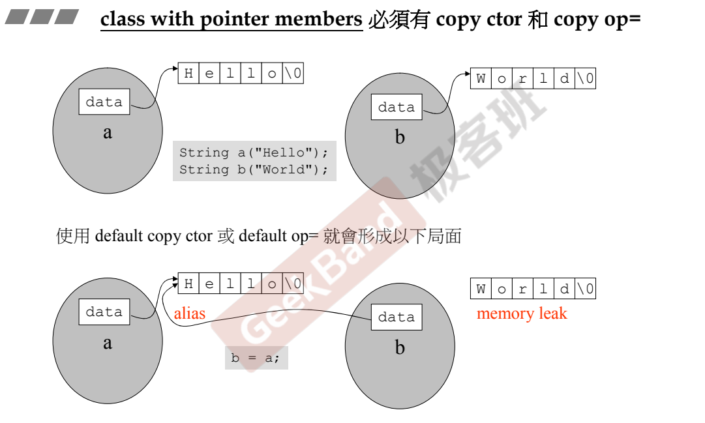
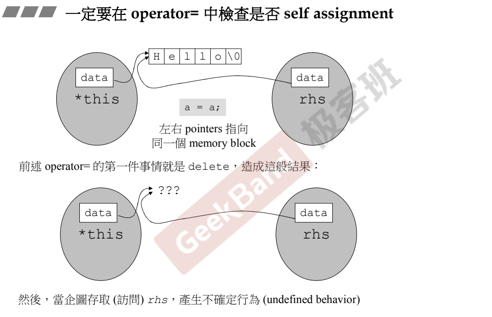
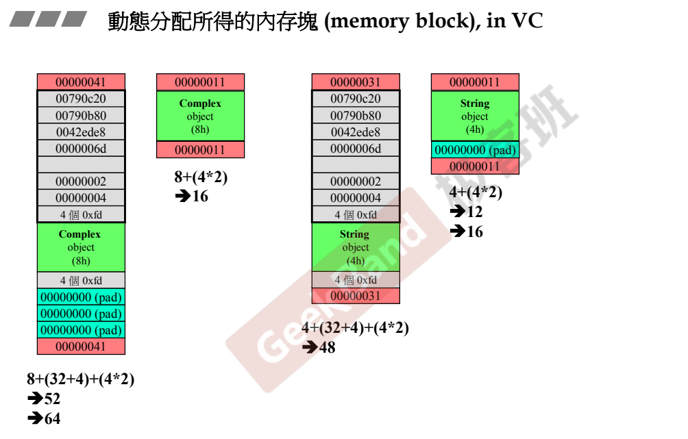
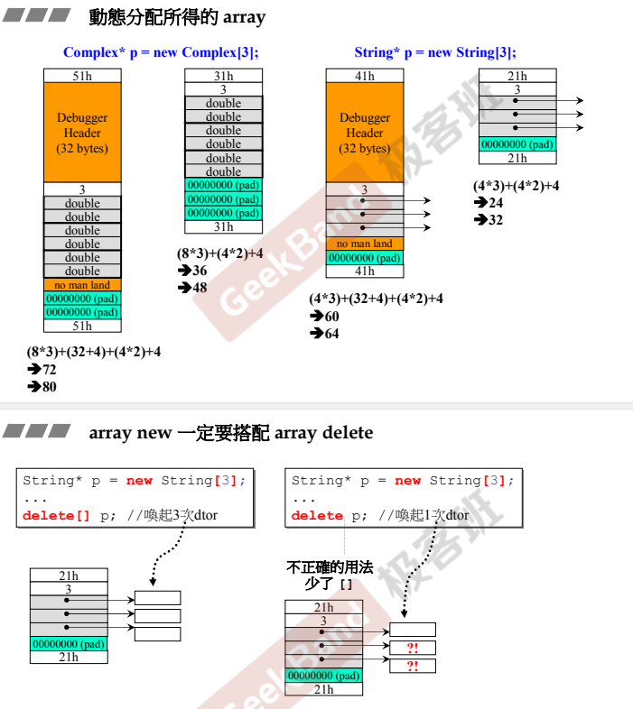
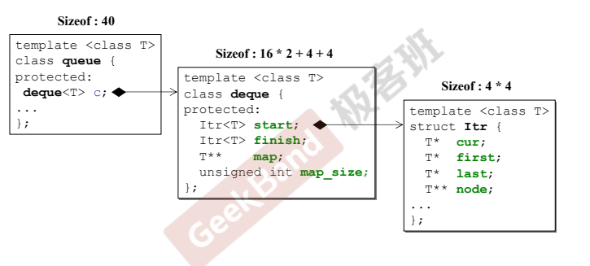

# C++面向对象高级编程

## 一、C++编程简介

### 面向对象是一种观念

### 学习目标

- 培养正规的、大气的编程习惯

- 以良好的方式编写C++ class  --  Object Based **基于对象**
  - class without pointer members  --  Complex
  - class with pointer members  --  String
- 学习Classes之间的关系  --  Object Oriented **面向对象**
  - 继承 inheritance
  - 复合 composition
  - 委托 delegation

### C++ 由语言 + 标准库组成

现在标准库占据越来越多的比重 

## 二、头文件与类的声明

面向对象将数据和数据之上的操作打包成类。

### 对class的分类

#### 不带指针 -- 举例：复数 complex

#### 带指针     -- 举例：字符串 string -- 一个指针


### C++ 代码基本形式

#### 头文件

##### 头文件引入

标准库<>

自己写的 ""

##### :sunny:<font color='#DB4437'>头文件的防卫式声明</font>

```c++
#ifndef __标记__
#define __标记__
...
#endif
```

##### 类

##### 模板

抽出类型

#### 主程序


## 以complex举例

## 三、构造函数

### inline 内联函数

函数在class body内定义完成定义，成为inline。

不在body内，需要手动加inline。

具体是否inline ， 由编译器决定。太复杂就没法inline。

### 访问级别

#### public

方法、函数

#### private

数据、私有函数

### 构造函数 constructor (ctor)

构造函数名称一定要和类的名称一样。

参数，可以有默认值。

不需要有返回值

#### 初始化与赋值

数值的设置有两个阶段，初始化与赋值。

:sunny:<font color='#DB4437'>尽量使用初始化，以提高效率。</font>

```c++
complex (double r = 0,double i = 0)
    : re(r),im(i) // 初始列，初值列
    {}

complex (double r = 0,double i = 0)
    { re = r ; im = i;} //赋值，放弃了初始化的环节 ，效率差
```


不带指针的类，多半不用写析构函数。

#### 构造函数可以用很多个 --  overloading 重载

函数名不光是名字，还有参数和返回类型。

#### :sunny:默认函数很容易出错的一点

```c++
//构造函数
complex (double r = 0.double i = 0)
    : re(r),im(i)
    {}
complex () : re(0),im(0){}  

//调用
{
    complex c1;
    complex c2(); // 这里侯捷老师这样写，但是visualstudio 不让将空参这样写。要去掉括号
}
```


因为第一个构造函数提供了所有的默认实参[c++primer 7.5.1]，那么就算不提供参数，也能进行初始化，所以编译器就不知究竟该调用哪个构造函数了。

## 四、参数传递与返回值

### ctor可以放在private

constructor如果放在private区域，则不允许被外界创建对象。

**设计模式 -- Singleton 单例，外界只能用一份**

```c++
class A {
public:
	static A& getInstance();
	void setup(){};
private:
	A();
	A(const A& rhs);

};
A& A::getInstance()
{
	static A a;
	return a;
	// TODO: 在此处插入 return 语句
}

//取得那一份
A::getInstance().setup();
```

### :sunny:常量成员函数

设计接口时候需要考虑好，数据会不会改变，要不要加const

```c++
double real() const {return re;}
double imag() const {return im;}
//不会改变数据，函数后面名加const，表示函数不会改变数据内容。 
```

如果两个函数没加const，函数体里来一个`const complex c2(2,1)`，那么就没法使用这两个函数。本质上还是非常量可以隐式转换为常量，反之则不行。常量不能随意去调用非常量成员函数。

### :sunny:参数传递：传值&传址

引用在底层就是一个const 指针。所以传递效率快。

<font color='#DB4437'>参数传递尽量传reference</font>。

返回值传递尽量传reference。

### 友元

在类里面声明友元，则自动取得其private成员。

:sunny:**相同class 的各个objects 互为友元。**

```c++
#ifndef __COMPLEX_H__
#define  __COMPLEX_H__

#include <iostream>
using namespace std;

class complex {
public:
	complex(double a = 0, double b = 0) :re(a), rs(b)
	{

	}

	//这里直接访问传入参数的private数据
	double func(const complex& param)
	{
		return param.re + param.rs;
	}

private:
	double re, rs;
};


void Test_complex() {
	complex a1(2, 1);
	complex a2;
	std::cout << a2.func(a1);   //输出为3
	//std::cout<<a1.re;	//错误，不能访问
}
#endif
```

### class body 外的各种定义

reference什么时候不可以用？（参数传递&return返回）

- 传递函数生成的临时变量

```c++
inline complex& 
_doapl(complex* ths,const complex& r){
    ths->re += r.re;
    ths->im += r.im;
    return *ths;
}
inline complex&
complex::operator += (const complex& r){
    return _doapl (this,r);
}
```


## 五、操作符重载与临时对象

###   操作符重载-1 成员函数

```c++
inline complex&
__doapl(complex* ths,const complex& r){
	ths->re += r.re;
    the->im += r.im;
    return *ths;
}

inline complex& //真正写代码的时候不能写this，实际上是隐含的。指向调用者
complex::operator += (this,const complex& r){
    return __doapl(this,r);
}
```

`doapl`   do assignment plus。 赋值加法。

- 注意，`return *ths` 返回的是指针的值，但是传递者无需知道接受者是以reference的形式来接受。如果返回值，会产生不必要的临时变量。
- 如果是void类型，两个参数也能跑，但是`c3+=c2+=c1;`就过不了关了。

###  操作符重载-2 非成员函数

```c++
inline complex
operator + (const complex& x,const complex& y){
    return complex (real(x) + real (y) ,imag(x) + imag (y));
} 
```

- 成员函数形式和非成员函数只能写一个。

- 全局函数没有this指针。

- 返回值不能是reference，因为他们返回的必定是local reference，不同于成员函数，本身就有左值，而全局函数，离开函数数据就死亡了。所以不能return by reference。
- `类名（）` 创建一个临时对象，生命到下一行就结束了。

- 理论上，下面的取正操作，没有改变传入的对象，可以返回reference，但是标准库没有这么做。

```c++
inline complex
operator + (const complex& x){
	return x;
}
```

- `<<` 只能写成全局函数，因为`cout`这些东西都是老东西。不指望他们能适配成员函数版本的操作符。且不能写成const。
- 乍一看`<<`结果输出到屏幕，数据没用了，可以用void，但是如果迭代使用，那么还是不行。

### 本章总结

设计一个class 要注意

- 构造函数的初始化参数列表要会用，能初始化别赋值
- 函数要不要加`const`一定要考虑

- 尽量考虑传reference
- return 是回reference，还是value要考虑
- 函数大多放在public， 数据放在private


## 第六章 复习Complex 类的实现过程

1. 防卫式的头文件定义
2. 考虑复数类需要什么数据（实部虚部），数据是什么类型。
3. 构造函数（构造函数没有返回类型）
   1. 考虑需不需要默认值
   2. 考虑参数传递是传值还是传引用
   3. 使用初值列语法  
   4. 考虑构造函数还需要做什么 `{ }`
4. 这个类支持哪些操作？
   1. 设计为成员函数 -- 隐含this
   2. 设计为非成员函数
   3. 注意是否需要加const
5. 是否需要加友元（友元可以访问private）
6. 如果你最后返回值不是local object，就可以传引用 时刻注意return type
7. 一些操作不作为成员函数，是为了它具有更多的泛用性，比如“加”，不光是复数可以用，实数加复数等等。


## 以String举例

## 第七章 三大函数：拷贝构造、拷贝赋值、析构

带指针的类不能使用编译器默认的拷贝，要自己写。

class with pointer members 必须有copy ctor 和copy op=   

#### **深拷贝与浅拷贝**



浅拷贝一方面会造成别名，一方面会造成内存泄漏，非常危险。


#### 拷贝赋值 copy op=

1. 清空待赋值空间
2. 开辟一块足够复制的空间
3. 复制

注：需要注意一定要检测是否自赋值




```c++
//String.h
#ifndef __MYSTRING__
#define __MYSTRING__

class String
{
public:                                 
    String(const char* cstr = 0);
    String(const String& str);//接受自己这种东西--拷贝构造
    String& operator =(const String& str);//操作符重载--赋值自己这种东西--拷贝赋值
    ~String();//析构函数        
   ~String();                                    
   char* get_c_str() const { return m_data; }
private:
   char* m_data;
};

#include <cstring>

inline
String::String(const char* cstr)
{
   if (cstr) {
      m_data = new char[strlen(cstr)+1];
      strcpy(m_data, cstr);
   }
   else {   
      m_data = new char[1];
      *m_data = '\0';
   }
}

inline
String::~String()
{
   delete[] m_data;
}

inline
String& String::operator=(const String& str)
{
   if (this == &str) // 检测是否是自我赋值 
      return *this;

   delete[] m_data;
   m_data = new char[ strlen(str.m_data) + 1 ];
   strcpy(m_data, str.m_data);
   return *this;
}

inline
String::String(const String& str)
{
   m_data = new char[ strlen(str.m_data) + 1 ];
   strcpy(m_data, str.m_data);
}

#include <iostream>
using namespace std;

ostream& operator<<(ostream& os, const String& str)
{
   os << str.get_c_str();
   return os;
}

#endif

```

```c++
//string_test.cpp
#include "string.h"
#include <iostream>

using namespace std;

int main()
{
  String s1("hello"); 
  String s2("world");
  String *p = new String("yah");
  delete p;//动态分配，需要手动释放
  String s3(s2);
  cout << s3 << endl;
  
  s3 = s1;
  cout << s3 << endl;     
  cout << s2 << endl;  
  cout << s1 << endl;      
}
```


## 第八章 堆、栈与内存管理

###  Stack栈

所谓栈，是存在于某作用域scope的一块内存空间 `memory space`。 例如当你调用函数，函数本身即会形成一个stack用来放置它所接收的参数，以及返回地址。

在函数本体内声明的任何变量，其所使用的内存块都取自上述stack。

`stack object` ，其生命在作用域`scope`结束之际结束，这种作用域内的`object`，又称为`auto object`，因为他会被自动清理。

### Heap堆

所谓堆，或谓 `system heap`，是指由操作系统提供的一块global 内存空间，程序可动态分配 `dynamic allocated` 从某种获得若干区块 `blocks`.

`heap object` ，生命在`delete`之际结束

**new出来的内存空间，有义务在函数结束前手动处理掉。**

### Static 静态对象

`static object`，其生命在作用域scope结束后依然存在，直到整个程序结束。

### 全局数据区

静态变量跟全局变量一样，存放在全局数据段，程序载入时分配空间，位置固定不再变化
堆和栈的空间是动态变化的


#### New

new: 先分配memory，再调用ctor。

```c++
Complex* pc = new Complex(1,2);
==
Complex *pc;
void* mem = operator new(sizeof(Complex));  // 底部调用malloc，分配内存
pc = static_cast<Complex*>(mem);		//转型 将void*转化为Complex*
pc->Complex::Complex(1,2);			//构造函数 = Complex::Complex(this,1,2);
```

#### delete

delete: 先调用析构，再释放内存

```c++
delete pc;
==  
String::~String(ps);	//析构函数
operator delete(ps);    //底部是free(ps),释放内存
```

#### 动态分配内存细节



1. 在VC环境，调试模式下，new的块前面会加32，后面会加4，加上本身两个double的8，和两个cookie 8，所以一共52，而内存分配一定是16的倍数，所以52最近的是64 。
2. cookie 主要是为了记录区块的大小，便于回收。64 的16进位是40，而用最后一位表示给出去1，收回0，所以是41。这里有个小tip，因为是16的倍数，所以bit位最后四位都是0，所以不会有冲突。也算是废空间利用了。
3. 字符串本身只内含一根指针，大小为4。

#### 动态分配内存-数组



1. 两个double一组，乘3，然后加上32+4的dubug头尾，加上cookie4*2，加上标记数组数量的4字节。共72，补全80。
2. 每个对象死亡之前，析构函数都要被调用。所以array new 要array delete。不然会造成数组后面的内存泄露。
3. 如果这里不是string 而是复数，由于其不带指针，且没有动态分配内存，所以不用array delete也行。但是要养成好习惯，尽量使用array delete


## 第九章 复习String类的实现过程

1. 由于数组需要指明大小，所以在设计字符串这类对象，一般的解决方法是在类里放一根指针(32位4个字节)，动态地去申请内存。

2. 时刻注意要不要加const。  **函数之后加，表示函数不改动数据；参数列表里加，表示不会改动传入的参数**

3. 判断返回类型是不是引用----返回值不是local object，就用引用

4. Big Three 函数，都不能加const，因为这三个都是改变了目的端的数据，不可能不改变。
5. 内存空间在拷贝，赋值时，需要时刻注意要提供足够大的空间。
6. 要考虑种种细节，例如有无初值，**是否自赋值**
7. 尽量让函数成为inline。  
8. 运算符重载，如果返回类型是void，不是String&，不能连贯使用。也要有return *this


## 第十章 拓展补充：类模板、函数模板、及其他


### Static 静态

static 可以规定数据成员或成员函数是静态的。

加了static后，成员/成员函数就和对象脱离了，单独有一个内存区域存储成员/成员函数。**静态的数据只有一份**。没有this指针。

调用静态函数的方式有二：

1. 通过对象object调用，因为是静态，编译器不会放this进入函数。
2. 通过class name 调用 --- 即不建立对象也能使用这个函数

 

#### 将构造函数放在private

**设计模式 -- Singleton 单例，外界只能用一份**

```c++
class A {
public:
	static A& getInstance( return a;);//外界唯一的接口
	void setup(){};
private:
	A();
	A(const A& rhs);
	Static A a;// 唯一的自己
};
//取得那一份
A::getInstance().setup();
```

这种写法有个问题，就是外界不用A，a仍然存在

**设计模式 -- Meyers Singleton 单例**

#todo 回头看effective c++ 时候再说。 静态变量内存不是编译时预先分配吗？

```c++
class A {
public:
	static A& getInstance();
	void setup(){};
private:
	A();
	A(const A& rhs);

};
A& A::getInstance()
{
	static A a; //有人调用函数才会创建，离开函数依然存在。
	return a;
}

//取得那一份
A::getInstance().setup();
```


### cout

```c++
class _IO_ostream_withassign
    : public ostream(
    ...
    );
extern _IO_ostream_withassign cout; // 继承自ostream 
```

ostream 有非常多的重载运算符


### class template 类模板

 对编译器来说，会造成代码的膨胀。但这是必要的代价


### function template 函数模板

```c++
template <class T>
    inline
const T& min(const T& a, const T& b)
{
    return b<a ? b : a;
}

stone r1(2,4),r2(4,4),r3;
r3 = min(r1,r2);//编译器会对function template 进行实参推导。不需要明确指出来class类型。
//最后调用到return语句，调用stone::operator<
```


### namespace 命名空间

- using directive 

  等同于将封锁全部打开，不用写全名。

- using declaration

  一条一条声明

- 写出全部全名。

  


## 第十一章 组合与继承

Object Oriented Programming

Object Oriented Design

### 类和类之间的关系  ----  面向对象

- Inheritance 继承
- Composition 复合
- Delegation 委托 


#### Composition 复合 表示has-a

```c++
template <class T, class Sequence = deque<T> >
class queue{
	...
protected:
    Sequence c; // 底层容器
public:
    //以下都是使用c的操作函数。
    bool empty() const {return c.empty();}
    size_type size() const {return c.size();}
    reference front() {return c.front();}
    reference back() { return c.back();}
    //deque 是两端可进出，queue是先进先出。
    void push(const value_type& x) {c.push_back(x);}
    void pop() {c.pop_front();}
};
```

这种设计模式叫Adapter（适配）。从一个较为完备的类取出一些功能，重新封装。



Container 的构造函数 由内而外，先调用Component的默认构造函数，再执行自己的ctor。

Container 的析构函数从外而内，先调用自己的析构函数，再执行Component的。

可以联想为做胶带球和切胶带球


#### Delegation 委托 - Composition by reference

H andle

```c++
//file String.hpp
class StringRep;
class String{
    public:
    String();
    String(const char* s);
    String(cosnt String& s);
    String &operator(const String& s);
    ~String();
    private:
    StringRep* rep;
};
```

Body

```c++
//file String.cpp
#include "String.hpp"
namespace {
class StringRep{
    StringRep(const char* s);
    ~StringRep();
    int count;
    char* rep;
};
}
String::String(){...}

```

a、这种委托的实现方式是通过`pimpl(point to implementation)`设计模式实现，即通过指针变量指向一个类；

b、构造函数和析构函数在两者间是不同步的；

c、Handle部分提供的是接口部分，底层可以通过Body部分实现不同的操作；

注：内存在共享时，要注意不能牵一发而动全身，比如三个指针指向同一个东西，其中一个要修改指针内容，那么就`Copy on Write`，拷贝出一份单独的供他修改并指向，其余两个不动。

