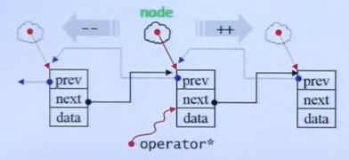
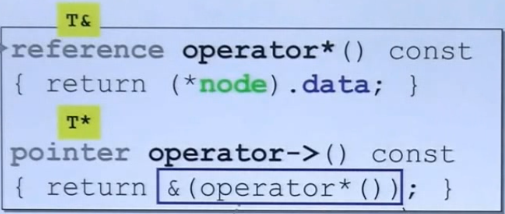
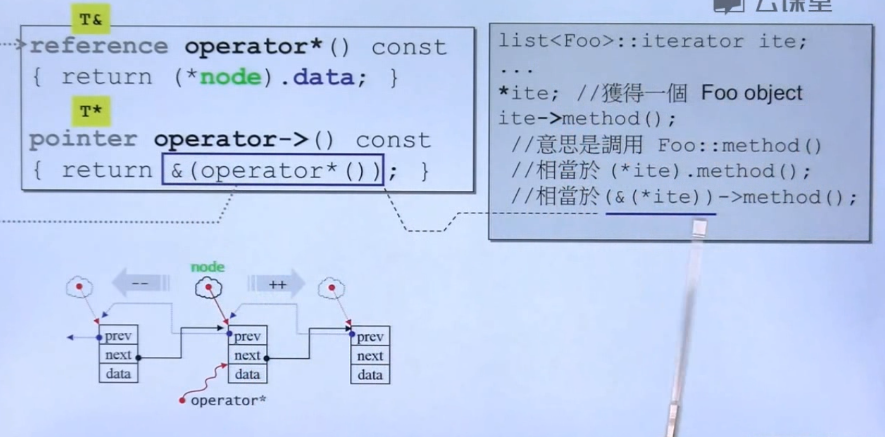

# C++ 程序设计 - 兼谈对象模型

## 导读

 本课程包括模板等等，不仅仅是面向对象。所以叫这个名字、

**勿在浮沙筑高台**

### 课程目标

- 在先前基础课程培养的正规大气的编程素养上，继续探讨更多技术。  

- 泛型编程`Generic Programming` 和面向对象编程 `Object-Oriented Programming` 虽然分属不同思维，但它们正是C++的技术主线，所以本课程也讨论模板。
- 深入探索面向对象值继承关系`inheritance`所形成的对象模型`Object model`，包括隐藏于底层的`this`指针，`vptr`虚指针，`vtbl`虚表，`virtual mechanism` 虚机制，以及虚函数 `virtual functions` 造成的多态` polymorphism`效果。

### 编译器 

- 编译 `compile`
- 链接 `link`


## 转换函数 Conversion Function

#### 以分数举例

```c++
class Fraction{
public:
    Fraction (int num,int den = 1)
    : m_numerator(num),m_denominator(den){}
    operator double() const {
        //return (double)(m_numerator / m_denominator);
        return (double)m_numerator / (double)m_denominator;
    }
private:
    int m_numerator;    //分子
    int m_denominator;  //分母
};

Fraction f(3,5);
double d = 4 + f;
```

`operator 类型 const`

-  转换不可以有参数。

- 前面也不必有类型名（后面已经写了），

- 同时转换不可能改变类里的值，所以通常使用`const`。

`double d = 4 + f;`

首先看有没有配套的重载，结果没有写。

然后看有没有合适的转换，使f是double。

**注：分子分母都需要进行强制转换为double，并不是简单括起来就可以了，编辑环境不管是clion，vstudio，还是linux环境，不进行强制转换，结果都是整数而非分数。**

#### non-explicit-one-argument ctor

```c++
Fraction (int num,int den = 1)
            : m_numerator(num),m_denominator(den){}
```

one-argument: 创建一个Fraction只要一个实参就够了，另外一个的有默认参数。这在数学上也是符合逻辑的。(two parameters)

non-explicit: 没有加explicit

```c++
class Fraction {
public:
    //该构造函数的den参数有默认值，这就形成了单参数构造函数
    Fraction(int num, int den = 1) :m_num(num), m_den(den) {}
    
    Fraction operator +(const Fraction& f) {
        //完成Fraction之间的加法,并返回
        return Fraction(this->m_num*f.m_den + this->m_den*f.m_num, this->m_den*f.m_den);
    }
    int get_num() const {
        return m_num;
    }
    int get_den() const {
        return m_den;
    }
private:
    int m_num;
    int m_den;
};

inline ostream& operator<<(ostream& os,const Fraction& f) {
    os << f.get_num();
    os << "/";
    os << f.get_den();
    return os;
}

Fraction f(10, 3);
//当Fraction对象加一个int时，编译器会自动将4转换为4/1的Fraction对象
Fraction dvi = f + 4 ;
cout << dvi << endl; //输出3/22
```

如果转换和cxoa-ctor并存，会有问题。

```c++
class Fraction {
public:
    //该构造函数的den参数有默认值，这就形成了单参数构造函数
    Fraction(int num, int den = 1) :m_num(num), m_den(den) {}

    //Fraction转double的转换函数
    operator double() const {
        return (double)m_num / (double)m_den;
    }
    
    Fraction operator +(const Fraction& f) {
        //完成Fraction之间的加法,并返回
        return Fraction(this->m_num*f.m_den + this->m_den*f.m_num, this->m_den*f.m_den);
    }
    int get_num() const {
        return m_num;
    }
    int get_den() const {
        return m_den;
    }
private:
    int m_num;
    int m_den;
};

inline ostream& operator<<(ostream& os,const Fraction& f) {
    os << f.get_num();
    os << "/";
    os << f.get_den();
    return os;
}
```

此时，Fraction类的定义中，同时存在单参数构造函数和转换函数。当调用以下代码时（报错）：

```c++
Fraction f(10, 3);
//当Fraction对象加一个int时，编译器会自动将4转换为4/1的Fraction对象
Fraction dvi = f + 4 ;
cout << dvi << endl;
```

Fraction dvi = f + 4;会报错。因为编译器认为，可以把f转换为double，也可以把4转换为Fraction。当把4转换为Fraction时，这条路能走通。但是把f转换为double时，做完加法后，无法将得到的double类型的dvi转换为Fraction，所以报错。

同样的，这样调用也会报错，与上面的过程相反。

```c++
Fraction f(10, 3);
//当Fraction对象加一个int时，编译器会自动将4转换为4/1的Fraction对象
double dvi = f + 4 ;
cout << dvi << endl;
```

**可选择的太多，编译器会不知道怎么办，换句话说编译器不知道判断好坏，他只知道对错。**

这里还可以总结一下， 就是之前的转换函数，是将Fraction转为double。而加号重载，是将double转为Fraction类。


### explict-one-argument ctor

explicit关键字意为“明确的”。很大几率用在构造函数前面，指明该构造函数只做构造函数使用，让编译器不要自动去调用它。

```c++
class Fraction {
public:
    //该构造函数的den参数有默认值，这就形成了单参数构造函数
    explicit Fraction(int num, int den = 1) :m_num(num), m_den(den) {}

    //Fraction转double的转换函数
    operator double() const {
        return (double)m_num / (double)m_den;
    }
    
    Fraction operator +(const Fraction& f) {
        //完成Fraction之间的加法,并返回
        return Fraction(this->m_num*f.m_den + this->m_den*f.m_num, this->m_den*f.m_den);
    }
    int get_num() const {
        return m_num;
    }
    int get_den() const {
        return m_den;
    }
private:
    int m_num;
    int m_den;
};

inline ostream& operator<<(ostream& os,const Fraction& f) {
    os << f.get_num();
    os << "/";
    os << f.get_den();
    return os;
}
```

在构造函数前使用了explicit关键字，也就相当于把前面例子里编译器面对的两条路减少为一条，这就没有冲突了。程序就能正确运行，但只能将f转换为double进行运算。

```c++
Fraction f(10, 3);
//当Fraction对象加一个int时，编译器会自动将4转换为4/1的Fraction对象
double dvi = f + 4 ;
cout << dvi << endl;  //输出7.3333
```

**总结：**explicit很少使用，90%的几率都使用在构造函数之前，还有模板里很小一部分会用到。用作控制编译器的自动行为，减少从中带来的莫名错误。


## Pointer-like class

Pointer-like class 即做出来的对象，像一个指针。例如智能指针就是其中一种。在这种类中，一定包含一个普通的指针。基本都会包括`.` `->`的重载。

### 智能指针 

```c++
template<class T>
class shared_ptr {
public:
    T& operator*() const {
        return *px;
    }
    T* operator->() const {
        return px;
    }
    //构造函数
    shared_ptr(T* p):px(p) {}
private:
    T* px;
};
//测试类，将其对象指针包装成shared_ptr智能指针
class Test {
public:
    void mytest() {
        printf("testing...\n");
    }
};
```

`注意T& operator*() const;和T* operator->() const;两个操作符重载函数，其中“*”的重载函数很好理解，就是取指针指向地址的数据。但是“->”符号的重载不太好理解，这是因为在C++中，->这个符号比较特殊，这个符号除了第一次作用在shared_ptr对象上，返回原始指针px，还会继续作用在px上，用来调用函数m ytest。但好在重载这个符号，基本就是这种固定写法。`

```c++
Test a;
//Foo f(*sp); 从sp中取出数据进入Foo的构造函数。  
shared_ptr<Test> ptr(&a);
ptr->mytest();
```

### 迭代器

迭代器类型的Pointer-like和智能指针的Pointer-like有一定的区别。

作为迭代器，他将一个对象（结构体或类产生的对象）的指针包装为一个迭代器（类指针对象），例如链表的某个节点指针，这样，在他的内部重载多个操作符，比如“*”、“->”、“++”、“--”、“==”、“!=”等，分别对应链表节点之间的取值、调用、右移、左移、判断等于、判断不等于。
链表的基本结构图：



 迭代器中“*”和“->”的重载：



图中所示，迭代器中的“*”，返回的是某个node中的data，而不是这个node（这些实现都是根据用户需求来实现）。

`迭代器中的“->”返回的是data的指针，因为operator*()就是调用“*”的重载函数，返回data数据，前面再使用“&”来取地址，则就是data的指针。从而可以达到使用“->”来完成data->func_name()的目的。`



举一反三，其他的符号重载也是根据用户需求来做相应的操作。

所以说操作符重载非常重要。

