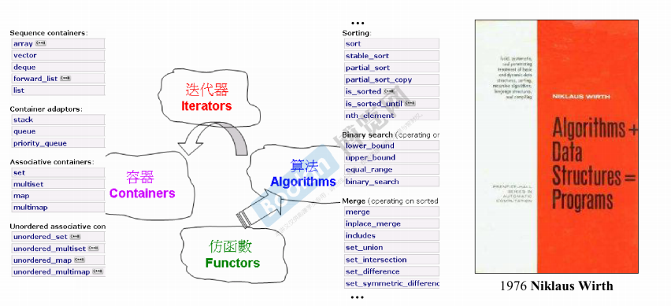

# C++ 程序设计 - 兼谈对象模型

## 导读

 本课程包括模板等等，不仅仅是面向对象。所以叫这个名字

**勿在浮沙筑高台**

### 课程目标

- 在先前基础课程培养的正规大气的编程素养上，继续探讨更多技术。  

- 泛型编程`Generic Programming` 和面向对象编程 `Object-Oriented Programming` 虽然分属不同思维，但它们正是C++的技术主线，所以本课程也讨论模板。
- 深入探索面向对象值继承关系`inheritance`所形成的对象模型`Object model`，包括隐藏于底层的`this`指针，`vptr`虚指针，`vtbl`虚表，`virtual mechanism` 虚机制，以及虚函数 `virtual functions` 造成的多态` polymorphism`效果。

### 编译器 

- 编译 `compile`
- 链接 `link`


发现一个很好的博客   https://www.cnblogs.com/leokale-zz/p/11090627.html


## 转换函数 Conversion Function

#### 以分数举例

```c++
class Fraction{
public:
    Fraction (int num,int den = 1)
    : m_numerator(num),m_denominator(den){}
    operator double() const {
        //return (double)(m_numerator / m_denominator);
        return (double)m_numerator / (double)m_denominator;
    }
private:
    int m_numerator;    //分子
    int m_denominator;  //分母
};

Fraction f(3,5);
double d = 4 + f;
```

`operator 类型 const`

-  转换不可以有参数。

- 前面也不必有类型名（后面已经写了），

- 同时转换不可能改变类里的值，所以通常使用`const`。

`double d = 4 + f;`

首先看有没有配套的重载，结果没有写。

然后看有没有合适的转换，使f是double。

**注：分子分母都需要进行强制转换为double，并不是简单括起来就可以了，编辑环境不管是clion，vstudio，还是linux环境，不进行强制转换，结果都是整数而非分数。**

#### non-explicit-one-argument ctor

```c++
Fraction (int num,int den = 1)
            : m_numerator(num),m_denominator(den){}
```

one-argument: 创建一个Fraction只要一个实参就够了，另外一个的有默认参数。这在数学上也是符合逻辑的。(two parameters)

non-explicit: 没有加explicit

```c++
class Fraction {
public:
    //该构造函数的den参数有默认值，这就形成了单参数构造函数
    Fraction(int num, int den = 1) :m_num(num), m_den(den) {}
    
    Fraction operator +(const Fraction& f) {
        //完成Fraction之间的加法,并返回
        return Fraction(this->m_num*f.m_den + this->m_den*f.m_num, this->m_den*f.m_den);
    }
    int get_num() const {
        return m_num;
    }
    int get_den() const {
        return m_den;
    }
private:
    int m_num;
    int m_den;
};

inline ostream& operator<<(ostream& os,const Fraction& f) {
    os << f.get_num();
    os << "/";
    os << f.get_den();
    return os;
}

Fraction f(10, 3);
//当Fraction对象加一个int时，编译器会自动将4转换为4/1的Fraction对象
Fraction dvi = f + 4 ;
cout << dvi << endl; //输出3/22
```

如果转换和cxoa-ctor并存，会有问题。

```c++
class Fraction {
public:
    //该构造函数的den参数有默认值，这就形成了单参数构造函数
    Fraction(int num, int den = 1) :m_num(num), m_den(den) {}

    //Fraction转double的转换函数
    operator double() const {
        return (double)m_num / (double)m_den;
    }
    
    Fraction operator +(const Fraction& f) {
        //完成Fraction之间的加法,并返回
        return Fraction(this->m_num*f.m_den + this->m_den*f.m_num, this->m_den*f.m_den);
    }
    int get_num() const {
        return m_num;
    }
    int get_den() const {
        return m_den;
    }
private:
    int m_num;
    int m_den;
};

inline ostream& operator<<(ostream& os,const Fraction& f) {
    os << f.get_num();
    os << "/";
    os << f.get_den();
    return os;
}
```

此时，Fraction类的定义中，同时存在单参数构造函数和转换函数。当调用以下代码时（报错）：

```c++
Fraction f(10, 3);
//当Fraction对象加一个int时，编译器会自动将4转换为4/1的Fraction对象
Fraction dvi = f + 4 ;
cout << dvi << endl;
```

Fraction dvi = f + 4;会报错。因为编译器认为，可以把f转换为double，也可以把4转换为Fraction。当把4转换为Fraction时，这条路能走通。但是把f转换为double时，做完加法后，无法将得到的double类型的dvi转换为Fraction，所以报错。

同样的，这样调用也会报错，与上面的过程相反。

```c++
Fraction f(10, 3);
//当Fraction对象加一个int时，编译器会自动将4转换为4/1的Fraction对象
double dvi = f + 4 ;
cout << dvi << endl;
```

**可选择的太多，编译器会不知道怎么办，换句话说编译器不知道判断好坏，他只知道对错。**

这里还可以总结一下， 就是之前的转换函数，是将Fraction转为double。而加号重载，是将double转为Fraction类。


### explict-one-argument ctor

explicit关键字意为“明确的”。很大几率用在构造函数前面，指明该构造函数只做构造函数使用，让编译器不要自动去调用它。

```c++
class Fraction {
public:
    //该构造函数的den参数有默认值，这就形成了单参数构造函数
    explicit Fraction(int num, int den = 1) :m_num(num), m_den(den) {}

    //Fraction转double的转换函数
    operator double() const {
        return (double)m_num / (double)m_den;
    }
    
    Fraction operator +(const Fraction& f) {
        //完成Fraction之间的加法,并返回
        return Fraction(this->m_num*f.m_den + this->m_den*f.m_num, this->m_den*f.m_den);
    }
    int get_num() const {
        return m_num;
    }
    int get_den() const {
        return m_den;
    }
private:
    int m_num;
    int m_den;
};

inline ostream& operator<<(ostream& os,const Fraction& f) {
    os << f.get_num();
    os << "/";
    os << f.get_den();
    return os;
}
```

在构造函数前使用了explicit关键字，也就相当于把前面例子里编译器面对的两条路减少为一条，这就没有冲突了。程序就能正确运行，但只能将f转换为double进行运算。

```c++
Fraction f(10, 3);
//当Fraction对象加一个int时，编译器会自动将4转换为4/1的Fraction对象
double dvi = f + 4 ;
cout << dvi << endl;  //输出7.3333
```

**总结：**explicit很少使用，90%的几率都使用在构造函数之前，还有模板里很小一部分会用到。用作控制编译器的自动行为，减少从中带来的莫名错误。


## Pointer-like class

Pointer-like class 即做出来的对象，像一个指针。例如智能指针就是其中一种。在这种类中，一定包含一个普通的指针。基本都会包括`.` `->`的重载。

### 智能指针 

```c++
template<class T>
class shared_ptr {
public:
    T& operator*() const {
        return *px;
    }
    T* operator->() const {
        return px;
    }
    //构造函数
    shared_ptr(T* p):px(p) {}
private:
    T* px;
};
//测试类，将其对象指针包装成shared_ptr智能指针
class Test {
public:
    void mytest() {
        printf("testing...\n");
    }
};
```

`注意T& operator*() const;和T* operator->() const;两个操作符重载函数，其中“*”的重载函数很好理解，就是取指针指向地址的数据。但是“->”符号的重载不太好理解，这是因为在C++中，->这个符号比较特殊，这个符号除了第一次作用在shared_ptr对象上，返回原始指针px，还会继续作用在px上，用来调用函数m ytest。但好在重载这个符号，基本就是这种固定写法。`

```c++
Test a;
//Foo f(*sp); 从sp中取出数据进入Foo的构造函数。  
shared_ptr<Test> ptr(&a);
ptr->mytest();
```

### 迭代器

迭代器类型的Pointer-like和智能指针的Pointer-like有一定的区别。

作为迭代器，他将一个对象（结构体或类产生的对象）的指针包装为一个迭代器（类指针对象），例如链表的某个节点指针，这样，在他的内部重载多个操作符，比如“*”、“->”、“++”、“--”、“==”、“!=”等，分别对应链表节点之间的取值、调用、右移、左移、判断等于、判断不等于。
链表的基本结构图：


 迭代器中“*”和“->”的重载：


图中所示，迭代器中的“*”，返回的是某个node中的data，而不是这个node（这些实现都是根据用户需求来实现）。

`迭代器中的“->”返回的是data的指针，因为operator*()就是调用“*”的重载函数，返回data数据，前面再使用“&”来取地址，则就是data的指针。从而可以达到使用“->”来完成data->func_name()的目的。`


举一反三，其他的符号重载也是根据用户需求来做相应的操作。

所以说操作符重载非常重要。


## function-like classes

像函数一样的类，意思就是将一个类定义为可以接受`()`这个操作符的东西。

能接受`()`的对象 ，就是一个函数对象或仿函数。

```c++
template<class T>
class Identity {
public:
    //重载()操作符，使该类衍生的对象可以像函数一样调用
    T& operator()(T& x) {
        return x;
    }
};

class Test {
public:
    void mytest() {
        printf("testing...\n");
    }
}; 
```


```c++
int a1 = 5;
Identity<int> iden_i;
int a2 = iden_i(a1);
cout << a2 << endl;

Test t1;
Identity<Test> iden_t;
Test t2 = iden_t(t1);
t2.mytest();
```
> 标准库的仿函数多会继承一些奇特的类型
> ```c++
> template <class Arg, class Result>  //这两个类的特点：大小为0，没有函数
> struct unary_function  {//一个操作数
>     typedef Arg argumrnt_type;
>     typedef Result result_type;
> };
> 
> template <class Arg1,class Arg2,class Result>
> struct binary_function  {//两个操作数
>     typedef Arg1 first_argument_type;
>     typedef Arg2 second_argument_type;
>     typedef Result result_type;
> };
> 
> template <class T>
> struct identity:public unary_function<T,T>  {  //继承了奇怪的类
>     const T&
>     operator()  (const T& x)  const  {return x;  }  //重载了()
> };
> 
> template <class Pair>
> struct select1st:public unary_function<Pair, typename Pair::first_type>  {
>     const typename Pair::first_type&
>     operator() (const Pair& x)  const
>     {  return x.first;  }
> };
> template <class Pair>
> struct select2nd:public unary_function<Pair, typename Pair::second_type> {
>     const typename Pair::second_type &
>     operator()(const Pair &x) const { return x.second; }
> };
> template <class T1,class T2>
> struct pair  {
>     T1 first;
>     T2 second;
>     pair():first(T1()),second(T2())  { }
>     pair(const T1& a,const T2& b)
>             :  first(a), second(b)  { }
> };
> ```

## namespace 经验谈

要养成使用命名空间的习惯。

## class template 类模板

将可以提供外界控制的类型名抽出来，然后制作模板

```c++
template<typename T>
class complex
{
public:
    complex(T r = 0,T i = 0)
    : re(r),im(i)
    {}
    complex& operator += (const complex&);
    T real () const {return re;}
    T imag () const {return im;}
private:
    T re,im;
    friend complex& __doapl(complex*,const complex&);
};

{
    complex<double>c1(1.4,3.2);
    complex<int>c2(2,4);
}
```

## Function template 函数模板 

同理

```c++
template<class T>
inline
const T& min(const T& a , const T& b)
{
    return b < a ? b : a;
}
class stone
{
public:
    stone(int w, int h,int we)
        : _W(w),_H(h),_WE(we)
        {}
    bool operator< (const stone& rhs) const
    {
        return _WE < rhs._WE;
    }
private:
    int _W;
    int _H;
    int _WE;
}


//编译器会对Function template进行实参推导argument deduction。 
stone r1(2,4),r2(3,4),r3;
r3 = min(r1,r2)
```

## Member template 成员模板

```c++
template<class T1,class T2>
class Pair {
public:
    T1 first;
    T2 second;
    //普通构造
    Pair() :first(T1()), second(T2()) {}
    Pair(const T1& a,const T2& b):first(a),second(b){}
    //成员模板
    template<class U1,class U2>
    Pair(const Pair<U1, U2>& p) : first(p.first),second(p.second) {}

};
//Base1理解为鱼类
class Base1 {};
//derived1理解为鲫鱼
class derived1 :public Base1 {};
//Base2理解为鸟类
class Base2 {};
//derived2理解为麻雀
class derived2 :public Base2 {};
```

Q: 将一个由鲫鱼和麻雀构成的pair，放进一个由鸟类和鱼类构成的pair中，可行吗？

A: 可以，反之不行。为满足这种需求，设计pair的人，需要特殊设计，

```c++
template<class U1,class U2>
    Pair(const Pair<U1, U2>& p) : first(p.first),second(p.second) {}
```

将初值的头尾放入当做本身的头尾。可以通过。

**标准库的构造函数 大量使用这种手法，为了使构造函数更有弹性**

### 成员模板与智能指针

将成员模板引申到前面所讲的智能指针，即可实现父类指针指向子类对象的效果。

因为普通的指针都可以指向自己子类的对象`up-cast`，那么作为这个指针的封装（智能指针），那必须能够指向子类对象。所以，可以模板T1就是父类类型，U1就是子类类型。实现如下：

```c++
template<class T>
class shared_ptr {
public:
    T& operator*() const {
        return *px;
    }
    T* operator->() const {
        return px;
    }
    shared_ptr(T* p):px(p) {}
    //成员模板
    template<class U>
    explicit shared_ptr(U* p) : px(p) {}
private:
    T* px;
};
//测试类，将其对象指针包装成shared_ptr智能指针
class Test {
public:
    virtual void mytest() {
        printf("testing...\n");
    }
};
class Test2 :public Test {
    void mytest() {
        printf("testing2...\n");
    }
}; 

//
Test2 t2;
shared_ptr<Test> ptr(&t2); //实际上里面的成员属性px是Test类型的，但是保存的却是Test2类型数据
ptr->mytest();  //输出testing2..
```

## specialization 模板特化

模板特化和泛化是反义的。我们使用的普通模板化指模板泛化，

而特化就是指在泛化的基础上，有一些特殊的类型做特殊处理，例如： 

```c++
//这个是Hash类的泛化定义
using namespace std;
template<class T>
class Hash {
public:
    size_t operator()(T in)const {
        cout << "Template:"<<in << endl;
        return in;
    }
};
//这个是Hash类对于int类型的特化定义
template<>//这个东西因为被绑定，所以不用写class了
class Hash<int> {
public:
    void operator()(int in)const {// 每个特化都对()做重载
        cout << "Int:"<<in<< endl;
    }
};
//这个是Hash类对于Double类型的特化定义
template<>
class Hash<double> {
public:
    void operator()(double in)const {
        cout << "Double:" << in << endl;
    }
};
```

调用：

```c++
#include <iostream>
#include "head.h"
using namespace std;
int main() {
    Hash<int> hash_int;
    hash_int(50);
//double类型调用的是double类型的特化
    Hash<double> hash_db;
    hash_db(88.8);
//float类型调用的是泛化情况下的构造方法
    Hash<float> hash_fl;
    hash_fl(77.7);

    cout<< Hash<long>()(1000)<<endl; // Hash<long>()这是一个临时对象 () 启动operator()
    return 0;
}


Int:50
Double:88.8
Template:77.7
Template:1000
1000
```


## partial special 模板偏特化

- 个数上偏

```c++
template<typename T,typename Alloc=...>//vector 可以指定 类型以及分配器
class vector{
  ...  
};
//绑定
template<typename Alloc=...>
class vector<bool,Alloc>{
    ...
}
```

- 范围上偏

从任意类型缩小到指针

```c++
template<typename T>
class C
{
    ...
};

template<typename T>
class C<T*> // 如果使用者使用的是指针，就使用这一套代码
{
    ...
};
//上下两个T完全没有关系，可以换名字
template<typename U>
class C<U*>
{
    ...
};

//
C<string> obj1;
C<string*> obj2;
```


> 偏特化是在全特化的基础上发展来的，全特化就是上面所述的例子，只有一个泛化类型T。而偏特化就是指有多个泛化类型，例如：
>
> ```
> //多类型模板泛化
> template<class T1,class T2,class T3>
> class Hash2 {
> public:
>     void operator()(T1 in1,T2 in2,T3 in3)const {
>         cout <<"泛化"<< endl;
>     }
> };
> //前两个固定为int和double，偏泛化
> template<class T3>
> class Hash2<int,double, T3> {
> public:
>     void operator()(int in1,double in2,T3 in3)const {
>         cout << "偏特化"<<endl;
>     }
> };
> ```
>
> 调用：
>
> ```
> //泛化
> Hash2<float, double, float> hash_fdf;
> hash_fdf(5.0, 6.6, 7.7); //输出 泛化
> //偏特化
> Hash2<int,double,float> hash_idf;
> hash_idf(5,6.6,7.7); //输出 偏泛化
> ```
>
> **范围上的偏**
>
> 本来是全泛化，假设为template<class T>，我们想单独拿出任意类型的指针来偏特化。
>
> ```
> template<class T>
> class  A {
> public:
>     void operator()(T t)const {
>         cout << "泛化" << endl;
>     }
> };
> 
> template<class T>
> class A<T*> {
> public:
>     void operator()(T* tp)const {
>         cout << "范围偏特化" << endl;
>     }
> };
> ```
>
> 调用：
>
> ```
> int num = 5;
> int *p_num = &num;
> A<int> a1;
> A<int*> a2;
> a1(num);    //输出泛化
> a2(p_num);    //输出范围偏特化
> ```


## 模板模板参数 template template parameter  

模板参数本身也是模板

```c++
#include<list>
template<typename T,
        template<typename T> //这里会报错，侯捷老师这边这样讲没问题，是实际操作时候不能同名
        /*
         *The rule clang is using to block it is: C++ 2011 [temp.local] Paragraph 6: A template-parameter shall not be redeclared within its scope (including nested scopes). A template- parameter shall not have the same name as the template name. This can be found in the clang source code within the Sema::DiagnoseTemplateParameterShadow method. – 
Bill Lynch
 Jan 2, 2014 at 2:04 
        */
            class Container
          >
class XCLS{
private:
    Container<T>c;
public:

};

template<typename T>
using Lst = std::list<T,std::allocator<T>>;

//
XCls<string,list>mylist1;//error list 本身是个模板，里面类型和分配器都未定。不能直接这样使用
XCLs<string,Lst> mylist2;//ok
```

PS：只有在template<>的尖括号里面，`class`和`typename`是共通的。这是因为最初没有`typename`关键词，借用的`class` 。属于历史问题。

### 另一种情况 - 传smartPtr

smartPtr里面shared_ptr和auto_ptr接受一个参数


### 这不是template template parameter

```c++
template<class T,class Sequence = deque<T>>
class stack{
	friend bool operator == <> (const stack&,cosnt stack&);
	friend bool operator < <> (const stack&,cosnt stack&);
protected:
	Sequence c;
}
//
stack<int>s1; // 由于第二个有默认值，只指定第一个模板参数
stack<int,list<int>> s2;//这个第二个参数已经写死，不再是模板参数。
```


>模板的参数就是指template<typename T>中的T，他可以是任意类型。
>
>但是当T也是一个模板时，就叫模板的模板参数。
>
>```
>template<class T>
>class Test{};
>
>template<typename T,template<typename CT> class C>
>class XC {
>
>private:
>    //C可以是List,该list需要一个模板参数CT,可以是任何类型，这里使用T的类型
>    C<T> c;
>};
>```
>
>调用：
>
>```
>//实际上xc中的c的类型为Test<int>
>XC<int, Test> xc;
>```
>
>当然，像vector等类型拥有多于1个的模板参数，所以以上代码中的C不能是vector。如果要实现vector作为XC的第二个模板，那么需要指明vector的两个模板参数：
>
>```
>template<class T>
>class Test{};
>
>template< class T1,class T2, template<class CT1, class CT2>  class C>
>class XC {
>
>private:
>    //C可以是List,该list需要一个模板参数CT,可以是任何类型，这里使用T的类型
>    C<T1,T2> c;
>};
>```
>
>调用：
>
>```
>//实际上xc中的c的类型为vector<int,std::allocator<int>>
>XC<int, std::allocator<int>,vector> xc;
>```
>
> **模板的模板参数，还需要和另一种形式区分开：**
>
>```
>template<class T, class Sequence = deque<T>> //这种不是模板的模板参数
>```
>
>Sequence的默认值deque<T>实际上已经指明了Sequence的类型时deque，只是因为deque还有一个模板参数而已。
>
>它和上面讲的不一样，上面讲的 template<class CT1, class CT2> class C，相当于Sequence<T>，Sequence和T都是待指定的模板参数。所以还是有本质区别的。


## 关于C++标准库




## 三个主题

### Variadic templates(since C++11) 模板参数可变化

variadic 是生造出来的一个单词。

新的语法允许你写任意个数的模板参数。

递归拆包。 

 ```c++
 //用于当args...里没有参数的时候调用，避免报错
 void leo_print() {
     //Do Nothing
 }
 
 //数量不定模板参数
 template<class T, class ... Types>// 一包，用...表示
 void leo_print(const T& firstArg, const Types& ... args)
 {
     cout << firstArg << endl;
     //递归调用leo_print，每次打印下一个参数
     //自动将args...里的多个参数分为1+n个
     leo_print(args...);
 }
 //
 leo_print(64, 5.5, "gogogo", 90, bitset<16>(377);
 ```

注：这里递归调用，包里面的参数都已经有了<<重载。

 可以使用`sizeof...(args)`来抓住这一包几个。

标准库用这个语法大量返修过了。


### auto（since C++11)

auto关键字的作用在于，让编译器自动帮你推导需要的类型。这是一个语法糖，仅仅是让写代码更加方便。

例如：

```
list<int> c;
c.push_back(11);
c.push_back(22);
c.push_back(33);
    
//普通写法，自定指定类型
list<int>::iterator ite;
ite = find(c.begin(), c.end(), 33);
//auto写法，编译器从右边的find返回值推导其变量类型
auto ite = find(c.begin(), c.end(), string("leo"));
//错误写法
auto ite; //光从这句话，编译器没法推导他的类型
ite = find(c.begin(), c.end(), string("hello3"));
```

###  基于range的循环

```
list<int> c;
c.push_back(11);
c.push_back(22);
c.push_back(33);
//遍历一个容器里的元素    
for (int i : c) {
    cout << i << endl;
}
//除了遍历传统的容器，还能遍历{...}形式的数据
//{}中的数据要和i的类型符合
for (int i : {1,2,3,4,5,6,7,8,9,10}){
    cout << i << endl;
}    
//使用auto自己推导遍历元素的类型
for (auto i : c)
{        
    cout << i <<endl;
}    
```

上面过程，遍历到的数据都是拷贝给“i”的，不会影响容器中的数据。

可以通过传引用改变容器中的数据。

```
//pass by reference，直接作用于容器元素本身
for (auto& i : c) {
    i *= 3;
}
```


## Reference 再探引用

 

```c++
int x = 0;
int *p = &x;
int &r = x;
int x2 = 5;
r = x2;
int &r2 = r; 
```


1.x是一个int类型的变量，大小为4bytes。

2.p是一个指针变量，保存的是x的地址，在32bit计算机中，指针的大小为4bytes。

3.r是x的引用，可以认为r就是x，x就是r，

> 引用就是一个编译器增加了严格限制的const指针，单纯用c++代码看引用的地址是和变量相同，但是用汇编代码看，是会把变量地址放入引用中，因此从内存角度来说，引用是和指针一样的。
>
> https://zhuanlan.zhihu.com/p/89175296  

4.当r=x2时，相当于也是x=x2。

5.r2是r的引用，也即是x的引用。现在r、r2、x都是一体。

6.使用sizeof()来看引用r和变量x的大小，返回的数值是一样的。

```c++
	int a = 4;
    int* o = &a;
    int& b = a;
    double m[5] = {1,2,5,6,4};
    double* p = m;
    double(&t)[5] = m;
    cout << sizeof(a) << endl;
    cout << sizeof(o) << endl;
    cout << sizeof(b) << endl;
    cout << "----------" << endl;
    cout << sizeof(m) << endl;
    cout << sizeof(p) << endl;
    cout << sizeof(*p) << endl;
    cout << sizeof(t) << endl;
    cout << t[3] << endl;
/* 
32位系统
4
4
4
----------
40
4
8
40
6
*/
```


7.对引用r和变量x取地址，返回的地址也都是一样的。

### 对引用的几个认识

从实现的角度来看，引用的底层都是通过指针来实现的。但是从逻辑的角度来看，引用又不是指针，我们看到引用，就要像看到变量本身一样，例如一个int类型变量，其引用也应该看成整数。

**引用就是一个变量的别名，引用就是那个变量。**引用一旦创建，就不能再代表其他变量了。如果此时再将某个变量赋值给这个引用，相当于赋值给引用代表的变量。参照前面第4点。

**所以，对引用最好的理解方式，就是认为引用就是变量，不用关心为什么，编译器给我们制造了一个假象，就像一个人有大名和小名一样。你对引用做的任何操作，就相当于对变量本身做操作。**

### 引用的常见用途

引用多用在参数传递和返回类型上，从写法上来说，传引用也更优美。


### 引用不能重载

```
double imag(const double& im){}
double imag(const double im){} //AmbiguityS  
```

上述两句代码不能并存，因为他们的签名（signature）是相同的，signature就是[ imag(const double im) ----- ]这一段，‘----’表示可能存在的const关键字等。（const是作为签名的一部分的）

为什么不能并存，因为这两个函数虽然传参数的方式不同，一个传引用，一个传值。但**对于调用**来说，是一样的imag(im)，这样对于编译器来说，它不知道该调用哪一个，所以不能并存（重载）。


## 复合&继承关系下的构造和析构

### Inheritance 继承关系下的构造和析构


### Composition 复合关系下的构造和析构

复合/组合 内部先创建出来


### Inheritance+Composition 继承+ 复合关系下的构造和析构

内存里面先放base 还是component，具体实现并没有规定死。


## 对象模型 - 关于虚指针Vptr和虚表Vtbl


图中最右边是A,B,C三个类的继承关系。

最左边是对象a,b,c的内存占用情况。

当类中存在虚函数的时候（不管有几个虚函数），对象的内存占用都会**多出4bytes**，这个空间存放了一个**指向虚表（Virtual table：vtbl）的指针（Virtual Pointer：vptr）**。

**虚表里放的都是函数指针。**

**继承函数，继承的是函数的调用权，而不是函数的内存大小**


**从这张图中可以看出：**

1.父类有虚函数，子类必定有虚函数（因为子类会继承父类的所有数据，包含虚表指针）。如果子类有对其进行override，那么父类和子类所指向的同名虚函数是不同的，例如A中的vfunc1()虚函数，B将其进行override，C又再次override，所以各自一份不同的函数体。分别颜色为浅黄、浅蓝、深黄。

2.子类继承了父类的虚函数，但没有进行override，例如A中的vfunc2()，B和C都没对其进行override，所以大家的虚表里指向的都是同一份函数代码。

3.非虚函数不存在override，各自的非虚函数，都各自拥有，即使名字一样，但函数都是**不相干的**。子类只是继承了父类非虚函数的调用权而已（子类和父类有同名的非虚函数，子类可以使用调用权调用父类的函数）。

**调用函数的流程：**

　　当C* p = new C();的指针p（图中左边的红色p）去调用C的vfunc1()时，流程是 **虚指针->虚表->vfunc1()地址**，这叫**动态绑定**。C语言中对函数的调用，是编译器使用call XXX直接调用函数，那个叫**静态绑定**。如下图所示：


这是通过p指针找到vptr，然后通过*vptr取到虚表，然后选择虚表中第n个函数指针，再通过函数指针加()来调用函数。是用C语言实现的一个正确调用流程。

如何在虚表中确定需要调用的虚函数是第几个（选择n），就是在定义虚函数时，编译器会看定义的顺序，例如A类中vfunc1是第0个，vfunc2是第1个。

**什么时候编译器使用动态绑定，三个条件（也是多态的条件）：**

1.函数由指针调用。

2.指针向上转型（up cast），父类指针指向子类对象。

3.调用的是虚函数。


## 对象模型 - 关于 this 

 

**什么是this指针：**通过一个对象来调用成员函数，那个对象的地址就是this指针，就是这么简单。


如上图所示，我们使用子类对象myDoc来调用父类的函数  OnFileOpen()。OnFileOpen()函数是父类的非虚函数，但是myDoc的指针会被编译器以隐式的方式传入OnFileOpen()，这 个指针就是this指针，OnFileOpen()函数中的步骤运行到需要调用Serialize()函数时，因为Serialize()函数是一个虚函数，并且子类CMyDoc对其进行了override，所以编译器去调用Serialize()时，是使用的this->Serialize()。

注意图中左上角的红框，this指针指向的是myDoc对象，该对象里有虚指针，虚指针指向的虚表中有属于CMyDoc子类的Serialize()虚函数。所以最终调用的是子类的Serialize()。


## 对象模型 - 关于动态绑定

**静态绑定：**


如上图所示，对象b被强转为A类对象，那么由a来调用vfunc1()就是静态绑定，因为它不满足动态绑定的三个条件（见十六节）的第一个，需要由指针来调用虚函数，并且指针是父类指针。

> **什么时候编译器使用动态绑定，三个条件（也是多态的条件）：**
>
> 1.函数由指针调用。
>
> 2.指针向上转型（up cast），父类指针指向子类对象。
>
> 3.调用的是虚函数

图右边的紫色是编译器注释以及候老师的注释，说明调用的是A类的A::vfunc1()虚函数，使用的是**call xxx的静态绑定**形式。

**动态绑定：**


如图所示，pa为A类指针，指向新new出来的B类对象，满足第一个条件：是指针，满足第二个条件：向上转型。然后使用pa调用vfunc1()，满足第三个条件：调用虚函数。所以是动态绑定。

call 不再是固定地址，而是右边红色部分。

取对象b的地址，并赋值给指针pa，b是类B的对象，而pa是A类的指针，所以满足前两个条件：指针以及向上转型。然后再使用pa指针调用vfunc1()，满足第三个条件：调用虚函数。所以也是使用的动态绑定。


## 谈谈const

const的使用情况：

**1.放在成员函数的小括号之后，函数本体的前面：**例如int test() const { return this->img; }

这种情况下，const表示这个成员函数保证不去修改类的成员变量，只做访问等操作。

注意：这个位置加const，只发生在类的成员函数上，**全局函数不能加const**。（因为这个const保证不修改数据，是有保证对象的，保证的对象就是该类的一个常量对象，即使用const修饰的该类对象，见后续说明）。

**2.放在变量的前面：例如const A a;**

这种情况下，const表示修饰的变量（基础变量或对象等）是不能修改的（如果是对象，就不能修改他内部的成员变量）。

**以上两种情况就可以搭配起来使用：**


分为四种情况：

**①.对象是const，成员函数也是const，能够完美搭配。**因为对象是不能修改的，而该函数又保证不修改数据，一拍即合。

**②.对象是non-const，成员函数是const。也是能够配合的。**因为对象可以接受修改，也可以接受不修改，而函数保证不修改，没毛病。

**③.对象是const，成员函数是non-const，不能搭配。**因为对象不允许修改数据，但是函数不保证，无法协调。

**④.对象是non-const，成员函数也是non-const，能搭配。**因为对象不限制修改数据，函数也不保证，那就随便吧。

 **想要记住也很简单， 就是non-const对象可以适配const函数， 但是const对象比较专一，只能适配const函数。**

**const是属于函数签名的一部分。**


> 字符串拷贝在底层是通过 “共享” reference counting 。 所以如果要改变被共享的字符串，如abcd共享，那么要改a，那么就把a单独拷贝一份给他去改，其余接着共享。
>
> 当共享发生改写，就需要**COW** Copy on Write
>
> 常量字符串，不能做改写，不能也不必考虑cow。
>
> 那么为了区分，函数后面就可以加上const。就可以区分。


当成员函数的const和non-const版本同时存在，const object只能使用const版本，non-const object 只能使用non-const版本。


**侯老师经验：**在设计类的时候，考虑一共要设计几个函数，每个函数叫什么名字的时候，心里就应该知道那些函数是绝对不会修改数据的，那么这些函数就必须加上const。否者，如果其他人使用你设计的类，定义了一个const类型的对象，却因为你没有指明const关键字而无法调用一个可能名为print的输出函数（输出函数肯定不用修改数据，只是做访问和打印而已）。

换句话说，你自己究竟有没有完全掌握这个类的设计，知道哪些该动，哪些不该动。


## 关于 new，delete

**new分解为三步：**

1.分配内存（底层是malloc(size)，内存大小为sizeof(class_name)）

2.转换内存指针的类型为class_name*，原本为void*

3.用该指针调用构造函数，p->Foo::Foo();

**delete分解为两步：**

1.使用传入的指针调用析构函数p->~Foo();

2.释放对象占用的内存空间（底层是free()）

### 重载全局的new/delete

**我们可以重载全局的new和delete（但一定要小心，影响很大）以进行一些内存管理的设计：**


有关new ，一定要有一个参数，即大小size。 

有关delete，得给他一个指针。

###  重载类成员的new/delete

**我们也可以重载类成员new和delete（只影响该类）：**


一般重载成员new和delete，主要是做内存池。

**重载成员Array new和Array delete：**


注意：array new的时候，分配的内存大小为sizeof(Foo)*N + 4，这里的4个byte，只在N个Foo对象内存的前面，有一个int类型的数，里面的值为N，用于标记有几个Foo对象。如下图：


红框处就是一个int所占用的空间，里面的值为N（假设N=5），一个Foo对象为12bytes，那么总共分配内存大小为12*5+4=64。


为了不然程序崩掉，重载的new和delete需要真正的去分配内存和释放内存，底层采用的是malloc和free。如果不想使用已重载的new和delete，可以使用`::new class_name`;来强制使用全局new，`::delete pf`;强制使用全局delete。


### 示例代码

```c++
//head
#include<string>
using namespace std;
class Foo
{
public:
    int _id;//4
    long _data;//4
    string _str;//28

public:
    Foo() : _id(0) {cout<<"default ctor.this = "<<this<<" id="<<_id<<endl;}
    Foo(int i) : _id(i) {cout<<"default ctor.this = "<<this<<" id="<<_id<<endl;}

    //virtual
    ~Foo(){cout<<"dtor.this = "<<this<<" id="<<_id<<endl;}
    static void* operator new(size_t size);
    static void operator delete(void* pdead, size_t size);
    static void* operator new[](size_t size);
    static void operator delete[] (void* pdead, size_t size);
};

void *Foo::operator new(size_t size) {
    Foo *p = (Foo*)malloc(size);
    cout<<"ctor.this = "<<p<<" id="<<p->_id<<endl;
    return p;
}

void Foo::operator delete(void *pdead, size_t size) {
    cout<<"dtor.this = "<<pdead<<endl;
    free(pdead);
}

void *Foo::operator new[](size_t size) {
    Foo *p = (Foo*)malloc(size);
    cout<<"[]ctor.this = "<<p<<" id="<<p->_id<<endl;
    return p;
}

void Foo::operator delete[](void *pdead, size_t size) {
    cout<<"[]dtor.this = "<<pdead<<endl;
    free(pdead);
}

```


```c++
#include <iostream>
#include "head.h"
using namespace std;
int main() {
//    Foo* pf = new Foo;
//    cout << "sizeof(pf) = " << sizeof(pf) << endl;
//    cout << "sizeof(pf) = " << sizeof(*pf) << endl;
//    delete pf;
//    cout<<endl;
//    Foo *pg = ::new Foo;
//    ::delete pg;
    Foo* pa = new Foo[5];
    cout << "sizeof(pa) = " << sizeof(*pa) << endl;
    cout << "sizeof(Foo[5]) = " << sizeof(Foo[5]) << endl;
    delete pa;
    return 0;
}
```


这边的运行结果我感觉有些疑惑诶。

#todo

linux下


clion下


vs


可以看到不同的编译工具，大小不一，另外析构函数崩了。

这部分涉及到内存管理了。留待后面进行分析吧。

### 解析

目前可知的是，

对于int long string

linux  4,8,32

clion 64位，4,4,32

vs 32位 4,4,28

> 
>
> 28 32 36 40 都是可行的。
>
> 版权声明：本文为CSDN博主「树叶上的蜗牛」的原创文章，遵循CC 4.0 BY-SA版权协议，转载请附上原文出处链接及本声明。
> 原文链接：https://blog.csdn.net/sols000/article/details/103989637

靠，没用正确的delete重载。

太菜了。

```c++
//使用的delete[] pa;

sizeof(int) = 4
sizeof(long) = 4
sizeof(string) = 32
[]ctor.this = 0x2bf696e6820 id=1768845728
default ctor.this = 0x2bf696e6828 id=0
default ctor.this = 0x2bf696e6850 id=0
default ctor.this = 0x2bf696e6878 id=0
default ctor.this = 0x2bf696e68a0 id=0
default ctor.this = 0x2bf696e68c8 id=0
sizeof(pa) = 40
sizeof(Foo[5]) = 200
dtor.this = 0x2bf696e68c8 id=0
dtor.this = 0x2bf696e68a0 id=0
dtor.this = 0x2bf696e6878 id=0
dtor.this = 0x2bf696e6850 id=0
dtor.this = 0x2bf696e6828 id=0
[]dtor.this = 0x2bf696e6820
```

