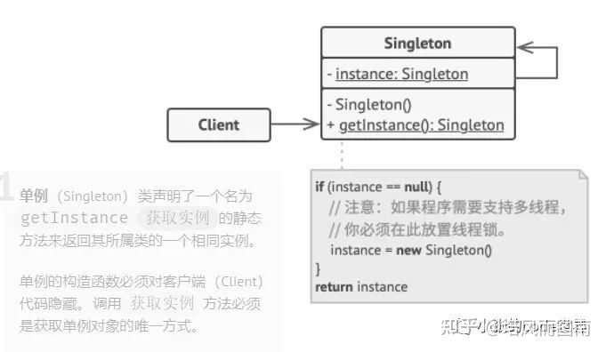
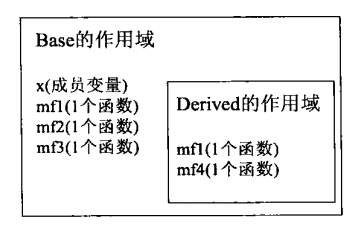
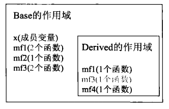
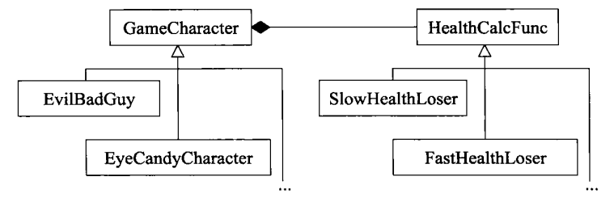
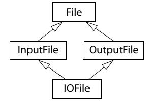
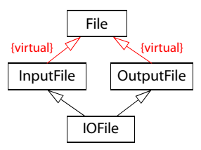
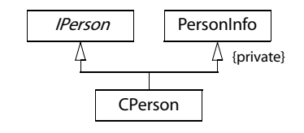

# Effective C++

[TOC]

## 导读

学习程序语言根本大法是一回事，学习如何以某种语言设计并实现高效程序则是另一回事。

本书提供的对C++的导引，是你的软件更易理解、易维护、可移植、可扩充、高效、并且有着你所预期的行为。

本书提出的忠告大致分为两类：一般性的设计策略，以及带有具体细节的特定语言特性。


## 第一章 让自己习惯C++ 

**[Accustoming Yourself to C++]**

### 条款01 视C++为一个语言联邦 

View C++ as a federation of languages


如今C++已经是一个**多重范式编程语**言(multiparadigm programming language)，一个同时支持**过程形式**(procedural)、**面向对象形式**(object-oriented)、**函数形式**(functional)、**泛型形式**(generic)、**元编程形式**(metaprogramming)的语言。

最简单的方法是将C++ 视为一个由相关语言组成的联邦而不是单一语言，在它的某个次语言中，各种守则与通例都倾向简单易懂易记。(*The easiest way is to view C++ not as a single language but as a federation of related languages. Within a particular sublanguage, the rules tend to be simple, straightforward, and easy to remember*.)。

好在<u>只有</u>四个次语言(:<)

- C
- Object-Oriented C++
  - classes
    - 构造函数
    - 析构函数
  - 封装 encapsulation
  - 继承 inheritance
  - 多态 polymorphism
  - 虚函数
- Template C++ 
- STL
  - 容器 containers
  - 迭代器 iterators
  - 算法 algorithms
  - 函数对象 function objects

### 条款02 尽量以const，enum，inline 替换 #define 

Prefer consts,enums,and inlines to #defines   或许说是“宁可以编译器替换预处理器”

因为#define 不被视为是语言的一部分。

```c++
#define ASPECT_RATIO 1.653									//X
const double AspectRatio = 1.653							//√			
```

记号名称(symbolic name) ASPECT_RATIO 也许编译器处理源码之前就被移走，以至于没进入记号表内。而作为一个语言常量(a language constant)，AspectRadio肯定会被编译器看到。

#### Const

使用常量const来替换#defines，有两种特殊情况

- 定义常量指针

  由于常量定义式通常放在头文件内，那么有必要将指针（而不只是指针所指之物）声明为const。

  若要在头文件内定义一个常量char*based字符串，必须写成

  ```c++
  const char* const authorName = "Scott Meyers";
  //不过建议使用标准库的string，下面的更好
  const std::string authotName("Scott Meyers");
  ```

  > **const char * const authorName = "Scott Meyers";**
  >
  > 这行代码定义了一个名为authorName的常量字符串，并将其初始化为"Scott Meyers"。
  >
  > const char * 表示authorName是一个指向常量字符的指针。也就是说，你不能通过这个指针来修改指向的字符。
  >
  > const authorName，表示authorName本身是一个常量。也就是说，你不能通过其他方式来修改authorName的值。
  >
  > 因此，这行代码定义了一个名为authorName的常量字符串，它的值是"Scott Meyers"，并且无论如何都不能被修改。
  >
  > **char * const authorName = "Scott Meyers";**
  >
  > 这行代码定义了一个名为authorName的字符指针常量，并将其初始化为"Scott Meyers"。
  >
  > char * 表示authorName是一个指向字符的指针。
  >
  > const authorName，表示authorName本身是一个常量。也就是说，你不能通过其他方式来修改authorName的值。
  >
  > 因此，这行代码定义了一个名为authorName的指针常量，它指向一个字符串"Scott Meyers"，并且无论如何都不能被修改。你可以通过修改authorName指向的字符串来改变这个字符串的值，但是你不能让authorName指向另一个字符串。

- class专属常量

  为了讲常量的作用域限制于class内，必须让它成为class的一个成员；而为了确保此常量最多只有一份，那么必须让它成为一个static成员。

  ```c++
  class GamePlayer{
  public:
      static const int NumTurns = 5;
      int scores[NumTurns];
  };
  ```

  这是一个声明式，一般来说C++需要为你所使用的任何东西提供一个定义式，**尤其是常量**。但如果它是个class专属常量又是static且为整型(ints，chars，bools)，则需特殊处理。只要不取他们的地址，你可以声明并使用它们而无需提供定义式。但如果你取某个class专属常量的地址，或者你的编译器一定坚持要看到一个定义式，你就必须另外提供定义式如下，并将它放在一个实现文件而非头文件。

  ```c++
  const int GamePlayer::NumTurns;
  ```

  >测试代码
  >
  >```c++
  >//test.h
  >class GamePlayer{
  >public://为了测试我改成了public
  >    static const int NumTurns = 5;
  >    int scores[NumTurns];
  >};
  >
  >//main.cpp
  >#include<iostream>
  >#include"test.h"
  >using namespace std;
  >const int GamePlayer::NumTurns;
  >int main(){
  >GamePlayer A;
  >const int *ptr = &A.NumTurns; //不加定义的话是错误，NumTurns没有被定义
  >cout<<A.NumTurns<<endl;
  >cout<< *ptr<<endl;
  >return 0;
  >}
  >
  >```
  >如果没有那行代码会报错`undefined reference to GamePlayer::NumTurns`
  
  我们无法用#define来创建一个class专属常量，因为#defines并不重视作用域，一旦宏被定义，它就在其后的编译过程中有效（除非被#undef），这就使得它无法提供封装性，也就是没有private #define这样的东西。
  
  有的旧式编译器不支持static成员在声明式获得初值，那么就可以把初值放在定义式（我个人觉得这样也更好，不然感觉定义式很累赘），唯一例外就是class编译期间需要一个class常量值。例如上例的数组声明式。这时候如果编译器又不认static整数型class常量完成“in class初值设定”，可改用所谓的“the enum hack”补偿做法。即一个属于枚举类型的数值可权充ints被使用。
  
  ```c++
  class GamePlayer{
  public:
      enum{NumTurns = 5};
      int scores[NumTurns];
  };
  ```
  
#### enum

有必要认识enum hack

- enum hack的行为比较像#define而不是const。比如取enum的地址不合法，而取一个#define的地址通常也不合法。如果你不想让别人活得一个pointer或reference指向你的某个常数，enum可以帮你实现这个约束。【条款18对于“通过撰码时的决定实施设计上的约束条件”谈得更多】
- 实用主义，事实上`enum back` 是模板元编程【条款48】的基础技术。

#### inline

另一个误用#define的情况就是用它来实现宏(macros)，宏看起来像函数，但不会导致函数调用带来的额外开销。但是有的宏的写法有着诸多缺点。

```c++
#include<iostream>
using namespace std;
void f(int x)
{
    std::cout << "The value is: " << x << std::endl;
}
#define CALL_WITH_MAX(a, b) f((a) > (b) ? (a) : (b))
int main(){
    int a = 5, b = 0;
    CALL_WITH_MAX(++a, b); // a is incremented twice
    CALL_WITH_MAX(++a, b+8); // a is incremented once
    return 0;
}
```

首先所有的实参都带加括号，另外还是会有些问题，比如上面的代码，a的递增次数取决于它和谁比较。

> 在这段代码中，你定义了一个名为CALL_WITH_MAX的宏，它接受两个参数a和b，并调用函数f，将a和b的最大值作为参数传递给f。
>
> 在main函数中，你调用了两次CALL_WITH_MAX宏。在第一次调用中，a被自增了两次。这是因为在宏定义的参数列表中，a的前面有两个自增运算符（++）。
>
> 例如，假设你调用CALL_WITH_MAX宏如下：
>
> CALL_WITH_MAX(++a, b);
>
> 在编译时，这行代码会被替换为：
>
> f((++a) > (b) ? (++a) : (b));
>
> 这意味着a会被自增两次，因为它出现在条件判断中两次。
>
> 这是因为，在C++中，宏定义的参数会被直接嵌入到宏定义中，所以会发生这种情况。
>
> 如果你希望避免这种情况，你可以使用C++中的inline函数代替宏定义。inline函数可以在编译时被展开，但是它会进行类型检查和参数传递的复制。因此，inline函数在代码质量和性能方面都比宏定义更优。

这时候template inline就可以解决问题了

```c++
template<typename T> // because we don’t
inline void callWithMax(const T& a, const T& b) // know what T is, we
{ // pass by reference-tof(a > b ? a : b); // const — see Item 20
}
```

这个模板会产出一整群函数，接受两个同类型对象，并以其中较大者调用f。

这种写法的好处多多：不要加一堆括号，不要操心参数被反复核算，而且callWithMax作为真正的函数遵守作用域和访问规则，而宏一般做不到。


#### 总结：

* 对于单纯常量，使用const对象或者enums替换#defines。
* 对于形似函数的宏macros，最好改用inline函数替换#defines。

### 条款03 尽可能使用const 

Use const whenever possible

#### Const可以修饰什么？

const的一个妙处在于，他允许你指定一个语义约束，而编译器会强制实施这项约束。它允许你告诉编译器和其他程序员某值应该保持不变。只要存在这个事实，那么就应该说出来，这样可以获得编译器的帮助，确保这条约束不被违反。

关键字const多才多艺，你可以用它在classes外部修饰global或namespace作用域中的常量，或修饰文件、函数、或区块作用域中被声明为static的对象。也可以用它修饰classes内部的static和non-static成员变量。面对指针，你也可以指出指针自身、指针所指物，或者两者都（或都不）是const。

```c++
char greeting[]=”Hello”;
char *p = greeting;//non-const pointer non-const data 
const char *p = greeting; //non-const pointer const data
char *const p = greeting;//const pointer non-const data
const char *const p = greeting;//const pointer const data.
```


const语法虽然变化多端，但是并不复杂。

##### 	在指针中const的位置说明

- 如果关键字const出现在星号左边，表示被指物是常量。如果出现在星号右边，表示指针自身是常量。如果出现在星号两边，表示被指物和指针两者都是常量。

- 如果被指物是常量，const在类型的前后其实没有区别。

  ```c++
  void f1(const Widget *pw); // f1 takes a pointer to a
  // constant Widget object
  void f2(Widget const *pw); // so does f2
  ```

##### 	Const在迭代器中应用


- STL迭代器系以指针为根据塑模出来，所以迭代器的作用就像个T*指针。声明迭代器为const就像声明指针为const一样。表示这个迭代器不得指向不同的东西，但它所指的对象的值是可以改动的。如果想指的东西也不可以改动，那么就需要const_iterator。

  ```c++
  std::vector<int> vec;
  ...
  const std::vector<int>::iterator iter = // iter acts like a T* const
  vec.begin();
  *iter = 10; // OK, changes what iter points to
  ++iter; // error! iter is const
  std::vector<int>::const_iterator cIter = // cIter acts like a const T* vec.begin();
  *cIter = 10; // error! *cIter is const
  ++cIter; // fine, changes cIter
  ```

##### Const修饰函数返回值和函数参数

- const 最具威力的是面对函数声明时的应用。在一个函数声明式内，const可以和函数返回值、各参数、函数自身（如果是成员函数）产生关联。


#### const成员函数

将const用于成员函数的目的，是为了确认该成员函数可作用于const对象身上。

这一类成员函数之所以重要是因为：

- 它们使class接口比较容易被理解。（即知道哪个函数可以改动对象内容，哪个不行，非常重要）
- 它们使”操作const对象“成为可能。如【条款20】所说，改善c++ 程序的一个根本方法就是通过`pass bu reference to const`来传递对象。而该技术的前提就是我们有const成员函数来处理取得（并经过修饰而成）的const对象。

许多人漠视这一事实：两个成员函数如果只是常量性不同，可以被重载。

```c++
#include<iostream>
using namespace std;
class TextBlock {
public:
    TextBlock(std::string _text):text(_text){}
    const char& operator[](std::size_t position) const // operator[] for const objects
        { return text[position]; }
    char& operator[](std::size_t position) // operator[] for non-const objects
        { return text[position]; }
    // 如果把引用去掉会报error: lvalue required as left operand of assignment
private:
    std::string text;
};

int main(){
    TextBlock tb("Hello");
    std::cout << tb[0]; // calls non-const
// TextBlock::operator[]
    const TextBlock ctb("World");
    std::cout << ctb[0]; // calls const TextBlock::operator[]
    std::cout << tb[0]; // fine — reading a
// non-const TextBlock
    tb[0] = 'x'; // fine — writing a
// non-const TextBlock
    std::cout << ctb[0]; // fine — reading a
// const TextBlock
    ctb[0] = 'x'; // error! — writing a const TextBlock
    //error: assignment of read-only location 'ctb.TextBlock::operator[](0)'

    return 0;
}
```

也请注意，non-const operator[] 的返回类型是reference to char，而不是char。如果返回一个char，那么`tb[0] = ‘x'`就无法通过编译

如果函数的返回值是个内置类型，那么改动函数返回值从来就不合法，纵然合法，C++以by value 返回对象这一事实【条款20】意味着被改动的实际上是tb.text[0]的一个副本，不是tb.textp[0]自身，那不会是你想要的行为。

> ### **这里非常量版本的operator[]返回值是引用 ，为什么？**
>
> 这样做的原因是使用引用可以提高效率。当你使用 operator[] 访问 TextBlock 对象中的某个字符时，你希望能够直接获取到该字符，而不是复制一份副本。
>
> 如果 operator[] 返回值是一个普通的 char 类型，那么就会复制一份副本。如果 TextBlock 对象中的文本非常大，复制的过程就会变得很慢。
>
> 但是如果 operator[] 返回值是 char& 类型的引用，就能直接获取到原始的字符。这样做可以大大提高访问速度。
>
> 另外，返回值是引用还允许修改原始的字符。例如，你可以这样做：
>
> TextBlock tb; tb[0] = 'a'; // 这样做就是修改了 tb 中的第一个字符
>
> 如果 operator[] 返回值是 char 类型，就不能这样做了。你必须这样做：
>
> TextBlock tb; char c = tb[0]; c = 'a'; // 这样做并不会修改 tb 中的字符
>
> TextBlock tb; char c = tb[0]; // 这样做就是将 tb 中的第一个字符复制到 c 中
>
> 在这个例子中，tb[0] 这个表达式的值就是 tb 中的第一个字符。但是这个值不是一个变量，而是一个普通的 char 类型的值，它存储在临时变量中。
>
> 因此，你不能把一个 char 类型的值赋值给一个函数的返回值。相当于`‘a’=tb[0]`，这样做是非法的，编译器会报错。
>
> 这就意味着你必须复制一份副本，然后再修改副本。这样做虽然也能完成修改操作，但是效率要低得多。


#### Const成员函数的两个派别

- ##### **bitwise constness**（physical constness）

  成员函数只有在不改变对象值任何成员变量（static除外）时，才可以说是const。也就是说不改变对象内的任意一个bit。

  这样好处是编译器方便侦测违反点，但是不幸的是许多函数 不十分具备const性质也能通过bitwise测试。具体的说，就是一个更改了“指针所指物”的成员函数，虽然严格意义上不算是const，但是可以说是bitwise const。

- ##### **logical constness**

  ###### 问题一

  一个const成员函数可以修改它所处理的对象内的某些bits，但只有在客户端侦测不出的情况下才得如此。

  这时候就需要使用`mutable`，mutable会释放掉non-static成员变量的bitwise constness约束。（take advantage of C++’s const-related wiggle room known as mutable. mutable frees non-static data members from the constraints of bitwise constness:）
  
  ```c++
  class CTextBlock {
  public:
      ...
      std::size_t length() const;
  private:
      char *pText;
      std::size_t textLength; // last calculated length of textblock
      bool lengthIsValid; // whether length is currently valid
  };
  std::size_t CTextBlock::length() const
  {
      if (!lengthIsValid) {
          textLength = std::strlen(pText); // error! can’t assign to textLength
          lengthIsValid = true; // and lengthIsValid in a const 
      } // member function
      return textLength;
  }
  
  class CTextBlock {
  public:
      ...
      std::size_t length() const;
  private:
      char *pText;
      mutable std::size_t textLength; // these data members may
      mutable bool lengthIsValid; // always be modified, even in 
  }; // const member functions
  std::size_t CTextBlock::length() const
  {
      if (!lengthIsValid) {
          textLength = std::strlen(pText); // now fine
          lengthIsValid = true; // also fine
      }
      return textLength;
  }
  ```
  
  ###### 问题二
  
  Mutable对于对bitwise-constness不是很介意的问题是一个好的解决方法，但是它不能够解决所有的const相关的难题。例如：假设TextBlock中的operator[]不仅返回一个指向合适字符的引用，它同时执行边界检查，为访问信息打印日志，可能甚至会检查数据完整性。将所有这些同时放在const和non-const operator[]（Item30）函数中,产生了下面这种怪胎：
  
  ```c++
  class TextBlock {
  public:
  ...
  const char& operator[](std::size_t position) const
  {
  ... // do bounds checking 边界检查
  ... // log access data	日志数据访问
  ... // verify data integrity //检验数据完整性
  return text[position];
  }
  char& operator[](std::size_t position) 
  {
  ... // do bounds checking
  ... // log access data
  ... // verify data integrity
  return text[position];
  }
  private:
   std::string text;
  };
  ```
  
  这种操作重复大量的代码，你真正应该做的是实现operator[]的机能，并令一个调用另外一个。这促使我们将**常量性移除（casting away constness)**
  
  一般来说，转型(casting)是一个糟糕的想法【条款27】。但是代码重复也令人厌烦。本例中，常量版本做到了非常量版本的一切功能，只是多了个const修饰。这样把返回值的const去除就是安全的。
  
  ```c++
  class TextBlock {
  public:
  ...
  const char& operator[](std::size_t position) const // same as before
  {
  ...
  ...
  ...
  return text[position];
  }
  char& operator[](std::size_t position) // now just calls const op[]
  {
  return
  const_cast<char&>( // cast away const on
  // op[]’s return type;
  static_cast<const TextBlock&>(*this) // add const to *this’s type;
  [position] // call const version of op[]
  );
  }
  ...
  };
  ```
  
  这里有两个转型动作，首先是为this添加const，这样在调用operator[]时得以调用const版本。第二则是从const operator[]的返回值中移除const。
  
  添加const使用static_cast做了一次安全转型，而移除const的动作只能由const_cast完成（C-style的转型也行，不过【条款27】会说，这种转型很少是正确的选择）。
  
  另外注意，使用const生成non-const版本是可以的，但是反之不行，因为non-const成员函数不承诺绝不改变对象的逻辑状态。

#### 总结：

- 将某些东西声明为const可帮助编译器侦测出错误用法，const可被施加于任何作用域内的对象、函数参数、函数返回类型、成员函数本体
- 编译器强制实施bitwise constness。但你编写程序时，应该使用概念上的常量性(conceptual constness)
- 当const和non-const成员函数有着实质等价的实现时，令non-const版本调用const版本可避免代码重复

### 条款04 确定对象被使用前已先被初始化 

Make sure that objects are initialized before they're used

####  使用未初始化对象的坏处 

读取未初始化的值会产生未定义的行为。在一些平台中，仅仅读取未初始化的值就会让你的程序停止。更有可能读入一些半随机的bits,这会污染你的对象，最终导致不可思议的程序行为和很多不愉快的程序调试。


#### 对于内建类型和非内建类型初始化的说明

##### 如何保证内建类型进行初始化

读取为初始化的值会导致不明确的行为。所以永远在使用对象之前将它初始化。

##### 如何保证非内建类型进行初始化

至于内置类型之外的，初始化责任落在构造函数身上，即确保每个构造函数都将对象的每个成员初始化。

#### 构造函数中的初始化列表和赋值

**使用成员初值列(member initialization list)来替换赋值动作。**哪怕你想要用default构造一个成员变量，都用，只需要指定无物就行。

```c++
ABEntry::ABEntry()
: theName(), // call theName’s default ctor;
theAddress(), // do the same for theAddress;
thePhones(), // and for thePhones;
numTimesConsulted(0) // but explicitly initialize
{} // numTimesConsulted to zero
```

如果成员变量是const或references，它们就一定需要初值，而不能被赋值【条款05】。

#### 关于初始化顺序的说明

C++有着十分固定的“成员初始化次序”：

- base classes更早于其derived classes被初始化【条款12】
- class的成员变量总是以其声明的次序被初始化（即使它们在成员初始列中以不同的次序出现）。

最后需要考虑的是**不同编译单元内定义之 non-local static 对象的初始化次序**

这句话很长，我们一步步来分析

首先是static对象，它的寿命从被构造出来直到程序结束为止，因此栈、堆对象都被排除。这种对象包括global对象、定义于namespace作用域内的对象、在classes内、在函数内、以及在file作用域内被声明为static的对象。函数内的static对象被称为local static对象。其他的static被称作non-local static。程序结束时static对象会被自动销毁，也就是它们的析构函数会在main()结束时被自动调用。

所谓编译单元(translation unit)是指产出单一目标文件的那些源码，基本上它是单一源码文件加上其所含入的头文件。

现在我们关系的问题至少涉及到两个源码文件，每一个内含至少一个non-local static对象。真正的问题是，如果某编译单元内的谋改革non-local static对象的初始化动作使用了另一编译单元内的某个non-local static 对象，它所用到的对象可能尚未被初始化。因为**C++对定义于不同编译单元内的non-local static对象的初始化次序并无明确定义**。为了解决这个问题，一种解决方法就是将每个non-local static对象搬到自己的专属函数内（该对象在此函数内被设定为static）。这种手法是单例模式（singleton）的一个常见生成手法。

内含static对象会让它在多线程下运行时有不确定性，解决方法是在程序的单线程启动阶段手动调用所有reference-returning 函数。这就会消除与初始化有关的竞速形式。

#### 拓展研究：单例模式

> # 单例模式
>
> 作者：培风而图南
> 链接：https://www.zhihu.com/question/34850977/answer/2440350126
> 来源：知乎
> 著作权归作者所有。商业转载请联系作者获得授权，非商业转载请注明出处。
>
> 
>
> ## 0. 理解单例模式
>
> 什么是单例模式？为什么要使用单例模式？单例模式是保证类只有一个实例，并提供一个访问该实例的全局节点。该实例被所有[程序模块](https://www.zhihu.com/search?q=程序模块&search_source=Entity&hybrid_search_source=Entity&hybrid_search_extra={"sourceType"%3A"answer"%2C"sourceId"%3A"2440350126"})共享。
>
> 单例模式是为了解决如下两个问题：
>
> （1）**控制类实例的个数，保证类只有一个实例**，例如对于数据库或者文件这种共享资源，保证资源类只有一个实例实际上就是控制了访问权限，同时时间只能有一个应用程序去访问；
>
> （2）有时候我们会使用全局变量去存储一些信息，但是很不安全，而且不方便管理，因为任何代码、任何地点都有可能改变全局变量的内容。可以利用单例模式为代替全局变量**提供一个全局访问的节点**，而不是将解决同一个问题的代码分散在程序各处。
>
> 
>
> 如上图所示，我们看到的都是同一个对象。政府就是单例模式最好的示例。所有单例的实现都包含以下两个相同的步骤：
>
> - 将[默认构造函数](https://www.zhihu.com/search?q=默认构造函数&search_source=Entity&hybrid_search_source=Entity&hybrid_search_extra={"sourceType"%3A"answer"%2C"sourceId"%3A"2440350126"})设为私有，防止其他对象使用单例类的构造函数创建实例。
> - 新建一个静态构建方法作为“构建”函数（作为获取实例的唯一接口）。该函数会“偷偷”调用[私有构造函数](https://www.zhihu.com/search?q=私有构造函数&search_source=Entity&hybrid_search_source=Entity&hybrid_search_extra={"sourceType"%3A"answer"%2C"sourceId"%3A"2440350126"})来创建对象，并将其保存在一个[静态成员](https://www.zhihu.com/search?q=静态成员&search_source=Entity&hybrid_search_source=Entity&hybrid_search_extra={"sourceType"%3A"answer"%2C"sourceId"%3A"2440350126"})变量中。此后所有对于该函数的调用都将返回这一缓存对象。
>
> 如果你的代码能够访问单例类，那它就能调用单例类的静态方法。无论何时调用该方法，它总是会返回相同的对象。单例模式分为如下三种：
>
> - 饿汉式（Eager Singleton）（[线程安全](https://www.zhihu.com/search?q=线程安全&search_source=Entity&hybrid_search_source=Entity&hybrid_search_extra={"sourceType"%3A"answer"%2C"sourceId"%3A"2440350126"})，但是存在潜在风险）
> - 懒汉式（Lazy Singleton）（需要枷锁保证线程安全）
> - Meyers' Singleton （线程不安全，最优雅）
>
> 接下来，我们来看一下上述三种单例模式的代码实现。
>
> ------
>
> ## 1. 三种单例模式的实现
>
> ### **懒汉式（Lazy Singleton）**
>
> 如下图所示即为懒汉式单例模式的结构图，懒汉式单例实例是在第一次使用时才进行初始化，这叫做延时初始化。
>
> 
>
> 代码如下：
>
> ```cpp
> struct Singleton
> {
> public:
>     static Singleton* getInstance()
>     {
>       if(instance == nullptr)
>       {
>           instance = new Singleton;
>       }
>       return instance;
>     }
> 
>     Singleton(const Singleton&) = delete;
>     Singleton& operator=(const Singleton&) = delete;
> 
> private:
>     Singleton() = default;
>     
> private:
>     static Singleton* instance;
> };
> Singleton* Singleton::instance = nullptr;
> ```
>
> **首先**，上面的懒汉式单例模式存在内存泄漏的问题。有两种解决办法：
>
> 1. 使用独占式[智能指针](https://www.zhihu.com/search?q=智能指针&search_source=Entity&hybrid_search_source=Entity&hybrid_search_extra={"sourceType"%3A"answer"%2C"sourceId"%3A"2440350126"})std::unique_ptr;
> 2. 使用静态的嵌套类对象；
>
> 使用智能指针的代码示例：
>
> ```cpp
> struct Singleton
> {
> public:
>     static Singleton* getInstance()
>     {
>         if(instance.get() == nullptr)
>         {
>             instance.reset(new Singleton);
>         }
>         return instance.get();
>     }
> 
>     Singleton(const Singleton_2&) = delete;
>     Singleton& operator=(const Singleton_2&) = delete;
> 
> private:
>     Singleton() = default;
> 
> private:
>     static std::unique_ptr<Singleton> instance;
> };
> std::unique_ptr<Singleton> Singleton::instance;
> ```
>
> 使用静态的嵌套类对象的代码示例：
>
> ```cpp
> // 使用静态的嵌套类对象
> struct Singleton
> {
> public:
>     static Singleton* getInstance()
>     {
>         if(instance == nullptr)
>         {
>             instance = new Singleton;
>         }
>         return instance;
>     }
> 
>     Singleton(const Singleton&) = delete;
>     Singleton& operator=(const Singleton&) = delete;
> 
> private:
>     struct Delector
>     {
>       ~Delector()
>       {
>           if(Singleton::instance != nullptr)
>           {
>               delete Singleton::instance;
>           }
>       }
>     };
>     static Delector delector;
> 
> private:
>     Singleton() = default;
> 
> private:
>     static Singleton* instance;
> };
> Singleton* Singleton::instance = nullptr;
> Singleton::Delector Singleton::delector;
> ```
>
> 在程序运行结束时，系统会调用静态成员delector的析构函数，该析构函数会删除单例的唯一实例。使用这种方法释放单例对象有以下特征：
>
> - 在单例类内部定义专有的嵌套类。
> - 在单例类内定义私有的专门用于释放的静态成员。
> - 利用程序在结束时析构全局变量的特性，选择最终的释放时机。
>
> **另外**，懒汉式单例模式是线程不安全的，因此上述的代码示例都是线程不安全的，在多线程情况下会出现race condition。要使其线程安全，能在多线程环境下实现单例模式，我们首先想到的是利用同步机制来正确的保护我们的shared data。可以使用双检测锁模式（DCL: Double-Checked Locking Pattern）。
>
> ```cpp
> static Singleton* getInstance()
> {
>     if(instance == nullprt)
>     {
>         Lock lock;  // 基于作用域的加锁，超出作用域，自动调用析构函数解锁
>         if(instance == nullptr)
>         {
>             instance = new Singleton();
>         }
>     }
>     return instance;
> }
> ```
>
> 注意，线程安全问题仅出现在第一次初始化（new）过程中，而在后面获取该实例的时候并不会遇到，也就没有必要再使用lock。双检测锁很好地解决了这个问题，它通过加锁前检测是否已经初始化，避免了每次获取实例时都要首先获取锁资源。
>
> 加入DCL后，其实还是有问题的，关于[memory model](https://www.zhihu.com/search?q=memory model&search_source=Entity&hybrid_search_source=Entity&hybrid_search_extra={"sourceType"%3A"answer"%2C"sourceId"%3A"2440350126"})。在某些内存模型中（虽然不常见）或者是由于编译器的优化以及运行时优化等等原因，使得instance虽然已经不是nullptr但是其所指对象还没有完成构造，这种情况下，另一个线程如果调用getInstance()就有可能使用到一个不完全初始化的对象。换句话说，就是代码中第3行：if(instance == nullprt)和第8行instance = new Singleton();没有正确的同步，在某种情况下会出现new返回了地址赋值给instance变量而Singleton此时还没有构造完全，当另一个线程随后运行到第3行时将不会进入if从而返回了不完全的实例对象给用户使用，造成了严重的错误。
>
> 在C++11没有出来的时候，只能靠插入两个[memory barrier](https://www.zhihu.com/search?q=memory barrier&search_source=Entity&hybrid_search_source=Entity&hybrid_search_extra={"sourceType"%3A"answer"%2C"sourceId"%3A"2440350126"})（内存屏障）来解决这个错误，但是C++11引进了memory model，提供了Atomic实现内存的同步访问，即不同线程总是获取对象修改前或修改后的值，无法在对象修改期间获得该对象。
>
> 因此，在有了C++11后就可以正确的跨平台的实现DCL模式了，利用atomic，代码如下：
>
> ```cpp
> atomic<Singleton*> Singleton::pInstance{ nullptr };
> Singleton* Singleton::getInstance() {
>     if (pInstance == nullptr) { 
>         lock_guard<mutex> lock{ mutW }; 
>         if (pInstance == nullptr) { 
>             pInstance = new Widget(); 
>         }
>     } 
>     return pInstance;
> }
> ```
>
> C++11中的atomic类的默认memory_order_seq_cst保证了3、6行代码的正确同步，由于上面的atomic需要一些性能上的损失，因此我们可以写一个优化的版本：
>
> ```cpp
> atomic<Singleton*> Singleton::pInstance{ nullptr };
> Singleton* Singleton::getInstance() {
>     Singleton* p = pInstance;
>     if (p == nullptr) { 
>         lock_guard<mutex> lock{ mutW }; 
>         if ((p = pInstance) == nullptr) { 
>             pInstance = p = new Widget(); 
>         }
>     } 
>     return p;
> }
> ```
>
> C++11规定了[local static](https://www.zhihu.com/search?q=local static&search_source=Entity&hybrid_search_source=Entity&hybrid_search_extra={"sourceType"%3A"answer"%2C"sourceId"%3A"2440350126"})在多线程条件下的初始化行为，要求编译器保证了内部静态变量的线程安全性。在C++11标准下，《Effective C++》提出了一种更优雅的单例模式实现，使用函数内的 local static 对象。这样，只有当第一次访问getInstance()方法时才创建实例。这种方法也被称为**Meyers' Singleton**。C++0x之后该实现是线程安全的，C++0x之前仍需加锁。
>
> ```cpp
> class Singleton
> {
> private:
>     Singleton() { };
> public:
>     static Singleton& getInstance()
>     {
>         static Singleton instance;
>         return instance;
>     }
>     Singleton(const Singleton&) = delete;
>     Singleton& operator=(const Singleton&) = delete;
> };
> ```
>
> ### **饿汉式（Eager Singleton）**
>
> 饿汉式单例模式是指单例实例在程序运行时被立即执行初始化。
>
> ```cpp
> class Singleton
> {
> private:
>     static Singleton instance;
> private:
>     Singleton() = default;
> public:
>     static Singleton& getInstance() {
>         return instance;
>     }
>     
>     Singleton(const Singleton&) = delete;
>     Singleton& operator=(const Singleton&) = delete ;
> }
> Singleton Singleton::instance;
> ```
>
> 由于在main函数之前初始化，所以没有线程安全的问题。但是潜在问题在于no-local static对象（函数外的static对象）在不同编译单元中的初始化顺序是未定义的。也即，static Singleton instance;和static Singleton& getInstance()二者的初始化顺序不确定，如果在初始化完成之前调用 getInstance() 方法会返回一个未定义的实例。
>
> 
>
> **附：C++静态对象的初始化**
> **non-local static对象（函数外）**
>
> C++规定，non-local static 对象的初始化发生在main函数执行之前，也即main函数之前的单线程启动阶段，所以不存在线程安全问题。但C++没有规定多个non-local static 对象的初始化顺序，尤其是来自多个编译单元的non-local static对象，他们的初始化顺序是随机的。
>
> **local static 对象（函数内）**
>
> 对于local static 对象，其初始化发生在控制流第一次执行到该对象的初始化语句时。多个线程的控制流可能同时到达其初始化语句。
>
> 在C++11之前，在多线程环境下local static对象的初始化并不是线程安全的。具体表现就是：如果一个线程正在执行local static对象的初始化语句但还没有完成初始化，此时若其它线程也执行到该语句，那么这个线程会认为自己是第一次执行该语句并进入该local static对象的构造函数中。这会造成这个local static对象的重复构造，进而产生[内存泄露](https://www.zhihu.com/search?q=内存泄露&search_source=Entity&hybrid_search_source=Entity&hybrid_search_extra={"sourceType"%3A"answer"%2C"sourceId"%3A"2440350126"})问题。所以，local static对象在多线程环境下的重复构造问题是需要解决的。
>
> 而C++11则在语言规范中解决了这个问题。C++11规定，在一个线程开始local static 对象的初始化后到完成初始化前，其他线程执行到这个local static对象的初始化语句就会等待，直到该local static 对象初始化完成。


> ### **如果有多个 non-local static 对象定义在不同的编译单元内，并且这些对象之间存在依赖关系，那么可以使用以下方法来解决这种弊端：**
>
> 1. 使用全局函数或者静态成员函数来初始化这些对象。例如：
>
> ```c++
> Copy codeint x = 42;
> int y = x + 1;
> 
> int getX() { return x; }
> int getY() { return y; }
> 
> class A {
> public:
>   static int x;
>   static int y;
>   static void init() {
>     x = ::x;
>     y = ::y;
>   }
> };
> 
> int A::x = getX();
> int A::y = getY();
> ```
>
> 这样可以保证 x 和 y 的初始化次序。
>
> 2.使用单例模式或者全局对象来初始化这些对象。例如：
>
> ```c++
> Copy codeclass X {
> public:
>   X() {
>     // 初始化代码
>   }
> };
> 
> X x;
> 
> int main() {
>   // 使用 x
> }
> ```
>
> 这样可以保证 x 的初始化次序。
>
> 3.使用懒惰初始化模式来初始化这些对象。例如：
>
> ```c++
> Copy codeint x;
> int y;
> 
> int getX() {
>   if (!x) {
>     x = 42;
>   }
>   return x;
> }
> 
> int getY() {
>   if (!y) {
>     y = getX() + 1;
>   }
>   return y;
> }
> 
> int main() {
>   // 使用 x 和 y
> }
> ```
>
> 这样可以在第一次使用 x 和 y 时才进行初始化，从而保证初始化次序。
>
> 4.使用 C++11 中的静态变量初始化模型来初始化这些对象。例如：
>
> ```c++
> Copy codeint x = 42;
> int y = x + 1;
> 
> class A {
> public:
>   static int x;
>   static int y;
> };
> 
> int A::x = ::x;
> int A::y = ::y;
> ```
>
> 这样可以保证 x 和 y 的初始化次序。
>
> 5.使用编译器特定的方法来解决这个问题。
>
> 每个编译器都有不同的方法来处理这种情况，可以查看编译器文档或者使用编译器提供的工具来解决这个问题


> ### **使用 reference-returning 函数来防止多个non-local static 对象初始化次序问题**
>
> 在 C++ 中，使用静态对象的初始化顺序可能会导致问题，因为它们的初始化顺序是未定义的。这意味着，在编译器的不同版本之间，或者在同一版本的编译器的不同执行之间，静态对象的初始化顺序可能会有所不同。
>
> 一种常见的解决方案是使用 reference-returning 函数，这样可以避免多个静态对象初始化次序问题。在这种方法中，每个静态对象都有一个函数，该函数返回该对象的引用。这样，就可以通过调用函数来访问静态对象，而不是直接访问它们。
>
> 举个例子，假设我们有两个静态对象 `A` 和 `B`，并且我们希望在使用这些对象之前对它们进行初始化。我们可以使用以下代码来实现：
>
> ```c++
> #include <iostream>
> 
> struct A {
>   A() { std::cout << "A" << std::endl; }
> };
> 
> struct B {
>   B() { std::cout << "B" << std::endl; }
> };
> 
> A& getA() {
>   static A a;
>   return a;
> }
> 
> B& getB() {
>   static B b;
>   return b;
> }
> 
> int main() {
>   A& a = getA();
>   B& b = getB();
>   return 0;
> }
> ```
>
> 在这段代码中，我们定义了两个结构体 `A` 和 `B`，并为它们分别定义了一个构造函数。我们定义了两个函数 `getA()` 和 `getB()`，这两个函数分别返回静态对象 `a` 和 `b` 的引用。最后，在 `main()` 函数中，我们通过调用 `getA()` 和 `getB()` 函数来获取这两个对象的引用。
>
> 这样做的好处是，我们可以确保在使用静态对象之前，它们已经被正确地初始化了。因为在使用静态对象之前，必须先调用返回它们的引用的函数，这就保证了静态对象的初始化次序。
>
> 此外，使用 reference-returning 函数还有另一个好处，即可以避免复制静态对象的开销。因为返回的是引用，所以不需要进行复制操作。这在某些情况下可能会带来性能提升。
>
> 总的来说，使用 reference-returning 函数来访问静态对象可以帮助我们避免多个静态对象初始化次序问题，同时也可以带来性能提升。

#### 总结：

- 为内置型对象进行手工初始化，因为C++不保证初始化它们
- 构造函数最好使用成员初值列，而不要在构造函数本体内使用赋值操作。初值列列出的成员变量，其排列次序应该和它们在class中的声明次序相同。
- 为免除“跨编译单元之初始化次序”问题，请以local static对象替换non-local static对象。

## 第二章 构造/析构/赋值运算

 [Constructors, Destructors, and Assignment Operators]

几乎你写的每一个类都会有一个或多个构造函数，一个析构函数，一个 copy assignment操作符。如果这些函数犯错，会导致深远且令人不快的影响。

### 条款05 了解C++默默编写并调用哪些函数

Know what functions C++ silently writes and calls

#### 编译器会默认生成哪些函数？

当C++ 处理过它后，是的，如果你自己没有声明，编译器就会为它声明（编译器版本的）一个copy构造函数，一个拷贝操作符，一个析构函数。如果你连构造函数，编译器也会为你声明一个default构造函数。所有这些函数都是public且inline的【条款30】

```c++
class Empty{};
//it’s essentially the same as if you’d written this:
class Empty {
public:
    Empty() { ... } // default constructor
    Empty(const Empty& rhs) { ... } // copy constructor
    ~Empty() { ... } // destructor — see below
// for whether it’s virtual
	Empty& operator=(const Empty& rhs) { ... } // copy assignment operator
};
```

惟有当这些函数被调用，它们才会被编译创建出来。不过这些函数被需要是很常见的事。

```c++
Empty e1; // default constructor;
// destructor
Empty e2(e1); // copy constructor 
e2 = e1; // copy assignment operator 
```

####  默认生成的函数会做些什么

编译器为你写函数，default构造函数和析构函数主要是给编译器一个地方用来放置“藏身幕后”的代码，比如调用base classes和non-static 成员变量的构造函数和析构函数。注意，编译器产生的析构函数是non-virtual【条款07】，除非这个class的base class 自身声明有virtual 析构函数，这时这个函数的虚属性主要来自base class。

#####  默认拷贝构造函数

至于copying构造函数（拷贝构造函数和拷贝构造符），编译器创建的版本只是单纯地将来源对象的每一个non-static 成员变量拷贝到目标对象。

##### 默认拷贝赋值运算符

编译器为NamedObject<int>生成的拷贝赋值运算符的行为同拷贝构造函数基本上是一样的。但是一般来说，编译器生成的拷贝赋值运算符只有在生成的代码合法，并且有合理的机会证明其有意义，行为同拷贝构造函数才是一样的。如果不满上述任何一个条件，编译器都会拒绝为你的类生成operator=。

**不会为类生成默认拷贝赋值运算符的几种情况：**

因为编译器生成的拷贝赋值运算符需要对所有的非静态成员变量进行赋值

- 如果你想在一个内含reference成员的class内支持赋值操作，那么就必须自己定义拷贝操作符。
- 对于内含const成员的classes，编译器的反应也一样，更改const成员也是不合法的
- 如果基类将copy assignment 声明为private，那么编译器拒绝为它的子类生成拷贝赋值运算符。因为肯定会涉及到拷贝基类的成员。


#### 总结：

- 编译器可以暗自为class 创建default构造函数，copy构造函数，copy assignment 操作符，以及析构函数。

### 条款06 若不想使用编译器自动生成的函数，就该明确拒绝

Explicitly disallow the use of compiler-generated

#### 阻止对象的拷贝

通过明确声明一个成员函数，你阻止了编译器暗自创建其专属版本，而令这些函数为private，使得阻止别人调用这些函数。

##### 阻止对象拷贝方法一-将拷贝构造函数和赋值运算符声明为private,并且不去实现它们

一般来说，这样做并不是完全安全。因为成员函数和友元函数还是可以调用你的private 函数。除非你不去定义它们。

不过这个伎俩是如此为大家接受，以至于标准库都是这样用的。不过在c++11后，程序员只需在函数声明后加上 `=delete;`，就可将该函数禁用。

```c++
class ios_base
  {
    ...
#if __cplusplus < 201103L
  // _GLIBCXX_RESOLVE_LIB_DEFECTS
  // 50.  Copy constructor and assignment operator of ios_base
  private:
    ios_base(const ios_base&);

    ios_base&
    operator=(const ios_base&);
#else
  public:
    ios_base(const ios_base&) = delete;

    ios_base&
    operator=(const ios_base&) = delete;

  protected:
    void
    _M_move(ios_base&) noexcept;

    void
    _M_swap(ios_base& __rhs) noexcept;
#endif
};
```

##### 阻止对象拷贝方法二-将函数的私有声明提到特定基类

更进一步，可以将copy构造函数和copy assignment操作符写在一个专门为了阻止copying动作而设计的base类里，且声明为private

```c++
class Uncopyable {
protected: // allow construction
Uncopyable() {} // and destruction of
~Uncopyable() {} // derived objects...
private:
Uncopyable(const Uncopyable&); // ...but prevent copying
Uncopyable& operator=(const Uncopyable&);
};

class HomeForSale: private Uncopyable { // class no longer
... // declares copy ctor or
}; // copy assign. operator
```

这样，即使是member或friend函数尝试拷贝HomeForSale对象，编译器边试着生成一个copy构造函数和一个copy assignment操作符。正如【条款12】所说，在这些函数的编译器生成版会尝试调用对应的基类，但是会被拒绝，因为基类的拷贝函数是private。

#### 总结：

- 为驳回编译器自动（暗自）提供的机能，可将相应的成员函数声明为private且不予实现。
- 像使用Uncopyable这样写进基类里，也是一种方法（不过我觉得有些杀鸡用牛刀了）

### 条款07 为多态基类声明virtual析构函数

Declare destructors virtual in polymorphic

#### 继承体系中关于对象释放遇到的问题描述

实际情况中，常常会发生一种灾难，即derived class对象经由一个base class指针被删除，而base class带着一个non-virtual析构函数。实际执行结果就是对象的derived部分没有被销毁。

#### 如何解决问题-声明虚析构函数

解决方法也很简单，给基类设置一个virtual析构函数，之后就会调用derived自己客制化的析构函数。

#### 不要在不当作基类的类中声明虚析构函数

当类里有virtual函数，对象必须携带vptr指针，指向一个由函数指针指向的vtbl（virtual table），每一个带有virtual函数的class都有一个相应的vtbl。因此，对象的体积会增加。不足以直接塞入指定bit的缓存器，也不再能和别的语言直接互通（除非明确补偿vptr）。

因此一般的心得，除非当类里含有至少一个virtual函数，才会为它声明virtual析构函数。

##### 不要继承析构函数为非虚的类

在虚函数完全缺席的情况下，非虚析构函数的问题同样会导致只释放部分内存的问题。举个例子，标准string类型不包含虚函数，但是一些被误导的程序员有时会将其当作基类：

```c++
 class SpecialString: public std::string { // bad idea! std::string has a
 
 ... // non-virtual destructor
 
 };
```

乍一看这么实现也许无伤大雅，但是如果在一个应用中的某个地方，你以某种方式将指向SpecialString的指针转换成指向string的指针，然后你在string指针上使用delete，你马上会被转到未定义行为的领地：

```c++
SpecialString *pss =new SpecialString("Impending Doom");

std::string *ps;

...

ps = pss; // SpecialString* ⇒ std::string*

...

delete ps; // undefined! In practice,

// *ps’s SpecialString resources

// will be leaked, because the

// SpecialString destructor won’t

// be called
```

同样的分析适用于任何缺少虚析构函数的类，包含所有的STL容器类型（例如 vector,list,set,tr1::unordered_map()。如果你曾经受到诱惑，从一个标准容器类或其他没有虚析构函数的类中继承，你需要抵抗这种诱惑！（不幸的是，c++没有提供不能继承的机制，java中有final类，c#中有sealed类）

##### 纯虚析构函数

令一个类带一个pure virtual析构函数，但是你也必须得为这个析构函数提供一份定义。因为析构函数的运作方式是，最深层派生类的那个类的析构函数最先被调用，然后是每一个base class的析构函数被调用，编译器会在AWOV的子类的析构函数中创建对~AWOV的调用动作，所以你必须为这个函数提供给一个定义。

```c++
class AWOV { // AWOV = “Abstract w/o Virtuals”
public:
virtual ~AWOV() = 0; // declare pure virtual destructor
};
AWOV::~AWOV() {} // definition of pure virtual dtor
```

##### 其他一些需要注意的地方

 **为基类提供虚析构函数的法则只适用于多态基类**，多态基类也就是将基类设计成允许通过基类接口来操作派生类型的类。TImeKeeper是一个多态基类，因为我们想能够操作AtomicClokc和WaterClock对象，在即使只有TimeKeeper指针指向这些派生类对象的情况下。

**并不是所有的基类都被设计成能够使用多态**。举个例子，标准string类型还有STL容器类型并没有被设计成基类，更不用说多态了。**一些类被设计成当基类使用，但是没有被设计成使用多态**。举个例子，【条款6】中的UnCopyable和来自标准库中的input_iterator_tag【条款47】,这样的类没有被设计成通过基类接口操作派生类。因此，也不需要虚析构函数。

#### 总结：

- polymorphic（带多态性质的） base classes 应该声明一个virtual析构函数，如果class带有任何virtual函数，它就应该拥有一个virtual析构函数。
- Classes的设计如果不是作为base classes使用（譬如【条款06】的Uncopyable），或是不是为了具有多态性，那么就不该声明virtual 析构函数。

### 条款08 别让异常逃离析构函数

Prevent exceptions from leaving destructors

#### 为什么c++不喜欢析构函数抛出异常

C++ 并不禁止在析构函数吐出异常，但是并不鼓励你这样做，譬如一个vector<tempclass>v，如果v[0]的析构抛出异常，那么v后面的类也应该被销毁。


#### 一个例子-DB资源管理类

为了确保客户端不会忘记调用DBConnection对象的close函数，为DBConnestion创建一个资源管理类是一个理想的方法，close函数会在资源管理类的析构函数中被调用。这样的资源管理类将在第三章有详细的讲述，在这里，考虑这样一个类的析构函数会长成什么样子就足够了：

```c++
class DBConnection
{
public:
    ... 
    static DBConnection create(); // function to return
    // DBConnection objects; params
    // omitted for simplicity
    void close(); // close connection; throw an
};                // exception if closing fails
class DBConn
{             // class to manage DBConnection
public:       // objects ...
    ~DBConn() // make sure database connections
    {         // are always closed
        db.close();
    }

private:
    DBConnection db;
};
// That allows clients to program like this:
{                                       // open a block
    DBConn dbc(DBConnection::create()); // create DBConnection object
    // and turn it over to a DBConn
    // object to manage
    ... // use the DBConnection object
    // via the DBConn interface
} // at end of block, the DBConn
  // object is destroyed, thus
  // automatically calling close on
  // the DBConnection object
```

只要close函数的调用成功了这个实现就是很好的，但是如果调用产生一个异常，DBConn的析构函数会传播这个异常，也就是允许异常离开析构函数。这是一个问题，因为在析构函数中发生throw就意味这麻烦。

#### 如何阻止析构函数中的异常被传播出去

对于这种问题一般有两种解决方法

- 如果close抛出异常就结束程序，通常通过调用abort来完成

  ```c++
  DBConn::~DBConn()
  {
  try { db.close(); }
  catch (...) {
  make log entry that the call to close failed;
  std::abort();
  }
  }
  ```

  当程序遭遇一个于析构期间发生的错误后无法继续执行，通过调用abort可以抢先致“不明确行为”于死地。

- 吞下因调用close而导致的异常

  ```c++
  DBConn::~DBConn()
  {
  try { db.close(); }
  catch (...) {
  make log entry that the call to close failed;
  }
  }
  ```

  一般而言，将异常吞掉都是一个坏主意，因为它压制了某些动作失败的重要信息，然而有时候吞下异常比“草率结束程序”或“不明确行为带来的风险”好。当程序必须能够继续可靠的运行，即使在遭遇并忽略一个异常后。

#### 一个更好的方法-使类能够对异常做出反应

但是这两种方法都无法对“导致close抛出异常的情况”作出反应

一种较好的策略是重新设计DBConn接口，将close的权利提供给客户，而DBConn也可也追踪它管理的DBConnection是否已被关闭。并在答案为否的情况下由其析构函数关闭之。但是如果DBConnection析构函数调用close失败，我们又将退回到“强迫结束程序”或“吞下异常”的老路。

```c++
class DBConn {
public:
    ...
    void close() // new function for
    { // client use
    db.close();
    closed = true;
}
~DBConn()
{
    if (!closed) {
    try { // close the connection
    db.close(); // if the client didn’t
}
catch (...) { // if closing fails,
	make log entry that call to close failed; // note that and ... // terminate or swallow
}
}
}
private:
	DBConnection db;
	bool closed;
};
```

将调用close 的责任从析构函数转移到用户手上（但DBConn析构函数中仍有一个双保险调用）可能会给你一种甩锅的感觉，你甚至会认为它违反了【条款18】所说的“让接口易于使用”，但这些污名都不成立。因为如果某个操作可能在失败时抛出异常，而又存在某种需要必须处理该异常，那么这个异常必须来自析构函数以外的函数。因为析构函数吐出异常就是危险。总会带来过早结束程序或发生不明确行为的风险。由客户自己调用close是给他们一个处理错误的机会。


#### 总结：

- 析构函数绝对不要吐出异常。如果一个被析构函数调用的函数可能抛出异常，析构函数应该捕捉任何异常，仍然让吞下他们“不传播”或结束程序。
- 如果客户需要对某个操作函数运行期间抛出的异常做出反应，那么class应该提供一个普通函数（而非在析构函数中）执行该操作。


### 条款09 绝不在构造和析构过程中调用virtual函数

Never call virtual functions during construction or destruction

#### 关于构造函数的一个违反直觉的行为

假设你已经有一个为股票交易建模的类继承体系，它可以买卖股票等。这些交易的可审计性很重要，所以每次交易对象被创建的时候，需要在审计日志中创建一个合适的记录。这看上去是解决问题的合理方法：

```c++
class Transaction { // base class for all

public: // transactions

Transaction();

virtual void logTransaction() const = 0; // make type-dependent

// log entry

...

};

Transaction::Transaction() // implementation of

{ // base class ctor

...

logTransaction(); // as final action, log this

} // transaction

class BuyTransaction: public Transaction { // derived class

public:

virtual void logTransaction() const; // how to log trans-

// actions of this type

...

};

class SellTransaction: public Transaction { // derived class

public:

virtual void logTransaction() const; // how to log trans-

// actions of this type

...

};
```

考虑执行下面的代码会发生什么：

```c++
BuyTransaction b;
```

BuyTransaction的构造函数会被调用，但是在这之前，Transaction的构造函数必须被调用：派生类的基类部分的构建要早于派生类部分。Transaction构造函数的最后一行调用虚函数logTransaction,这个地方会让你感到惊讶。被调用的logTransaction版本是Transaction中的版本而不是BuyTransaction中的版本，即使对象被创建的类型是BuyTransaction.**在基类的构造函数中，虚函数永远不会下降到派生类中**。相反，对象的行为看上去会像一个基类类型。比较传神的说法就是，**在基类构建期间，虚函数不再是虚函数**。

#### 这种行为为什么会出现（一）

因为子类中的基类成分会先在子类自身成分被构造前构造妥当，所以你在derived类构造函数里调用virtual函数，这时候调用的版本并非是derived版本，而是base版本。

#### 这种行为为什么会出现（二）

在derived  class对象的base class构造期间，对象的类型是base class而不是derived class。不只是virtual 函数会被编译器解析至base class。若使用运行期类型信息（runtime type information，例如dynamic_cast【条款27】和typeid），也会把对象视为base class类型。

#### 上面的行为析构函数也会出现 

同理也适用于析构函数，一旦derived class 析构函数开始执行，对象内的derived class成员变量便呈现为未定义值。

#### 如何防止这个行为出现？

在上面的示例代码中，Transaction构造函数直接调用虚函数，很容易看到它违反了这个条款。这个违反是如此容易被发现，一些编译器会发出警告。（其他的则不会，关于warning的讨论见Item53）.即使在没有警告的情况下，这个问题在运行时之前很容易显现出来，因为logTransaction函数是Transaction中的纯虚函数。除非它被定义（不太有希望，但是可能，见Item34），否则程序链接会出现问题：链接器将找不到Transaction::logTransaction的定义。

在构造和析构期间对虚函数的调用不总是这么容易能够被发现。如果Transaction有多个构造函数，每个构造函数必须执行相同的工作，防止代码重复的一个好的软件工程是将普通的初始化代码，包含对logTransaction的调用，放到一个私有的非虚初始化函数中，也即是 Init:

```c++
class Transaction {

public:

Transaction()

{ init(); } // call to non-virtual...

virtual void logTransaction() const = 0;

...

private:

void init()

{

...

logTransaction(); // ...that calls a virtual!

}

};
```

这段代码和早一点的那个版本从概念上来说是相同的，但是它更加阴险，因为它能够被成功的编译和链接。在这种情况下，因为logTransaction是Transaction的纯虚函数，大多数运行的系统会在调用纯虚函数的时候终止程序（通常会发出一个消息）。然而，如果logTransaction是一个“普通的”虚函数（也就是不是纯虚函数），并且在Transaction中有一个实现，如果这个版本的logTransaction被调用，程序会愉快的执行下去，让你百思不得其解为什么创建派生类对象的时候会调用错误的logTransaction版本。防止这个问题的**唯一方法是确定你在创建和销毁对象的时候，你的构造函数和虚构函数不会去调用虚函数，并且它们调用的所有函数也需要遵守这个约定**。

#### 如何保证调用到继承体系中正确的函数版本

想要保证Transaction继承体系上的对象被创建，就有适当版本的logTransaction被调用。一种方法就是在class Transaction内将logTransaction改为non-virtual，然后要求derived class构造函数传递必要的信息给Transaction构造函数。

```c++
#include <string>
#include<iostream>
using namespace std;
class Transaction {
public:
    explicit Transaction(const std::string& logInfo);
    void logTransaction(const std::string& logInfo) const; // now a non-virtual func
};

Transaction::Transaction(const std::string& logInfo)
{
    logTransaction(logInfo); // now a non-virtual call
}

void Transaction::logTransaction(const std::string& logInfo) const
{
    cout<<"Transaction"<<"   "<< logInfo<<endl;
}

class BuyTransaction: public Transaction {
public:
    BuyTransaction(int parameters)
            : Transaction(createLogString(parameters)) // pass log info
    {
        cout<<"BuyTransaction"<<endl;
    } // to base class

private:
    static std::string createLogString(int parameters)
    {
// create and return log string based on parameters
        if(parameters > 20){
            return "parameters > 20";
        }
        else{
            return "parameters <= 20";
        }

    }
};

int main()
{
    BuyTransaction bt(42);
    return 0;
}
```

换句话说，你无法使用virtual函数从base classes向下调用，在构造期间，你可以藉由令基类将必要的构造信息向上传递给base classes构造函数来借以弥补。

createLogString 是 BuyTransaction 类的一个私有的、静态的函数，因为此函数为static，也就不可能指向“初期未成熟之BuyTransaction对象内尚未初始化的成员变量”，静态函数不能访问类的非静态数据成员，因为静态函数并不依赖于任何特定的对象。因此，它不能访问类的非静态数据成员，因为这些数据成员是属于对象的，而不是属于类的。


#### 总结：

- **在构造和析构期间不要调用virtual函数**，因为这类调用从不下降至derived class（比起当前指向构造函数和析构函数的那层）

  [Don’t call virtual functions during construction or destruction, because such calls will never go to a more derived class than that of the currently executing constructor or destructor.]

### 条款10 令operator = 返回一个 reference to *this

Have assignment operators return a reference to *this

在赋值时，我们常常忽视一点，即赋值可以连续赋值，同时采用右结合律。

为了实现这两点，赋值操作符必须返回一个引用指向操作符的左侧实参，这是你为classes实现赋值操作符时应该遵守的条款。

```c++
class Widget {
public:
...
    Widget& operator=(const Widget& rhs) // return type is a reference to
    { // the current class
    ...
    return *this; // return the left-hand object
	}
...
};

class Widget {
public:
    ...
    Widget& operator+=(const Widget& rhs) // the convention applies to
    { // +=, -=, *=, etc.
    	...
        return *this;
	}
	Widget& operator=(int rhs) // it applies even if the
	{ // operator’s parameter type ... // is unconventional
		return *this;
	}
...
};
```


```c++
class MyClass {
private:
    int x;
    int y;

public:
    MyClass() {
        x = 0;
        y = 0;
    }

    MyClass(int x, int y) {
        this->x = x;
        this->y = y;
    }

    MyClass(const MyClass& other) {
        x = other.x;
        y = other.y;
    }

    int getX() const {
        return x;
    }

    int getY() const {
        return y;
    }

    void setX(int x) {
        this->x = x;
    }

    void setY(int y) {
        this->y = y;
    }

    // overload the assignment operator
    MyClass& operator=(const MyClass& other) {
        // check for self-assignment
        if (this != &other) {
            x = other.x;
            y = other.y;
        }
        return *this;
    }
    MyClass& operator+=(const MyClass& other) {
        x += other.x;
        y += other.y;
        return *this;
    }
    MyClass& operator++() { // prefix
        ++x;
        ++y;
        return *this;
	}
	MyClass operator++(int) { // postfix
        MyClass tmp(*this);
        operator++();
        return tmp;
	}
};

int main() {
    MyClass obj1, obj2(1, 2), obj3(3, 4);
    obj1 = obj2 = obj3; // assigns obj3's value to obj2, then obj2's value to obj1

    obj1.setX(10).setY(20);  // assigns 10 to x and 20 to y
    std::cout << obj1.getX() << ' ' << obj1.getY() << std::endl;
}

```

> 在 C++ 中，一元自增运算符 (++) 有两种形式：前缀形式 (++x) 和后缀形式 (x++)。前缀形式直接改变原来的对象,通常返回 *this 的引用；而后缀形式会先返回原来的对象，再改变对象。
>
> 由于后缀形式的一元自增运算符需要先返回原来的值，因此不能返回 this 的引用。相反，它必须返回一个拷贝，该拷贝包含原始对象的值。这样，在使用后缀形式的一元自增运算符时，可以保留原始对象的值。
>
> 返回拷贝会增加一些额外的开销，因为需要复制一个对象，如果这种设计不是必要的话，应该尽量避免使用。
>
> 需要注意的是，重载运算符需要遵循严格的语义，因此在实现之前应该仔细考虑它的行为和后果。
>
> 在 C++ 中，编译器通过运算符函数的参数个数来识别运算符的前缀和后缀形式。如果一个运算符函数没有参数，那么就是前缀形式；如果有一个参数，那么就是后缀形式。
>
> 这就是为什么在实现后缀形式的自增运算符时，需要添加一个不会被使用的 int 参数，以便区分前缀和后缀形式，使编译器能够正确识别并调用合适的运算符函数。

#### 总结：

- 令赋值（assignment） 操作符返回一个reference to *this

### 条款11 在operator = 中处理“自我赋值”

Handle assignment to self in operator=

“自我赋值“发生在对象被赋值给自己时。

一般而言，如果某段代码操作指针或引用，而他们被用来指向多个相同类型的对象，那么就需考虑这些对象是否为同一个。实际上两个对象只要来自同一个继承体系，他们甚至不需声明为相同类型就可能造成“别名”，因为一个基类的指针或引用可以指向一个子类对象。

如果遵循【条款13】【条款14】，你会使用对象来管理资源，并且你可以确定所谓资源管理对象在copy发生时有着正确的举措。这种情况下，你的赋值操作符或许是“自我赋值安全的”。然而，如果你尝试自行管理资源（如果你打算写一个用于资源管理的类就得这样做），可能会掉进“在停止使用资源之前意外释放了它”的陷阱。

比如建立了一个class用于保存一个指针指向一块动态分配的位图。想用rhs来替换当前的pb指针

但是下面的代码，operator=函数内的*this和rhs可能是同一个对象。那么delete就会销毁当前对象的bitmap。

```c++
class Bitmap { ... };
class Widget {
    ...
    private:
    Bitmap *pb; // ptr to a heap-allocated object
};
Widget&
    Widget::operator=(const Widget& rhs) // unsafe impl. of operator=
    {
    delete pb; // stop using current bitmap
    pb = new Bitmap(*rhs.pb); // start using a copy of rhs’s bitmap
    return *this; // see Item 10
}
```

欲阻止这一错误，传统方法是藉由operator=最前面的一个证同测试(identity)来达到自我赋值的检验目的。

```c++
Widget& Widget::operator=(const Widget& rhs)
{
    if (this == &rhs) return *this; // identity test: if a self-assignment,
    // do nothing
    delete pb;
    pb = new Bitmap(*rhs.pb);
    return *this;
}
```

前一版不仅不具备自我赋值安全性，也不具备异常安全性。这个新版本依然有着异常方面的麻烦。【条款29】深入讨论了异常安全性。

下面的代码就比之前的好些（虽然不考虑证同，因为大多数情况下，能保证异常安全基本上可以保证自我赋值安全），在复制pb所指的对象之前，不删除pb。这时，如果new Bitmap发生异常，pb保持原状，这段代码还是能够自我赋值。（？todo）

```c++
Widget& Widget::operator=(const Widget& rhs)
{
    Bitmap *pOrig = pb; // remember original pb
    pb = new Bitmap(*rhs.pb); // point pb to a copy of rhs’s bitmap
    delete pOrig; // delete the original pb
    return *this;
}
```

> 这段代码将 Widget 对象的状态更新为 rhs 对象的状态。首先，它通过 new 关键字分配内存来存储一个新的 Bitmap，并将其初始化为 rhs 对象中 Bitmap 的拷贝。如果在 new Bitmap 操作过程中发生异常，将抛出 std::bad_alloc。
>
> 在这种情况下，程序将无法继续执行。在这段代码中，它没有使用异常安全的内存分配，或者异常处理机制来处理异常情况，导致程序无法继续执行。在 new 操作失败后，delete pOrig并没有执行，所以会造成内存泄漏。
>
> 如果想要正常运行，应该使用异常安全的内存分配，比如std::unique_ptr或std::shared_ptr来管理动态分配的内存,或者使用 try-catch 机制来捕获和处理异常。
>
> ```c++
> Widget& Widget::operator=(const Widget& rhs)
> {
>     try{
>         Bitmap *pOrig = pb; // remember original pb
>         pb = new Bitmap(*rhs.pb); // point pb to a copy of rhs’s bitmap
>         delete pOrig; // delete the original pb
>         return *this;
>     } catch(std::bad_alloc &ex)
>     {
>         std::cout<<ex.what()<<std::endl;
>         throw ex;
>     }
> }
> 
> ```


另外一种替代方案是所谓的copy-swap技术，

```c++
class Widget {
    ...
    void swap(Widget& rhs); // exchange *this’s and rhs’s data; ... // see Item 29 for details
};
Widget& Widget::operator=(const Widget& rhs)
    {
    Widget temp(rhs); // make a copy of rhs’s data
    swap(temp); // swap *this’s data with the copy’s
    return *this;
	}
```

这个一变形采用了以下事实：

* 某class的copy assignment操作符可能被声明为“以by value方式接受实参”
* 以“by value”方式传递东西会造成一份附件【条款20】

```c++
Widget& Widget::operator=(Widget rhs) // rhs is a copy of the object
{ 	// passed in — note pass by val
    swap(rhs); // swap *this’s data with
    // the copy’s
    return *this;
}
```

作者比较忧虑这个做法，他认为它为了伶俐灵巧的修补而牺牲了清晰性，然而将copying操作从函数本体移至函数参数构造阶段，却可令编译器有时生成更高效的代码。

#### 总结：

- 确保当对象自我赋值时，operator= 有良好行为。其中技术包括比较“来源对象”和“目标对象”的地址，精心周到的语句顺序、以及copy-and-swap
- 确定任何函数如果操作一个以上的对象，而其中多个对象是同一个对象时，其行为仍然正确。

### 条款12 复制对象时勿忘其每一个成分 

Copy all parts of an object

设计良好的面向对象系统（OO-systems）会将对象的内部封装起来，只留两个函数负责对象拷贝（复制），那就是带着适当名称的copy构造函数和copy assignment 操作符。并称为copying函数。

编译器会在必要时为我们的类创建copying函数，如果你自己声明自己的copying函数，意思就是告诉编译器你并不喜欢默认实现中的某些行为。编译器就好像被冒犯一样，会以一种奇怪的方式回敬：当你代码几乎必然出错时却不提醒你。

当你新添加新的成员函数时，copying函数也应该同时更新。而编译器不会告诉你这一点。也不会为你补全。

所以，当你编写一个copying函数，请确保：

- 复制所有local成员变量
- 调用所有base class内的适当copying 函数。

同时请注意，令某个copy函数调用另一个copy函数是不合理的：

- 令copying assignment 操作符调用copy构造函数是不合理的，因为这就像试图构造一个已经存在的对象。
- 令copying 构造函数调用copying assignment 操作符也是无意义的，构造函数用来初始化新对象，而assignment操作符只施行于已初始化的对象上。

#### 总结：

- Copying 函数应该确保复制“对象内的所有成员变量”及“所有base-class成分”
- 不要尝试以某个copying函数实现另一个copying函数，应该将共同的机能放进第三个函数中，并由两个copying函数共用。

## 第三章 资源管理

**[Constructors, Destructors, and Assignment Operators]**

所谓资源就是，一旦用了它，将来必须还给系统。如果不这样，糟糕的事情就会发生。C++程序最常用的资源就是动态分配内存（如果你分配内存却从来不曾归还它，就会导致内存泄漏）。但内存只是你必须管理的众多资源之一。其他常见资源还包括文件描述器（file descriptors）、互斥锁（mutex locks）、图形界面中的字型fonts和笔刷、数据库连接、以及网络sockets。不论哪一种资源，重要的是，当你不再使用它时，必须将它还给系统。

本章一开始是一个直接而易懂且基于对象的资源管理办法，建立在C++对构造函数、析构函数、copying函数的基础上，经验表明，经过训练后严守这些做法，几乎可以消除资源管理问题。然后本章的某些条款将专门用来对付内存管理。这些排列在后的专属条款弥补了先前一般化条款的不足，因为管理内存的那个对象必须知道如何适当而正确的工作。

### 条款13 以对象管理资源

Use objects to manage resources

```c++
void f()
{
Investment *pInv = createInvestment(); // call factory function
... // use pInv
delete pInv; // release object
}
```

若是在`...`里面有return或continue类的语句，那么就有可能没有释放调用的资源。

为确保函数返回的资源总会被释放，我们需要将资源放进对象里，当控制流离开f，该对象的析构函数自动调用机制会自动释放那些资源。


用auto_ptr以避免f函数潜在的资源泄漏可能性（但是auto_ptr已经被废弃了）

> auto_ptr是C++标准库中的一个智能指针类型，它能自动释放所指向的内存。在C++11标准中，auto_ptr被废弃了，因为它存在一些问题，如不支持移动语义、不能与其他智能指针类型一起使用等。
>
> 替代auto_ptr的是std::unique_ptr和std::shared_ptr，分别用于表示独占所有权和共享所有权的智能指针。下面是一个使用std::unique_ptr的代码示例：
>
> ```c++
> include <memory>
> 
> int main() {
>     std::unique_ptr<int> p1(new int(5));
>     std::unique_ptr<int> p2 = std::make_unique<int>(6);
>     *p1 = 10;
>     std::cout << *p1 << " " << *p2 << std::endl;
>     return 0;
> }
> ```
>
> std::shared_ptr代码示例
>
> ```c++
> include <memory>
> 
> int main() {
>     std::shared_ptr<int> p1(new int(5));
>     std::shared_ptr<int> p2 = std::make_shared<int>(6);
>     *p1 = 10;
>     std::cout << *p1 << " " << *p2 << std::endl;
>     return 0;
> }
> ```
>
> 这些智能指针类型可以简化内存管理，避免手动释放内存导致的错误，并且支持移动语义，能更好地支持多线程编程。

```c++
void f()
{
std::auto_ptr<Investment> pInv(createInvestment()); // call factory
// function
... // use pInv as
// before
} // automatically
// delete pInv via 
// auto_ptr’s dtor
```


**以对象管理资源的两个关键想法**

- 获得资源后立刻放进管理对象内

  以对象管理资源的观念常被称为“资源取得时机便是初始化时机”***Resource Acquisition Is Initialization (RAII)***“，因为我们几乎总是在获得一笔资源后在同一语句内以它初始化某个管理对象。有时候获得的资源被拿来赋值（而非初始化）某个管理对象，但不论哪一种做法，每一笔资源都在获得的同时立刻被放进管理对象中。
- 管理对象运用析构函数确保资源被释放

  不论控制流如何离开区块，一旦对象被销毁其析构函数自然会被自动调用，于是资源被释放。如果资源释放动作可能导致抛出异常，但是【条款8】已经能够解决这个问题。

由于auto_ptr被销毁时会自动删除它所指之物，多以不要让多个auto_ptr同时指向同一对象。否则，对象可能会被删除一次以上。所以为了预防这个问题，auto_ptr有一个不寻常的性质，即“若通过copying函数复制它们，它们会变成null，而复制所得的指针将获得资源的唯一拥有权”。

```c++
std::auto_ptr<Investment> // pInv1 points to the
pInv1(createInvestment()); // object returned from
// createInvestment
std::auto_ptr<Investment> pInv2(pInv1); // pInv2 now points to the
// object; pInv1 is now null
pInv1 = pInv2; // now pInv1 points to the
// object, and pInv2 is null
```

这一诡异的赋值，加上它的底层条件，导致类似STL容器无法适配。

auto_ptr的替代方案就是引用计数型智慧指针“reference-counting smart pointer (RCSP)”。持续追踪共有多少对象指向某笔资源，并在无人指向它时自动删除该资源。RCSPs提供的行为类似垃圾回收，不同的时RCSP无法打破环状引用（例如两个其实已经没人使用的对象彼此互指，因而好像还处在被使用状态）。

auto_ptr 和shared_ptr 两者都在其析构函数内做delete而不是delete[] 【条款16】对两者的不同有些描述。那意味着动态分配的array身上使用auto_ptr 或 shared_ptr是个馊主意。但是，可叹的是，这么做依然能通过编译。

```c++
std::auto_ptr<std::string> // bad idea! the wrong 
aps(new std::string[10]); // delete form will be used 
std::tr1::shared_ptr<int> spi(new int[1024]); // same problem
```


> 有几种改善方法可以避免这个问题：
>
> 1. 使用 std::unique_ptr 或 std::shared_ptr 代替 std::auto_ptr 和 std::tr1::shared_ptr。这些指针在 C++11 中引入，可以自动调用 delete[] 来释放数组内存。
> 2. 使用 std::vector 或 std::array 代替手动分配的数组。这些容器在被销毁时会自动释放内存。
> 3. 使用 std::shared_ptr[std::string[\]](javascript:void(0)) 或 std::unique_ptr[std::string[\]](javascript:void(0)) 管理字符串数组。这些指针在 C++14 中引入，可以自动调用 delete[] 来释放数组内存
> 4. 如果使用 std::auto_ptr 或 std::tr1::shared_ptr，那么应该使用一个类似 std::shared_ptr<T[]> 的自定义智能指针，这样在析构函数里面可以自定义释放方式。
> 5. 如果你不想使用智能指针, 那么可以手动释放内存，使用 delete[] 来释放内存，而不是 delete.
>
> 
>
> std::shared_ptr 是 C++11 中引入的一种智能指针，它可以在管理动态分配的内存时自动调用 delete[] 来释放数组内存。这是通过在 shared_ptr 类模板中定义一个类型为 T* 的 deleter 成员变量来实现的。
>
> 这个 deleter 成员变量是一个函数指针，指向了一个删除器函数。这个函数会在 shared_ptr 的析构函数中被调用来释放资源。
>
> 默认情况下，shared_ptr 会使用 std::default_delete<T> 作为删除器，它是一个类模板，定义了 operator() 函数，这个函数会调用 delete 运算符来释放内存。
>
> 但是，如果 T 是数组类型，那么 std::default_delete<T> 会被特化为 std::default_delete<T[]>，它定义了 operator() 函数，这个函数会调用 delete[] 运算符来释放内存。
>
> 下面是 std::shared_ptr 的部分源代码，可以看到 shared_ptr 的析构函数会调用 deleter 来释放内存。
>
> ```c++
> Copy codetemplate<class T>
> class shared_ptr {
>     // ...
>     template<class T1> friend class shared_ptr;
>     template<class T1> friend class weak_ptr;
>     T* _ptr;
>     std::shared_ptr<T>* _shared_this;
>     std::atomic<long>* _shared_count;
>     std::function<void(T*)> deleter;
>     // ...
>     ~shared_ptr() {
>         if (_shared_count) {
>             if (_shared_count->fetch_sub(1) == 1) {
>                 if (deleter) deleter(_ptr);
>                 else delete _ptr;
>                 delete _shared_count;
>             }
>         }
>     }
> };
> ```


#### 总结：

- 为防止资源泄漏，请使用RAII对象，它们在构造函数中获得资源并在析构函数中释放资源
- 两个常被使用的RAII classes分别是tr1::shared_ptr 和 auto_ptr。前者通常是更好的选择，因为它copy行为比较直观，若是auto_ptr，复制动作会使被复制物指向null。

### 条款14 在资源管理类中小心copying行为

Think carefully about copying behavior in resource-managing classes

有时候需要我们自己建立自己的资源管理类。

这样的class的基本结构由RAII守则支配，也就是“资源在构造期间获得，在析构期间释放”。

```c++
void lock(Mutex *pm); // lock mutex pointed to by pm
void unlock(Mutex *pm); // unlock the mutex

class Lock {
public:
    explicit Lock(Mutex *pm)
    : mutexPtr(pm)
    	{ lock(mutexPtr); } // acquire resource
    ~Lock() { unlock(mutexPtr); } // release resource
private:
    Mutex *mutexPtr;
};
```

上面是某个一般化问题的特定例子。那么“当一个RAII对象被复制，会发生什么事？”

- 禁止复制

  许多时候允许RAII对象被复制并不合理。对一个像Lock这样的class这是有可能的。因为很少能够合理拥有“同步化基础器物”的副本。(In many cases, it makes no sense to allow RAII objects to be copied. This is likely to be true for a class like Lock, because it rarely makes sense to have “copies” of synchronization primitives. )

  如果复制动作对RAII对象并不合理，那么你便应该禁止之，【条款6】已经说了，将copying操作声明为private。

- 对底层资源祭出“引用计数法”

  类似C++11的智慧指针。但是我们使用Mutex类，我们想要做的释放动作是解除锁定而非删除。幸运的是，tr1::shared_ptr允许指定所谓的“删除器”，那是一个函数或函数对象，当引用次数为0时便被调用（此机能并不存在于auto_ptr–它总是将其指针删除)。删除器对tr1::shared_ptr构造函数是可有可无的第二参数。

  ```c++
  class Lock {
  public:
      explicit Lock(Mutex *pm) // init shared_ptr with the Mutex
      : mutexPtr(pm, unlock) // to point to and the unlock func as the deleter 指定unlock作为删除器
      { 
      	lock(mutexPtr.get()); // see Item 15 for info on “get” 
  	}
  private:
  	std::tr1::shared_ptr<Mutex> mutexPtr; // use shared_ptr
  }; // instead of raw pointer
  ```

  

  注意：本例的Lock class不再声明析构函数。因为没有必要。【条款5】说过，class析构函数（无论是编译器生成的，或用户自定的）会自动调用其non-static成员变量（本例为mutexPtr)。而mutexPtr的析构函数会在互斥器的引用次数为0时自动调用删除器。

- 复制底部资源

  复制资源管理对象时，进行的是“深拷贝”

- 转移底部资源的拥有权

  某些罕见情况下，你可能希望确保永远只有一个RAII对象指向一个未加工资源。即使RAII对象被复制依然如此。此时资源的拥有权会从被复制物到目标物（一如auto_ptr奉行的复制意义)


Copying函数，有可能被编译器自动创建出来，因此除非编译器所生产的版本做了你想要的事，否则你得自己编写它们。某些情况下你或许也想支持这些函数的一般版本，这样的版本描述于【条款45】。


#### 总结：

- 复制RAII对象必须一并复制它所管理的资源，所以资源的copying行为决定RAII对象的copying行为。
- 普遍而常见的RAII class copying 行为是：抑制copying，施行引用计数法（即1、2）。不过其他行为也可能用。
- 注：C++11提供了新的智能指针，能用那个就用那个。


### 条款15 在资源管理类中提供对原始资源的访问

Provide access to raw resources in resource-managing classes

理论上资源管理类可以有效的对抗资源泄漏，而排除此类泄漏是良好设计系统的根本性质。但是许多API直接指涉资源，所以除非你永远不用这样的API，那么就只能绕过资源管理对象，直接访问原始资源。

```c++
std::tr1::shared_ptr<Investment> pInv(createInvestment()); // from Item 13
int daysHeld(const Investment *pi); // return number of days
// investment has been held
int days = daysHeld(pInv); // error!
```


即需要一个函数将RAII class对象转换为所内含之原始资源。有两个做法可以达成目标 -- 显式转换和隐式转换。

- 显式转换

  tr1::shared_ptr 和 auto_ptr都提供一个get函数(C++11里的智能指针也支持)，用来执行显式转换，也就是返回只能指针内部的原始指针（的复件）

  ```c
  int days = daysHeld(pInv.get()); // fine, passes the raw pointer
  // in pInv to daysHeld
  ```

  

- 隐式转换

   就像几乎所有智能指针一样，tr1::shared_ptr 和 auto_ptr也重载了指针取值操作符，它们允许隐式转换至底部原始指针。

  ```c++
  class Investment { // root class for a hierarchy
  public: // of investment types
      bool isTaxFree() const;
      ...
  };
  Investment* createInvestment(); // factory function
  std::tr1::shared_ptr<Investment> // have tr1::shared_ptr
  pi1(createInvestment()); // manage a resource
  bool taxable1 = !(pi1->isTaxFree()); // access resource
  // via operator->
  ...
  std::auto_ptr<Investment> pi2(createInvestment()); // have auto_ptr
  // manage a
  // resource
  bool taxable2 = !((*pi2).isTaxFree()); // access resource
  // via operator*
  ```

  但有时还是必须取得RAII对象内的原始资源，有的设计者会考虑提供一个隐式转换函数。譬如下面的这个字体类。

  ```c++
  FontHandle getFont(); // from C API — params omitted
  // for simplicity
  void releaseFont(FontHandle fh); // from the same C API
  
  class Font { // RAII class
  public:
  	explicit Font(FontHandle fh) // acquire resource;
  	: f(fh) // use pass-by-value, because the
  	{} // C API does
  	~Font() { releaseFont(f ); } // release resource
  ... // handle copying (see Item 14)
  private:
  	FontHandle f; // the raw font resource
  };
  ```

  如果有大量的处理FontHandle C API，那么将Font对象转换为FontHandle会是很频繁的需求，在这里，Font class可以提供一个类似get的转换函数。但是这使得客户每当想要使用API就必须使用get，会很烦。

  ```c++
  class Font {
  public:
  ...
  	FontHandle get() const { return f; } // explicit conversion function
  ...
  };
  void changeFontSize(FontHandle f, int newSize); // from the C API
  Font f(getFont());
  int newFontSize;
  ...
  changeFontSize(f.get(), newFontSize); // explicitly convert
  // Font to FontHandle
  ```

  所以有些程序员会觉得，那不如给你一个隐式转换。这样调用起来比较自然。

  ```c++
  class Font {
  public:
  ...
  	operator FontHandle() const // implicit conversion function
  	{ return f; }
  ...
  };
  
  Font f(getFont());
  int newFontSize;
  ...
  changeFontSize(f, newFontSize); // implicitly convert Font
  // to FontHandle
  ```

  > changeFontSize(f, newFontSize);是调用一个函数，向函数传递了两个参数，一个是类型为Font的变量f，另一个是int类型的变量newFontSize。由于Font类中定义了隐式转换函数"operator FontHandle()", 这个函数可以将类型为Font的变量f转换为类型为FontHandle的变量，所以changeFontSize函数在调用的时候可以接受Font类型的变量f作为参数，而不需要显式转换。

  但是吧，这个隐式转换又会增加错误发生机会。例如客户可能在需要Font时，意外创建FontHandle。

  ```c++
  Font f1(getFont());
  ...
  FontHandle f2 = f1; // oops! meant to copy a Font 
  // object, but instead implicitly
  // converted f1 into its underlying
  // FontHandle, then copied that
  ```

  > 上述代码中， 先通过调用 getFont()函数创建一个FontHandle类型的变量fh，然后将fh传递给Font类的构造函数，创建一个Font类型的变量f1. 然后将f1赋值给FontHandle类型的变量f2.
  >
  > 这段代码的风险是将一个RAII类型的对象赋值给非RAII类型的变量，可能会导致资源泄露。 因为f1是一个RAII对象，它在构造时通过getFont()获取了资源，而在析构时会释放资源。如果将f1赋值给f2，那么f1的析构函数就不会被调用，资源就不会被释放，造成资源泄露。
  >
  > 比如f1被销毁，字体被释放，而f2就成为虚吊的。
  >
  > 为了避免这个问题，应该在类中重载赋值运算符，并且在赋值运算符中避免这种赋值方式。

是否应该提供一个显式转换函数将RAII class转换为其底部资源，或是应该提供隐式转换。取决于【条款18】，即“让接口更容易被使用，不易被误用”。通常显式转换函数如get是比较受欢迎的方法，因为它将“非故意之类型转换”的可能性最小化了。然而有时候，隐式类型转换所带来的“自然用法”也会引发天秤倾斜。

可能你会认为，RAII class内的那个返回原始资源的函数，与封装发生矛盾。这是真的。但是一般而言算不上什么设计灾难。RAII classes并不是为了封装某物而存在，它们的存在是为了确保一个特殊行为--资源释放--会发生。如果一定要，当然也可以在这基本功能之上再加一层资源封装，但那并非必要。此外也有某些RAII class结合十分松散的底层资源封装，藉以获得真正的封装实现。例如tr1::shared_ptr 将它的所有引用计数机构封装了起来，但还是让外界很容易访问其内含的原始指针。就好像多数设计良好的class一样，它隐藏了客户不需要看的部分，但备妥客户需要的所有东西。

#### 总结：

- API往往要求访问原始资源（raw resources），所以每一个RAII class 应该提供一个“取得其所管理之资源”的方法。
- 对原始资源的访问可能经由显式转换或隐式转换。一般而言显式转换比较安全，但隐式转换对客户比较方便。


### 条款16 成对使用new和delete时要采取相同形式

Use the same form in corresponding uses of new and delete

被删除的指针，得明确所指的单一对象还是对象数组。

typedef很容易令人误解，把对象数组理解成单一对象。

#### 总结：

- 如果你在new表达式中使用[]，必须在相应的delete表达式中也使用[]；如果你在new表达式中不使用[]，一定不要在相应的delete表达式中也使用[]；

### 条款17 以独立语句将newd 的对象置入智能指针

Store newed objects in smart pointers in standalone statements.

假设我们有个函数用来揭示处理程序的优先权，另一个函数用来在某动态分配所得的Widget上进行某些带来优先权的处理：

```c++
int priority();
void processWidget(std::tr1::shared_ptr<Widget> pw, int priority);
```

现在尝试调用 `processWidget`。

```c++
//这种写法不能通过编译，因为tr1::shared_ptr构造函数需要一个原始指针，但该构造函数是个explict构造函数，无法进行隐式转换。
processWidget(new Widget, priority());
//写成这样就可以通过编译
processWidget(std::tr1::shared_ptr<Widget>(new Widget), priority());
```

令人震惊的是，虽然我们在此使用“对象管理式资源”，上述调用却可能泄露资源。

编译器产出一个processWidget 调用码之前，必须首先核算既将被传递的各个实参。上述的第二实参是一个简单的对priority函数的调用。但是第一实参std::tr1::shared_ptr<Widget>(new Widget)由两部分组成：

- 执行new Widget表达式
- 调用tr1::shared_ptr构造函数

于是在调用processWidget之前，编译器必须创建代码，做以下三件事：

- 调用priority
- 执行new Widget表达式
- 调用tr1::shared_ptr构造函数

C++ 编译器以什么次序完成这些事情呢？弹性很大。可以确定new Widget 一定执行与tr1::shared_ptr构造函数被调用之前，因为这个表达式的结果还要被传递作为tr1::shared_ptr构造函数的一个实参，但对priority的调用则可以排在第一、第二或第三执行。如果对priority的调用导致异常，在此情况下，new Widget返回的指针将会遗失，因为它尚未被置入tr1::shared_ptr内。

总结，即资源被创建和资源被转换为资源管理对象两个时间点之间有可能发生异常干扰。

避免这个问题的办法很简单：使用分离语句。

```c++
std::tr1::shared_ptr<Widget> pw(new Widget); // store newed object
// in a smart pointer in a
// standalone statement
processWidget(pw, priority()); // this call won’t leak
```

以上之所以写的通，因为编译器对于跨越语句的各项操作没有重新排列的自由（只有在语句内它才有那个自由度）。在上述修订后的代码内，newWidget表达式以及对tr1::shared_ptr 构造函数的调用这两个动作，和对priority的调用时分隔开的，位于不同语句内，所以编译器不得在它们之间任意选择执行次序。

#### 总结：

- 以独立语句将newed对象存储于智能指针内。如果不这样做，一旦异常被抛出，有可能导致难以察觉的资源泄漏。


## 第四章 设计声明

**[Designs and Declarations]**

所谓软件设计，是“令软件做出你希望它做的事”的步骤和做法。通常以颇为一般性的构想开始，最终演变为十足的细节，以允许特殊接口`interfaces`的开发。

我们对良好C++接口和声明的一项基本准则为：“让接口容易被正确使用，不容易被误用”。

这个准则设立了一个舞台，让其他更专精的准则对付一个大范围的题目，包括正确性、高效性、封装性、维护性、延展性，以及协议的一致性。

### 条款18 让接口容易被使用，不易被误用

Make interfaces easy to use correctly and hard to use incorrectly

理想上，如果客户企图使用某个接口而没有获得他所预期的行为，这个代码不应该通过编译；如果代码通过了编译，它的作为就该是客户所想要的。

想开发一个良好的接口，首先必须考虑客户可能做出怎么样的错误。

我们可以

- 通过导入外覆类型(wrapper types)来区别天数、月份和年份。
- 类型定位好后，可以限制其值（比如月份，固定为1-12）
- 限制类型内什么事可以做，什么不能做，最常见的限制是加const。
- 除非有好理由，否则努力使你的type与内置type一致。
- 提供一致的接口（类似STL容器都有size成员函数）
- 使用智能指针，保证合理的释放资源


#### 总结：

- 好的接口很容易被正确使用，不容易被误用。你应该在你的所有接口中努力达成这些性质。
- 促进正确使用的方法包括接口的一致性，以及与内置类型的行为兼容。
- 阻止误用的办法包括建立新类型、限制类型上的操作，束缚对象值，以及消除客户的资源管理责任。
- 智能指针支撑定制型删除器（custom deleter）。这可防范DLL问题，可被用来自动解除互斥锁（mutexes【条款14】）


### 条款19 设计class犹如设计type

Treat class design as type design

C++ 就像其他OOP语言一样，当你定义一个新class，也就是定义了一个新type。

身为C++ 程序员，你的许多时间主要用来扩张你的类型系统（type system）。这意味着你并不只是class设计者，还是type设计者。重载overloading函数和操作符、控制内存的分配和归还、定义对象的初始化和终结……全都在手上。因此你应该带着和“语言设计者当初设计语言内置类型”时一样的谨慎来研讨class的设计。

> ### c++中的类class和类型type有哪些异同？
>
> C++中的类(class)和类型(type)有一些相似之处，但也有一些明显的区别。
>
> 相似之处:
>
> 1. 都是用于定义一种数据类型。
> 2. 都可以用于定义变量和函数。
>
> 不同之处:
>
> 1. 类是用于定义面向对象编程中的类型，而类型是更广义的概念，包括基本类型和自定义类型。
> 2. 类可以定义私有成员和公有成员，而类型没有这个概念。
> 3. 类可以定义构造函数和析构函数，而类型没有这个概念。
> 4. 类可以继承和重载，而类型没有这个概念。
>
> 总结: 类是一种特殊的类型, 它是面向对象编程中的基本概念, 类型是更广义的概念,包括基本类型和自定义类型.

在设计高效的class，我们往往需要面对以下的自问。

<font color='#DB4437'>淆了</font>

- **<font color='#DB4437'>新type的对象应该如何被创建和销毁？</font>**              <font color='#4285F4'>构造析构</font>

  这牵扯到你的class的构造函数和析构函数以及内存分配函数和释放函数（(operator new, operator new[], operator delete, and operator delete[] 【第八章】 ）

- **对象的初始化和对象的赋值该有什么样的差别？**

  这决定你的构造函数和赋值操作符的行为，以及其间的差异。很重要的的是别混淆了初始化和“赋值”，因为它们对应于不同的函数调用【条款4】

- **新type的对象如果被passed by value 意味着什么？**

  copy构造函数用来定义一个type的 pass-by-value该如何实现

- **什么是新type的“合法值”？**

  对class的成员变量而言，通常只有某些数值集是有效的。那些数值集决定了你的class必须维护的约束条件（invariants），也就决定了你的成员函数（特别是构造函数、赋值操作符和所谓的setter函数）必须进行的错误检查工作。它也影响函数抛出的异常、以及（极少被使用的）函数异常明细列（exception specifications）。

- **<font color='#DB4437'>你的新type需要配合某个继承图系（inheritance graph）吗？</font>**             <font color='#4285F4'>继承</font>

  如果你继承自某些既有的classes，那么你就会受到哪些classes设计的束缚，特别是受到它们的函数是virtual或non-virtual的印象【条款34】【条款36】。如果你运行其他class，那会影响你所声明的函数--尤其是析构函数--是否为virtual【条款7】。

- **你的新type需要什么样的转换？**

  你新写的type 生存在很多types之中，那么彼此之间需要进行转换吗？

  - 如果你想T1可以隐式转换为T2，那么就必须在T1内写一个类型转换函数或者在T2内写一个non-explicit-argument（可被单一实参调用）的构造函数。
  - 如果你只允许explicit构造函数存在，就得写出专门负责执行转换的函数，且不得为类型转换操作符（type conversion operators）或non-explicit-one-argument构造函数。

- **<font color='#DB4437'>什么样的操作符和函数对此新type而言是合理的？</font>**                           <font color='#4285F4'> 定义函数</font>

  你需要为你的类重载哪些操作符（譬如你的类会放入map，那你得写个`<`的重载）？

  这个回答将会决定你将为你的class声明哪些函数。其中哪些应该是memberr函数，哪些不是？【条款23、24、46】

- **什么样的标准函数应该驳回？**

  哪些就是你需要设定为private的。

  - **<font color='#DB4437'>谁该取用新type的成员？</font>**															<font color='#4285F4'>资源分配</font>

  这个提问可以帮助你决定哪个成员为public，哪些为protected的，哪些是private的。他也帮助你决定哪一个classes和/或functions应该是friends，以及将它们嵌套于另一个之内是否合理。

- **什么是新type的“未声明接口（undeclared interface)”？**

  它对效率、异常安全性【条款29】以及资源运用（例如多任务锁定和动态内存）提供何种保证？你在这些方面提供的保证将为你的class实现代码加上相应的约束条件。

- **你的type 有多么一般化？**

  如果你定义的并非一个type，而是一整个type家族，那么你应该定义一个新的class template而不是简单一个type。

- **你真的需要一个新type吗？**

  如果只是定义新的derived class 以便为既有的class添加机能，那么说不定单纯定义一或多个non-member函数或templates，更能够达到目标。


#### 总结：

- class的设计就是type的设计，在定义一个新type之前，请确定你已经考虑过本条款覆盖的所有主题。

### 条款20 宁以pass-by-reference-to-const替换pass-by-value

Prefer pass-by-reference-to-const to pass-by-value

默认情况下C++以 by value（一个继承自C的方式）传递对象至（或来自）函数。除非指定，否则函数参数都是以实参的复件为初值，而调用端所获得的亦是函数返回值的一个复件。这些复件是由对象的copy构造函数产出，这可能使得传值成为昂贵费事的操作。

参数的传递成本是“一次copy构造函数调用，一次析构函数调用”。但是！如果这个类有若干父类等等，那么每一次调用动作都回调用构造析构，成本很大。

想要回避这些操作，那就可以采用pass by reference to const。

这种传递方式效率高得多：因为没有任何新对象被创造。修订后的这个参数声明中的const是重要的。因为这确保函数不会改变传入的参数的值。

以by reference方式传递参数也可以避免slicing（对象切割）问题。当子类对象以传值方式传递并被视为base class对象时，base class的构造函数会被调用，而它的子类部分都被切割掉了。

```c++
class Window {
public:
    ...
    std::string name() const; // return name of window
    virtual void display() const; // draw window and contents
};
class WindowWithScrollBars: public Window {
public:
...
	virtual void display() const;
};

void printNameAndDisplay(Window w) // incorrect! parameter
{ // may be sliced!
    std::cout << w.name();
    w.display();
}
//解决切割的方法
void printNameAndDisplay(const Window& w) // fine, parameter won’t
{ // be sliced
std::cout << w.name();
w.display();
}
```

不过如果你想传的对象是内置类型，传值可能比传址更快。而STL容器习惯上也被设定为传值。迭代器和函数对象的实践者有责任看看它们是否高效且不受切割问题影响。这就是【条款1】里所说的，规则改变取决于你使用了哪一部分的C++。

#### 总结:

- 尽量以pass-by-reference-to-const替换pass-by-value。前者通常比较高效（避免了反复的拷贝构造&析构），并可避免切割问题。
- pass-by-value开销并不昂贵的唯一对象就是内置类型和STL的迭代器和函数对象。对他们而言，传值可能比较恰当


### 条款21 必须返回对象时，别妄想返回其reference

Don’t try to return a reference when you must return an object

看完【条款20】，很多人会坚定追求pass-by-reference的纯度。但是有时传递一些references指向实际并不存在的对象，未必是件好事。

```c++
#include<iostream>
using namespace std;
using namespace std;
class Rational {
public:
    Rational(int numerator = 0, // see Item 24 for why this
             int denominator = 1):n(numerator),d(denominator){}; // ctor isn’t declared explicit
    void print(){
        cout<< "Rational is "<< this->d <<" "<<this->n<<endl;
    }

private:
    int n, d; // numerator and denominator
    friend
    const Rational operator*(const Rational& lhs, // 如果这里是const Rational& operator*，c.print就不会输出。
              const Rational& rhs)
              {
                Rational result(lhs.d*rhs.d,lhs.n*rhs.n);
                return result;
                };
};

int main(){
    Rational a(1,2);
    a.print();
    Rational b = Rational(3,5);
    b.print();
    Rational c = a*b;
    c.print();
}

/*
编译器会告警但不会报错。
C:/Users/Administrator/CLionProjects/1109/main.cpp: In function 'const Rational& operator*(const Rational&, const Rational&)':
C:/Users/Administrator/CLionProjects/1109/main.cpp:19:24: warning: reference to local variable 'result' returned [-Wreturn-local-addr]
   19 |                 return result;
      |                        ^~~~~~
C:/Users/Administrator/CLionProjects/1109/main.cpp:18:26: note: declared here
   18 |                 Rational result(lhs.d*rhs.d,lhs.n*rhs.n);
      |                          ^~~~~~
[2/2] Linking CXX executable 1109.exe

*/
```

上段代码是通过传值来进行的，如果你采用传reference，那么就不需要付出任何代价。但是，任何时候看到一个reference声明式，你都一个立刻问自己，它的另一个名称是什么？上述operator* ，如果它返回一个reference，那么后者一定指向某个既有的Rational对象，内含两个Rational对象的乘积。

我们当然不可能期望这样的内含乘积的Rational对象在调用`operator*`之前就存在。所以如果`operator*`要返回一个reference并指向此数值，那么就必须自己创建那个Rational对象。

函数创建新对象的方法有二：

- stack

  ```c++
  const Rational& operator*(const Rational& lhs, const Rational& rhs)
         {
          Rational result(lhs.d*rhs.d,lhs.n*rhs.n);
          return result;
         };
  ```

  这是一个糟糕的代码，因为local对象在函数退出前就被销毁。这个版本的`operator*`指向一个已经死去的Rational，任何对此函数做的调用，都会坠入无定义行为的深渊。

- heap

  ```c++
  const Rational& operator*(const Rational& lhs, // warning! more bad
  const Rational& rhs) // code!
  {
  	Rational *result = new Rational(lhs.n * rhs.n, lhs.d * rhs.d);
  	return *result;
  }
  ```

  new是new了，但是什么时候delete呢？所以这种方法也很糟糕。而且在使用`x*y*z`这样的表达式时，没有办法合理的delete。

上述两种方法都行不通的情况下，可能会想到使用static来避免构造函数的开销。但是这也是会引起譬如多线程安全性的问题。以及譬如`if (operator==(operator*(a, b), operator*(c, d)))`这样的操作，也会引起歧义。


#### 总结：

- 绝不要返回指向一个local stack对象的指针或引用，或返回指向一个heap-allocated对象的引用，或返回指向一个可能被多个需求需要的local static对象的指针或引用。(Never return a pointer or reference to a local stack object, a reference to a heap-allocated object, or a pointer or reference to a local static object if there is a chance that more than one such object will be needed. (Item 4 provides an example of a design where returning a reference to a local static is reasonable, at least in single-threaded environments.)

### 条款22 将成员变量声明为private

Declare data members private

将成员变量隐藏在函数接口的背后，可以为“所有可能的实现”提供弹性。例如这可以使得成员变量被读或被写时轻松通知其他对象、可以验证class的约束条件以及函数的前提和事后状态、可以在多线程环境中执行同步控制……等等。

封装的重要性比你最初见到它时还要重要。如果你隐藏了成员变量，那么可以确保class的约束条件总是会获得维护，因为只有成员函数可以影响它们。

Public意味着不封装，不封装的另一层意思就是（为了安全性）几乎就意味着不可改变。特别是用的特别广泛的class。假设我们有一个public的成员变量，而我们最终取消了它，可能会有不可估量的代码会被破坏。而protected和public一样缺乏封装性。所以在实际操作中，请记住只有两种访问权限：private和其他。


#### 总结：

- 切记将成员变量声明为private。这可赋予客户访问数据的一致性、可细微划分访问控制、允诺约束条件获得保证，并提供class作者以充分的实现弹性。
- Protected并不比public更具有封装性。


### 条款23 宁以non-member、non-friend替换member函数

Prefer non-member non-friend functions to member functions

```c++
class WebBrowser {
public:
...
    void clearCache();
    void clearHistory();
    void removeCookies();
    ...
    void clearEverything();//调用上面三个函数。
};

void clearBrowser(WebBrowser& wb)
{
	wb.clearCache();
	wb.clearHistory();
	wb.removeCookies();
}

```


面向对象守则要求，数据以及操作数据的那些函数应该被捆绑在一起。但实际上这是一种对面向对象真实意义的一种误解。面向对象守则要求尽可能的被封装。而与直觉相悖的是，成员函数cleareverything 带来的封装性比非成员函数clearBrowser低。因为它并不增加“能够访问class内private成分”的函数数量。此外，提供非成员函数可允许对WebBrowser相关机能有较大的包裹弹性(packaging flexibility)，而那将导致较低的编译相依度，增加了WebBrowser的可延伸性。

这里有两点需要注意：

* 这个论述这适用于non-member 和non-friend函数。所以从封装的角度来看，选择关键是在member和non-membernon-friend函数之间。
* 只因在意封装性而让函数成为class的non-member，不意味着它不可以是另一个class的member。比如我们可以让clearBrowser成为某工具类（utility class）的一个static member函数。

在C++中，比较自然的做法是将clearBrowser成为一个非成员函数，并和WebBrowser处于同一个命名空间内。

```c++
namespace WebBrowserStuff {
class WebBrowser { ... };
void clearBrowser(WebBrowser& wb);
...
}
```

namespace与class不同，前者可以跨越多个文件，而后者不能。clearBrowser实际上是一个便利函数，将所有便利函数放在多个头文件，但隶属于同一个命名空间，意味着客户可以轻松拓展这一组便利函数。


#### 总结：

- 宁可拿non-member non-friend函数替换member函数，这一做可以增加封装性、包裹弹性和机能扩充性。

但是这不绝对。

> C++中，封装性和自包含是两个相互关联的概念。封装性是指对于类的实现细节进行隐藏，使得类的用户不需要了解这些细节就可以使用类。而自包含是指将数据和操纵数据的函数放在一起，使得类更加简洁，并且更容易维护。
>
> 封装性和自包含在很大程度上是相互依存的，因为自包含可以帮助类更好地封装实现细节，而封装性又可以帮助类更好地达到自包含。
>
> 在实际开发中，应该根据具体情况来决定哪个更重要。在一些情况下，类的封装性可能更重要，因为它可以帮助类更好地隐藏实现细节，使得类更加稳定和可靠。在另一些情况下，类的自包含性可能更重要，因为它可以帮助类更好地管理数据，使得类更加简洁和易于维护。

### 条款24 若所有参数皆需类型转换、请为此采用non-member函数

Declare non-member functions when type conversions should apply to all parameters

在导读里曾经提过，令class支持隐式类型转换通常是一个糟糕的主意，但是也得视情况而定。比如把整数隐式转换为有理数就很自然。

但是在重载运算符时，我们往往会遇到各种问题。

```c++
#include<iostream>
using namespace std;
using namespace std;
class Rational {
public:
    Rational(int numerator = 0, // see Item 24 for why this
             int denominator = 1):n(numerator),d(denominator){}; // ctor isn’t declared explicit
    void print(){
        cout<< "Rational is "<< this->d <<" "<<this->n<<endl;
    }
    const Rational operator*(const Rational& rhs) const;

private:
    int n, d; // numerator and denominator

};

const Rational Rational::operator*(const Rational &rhs) const {
    { return Rational(this->d*rhs.d,this->n*rhs.n);}
}

int main(){
    Rational oneEighth(1, 8);
    Rational oneHalf(1, 2);
    Rational result = oneHalf * oneEighth; // fine
    result = result * oneEighth; // fine

    result = oneHalf * 2; // fine
    result.print();
    result = 2 * oneHalf; // error!
    result.print();
}

/*
C:/Users/Administrator/CLionProjects/1109/main.cpp:30:16: error: no match for 'operator*' (operand types are 'int' and 'Rational')
   30 |     result = 2 * oneHalf; // error!
      |              ~ ^ ~~~~~~~
      |              |   |
      |              int Rational
ninja: build stopped: subcommand failed.
*/
```

错误的原因是因为

```c++
result = oneHalf * 2; // fine
result = 2 * oneHalf; // error!
//理解成下面的
result = oneHalf.operator*(2); //2可以被隐式转换为Rational
result = 2.operator*(oneHalf);//2本身没有重载运算符
```

这种情况下，编译器会尝试寻找可以被这样调用的非成员函数，但是这里没有提供。

我们自己加一个即可。

```c++
const Rational operator*(const Rational& lhs, const Rational& rhs) // 
{
	return Rational(lhs.numerator() * rhs.numerator(),lhs.denominator() * rhs.denominator());
}
```


#### 总结：

- 如果你需要为某个函数的所有参数（包括被this指针所指的那个隐喻参数）进行类型转换，那么这个函数必须是个non-member。

### 条款25 考虑写出一个不抛异常的swap函数

Consider support for a non-throwing swap

swap是一个有趣的函数。原本只是STL的一部分，而后成为异常安全性编程【条款29】的脊柱，以及用来处理自我赋值可能性【条款11】的一个常见机制。

所谓swap，就是将两对象的值彼此赋予给对方。

标准库的swap典型实现如下：

```c++
namespace std {
template<typename T> // typical implementation of std::swap;
    void swap(T& a, T& b) // swaps a’s and b’s values
    {
        T temp(a);
        a = b;
        b = temp;
    }
}
/*
swap(_Tp& __a, _Tp& __b)
    _GLIBCXX_NOEXCEPT_IF(__and_<is_nothrow_move_constructible<_Tp>,
				is_nothrow_move_assignable<_Tp>>::value)
    {
#if __cplusplus < 201103L
      // concept requirements
      __glibcxx_function_requires(_SGIAssignableConcept<_Tp>)
#endif
      _Tp __tmp = _GLIBCXX_MOVE(__a);
      __a = _GLIBCXX_MOVE(__b);
      __b = _GLIBCXX_MOVE(__tmp);
    }
*/
```

只要类型T支撑copying函数，默认的swap实现代码就会帮你置换类型为T的对象。你不需要为此另外再做任何工作。

这一种swap设计三个对象的复制，但是对于某些类型（最主要的就是以指针指向一个对象，内含真正数据）。

这种类型的设计手法常常是pimpl手法（pointer to implementation）【条款31】。

```c++
#include<iostream>
#include <vector>
static int num = 0;
using namespace std;
class WidgetImpl { // class for Widget data;
public: // details are unimportant
    WidgetImpl(){ num++;cout<<"WidgetImpl construct times is "<<num<<endl;}
    WidgetImpl(const WidgetImpl& rhs){ num++;cout<<"WidgetImpl copy times is "<<num<<endl;}
private:
    int a, b, c; // possibly lots of data —
    std::vector<double> v; // expensive to copy!

};
class Widget {
public:
    Widget() : pImpl(new WidgetImpl) {num++;cout<<"construct times is "<<num<<endl;}; //default constructor
    Widget(const Widget& rhs) : pImpl(new WidgetImpl(*rhs.pImpl)) {num++;cout<<"copy times is "<<num<<endl;}; //copy constructor
    Widget& operator=(const Widget& rhs) {
        if (this != &rhs) {
            *pImpl = *(rhs.pImpl);
            num++;cout<<"=== times is "<<num<<endl;//copy constructor
        }
        return *this;
    } //overloaded assignment operator
    ~Widget(){
        delete pImpl; //释放pImpl指向的堆上内存
        num++;cout<<"delete times is "<<num<<endl;
    }
private:
    WidgetImpl *pImpl;
};


int main(){
    Widget A;
    Widget B;
    std::swap(A,B);
    cout<<"hello world"<<endl;
    A = B;
    cout<<"hello world 2"<<endl;
    return 0;
}


/*
WidgetImpl construct times is 1
construct times is 2
WidgetImpl construct times is 3
construct times is 4


WidgetImpl copy times is 5
copy times is 6
=== times is 7
=== times is 8
delete times is 9


hello world
=== times is 10
hello world 2
delete times is 11
delete times is 12

进程已结束,退出代码0

*/
```

这种实现下，置换两个widget值，实际上只需要置换其pimpl指针即可。但默认的swap操作不知道这一点，它不只复制三个widgets，还复制三个WidgetImpl对象，非常缺乏效率。

为此我们需要告诉std::swap针对Widget进行特化。

```c++
namespace std {
    template<> // this is a specialized version
    void swap<Widget>(Widget& a, // of std::swap for when T is
    Widget& b) // Widget
    {
    	swap(a.pImpl, b.pImpl); // to swap Widgets, swap their
    } // pImpl pointers; this won’t compile
}
```

一开始我们可能会想到上面的版本，但是因为pImpl是private的，所以我们访问不到。一般来说我们可以将这个特化版本声明为friend，但和以往的规矩不太一样：我们令Widget声明一个名为swap的public成员函数来做真正的置换工作，然后将std::swap特化，令他调用成员函数。

```c++
class Widget { // same as above, except for the
public: // addition of the swap mem func
...
void swap(Widget& other)
{
	using std::swap; // the need for this declaration is explained later in this Item
	swap(pImpl, other.pImpl); // to swap Widgets, swap their pImpl pointers
} 
...
};
namespace std {
	template<> // revised specialization of
	void swap<Widget>(Widget& a, // std::swap
	Widget& b)
	{
		a.swap(b); // to swap Widgets, call their
	} // swap member function
}
/*
这段代码定义了一个名为 "Widget" 的类，并为这个类的对象定义了 std::swap 模板函数的特化版本。类中有一个名为 "swap" 的成员函数，它会交换类的 "pImpl" 指针的值与另一个 Widget 对象的值。

Widget 类的 std::swap 特化版本在 std 命名空间中定义，它调用类的 swap 成员函数。这意味着当标准的 swap 函数在两个 Widget 对象之间调用时，它会使用 swap 成员函数来执行交换操作。

这段代码的一个主要特点是在成员函数 swap 中使用 "using std::swap" 语句。这是为了确保在交换 pImpl 指针时使用标准 swap 函数而不是成员函数 swap。这样做是为了防止无限递归并确保交换正确执行。
*/
```

这种做法不仅能够通过编译，还与STL容器有一致性。因为所有STL容器也都提供有public swap成员函数和std::swap特化版本（用以调用前者）

> 这是 std::vector<T> 中的 swap 成员函数的实现：
>
> ```c++
> codetemplate<class T, class Alloc>
> inline void vector<T, Alloc>::swap(vector<T, Alloc>& x)
> {
>     std::swap(this->impl_, x.impl_);
> }
> ```
>
> 这是 std::swap 的 vector 特化版本的实现：
>
> ```c++
> codetemplate<class T, class Alloc>
> inline void swap(vector<T, Alloc>& x, vector<T, Alloc>& y)
> {
>     x.swap(y);
> }
> ```
>
> 可以看到, vector中的swap成员函数调用了 std::swap,而std::swap特化版本又调用了vector中的swap成员函数。 它们两个配合使用，可以使得 vector 与其它容器具有一致性，且保证了vector中数据交换的高效性。

然而假设Widget和WidgetImpl都是模板而非类的话，或许我们可以试试将WidgetImpl内的数据类型加以参数化（模板）：但是结果是过不了编译

```c++
template<typename T>
class WidgetImpl { ... };
template<typename T>
class Widget { ... };


//下面的代码是不合法的。
namespace std {
    template<typename T>
    void swap<Widget<T> >(Widget<T>& a, // error! illegal code!
    Widget<T>& b)
    { a.swap(b); }
}
```

上面的代码之所以有误，是因为我们企图偏特化一个函数模板。但是C++只允许我们对类进行偏特化，所以上面的代码通不过编译。

当你打算偏特化一个函数模板时，惯常做法是简单地为它添加一个重载版本。

```c++
namespace std {
    template<typename T> // an overloading of std::swap 
    void swap(Widget<T>& a, // (note the lack of “<...>” after
    Widget<T>& b) // “swap”), but see below for
    { a.swap(b); } // why this isn’t valid code
}
```

一般而言，重载函数模板没有问题，但是std是个特殊的命名空间，用户可以全特化std里的templates，但是不可以添加新的template过去。

为解决这种问题，我们还是声明一个非成员函数让它调用成员函数，但不再将那个non-member swap 声明为std::swap的特化版本或重载版本。假设Widget的所有相关机能都被置于命名空间WidgetStuff内，整个结果看起来就像这样：

```c++
namespace WidgetStuff {
... // templatized WidgetImpl, etc.
    template<typename T> // as before, including the swap
    class Widget { ... }; // member function
    ...
    template<typename T> // non-member swap function;
    void swap(Widget<T>& a, // not part of the std namespace
    Widget<T>& b)
    {
    	a.swap(b);
    }
}
```

现在， 任何地点的任何代码如果打算置换两个Widget对象，因而调用swap，C++的名称查找法则（name lookup rules；更具体地说是所谓argument-dependent lookup 法则（实参取决之查找规则））会找到WidgetStuff内的Widget专属版本。

> C++ 的名称查找法则是指编译器查找符号（例如变量、函数、类、模板等）的过程。这些规则决定了编译器如何确定符号的含义，以便在编译时进行类型检查和代码生成。
>
> 在 C++ 中，argument-dependent lookup (ADL) 法则是指，当调用一个函数时，如果该函数的所有参数类型都在某个命名空间内定义，则编译器会在该命名空间内查找该函数。如果该命名空间内没有找到该函数，则会继续在全局空间中查找该函数。
>
> 因此，在上面的代码中，如果任何代码调用 "swap(a, b)"，其中 "a" 和 "b" 的类型都是 "Widget<T>"，那么编译器会首先在 "WidgetStuff" 命名空间中查找 "swap" 函数，因为 "Widget<T>" 和 "swap" 函数都在该命名空间内定义。如果在该命名空间内找到了 "swap" 函数，则编译器会使用该函数。因此，编译器会使用 "WidgetStuff" 命名空间内的 "swap" 函数版本。

现在我们已经对default swap、member swaps、non-member swaps、std::swap特化版本、以及对swap的调用，现在来做个总结：

- 首先、如果swap的默认版本对你的class或class template提供可接受的效率，那么你不需要做什么。
- 其次，如果swap默认版本的效率不足（一般来说都是因为类或模板使用了pimpl手法），试着做以下事情：
  - 提供一个public swap成员函数，让它高效地置换你的类型的两个对象值。这个函数绝不应该抛出异常。
  - 在你的class或template所在的命名空间内提供一个non-member swap，并令它调用上述swap函数。
  - 如果你正编写一个class而非类模板，为你的类特化std::swap，并令它调用你的swap成员函数
- 最后，如果你调用swap，请确定包含一个using 声明式，以便让std::swap在你的函数内曝光可见，然后不加任何namespace修斯副，赤裸裸地调用swap。


注：成员版的swap决不可抛出异常，因为swap的一个最好应用是帮助class和class template提供强烈的异常安全性保障。【条款29】详细描述了细节。但这有一个前提，即成员版swap不抛出异常。这个约束只要求成员版，因为默认swap是以copying函数为基础的，而两者（copy构造函数，copy assignment）都允许抛出异常。


#### 总结：

- 当std::swap 对你的类型效率不高时，提供一个swap成员函数，并确定这个函数不抛出异常。
- 如果你提供一个member swap，也该提供一个non-member swap 用来调用前者。对于class（而非templates），也请特化std::swap。
- 调用swap时应针对std::swap使用using 声明式，然后调用swap并且不带任何命名空间资格修饰。
- 为用户定义类型进行std templates全特化是好的，但是不要尝试在std内乱加东西。

## 第五章 实现

**[Implementations]**

For the most part, coming up with appropriate definitions for your classes (and class templates) and appropriate declarations for your functions (and function templates) is the lion’s share of the battle. 大多数情况下，适当地提出你的class(template)和function(template)声明是花费心力最多的两件事。

Once you’ve got those right, the corresponding implementations are largely straightforward. Still, there are things to watch out for. 一旦正确完成这些，相应的实现大多直接了当，但是还有些需要小心。

- Defining variables too soon can cause a drag on performance.  太快定义变量可能导致效率上的拖延。
- Overuse of casts can lead to code that’s slow, hard to maintain, and infected with subtle bugs. 过度使用转型可能导致代码变慢且难以维护。
- Returning handles to an object’s internals can defeat encapsulation and leave clients with dangling handles.返回对象内部的句柄可能会破坏封装并可能引起虚吊。
-  Failure to consider the impact of exceptions can lead to leaked resources and corrupted data structures. 未考虑异常带来的冲击可能导致资源泄漏和崩坏的数据结构。
- Overzealous inlining can cause code bloat. 过分的inline可能会引起代码膨胀。
- Excessive coupling can result in unacceptably long build times. 过渡耦合则可能导致让人不可接受的建构时间。

### 条款26 尽可能延后变量定义式的出现时间

Postpone variable definitions as long as possible

在你定义了变量而其类型带有构造函数和析构函数，那么你就会承担构造和析构的成本。因此应该尽可能避免这一点。尤其是牵扯到异常导致程序中断时。

```c++
// this function defines the variable "encrypted" too soon
std::string encryptPassword(const std::string& password)
{
    using namespace std;
    string encrypted;
    if (password.length() < MinimumPasswordLength) {
     throw logic_error("Password is too short");
    }
    ... // do whatever is necessary to place an
    // encrypted version of password in encrypted
    return encrypted;
}
//上面的代码中， 万一出现异常，encrypted这个变量就没有用到。
// this function postpones encrypted’s definition until it’s truly necessary
std::string encryptPassword(const std::string& password)
{
    using namespace std;
    if (password.length() < MinimumPasswordLength) {
    throw logic_error("Password is too short");
    }
    string encrypted;
    ... // do whatever is necessary to place an
    // encrypted version of password in encrypted
    return encrypted;
}
```

但是上面第二段代码也并非尽善尽美，因为encrypted虽获得定义但是没有赋初值。这就意味着其调用的是default构造函数。【条款4】说过，通过default构造函数构造出一个对象然后对它赋值比直接在构造时指定初值效率差。改正后的代码如下：

```c++
std::string encryptPassword(const std::string& password)
{
	using namespace std;
    if (password.length() < MinimumPasswordLength) {
    throw logic_error("Password is too short");
    } 
    string encrypted(password); // define and initialize via copy
    // constructor
    encrypt(encrypted);
    return encrypted;
}
```


在循环里，声明变量也有考究。

```c++
// Approach A: define outside loop 				// Approach B: define inside loop
Widget w;
for (int i = 0; i < n; ++i) 					{ for (int i = 0; i < n; ++i) { 
w = some value dependent on i; 					Widget w(some value dependent on i);
... 											...
} 												}
```

- 方法A：一个构造函数，一个析构函数，n个赋值函数
- 方法B：n个构造函数，n个析构函数

如果class的赋值成本低于一组构造+析构成本，做法A比较高效，尤其是n比较大的时候。

否则B更好，此外考虑B的另一个理由是，做法A可能会使得w的作用域（覆盖整个循环）比做法B更大，有时候会对程序的可理解性和易维护性造成冲突。

作者推荐，除非你知道赋值成本比构造+析构更低或者你特别需要效率，不然建议使用做法B。、

***但是我习惯A诶。。。因为这种很多时候就是一个参数跑一边循环，然后看看被折腾成什么样，B的话我还是得在循环过程中吐出来一个参数。。。还是看实际操作情况吧，只要赋值不是很大，一般来说影响不大，，，吧？***

#### 总结：

- 尽可能延后变量定义式的出现，这样做可以增加程序的清晰度并改善程序效率。

### 条款27 尽量少做转型动作

Minimize casting

C++规则的设计目标之一是，保证“类型错误”绝不可能发生。理论上，如果你的程序很“干净地”通过编译，那就表示它并不企图在任何对象身上执行任何不安全、无意义、愚蠢的操作。这是一个很有价值的保证，不要草率地放弃。

但是转型这一操作破坏了类型系统。不同于别的语言，C++中的映射带来风险的可能性更大，需要审慎地对待。

转型语法通常有三种形式：

- 旧式转型
  - C风格的转型动作
    - (T)expression
  - 函数风格的转型动作
    - T(expression)
- 新式转型（C++ style）
  - const_cast<T>(expression)
  - dynamic_cast<T>(expression)
  - reinterpret_cast<T>(expression)
  - static_cast<T>(expression)


- const_cast<T>(expression) 通常被用来将对象的常量性转除，他也是唯一有此能力的C++-style的转型操作符
- dynamic_cast<T>(expression) 主要用来执行安全向下转型，也就是用来决定某个对象是否归属继承体系中的某个类型。它是唯一无法由旧式语法执行的动作，也是唯一可能耗费重大运行成本的转型动作。
- reinterpret_cast<T>(expression) 意图执行低级转型，实际动作可能取决于编译器，这就意味着它不可移植。【条款50】
- static_cast<T>(expression) 用来强迫隐式转换（implicit conversions）。可以把non-const转化为const（但是反过来不行），可以将point-to-base转化为point-to-derived。

> 四种新式转换，最明显的区别是安全性和目的：
>
> - `const_cast` 和 `reinterpret_cast` 很不安全，它们没有任何类型检查，所以易出错。
> - `dynamic_cast` 和 `static_cast` 更安全，它们进行了类型检查，可以保证转换后的类型是正确的。
> - `dynamic_cast` 用于多态类型转换，它检查类型转换是否可行。
> - `static_cast` 用于简单的类型转换，它不进行任何类型检查，但它可以在编译时发现错误。

> ### reinterpret_cast
>
> `reinterpret_cast` 是一种不安全的强制类型转换，它用于重新解释类型的二进制表示。
>
> 它实现以下功能：
>
> - 将指针或引用转换为不同类型的指针或引用。
> - 将整数转换为指针或者反之。
> - 将类的对象的地址转换为其他类型的指针。
>
> 它不安全是因为它不进行任何类型检查，所以很容易出错。它是有可能造成数据损坏，程序崩溃或其他不可预期的后果。
>
> 尽管不安全，但有些情况下仍然会使用 `reinterpret_cast`，例如：
>
> - 在编写驱动程序和其他低级代码时，有时需要重新解释类型。
> - 在编写平台特定的代码时，有时需要强制转换类型以访问硬件或其他底层资源。
>
> 但总的来说，在大多数情况下，应该避免使用 `reinterpret_cast`。如果需要进行类型转换，应该使用 `static_cast` 或 `dynamic_cast`。

> ### `dynamic_cast` 和 `static_cast` 
>
> `dynamic_cast` 和 `static_cast` 都是用于类型转换，但它们有以下不同点：
>
> 1. 检查：`dynamic_cast` 会在运行时进行类型检查，如果转换不可行，则会返回 `nullptr`，而 `static_cast` 不会进行类型检查，它相当于强制类型转换。
> 2. 继承关系：`dynamic_cast` 只能用于向下转换，也就是说，它只能在继承关系中用于从基类转换为派生类，而 `static_cast` 可以用于向上和向下转换。
> 3. 速度：因为 `dynamic_cast` 需要进行类型检查，所以速度略慢于 `static_cast`。
>
> 代码示例：
>
> ```c++
> #include <iostream>
> 
> class Base {};
> 
> class Derived : public Base {};
> 
> int main() {
>     Base *b = new Base;
>     Derived *d = static_cast<Derived *>(b);  // 未安全的强制类型转换
>     d = dynamic_cast<Derived *>(b);  // 返回 nullptr
>     if (d) {
>         std::cout << "转换成功" << std::endl;
>     } else {
>         std::cout << "转换失败" << std::endl;
>     }
>     return 0;
> }
> 
> /*
> cannot 'dynamic_cast' 'b' (of type 'class Base*') to type 'class Derived*' (source type is not polymorphic)
> 使用 dynamic_cast 进行类型转换时，源类型必须是多态类型，即它必须至少有一个虚函数。在这种情况下，必须先在 Base 类中定义虚函数，然后才能使用 dynamic_cast 进行类型转换。
> */
> #include <iostream>
> 
> class Base {
> public:
>     virtual void func() {}
> };
> 
> class Derived : public Base {};
> 
> int main() {
> 
>     Base *b = new Base;
>     //Derived *d = static_cast<Derived *>(b);  // 未安全的强制类型转换
>     d = dynamic_cast<Derived *>(b);  // 返回 nullptr
>     if (d) {
>         std::cout << "Cast from b to d is successful\n";
>     } else {
>         std::cout << "Cast from b to d is not successful\n";
>     }
>     return 0;
> }
> 
> ```
>
> 总的来说，如果需要进行继承关系中的类型转换，应该使用 `dynamic_cast`，因为它安全且灵活，如果确定类型转换是安全的，则可以使用 `static_cast`。

许多程序员认为，转型实际上什么都没有做，只是告诉编译器把某种类型视为另一种类型，这是一种错误的观念。哪怕是最简单的`int x, y;double d = static_cast<double>(x)/y;`将int x转型为double也肯定会产生一些代码。因为在大部分计算机体系结构中，int的底层表述不同于double的底层表述。

```c++
#include <iostream>

class Base {
public:
    int m = 1;
};

class Derived : public Base {
public:
    int a  = 1;
    double b = 2.0;
};
using namespace std;
int main() {

    Derived d;
    Derived *pd = &d;
    Base *pb = &d; // implicitly convert Derived* ⇒ Base*
    cout<<pd<<endl;
    cout<<pb<<endl;
    cout<<sizeof(*pd)<<endl;
    cout<<sizeof(*pb)<<endl;
    return 0;
}
/*
0xf8337ff880
0xf8337ff880
16
4
*/
```

书里说单一对象可能用于一个以上的地址，例如以`Base*`指向它时的地址以及以`Derived*`指向它的地址。***（但是我自己跑没出现诶）***

> C、Java和C#不支持这种情况是因为它们使用了隐式指针类型转换，并且不支持从派生类指针到基类指针的显式转换。因此，一个对象只有一个地址，无论它是什么类型。与C++不同，C++允许显式指针类型转换，因此一个对象可能有多个地址，具体取决于它的类型和如何被访问。但是不同编译器可能实现的方法不同。

todo 这里回头研究一下吧，应该牵扯到编译器了。


另一件有关转型的事情是，我们很容易写出似是而非的代码。

譬如想在子类的虚函数代码中调用基类的对于函数。下面的代码看起来对，实际上错。

```c++
#include<iostream>
using namespace std;
class Window { // base class
public:
    int m = 2;
    virtual void onResize() {m = 9;cout<<"Window"<<endl;} // base onResize impl
};

class SpecialWindow : public Window { // derived class
public:
    int n = 0;
    virtual void onResize() { // derived onResize impl;
        cout<<"Special Window"<<endl;
        n = 4;
        static_cast<Window>(*this).onResize(); // cast *this to Window,
    } // specific stuff
};
int main(){
    SpecialWindow A;
    cout<<A.m<<endl;
    cout<<A.n<<endl;
    A.onResize();
    cout<<A.m<<endl;
    cout<<A.n<<endl;
}

/*
2
0
Special Window
Window
2
4
可以看出基类的部分没有改变
*/
```

这段代码确实将`*this`转型为Window，也调用的是Window::onResize。但是它调用的不是当前对象上的函数，而是稍早转型动作所建立的`*this`对象上base class成分的暂时副本上的onResize。函数就是函数，成员函数只有一份，但是问题是成员函数都有一个隐藏的this指针，会因此影响函数操作的数据。

> 当调用`static_cast<Window>(*this).onResize()`时，它会创建当前对象的基类部分的一个新的临时副本，然后在该副本上调用`onResize`函数。 这是因为静态转换会创建一个新的临时副本，并从当前对象中选择基类部分，并以这个副本为接收者调用该函数。 这意味着在该副本上执行的任何更改都不会影响到当前对象。

解决方法是拿掉转型动作，说老实话。你只是想调用base class版本的函数，那就好好写。

```c++
#include<iostream>
using namespace std;
class Window { // base class
public:
    int m = 2;
    virtual void onResize() {m = 9;cout<<"Window"<<endl;} // base onResize impl
};

class SpecialWindow : public Window { // derived class
public:
    int n = 0;
    virtual void onResize() { // derived onResize impl;
        cout<<"Special Window"<<endl;
        n = 4;
        Window::onResize(); // cast *this to Window,
    } // specific stuff
};
int main(){
    SpecialWindow A;
    cout<<A.m<<endl;
    cout<<A.n<<endl;
    A.onResize();
    cout<<A.m<<endl;
    cout<<A.n<<endl;
}

/*
2
0
Special Window
Window
9
4
*/
```


至于dynamic_cast，它的许多实现版本非常慢。之所以需要它，通常是因为你想在一个你认定为derived class对象身上执行derived class函数，但是你手上只有一个”指向base“的指针或引用。

一般来说有两种方法避免这个问题：

1. 使用容器并在其中存储直接指向derived class对象的指针，从而消除通过base class接口处理对象的需要。
2. 在base class内提供虚函数以便各个派生类重载。


优秀的C++的代码很少使用转型，我们应该尽量避免并隔离他们，通常是把它们隐藏在某个函数内。

#### 总结：

- 如果可以，尽量避免转型，特别是在注重效率的代码中避免dynamic_cast。如果有个设计需要转型，试着发展无需转型的替代设计。
- 如果转型是必要的，试着将它隐藏在某个函数背后，客户可以调用这个函数而无需将转型放进他们自己的代码中。
- 尽量使用C++新式转型。

### 条款28 避免返回handles指向对象内部成分

Avoid returning “handles” to object internals

通过两个点定义矩形，同时为了让Rectangle对象尽可能小，将这些点放在一个辅助的struct内再让Rectangle去指它。

```c++
class Point { // class for representing points
public:
    Point(int x, int y);
    ...
    void setX(int newVal);
    void setY(int newVal);
    ...
};

struct RectData { // Point data for a Rectangle
    Point ulhc; // ulhc = “ upper left-hand corner”
    Point lrhc; // lrhc = “ lower right-hand corner”
};
class Rectangle {
    ...
    private:
    std::tr1::shared_ptr<RectData> pData; // see Item 13 for info on
}; // tr1::shared_ptr


```

Rectangle的客户必须能够计算 Rectangle的范围，这个class提供了upperLeft和lowerRight函数，又根据【条款20】(传引用比传值更高效)，这些函数返回reference。

```c++
class Rectangle {
public:
    ...
    Point& upperLeft() const { return pData->ulhc; }
    Point& lowerRight() const { return pData->lrhc; }
    ...
};

```

以上的代码可以通过编译，但是是错误的，因为一方面upperLeft和lowerRight函数设置为const，意思是只提供告知坐标点，并不希望修改内部值。但是这两个函数都返回指向private内部数据的reference，调用者可以通过这些reference修改内部数据。

这就带给我们两个教训：

1. 成员变量的封装性最多只等于“返回其reference”的函数的访问级别。本例中ulhc和lrhc虽然都被设置为private，但是public函数传出了它们的引用，所以它们实际上是public的。
2. 如果const成员函数传出一个reference，后者所指数据与对象自身有关联，而它又被储存于对象之外，那么这个函数的调用者可以修改这个数据，二者正是bitwise constness的一个附带结果。【条款3】

```c++
Point coord1(0, 0);
Point coord2(100, 100);
const Rectangle rec(coord1, coord2); // rec is a const rectangle from
// (0, 0) to (100, 100)
rec.upperLeft().setX(50); // now rec goes from
// (50, 0) to (100, 100)!

```

以上我们说的是返回引用，实际上，返回指针或是迭代器，类似的情况也会发生，因为引用、指针、迭代器都是所谓句柄（handle），用于取得某个对象，而返回一个代表对象内部数据的handle，随之而来的便是降低对象封装性的风险。同时，他也可能导致“虽然调用const成员函数却造成对象状态被更改”的情况。

通常我们认为，对象的“内部”就是指它的成员变量，而实际上，不被公开的（非public）的成员函数也是对象内部的一部分。因此，也要留心不要返回它们的handles。

对于之前的代码，想弥补这个问题也很简单，在之前加上const即可。

```c++
class Rectangle {
public:
    ...
    const Point& upperLeft() const { return pData->ulhc; }
    const Point& lowerRight() const { return pData->lrhc; }
    ...
};

//第一个const在方法upperLeft()前面，表示该方法不会修改调用它的对象。
//第二个const在方法upperLeft()后面，表示该方法返回一个常量Point对象的引用。返回值不能被修改。
```

但即使如此，这两个函数还是返回了“返回对象内部”的handle，可能会在其他地方带来问题。比如虚吊的handle。最常见的来源就是函数返回值。

譬如某个函数返回GUI对象的外框，客户在调用时获得一个新的、暂时的Rectangle对象，对boundingBox的调用，我们得到的是一个临时的Rectangle对象，权且称为temp。然后是upperLeft，返回一个reference指向temp中的一个内部成分，但是在这句语句结束后，temp就被销毁了，而pUpperLeft就虚吊了。

```c++
class GUIObject { ... };
const Rectangle boundingBox(const GUIObject& obj); 


GUIObject *pgo; 
const Point *pUpperLeft = &(boundingBox(*pgo).upperLeft()); 

/*
可以改为
  GUIObject go;
  GUIObject *pgo = &go; 
  const Rectangle bounding_box = boundingBox(*pgo);
  const int *pUpperLeft = &(bounding_box.upperLeft());
  std::cout << *pUpperLeft << std::endl;
这样可以避免上面提到的两个问题：
pgo被初始化为指向合法的GUIObject对象的指针。
bounding_box是一个合法的Rectangle对象，pUpperLeft指向的内存在整个程序执行期间都是合法的
*/
```


以上就是为什么函数如果返回一个handle代表对象内部成分总是危险的原因。无论这个handle是指针、迭代器、引用，也不论这个handle是否为const，也不论哪个返回handle的成员函数是否为const。这里的唯一关键是有个handle被传出去了，一旦如此，你就是暴露在“handle比其所指对象更加长寿”的风险下。

不过，这也不意味着你绝对不会不能让成员函数返回handle。又是你还必须这么做。例如operator[]就允许你得到string和vector里的个别元素，而这些operator[]就是返回reference指向容器内的数据。这些数据会随着容器被销毁而销毁。但是这样的函数毕竟是例外，不是常态。

```c++
#include<iostream>
using namespace std;
#include<vector>

int main(){
    vector<int> *vec = new vector<int>({1,2,3,4});
    cout<<sizeof((*vec))<<endl;
    cout<<(*vec).size()<<endl;
    cout<<(*vec)[1]<<endl;
    delete vec;
    cout<<sizeof((*vec))<<endl;
    cout<<(*vec).size()<<endl;
    cout<<(*vec)[1]<<endl;
}
/*
24
4
2
24//当使用 sizeof 求对象的内存大小时，返回的值表示的是内存占用的字节数，而不是对象是否存在。因此，在删除对象后使用该对象的内存大小是安全的。在这种情况下，在调用 delete vec 后，内存仍然占用了 24 个字节，但内存中的内容不再可靠，因此访问该内存会导致未定义行为（UB）。因此，不建议在程序中访问已经删除的对象。
18446744073709516032 //虚吊了，每次不一样
550//虚吊了，每次不一样
*/
```


#### 总结：

- 避免返回handles（包括references、指针、迭代器）指向对象内部。遵守这个条款可增加封装性，帮助const成员函数的行为像个const，并且将虚吊号码牌的可能性降至最低。

### 条款29 为”异常安全“而努力是值得的

Strive for exception-safe code

异常安全性有些像怀孕，你要么怀孕，要么没有，不存在部分怀孕的说法，而且在我们完成求偶前，也无法确实地讨论生育。

下面是从异常安全性来看非常糟糕的一段代码，这个class意图用来表现夹带背景图案的GUI菜单，并工作在多线程环境下，利用互斥器来作为并发控制。

```c++
class PrettyMenu {
public:
    ...
    void changeBackground(std::istream &imgSrc); // change background
    ... // image
private:
    Mutex mutex; // mutex for this object
    Image *bgImage; // current background image
    int imageChanges; // # of times image has been changed
};

void PrettyMenu::changeBackground(std::istream &imgSrc) {
    lock(&mutex); // acquire mutex (as in Item 14)
    delete bgImage; // get rid of old background
    ++imageChanges; // update image change count
    bgImage = new Image(imgSrc); // install new background
    unlock(&mutex); // release mutex
}
```

**异常安全有两个条件**，以上函数没有满足任何一个。

- 不泄露任何资源。

  一旦new Image(imaSrc)导致异常，对unlock的调用就不会被执行，而互斥器就永远被把持住了。

- 不允许数据结构被破坏（Don’t allow data structures to become corrupted）

  如果new Image(imaSrc)导致异常，bgImage就是指向一个已被删除的对象，imageChanges也被累加，而实际上并没有新的正确的图像被成功安装。

**解决资源泄露**的问题很容易，因为【条款13】讨论过如何以对象管理资源，而【条款14】也导入了lock class作为一种确保互斥器被即使释放的方法。

```c++
//条款14里的Lock
class Lock {
public:
    explicit Lock(Mutex *pm) // init shared_ptr with the Mutex
    : mutexPtr(pm, unlock) // to point to and the unlock func as the deleter 指定unlock作为删除器
    { 
    	lock(mutexPtr.get()); // see Item 15 for info on “get” 
	}
private:
	std::tr1::shared_ptr<Mutex> mutexPtr; // use shared_ptr
}; // instead of raw pointer

void PrettyMenu::changeBackground(std::istream& imgSrc)
{
    Lock ml(&mutex); // from Item 14: acquire mutex and
    // ensure its later release
    delete bgImage;
    ++imageChanges;
    bgImage = new Image(imgSrc);
}
```

对于如Lock这样的资源管理类，有一个很棒的事情，就是它们通常会使代码更短，这里我们就不需要调用unlock了（因为Lock会自动释放资源）。

一个简单常识，少做少错。（As a general rule, less code is better code, because there’s less to go wrong and less to misunderstand when making changes.）

下面我们来研究**数据结构的败坏**

首先我们来了解一下异常安全函数（Exception-safe function） 提供以下三个保证之一：

- 基本承诺：如果抛出异常，程序内的任何事物仍然保持在有效状态下，没有任何对象或数据结构会因此而败坏，所有对象都处于一种内部前后一致的状态（例如所有class约束条件都继续获得满足），然而程序的显式状态恐怕不可预料。举例，我们可以撰写changeBackground使得当抛出异常是，PrettyMenu对象可以继续拥有原背景图像，或是令它拥有某个默认背景图像，但客户无法预期哪一种情况。
- 强烈保证：如果异常被抛出。程序状态不改变。调用这样的函数需有这样的认识：如果函数成功，就是完全成功。如果函数失败，程序会回复到调用函数之前的状态。（强烈保证比起基本承诺，让人放心多了，因为只有两种可能，而基本承诺下玩意出现异常，程序可能处于任何合法但不合理的状态）
- 不抛保证：承诺绝不抛出异常，因为它们总是能够完成它们原先承诺的功能，作用于内置类型身上所有操作都提供nothrow保证。这是异常安全码中一个必不可少的关键基础材料。

异常安全码必须提供以上三种保证之一。我们的抉择是，我们应该为我们所写的函数提供哪一种保证？

一般而言你应该会想提供可实施的最强烈的保证。一般而言，no-throw函数很棒，但还是一般来说很难做到，抉择往往在基本保证和强烈保证内。

对于changeBackground，我们提供强烈保证并不困难。

首先，用智能指针来管理资源。避免泄漏。

第二，重新排列changeBackground里的顺序，在更换图像后在累加imageChanges。

```c++
class PrettyMenu {
    ...
    std::tr1::shared_ptr<Image> bgImage;
    ...
};
void PrettyMenu::changeBackground(std::istream& imgSrc)
{
    Lock ml(&mutex);
    bgImage.reset(new Image(imgSrc)); // replace bgImage’s internal
    // pointer with the result of the
    // “new Image” expression
    ++imageChanges;
}
```

这里不再需要手动删除旧图像，因为智能指针会处理好资源释放。

这样看上去似乎可以提供强烈的异常安全保证了，但是美中不足的是参数imgSrc。如果Image构造函数出现异常，有可能输入流input stream的读取记号read marker被移走，而这样的搬移对程序其他部分是一种可见的状态改变。所以changeBackground在解决这个问题之前只提供基本的异常安全保证。

有一个一般性的设计策略很典型地可以做到强烈保证，即copy and swap。

原则很简单：为你打算修改的对象作出一份副本，然后再副本上作出一切必要修改，然后若有任何修改动作抛出异常，原对象仍保持未改变状态。待所有改变都成功后，再将修改过的那个副本和原对象在一个不抛出异常的操作中置换swap。

实现上，通常是采用pimpl idiom手法【条款31】，即将所有隶属对象的数据从原对象放进另一个对象内，然后赋予原对象一个指针，指向那个所谓的实现对象（即副本）。

> copy-and-swap 是一种拷贝构造函数和赋值运算符的实现策略，它使用交换技巧以避免资源泄漏，同时保证强烈的异常安全性。该策略的基本流程如下：
>
> 1. 创建该类的一个临时对象的拷贝。
> 2. 使用 std::swap 交换该类的成员变量和临时对象的成员变量。
> 3. 销毁临时对象。
>
> 因为 std::swap 保证不抛出异常，因此 copy-and-swap 策略提供了强烈的异常安全性。同时，如果拷贝构造函数或赋值运算符引发了异常，则临时对象的析构函数会被调用，因此不会发生资源泄漏。
>
> copy-and-swap 策略非常适用于实现拷贝构造函数和赋值运算符，并且通常会比其他实现方法更简单，更具可读性。

```c++
struct PMImpl { // PMImpl = “PrettyMenu
    std::tr1::shared_ptr<Image> bgImage; // Impl.”; see below for
    int imageChanges; // why it’s a struct
};
class PrettyMenu {
    ...
private:
    Mutex mutex;
    std::tr1::shared_ptr<PMImpl> pImpl;
};
void PrettyMenu::changeBackground(std::istream& imgSrc)
{
    using std::swap; // see Item 25
    Lock ml(&mutex); // acquire the mutex
    std::tr1::shared_ptr<PMImpl> // copy obj. data
    pNew(new PMImpl(*pImpl));
    pNew->bgImage.reset(new Image(imgSrc)); // modify the copy
    ++pNew->imageChanges;
    swap(pImpl, pNew); // swap the new
// data into place
} // release the mutex
```

这里让PMImpl成为一个struct而不是class，是因为pImpl 为private 使得PrettyMenu获得数据封装性，如果你想，也可以把PMImpl嵌套于PrettyMenu里。但打包问题（packaging，例如独立撰写异常安全码）是我们这里挂虑的事情。

> 这是一个嵌套类的演示。
>
> ```c++
> class Window {
>  public:
>   Window(const std::string& title, int width, int height);
>   ~Window();
>   void Show();
> 
>  private:
>   class Impl;
>   std::unique_ptr<Impl> pImpl;
> };
> 
> class Window::Impl {
>  public:
>   Impl(const std::string& title, int width, int height);
>   ~Impl();
>   void Show();
>   // ...其他窗口系统的实现细节...
> };


> 这里还有一个pimpl的例子
>
> ```c++
> #include <iostream>
> #include <memory>
> 
> class WindowImpl {
> public:
>     WindowImpl() = default;
>     WindowImpl(int width, int height) : width_(width), height_(height) {}
> 
>     int width() const { return width_; }
>     int height() const { return height_; }
> 
>     void resize(int width, int height) {
>         width_ = width;
>         height_ = height;
>     }
> 
> private:
>     int width_ = 0;
>     int height_ = 0;
> };
> 
> class Window {
> public:
>     Window() : impl_(std::make_unique<WindowImpl>()) {}
>     Window(int width, int height) : impl_(std::make_unique<WindowImpl>(width, height)) {}
> 
>     int width() const { return impl_->width(); }
>     int height() const { return impl_->height(); }
> 
>     void resize(int width, int height) { impl_->resize(width, height); }
> 
> private:
>     std::unique_ptr<WindowImpl> impl_;
> };
> 
> int main() {
>     Window w(800, 600);
>     std::cout << "Width: " << w.width() << ", Height: " << w.height() << std::endl;
> 
>     w.resize(1024, 768);
>     std::cout << "Width: " << w.width() << ", Height: " << w.height() << std::endl;
> 
>     return 0;
> }
> 
> ```
>
> 在这个代码中，我们有两个类：`Window` 和 `WindowImpl`。`WindowImpl` 包含窗口的实际实现，而 `Window` 仅保留一个指向实现的指针。这样做可以隐藏实现细节

copy-and-swap 策略是对对象状态做出“全有或全无”改变的一个很好办法。但一般而言，他也无法保证整个函数又强烈的异常安全性。

比如这样的一个函数

```c++
void someFunc()
{
    ... // make copy of local state
    f1();
    f2();
    ... // swap modified state into place
}
```

如果f1或f2的异常安全性比“强烈保证”低，那么someFunc就很难成为“强烈保证”。即使f1、f2都是强烈异常安全，情况也不会因此好转。如果f1圆满结束，程序状态很有可能有所改变，因此如果f2随后抛出异常，函数装填和someFunc被调用之前不同，哪怕f2什么都没有改变。

问题就出在连带影响。如果函数只操作局部性状态，那么提供强烈保证相对而言就简单些。但一旦函数对非局部性数据有连带影响，比如删增某条数据库数据，一旦操作送出，别的客户很可能已经看到了。

另一个会阻止你提供强烈保证的原因是效率，毕竟譬如copy-swap这种方式耗费太多资源了。

所以，在提供强烈保证比较困难时，提供基本保证，也是个自然的决定。但是如果你写的函数完全不提供异常安全保证，别人也会合理假设你在这方面有缺失。

#### 总结：

- 异常安全函数 即使发生异常不会泄露资源或允许任何数据结构败坏。这样的函数区分为三种保证。
- 强烈保证往往可以通过copy-and-swap实现出来，但强烈保证 并非对所有函数都可实现或具备现实意义。
- 函数提供的异常安全保证通常最高只等于其所调用值各个函数的异常安全保证中的最弱者。

### 条款30 透彻了解inlining的里里外外

Understand the ins and outs of inlining

Inline函数，它们看起来像函数，动作像函数，比宏好得多，可以调用它们而又不需要蒙受函数调用所招致的额外开销。

好处不止于此，编译器最优化机制通常被设计用来浓缩那些不含函数调用的代码。所以当你inline某个函数，或许编译器就有能力对它执行语境相关最优化。而大部分编译器绝不会对一个outlined函数调用动作执行如此之最优化。

但是凡事都是有代价的，inline函数背后的整体观念，就是对函数的每个调用都以函数本体来替换他。这几乎肯定会增加目标码的大小。内存有限的机器上，过于热衷inlining会造成程序体积太大（对可用空间而言）。即使拥有虚内存，inline造成的代码膨胀也会导致额外的换页行为，降低指令高度缓存装置的集中率，以及伴随这些而来的效率损失。

换个角度说，如果inline函数的本体很小，编译器针对函数本体产出的码可能比函数调用产出的码更小。那么就不会有以上的弊端。

记住，inline只是对编译器的一个申请，不是强制命令。这项申请可以隐喻提出，也可以明确提出。

- 隐喻提出是将函数**定义**于class定义式内。

  ```c++
  class Person {
  public:
      ...
      int age() const { return theAge; } // an implicit inline request: age is
      ... // defined in a class definition
  private:
  	int theAge;
  };
  ```

  这样的函数通常是成员函数，但【条款46】说friend函数也可以被定义在class内，若如此，那么也是被隐喻声明为inline。

- 明确声明inline函数的做法是在其定义式前加上关键字inline。例如标准的max template 往往是这样实现的。

  ```c++
  template<typename T> // an explicit inline
  inline const T& std::max(const T& a, const T& b) // request: std::max is
  	{ return a < b ? b : a; } // preceded by “inline”
  ```

Inline函数通常一定被置于头文件内，因为大多数build environment在编译过程中进行inlining，尽管有的环境可以在运行期完成inlining，不过毕竟是少数。

template通常被置于头文件内，其具现化与inlining无关。如果你正在写一个template而你认为所有根据此template生成的函数都应该inlined，那么就将这个template设为inline。否则就应该避免将模板设为inline。这对template尤其是如此，【条款44】会详细讲。

编译器会拒绝inline太过复杂（比如带有递归和循环）的函数。绝大多数的virtual函数的inline也会落空，因为从逻辑上来说，virtual意味着“等待，知道运行期才确定调用哪个函数”，而inline意味着“执行前，先将调用动作替换为函数的本体”。


有时候虽然编译器有意愿inlining某个函数，还是可能为该函数生成一个函数本体。比如函数想要取某个inline函数的地址，编译器通常得为这个函数生成一个outlined本体，不然编译器不能提出一个函数指向不存在的函数。于此并提的是，编译器通常部队“通过函数指针而进行的调用”实施inlining，这意味着对inline函数的调用有可能被inline，也可能不被。取决于调用方式。

```c++
inline void f() {...} // assume compilers are willing to inline calls to f
void (*pf )() = f; // pf points to f
...
f(); // this call will be inlined, because it’s a “normal” call
pf(); // this call probably won’t be, because it’s through a function pointer
```


即使你从未使用函数指针，”未被成功inlined“的inline函数还是会困扰你。因为有时候编译器会生成构造函数和析构函数的outlined版本，如此一来它们就可以获得指针指向那些函数，在array内部元素的构造和析构中使用。

实际上构造函数和析构函数是inlining的糟糕候选人。因为C++对于对象被创建以及被销毁时会发生什么做了各式各样的保证，因此编译器实际上会自己构建很多代码安插到你的代码里。看似空白的类，可能有着很多异常处理的代码，更不必提基类子类的继承了。

程序员必须评估将函数设定为inline的代价，因为inline函数无法随着程序库的升级而升级。比如说f是程序库内的一个inline函数，一旦决定改变f，所有用到f的客户端程序都必须重新编译。然而如果是non-inline函数，一旦它有任何修改，客户端只需要重新链接就好了。如果程序块采取动态链接，升级版函数甚至可以不知不觉地被应用程序吸纳。

其实吧，上面讨论这么多，还有一个因素影响我们是否运用inline，即大部分调试器面对inline函数都无能为力，因为你无法在一个不存在的函数上设定断点。

现在我们总结出一个策略，即一开始先不要将任何函数声明为inline，或至少将inlining施行范围限制在那些一定会成为inline【条款46】的函数或类似` int age() const { return theAge; }`这样非常平淡的函数。

#### 总结：

- 将大多数inlining限制在小型、被频繁调用的函数身上。这可使日后的调试过程和二进制升级更容易。也可以使得潜在的代码膨胀问题降低到最小，使程序的速度提升机会最大化。
- 不要只因为function template出现在头文件，就把它们设定为inline。

### 条款31 将文件间的编译依存关系降至最低

Minimize compilation dependencies between files


```c++
class Person {
public:
    Person(const std::string& name, const Date& birthday,
    const Address& addr);
    std::string name() const;
    std::string birthDate() const;
    std::string address() const;
...
private:
    std::string theName; // implementation detail
    Date theBirthDate; // implementation detail
    Address theAddress; // implementation detail
};
```

看似简单的这样一个class，它也包含了诸多头文件，如果这些头文件或这些头文件依存的头文件有任何改变，那么每一个含有Person class的文件就得重新编译，每一个使用Person class的文件也得重新编译。

我们可以学习类似Java这些语言，试试将对象实现隐藏在指针背后的把戏。比如说对于Person我们可以这么做，将Person分裂成两个class，一个负责提供接口，一个负责实现接口。

```c++
#include <string> // standard library components shouldn’t be forward-declared
#include <memory> // for tr1::shared_ptr; see below
class PersonImpl; // forward decl of Person impl. class
class Date; // forward decls of classes used in
class Address; // Person interface
class Person {
public:
    Person(const std::string& name, const Date& birthday,
    const Address& addr);
    std::string name() const;
    std::string birthDate() const;
    std::string address() const;
    ...
private: // ptr to implementation;
	std::tr1::shared_ptr<PersonImpl> pImpl; // see Item 13 for info on
}; // std::tr1::shared_ptr
```

这里，Person只含有一个指针成员指向其实现类的设计常被称为“pimpl idiom”（pointer to Implemention）。这种class内的指针往往就是pImpl。

这样的设计下，Person的客户就完全与Date，Address，以及Person的实现细目分离了。那些class的任何实现修改都不需要Person客户端重新编译。此外，由于客户无法看到Person的实现细节，也就不可能写出取决于那些细节的代码。这就是真正的接口与实现分离。

这个分离的关键就是在于用“声明的依存性”替换“定义的依存性”。那正式编译依存性最小化的本质。现实中让头文件尽可能自我满足，万一做不到，则让它与其他文件内的声明式（而非定义式）相依存。

- 如果使用object references 或object pointers可以完成任务，就不要使用objects。你可以只靠一个类型声明式就定义处指向该类型的references和pointers；但是如果定义某类型的objects，就需要用到该类型的定义式。
- 如果能够，尽量使用class声明式来替换class定义式。即使它以传值方式传递该类型的参数也亦然。
- 为声明式和定义式提供不同的头文件（Provide separate header files for declarations and definitions.[我觉得作者的意思应该是将一个头文件拆成声明hpp和定义cpp，不是指将定义也放在头文件里，不然就和总结的规则2冲突了]）。当然这些文件得保持一致性，一改俱改。例如`<iosfwd>`内含iostream各组件的声明式，其对应定义则分布在若干不同的头文件内。

`<iosfwd>`非常有启发意义的是，它分外彰显本条款适用于templates也适用于non-templates。【条款30】说过Template定义式通常被放在头文件内，不过也有些build environment允许template放在非头文件内，这么一来就可以将只含声明式的头文件给templates，类似`<iosfwd>`。


像Person这样使用pimpl的class，往往被称为Handle classes。这种类想做事，方法之一就是将它们所有函数转交给相应的实现类。

```c++
#include "Person.h" // we’re implementing the Person class,so we must #include its class definition
#include "PersonImpl.h" // we must also #include PersonImpl’s class
// definition, otherwise we couldn’t call 
// its member functions; note that 
// PersonImpl has exactly the same public
// member functions as Person — their
// interfaces are identical
Person::Person(const std::string& name, const Date& birthday,const Address& addr): pImpl(new PersonImpl(name, birthday, addr)){}
std::string Person::name() const
{
	return pImpl->name();
}
```

注意，Person构造函数是以new的方式调用PersonImpl构造函数，以及在Person::name 里调用` pImpl->name()`。 让Person变成一个Handle class并不会改变它所做的事，只会改变它做事的方法。

另一个制作Handle class的方法是，令Person成为一种特殊的抽象基类，称为Interface class。这种class的目的是详细一一描述derived class的接口【条款34】，因此它**通常**不带成员变量（Java禁止interface里含有成员变量或成员函数，但是C++不禁止），也没用构造函数，只有一个virtual析构函数【条款7】以及一组pure virtual函数，用来叙述整个接口。

Interface class 的客户必须有办法为这种class创建新对象，他们通常调用一个特殊函数，这个函数扮演“真正将被具现化”的那个derived classes的构造函数的角色，这样的函数被称为factory函数 或 virtual函数，它们返回(智能)指针，指向动态分配的对象，而对象支持interface class的接口。这样的函数往往在interface class内被声明为static.

> #### 工厂函数？
>
> 工厂函数是一种创建对象的静态函数，它为客户端代码提供了一种简单的方法来创建对象，而不需要直接调用对象的构造函数。这种设计模式经常用于隐藏对象的实现细节，并使得客户端代码更加简单和灵活。
>
> #### 为什么不直接在子类里实现它自己的构造函数呢？用这个工厂函数不是有些多此一举吗
>
> 在某些情况下，通过使用工厂函数而不是直接在子类中实现构造函数，可以更好地抽象实现，并且有助于更好地隐藏实现细节，提高代码的可维护性和可读性。
>
> 例如：当您有多个子类，而且它们都需要在构造函数中执行相同的初始化操作时，工厂函数可以在一个地方处理它们，这样可以避免在每个子类中都实现一次相同的代码，从而降低代码的冗长性。
>
> 另外，工厂函数还可以隐藏构造实际实例所需的复杂性，这对于使用子类的代码来说是透明的。在某些情况下，可以使用工厂函数动态创建不同类型的实例，从而使代码更加灵活和可扩展。
>
> 因此，在某些情况下，使用工厂函数可以使代码更简洁，更易于维护和扩展，从而使您的代码更具可读性和可维护性。


```c++
#include <iostream>
#include <memory>
#include<vector>
using namespace std;
class Person {
public:
    virtual ~Person();
    virtual std::string name() const = 0;
    virtual int birthDate() const = 0;
    virtual std::string address() const = 0;
    static std::shared_ptr<Person> create(const std::string& name,const int& birthday,const string& addr);
};

class RealPerson: public Person {
public:
    RealPerson(const std::string& name, const int& birthday,
               const string& addr)
            : theName(name), theBirthDate(birthday), theAddress(addr)
    {}
    virtual ~RealPerson() {}
    std::string name() const; // implementations of these
    int birthDate() const; // functions are not shown, but
    std::string address() const; // they are easy to imagine
private:
    std::string theName;
    int theBirthDate;
    string theAddress;
};

std::string RealPerson::name() const {
    return this->theName;
}

int RealPerson::birthDate() const {
    return this->theBirthDate;
}

std::string RealPerson::address() const {
    return this->theAddress;
}

std::shared_ptr<Person> Person::create(const std::string& name,
                                            const int& birthday,
                                            const string & addr)
{
    return std::shared_ptr<Person>(new RealPerson( name, birthday,addr));
}

Person::~Person() {
    cout<<"\ngood"<<endl;
}

int main() {

    std::string name = "TXCALON";
    int dateOfBirth = 20220108;
    string address = "China Beijing";

// create an object supporting the Person interface
    std::shared_ptr<Person> pp(Person::create(name, dateOfBirth, address));
    std::cout << pp->name() // use the object via the
              << " was born on " // Person interface
              << pp->birthDate()
              << " and now lives at "
              << pp->address();
    return 0;
}

```

RealPerson 示范了Interface class两个最常见的机制之一：从Interface class(person)继承接口规格，然后实现出接口所覆盖的函数。

Interface class的第二个实现方法设计多重继承。那是【条款40】探索的主题。


Handle classes 和 Interface classes解除了接口和实现之间的耦合关系，从而降低文件间的编译依存度（compilation dependence）。那么代价是什么呢？

在Handle classes身上，成员函数必须通过implementation pointers来取得对象数据，这为每一次访问增加一层间接性。而每一个对象消耗的内存数量必须增加implementation pointers的大小。最后，implementation pointers必须初始化（在Handle class构造函数内)，指向一个动态分配的implementation object。所以你会蒙受动态内存分配以及其后的释放动作带来的开销，以及遭遇内存不足的可能。

而interface classes，由于每个函数都是virtual，所以你必须为每次函数调用付出一个indirect jump的成本【条款7】。此外Interface class派生的对象必须含有一个虚函数表。这个指针可能会增加存放对象所需的内存数量。

最后，无论Handle函数还是inline函数，都无法通过inline函数获得太大提升。【条款30】解释过函数本体为了被inlined必须典型地置于头文件内，而前两者正是为了隐藏实现细节（比如函数本体）。（Finally, neither Handle classes nor Interface classes can get much use out of inline functions. Item 30 explains why function bodies must typically be in header files in order to be inlined, but Handle and Interface classes are specifically designed to hide implementation
 details like function bodies.）

> 因为它们不太可能被频繁调用，因此使用内联函数的性能提升是有限的。句柄类和接口类的主要目的是为底层对象提供抽象接口，它们的实现很可能是复杂的，并包含大量的函数调用，这可能导致显著的性能开销。在这些情况下，不必使用内联函数。

**todo，，，这回算是找到一个翻译错误了**

#### 总结：

- 支持“编译依存性最小化”的一般构想是：相依于声明式，不要相依与定义式。基于此构想的两个手段是Handle classes 和Interface classes。
- 程序库头文件应该以“完全且仅有声明式”的形式存在，这种方法不论是否涉及templates都适用。

## 第六章 继承与面向对象设计

**[Inheritance and Object-Oriented Design]**

尽管OOP似乎已经为人熟知，但C++的OOP却是最复杂的一类。

- 继承可以是单一继承或多重继承
- 每一个继承链接link可以是public、protected或private，也可以是virtual或non-virtual。
- 然后是成员函数的各个选项：virtual？non-virtual？pure-virtual？
- 成员函数和其他语言的特性的交互影响：
  - 默认参数值与virtual函数有什么交互影响？
  - 继承如何影响C++的名称查找规则？
  - 设计选项有哪些？
  - 如果class的行为需要修改，virtual函数会是最佳选择吗？

### 条款32 确定你的public继承塑模出is-a关系

Make sure public inheritance models “is-a.”

以C++进行面向对象编程，最重要的一个规则是：public inheritance（公开继承）意味着“is-a” 的关系。

如果你令D继承B，那么意味着**D首先就是B**。B能够做的，D一定能做。而D可以比B表现出更多的特殊性。反之你需要一个D，B对象无法效劳。

is-a 并非是唯一存在于classes之间的关系，另两个常见的关系是has-a和is-implemented-in-terms-of（根据某物实现出）。这些关系将在【条款38】和【条款39】中讨论。

#### 总结：

- Public继承意味着is-a。适用于base classes身上的每一件事情一定也适用于derived classes身上。因为每一个derived class对象也都是一个base class对象。

### 条款33 避免遮掩继承而来的名称

Avoid hiding inherited names

我们之前接触过作用域和C++ 的名称遮掩规则，而这规则所做的唯一事情就是：遮掩名称。至于名称是否应和相同或不同的类型，并不重要。比如全局变量是int，函数内局部变量是double，那么double的变量就会在函数内遮掩同名的int全局变量。

现在导入继承。当D指涉B内的元素时，编译器可以找到我们所指的东西，而实际运作方式是，Derived class作用域被嵌套在base class作用域内。



```c++
class Base {
private:
	int x;
public:
    virtual void mf1() = 0;
    virtual void mf2();
    void mf3();
	...
};
class Derived: public Base {
public:
	virtual void mf1();
	void mf4();
	...
};
void Derived::mf4()
{
    ...
    mf2();
    ...
}
```

这里Derived::mf4 调用了Base::mf2。

当编译器看到这里使用mf2，必须估算它指涉refer to了什么东西，编译器的方法是按照作用域从内到外寻找：

- 首先查找local作用域（也就是mf4覆盖的作用域）
- 再找其外围作用域，也就是class Derived覆盖的作用域。
- 再向外，本例是class Base，这里找到
- 如果没找到，那么会接着找，首先找内含Base的那个namespace的作用域，最后往global作用域找去。

但是，现在我们重载mf1和mf3，并且添加一个新版mf3到Derived去。这样整个设计就会显得十分混乱。



```c++
class Base {
private:
    int x;
    public:
    virtual void mf1() = 0;
    virtual void mf1(int);
    virtual void mf2();
    void mf3();
    void mf3(double);
	...
};
class Derived: public Base {
public:
    virtual void mf1();
    void mf3();
    void mf4();
    ...
};


Derived d;
int x;
...
d.mf1(); // fine, calls Derived::mf1
d.mf1(x); // error! Derived::mf1 hides Base::mf1
d.mf2(); // fine, calls Base::mf2
d.mf3(); // fine, calls Derived::mf3
d.mf3(x); // error! Derived::mf3 hides Base::mf3
```

这样写，那么base class 内所有名为mf1和mf3 的函数都被derived class 的同名函数遮掩掉了。从名称查找观点来看，Base::mf1 和Base::mf3不再被Derived继承。

As you can see, this applies even though the functions in the base and derived classes take different parameter types, and it also applies regardless of whether the functions are virtual or non-virtual. In the same way that, at the beginning of this Item, the double x in the function someFunc hides the int x at global scope, here the function mf3 in Derived hides a Base function named mf3 that has a different type.

这些行为背后的基本理由是防止你在程序库或应用框架内建立新的derived class时附带地从疏远的base classes继承重载函数。但是你通常会想继承重载函数。实际上，如果你正在使用public继承，而又不继承那些重载函数，那就是**违背了base和derived 的“is-a”关系**。为此我们几乎总是会推翻 C++对继承而来的名称的默认遮掩行为。（That being the case, you’ll almost always want to override C++’s default hiding of inherited names. ）

```c++
class Base {
private:
    int x;
    public:
    virtual void mf1() = 0;
    virtual void mf1(int);
    virtual void mf2();
    void mf3();
    void mf3(double);
    ...
};
class Derived: public Base {
public:
    using Base::mf1; // make all things in Base named mf1 and mf3
    using Base::mf3; // visible (and public) in Derived’s scope
    virtual void mf1();
    void mf3();
    void mf4();
    ...
};
```

当你继承base class 并加上重载函数，而你又希望重新定义或赋写其中一部分，那么你必须为那些原本会遮掩的每个名称引入一个using声明式，否则某些你希望继承的名称会被遮掩。

有时候你不想继承Base下的所有函数，但是在public继承下，这不应该发生，因为这违背了所谓“is-a”关系。

如果Derived以private形式继承Base，而Derived只想要无参数版本的mf1，那么using声明式会令继承而来的某给定名称之所有函数在derived class中都可见(会把别的也包括进去)。那么我们需要一个转交函数forwarding function。

```c++
class Base {
public:
virtual void mf1() = 0;
virtual void mf1(int);
... // as before
};
class Derived: private Base {
public:
virtual void mf1() // forwarding function; implicitly
{ Base::mf1(); } // inline — see Item 30. (For info
... // on calling a pure virtual
}; // function, see Item 34.)
...
Derived d;
int x;
d.mf1(); // fine, calls Derived::mf1
d.mf1(x); // error! Base::mf1() is hidden
```

转交函数对于某些旧版编译器（不支持using）的也有意义。

【条款43】会介绍继承结合template的情况。


> ### 如果Derived遮掩了public继承的Base类里的一些函数，导致Base和Derived的“is-a”关系被破坏，那么会有什么恶果？请用代码举例
>
> 假设我们有以下代码：
>
> ```c++
> #include <iostream>
> using namespace std;
> 
> class Base {
> public:
>     virtual void foo() { cout << "Base::foo" << endl; }
> };
> 
> class Derived : public Base {
> public:
>     void foo() { cout << "Derived::foo" << endl; }
> };
> 
> int main() {
>     Base *b = new Derived();
>     b->foo();
>     return 0;
> }
> ```
>
> 在这个例子中，Derived 类遮掩了从 Base 类继承的 foo 函数，并且在 Derived 类中实现了自己的版本。因此，如果我们定义一个指向 Derived 类的指针，并将其转换为指向 Base 类的指针，则在运行时调用的将是 Derived 类的版本，而不是 Base 类的版本：
>
> ```c++
> Derived::foo
> ```
>
> 这是一个简单的例子，但是它说明了在遮掩继承函数时可能会破坏 "is-a" 关系，因此可能会导致潜在的问题。例如，如果我们需要使用 Base 类的函数，但却调用了 Derived 类的版本，则可能导致意外的结果。因此，在遮掩继承函数时需要谨慎处理。
>
> 除了会破坏Base类和Derived类之间的“is-a”关系以外，还有可能影响多态性，导致代码难以维护。例如，当您在编写代码时需要对派生类调用一些基类的函数，但是因为该函数已被遮盖，导致代码执行了不正确的函数。此外，如果您在使用一些类库时发现一些意想不到的结果，也有可能是由于破坏了“is-a”关系所导致的。
>
> **本来我也不太理解，因为我经常覆盖基类的函数，后来看明白了，就是既然选择Public继承，就意味着Base里的函数除了重载的都应该被保留，即D可以正常使用B里的函数和成员变量。即is-a的定义。不能我D想用B的时候用不了。这是一个规则。所以你该加virtual把它定义为重载就重载。别的base的函数就别动。**

#### 总结：

- derived classes内的名称会遮掩base classes内的名称。在public继承下不会如此。
- 为了让被遮掩的名称重见天日，可使用using 声明或转交函数。

### 条款34 区分接口继承和实现继承

Differentiate between inheritance of interface and inheritance of implementation

看似直截了当的Public继承概念，分析发现它由两部分组成：函数接口继承和函数实现继承。这种差异很像之前的函数声明和函数定义之间的差异。

```c++
class Shape {
public:
    virtual void draw() const = 0;
    virtual void error(const std::string& msg);
    int objectID() const;
    ...
};
class Rectangle: public Shape { ... };
class Ellipse: public Shape { ... };
```

成员函数的接口总是会被继承。一如【条款32】来说，public继承意味着is-a，所以对base class为真的一定对其derived classes为真。

这个类里哟三个非常典型的函数，分别是纯虚函数、虚函数和non-virtual函数。

- Pure virtual

  pure virtual函数有两个最突出的特性：

  - 它们必须被任何继承了它们的具象class重新声明，
  - 而且它们在抽象class中通常没有定义。

  **声明一个pure virtual函数的目的是让derived classes只继承函数接口。**令人意外的是，我们可以为pure virtual函数提供定义。但是你想用的时候，得明确指出其class名称。

- impure virtual

  一如既往，derived classes继承其函数接口。但impure virtual函数会提供一份实现代码。

  **声明简朴的非纯虚函数的目的是让derived classes继承该函数的接口和<u>默认实现</u>。**

  impure virtual提供的默认实现需要谨慎使用，因为客户在继承时很可能忘记覆写虚函数，所以当你确定这个函数很重要，每个函数得有一个自己的版本，那么还是用纯虚函数。

- non virtual

  如果成员函数是个non-virtual函数，意味着它并不打算在derived classes中有不同的行为。实际上一个non-virtual成员函数所表现的不变性invariant凌驾于其特异性specialization。

  **声明non-virtual函数的目的是令derived classes继承函数的接口以及一份强制性实现。**


这三类接口定义方法可以让我们精准地声明我们的成员函数并避免经验不足的程序员最常犯的两个错误：

- 将所有函数声明为non-virtual，这使得derived classes没有余裕空间进行特化工作。non-virtual析构函数尤其会带来问题【条款7】。这种声明可能是担心virtual的成本，但实际上你不必这么做。
- 另一个常见错误是将所有成员函数声明为virtual。有时候是对的，比如【条款31】中的interface class。但是这也是class设计者缺乏坚定立场的前兆。有些函数就是不该在derived class中被重新定义。


#### 总结：

- 接口继承和实现继承不同。在public继承下，derived classes总是继承base classes的接口。
- pure virtual函数只具体指定接口继承。
- impure virtual 函数具体指定接口继承和默认实现继承。
- non virtual函数具体指定解耦继承好强制性实现继承。

### 条款35 考虑virtual函数以外的其他选择

Consider alternatives to virtual functions

#### 通过NVI手法实现Template Method模式

```c++
class GameCharacter {
public:
    int healthValue() const // derived classes do not redefine
    { // this — see Item 36
        ... // do “before” stuff — see below 事前工作
        int retVal = doHealthValue(); // do the real work 
        ... // do “after” stuff — see below  事后工作
        return retVal;
    }
...
private:
    virtual int doHealthValue() const // derived classes may redefine this
    { 
        ... // default algorithm for calculating
    } // character’s health
};
```

这种设计方式，是“令客户通过public non virtual 成员函数间接调用virtual函数”，称为**non-virtual interface（NVI）手法**。它是所谓**Template Method**设计模式（与c++ templates并无关联）的一个独特表现方式。我们将这个non-virtual函数称为virtual函数的外覆器wrapper。

NVI手法的一个优点是在真正调用virtual的前后，可以进行一些事前事后工作，也就是说，wrapper确保virtual函数在被调用前可以设定好适当场景，并在调用结束之后清理场景。事前工作可以包括锁定互斥器locking a mutex、制造运转日志记录项log entry、验证class约束条件、验证函数先决条件等。事后工作可以包括互斥器解除锁定unlocking a mutex、验证函数的事后条件、在此验证class约束条件等等。直接调用virtual的话，就没法做这些事情。

NVI涉及在Derived classes内重新定义private virtual函数。重新定义若干个derived classes并不会调用的函数。这里并不存在矛盾。重新定义virtual函数表示某些事情如何被完成，调用virual函数则表示它何时被完成。这些事情都是各自独立互不相干的。下面的代码很好的解释这一点。

> ```c++
> #include <iostream>
> using namespace std;
> class Shape {
> private:
>     virtual double area() const {
>         return 0;
>     }
> public:
>     double getArea() const {
>         // "before" and "after" stuff goes here, if needed.
>         return area();
>     }
> };
> 
> class Rectangle : public Shape {
> public:
>     double width,height;
>     Rectangle(double w,double h):width(w),height(h){}
> private:
>     double area() const {
>         // implementation of area calculation for Rectangle
>         return width * height;
>     }
> };
> 
> class Circle : public Shape {
> public:
>     double radius;
>     Circle(double r):radius(r){}
> private:
>     double area() const {
>         // implementation of area calculation for Circle
>         return 3.14 * radius * radius;
>     }
> };
> 
> 
> int main() {
>     class Rectangle Rec(3,4);
>     cout<<Rec.getArea()<<endl;
>     Circle cir(3);
>     cout<<cir.getArea()<<endl;
> 
>     std::cout << "Hello, World!" << std::endl;
>     return 0;
> }
> ```

在NVI手法下其实没有必要一定得是private。某些class继承体系要求derived class在virtual函数的实现内必须调用其base class的对应兄弟，而为了这样的调用合法，那么virtual函数就得是protected。有时候甚至得是public（比如如具备多态性质的base classes的析构函数）【条款7】，这样一来就不能使用NVI手法了。

#### 藉由函数指针实现Strategy模式

```c++
class GameCharacter; // 前置声明
// function for the default health calculation algorithm
int defaultHealthCalc(const GameCharacter& gc);
class GameCharacter {
public:
    typedef int (*HealthCalcFunc)(const GameCharacter&);
    explicit GameCharacter(HealthCalcFunc hcf = defaultHealthCalc)
    : healthFunc(hcf )
    {}
    int healthValue() const 
    { return healthFunc(*this); }
    ...
private:
	HealthCalcFunc healthFunc;
};
class EvilBadGuy: public GameCharacter {
public:
    explicit EvilBadGuy(HealthCalcFunc hcf = defaultHealthCalc)
    : GameCharacter(hcf )
    { ... }
    ...
};
int loseHealthQuickly(const GameCharacter&); // health calculation
int loseHealthSlowly(const GameCharacter&); // funcs with different
// behavior 
EvilBadGuy ebg1(loseHealthQuickly); // same-type characters with different health-related behavior
EvilBadGuy ebg2(loseHealthSlowly); // 
```

这种做法是常见的Strategy设计模式的简单应用。拿它和“植基于GameCharacter继承体系内之virtual函数”的做法比较，它提供了某些有趣的弹性。

- 同一人物类型之不同实体可以有不同的健康计算函数
- 某已知人物之健康指数计算函数可以在运行期变更。

这种做法在不再访问类的non-public成分。实际上任何时候当你将class内的某个机能（也许来自某个成员函数）替换为class外部的某个等价机能（也许取道自某个non-member non-friend函数或另一个class的non-friend成员函数），这些都是潜在争议点。这个争议将持续至本条款其他篇幅，因为我们即将考虑的所有替代设计也都设计使用GameCharacter继承体系外的函数。

一般而言，唯一能够解决“需要以non-member函数访问class的non-public成分”的办法就是：弱化class的封装。例如class可声明那个non-member函数为friends，或是为其实现的某一部分提供public访问函数。运用函数指针替换virtual函数，其优点（像是每个对象可各自拥有自己的健康计算函数以及可在运行期改变计算函数）是否足以弥补缺点（例如这样可能必须降低GameCharacter封装性），这是你必须根据每个设计情况的不同而抉择的。

#### 藉由tr1::function实现Strategy模式（现在已经是Std::function）

> `tr1::function`是C++中的一种类型，它可以存储任何可调用的对象，如函数、函数指针、绑定函数、或者是任何可以使用 operator() 运算符重载的对象（即仿函数）。
>
> 它属于C++ TR1（Technical Report 1）库，目的是为了提供一种标准的方法来使用函数对象。它已经被包含在C++11标准中，所以不需要额外的库。
>
> 因此，现在的说法是，`std::function`已经进入了C++标准
>
> `std::function`是C++中的一种通用函数包装器，用于存储任意可调用对象，例如函数、函数指针、绑定函数、或任意可调用的对象（如仿函数）。这个类模板的一个实例可以保存一个特定的函数，并可以在需要时调用它。
>
> ```c++
> #include <iostream>
> #include <functional>
> 
> int add(int a, int b) {
>     return a + b;
> }
> 
> int main() {
>     std::function<int(int, int)> func = add;
>     int result = func(3, 4);
>     std::cout << "Result: " << result << std::endl;
>     return 0;
> }
> ```

一旦习惯了templates以及它们对隐式接口【条款41】的使用，基于函数指针的做法看起来就显得过于苛刻死板了。为什么“健康指数之计算”必须是个函数，而不能是某种“像函数的东西”（例如函数对象）呢。如果一定是函数，为什么不能是成员函数？为什么一定返回int而不是任何可也比转换为int的类型呢？

如果我们不再使用函数指针，而是使用一个类型为tr1::function的对象，这些约束就都不见了。【条款54】所说，这样的对象可持有（保存）任何可调用物（callable entity，也就是函数指针、函数对象、或成员函数指针），只有其签名式兼容于需求端。以下将刚才的设计改为使用tr1::function。

```c++
class GameCharacter; // as before
int defaultHealthCalc(const GameCharacter& gc); // as before
class GameCharacter {
public:
    // HealthCalcFunc is any callable entity that can be called with
    // anything compatible with a GameCharacter and that returns anything
    // compatible with an int; see below for details
    typedef std::tr1::function<int (const GameCharacter&)> HealthCalcFunc;
    explicit GameCharacter(HealthCalcFunc hcf = defaultHealthCalc): healthFunc(hcf ){}
    int healthValue() const 
    	{ return healthFunc(*this); }
    ...
private:
	HealthCalcFunc healthFunc;
};
```

` std::tr1::function<int (const GameCharacter&)> HealthCalcFunc;`这个签名代表的是接受一个reference指向const GameCharacter，并返回int。这个std::tr1::function类型产生的对象可以持有任何于此签名式兼容的可调用物callable entity。所谓兼容，意思是这个可调用物的参数可被隐式转换为const GameCharacter&，而其返回类型可被隐式转换为int。

这种设计和之前的设计没什么不同，唯一不同的如今GameCharacter持有一个tr1::function对象，相当于一个指向函数的泛化指针。而这小小的变化会带来惊人的弹性。

```c++
#include <iostream>
#include <functional>

using namespace std;

class GameCharacter; // 前置声明
// function for the default health calculation algorithm
int defaultHealthCalc(const GameCharacter &gc);

class GameCharacter {
public:
    typedef std::function<int (const GameCharacter&)> HealthCalcFunc;

    explicit GameCharacter(HealthCalcFunc hcf = defaultHealthCalc)
            : healthFunc(hcf) {}

    int healthValue() const { return healthFunc(*this); }

private:
    HealthCalcFunc healthFunc;
};

class EvilBadGuy : public GameCharacter {
public:
    explicit EvilBadGuy(HealthCalcFunc hcf = defaultHealthCalc)
            : GameCharacter(hcf) {}
};

short calcHealth(const GameCharacter &); // health calculation function; note non-int return type
struct HealthCalculator { // class for health
    int operator()(const GameCharacter &) const // calculation function objects
    {}
};

class GameLevel {
public:
    float health(const GameCharacter &) const; // health calculation mem function; note non-int return type
};

class EyeCandyCharacter : public GameCharacter { // another character type; assume same constructor as EvilBadGuy
    explicit EyeCandyCharacter(HealthCalcFunc hcf = defaultHealthCalc)
    : GameCharacter(hcf) {}
};


int main() {
    GameCharacter a;
    EvilBadGuy ebg1(calcHealth); // character using a health calculation function
    EyeCandyCharacter ecc1(HealthCalculator()); // character using a health calculation function object
    GameLevel currentLevel;
    EvilBadGuy ebg2(
            std::bind(&GameLevel::health, currentLevel,std::placeholders::_1 ) // character using a health calculation member function;
    );
    std::cout << "Hello, World!" << std::endl;
    return 0;
}

```

> #### 上面代码发挥了什么作用？
>
> 这段代码演示了如何使用 `std::function` 和 `std::bind` 在C++中创建泛化指针。
>
> 具体地，它定义了一个类 `GameCharacter`，该类具有一个类型为 `std::function<int(const GameCharacter &)>` 的数据成员 `healthFunc`。这个类型的函数指针可以指向任意可以接受一个 `const GameCharacter &` 并返回 `int` 的函数。
>
> `EvilBadGuy` 和 `EyeCandyCharacter` 都是从 `GameCharacter` 派生而来，它们分别通过一个函数和一个函数对象初始化 `GameCharacter` 的 `healthFunc`。
>
> `GameLevel` 是一个普通的类，其中定义了一个成员函数 `health`。在 `EvilBadGuy` 的实例化中，通过使用 `std::bind` 来设置其 `healthFunc` 为 `currentLevel` 的 `health` 成员函数。
>
> 最终，可以看到这段代码说明了如何使用 `std::function` 和 `std::bind` 实现泛化指针的功能，以及如何将其用于函数、函数对象和成员函数的指针。
>
>
> 
>#### 使用 std::bind 来设置其 healthFunc 为 currentLevel 的 health 成员函数。这部分详细讲讲
> 
>std::bind 是 C++11 中新增的一个库函数，它可以用来将一个函数绑定到一个特定的对象上，使得该函数变为一个可调用的函数对象（functor）。在本段代码中，std::bind 用于绑定 GameLevel 的 health 成员函数到 currentLevel 对象上。
> 
>在代码中，std::bind 的调用如下：
> 
>```
> rubyCopy code
>std::bind(&GameLevel::health, currentLevel, std::placeholders::_1)
> ```
> 
> 其中，&GameLevel::health 表示 health 成员函数的函数指针；currentLevel 表示该成员函数的调用对象；std::placeholders::_1 是占位符，用于表示绑定的函数的第一个参数。
> 
>因此，这段代码中的 std::bind 调用相当于创建了一个可调用的函数对象，该对象表示调用 currentLevel 的 health 成员函数，并且其第一个参数将自动被替换为调用该函数对象时传递的参数。
> 
>最后，该函数对象被传递给 EvilBadGuy 的构造函数，以设置 EvilBadGuy 对象的 healthFunc 成员变量，即以 currentLevel 的 health 成员函数作为该对象的 health 值的计算方法。
> 
>
> 
>#### Now, GameLevel::health is a function that is declared to take one parameter (a reference to a GameCharacter), but it really takes two, because it also gets an implicit GameLevel parameter — the one this points to. Health calculation functions for GameCharacters, however, take a single parameter: the GameCharacter whose health is to be calculated. If we’re to use GameLevel::health for ebg2’s health calculation, we have to somehow “adapt” it so that instead of taking two parameters (a GameCharacter and a GameLevel), it takes only one (a GameCharacter). In this example, we always want to use currentLevel as the GameLevel object for ebg2’s health calculation, so we “bind” currentLevel as the GameLevel object to be used each time GameLevel::health is called to calculate ebg2’s health. 结合这段话，再给我讲一下
> 
>
>
> std::bind 的作用。
>
> std::bind 是 STL 中的一个函数适配器，它可以将一个需要多个参数的函数适配成需要一个参数的函数。在本例中，GameLevel::health 是一个需要两个参数的函数，其中一个参数是 GameCharacter 类型的对象，另一个是隐含的 GameLevel 类型的对象 this，通过 std::bind 我们可以将其适配成需要一个参数的函数，即只需要一个 GameCharacter 类型的参数。
>
> 具体的，std::bind 的第一个参数是函数的地址，第二个参数是绑定的对象，即 currentLevel，第三个参数是占位符 std::placeholders::_1，表示函数的第一个参数，也就是 GameCharacter 类型的对象。
>
> 所以最终 std::bind 返回的是一个函数对象，它只需要一个 GameCharacter 类型的参数，而在内部它会自动调用 GameLevel::health，并将 currentLevel 绑定为 this 参数，从而实现了 GameLevel::health 的适配。
>
> #### GameLevel::health 是一个需要两个参数的函数？他表面不是只要一个参数吗？
>
> GameLevel::health 声明时仅仅需要一个参数，即一个引用类型为 GameCharacter 的参数。但是实际上它需要两个参数：一个显式的 GameCharacter 参数和一个隐式的 GameLevel 参数（即 this 指针所指向的对象）。因此，如果我们想要在 EvilBadGuy 对象 ebg2 中使用 GameLevel::health 函数，我们需要适配它以使其不再需要两个参数，而只需要一个参数。在这个例子中，我们希望在每次计算 ebg2 的 health 时都使用 currentLevel 作为 GameLevel 对象，因此我们使用 std::bind 将 currentLevel 绑定到 GameLevel::health 中，以便在计算 ebg2 的 health 时使用它。
>
> #### EvilBadGuy ebg2(std::bind(&GameLevel::health, currentLevel,std::placeholders::_1 )
>
> #### EvilBadGuy ebg3(GameLevel::health);这两个声明有什么区别？为什么ebg3编译失败
>
>这两个声明在定义 EvilBadGuy 对象时设置其 healthFunc 为不同的函数。
>  
>- `EvilBadGuy ebg2(std::bind(&GameLevel::health, currentLevel, std::placeholders::_1));` 表示使用 `std::bind` 函数绑定 GameLevel::health 函数，并将其第一个参数固定为 `currentLevel`。在实际调用时，这个 std::function 对象就等价于调用 `GameLevel::health(currentLevel, x)`，其中 x 是传入的 GameCharacter 对象。
> - `EvilBadGuy ebg3(GameLevel::health);` 尝试将一个成员函数指针直接赋值给一个 std::function 对象，但是这是不合法的，因此会编译失败。您需要使用 `std::bind` 或者一个函数对象来对其进行封装，以便满足 std::function 的要求。
>
> #### 将一个成员函数指针直接赋值给一个 std::function 对象，为什么不合法
>
> 因为成员函数需要隐含的 this 指针，而 std::function 对象只能保存全局函数、静态成员函数和可调用对象（如函数对象）。直接使用成员函数指针会丢失 this 指针信息，导致编译错误。为了将成员函数正确地保存在 std::function 中，需要使用 std::bind 函数来绑定成员函数和其隐含的 this 指针。
>
> #### EvilBadGuy ebg2(std::bind(&GameLevel::health, currentLevel,std::placeholders::_1 )怎么绑定隐含的this指针了？
>
>`std::bind` 可以用于将成员函数转换为可调用对象（即函数指针），并绑定隐式的 `this` 指针。在这里，使用了 `std::bind(&GameLevel::health, currentLevel,std::placeholders::_1)` 将 `GameLevel::health` 函数绑定到了 `currentLevel` 的 `this` 指针上，这样每次调用函数时就不需要再提供额外的 `GameLevel` 参数，而只需要提供一个 `GameCharacter` 参数。最后，这个绑定后的函数对象被赋值给了 EvilBadGuy 对象 `ebg2` 的 healthFunc。

https://juejin.cn/post/7119772063174230047

#### 古典的Strategy模式

典型的Strategy会将健康计算函数做成一个分离的继承体系中的virtual成员函数。



```c++
class GameCharacter; // forward declaration
class HealthCalcFunc {
public:
    ...
    virtual int calc(const GameCharacter& gc) const
    { ... }
    ...
};
HealthCalcFunc defaultHealthCalc;
class GameCharacter {
    public:
    explicit GameCharacter(HealthCalcFunc *phcf = &defaultHealthCalc)
    : pHealthCalc(phcf)
    {}
    int healthValue() const 
    { return pHealthCalc->calc(*this); }
    ...
private:
	HealthCalcFunc *pHealthCalc;
};
```

这种方法的好处是，熟悉标准Strategy模式的人很容易辨识它，而且他还提供将一个既有的健康算法纳入使用的可能性--只要为HealthCalFunc继承体系加一个derived class即可。

#### 总结：

当你为解决问题而寻找设计方案时，不妨考虑virtual函数的替代方案。

- NVI手法，这是Template Method设计模式的一种特殊形式。它以public non-virtual成员函数包裹较低访问性（private或Protected）的virtual函数。
- 将virtual函数替换为函数指针成员变量，这是Strategy设计模式的一种分解表示形式
- 以std::function 成员变量替换virtual函数，因而允许使用任何可调用物（callable entity）搭配一个兼容于需求的签名式。这也是Strategy设计模式的某种形式。
- 将继承体系内的virtual函数替换为另一个继承体系内的virtual函数。这是Strategy设计模式的传统实现手法。

> #### 为什么我设计类不直接用virtual函数，还得扯这么多，比如NVI手法，std::function，Strategy模式等等。
>
> 使用虚函数确实是一种常见的实现多态的方法，但是有时候不适用，比如：
>
> 1. 类的结构固定不能改变：有时候你无法更改已有类的结构，而必须使用额外的技巧来实现多态。
> 2. 多种算法的需求：在某些场景中，你需要在运行时动态选择算法，而不是固定使用一种。
> 3. 避免虚函数的性能问题：虚函数通常比其他技巧慢，如果你在性能敏感的场景中使用它，你可能会遇到问题。
>
> 因此，使用 NVI 技巧、std::function、策略模式等等是一种备选的实现多态的方法，满足了这些需求。

### 条款36 绝不重新定义继承而来的non-virtual函数[我经常犯的错误]

Never redefine an inherited non-virtual function

```c++
#include <iostream>
#include <functional>

using namespace std;

class B {
public:
    void mf(){cout<<"B::mf"<<endl;};
};
class D: public B {
public:
    void mf(){cout<<"D::mf"<<endl;};;
};


int main() {
    D x;
    B *pB = &x;
    D *pD = &x;
    pB->mf();
    pD->mf();
    std::cout << "Hello, World!" << std::endl;
    return 0;
}
/*
B::mf
D::mf
Hello, World!
*/
```

non-virtual函数如B::mf和D::mf都是静态绑定（statically bound）【条款37】。因为pB被声明为一个pointer-to-B，通过pB调用的non-virtual函数永远是B所定义的版本，即使pB指向一个类型为D的对象。

virtual函数确是动态绑定（dynamically bound）【条款37】，因为pB和pD指的都是一个类型为D的对象，所以不管通过哪个指针，都会导致调用D::mf。

```c++
#include <iostream>
#include <functional>

using namespace std;

class B {
public:
    virtual  void mf(){cout<<"B::mf"<<endl;};
};
class D: public B {
public:
    void mf(){cout<<"D::mf"<<endl;};;
};


int main() {
    D x;
    B *pB = &x;
    D *pD = &x;
    pB->mf();
    pD->mf();
    std::cout << "Hello, World!" << std::endl;
    return 0;
}

/*
D::mf
D::mf
Hello, World!
*/
```

如果你正在编写D并重新定义了继承自B的non-virtual函数mf，D对象可能展现出不一致的行为。因为“指向该对象之指针”当初的声明类型，会导致调用的函数未必如你所愿。引用也会展现同样难以理解的行径。

以上是实务性质的讨论，下面来详细说明为什么理论层面我们也应该“绝不重新定义继承而来的non-virtual函数”

【条款32】已经说过，所谓public继承意味着is-a。【条款34】描述了为什么在class内声明一个non-virtual函数会为该class建立一个不变性invariant，凌驾其特异性。那么结合这两个观点，那么：

- 适用于B的每一件事，也适用于D，因为D都是B
- B的derived对象一定会继承mf的接口和实现，因为mf是B的一个non-virtual函数。

现在，如果D重新定义mf，那么就出现了矛盾：

- 如果D真有必要实现出与B不同的mf，并且每个B对象必须使用B所提供的mf实现码，那么D就为B不为真。那么D就不该以public继承B；
- 如果D真的必须Public继承B，并且D真的有需要实现出与B不同的mf，那么mf就无法为B反映出“不变性凌驾于特异性”的性质，那么mf就不该是个non-virtual，而是个virtual函数。
- 如果D真的是B，而且mf真的为B反映出“不变性凌驾特异性”的性质，那么D就不需要重新定义mf，也不应该。

[条款7] (为多态基类声明virtual析构函数)实际上是本条款的一个特殊案例。

#### 总结：

- 绝对不要重新定义s继承而来的non-virtual函数。

### 条款37 绝不重新定义继承而来的默认参数值

Never redefine a function’s inherited default parameter value

你只能继承两种函数：virtual和non-virtual函数。然而重新定义继承而来的non-virtual函数永远是错误的【条款36】。所以我们可以安全地将本条款的限定范围限制于“继承一个带有默认参数值的virtual函数”。

这种情况下，本条款成立的理由就非常明显了：**virtual函数系动态绑定，而默认（默认）参数值却是静态绑定。**

对象所谓的静态类型（static type），就是它在程序中被声明时所采用的类型。

对象所谓的动态类型（dynamic type），则是“目前所指对象的类型”。

virtual函数系动态绑定而来，意思是调用的一个virtual函数时，究竟调用哪一份函数实现代码，取决于发出调用的那个对象的动态类型。

virtual函数系动态绑定，而默认（默认）参数值却是静态绑定。这一点会导致，用户可能会在“调用一个定义于derived class内的virtual函数”的同时，却使用base class为它指定的默认参数值。这就导致很奇怪的现象，即基类子类各出一半力气。

```c++
#include <iostream>
#include <functional>

using namespace std;

class Shape {
public:
    enum ShapeColor { Red, Green, Blue };
// all shapes must offer a function to draw themselves
    virtual void draw(ShapeColor color = Red) const = 0;
};
class Rectangle: public Shape {
public:
// notice the different default parameter value — bad!
    virtual void draw(ShapeColor color = Green) const;
};

void Rectangle::draw(Shape::ShapeColor color) const {
    cout<<"Rectangle::draw "<<color<<endl;
}

class Circle: public Shape {
public:
    virtual void draw(ShapeColor color) const;
};

void Circle::draw(Shape::ShapeColor color) const {
    cout<<"Circle::draw "<<color<<endl;
}

int main() {
    Shape *ps; // static type = Shape*
    Shape *pc = new Circle; // static type = Shape*
    Shape *pr = new Rectangle; // static type = Shape*
    pc->draw(Shape::Red); // calls Circle::draw(Shape::Red)
    pr->draw(Shape::Red); // calls Rectangle::draw(Shape::Red)
    pr->draw(); // calls Rectangle::draw(Shape::Red)!
    std::cout << "Hello, World!" << std::endl;
    return 0;
}
/*
Circle::draw 0
Rectangle::draw 0
Rectangle::draw 0
Hello, World!
*/
```

C++ 之所以坚持这种乖张的方式，是为了运行期的效率。如果默认值数值是动态绑定，编译器就必须有办法在运行期为virtual函数决定适当的参数默认值。这比目前实行的”在编译器决定“的机制更慢且更复杂。

当你想令virtual函数表现出你想要的行为却遭遇到麻烦，聪明的做法是考虑替代设计。【条款35】列了不少virtual函数的替代设计，其中之一就是NVI手法。让base class内的一个public non-virtual函数调用private virtual函数，后者可被derived class重新定义。由于non-virtual函数绝对不应该被derived class覆写，所以这个设计可以很清楚的使得draw函数的默认值总是red。

``` c++
class Shape {
public:
    enum ShapeColor { Red, Green, Blue };
    void draw(ShapeColor color = Red) const // now non-virtual
    {
    doDraw(color); // calls a virtual
}
...
private:
	virtual void doDraw(ShapeColor color) const = 0; // the actual work is
}; // done in this func
class Rectangle: public Shape {
public:
    ...
private:
    virtual void doDraw(ShapeColor color) const; // note,lack of a default param val.
    ... 
    };
```

#### 总结：

- 绝对不要重新定义一个继承而来的默认参数值，因为默认参数值都是静态绑定，而virtual函数--你唯一应该覆写的东西--却是动态绑定。

### 条款38 通过复合塑模出has-a 或“根据某物实现出“

Model “has-a” or “is-implemented-in-terms-of” through composition

复合composition是类型之间的一种关系，当某种类型的对象内含它种类型的对象，便是这种关系。

```c++
class Address { ... }; // where someone lives
class PhoneNumber { ... };
class Person {
public:
	...
private:
    std::string name; // composed object
    Address address; // ditto
    PhoneNumber voiceNumber; // ditto
    PhoneNumber faxNumber; // ditto
};
```

在程序员之间，复合composition有多个同义词，包括layering分层，containment内含，aggregation聚合和embedding内嵌。

【条款32】曾说，public继承带有一种`is-a`（是一种）的意义、而复合则有两种含义。复合意味着`has-a`（有一个）或`is-implemented-in-terms-of`（根据某物实现出）。程序中的一些对象相当于你所塑造的世界中的一些事物，属于应用域`application domain`。而其他对象则是实现细节上的人工制品，相当于你的软件的实现域`implementation domain`。当复合发生于应用域内的对象之间，表现出`has-a`的关系；当它发生于实现域内则是表现`is-implemented-in-terms-of`的关系。

`has-a` 和`is-a` 很容易区别，但是`is-a`和`is-implemented-in-terms-of`在实现功能时很容易混淆。比如set的底层可以通过list来实现，但是set是不能有重复元素的，而list可以，那么两者就不是is-a的关系。也不能用public继承。

#### 总结：

- 复合的意义与public继承（is-a）完全不同。
- 在应用域，复合意味着has-a。在实现域，复合意味着is-implemented-in-terms-of。

### 条款39 明智而审慎地使用private继承

Use private inheritance judiciously

Private继承意味着implemented-in-terms-of（根据某物实现出）。如果你让class D以private形式继承class B，你的用意是为了采用class B内已经备妥的某些特性，而不是B和D有任何观念上的关系。private继承纯粹只是一种实现技术（继承自private base class后每一个东西在类里都是private），借用【条款34】提出的术语，private继承意味只有实现部分被继承，接口部分应略去。如果D以private形式继承B，意思是D对象根据B对象实现而得，再没有其他意涵。Private继承在软件设计层面没有意义，其意义只在软件实现层面。

【条款38】刚指出复合的意义也是is-implemented-in-terms-of，那么如何取舍呢？答案很简单，尽量使用复合，必要时才使用private继承。何时为必要？主要是当Protected成员和/或virtual函数牵扯进来的时候。其实还有另一种情况，就是当空间方面的利害关系足以推翻private继承的支柱时。

利用private继承，Timer的public onTick函数在Widget内变成private。

```c++
class Timer {
public:
    explicit Timer(int tickFrequency);
     virtual void onTick() const; // automatically called for each tick
    ...
};
class Widget: private Timer {
private:
    virtual void onTick() const; // look at Widget usage data, etc.
    ...
};
```

上面的设计很不错，但是也没什么特别的。因为private继承并非绝对必要。如果我们打算以composition取而代之，只要在Widget内声明一个嵌套式private class，后者以public形式继承Timer并重新定义onTick，然后放一个这个类型的对象在Widget内。

```c++
class Widget {
private:
	class WidgetTimer: public Timer {
	public:
        virtual void onTick() const;
        ...
	};
    WidgetTimer timer;
    ...
};
```

这个设计比只用private继承要稍微复杂一些，因为它同时涉及public继承和复合，并导入一个新的class。

至于多花这些功夫使用这种方法是因为两点：

- 首先，你或许会想设计Widget使它得以拥有derived classes，但同时可能会想阻止derived classes重新定义onTick。如果Widget继承自Timer，那么就不可能实现。（但是C++11 可以定义final关键字了）
- 你或许想要将Widget的编译依存性降至最低。如果Widget继承Timer，当Widget被编译时Timer的定义必须可见，所以定义Widget的那个文件必须#include Timer.h。但如果是WidgetTimer移出Widget之外而Widget内含指针指向一个WidgetTimer，Widget可以只带着一个简单的WidgetTimer声明式，不再需要#include任何与Timer有关的东西。对于大型系统而言，如此的解耦decouplings可能是重要的措施。


还有一种情况，涉及到空间最优化，可能用到private继承。而这就是EBO（empty base optimization:空白基类最优化）

```c++
class Empty {}; // has no data, so objects should
// use no memory
class HoldsAnInt { // should need only space for an int
    private:
    int x;
    Empty e; // should require no memory
};
//sizeof(HoldsAnInt) > sizeof(int);

class HoldsAnInt: private Empty {
private:
	int x;
};
//sizeof(HoldsAnInt) == sizeof(int).
```

大多数的classes并非empty，所以EBO很少成为private继承的正当理由。

当你面对并不存在is-a关系的两个classws，其中一个需要访问另一个的protected成员，或需要重新定义其一或多个virtual函数，private继承极有可能成为正统设计策略。

#### 总结：

- private继承意味着 is-implemented-in-terms-of。它通常比复合composition的级别低。但是当derived class需要访问protected base class的成员，或需要重新定义继承而来的virtual函数时，这么设计是合理的。
- 和复合composition不同，Private继承可以造成empty class最优化，这对致力于对象尺寸最小化的程序库开发者来说，可能很重要。

### 条款40 明智而审慎地使用多重继承

Use multiple inheritance judiciously

一旦涉及多重继承（multiple inheritance MI），C++社群就分为两个基本阵营，其一认为单一继承（single inheritance；SI）是好的，多重继承一定更好。另一派则主张，单一继承是好的，但多重继承不值得使用。

多重继承的意思是继承一个以上的base classes，但这些base classes并不常在继承体系中又有更高级的base classes，因为这会导致要命的钻石型多重继承。

```c++
class File { ... };
class InputFile: public File { ... };
class OutputFile: public File { ... };
class IOFile: public InputFile,
public OutputFile
{ ... };
```



任何时候如果你有一个继承体系而其中某个base class和某个derived class之间有一条以上的相通路线，那么你就必须面对这样一个问题，即是否让base class内的成员变量经由每一条路径被复制。

简单的逻辑告诉我们，IO对象只应该有一个文件名称，所以它继承自两个base classes而来的filename不应该重复。

C++同时支持这两种方案。其默认做法是执行复制。如果那不是你想要的，你必须令带有这个数据成为一个virtual base class。

```c++
class File { ... };
class InputFile: virtual public File { ... };
class OutputFile: virtual public File { ... };
class IOFile: public InputFile,
public OutputFile
{ ... };
```



从正确行为的观点来看，public继承应该总是virtual。但是，正确性并不是唯一的观点，virtual继承是有代价的。使用virtual继承的class往往体积大且访问慢。

virtual继承的成本还包括在其他方面，支配virtual base classes初始化的规则比起non-virtual bases的情况远为复杂且不直观。这就暗示（1）classes若派生自virtual bases而需要初始化，必须认知其virtual bases--无论那些bases距离多远；（2）当一个新的derived class加入继承体系中，它必须承担其virtual bases（无论直接或间接）的初始化责任。

我对virtual base classes的忠告很简单：

- 第一，非必要不适应virtual bases。平常请使用non-virtual继承。

- 第二，如果你必须使用virtual base classes，尽可能避免在其中放置数据。这样一来你就不需担心这些classes身上的初始化（和赋值）所带来的诡异事情了。


一种比较通情达理的应用就是：将“public继承自某接口”和“private继承自某实现”结合在一起。

```c++
class IPerson { // this class specifies the 
public: // interface to be implemented
    virtual ~IPerson();
    virtual std::string name() const = 0;
    virtual std::string birthDate() const = 0;
};
class DatabaseID { ... }; // used below; details are
// unimportant
class PersonInfo { // this class has functions
public: // useful in implementing 
    explicit PersonInfo(DatabaseID pid); // the IPerson interface
    virtual ~PersonInfo();
    virtual const char * theName() const;
    virtual const char * theBirthDate() const; ...
private:
    virtual const char * valueDelimOpen() const;
    virtual const char * valueDelimClose() const; ...
};
class CPerson: public IPerson, private PersonInfo { // note use of MI
public:
    explicit CPerson(DatabaseID pid): PersonInfo(pid) {}
    virtual std::string name() const // implementations
    { return PersonInfo::theName(); } // of the required
    // IPerson member
    virtual std::string birthDate() const // functions
    { return PersonInfo::theBirthDate(); }
private: // redefinitions of
    const char * valueDelimOpen() const { return ""; } // inherited virtual
    const char * valueDelimClose() const { return ""; } // delimiter
};
```



多重继承只是面向对象工具箱里的一个工具而已。和单一继承比较，它比较复杂，使用上也比较难以理解，所以如果你有一个单一继承的设计方案，而它大约等价于一个多重继承设计方案，那么单一继承的设计方案几乎一定比较受欢迎。如果你唯一能够提出的设计方案设计多重继承，你应该更努力想想能不能让它变成单一继承。然而多重继承有时候的确是完成任务之最简洁、最易维护、最合理的做法，果真如此就别害怕使用它。只要确定，你的确是在明智而审慎的情况下使用它。

```c++
#include <iostream>
using namespace std;
class Interface {
public:
    virtual void func1() = 0;
    virtual void func2() = 0;
};

class Implementation {
private:
    void helperFunc() { /* implementation */ }
protected:
    void func1() { cout<<"func1"<<endl; }
    void func2() { cout<<"func2"<<endl;  }
};

class DerivedClass : public Interface, private Implementation {
public:
    using Implementation::func1;
    using Implementation::func2;

    void func1() { Implementation::func1(); }
    void func2() { Implementation::func2(); }
};

int main() {
    DerivedClass D;
    D.func1();
    D.func2();
    return 0;
}
//Interface 类是一个抽象类，它定义了一组公共接口，没有实际的实现。使用抽象类作为接口可以明确表示应该实现哪些函数，并且可以确保所有实现接口的类都具有相同的公共接口。如果不使用抽象类作为接口，也可以使用上面的多重继承技术，但使用抽象类作为接口更明确，并且可以提供更好的代码组织。
```


#### 总结：

- 多重继承比单一继承复杂，它可能导致新的歧义性，以及对virtual继承的需要
- virtual继承会增加大小、速度、初始化（及赋值）复杂度等等成本。如果virtual base classes不带任何数据，将是最具实用价值的情况
- 多重继承的确有正当用途，其中一个情节涉及“public继承某个Interface class”和“private 继承某个协助实现的class”的两相组合。

## 第七章 模板与泛型编程

**[Templates and Generic Programming]**

C++ templates的最初发展动机很直接：让我们得以建立“类型安全”的容器如vector、list和map。然而当越多人用上templates，他们发现templates有能力完成越多可能的变化。容器当然很好，但泛型编程（generic programming）写出的代码和其所处理的对象类型彼此独立更好。STL算法如for_each，find和merge就是这一类编程的成果。最终人们发现，**C++ template机制自身是图灵完备：它可以被用来计算任何可计算的值**。于是导出模板元编程的概念（template meta programming），创造出“在C++编译器内执行并于编译完成时停止执行”的程序。进来这些日子，容器反倒只成为C++ template馅饼上的一小部分。然而尽管template的应用如此宽广，有一组核心观念一直支撑着基于template的编程。那些观念就是本章焦点。

### 条款41 了解隐式接口和编译期多态

Understand implicit interfaces and compile-time polymorphism

面向对象编程世界总是以显式接口（explicit interfaces）和运行期多态（runtime polymorphism）解决问题。

```c++
class Widget {
public:
    Widget();
    virtual ~Widget();
    virtual std::size_t size() const;
    virtual void normalize();
    void swap(Widget& other); // see Item 25
    ...
};
void doProcessing(Widget& w)
{
    if (w.size() > 10 && w != someNastyWidget) {
        Widget temp(w);
        temp.normalize();
        temp.swap(w);
	}
}
```

- 由于w的类型被声明为Widget，所以w必须支持Widget接口。我们可以在源码中找出这个接口，所以我们可以称此为一个显式接口explicit interface，也就是它在源码中明确可见。
- 由于Widget的某些成员函数是virtual，w对那些函数的调用将表现出运行期多态，也就是说将于运行期根据w的动态类型决定究竟调用哪个函数。

Templates及泛型编程的世界，与面向对象有根本的不同。在此世界中显式接口和运行期多态仍然存在，但重要性降低。反倒是隐式接口（implicit Interface）和编译期多态（compile-time polymorphism）移到前头了。

若想知道那是什么，看看当我们将doProcessing从函数转变为函数模板function template时发生什么事：

```c++
template<typename T>
void doProcessing(T& w)
{
    if (w.size() > 10 && w != someNastyWidget) {
        T temp(w);
        temp.normalize();
        temp.swap(w);
    }
}
```

这时候我们来讨论一下doProcessing内的w：

- w必须支持哪一种接口，系由template中执行w支持的操作来决定。譬如支持size，normalize，swap成员函数，copy构造函数，不等比较等等。这些操作便是T必须支持的一组隐式接口。
- 凡涉及w的任何函数调用，例如`operator>` 和`operator!=` ，有可能造成template具现化，使这些调用得以成功。这样的具现行为发生在编译期。“以不同的template参数具现化function templates”会导致调用不同的函数，这便是所谓的编译期多态。

隐式接口并不基于函数签名式，而是有有效表达式（valid expression）组成。

T（w的类型）的隐式接口看起来有这些约束：

* 它必须提供一个名为size的成员函数，该函数返回一个整数值。
* 它必须支持一个`operator!=`函数，用来比较两个T对象。这里我们假设someNastyWidget的类型为T。

由于操作符重载和隐式转换，这两个约束都并不很紧：

- T的确必须支持size成员函数，然而这个函数也可能从base class继承而得。这个成员函数不需返回一个整数值，甚至不需返回一个数值类型。就此而言，它甚至不需要返回一个定义有`operator>`的类型！它唯一需要做的是返回一个类型为X的对象，而X对象加上一个int就可以调用这里的`operator>`（All it needs to do is return an object of some type X such that there is an operator> that can be called with an object of type X and an int (because 10 is of type int)这个`operator>`不需要非得加上一个类型为X的参数不可，它也可以取得类型Y的参数，只要存在一个隐式转换能够将类型X的对象转换为类型Y的对象！
- 同理，T并不需要支持`operator!=`，因为也可以这样：`operator!=`接受一个X，一个Y的对象，T可被转化为X，而someNastyWidget可被转为Y，这样就可以有效调用`operator!=`。

关于函数size，operator>等函数上的约束条件，我们很难就此说得太多，但整体确认表达式约束条件却很容易。if语句的条件式必须是个布尔表达式。无论“w.size() > 10 && w != someNastyWidget”导致失什么，它都必须与bool兼容。

加诸template 参数上的隐式接口，就像加诸于class对象身上的显式接口一样真实，且两个都在编译器完成检查。

#### 总结：

- classes和templates 都支持接口interfaces和多态polymorphism
- 对classes而言，接口是显式的，以函数签名为中心。多态则是通过virtual函数发生于运行期。
- 对template参数而言，接口是隐式的，奠基于有效表达式。多态则是通过template具现化和函数重载解析function overloading resolution发生于编译期。

### 条款42 了解typename的双重意义

Understand the two meanings of typename

声明template类型参数，class和typename的意义完全相同。很多程序员喜欢在接受任何类型时使用typename，而在只接受用户自定义类型时保留旧式的class。但是从c++的角度来看，声明template参数时，两种关键字完全相同。

```c++
template<class T> class Widget; // uses “class”
template<typename T> class Widget; // uses “typename”
```

然而C++并不总是将class和typename视为等价。有时候一定得使用typename。为了解其时机，我们必须先谈谈你可以在template内指涉refer to 的两种名称。

下面我们来看一个函数，这个函数目的是为了打印第二个元素，这个函数甚至不能通过编译。

```c++
template<typename C> // print 2nd element in
void print2nd(const C& container) // container;
{ // this is not valid C++!
    if (container.size() >= 2) {
        C::const_iterator iter(container.begin()); // get iterator to 1st element
        ++iter; // move iter to 2nd element
        int value = *iter; // copy that element to an int
        std::cout << value; // print the int
    }
}
```

这里有两个local变量，iter和value：

- iter的类型是C::const_iterator，实际是什么取决于template参数C。template内出现的名称如果相依于某个template参数，称为从属名称（dependent names）。如果从属名称在class内呈嵌套状，我们称它为嵌套从属名称（nested dependent name）。C::const_iterator就是这样一个名称。实际上它还是一个嵌套从属类型名称（nested dependent type name），也就是个嵌套从属名称并且指涉某类型。
- value其类型为int。int是一个并不依赖任何template参数的名称。这样的名称是谓非从属名称（non-dependent names）。

>  C++ 中，模板是一种非常强大的特性，允许在不知道具体数据类型的情况下定义类和函数。
>
> 1. 从属名称：指的是模板类型参数，在模板内部可以被引用，例如：
>
> ```c++
> template <typename T>
> class MyClass {
> public:
>     T data;
> };
> ```
>
> 其中，`T` 就是从属名称。
>
> 2. 嵌套从属名称：指的是一个模板在内部再定义一个模板，例如：
>
> ```c++
> template <typename T>
> class MyClass {
> public:
>     template <typename U>
>     class InnerClass {
>         T data1;
>         U data2;
>     };
> };
> ```
>
> 其中，`U` 就是嵌套从属名称。
>
> 3. 嵌套从属类型名称：指的是在模板内部使用模板参数定义类型的名称，例如：
>
> ```c++
> template <typename T>
> class MyClass {
> public:
>     using Type = T;
> };
> ```
>
> 其中，`Type` 就是嵌套从属类型名称。
>
> 4. 非从属名称：指的是不是模板参数的名称，例如：
>
> ```c++
> template <typename T>
> class MyClass {
> public:
>     T data;
>     int size = 10;
> };
> ```
>
> 其中，`size` 就是非从属名称。

嵌套从属名称可能导致解析（parsing）困难。比如C::const_iterator在我们理解是个类型，但是如果C有个static成员变量被命名为const_iterator，或者x是个global变量名称。就会导致很多疯狂的结果。C++有个规则可以解析（resolve）这一个歧义状态：如果解析器在template遭遇一个嵌套从属名称。它便假设这名称不是个类型，除非你告诉它是。默认情况下，默认情况下嵌套从属名称不是类型。此规则有个例外，稍后会提到。

```c++
template<typename C>
void print2nd(const C& container)
{
if (container.size() >= 2) {
    C::const_iterator iter(container.begin()); // this name is assumed to 
    ... // not be a type
};    
template<typename C> // this is valid C++
void print2nd(const C& container)
{
if (container.size() >= 2) {
typename C::const_iterator iter(container.begin());
...
}    
```

**一般性规则很简单：任何时候当你想要在template中指涉一个嵌套从属类型名称，就必须在紧邻它的前一个位置上放上关键字typename。**

typename只被用来验明嵌套从属类型名称；其他名称不该有它存在。C并不是嵌套从属类型名称，所以container时并不需要typename为前导，但C::iterator是个嵌套从属类型名称，所以必须以typename为前导。

**typename必须作为嵌套类型名称的前缀词这一规则的例外是：**

typename不可以出现在base classes list内的嵌套从属类型之前，也不可在member initialization list（成员初值列）中作为base class修饰符。

> 因为继承列表和成员初始化列表不是模板代码，而是编译时需要确定类型的代码。在编译时，编译器需要知道确切的类型，而不是模板类型。
>
> 如果在继承列表或成员初始化列表中使用了 `typename`，编译器就无法确定要继承或初始化的类型，从而导致编译错误。因此，在继承列表和成员初始化列表中不允许使用 `typename` 关键字。

```c++
template<typename T>
class Derived: public Base<T>::Nested { // base class list: typename not allowed
public: 
    explicit Derived(int x): Base<T>::Nested(x) // base class identifier in mem.
    { // init. list: typename not allowed
    	typename Base<T>::Nested temp; // use of nested dependent type
    ... // name not in a base class list or
    } // as a base class identifier in a 
    ... // mem. init. list: typename 
required
};
```

最后一个typename例子，譬如我们作为一个迭代器所指对象做个local复件副本。

```c++
template<typename IterT>
void workWithIterator(IterT iter)
{
	typename std::iterator_traits<IterT>::value_type temp(*iter);
...
}
```

`std::iterator_traits<IterT>::value_type temp(*iter);`看似很复杂，但其实这是【条款47】的一种运用，相当于说“类型为IterT之对象所指之物的类型”。因为`std::iterator_traits<IterT>::value_type`是个嵌套从属类型名称，所以前面必须加typename。

<u>todo，感觉这部分还是没太理解透。</u>

> Nested dependent type names 指的是在模板代码中，某个类型的成员是其他类型的嵌套类型。举个例子：
>
> ```c++
> template <typename T>
> struct A {
>     typename T::type data;
> };
> 
> struct B {
>     using type = int;
> };
> 
> int main() {
>     A<B> a;
>     a.data = 42;
>     return 0;
> }
> ```
>
> 在上面的代码中，结构体 `A` 定义了一个类型为 `T::type` 的成员 `data`。结构体 `B` 定义了一个 `type` 嵌套类型，类型为 `int`。最后，在主函数中，我们创建了一个类型为 `A<B>` 的对象，该对象的 `data` 成员的类型为 `int`，说明 `T::type` 是一个嵌套从属类型名称。因此，在这种情况下，我们需要在模板代码中使用 `typename` 明确说明 `T::type` 是一个类型。

#### 总结：

- 声明template参数时，前缀class typename是同一的。
- 请使用typename表示嵌套从属类型名称；但不得在base class lists（基类列）或member initialization list（成员初值列）内以它作为base class修饰符。

### 条款43 了解处理模板化基类内的名称

Know how to access names in templatized base classes

假设我们需要撰写一个传送信息到若干公司去的程序。如果在编译期间我们有足够的信息来决定哪一个信息传至哪一家公司，那么就可以采用基于template的解法。

```c++
class CompanyA {
public:
    ...
    void sendCleartext(const std::string& msg);
    void sendEncrypted(const std::string& msg);
    ...
};
class CompanyB {
public:
    ...
    void sendCleartext(const std::string& msg);
    void sendEncrypted(const std::string& msg);
    ...
};
... // classes for other companies
class MsgInfo { ... }; // class for holding information used to create a message

template<typename Company>
class MsgSender {
public:
    ... // ctors, dtor, etc.
    void sendClear(const MsgInfo& info)
    {
        std::string msg;
        create msg from info;
        Company c;
        c.sendCleartext(msg);
    }
    void sendSecret(const MsgInfo& info) // similar to sendClear, except
    { ... } // calls c.sendEncrypted
};
```

以上都没问题，但假设我们有时候想要在每次送出信息时加上log。使用derived class可以很容易做到这一点，似乎是个合理的解法。但是实际上这段代码无法通过编译。编译器会说sendClear不存在。

```c++
template<typename Company>
class LoggingMsgSender: public MsgSender<Company> {
public:
    ... // ctors, dtor, etc.
    void sendClearMsg(const MsgInfo& info)
    {
        write "before sending" info to the log;
        sendClear(info); // call base class function;
        // this code will not compile!
        write "after sending" info to the log;
    }
    ...
};
```

因为当编译器遇到`class template LoggingMsgSender`定义式时，编译器并不知道它继承自什么样的class。因为它继承的是`MsgSender<Company>`，但其中的company是一个template参数，而`LoggingMsgSender`被具象化之前，我不知道`MsgSender<company>`是什么，也就不知道它是否有个sendClear函数。

再说的详实一些，假设我们有个公司，想用加密方式传输信息。

```cpp
class CompanyZ { // this class offers no
public: // sendCleartext function
    ...
    void sendEncrypted(const std::string& msg);
    ...
};
template<> // a total specialization of 
class MsgSender<CompanyZ> { // MsgSender; the same as the
public: // general template, except 
    ... // sendClear is omitted
    void sendSecret(const MsgInfo& info)
    { ... }
};
```

这里MsgSender针对CompanyZ做了全特化，那么再考虑回之前的代码，base class被指定为CompanyZ时，代码就不合理，因为CompanyZ没有sendClear函数。这也就是为什么C++拒绝这个调用的原因：它知道base class template可能被特化，而特化版本可能不提供和一般性template相同的接口。一次它往往拒绝再templatized base classes（模板化基类）内寻找继承得来的名称。这也反映了【条款1】所说的，当我们从OOC++跨入Template C++，继承就不像以前那样畅行无阻了。

我们有三种方法让C++“不进入templatized base classes 观察”的行为失效。

- 在base class函数调用动作之前加上`this->`：

  ```c++
  template<typename Company>
  class LoggingMsgSender: public MsgSender<Company> {
  public:
      ...
      void sendClearMsg(const MsgInfo& info)
      {
          write "before sending" info to the log;
          this->sendClear(info); // okay, assumes that
          // sendClear will be inherited
          write "after sending" info to the log;
      }
      ...
  };
  ```

  

- 使用using声明式：

  类似【条款33】，利用using 声明式将“被掩盖的base class”带入一个derived classes作用域内。

  但是这里的情况并不是base class每次被derived class名称遮掩，而是编译器不进入base class作用域查找，所以我们通过using 告诉它，请它那么做。

  ```c++
  template<typename Company>
  class LoggingMsgSender: public MsgSender<Company> {
  public:
      using MsgSender<Company>::sendClear; // tell compilers to assume
      ... // that sendClear is in the
      // base class
      void sendClearMsg(const MsgInfo& info)
      {
          ...
          sendClear(info); // okay, assumes that
          ... // sendClear will be inherited
      }
      ...
  };
  ```

- 明确指出被调用的函数位于base class内：

  ```c++
  template<typename Company>
  class LoggingMsgSender: public MsgSender<Company> {
  public:
      ...
      void sendClearMsg(const MsgInfo& info)
      {
          ...
          MsgSender<Company>::sendClear(info); // okay, assumes that
          ... // sendClear will be 
      } // inherited
      ...
  };
  ```

  但这种方式往往是最不令人满意的做法，因为如果被调用的是virtual函数，上述的明确资格修饰explicit qualification会关闭virtual绑定行为。

从名称可视点（visibility point）的角度出发，上述每一个解法做的事情都相同：对编译器承诺base class template 的任何特化版本都将支持其一般（泛化）版本所提供的接口。但如果最后这个承诺并没有实现，那么最后的编译也会证实这一点。

比如稍后的源码含有下面的调用，那么其中sendClearMsg的调用动作将无法通过编译。因为在那里，编译器知道base class是个template特化版本MsgSender<CompanyZ>，而且它们知道那个class不提供sendClear函数，而后者是sendClearMsg尝试调用的函数。

```c++
LoggingMsgSender<CompanyZ> zMsgSender;
MsgInfo msgData;
... // put info in msgData
zMsgSender.sendClearMsg(msgData); // error! won’t compile
```

根本而言，本条款探讨的是，面对“指涉base class members“之无效references，编译器的诊断时间可能发生在早期（当解析derived class template 的定义式时），有可能发生在晚期（当那些templates被特定之template实参具现化时）。C++政策是宁愿较早诊断，这就是为什么“当base classes 从templates中被具现化时”，它假设它对那些base classes的内容毫无所悉的缘故。

#### 总结：

- 可在derived class templates 内通过“this->”指涉base class templates内的成员名称，或藉由一个明白写明的”base class资格修饰符“完成。


### 条款44 将与参数无关的代码抽离templates

Factor parameter-independent code out of templates

template可以帮助方便地生成很多函数模板，但可能会有导致很多冗余代码。

我们得使用共性与变性分析“commonality and variability analysis”。来厘清如何生成模板。

编写templates也是做这种分析，不同的是，再non-template代码中，重复十分明确；而在template 代码中，重复是隐晦的，毕竟只存在一份template源码，所以你必须训练自己去感受当template被具现化多次时可能发生的重复。

比如说为一个矩阵编写一个templete求逆矩阵（matrix inversion）

```c++
template<typename T, // template for n x n matrices of
	std::size_t n> // objects of type T; see below for info
class SquareMatrix { // on the size_t parameter
public:
    ...
    void invert(); // invert the matrix in place
};
SquareMatrix<double, 5> sm1;
sm1.invert(); // call SquareMatrix<double, 5>::invert
SquareMatrix<double, 10> sm2;
sm2.invert(); // call SquareMatrix<double, 10>::invert
```

这份template会具现化出两份invert，但是除了常量5,10，这两个函数的其他部分完全相同，看到这，我们会本能地为他们建立一个带数值参数的函数，然后用5,10来调用这个带参数的函数，而不必重复生成代码。

```c++
template<typename T> // size-independent base class for
class SquareMatrixBase { // square matrices
protected:
    ...
    void invert(std::size_t matrixSize); // invert matrix of the given size
    ...
};
template<typename T, std::size_t n>
class SquareMatrix: private SquareMatrixBase<T> {
private:
	using SquareMatrixBase<T>::invert; //避免遮掩base版本的invert see Items 33 and 43
public:
    ...
    void invert() { invert(n); } //制造一个inline调用，调用base class版本的invert。并且需要使用this->
}; 
```

如你所见，带参数的invert位于base class SquareMatrixBase中。不同的是它只对矩阵元素对象的类型参数化，不对矩阵的尺寸参数化。因此对于某给定元素类型，所有矩阵共享同一个（也是唯一一个）SquareMatrixBase class。它们也会因此共享这唯一一个invert。

SquareMatrixBase::invert只是企图成为避免derived classes代码重复的一种方法。所以它以protected替换public。 并且调用它造成的额外成本是0，因为derived classes 的inverts调用base class版本时用了inline调用（隐晦inline）。这些函数使用“this->”，因为若不如此，如【条款43】所说，模板化基类里的函数名称会被子类覆盖，而且也需要注意，SquareMatrix和SquareMatrixBase之间的关系是private继承，这意味着这里的base class只是为了帮助derived实现。不是表现is-a关系。

> `this->invert(n)` 使用了 `this` 指针来调用子类的 `invert` 函数，而不是父类的同名函数。
>
> 在这种情况下，子类的 `invert` 函数重载了父类的同名函数，并且调用了父类的实现。在调用父类的函数时，通常需要使用 `this` 指针，以确保调用的是当前对象的函数。
>
> 在这种情况下，使用 `private` 继承是因为需要隐藏父类的实现细节，只暴露子类的接口。这种继承方式是实现组合继承的常用方法，即将一个类的功能集成到另一个类中，而不影响其外观。
>
> 例如，`SquareMatrix` 类可能需要访问父类 `SquareMatrixBase` 的实现，但是不希望对外暴露这些实现细节。在这种情况下，可以使用 `private` 继承，以保护父类的实现，并仅暴露子类的接口。
>
> 使用 `private` 继承可以使代码更加安全和可靠，并且更加符合设计意图。但是，在使用 `private` 继承时需要注意，子类不能访问父类的私有成员，因此需要使用不同的技巧来实现继承。例如，在这种情况下，使用 `using SquareMatrixBase<T>::invert` 语句，来允许子类访问父类的成员函数。

迄今为止一切都还好，不过另一个问题也浮出水面，那就是SquareMatrixBase::invert如何知道该操作什么数据？想来只有Derived class知道某个特定的矩阵在内存的位置。

一种做法是为SquareMatrixBase::invert添加另一个参数，也许是个指向一块放在矩阵数据的内存起点的指针。但是invert未必是唯一与尺寸无关的函数，那样的话所有的函数都得加一个参数，太麻烦了。

另一种做法就是令SquareMatrixBase储存一个指针，指向矩阵数值所在的内存，并且只要它储存了那些东西，也就可能储存矩阵尺寸。这允许derived classes决定内存分配方式。

```c++
template<typename T>
class SquareMatrixBase {
protected:
    SquareMatrixBase(std::size_t n, T *pMem) // store matrix size and a
    : size(n), pData(pMem) {} // ptr to matrix values
    void setDataPtr(T *ptr) { pData = ptr; } // reassign pData
    ...
private:
    std::size_t size; // size of matrix
    T *pData; // pointer to matrix values
};
```

这种做法的另一种实现会将矩阵数据存储在SquareMatrix对象内部，这种类型的对象不需要动态分配内存，但对象自身可能很大。

```c++
template<typename T, std::size_t n>
class SquareMatrix: private SquareMatrixBase<T> {
public:
    SquareMatrix() // send matrix size and 
    : SquareMatrixBase<T>(n, data) {} // data ptr to base class
    ...
private:
	T data[n*n];
};
```

还有一种实现，是将每个句子数据都放入heap（通过new来分配内存）

```c++
template<typename T, std::size_t n>
class SquareMatrix: private SquareMatrixBase<T> {
public:
    SquareMatrix() // set base class data ptr to null,
    : SquareMatrixBase<T>(n, 0), // allocate memory for matrix
    pData(new T[n*n]) // values, save a ptr to the
    { this->setDataPtr(pData.get()); } // memory, and give a copy of it
    ... // to the base class
private:
	boost::scoped_array<T> pData; // see Item 13 for info on
};
```

不管数据存储在哪里，现在我们达成了两个成就：

- SquareMatrix成员函数可以单纯以inline方式调用base class版本，后者被“持有同型元素”（不管矩阵大小）的所有矩阵共享。
- 不同的矩阵大小导致SquareMatrix有着不同类型，这样两个不同类型的对象尽管使用相同的成员函数，也不会错传参数。

但是一切都是有代价的，之前的绑定矩阵尺寸的那个代码，可能生成比共享版本（尺寸以函数参数传递或存储在对象内）更好的代码。例如在尺寸专属版中，尺寸是个编译期常量，因此可以藉由常量的广传达到最优化，包括把他们放进被生成指令中成为直接操作数，这是在“与尺寸无关”的版本中做不到的。

而反过来看来看，不同大小的矩阵只拥有单一版本的invert，可减少执行文件大小，也就因此降低程序的working set大小，并强化指令高速缓存区的引用集中化（locality of reference）。也许运行时比起尺寸专属版更快。这些只有测试过才有结论。

> 所谓working set是指对一个在“虚内存环境”下执行的进程process而言，其所使用的那一组内存页pages。

另一个效能评比所关心的是对象大小，如果将“与矩阵大小无关的函数版本”搬到base class内，会增加每一个对象的大小。哪怕你只是放了一个指针，也会增加一个指针的大小。况且令base class存一个protected指针会导致丧失封装性【条款22】。而且如果数据空间通过动态分配获得， 那么什么时候删除这片空间呢？越想越复杂，有时候不如直接开摆，一些代码重复也不是不能接受。


本条款只讨论有非类型模板参数带来的膨胀，其实type parameters类型参数也会导致膨胀bloat。有的平台上，int和long是相同的类型表述，而有的linker可能会合并完全相同的实现码，但有的不会，那么就意味着某些template会被具现化为int 和long两个版本。

再比如说，在大多数平台上，所有指针类型（比如指向整数的指针、指向常整数的指针、指向 SquareMatrix<long, 3> 的指针等）都有着相同的二进制表示，因此实现包含指针类型的模板（比如 `list<int*>`、`list<const int*>`、`list<SquareMatrix<long, 3>*>`）时，可以使用相同的代码。

为了实现这样的模板，通常可以在处理强类型指针（`T*指针`）的成员函数中调用处理无类型指针（`void*指针`）的函数，从而避免了多次重复实现相同的代码。标准C++库的一些实现（比如vector、deque、list）就是这样做的。如果你担心代码体积过大，可以考虑使用类似的实现方式。

#### 总结：

- template生成多个classes和多个函数，所以任何template代码都不该与某个会造成膨胀的template参数产生关系。
- 因非类型模板参数而造成的代码膨胀，往往可以消除，做法是以函数参数或class成员变量替换template参数。
- 因类型参数而造成的代码膨胀，往往可降低，做法是让带有完全相同二进制表述的具现类型共享实现码。

### 条款45 运用成员函数模板接受所有兼容类型

Use member function templates to accept “all compatible types.”

所谓智能指针，是行为像指针的对象，且提供普通指针没有的机能，譬如自动释放heap资源。STL容器的迭代器几乎都是智能指针。你不可能通过++将一个内置指针从链表的一个节点移到另一个节点，但是在list::itertors上可以做到。

普通指针有一个好处，就是很方便地进行隐式转换（implicit conversions）。Derived class 指针可以很自然地转换为Base class 指针，指向non-const对象的指针可以转为指向const对象等等。

```c++
class Top { ... };
class Middle: public Top { ... };
class Bottom: public Middle { ... };
Top *pt1 = new Middle; // convert Middle* ⇒ Top*
Top *pt2 = new Bottom; // convert Bottom* ⇒ Top*
const Top *pct2 = pt1; // convert Top* ⇒ const Top*
```

而使用智能指针做如此转换则不是那么容易。比如说我们希望下面的代码通过编译。

```c++
template<typename T>
class SmartPtr {
public: // smart pointers are typically
	explicit SmartPtr(T *realPtr); // initialized by built-in pointers 
...
};
SmartPtr<Top> pt1 = // convert SmartPtr<Middle> ⇒
SmartPtr<Middle>(new Middle); // SmartPtr<Top>
SmartPtr<Top> pt2 = // convert SmartPtr<Bottom> ⇒
SmartPtr<Bottom>(new Bottom); // SmartPtr<Top>
SmartPtr<const Top> pct2 = pt1; // convert SmartPtr<Top> ⇒
// SmartPtr<const Top>
```

但是，同一个tempalte的不同具现instantiations之间并不存在什么与生俱来的固有关系（以带有继承关系的B D分别具现化某个template，产生的两个具现体也不会有类似的继承关系）。

所以为了我们的智能指针获得类似普通指针能做到的转换关系，我们需要将它明确地写出来。


#### Templates 和泛型编程（Generic Programming）

表面上看我们需要写一个构造函数，但是实际上因为继承体系是可以无限扩充，我们实际上应该写的是一个构造函数模板。

```c++
template<typename T>
class SmartPtr {
public:
    template<typename U> // member template 
    SmartPtr(const SmartPtr<U>& other); // for a ”generalized
    ... // copy constructor”
};
```

以上代码的意思是，对任何类型T和任何类型U，这里可以根据`SmartPtr<U>`生成一个`SmartPtr<T>`。我们称之为泛化copy函数。

上面的泛化copy构造函数并未被声明为explicit。这是故意的，因为原始指针类型之间的转换是隐式转换，无需写明转型动作，所以让智能指针仿效这种行为也是合理的。

在写出这个泛化构造函数后，我们发现它能做的比我们想要它做的多得多，比如我们希望根据bottom生成top，却不想用top生成bottom。这与public继承矛盾。也不希望从double 到 int，因为现实中也没用double指针转为int指针的隐式行为。那么就需要我们对这一个member template所创建的成员函数群进行挑选和删除。

假设SmartPtr提供一个get函数，返回智能指针对象持有的那个原始指针的副本，那么我们可以在“构造模板”实现代码中约束转换行为。

**实际上就是利用get来给heldPtr赋值，原始指针支持隐式转换才能实现初始化**

```c++
template<typename T>
class SmartPtr {
public:
    template<typename U>
    SmartPtr(const SmartPtr<U>& other) // initialize this held ptr
    : heldPtr(other.get()) { ... } // with other’s held ptr
    T* get() const { return heldPtr; }
    ...
private: // built-in pointer held
	T *heldPtr; // by the SmartPtr
};
```

这里使用成员初值列来初始化`SmartPtr<T>`之内类型为`T*`的成员变量，并以类型为`U*`的指针，这个行为只有当“存在某个隐式转换可将一个`U*`指针转为`T*`指针”时才能通过编译。最终就是`SmartPtr<T>`现在有了一个泛化copy构造函数，这个构造函数只有在他获得的实参隶属适当（兼容）类型时才通过编译。


member function templates（成员函数模板）的作用不限于构造函数，它们常扮演的另一个角色是支持赋值操作。例如TR1::shared_ptr支持所有“来自兼容之内置指针、tr1::shared_ptrs，auto_ptrs和tr1::weak_ptrs【条款54】”的构造行为，以及所有来自上述各类指针（tr1::weak_ptrs除外）的赋值操作。下面是TR1规范中关于tr1::shared_ptr的一份摘录。

```c++
template<class T> class shared_ptr {
public:
    template<class Y> // construct from
    	explicit shared_ptr(Y * p); // any compatible
    template<class Y> // built-in pointer,
    	shared_ptr(shared_ptr<Y> const& r); // shared_ptr,
    template<class Y> // weak_ptr, or
    	explicit shared_ptr(weak_ptr<Y> const& r); // auto_ptr
    template<class Y>
    	explicit shared_ptr(auto_ptr<Y>& r);
    
    template<class Y> // assign from
    	shared_ptr& operator=(shared_ptr<Y> const& r); // any compatible
    template<class Y> // shared_ptr or
    	shared_ptr& operator=(auto_ptr<Y>& r); // auto_ptr ...
};
```

以上的构造函数都是explicit，惟有泛化copy构造函数除外，那意味着从某个shared_prt类型转为另一个shared_ptr是允许的。但从某个内置类型或从其他智能指针类型进行隐式转换则不被认可（若是显式转换入cast强制转型动作倒是可以）。另一个有趣的点是传递给tr1::shared_ptr构造函数和assignment操作符的auto_ptrs并未被声明为const，与之形成对比的则是tr1::shared_ptrs tr1::weak_ptrs 都以const传递。【条款13】说过，当你复制一个auto_ptr，它们其实已经被改动了。（**注意！C++11都已经取消auto_ptr了**）

之前我们有了一个泛化拷贝函数，但是如果Y和T一样，按理来说泛化拷贝函数就应该生成一个“正常的”拷贝构造函数。所以问题来了，编译器会暗自生成一个拷贝构造函数呢？还是将泛型构造函数具象化呢？（这里是会具象化）

member function templates 成员函数模板是个奇妙的东西，但它们并不改变语言基本规则。如果程序需要一个copy构造函数，你却没有声明它，编译器会为你暗自生成一个。在class内声明泛化copy泛化函数（template）并不会组织编译器生成它们自己的copy构造函数，所以你想要控制copy构造的方方面面，你必须同时声明泛化copy构造函数和正常的copy构造函数。相同的规则也适用于赋值操作。

```c++
template<class T> class shared_ptr {
public:
    shared_ptr(shared_ptr const& r); // copy constructor 
    template<class Y> 
    shared_ptr(shared_ptr<Y> const& r); // generalized copy constructor
    
    shared_ptr& operator=(shared_ptr const& r); // copy assignment
    template<class Y> 
    shared_ptr& operator=(shared_ptr<Y> const& r); // generalized copy assignment ...
};
```

> 声明一个普通的拷贝构造函数可以让你更好地控制对象的拷贝行为。如果你只声明了泛型的拷贝构造函数模板，编译器将自动生成一个默认的拷贝构造函数。
>
> 但是，默认的拷贝构造函数可能不满足你的需求，并且可能导致不符合预期的行为。因此，通常最好将普通的拷贝构造函数也声明在类中，以便于更好地控制对象的拷贝行为。

#### 总结：

- 请使用member function template（成员函数模板）生成“可接受所有兼容类型”的函数
- 如果你上面member templates 用于“泛化 copy构造”或“泛化 assignment 操作”，你最好还是需要声明正常的copy构造函数和copy assignment操作符。


### 条款46 需要类型转换时请为定义非成员函数

Define non-member functions inside templates when type conversions are desired

【条款24】讨论过为什么惟有non-member函数才有能力“在所有实参身上实施隐式类型转换”（是为了保证混合乘法2*SomeRational或者SomeRational*2都可以通过编译，2不能同时进行隐式类型转换成某个Rational，再作this用）。而在本条款首先以一个看似无害化的改动扩充【条款24】的讨论，本条款将`Rational`和`operator*`模板化了。

```c++
template<typename T>
class Rational {
public:
    Rational(const T& numerator = 0, // see Item 20 for why params
    const T& denominator = 1); // are now passed by reference
    const T numerator() const; // see Item 28 for why return
    const T denominator() const; // values are still passed by value,
    ... // Item 3 for why they’re const
};
template<typename T>
const Rational<T> operator*(const Rational<T>& lhs, const Rational<T>& rhs)
{ ... }
```

类似条款24，我们希望支持混合式算术运算，但是下面的并未通过编译

```c++
Rational<int> oneHalf(1, 2); // this example is from Item 24, // except Rational is now a template
Rational<int> result = oneHalf * 2; // error! won’t compile
```

在模板版本下，编译器不知道我们想要调用哪个函数，取而代之的是，它们试图想出函数被名为`operator*`的template具现化出来。它们知道它们应该可以具现化某个“名为`operator*`”并接受两个`Rational<T>`参数”的函数，但是它们不知道T是什么。

为了推导T，它们看了看`operator*`调用动作中的实参类型，本例中分别是`Rational<int>`(OneHalf)和`int`(2)，每个参数分开讨论。第一个参数很容易看出T为int，但是第二个int就使得T不太好被推断了，或许你会期望编译器使用`Rational<int>`的non-explicit构造函数将2转为`Rational<int>`,进而将T推断为int，但是**编译器在template实参推导过程中从不将隐式类型转换函数纳入考虑！**这样的转换在函数调用过程中的确被使用，但是在能调用一个函数前，首先必须知道那个函数存在，而为了知道它，必须先为相关的function template推导出参数类型（然后才可以将它们具现出来）。然而template实参推导过程中并不考虑“通过构造函数而发生的”隐式类型转换。

只要利用一个事实，我们就可以缓和编译器在template实参推导方面受到的挑战：template class内的friend 声明式可以指涉某个特定函数。通过将`operator*`声明为`Rational<T>`作为友元函数。类模板不依赖于模板实参推导（后者只用于functional template上），所以编译器总是能够在class `Rational<T> `具现化时得知T。

下面的代码可以通过编译了，因为当对象oneHalf被声明为一个`Rational<int>`，class `Rational<int>` 被具现化出来，而friend函数也被自动声明出来，后者身为一个函数而非函数模板，因此编译器可在调用它是使用隐式转换函数。

```c++
#include <iostream>
#include <string>
#include <sstream>
using namespace std;

template <class T>
class Rational
{
private:
    T Numerator;
    T Denominator;

public:
    Rational(const T& Num = 0, const T& Den = 1) : Numerator(Num), Denominator(Den){}
    const T GetNumerator() const
    {
        return Numerator;
    }

    const T GetDenominator() const
    {
        return Denominator;
    }

    string ToString() const
    {
        stringstream ss;
        ss << Numerator << "/" << Denominator;
        return ss.str();
    }

    friend const Rational operator* (const Rational& a, const Rational& b)
    {
        return Rational(a.Numerator * b.Numerator, a.Denominator*b.Denominator);
    }
};

int main()
{
    Rational<int> a(3, 5);
    Rational<int> c = a * 2;
    c = 2 * a;
    cout << c.ToString() << endl;
    return 0;
}

```

上面的技术一个趣味是我们虽然使用了friend，但是和friend的传统用途（访问class的non-public成分）毫不相干。为了让类型转换kn发生于所有实参上，我们需要一个non-member函数；而为了令这个函数被自动具现化，我们需要将它声明在class内部，而在class内部声明non-member函数的唯一办法就是令它成为一个friend。不习惯，但是确实有效。

这里可以将friend函数设成inline，因为它的实现就一行，但是对于更复杂的函数，可以让这个friend函数调用一个class外部的辅助函数。因为Rational是个template，所以这样的辅助函数通常也是个template。

```c++
template<typename T> class Rational;
template<typename T> // declare
const Rational<T> doMultiply( const Rational<T>& lhs, const Rational<T>& rhs); // // helper template

template<typename T>
class Rational {
public:
	...
friend
    const Rational<T> operator*(const Rational<T>& lhs,
    const Rational<T>& rhs) // Have friend
    { return doMultiply(lhs, rhs); } // call helper
    ...
};

template<typename T> // define
const Rational<T> doMultiply(const Rational<T>& lhs, const Rational<T>& rhs) // template in
{ // header file,
	return Rational<T>(lhs.numerator() * rhs.numerator(), lhs.denominator() * rhs.denominator());
}
```


#### 总结：

- 当我们编写一个class template，而它所提供之“与之template相关的”函数支持“所有参数之隐式类型转换”时，请将那些函数定义为“class template 内部的friend 函数”

  （When writing a class template that offers functions related to the template that support implicit type conversions on all parameters,define those functions as friends inside the class template）


### 条款47 请使用traits classes表现类型信息

Use traits classes for information about types

STL迭代器分类有五种分类，对应这它们支持的操作：

- Input	迭代器只能向前移动，一次一步，客户只可读取（不能涂写）它们所指的东西，而且只能读取一次。（它们模仿指向输入文件的阅读指针） istream_iterators是这一类的代表

- Output   迭代器情况类似，但只为了输出：只能向前移动，一次一步，客户只可涂写它们所指的东西，而且只能涂写一次。（它们模仿指向输出文件的涂写指针） ostream_iterators是这一类的代表

  由于这两种迭代器都只能向前移动，且只能读或写所指物最多一次，所以它们只适合“一次性操作算法”。

- forward 迭代器，这种迭代器key做前述两种分类所能做的每一件事，而且可以读或写其所指物一次以上。这使得它们可施行与多次性操作算法“multi-pass algorithms）。STL并未提供单向linked-list，但某些程序库有，而指入这种容器的迭代器就是属于forward迭代器。指入TR1 hashed容器【条款54】也可能是这一分类（hashed迭代器可为单向也可为双向，取决于实现版本）。

- Bidirectional迭代器比之前一个更强，可以前后移动，STL的list、set、multiset、map、multimap迭代器就属于这一类。

- random access迭代器是最有威力的，它可以在常量时间内向前或向后任意距离。类似内置指针。vector、deque、string提供的迭代器都是这一类。

对于这5种迭代器，C++标准程序库分别提供专属的卷标结构tag struct加以确认。

```c++
struct input_iterator_tag {};
struct output_iterator_tag {};
struct forward_iterator_tag: public input_iterator_tag {};
struct bidirectional_iterator_tag: public forward_iterator_tag {};
struct random_access_iterator_tag: public bidirectional_iterator_tag {};
```

这些structs之间的继承关系是is-a关系。所有的forward迭代器都是input迭代器。

STL 主要由“用以表现容器、迭代器和算法”的templates构成，但也覆盖若干工具性templates，其中一个名为advance，用来将某个迭代器移动某个给定距离。

```c++
template<typename IterT, typename DistT> // move iter d units
void advance(IterT& iter, DistT d); // forward; if d < 0,
// move iter backward
```

观念上advance只是做iter+=d动作，实际上不可以全然那么时间，因为只有random access迭代器才支持+=操作，面对其他威力不那么大的迭代器种类，advance必须反复施行`++`或`--`，共d次。

下面是我们期待的实现advance的方式。

```c++
template<typename IterT, typename DistT>
void advance(IterT& iter, DistT d)
{
    if (iter is a random access iterator) {
        iter += d; // use iterator arithmetic
    } // for random access iters
    else {
    	if (d >= 0) 
        { 
            while (d--) 
            ++iter; 
        } // use iterative calls to
        else { 
            while (d++) 
            --iter; 
        } // ++ or -- for other
    } // iterator categories
}
```

这种做法首先判断iter是否为random access迭代器，也就是说需要知道类型IterT是否为random access迭代器分类。换句话说我们需要取得类型的某些信息，也就是traits让我们做的事情：它们允许你在编译期间取得某些类型信息。

Traits并不是C++关键字或一个预先定义好的构建；它们是一种技术，一个C++程序员共同遵守的协议。这个技术的要求之一是，它对内置类型和用户自定义类型的表现必须一样好(更强调内置类型)。更进一步地，traits技术必须也能够施行于内置类型譬如指针上。

（Traits aren’t a keyword or a predefined construct in C++; they’re a technique and a convention followed by C++ programmers. One of the demands made on the technique is that it has to work as well for built-in types as it does for user-defined types. For example, if advance is called with a pointer (like a const char*) and an int, advance has to work, but that means that the traits technique must apply to built-in types like pointers.）

“traits必须能够施行于内置类型”意味着类型的traits信息必须位于类型自身之外，因为不可能把信息嵌套进原始指针内。标准技术是把trait放进一个template以及一或多个特化版本中。这样的templates在标准库中有若干个，其中针对迭代器的被命名为iterator_traits：

```c++
template<typename IterT> // template for information about
struct iterator_traits; // iterator types
```

习惯上traits总是被实现为struct，但它们又往往被称为traits classes。

iterator_traits的运行方式是，针对每一个类型IterT，在struct `Iterator_traits<IterT>`内一定声明某个typedef名为Iterator_category。这个typedef用来确认IterT的迭代器分类。

iterator_traits以两个部分来实现上述所言：

- 首先它要求每一个“用户自定义的迭代器类型”必须嵌套一个typedef，名为iterator_category，用来确认适当的卷标结构。

  下面是两种容器不同的typedef

  ```c++
  template < ... > // template params elided
  class deque {
  public:
      class iterator {
      public:
          typedef random_access_iterator_tag iterator_category;
          ...
      };
      ...
  };
  template < ... >
  class list {
  public:
      class iterator {
      public:
          typedef bidirectional_iterator_tag iterator_category; ...
      };
      ...
  };
  
  ```

  至于iterator_traits，只是鹦鹉学舌般响应iterator class的嵌套式typedef。

  ```c++
  template<typename IterT>
  struct iterator_traits {
  	typedef typename IterT::iterator_category iterator_category;//typename 参见【条款42】
  ...
  };
  ```

  

- 第二部分是专门用来对付指针的。专门为其提供一个偏特化版本。

  ```c++
  template<typename T> // partial template specialization
  struct iterator_traits<T*> // for built-in pointer types
  {
  	typedef random_access_iterator_tag iterator_category;
  ...
  };
  ```

简单总结一下，设计并实现一个trait class需要做到以下几点：

- 确认若干你希望将来可取得的类型相关信息。例如对迭代器而言，我们希望将来可取得其分类。
- 为该信息选择一个名称，比如说iterator_category。
- 提供一个template和一组特化版本（例如稍早说的iterator_traits），内含你希望支持的类型相关信息。

> 完整的 `iterator_traits` 代码如下：
>
> ```c++
> template <typename IterT>
> struct iterator_traits {
>     using iterator_category = typename IterT::iterator_category;
>     using value_type = typename IterT::value_type;
>     using difference_type = typename IterT::difference_type;
>     using pointer = typename IterT::pointer;
>     using reference = typename IterT::reference;
> };
> ```
>
> 这个模板类作为一个元编程工具，提供了迭代器类型的特征，可以帮助模板编写者编写更加灵活、泛化的代码，可以将不同类型的迭代器（比如随机访问迭代器和双向迭代器）统一处理，从而使得 STL 中的算法和容器类更加通用。
>
> 其中，`iterator_category` 表示迭代器的分类，`value_type` 表示迭代器所指元素类型，`difference_type` 表示迭代器之间的距离类型，`pointer` 表示迭代器所指元素的指针类型，`reference` 表示迭代器所指元素的引用类型。这些类型都是 C++ STL 中常见的迭代器相关的类型。
>
> 需要注意的是，模板参数 `IterT` 必须满足定义了 `iterator_category`、`value_type`、`difference_type`、`pointer` 和 `reference` 等成员类型才能使用该模板类，否则编译会失败。

现在我们有了iterator_traits，那么可以对advance实践之前的伪码pseudocode：

```c++
template<typename IterT, typename DistT>
void advance(IterT& iter, DistT d)
{
	if (typeid(typename std::iterator_traits<IterT>::iterator_category) == typeid(std::random_access_iterator_tag)) ...
}
```

上面的代码过不了编译，【条款48】会讨论这一点，但是现在我们来讨论另一个问题，IterT类型在编译期间被获知，所以`iterator_traits<IterT>::iterator_category`也可在编译期间确定。但if语句实在运行期才会确定。我们不应该把可在编译器确定的事情放在运行期来做。这样不仅浪费时间，还会造成可执行文件膨胀。

我们可以通过**重载override**，来做到这种if-else的效果，而且在编译期就能确定。

```c++
template<typename IterT, typename DistT> // use this impl for
void doAdvance(IterT& iter, DistT d, // random access
               std::random_access_iterator_tag) // iterators
{
    iter += d;
}
template<typename IterT, typename DistT> // use this impl for
void doAdvance(IterT& iter, DistT d, // bidirectional
               std::bidirectional_iterator_tag) // iterators
{
    if (d >= 0) { while (d--) ++iter; }
    else { while (d++) --iter; }
}
template<typename IterT, typename DistT> // use this impl for
void doAdvance(IterT& iter, DistT d, // input iterators
               std::input_iterator_tag)
{
    if (d < 0 ) {
        throw std::out_of_range("Negative distance"); // see below
    }
    while (d--) ++iter;
}
```

这里还有某种“巧合”,因为forward_iterator_tag继承自input_iterator_tag，所以上述doAdvance的input_iterator_tag版本也能够处理forward迭代器。这是iterator_tag structs public继承关系带来的一项红利。

有了这些doAdvance重载版本，advance需要做的只是调用它们并额外传递一个对象，后者必须带有适当的迭代器分类。于是编译器运用重载解析机制调用适当的实现代码：

```c++
template<typename IterT, typename DistT>
void advance(IterT& iter, DistT d)
{
    doAdvance( // call the version
            iter, d, // of doAdvance 
            typename // that is 
            std::iterator_traits<IterT>::iterator_category() // appropriate for
    ); // iter’s iterator
} // category
```

现在我们总结一下，如何使用一个traits class了。

- 建立一组重载函数（身份像劳工）或函数模板（例如doAdvance），彼此之间的差异只在于各自的traits参数，令每个函数实现码与其接受的traits信息相应和。
- 建立一个控制函数（身份像公投）或函数模板（例如advance），它调用上述那些劳工函数，并传递traits class所提供的信息。

#### 总结：

- Traits classes 使得类型相关信息在编译期可用，它们以template 和template 特化完成实现。
- 整合重载技术后，traits classeskn在编译期对类型执行if-else测试。

### 条款48 认识template元编程 

Be aware of template metaprogramming

Template metaprogramming（TMP）模板元编程时编写Template-based C++程序并执行于编译器的过程。所谓模板元编程是以C++写成，执行于C++编译器内的程序。一旦TMP程序结束执行，其输出，也就是从Templates具现出来的若干C++源码，便会一如往常地被编译。

TMP是被发现而不是被发明出来的，当templates 加入C++时，TMP的底层特性也就被引进了。

TMP有两个伟大的效力：

- 第一，它让某些事情更加容易。
- 第二，由于template metaprogramming执行于C++编译期，因此可将工作从运行期转移到编译器。
  - 这导致一个好处，就是原本某些错误可以在编译期就被揪出来了。
  - 使用TMP的C++程序可能在每一个方面都更加高效：较小的可执行文件、较短的运行期、较少的内存需求。但是编译时间会变长。

TMP已被证明是图灵完备的，通过TMP你可以声明变量、执行循环、编写及调用函数。但其构建与正常的C++对应的很是不同。比如【条款47】通过template和它的特化版本构建if-else条件句。而它的循环是通过递归来实现的。TMP是个函数式语言，而它的递归甚至不是正常种类，因为TMP的递归并不涉及递归函数调用，而是涉及“递归模板具现化”recursive template instantiation。

TMP的入门程序实在编译期计算阶乘factorial。

```c++
template<unsigned n> // general case: the value of 
struct Factorial { // Factorial<n> is n times the value
// of Factorial<n-1>
enum { value = n * Factorial<n-1>::value };
};

template<>
struct Factorial<0>{
    enum {value = 1};
}
```

通过上面的template metafunction ，你只要使用`Factorial<n>::value`就可以得到n阶乘值。

每一个Factorial template具现体都是一个struct，每个struct都使用enum hack【条款2】声明一个value的TMP变量，用来保存当前计算所得的阶乘值。如果TMP具有真正的循环构建，value应该在每次循环中获得更新。但由于TMP通过递归模板具现化取代循环，每个具现体有自己的一个value。而每个value有其循环内的适当值。

TMP目前还未成为主流，比如在编译过程中debug十分困难。但是对于某些程序员，特别是程序库开发人员，几乎肯定会成为它们的主要粮食。

#### 总结：

- TMP可将工作由运行期移往编译期，因而得以实现早期错误侦测和更高的执行效率。
- TMP可被用来生成“基于政策选择组合”（based on combination of policy choices）的客户定制代码，也可用来避免生成对某些特殊类型并不适合的代码。

> #### 模板元编程实现的阶乘和普通版本的阶乘在时空复杂度上有什么区别？
>
> 模板元编程实现的阶乘和普通版本的阶乘在时空复杂度上有很大的区别。
>
> 模板元编程实现的阶乘是在编译期间完成计算，因此它的时间复杂度是O(1)，即不需要运行时计算就可以得到结果。同时，模板元编程的阶乘实现也不需要分配内存，因此空间复杂度也是O(1)。
>
> 相比之下，普通版本的阶乘需要在运行时进行计算，因此它的时间复杂度是O(n)，其中n是要计算的阶乘数。此外，普通版本的阶乘在计算过程中需要使用变量来存储中间结果，因此空间复杂度是O(1)。
>
> 因此，模板元编程实现的阶乘在时空复杂度上都要优于普通版本的阶乘，尤其是在需要进行大量计算的情况下，模板元编程可以提供更高的计算效率和更小的内存消耗。
>
> #### 为什么时空复杂度都是1？
>
> 在模板元编程中，由于模板代码是在编译期间被展开和计算的，因此其时间复杂度和空间复杂度都是常量级别，即O(1)。
>
> 在上面的阶乘例子中，模板元编程的实现方式是通过递归模板结构体来计算阶乘。每次递归都会在编译期间展开为一次常量计算，因此不会带来任何额外的时间复杂度。
>
> 此外，模板元编程不需要在运行时分配内存，因此其空间复杂度也是常量级别，即O(1)。
>
> 综上所述，由于模板元编程是在编译期间完成计算，因此其时间复杂度和空间复杂度都是常量级别，即O(1)。
>
> #### 那么所有的模板元编程都是时空复杂度为1吗？如果不是举例说明
>
> 并非所有的模板元编程都可以保证时空复杂度为1。这取决于具体的模板元编程实现方式和应用场景。
>
> 例如，如果模板元编程使用了大量的递归结构，那么在编译期间会产生大量的展开和实例化过程，可能会导致编译器生成的代码量过大，增加编译时间和内存消耗。
>
> 另外，模板元编程也可能会使用一些特殊的技巧来优化性能，例如使用SFINAE（Substitution Failure Is Not An Error）技术来实现条件编译，或者使用template template参数来实现更灵活的模板参数传递等。这些技巧虽然可以提高代码的效率，但也可能会增加代码的复杂度和维护成本。
>
> 因此，在实际应用中，我们需要根据具体情况综合考虑模板元编程的优缺点，选择合适的实现方式和应用场景，以实现更高效、更灵活、更易维护的代码。


> 快速排序是一种常见的排序算法，可以使用模板元编程进行实现。
>
> 以下是一个使用模板元编程实现快速排序的示例代码：
>
> ```c++
> #include <iostream>
> 
> // 定义快速排序模板结构体
> template <typename T, int N>
> struct QuickSort {
>     static void sort(T (&arr)[N], int left, int right) {
>         if (left < right) {
>             T pivot = arr[right];
>             int i = left - 1;
>             for (int j = left; j <= right - 1; j++) {
>                 if (arr[j] < pivot) {
>                     i++;
>                     std::swap(arr[i], arr[j]);
>                 }
>             }
>             std::swap(arr[i + 1], arr[right]);
>             int pivotIndex = i + 1;
>             QuickSort<T, N>::sort(arr, left, pivotIndex - 1);
>             QuickSort<T, N>::sort(arr, pivotIndex + 1, right);
>         }
>     }
> };
> 
> // 测试快速排序
> int main() {
>     int arr[] = {3, 5, 2, 7, 6, 1, 4};
>     QuickSort<int, 7>::sort(arr, 0, 6);
>     for (int i = 0; i < 7; i++) {
>         std::cout << arr[i] << " ";
>     }
>     std::cout << std::endl;
>     return 0;
> }
> ```
>
> 在上面的示例代码中，我们定义了一个快速排序的模板结构体`QuickSort`，其中模板参数`T`表示数组元素类型，模板参数`N`表示数组长度。快速排序的实现采用了递归的方式，每次递归都会在编译期间被展开和计算，以实现高效的排序。
>
> 在`sort`函数中，我们首先选择一个枢轴（即数组中的一个元素），然后将数组分为小于枢轴的部分和大于等于枢轴的部分。接着，我们对小于枢轴的部分和大于等于枢轴的部分分别进行递归排序，最终得到一个有序的数组。
>
> 在`main`函数中，我们定义了一个整型数组，并使用`QuickSort`模板结构体进行排序。由于模板元编程是在编译期间完成计算的，因此排序的过程也是在编译期间完成的。最终，我们输出排序后的结果。
>
> 需要注意的是，模板元编程虽然可以实现高效的计算和排序，但其代码可读性和可维护性较差，因此在实际应用中需要根据具体情况综合考虑，选择合适的实现方式。

## 第八章 定制new 和delete

**[Customizing new and delete]**

不同于Java，C++对内存管理是手动的。不过也有人选用C++正是因为它“老气”的内存管理方式。这些开发人员研究并学习它们软件使用内存的行为特征，然后修改分配和归还工作，以求获得其所建构的系统的最佳效率。

这么做的前提在于了解C++内存管理例程的行为。其中两个主角是分配例程和归还例程：allocation and deallocation routines，也就是operator new 和operator delete。配角是new-handler，这是当operator new 无法满足客户的内存需求时所调用的函数。

多线程环境下的内存管理总是会让人抓狂，因为heap是一个可被改动的全局性资源。需要适当的同步控制synchronization。一旦使用无锁lock-free算法或精心防止并发访问时，调用内存例程kn很容易导致管理heap的数据结构内容败坏。

new、delete、new[]、delete[] 的异同

STL容器所使用的heap内存是由容器所拥有的分配器对象管理，不是被new和delete直接管理。这里暂时先不讨论STL分配器。

### 条款49 了解new-handler的行为

Understand the behavior of the new-handler

当operator new无法满足某一内存分配需求时，它会抛出异常，它会先调用一个客户指定的错误处理函数，一个所谓的new-handler。（这其实并非全部事实。operator new真正做的事情更加复杂一些，详见【条款51】）。为了指定这个“用以处理内存不足”的函数，客户必须调用set_new_handler，那是声明于`<new>`的一个标准库程序。

```c++
namespace std {
	typedef void (*new_handler)();
	new_handler set_new_handler(new_handler p) throw();
}

```

new_handler是个typedef，定义出一个指针指向函数，该函数没有参数也不返回任何东西。set_new_handler则是“获得一个new_handler并返回一个new_handler”的函数。set_new_handler声明式尾端的“throw()”是一份明细，表示该函数不抛出任何异常【条款29】。

set_new_handler的参数是个指针，指向operator new 无法分配足够内存时该被调用的函数。其返回值也是个指针，指向set_new_handler被调用前正在执行（但马上就要被替换）的那个new-handler函数。

下面是使用set_new_handler的一种方式：

```c++
// function to call if operator new can’t allocate enough memory
void outOfMem()
{
    std::cerr << "Unable to satisfy request for memory\n";
    std::abort();
}
int main()
{
	std::set_new_handler(outOfMem);
	int *pBigDataArray = new int[100000000L]; ...
}
```

一个设计良好的new-handler函数必须做以下事情中的一种：todo这里翻译疵了

- 让更多的内存可被使用。以便使得operator new内的下一次内存分配动作可能成功。实现次策略的一个做法就是，程序一开始执行就分配一大块内存，而后当new-handler第一次被调用，将它们释还给程序使用。
- 安装另一个new-handler。如果目前这个new-handler无法取得更多可用内存，或许它知道另外哪个new-handler可以做到，那么它就安排另外那个new-handler替换自己。做法就是令new-handler修改会影响new-handler行为的static数据、namespace数据或global数据。
- 卸除new-handler，也就是将null指针传给set_new_handler。一旦没有安装任何new-handler，operator new 会在内存分配不成功时抛出异常。
- 抛出bad_alloc(或派生自bad_alloc)的异常，这样的异常不会被operator new捕捉，因此会被传播到内存索求处。
- 不返回，通常调用abort或exit。

这些选择让你在实现new-handler时有很大的弹性。


有时候你希望以不同的方式处理内存分配失败的情况，你希望视分配物属于哪个class而定：

```c++
class X {
public:
	static void outOfMemory();
	...
};
class Y {
public:
	static void outOfMemory();
	...
};
X* p1 = new X; // if allocation is unsuccessful,
// call X::outOfMemory
Y* p2 = new Y; // if allocation is unsuccessful,
// call Y::outOfMemory	
```

C++ 并不支持class专属之new-handlers，但其实也不重要。你只需令每一个class提供自己的set_new_handler 和 operator new 即可。其中set_new_handler使客户得以指定class专属的new-handler(就像标准的set_new_handler允许客户指定global new-handler)，至于operator new 则确保在分配class对象内存的过程中以class专属之new-handler 替换global new-handler。


现在你打算处理Widget class的内存分配失败的情况，

首先你必须登录“operator new无法为一个Widget对象分配足够内存时”调用的函数，所以你需要声明一个类型为new_handler的static成员，用以指向class Widget的new-handler。

Widget内的set_new_handler函数会将它获得的指针存储起来，然后返回先前（在此调用之前）存储的指针，这也正是标准版set_new_handler的作为。

```c++
class Widget {
public:
	static std::new_handler set_new_handler(std::new_handler p) throw();
	static void* operator new(std::size_t size) throw(std::bad_alloc);
private:
	static std::new_handler currentHandler;
};

std::new_handler Widget::currentHandler = 0; // init to null in the class Static成员必须在class定义式之外被定义，除非它们是const而且是整数型【条款2】
// impl. file
std::new_handler Widget::set_new_handler(std::new_handler p) throw()
{
    std::new_handler oldHandler = currentHandler;
    currentHandler = p;
    return oldHandler;
}
```

最后，Widget的operator new将会做下面的事情：

1. 调用标准set_new_handler，参数为Widget的错误处理函数。这就将Widget的new-handler安装成为了全局的new-handler。
2. 调用全局的operator new来执行实际的内存分配。如果分配失败，全局的operator new会触发Widget的new-handler，因为这个函数才刚被安装为全局new-handler。如果全局的operator new最终不能分配内存，它会抛出bad_alloc异常。在这种情况下，Widget的operator new必须恢复原来的全局new-handler，然后传播异常。为了确保原new-handler总是能被恢复，Widget将全局new-handler作为资源来处理，遵循【条款13】的建议，使用资源管理对象来防止资源泄漏。
3. 如果全局operator new能够为Widget对象分配足够的内存。Widget的operator new就会返回指向被分配内存的指针。管理全局new-handler的对象的析构函数会自动恢复调用Widget的operator new之前的new-handler。

下面以C++代码再描述一下：

我通过资源处理类开始，那里面只有基础性RAII操作，在构造过程中获得一笔资源，在析构过程中释还。

```c++
class NewHandlerHolder {
public:
    explicit NewHandlerHolder(std::new_handler nh) // acquire current new-handler 
            : handler(nh) {} 
    ~NewHandlerHolder() // release it
    { std::set_new_handler(handler); }
private:
    std::new_handler handler; // remember it
    NewHandlerHolder(const NewHandlerHolder&); // 【条款14】阻止拷贝
    NewHandlerHolder& operator=(const NewHandlerHolder&);
};
```

这就使得Widget operator new的实现非常简单。而Widget的客户应该这样使用其new-handling。

```c++

void* Widget::operator new(std::size_t size) throw(std::bad_alloc)
{
    NewHandlerHolder // install Widget’s
    h(std::set_new_handler(currentHandler)); // new-handler
    return ::operator new(size); // allocate memory
// or throw
} // restore global
// new-handler
void outOfMem(); // decl. of func. to call if mem. alloc.
// for Widget objects fails
Widget::set_new_handler(outOfMem); // set outOfMem as Widget’s
// new-handling function
Widget *pw1 = new Widget; // if memory allocation
// fails, call outOfMem
std::string *ps = new std::string; // if memory allocation fails,
// call the global new-handling
// function (if there is one)
Widget::set_new_handler(0); // set the Widget-specific
// new-handling function to 
// nothing (i.e., null)
Widget *pw2 = new Widget; // if mem. alloc. fails, throw an 
// exception immediately. (There is
// no new- handling function for
// class Widget.)
```

实现这一方案的代码并不因class的不同而不同，因此在它处加以复用。一种解决方式就是建立一个最小风格的base class。这种class允许子类继承某一单一能力—“本例中是设定class专属之new-handler”的能力。然后将这个base class转换为template，如此一来每个derived class将获得各异的class data复件。

这种设计的base class部分让子类继承它们所需的set_new_handler 和 operator new，而template部分则确保每一个derived class获得一个各异的currentHandler成员变量。这样它现在可被任何有所需要的class使用。

```c++
template<typename T> // “mixin-style” base class for 
class NewHandlerSupport { // class-specific set_new_handler
public: // support
    static std::new_handler set_new_handler(std::new_handler p) throw();
    static void* operator new(std::size_t size) throw(std::bad_alloc);
    ... // other versions of op. new — 
// see Item 52
private:
    static std::new_handler currentHandler;
};

template<typename T>
std::new_handler
NewHandlerSupport<T>::set_new_handler(std::new_handler p) throw()
{
    std::new_handler oldHandler = currentHandler;
    currentHandler = p;
    return oldHandler;
}
template<typename T>
void* NewHandlerSupport<T>::operator new(std::size_t size)
throw(std::bad_alloc)
{
    NewHandlerHolder h(std::set_new_handler(currentHandler));
    return ::operator new(size);
}
// 这句将每一个currentHandler初始化为null
template<typename T>
std::new_handler NewHandlerSupport<T>::currentHandler = 0;
```

有这个class template，为Widget添加set_new_handler支持能力就非常容易了。就如下面。

```c++
class Widget: public NewHandlerSupport<Widget> {
... // as before, but without declarations for
}; // set_new_handler or operator new
```

你应该注意到，Widget继承了`NewHandlerSupport<Widget>`，另外`NewHandlerSupport template`从未使用其类型参数T。

- Widget继承了`template<Widget>`，这种写法被叫做怪异的循环模板模式(curiously recurring template pattern;CRTP)。作者建议叫做“do it for me”。

- 实际上T确实不需要被使用，我们只是希望继承自NewHandlerSupport的每一个class，拥有实体互异的NewHandlerSupport复件（更进一步说是其static成员变量currentHandler）。类型参数T只是用来区分不同的derived class。Template机制会自动为每个T生成一份currentHandler。


直到1993年，当不能满足分配内存的要求时，C++要求operator new要返回null。现在指定operator new要抛出bad_alloc异常，但是大量的C++是在编译器支持修订版本之前写出来的。C++标准委员会也不想废弃test-for-null的代码，所以它们为operator new提供了一种替代形式，它能够提供传统的“失败产生null（failure-yields-null）”行为。这些形式被叫做“nothrow”形式，某种程度上是因为他们使用了不会抛出异常的对象（定义在头文件<new>中），new在这种情况下被使用：

```c++
class Widget { ... };
Widget *pw1 = new Widget;                        // throws bad_alloc if
// allocation fails

if (pw1 == 0) ...                                             // this test must fail

Widget *pw2 = new (std::nothrow) Widget;   // returns 0 if allocation for
// the Widget fails

if (pw2 == 0) ...                                             // this test may succeed
```

nothrow new 对异常的强制保证性不高。对于表达式“new (std::nothrow) Widget”，会发生两件事情。首先，通过调用nothrow版本的operator new来为一个Widget 对象分配足够的内存。如果分配失败了，operator new会返回null指针。然而如果分配成功了，Widget构造函数会被调用，到这个时候，就会世事难料了。Widget构造函数能够做任何它想做的。它自己可能new一些内存，如果是这样，并没有强迫它使用nothrow版本的new。虽然在”new (std::nothrow) Widget”中的operator new不会抛出异常，但是Widget构造函数却可能抛出来。如果是这样，异常会像平时一样传播出去。结论是什么？使用nothrow new只能保证operator new不会抛出异常，不能保证像“new(std::nothrow) Widget”这样的表达式不抛出异常。十有八九，你将永远不会有使用nothrow new的需要。

不论你是使用”普通的”（也就是抛出异常的）new还是nothrow版本的new，重要的是你需要明白new-handler的行为，因为在两种new中都会使用到它。


#### 总结：

- set_new_handler 允许客户指定一个函数，在内存分配无法获得满足时被调用
- Nothrow new 是一个颇为局限的工具，因为它只适用于内存分配，后继的构造函数可能还是可能调用抛出异常。

> 在 C++ 中，`new-handler` 是一个回调函数，它会在内存分配失败时被调用。当内存分配失败时，标准库的 `new` 操作符会调用 `new-handler` 函数，以尝试释放一些内存，使得后续的内存分配操作可以成功。
>
> `new-handler` 可以用 `set_new_handler` 函数来设置，这个函数接受一个指向 `new-handler` 回调函数的指针作为参数。如果内存分配失败时没有设置 `new-handler`，`new` 操作符将会抛出一个 `std::bad_alloc` 异常。
>
> `new-handler` 的主要作用是帮助我们在内存分配失败时执行一些定制的操作。例如，当内存分配失败时，我们可以尝试释放一些不必要的内存，或者向用户显示一条错误信息并退出程序。如果没有 `new-handler`，`new` 操作符会默默地失败，导致程序可能会出现奇怪的行为或者崩溃。

### 条款50 了解new和delete的合理替换时机

Understand when it makes sense to replace new and delete

我们先回顾一下基本原理。为什么人们一开始就想去替换编译器提供的operator new和operator delete版本？有三个最常见的原因：

- **为了检测内存使用错误**。不能成功delete new出来的内存会造成内存泄漏。在new出来的内存上使用多于一次的delete会产生未定义行为。

  如果operator new持有一份内存分配的列表，并且operator delete从列表中移除地址，那么就很容易侦测出这种使用错误。类似的，不同种类的编程错误能够导致数据右越界（overrun）（越过分配内存块的结尾写数据）或者左越界(underrun)（在分配内存块的开始之前写数据）。自定义的operator new能够分配额外的内存块，所以在客户申请内存前后就有空间存放已知的字节模式（“签名signatures”）。Operato delete能够检查签名是否发生了变化，如果变了，那么就意味着在分配区的某个生命时间点发生了overrun或underrun，operator delete会记录这个事实，并且将违规指针的值记录下来。

- **为了强化效能**。编译器提供的operator new和operator delete的版本是供大众使用的。它们必须能被长时间运行的程序所用（例如 web server），也能被执行时间小于1秒的程序所使用。它们必须要处理对大内存块，小内存块以及大小混合内存块的请求。它们必须要适应不同的内存分配模式，从为持续运行的程序提供内存块的动态分配到为大量短暂存在对象提供的常量大小的内存块分配和释放。它们必须考虑内存碎片问题，如果不做内存碎片的检查，最后有可能发生内存充足却因为分布在不同的小内存块中而导致内存请求失败的问题。考虑以上在内存管理上的不同要求，编译器版本的operator new和operator delete为你提供一个大众化内存分配策略就不足为奇了。它们能够为每个人都工作的很好，但是对于这些人来说都不是最优的。如果你对程序的动态内存运用模式有一个很好的理解，你就会发现使用自定义版本的operator new和operator delete会胜过默认版本。“胜过”的意思就是它们运行的更快——有时速度提升是数量级的,它们使用的内存会更少——最高能减少50%的内存。对于一些应用来说，能够很容易的替换默认operator new和operator delete版本，却能够收获很大的性能提升。

- **为了收集内存使用的统计信息**。在沿着自定义new和delete这条小路前进之前，对你的软件是如何使用动态分配内存的相关信息进行收集是很精明的。内存分配块的大小是如何分布的？内存块的生命周期是如何分布的？内存的分配和释放是使用FIFO（先进先出）的顺序，还是使用LIFO（后进先出）的顺序？或者有时候更加趋近于随机的顺序？内存使用的模式是不时地发生变化的么？例如，你的软件在不同的执行阶段是不是有不同的内存分配和释放模式？一次能够使用的动态分配内存的最大容量是多少？自定义版本的operator new和operator delete使得收集这些信息变得容易。


从概念上来说，实现一个自定义operator new是非常容易的。例如，我们快速的实现一个全局operator new，它能够很容易的检测内存越界。它也有很多小的错误，但是我们稍后再去完善它。

```c++
static const int signature = 0xDEADBEEF;
typedef unsigned char Byte;
// this code has several flaws — see below
void* operator new(std::size_t size) throw(std::bad_alloc)
{
    using namespace std;
    size_t realSize = size + 2 * sizeof(int); // 增加内存以存放两个签名
    void *pMem = malloc(realSize); // call malloc to get the actual
    if (!pMem) throw bad_alloc(); // memory
// 将签名写入内存的最前和最后段落
    *(static_cast<int*>(pMem)) = signature;
    *(reinterpret_cast<int*>(static_cast<Byte*>(pMem)+realSize-sizeof(int))) = signature;
// 返回指针，指向恰位于第一个签名之后的内存位置。
    return static_cast<Byte*>(pMem) + sizeof(int);
}
```

这个operator new的大多数毛病是因为它不符合C++惯例。例如，【条款51】中解释了所有的operator new都应该包含一个反复调用new-handling函数的循环，但是这个函数里没有。然而，因为在【条款51】有解释，在这里我们将其忽略。现在想关注一个更加微妙的问题：**对齐（alignment）**。

对于许多计算机架构来说，在内存中替换特定类型的数据时，需要在特定种类的地址上进行。例如，一种架构可能需要指针定义的开始地址为4的整数倍（也就是4字节对齐的）或者定义double的开始地址必须为8的整数倍（也就是8字节对齐的）。不遵守这个约束条件在运行时就会导致硬件异常。其他架构可能更加宽松，也即是如果满足对齐会有更好的性能。例如，在英特尔X86架构中double可以被对齐在任何字节边界上，但是如果它们是8字节对齐的，访问它们的速度会大大加快。

Operator new和对齐（alignment）是相关的，因为C++需要所有operator new返回的指针都能够被恰当的对齐，malloc工作在同样的需求下，所以让operator new返回从malloc得到的指针是安全的。然而，在上面的operator new中，我们没有返回从malloc得到的指针，我们返回的是从malloc得到的指针加上int大小的偏移量。这就在安全上没有保证了！如果客户通过调用operator new来为double获取足够的内存（或者如果我们实现了operator new[]，为double数组申请内存），并且我们工作在int为4字节大小但是double需要8字节对齐的机器上，我们可能返回一个没有恰当的对齐的指针。这可能会导致程序崩溃。或者它只会导致程序运行更加缓慢。不管哪种结果，都不是我们想要的。

像齐位这类技术细节，正可以区分出具有专业质量的管理器。写一个总是能够运作的内存管理器并不难，难的是它能够优良地运作。一般而言只有在必要时才试着写写看。

在许多情况下，你不必这么做。在一些编译器的内存管理函数中有控制调试和记录日志功能的开关。快速瞥一眼你的编译器文档可能就能消除你自己来实现New和delete的想法。在许多平台中，商业产品能够替换编译器自带的内存管理函数。它们的增强的功能和改善的性能能够使你受益，你所需要做的就是重新链接（前提是你必须买下这个产品。）

另外一个选择是开源的内存管理器。在许多平台上都能找到这样的管理器，所以你可以下载和尝试。其中一个开源的内存分配器是来自Boost的Pool库【条款55】。这个Pool库提供的内存分配器对自定义内存管理很有帮助：也就是在有大量的小对象需要分配的时候。许多C++书籍中，包含本书的早期版本，展示出了高性能小对象内存分配器的源码，但他们通常都会忽略一些细节，像可移植性，对于对齐的考虑，线程安全等等。真正的库提供的源码都是更加健壮的。即使你自己决定去实现你自己的new和delete，看一下这些开源的版本能够让你对容易忽略的细节有了深刻洞察力，而这些细节就将“基本工作”和“真正工作”区分开来。（鉴于对齐是这样一个细节，因此注意一下TR1是很有价值的，其中包含了对特定类型对齐的支持。）


本条款的主题是，了解何时可在“全局性的”或“class专属的”基础上合理替换默认的new和delete。挖掘更多细节之前，让我先对答案做一些摘要。

- 检测内存使用错误。
- 收集使用动态分配内存的统计信息。
- 提高内存分配和释放的速度。泛用的的分配器通常情况下比自定义版本要慢的多，特别是在自定义版本是专门为特定类型对象所设计的情况下。类特定的分配器是固定大小分配器的一个实例应用，例如在Boost的Pool库中提供的分配器。如果你的应用是单线程的，但是你的编译器默认版本内存管理器具备线程安全的，你或许可以写个不具备线程安全的分配器来获得可观的速度提升。当然，在下决定要提升operator new和operator delete的速度之前，研究一下你的程序来确定这些函数真的是瓶颈所在。
- 减少默认内存管理的空间开销。大众内存管理器通常情况下不仅慢，而且使用更多的内存。因为它们会为每个内存分配块引入一些额外的开销。为小对象创建的分配器从根本上消除了这些开销。
- 能够补偿在默认分配器中的非最佳齐位(suboptimal alignment)。正如我先前提到的，在X86架构的机器上访问double，在8字节对齐的情况下速度是最快的。但是一些编译器中的operator new不能够保证对于动态分配的double是8字节对齐的。在这种情况中，用能够保证8字节对齐的版本替换默认版本可以很大程度的提高性能。
- 将相关对象集中起来。如果你知道一些特定的数据结构通常情况下会被放在一起被使用，当在这些数据上进行工作时你想让页错误出现的频率最小化，为这些数据结构创建一个单独的堆就有意义了，这样它们就能够聚集在尽可能少的内存页中。new和delete的placement【条款52】可以达到这种聚集。
- 可以获得非常规的行为。有时候你想让operator new和delete能够做一些编译器版本不能做的事。例如，你可能想在共享内存中进行内存分配和释放，但是你只有一个C API来进行内存管理。实现自定义版本的new 和delete（可能是placement 版本——见Item 52）允许你为C API穿上C++的外衣。另外一个例子，你可以自己实现一个operator delete来为释放的内存填充数据0以达到增强应用数据安全性的目的。


#### 总结：

- 有许多理由需要写一个自定的new和delete，包括改善效能、对heap运用错误进行调试、收集heap使用信息。


### 条款51 编写new和delete时需固守常规

Adhere to convention when writing new and delete

#### 定义operator new的约定

##### 约定列举

【条款50】提供了一些自定义operator new delete的理由。但是还未解释你那么做时必须遵守什么规则。

让我们从operator new开始。实现一个一致性的operator new需要返回正确的值、内存不足时必须调用new-handling【条款49】，必须有对付零内存需求的准备，还得避免不慎掩盖正常形式的new。（尽管这更像一个类的接口的问题而不是一个实现的需求问题【条款52】）。

operator new实现的效果十分单纯。如果它有能力供应客户申请的内存，就返回一个指针指向那个内存。如果没有那个能力，就遵循【条款49】描述的规则，并抛出一个bad_alloc异常。

但是它的实现也并不是很简单，因为operator new不止一次地分配内存，在每次分配内存失败都会调用new-handling函数。这里的假设是new-handling函数或许会做些事将某些内存释放出来。只有当new-handling函数的指针是null，operator new 才会抛出异常。

有趣的是，C++规定，即使客户要求0bytes，operator new也得返回一个合法指针。这种看似诡异的行为其实是为了简化语言其他部分。下面是一个non-member operator new伪代码：

```c++
void* operator new(std::size_t size) throw(std::bad_alloc)
{ // your operator new might
    using namespace std; // take additional params
    if (size == 0) { // 处理0-byte申请
        size = 1; // by treating them as
    } // 1-byte requests
    while (true) {
        //attempt to allocate size bytes;
        if (the allocation was successful)
        return (a pointer to the memory);
// allocation was unsuccessful; find out what the
// 分配失败：找出目前的new-handling 函数
        new_handler globalHandler = set_new_handler(0);
        set_new_handler(globalHandler);
        if (globalHandler) (*globalHandler)();
        else throw std::bad_alloc();
    }
}
```

这里的伎俩是将0bytes申请量视为1byte申请量。虽然看着有些油滑，但是做法简单、合法、可行。而且考虑到客户很久才会发出一个0bytes申请，也就无妨了。

你还可能会带着怀疑的眼光来看这段代码，因为其中将new-handling函数指针设为null而后又立刻回复原样。（set_new_handler会返回一个当前函数指针）。那是因为我们很不幸没有直接取得new-handling函数指针的方法，所以必须通过set_new_handler来找到它，拙劣但有效，至少在单线程下是有效的。多线程环境你或许需要某种lock以便安全处置new-handling函数背后的global数据结构。

【条款49】谈到operator new内含一个无穷循环，上述伪码也表现出来了，退出此循环的唯一办法是：内存被重新分配或new-handling函数做了描述的事情中的其中一件：有更多的内存可供分配，安装一个不同的new-handler，卸载new-handler，抛出一个异常，这个异常来自或继承自bad_alloc，因失败返回。现在你应该清楚为什么new-handler必须做到这些事情中的一件的了，如果做不到，operator new中的循环永远不会终止。

##### 由继承导致的问题

许多人没有意识到operator new成员函数是要被派生类继承的。这可能会导致一些有趣的复杂情况。在上面的operator new的伪代码中，函数尝试分配size个bytes。这再合理不过了，因为这是传递到函数中的参数。然而，正如【条款50】中解释的，实现一个自定义内存管理器的最一般的原因就是为**特定类的对象**进行内存分配优化，而不是为类或者它的任何派生类。也即是，我们为类X提供了一个operaor new，这个函数的行为是为大小正好为sizeof(X)的对象进行调整，即不大也不小。然而由于继承的存在，可能发生通过调用基类中的operator new来为派生类对象分配内存：

```c++
class Base {
public:
	static void* operator new(std::size_t size) throw(std::bad_alloc);
	...
};
class Derived: public Base // Derived doesn’t declare 
{ ... }; // operator new
Derived *p = new Derived; // calls Base::operator new!
```


如果Base class专属的operator new并非用于对付上述情况（实际上往往如此），处理这种情况最好的做法是将“内存申请量错误”的调用改为使用标准operator new

```c++
void* Base::operator new(std::size_t size) throw(std::bad_alloc)
{
    if (size != sizeof(Base)) // if size is “wrong,”
        return ::operator new(size); // have standard operator
    // new handle the request
    ... // otherwise handle
    // the request here
}
```

“等一下”我听见你大叫，“你忘记检查病态但是可能发生的情况，也就是size为0的情况了！”事实上，我没有忘记。测试仍然在那里，只不过是将测试并入size同sizeof(size)的测试之中了。C++用神秘的方式进行工作，其中之一的方式就是规定所有独立对象的大小不能为0（见【条款39】）。根据定义，sizeof(Base)永远不会为0，所以如果size为0，内存请求将由::operator new来处理，它会以一种合理的方式来处理这个请求。

#####  定义operator new[]的约定

如果你想在一个类中控制数组的内存分配，你需要实现operator new的数组形式，operator new[]。（这个函数通常被叫做“array new”，因为很难确定“operator new[]”该如何发音）。如果你决定实现operator new[],记住所有你正在做的是分配一大块原生内存——你不能对不存在于数组中的对象做任何事情。事实上，你甚至不能确定数组将会有多少对象。

- **首先**，你不会知道每个对象有多大。毕竟，很有可能通过继承来调用基类的operator new[]去为派生类对象数组分配内存，派生类对象通常比基类对象要大。因此，你不能假设在Base::operator new[]内部被放入数组的对象的大小为sizeof(Base)，这就意味着你不能假设数组中对象的数量为(请求的字节数)/sizeof(Base)。

- **第二**，传递给operator new[]的参数size_t有可能比填入对象的内存更多，因为正如【条款16】中解释的，动态分配的数组有可能包含额外的空间来存放数组元素的数量。

#### 定义operator delete的约定

以上为operator new时你需要奉行的规矩，operator delete所要遵守的规则则更加简单，你需要记住的唯一事情就是C++保证“删除null指针永远安全”，所以你必须兑现这项保证。

```c++
void operator delete(void *rawMemory) throw()
{
if (rawMemory == 0) return; // do nothing if the null
// pointer is being deleted
	deallocate the memory pointed to by rawMemory;
}
```

这个函数逇member版本也很简单，只需要多加一个动作检查删除数量。假设你的属于类的operator new将对错误数量内存的请求转发给了::operator new，你同样得将对“错误大小”的delete请求转发给::operator delete:

```c++
class Base { // same as before, but now
public: // operator delete is declared
    static void* operator new(std::size_t size) throw(std::bad_alloc);
    static void operator delete(void *rawMemory, std::size_t size) throw(); ...
};
void Base::operator delete(void *rawMemory, std::size_t size) throw()
{
    if (rawMemory == 0) return; // check for null pointer
    if (size != sizeof(Base)) { // if size is “wrong,”
        ::operator delete(rawMemory); // have standard operator
        return; // delete handle the request
    }
    deallocate the memory pointed to by rawMemory;
    return;
}
```

有趣的是，如果要被delete的对象派生自于一个没有虚析构函数的基类，那么传递给operator delete的size_t值有可能是不正确的。这就有了足够的理由来把你的基类中的析构函数声明为虚函数，但是【条款7】中描述了第二个可能更好的原因。现在你需要注意的是如果你在基类中忽略了虚析构函数，operator delete函数的工作就有可能不正确。

#### 总结：

- operator new应该包含一个无限循环来尝试分配内存，如果不能满足对内存的请求，就应该调用new-handler。它也应该可以处理对0个byte的请求。类的特定版本应该处理比预期更大的内存块的（错误）请求。
- operator delete中传递的指针如果是null，应该什么都不做。类特定版本需要处理比预期要大的内存块的（错误）申请。

### 条款52 写了placement new也要写placement delete

Write placement delete if you write placement new

#### 调用普通版本的operator new抛出异常会发生什么？

Placement new和placement delete不是C++动物园中最常遇到的猛兽，所以你不用担心你对它们不熟悉。当你像下面这样实现一个new表达式的时候，回忆一下【条款16】、【条款17】，当我们写下一个new表达式时，两个函数会被调用：一个是调用operator new来分配内存，第二个是Widget的默认构造函数。

```c++
Widget *pw = new Widget;
```

假设第一个调用成功了，但是调用第二个函数抛出了异常。在这种情况下，对步骤一中执行的内存分配必须进行回滚。否则就会发生内存泄漏。客户端代码不能释放内存，因为如果Widget构造函数抛出了异常，pw永远不会赋值。客户端就没有办法得到指向需要释放内存的指针。对步骤一进行回滚的责任就落在了C++运行时系统身上。

运行时系统很高兴去调用与步骤1中调用的operator new版本相对应的operator delete，前提是只有在它知道应该调用哪个operator delete（可能有许多）。如果你正在处理的new和delete版本有着正常的签名，那么这不是一个问题，因为正常的operator new，

```c++
void* operator new(std::size_t) throw(std::bad_alloc);
```

对应着正常的operator delete:

```c++
void operator delete(void *rawMemory) throw();     // normal signature at global scope

void operator delete(void *rawMemory, std::size_t size) throw();   // typical normal signature at class  scope        
```

如果只使用正常形式的new和delete，运行期系统可以找到那个知道如何取消new的作为并回复旧观的delete。但当你声明非正常形式的operator new，那么问题就来了：“究竟哪一个delete伴随着这个new？”

#### 调用自定义operator new抛出异常会发生什么？

##### 一个有问题的例子

例如，假设你实现了一个类特定版本的operator new，它需要指定一个ostream，来为内存分配信息进行记录，你同时又实现了一个普通的类特定版本的operator delete:

```c++
class Widget {
public:
...

static void* operator new(std::size_t size,

                                                         // non-normal
std::ostream& logStream)                    // form of new
throw(std::bad_alloc);
static void operator delete(void *pMemory, // normal class
std::size_t size) throw(); // specific form
// of delete
...
};
```

##### 对相关术语的说明

这个设计是有问题的，但是在我们讨论原因之前，我们需要对相关术语进行说明。

> 在C++中，Placement new和Placement delete是两个操作符，用于在已经分配了一块内存的情况下进行对象的构造和析构。
>
> 通常情况下，当我们使用`new`操作符创建一个对象时，它会自动分配内存并调用构造函数来初始化对象。而在使用Placement new时，我们需要手动提供已经分配好的内存的地址，并使用该地址来创建对象。
>
> Placement new 的语法如下所示：
>
> ```c++
> void* operator new(size_t size, void* ptr);
> ```
>
> 其中，第一个参数表示要分配的内存大小，第二个参数表示已经分配好的内存的地址。使用Placement new时，会调用类的构造函数，并将对象初始化在提供的内存地址上。
>
> 同样的，Placement delete的语法如下所示：
>
> ```c++
> void operator delete(void* ptr, void*);
> ```
>
> 其中，第一个参数表示要释放的内存的地址，第二个参数是一个占位符，通常为空指针。使用Placement delete时，会调用类的析构函数来销毁对象，并且不会释放内存。因为这块内存是由用户手动分配的，因此需要手动释放。
>
> 使用Placement new和Placement delete可以避免重复分配和释放内存的开销，适用于需要频繁创建和销毁对象的情况。但需要注意的是，使用Placement new和Placement delete需要确保已经分配好的内存的地址是合法的，且已经分配的内存大小足够容纳对象。


当一个operator new函数带了额外的参数（除了必须要带的size_t参数）的时候，这便是new的placement版本。上面的operator new就是这样一个placement版本。一个尤为有用的placement new会带有一个指针参数，指定对象应该在哪里被构建。它会像下面这个样子：

```c++
void* operator new(std::size_t, void *pMemory) throw(); // “placement new”
```

这个版本的new已经是C++标准库的一部分，只要你#inlucde <new>就能够访问它。它也用来在vector的未被使用的空间中创建对象。它还是最早的placement new。事实上，这也是这个函数的命名依据：**在特定位置上的new**。这就意味着“placement new”被重载了。大多情况下当人们谈到placement new的时候，它们讨论的是这个特定的函数，也即是带有一个void *额外参数的operator new。少数情况下，它们讨论的是带有额外参数的任意版本的operator new。程序的上下文往往会清除这种模棱两可，但是明白普通术语“placement new”意味着带额外参数的任意new版本是很重要的事，因为“placement delete”(我们一会会碰到)直接派生自它。

#### 如何解决问题

现在让我们回到对Widget 类的声明上来，我在前面说过这个设计是有问题的。难点在于这个类会发生微妙的内存泄漏。考虑下面的客户代码，在动态创建一个Widget的时候它将内存分配信息记录到cerr中：

```c++
Widget *pw = new (std::cerr) Widget; // call operator new, passing cerr as the ostream; this leaks memory if the Widget constructor throws
```

还是上次的问题，当内存分配成功了，但是Widget构造函数抛出了异常，运行时系统有责任将operator new执行的分配工作进行回滚。然而，运行时系统无法知道真正被调用的operator new版本是如何工作的，所以它不能够自己进行回滚操作。相反，运行时系统会寻找一个operator delete，它和operator new带有相同数量和类型的额外参数，如果找到了，那么这个就是它要调用的版本。在上面的例子中，operator new带有一个额外的参数ostream&,所以对应的operator delete就是：

```c++
void operator delete(void*, std::ostream&) throw();
```

同new的placement 版本进行对比，带有额外参数的operator delete版本被叫做placement delete。在这种情况下，Widget没有声明operator delete的placement 版本，所以运行时系统不知道如何对placement new的操作进行回滚。因此它不会做任何事情。在这个例子中，如果Widget构造函数抛出异常之后没有operator delete会被调用！

规则很简单：如果一个带了额外的参数operator new没有与之相匹配的带有相同额外参数的operator delete版本，如果new的内存分配操作需要被回滚那么没有operator delete会被调用。为了消除上面代码的内存泄漏，Widget需要声明一个与记录日志的placement new版本相对应的placement delete：

```c++
class Widget {
public:
...

static void* operator new(std::size_t size, std::ostream& logStream)
throw(std::bad_alloc);
static void operator delete(void *pMemory) throw();
static void operator delete(void *pMemory, std::ostream& logStream)
throw();
...
};
```

有了这个改动，在下面的语句中，如果异常从Widget构造函数中抛出来：

```c++
Widget *pw = new (std::cerr) Widget; // as before, but no leak this time
```

对应的placement delete会被自动被调用，这就让Widget确保没有内存被泄漏。

#### 调用delete会发生什么？

考虑如果没有异常被抛出的时候会发生什么，我们会在客户端代码中进行delete:

```c++
delete pw; // invokes the normal operator deletes
```

正如注释所说明的，这会调用普通的operator delete，而不是placement 版本。Placement delete只有在构造函数中调用与之相匹配的placement new时抛出异常的时候才会被触发。对一个指针使用delete（就像上面的pw一样）永远不会调用delete的placement版本。

这就意味着为了对new的placement 版本造成的内存泄漏问题进行先发制人，你必须同时提供operator delete的普通版本（在构造期间没有异常抛出的时候调用），以及和placement new带有相同额外参数的placement版本（抛出异常时调用）。做到这一点，在内存泄漏的微妙问题上你就永远不需要在辗转反侧难以入睡了。

#### 注意名字隐藏问题

顺便说一下，因为成员函数名字会隐藏外围作用域中的相同的名字（见【条款33】）,你需要小心避免类特定的new版本把客户需要的其他版本隐藏掉（包括普通版本）。例如如果你有一个基类只声明了一个operator new的placement 版本，客户将会发现它们不能再使用new的普通版本了：

```c++
class Base {
public:
    ...
    static void* operator new(std::size_t size, // this new hides
    std::ostream& logStream) // the normal
    throw(std::bad_alloc); // global forms
    ...
};

Base *pb = new Base;                  // error! the normal form of
// operator new is hidden

Base *pb = new (std::cerr) Base; // fine, calls Base’s
// placement new
```

同样的，derived classes中的operator news会掩盖global 版本和继承而得到的operator new 版本：

```c++
class Derived: public Base {         // inherits from Base above
public:
    ...
    static void* operator new(std::size_t size) // redeclares the normal
    throw(std::bad_alloc); // form of new
    ...
};
Derived *pd = new (std::clog) Derived; // error! Base’s placement
// new is hidden
Derived *pd = new Derived; // fine, calls Derived’s
// operator new
```


【条款33】非常详细的讨论了这种类型的名字隐藏，但是为了实现内存分配函数，你需要记住的是默认情况下，C++在全局范围内提供了如下版本的operator new:

```c++
void* operator new(std::size_t) throw(std::bad_alloc);          // normal new
void* operator new(std::size_t, void*) throw();    // placement new
void* operator new(std::size_t, const std::nothrow_t&) throw(); // nothrow new — see Item 49
```

如果你在类中声明了任何operator new，你就会隐藏这些标准版本。除非你的意图是防止客户使用这些版本，否则除了任何你所创建的自定义operator new版本之外，确保这些标准版本能够被客户所用。对每个你所提供的operator new，确保同时提供相对应的operator delete。如果你想让这些函数的行为同普通函数一样，让你的类特定版本调用全局版本就可以了。

实现这个目的的一种简单的方法是创建一个包含所有new 和delete版本的基类：

```c++
class StandardNewDeleteForms {
public:
// normal new/delete
    static void *operator new(std::size_t size) throw(std::bad_alloc) { return ::operator new(size); }

    static void operator delete(void *pMemory) throw() { ::operator delete(pMemory); }

// placement new/delete
    static void *operator new(std::size_t size, void *ptr) throw() { return ::operator new(size, ptr); }

    static void operator delete(void *pMemory, void *ptr) throw() { return ::operator delete(pMemory, ptr); }

// nothrow new/delete
    static void *operator new(std::size_t size, const std::nothrow_t &nt) throw() { return ::operator new(size, nt); }

    static void operator delete(void *pMemory, const std::nothrow_t &) throw() { ::operator delete(pMemory); }
};
```

客户如果想在自定义版本的基础上增加标准版本，可以利用继承机制以及using声明【条款33】就可以获得标准版本：

```c++
class Widget : public StandardNewDeleteForms { // inherit std forms
public:
    using StandardNewDeleteForms::operator new; // make those 
    using StandardNewDeleteForms::operator delete; // forms visible 
    static void *
    operator new(std::size_t size, std::ostream &logStream) throw(std::bad_alloc);// add a custom placement new
    static void
    operator delete(void *pMemory, std::ostream &logStream) throw(); // add the corresponding placement delete
    ...
};
```

#### 总结：

- 当你实现operator new的placement版本的时候，确保实现与之相对应的operator delete placement版本。如果你不进行实现，有的程序会发生微妙的，间歇性的内存泄漏。
- 当你声明new和delete的placement版本的时候，确保不要无意识地隐藏这些函数的正常版本。

## 第九章 杂项讨论

**[Miscellany]**


### 条款53 不要轻忽编译器的警告

Pay attention to compiler warnings

### 条款54 让自己熟悉包括TR1在内的标准程序库

Familiarize yourself with the standard library, including TR1

### 条款55 让自己熟悉Boost

Familiarize yourself with Boost