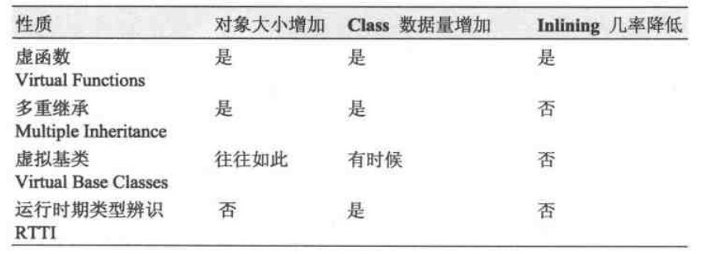
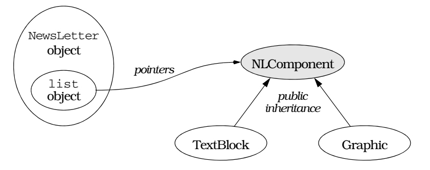
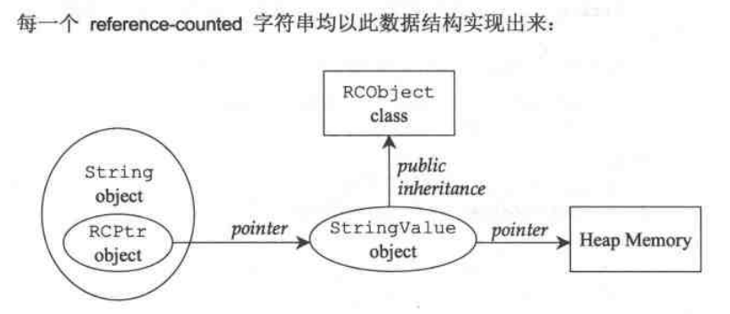
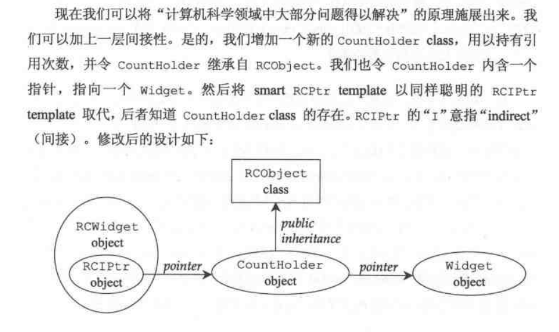

# More Effective C++


## 基础议题 Basics 

这一章描述了

- pointers和reference的差异，并告诉你他们的适当使用时机。
- 介绍了新的C++转型语法，并解释为什么新式转型法比旧式的C转型法优越。
- 检验了C的数组概念和C++的多态概念，并说明为什么混用二者是不智之举。
- 讨论了默认构造函数正反方意见。

### 条款01：仔细区别指针和引用

Item 1: Distinguish between pointers and references.

首先必须明确，没有ull reference，reference必须绑定某个对象。所以你有一个变量，其目的是用来指向（代表）另一个对象，但是也有可能不指向（代表）任何对象，那么就应该使用pointer，因为可以将pointer设为null。（现在建议使用nullptr）。反过来看，如果你设计的变量必须总是代表一个对象，就可以使用reference。

> C++11引入了nullptr关键字，用于表示空指针，其设计目的是为了解决旧的C++代码中出现的NULL指针和0值之间的二义性。nullptr可以明确表示一个空指针，而0值可以表示指针、整数、浮点数等多种类型的值，因此使用nullptr可以更准确地表达代码的意图。
>
> nullptr和NULL的另一个区别是类型安全性。nullptr是一个特殊的空指针类型，可以隐式转换为任何其他指针类型，但不能转换为整数或浮点数类型。而NULL通常被定义为0或者(void*)0，这使得它可以隐式转换为任何类型的指针、整数或浮点数。因此，nullptr提供了更好的类型安全性，可以避免在指针和其他类型之间发生不必要的隐式转换。
>
> 此外，C++11的标准库中也使用了nullptr，比如在STL中的一些函数中，如std::unique_ptr、std::shared_ptr等。
>
> 综上所述，使用nullptr可以提高代码的可读性和可靠性，同时提供更好的类型安全性。

接下来的代码会产生不可预期的结果，因为解引用一个空指针是不可预期的行为。从此我们永不考虑reference成为null的可能性。

```c++
char *pc = 0; // set pointer to null
char& rc = *pc; // make reference refer to dereferenced null pointer
```

#### Pointer和reference的差异

reference必须绑定某个对象，因此必须要有初值。因此比起指针，所以使用reference之前不需要测试其有效性。

Pointer和reference之间的另一个重要差异就是，poiners可以被重新赋值，而reference总是指向它最初获得的那个对象。

```c++
string s1("Nancy");
string s2("Clancy");
string& rs = s1; // rs refers to s1
string *ps = &s1; // ps points to s1
rs = s2; // rs still refers to s1, but s1’s value is now "Clancy"
ps = &s2; // ps now points to s2; s1 is unchanged 
```

对于operator[]，这个操作符必须返回某种"能够被当做assignment赋值对象"的东西。即令operator[]返回一个reference。

> 当我们重载operator[]用于访问一个类的成员变量时，通常希望它返回一个引用，而不是一个值，有以下几个原因：
>
> 1. 方便修改：当我们使用引用来访问一个类的成员变量时，可以直接对这个变量进行修改，而不需要使用其他方法来实现。
> 2. 更高效：返回一个引用比返回一个值更高效。当返回一个引用时，函数只需要返回一个指向已经存在的对象的指针，而不需要创建一个新的对象。因此，使用引用可以减少内存分配和复制的开销，提高程序的效率。
> 3. 符合语义：使用引用可以使代码更符合语义。当我们使用operator[]访问一个类的成员变量时，我们通常是想要访问和修改该成员变量，而不是返回一个副本。
>
> 但在某些特定的情况下，返回一个值而不是引用可能更加合适，例如用于表示"如果这个元素不存在，则返回默认值"。

### 条款02：最好使用C++转型操作符

Item 2: Prefer C++-style casts.

#### 旧式转型的问题

- 旧式的C转型方式几乎允许你将任何类型转为其他类型，这是十分拙劣的。C转型方式也缺少C++面向对象的一些转换（譬如将const指针转为non-const指针，将base指针转为derived指针）。

- 旧式转型难以辨识，旧式转型的语法结构是由一堆小括号加上一个对象名称（标识符）组成。而小括号哪里都可能出现。

  ```c++
  (T) expression  或
  T(expression) //函数风格（Function-style）
  ```

为解决C旧式转型的缺点，C++导入4个新的转型操作符，const_cast、static_cast、reinterpret_cast和dynamic_cast。

```c++
(type) expression
//you should now generally write like this:
static_cast<type>(expression)
```

- static_cast：基本拥有与C旧式转换相同的威力与意义，以及相同的限制。用于基本类型之间的转换，以及用于类之间的转换。static_cast可以执行一些简单的类型转换，例如将一个浮点数转换为整数，或将一个父类指针转换为子类指针。但是不能将struct转为int，或是double转为pointer。甚至不能移除表达式的常量性。

- const_cast：仅用于将一个常量指针或引用转换成非常量的指针或引用。const_cast可以用于去掉const属性，从而可以在不改变对象内容的情况下修改指向它的指针或引用。

- reinterpret_cast：用于将一种类型的指针或引用转换为另一种类型的指针或引用。reinterpret_cast可以执行一些较为底层的类型转换，例如将一个指向对象的指针转换为一个指向整数的指针。因为比较底层，所以与编译平台息息相关，所以不具备移植性。

  转换后的函数指针可能无法正确地调用，从而导致未定义行为。

  ```c++
  #include <iostream>
  #include<string>
  using namespace std;
  
  void readFile(char* fileName) {
      std::cout << "Reading file: " << fileName << std::endl;
  }
  void writeFile(char* fileName, const char* content) {
      std::cout << "Writing file: " << fileName << " with content: " << content << std::endl;
  }
  int main() {
      // 定义两个函数指针，一个指向 readFile，另一个指向 writeFile
      void (*readPtr)(char*);
      void (*writePtr)(char*, const char*);
  
      readPtr = &readFile;
      writePtr = &writeFile;
  
      char fileName[] = "test.txt";
      readPtr(fileName);
      //readPtr = reinterpret_cast<void (*)(char*)>(writePtr);
      readPtr = reinterpret_cast<decltype(readPtr)>(writePtr);
      readPtr(fileName);
      return 0;
  }
  /*
  Reading file: test.txt
  Writing file: test.txt with content: UH��H�� H�MH�UH��8
  */
  ```

  

- dynamic_cast：用来执行继承体系中"安全的向下转型或跨系转型动作"，用于在继承层次结构中进行类型转换。dynamic_cast可以将一个基类指针或引用转换为一个派生类指针或引用，并得知是否成功，如果转型失败，会以null指针（转型对象是指针）或是exception（转型对象是reference）表现出来。它无法应用在缺乏虚函数的类型上（如double）。也无法改变类型的常量性。最常用来转换函数指针类型。


在程序中使用新式转型法，比较容易被解析，编译器也得以诊断转型错误。

### 条款03：绝对不要以多态方式处理数组

Item 3: Never treat arrays polymorphically. 

继承最重要的性质之一就是你可以通过指向基类的指针或引用来操作子类。我们称这种行为叫做多态。

C++也允许你通过基类指针/引用来操作子类对象所形成的数组，但这几乎不会如你所预期的操作。


举例说明，array数组里存放了子类D，D继承自B。尝试用B类型的指针来对其进行处理。

`array[i]`实际上是指针算术表达式的缩写。它代表的实际是`*(array+i)`。那么array 和 array+i 之间距离有多远呢？编译器会以为数组中每一个元素的大小是B的大小，但它实际上是D的大小。所以不管是对其增删查改，都会带来不可预期的结果。

【条款33】建议具体类不要继承自另一个具体类。

### 条款04：非必要不提供默认构造函数

Item 4: Avoid gratuitous default constructors. 

default constructors的意思是在没有任何外来信息的情况下将对象初始化，一些数值会被合理置为0或者null。一些容器会被置为空容器。

但是不是所有对象都如此，有一些类"必须有一些外来信息才能生成对象" 。

#### 类没有默认构造函数可能存在的问题

- 在产生数组时，无法为数组中的对象指定constructor自变量。

  解决方法有三种，但都有些繁琐

  1. 使用non-heap数组，non-heap 数组是指在栈上分配的数组，与在堆上分配的数组（heap 数组）相对。栈上分配的数组是指在函数内部定义的局部数组，它们的生命周期与函数的生命周期相同，当函数执行完毕时，数组将被自动销毁。注意的是，栈的大小是有限制的，如果在栈上分配的数组太大，可能会导致栈溢出。因此，在需要分配大量内存的情况下，应该考虑使用堆上分配的数组。

  2. 使用指针数组而非对象数组

     ```c++
     typedef EquipmentPiece* PEP; // a PEP is a pointer to
     // an EquipmentPiece
     PEP bestPieces[10]; // fine, no ctors called
     PEP *bestPieces = new PEP[10]; // also fine
     for (int i = 0; i < 10; ++i)
     	bestPieces[i] = new EquipmentPiece( ID Number );
     ```

     这个方式有两个缺点

     - 你必须记得将该指针数组指向的所有元素删除
     - 因为你需要额外的空间存放指针以及指针指向的对象。

  3. placement new

     为避免过度使用内存，先为此数组分配raw memory，然后使用placement【条款8】在这块内存上构造对象。

     ```c++
     // allocate enough raw memory for an array of 10
     // EquipmentPiece objects; see Item 8 for details on
     // the operator new[] function
     	void * rawMemory =
     		operator new[](10 * sizeof(EquipmentPiece));
     // make bestPieces point to it so it can be treated as an
     // EquipmentPiece array
     	EquipmentPiece *bestPieces =
     	static_cast<EquipmentPiece*>(rawMemory);
     // construct the EquipmentPiece objects in the memory 
     // using "placement new" (see Item 8)
     	for (int i = 0; i < 10; ++i){
     	  new(bestPieces + i) EquipmentPiece(IDNumber);
     	}
     ```

     placement new的缺点是，大部分程序员不熟悉它，且在数组内对象结束生命时，你得以手动的方式调用destructors，还得用delete[]来销毁raw memory。

- 类里缺少了默认构造函数，它们将不适用于许多template-based container classes。对模板而言，被实例化的模板类型必须要有一个default constructor。因为大多数的template内部几乎都是有一个基于类型参数而架构起来的数组。

  ```c++
  template<class T>
  class Array {
   public:
    Array(int size);
    ...
   private:
    T *data;
  };
  template<class T>
  Array<T>::Array(int size) {
    data = new T[size]; // calls T::T() for each element of the array
    ... 
  }
  ```

  通过谨慎设计template，我们可以消除对dctor的要求（vector就可以），但是不能考虑别人都为你设计的很好。

- 最后一个考虑点与virtual base classes【条款E43】有关。如果一个虚基类（virtual base class）没有默认构造函数（default constructor），那么它会给开发者带来很多麻烦。因为虚基类的构造函数参数必须由正在构造的对象的最终派生类提供。因此，如果一个虚基类没有默认构造函数，那么所有从该类派生的类（无论距离多远）都必须知道、理解并提供虚基类构造函数的参数。这样的要求对派生类的作者来说非常不合理。

#### 类里设定了默认构造函数的问题

如果为default constructor 没有足够信息（不符合要求）的对象做完整的初始化，那么这几乎肯定会造成class内的其他成员函数变得复杂。

```c++
class EquipmentPiece {
	public:
	 EquipmentPiece(int IDNumber = UNSPECIFIED);
...
	private:
	 static const int UNSPECIFIED; // magic ID number value
// meaning no ID was
}; // specified
```

现在我们的对象里有一个"无意义值"，而类似检查指针非空，我们现在可能需要在成员函数里检查它是否有意义。并针对结果进行处理，往往会造成时空资源的额外开销。

所以还是一个选择题：如果你确定默认构造函数可以保证对象所有的字段都被正确初始化，上述的成本开销也可以避免。否则，你就得放弃"产生的对象都已完全被初始化"这一声明，得花功夫做检查和处理。

## 操作符 Operators 

可被重载的操作符，它让你定义的类型有着和C++内建类型一样的语法，可以在看似简单的操作符背后放置威力巨大的手段。

但是稍有不慎，便向下沉沦。

- 单自变量constructor及隐式类型转换操作符尤其麻烦，因为它们可以在没有任何外在迹象的情况下被调用。
- 如果你重载了`||` `&&`等操作符后可能会导致各类问题，因为从内建操作符转移到用户定制函数而带来的各种语义的敏感变化，很容易被忽略。
- 许多操作符和其他操作符之间有某种标准关系，重载可能会破坏之。

所以我们需要关注：

- 重载运算符被调用的时机
- 重载运算符被调用的方法
- 重载运算符的行为
- 重载运算符如何与其他操作符产生关系
- 如何夺取重载运算符的控制权

### 条款05：对定制的"类型转换函数"保持警觉。

Item 5: Be wary of user-defined conversion functions. 

C++如C一样，可以进行隐式转换和（可能遗失信息的）转型。对于内建类型我们无能为力，这是语言的一部分，但是对于我们自己写的类型，我们可以通过控制函数来决定是否让编译器拿去做隐式类型转换之用。

两种函数允许编译器执行这样的转换：

- 单自变量constructor

  能以单一自变量成功调用的constructor，可能拥有单一参数，也可能声明中有多个参数，且除了第一参数外都有默认值

- 隐式类型转换操作符

  它的名称比较奇怪：operator+`类型()`,你不能为其指定返回值类型，因为函数名称已经体现了它的返回值类型。

```c++
#include <iostream>
#include<string>
#include <vector>
using namespace std;
class Name { // for names of things
 public:
  Name(const string &s); // converts string to Name
 private:
  string name;
};
Name::Name(const string &s) {
  this->name = s;
}
class Rational { // for rational numbers
 public:
  Rational(int _numerator = 0, // converts int to
		   int _denominator = 1); // Rational
  operator double() const;
 private:
  int numerator;
  int denominator;
};
Rational::Rational(int _numerator, int _denominator) {
  numerator = _numerator;
  denominator = _denominator;
}
Rational::operator double() const {
  return static_cast<double >(numerator) / denominator;
}

int main() {
  Rational r(1, 2); // r has the value 1/2
  double d = 0.5 * r; // converts r to a double, then does multiplication
  cout<<d<<endl;
  return 0;
}
/*
0.25
*/
```

但是呢，这里为你提供的建议是：**最好不要提供任何类型转换函数！**

根本原因在于，在你从未打算也为预期的情况下，此类函数可能会被调用，而结果可能是不正确、不直观的程序行为，也很难调试。

比如我们`cout<<Rational(1,2);`，我们原本期待它输出`1/2`，但是我们忘记写重载`<<`了，而编译器会找到隐式转换，最终输出0.5，而这不是我们期望的。

所以尽量不要提供类型转换函数，类似现在的double转换，我们可以通过提供一个asdouble函数来取代它。

大部分时候，"必须明白调用类型转换函数"虽然带来些许不便，却可因为"不再调用那些并不打算调用的函数"而获得弥补。


相比之下,单自变量constructor却不那么容易去除

```c++
template<class T>
class Array {
public:
    Array(int lowBound, int highBound);
    Array(int size);
    T& operator[](int index);
    ...
};
bool operator==( const Array<int>& lhs, const Array<int>& rhs);
Array<int> a(10);
Array<int> b(10);
...
for (int i = 0; i < 10; ++i)
    if (a == b[i]) { // oops! "a" should be "a[i]"
    	do something for when
    	a[i] and b[i] are equal;
    }
    else {
    	do something for when they’re not;
}
```

因为可以单自变量构造函数,所以利用`Array<int>`,将int转为Array,可以通过编译,但是实际上不是我们预期的代码!

只要不声明隐式类型转换操作符,便可将它所带来的害处避免,但是单自变量constructor却不那么容易去除.因为你可能真的需要一个提供单自变量的constructor.

有两种方法可以避免这个问题:

- 较简单,使用最新的C++特性:explicit.只要将构造函数声明为explicit,编译器就不能因隐式类型转换的需要而调用它们.显式类型转换还是允许的.

- 关于隐式类型转换的合法性,有一条规则,即**没有一个转换程序sequence of conversion可以内含一个以上的用户定制转换行为(即单自变量constructor或隐式类型转换操作符)** 所以我们可以利用这项规则,让你希望的对象构造行为合法化,不希望的隐式构造非法化.

  这里Array里内嵌了一个ArraySize,ArraySize这种类被称为proxy class ,它的每一个对象都是为了其他对象而存在的.Proxy Objects让你得以超越外观形式,进而控制你的软件行为.[条款30]就是一个开始.

  ```c++
  template<class T>
  class Array {
   public:
    class ArraySize { // this class is new
     public:
  	ArraySize(int numElements) : theSize(numElements) {}
  	int size() const { return theSize; }
     private:
  	int theSize;
    };
    Array(int lowBound, int highBound);
    Array(ArraySize size); // note new declaration
    ...
  };
  ```

  本质上就是套一层壳,我觉得这种方式不是很优雅.

总之,允许编译器进行隐式类型转换,害处将多于好处.除非明确好需求,不要使用它.

### 条款06：区别好前置后置的递增递减符

Item 6: Distinguish between prefix and postfix forms of increment and decrement operators. 

为了区分前置和后置运算符,让后置式有一个int自变量,并在被调用时由编译器默默地给这个int置一个0;

```c++
class UPInt { // "unlimited precision int"
public:
    UPInt& operator++(); // prefix ++
    const UPInt operator++(int); // postfix ++
    UPInt& operator--(); // prefix --
    const UPInt operator--(int); // postfix --
    UPInt& operator+=(int); // a += operator for UPInts
    // and ints
    ...
};
UPInt i;
++i; // calls i.operator++();
i++; // calls i.operator++(0);
--i; // calls i.operator--();
i--; // calls i.operator--(0);
```

这样做的还有一个重点,就是**这些操作符的前置会返回一个reference,后置会返回一个const对象.** 

这很好理解,**前置是累加后取出,后置是取出后累加(返回的是原值的拷贝)**.下面是它们的实现.

```c++
// prefix form: increment and fetch
UPInt& UPInt::operator++()
{
    *this += 1; // increment
    return *this; // fetch
}
// postfix form: fetch and increment
const UPInt UPInt::operator++(int)
{
    const UPInt oldValue = *this; // fetch
    ++(*this); // increment
    return oldValue; // return what was
}
```

至于为什么后置返回是const,

1. 因为与内建类型的逻辑统一

   ```c++
   UPInt i;
   i++++; // apply postfix increment twice
   //This is the same as
    
   
   int i;
   i++++; // error!
   ```

   而int型是不会允许的.

2. 与实际逻辑不符

   即使你写成`i++++`,得到的结果也只会使i加1后的值而已,因为第二个operator++改变的是第一个operator++返回的对象.这样的结果是违背直觉的,也容易引起混淆.所以最好禁止将其合法化.

   加了const后,在准备被第二次调用时,因为operator++是个non-const成员函数,所以const对象无法调用.

这里我们还注意到,后置存在拷贝操作,会有构造和析构带来的资源浪费,所以在**处理用户定制类型时,尽量使用前置式.**

另外,我们发现前置后置做了相同的事情,为了确保后置式的行为永远与前置保持一致,我们就可以让后置的实现以前置为基础,如上面的代码演示的一样.代码复用是一种很好的开发技巧,可以帮你降低开发的难度,维护代码的一致性.

### 条款07：永远不要重载`&&`、`||`、`,`操作符

Item 7: Never overload &&, ||, or ,. 

类似C,C++对于真假值表达式,采用的是"骤死式"评估方式.意思是一旦该表达式的真假值确定,即使表达式中还有部分尚未检验,整个评估过程仍告结束.

C++允许你重载`&&`和`||`,但一旦用了这一点,你就是用"函数调用 语义"来取代"骤死式 语义".

```c++
if (expression1 && expression2) ...
looks to compilers like one of these:
if (expression1.operator&&(expression2))  ...// when operator&& is a member function
if (operator&&(expression1, expression2)) ...// when operator&& is a global function
```


函数调用语义与骤死式语义有两大区别

1. 当函数调用动作被执行,所有参数值都必须评估完成.也就不再存在骤死式语义
2. C++语言规范并未规定函数调用动作中各参数的评估顺序,所以无法知道expression1和expression2哪个先被评估.而骤死式总是从左往右评估其自变量.


逗号操作符也与之类似.

逗号操作符用来构成表达式

```c++
for (int i = 0, j = strlen(s)-1;i < j;++i, --j) // aha! the comma operator!
```

表达式如果内含逗号,那么逗号左侧会先被评估,然后再评测逗号右边,最后,整个逗号表达式的结果以逗号右侧的值为代表.

无论你将逗号操作符写成成员函数或是非成员函数,你都不能保证左侧表达式一定比右侧表达式先被评估.所以不要轻易重载逗号运算符.

### 条款08：了解new delete的不同意义

Item 8: Understand the different meanings of new and delete. 

#### 千奇百怪的new

##### `new operator` 和`operator new`.

C++ 常常给我们带来一些困惑(不止一些),譬如`new operator` 和`operator new`.

我们日常使用的new是 new operator.这是一个内建操作符,它总是做两件事:分配足够的内存;在分配的内存上对要构建的对象设定初值.

我们可以改变的是用来容纳对象的那块内存的分配行为,new operator 调用的函数我们可以重写或重载,这个函数就是operator new.

operator new 类似malloc, 唯一的任务就是分配内存,取得分配的内存而将其转为一个对象,是new operator 的责任.

`string *ps = new string("Memory Management");`
实际上等于

```c++
void *memory = operator new (sizeof(string)); // get raw memory for a string  object
call string::string("Memory Management") on *memory; // initialize the object in the memory
string *ps = static_cast<string*>(memory); // make ps point to the new object
```

这里第二部设计调用构造函数,这是程序员无法涉足的,属于编译器的权力.这也是为什么你想要做一个heap-based object,一定要使用new operator的原因,你无法直接调用"对象初始化必需的constructor"(尤其是它可能为vtbl设定初值[条款24])

> `operator new`是C++中的内存分配函数，它负责在堆上分配指定大小的内存块并返回一个指向该内存块的指针。`operator new`函数是一个全局函数，可以在类内部和外部使用。
>
> 而`new operator`是C++中的一个表达式，用于在堆上分配内存并构造对象。它会调用类的构造函数来初始化内存块，并返回一个指向新分配的对象的指针。
>
> 它们的区别在于，`operator new`是一个函数，负责分配指定大小的内存块；而`new operator`是一个表达式，负责在这个内存块上构造对象。在使用`new`表达式时，实际上是先调用`operator new`函数来分配内存，然后再调用类的构造函数来初始化对象。
>
> 在C++中，我们可以重载`operator new`函数来改变内存分配的方式。例如，我们可以实现自己的内存池来提高内存分配的效率。而`new operator`不可以重载，因为它不是一个函数，而是一个表达式。
>
> `operator new`函数的原型如下：
>
> ```
> void* operator new(std::size_t size);
> ```
>
> `new operator`函数的原型如下：
>
> ```
> void* operator new(std::size_t size, void* ptr);
> ```
>
> 需要注意的是，`new operator`函数通常不需要手动调用，而是在使用`new`表达式时自动调用。

##### placement new

有时你会想在一些已经分配好的原始内存上构建对象,那么`placement new`就是来满足这种需求的.

`placement new`是通过使用`new`操作符的另一种形式来实现的，它不会分配新的内存，而是在指定的一块内存上直接构造对象。`placement new`需要传入一个指针作为第一个参数，指向我们要构造对象的内存块，例如：

```cpp
void* mem = malloc(sizeof(MyClass));  // 分配一块内存
MyClass* obj = new (mem) MyClass();  // 在该内存块上构造 MyClass 对象
```

在这个例子中，我们首先使用`malloc`函数分配了一块大小为`sizeof(MyClass)`的内存。然后我们使用`new`操作符的另一种形式来在该内存块上构造一个`MyClass`对象。注意，我们需要将分配的内存块的指针作为第一个参数传递给`new`操作符。

```c++
void* operator new (std::size_t size, void* ptr);
```

其中，第一个参数 `size` 表示需要分配的内存块大小（实际上这个参数在使用 placement new 的时候不需要），第二个参数 `ptr` 是一个指针，表示分配内存的起始地址，即在哪块内存上构造对象。

在使用`placement new`时，我们需要手动管理内存的分配和释放，需要确保在构造对象后，我们正确地释放了内存，例如：

```c++
obj->~MyClass();  // 调用对象的析构函数
free(mem);        // 释放内存
```

在释放内存之前，我们需要先调用对象的析构函数，确保对象的资源被正确地释放。然后我们使用`free`函数释放分配的内存。

总之，`placement new`是一种非常有用的内存分配方式，可以在一些特殊情况下优化内存分配和释放的效率。但是需要注意的是，它需要手动管理内存的分配和释放，使用时需要非常小心，以避免内存泄漏和其他问题。


总结一下就是:

- 如果你想将对象构建在heap,那么就用new operator.它会分配内存还会自动调用构造函数.
- 如果你只打算分配内存,那么就调用operator new,不会有构造函数被调用.
- 如果你打算在heap objects产生时自己决定内存分配方式,自己写一个operator new.
- 如果你打算在已分配并拥有指针的内存中构建对象,使用placement new.

用比喻就是new operator就是买精装修的房.operator new是毛坯,自己写就是自己指定毛坯位置,placement new就是在已经有门牌号(指针)的毛坯房装修.

#### delele

为避免资源泄漏,每一个动态分配内存行为都要有对应的释放动作.

内存释放动作由operator delete执行.

因此delete ps(ps指向string),会让编译器删除下面的代码.

```c++
ps->~string();
operator delete(ps);
```

这里有一个暗示,如果你想处理一块原始的内存,那么就应该直接用operator delete将其还给系统.

如果你使用了placement new，在某个内存地址上手动构造了一个对象，那么你不应该使用delete opeartor,因为使用placement new构造的对象的内存是手动分配的，而不是由`new`操作符分配的，因此使用`delete`释放该内存是不正确的。

你需要手动调用这个对象的析构函数，并在不再需要该内存时释放它。

示例如下：

```c++
// 在指针p指向的内存位置上使用placement new构造了一个对象
T* p = new (address) T(args);

// 调用对象的析构函数 但未释放内存
p->~T();

// 释放内存
operator delete(p);
```

在这个示例中，`address`是你指定的内存地址，`args`是构造函数的参数列表。在使用完这个对象后，我们需要首先手动调用对象的析构函数`p->~T()`，然后再使用`operator delete`释放内存。请注意，我们使用了全局的`operator delete`函数，因为我们手动指定了内存地址，所以无法使用类的成员函数`operator delete`。

需要注意的是，如果你在一个已分配的内存地址上使用了placement new，那么你也需要手动管理该内存，包括手动调用对象的析构函数和手动释放内存。这是因为，使用placement new只是在指定的内存位置上构造了一个对象，但并没有为该对象分配内存，也没有自动管理该内存的生命周期。因此，在使用placement new时，需要格外小心，确保手动管理内存的正确释放。

#### 数组带来的麻烦

数组略有不同,我们需要使用operator new[]来分配内存.operator delete[]来释放内存.`delete[]`函数会依次析构数组中的每个元素，然后释放整个数组内存.

总结一下:

new opeartor 和 delete opeartor都是内建操作符,我们无法控制,但是它们调用的内存分配/释放函数我们可以重载.

## 异常 Exceptions 

异常无法被忽略,想要写出exception safe的代码,需要程序员的精心设计.

### 条款09：利用析构函数避免泄露资源
Item 9: Use destructors to prevent resource leaks. 

我们得对那些操控局部性资源的指针说再见.

 下面举个例子说明:

```c++
void processAdoptions(istream& dataSource)
{
    while (dataSource) { // while there’s data
        ALA *pa = readALA(dataSource); // get next animal
        pa->processAdoption(); // process adoption
        delete pa; // delete object that
    } // readALA returned
}
```

如果`pa->processAdoption`抛出异常,后面的语句也就不会被执行,pa也就不会被删除.processAdoption无法捕捉它,这个exception会传播到调用端.所以每当`pa->processAdoption`抛出异常,processAdoption便发生一次资源泄漏.

要想改进也很简单,通过try-catch语句捕捉异常,释放资源即可.

```c++
void processAdoptions(istream& dataSource)
{
  while (dataSource) {
	ALA *pa = readALA(dataSource);
	try {
	  pa->processAdoption();
	}
	catch (...) { // catch all exceptions
	  delete pa; // avoid resource leak when an exception is thrown
	  throw; // propagate exception to caller
	} 
	delete pa; // avoid resource leak when no exception is thrown
  } 
}
```

但以上的写法太臃肿了,如果我们总要删除pa,那么我们可以集中于一处来做这件事,更准确地说,我们将一定要执行的清理代码移到processAdoption函数的某个局部对象的析构函数即可.而这种思路的实现就是以一个类似指针的对象取代pa.说简单些就是智能指针.

本例你可以用auto_ptr来代替pa(虽然auto_ptr在C++11已经被放弃了,书比较旧,凑活看看),用了智能指针,就不必再费心于析构了.

> auto_ptr 已经被从 C++11 标准中移除了。auto_ptr 是一种智能指针，旨在简化 C++ 程序员的内存管理，但它存在一些潜在的危险和限制。
>
> 首先，auto_ptr 不支持所有的指针语义。它采用了所有权转移的语义，这意味着当 auto_ptr 被赋值或销毁时，它所管理的指针会自动被释放。这可能会导致一些问题，例如在调用函数时，如果不小心将 auto_ptr 对象作为参数传递，就可能会导致意外释放指针，从而导致程序崩溃或不可预料的行为。
>
> 其次，auto_ptr 也不支持数组。它只能管理单个对象的指针，如果尝试使用 auto_ptr 来管理动态数组，则可能会导致内存泄漏或者非法内存访问。
>
> 为了解决这些问题，C++11 引入了 unique_ptr 和 shared_ptr 等更为安全和灵活的智能指针类。unique_ptr 支持所有权转移语义，但限制了指针的复制和赋值，从而避免了一些潜在的问题。而 shared_ptr 则使用引用计数的技术，支持多个智能指针共享同一个对象，并提供了自定义删除器和弱引用等高级特性。
>
> 因此，由于存在诸多的问题和限制，auto_ptr 已经被从 C++11 标准中移除，并且不建议在现代 C++ 程序中使用。如果需要使用智能指针，应该使用更为安全和灵活的 unique_ptr 或 shared_ptr 等智能指针类。

```c++
void processAdoptions(istream& dataSource)
{
    while (dataSource) {
    	auto_ptr<ALA> pa(readALA(dataSource));
    	pa->processAdoption();
    }
}
```

总结:将资源封装在对象内,通常就可以在exception出现时避免泄漏资源.

### 条款10：在构造函数内阻止资源泄露
Item 10: Prevent resource leaks in constructors. 

常见的构造函数可能抛出异常的原因包括：内存分配失败、文件读写错误、参数不合法等。但由于我们的constructor抛出异常并未执行完成,所以析构函数无法被用来正确释放资源.

我们可以通过在构造函数里写好很多try-catch来捕捉异常,释放资源,但**更好的处理方式还是利用RAII的智能指针**,来避免异常发生时的资源泄漏等危机.也增加了代码的可读性和健壮性.

### 条款11：禁止异常流出析构函数之外
Item 11: Prevent exceptions from leaving destructors. 

destructor有两种情况下会被调用:

- 对象在正常情况下被销毁,也就是当它离开了它的生存空间scope或是被明确的删除.
- 当对象被exception处理机制——也就是exception传播过程中stack-unwinding(栈展开)机制一一销毁.

在对象的析构函数中抛出异常会导致程序处于不确定的状态，无法正确地执行后续的操作。如果在析构函数中抛出异常，而该异常没有被捕获，则 C++ 编译器会调用 `std::unexpected()` 函数，该函数默认行为是调用 `std::terminate()` 函数，终止程序的运行。

因此，C++ 程序员应该确保在析构函数中不抛出异常，或者在析构函数中捕获并处理异常，以确保程序能够正确地执行并终止。需要注意的是，如果一个对象的析构函数抛出了异常并被捕获，那么程序仍然可以继续执行，但是需要注意对象的析构过程可能没有完全执行完毕，可能会导致资源泄漏等问题。

### 条款12：了解"抛出异常"和"传递参数"或"调用虚函数"的区别
Item 12: Understand how throwing an exception differs from passing a parameter or calling a virtual function. 

#### 抛出异常与传递参数的区别

看似catch异常和函数声明很相似,但是它们也有重大的不同点.

```c++
class Widget { ... }; // some class; it makes no
// difference what it is
void f1(Widget w); // all these functions
void f2(Widget& w); // take parameters of
void f3(const Widget& w); // type Widget, Widget&, or
void f4(Widget *pw); // Widget*
void f5(const Widget *pw);
catch (Widget w) ... // all these catch clauses
catch (Widget& w) ... // catch exceptions of
catch (const Widget& w) ... // type Widget, Widget&, or
catch (Widget *pw) ... /
```

##### 相同点

函数参数和exceptions的传递方式有三种:传值 传引用 传指针.

> 在 C++ 中，参数传递主要有三种方式：传值、传指针和传引用。其中，传值是将实参的值复制给形参，在函数内部使用形参的值进行操作；传指针和传引用都是将实参的地址传递给形参，通过形参操作实参。
>
> - 传址这个概念一般指传指针，因为指针是存储地址的变量。因此，传指针也可以称为传地址。但是，传引用和传指针并不是完全相同的概念。
>
> - 传引用是一种特殊的传址方式，它是通过将实参的别名（引用）传递给形参来进行参数传递的。与传指针不同，传引用不需要使用解引用运算符来访问实参，而且引用本身没有指针那样的地址。因此，传引用的语法更加简洁，使用起来更加方便。
>
> 因此，传址一般指的是传指针的方式，而传引用是一种特殊的传址方式，不同于传指针。在实际编程中，应该根据需要选择不同的参数传递方式，以达到更好的效果。

##### 不同点:

###### 控制权

但是视你传递的是参数或exceptions的不同,会导致控制权的变易:

- 调用函数,控制权会回到调用端(除非函数失败以至于无法返回),

- 但是当你抛出一个exception,控制权不会再回到抛出端,而是会在调用堆栈中查找匹配的异常处理程序，并在那里处理异常。这意味着，如果抛出异常后没有合适的异常处理程序，程序可能会崩溃或终止.

###### 复制

在抛出异常时，异常对象通常会被复制一份并传递给异常处理程序。这是因为异常处理程序需要处理异常对象的副本，以防止在处理期间修改原始异常对象。如果不复制异常对象，异常处理程序可能会修改原始异常对象，从而破坏程序的逻辑和正确性.

当抛出异常时，如果异常对象是在函数内部定义的局部变量或者在某个作用域内创建的临时对象，那么在离开该作用域后，该对象将会被析构并销毁。如果这个异常对象没有被复制，那么在异常处理程序尝试访问该对象时就会导致未定义行为，从而可能导致程序崩溃或出现其他问题。因此，在抛出异常时，必须复制异常对象并传递它的副本，以确保在异常处理程序中能够安全地访问该对象。

此外，为了确保异常对象能够在离开作用域后被正确地销毁，可以使用智能指针等资源管理技术来管理异常对象的生命周期。智能指针可以确保异常对象在不再需要时被及时地销毁，并且可以在异常处理程序中安全地访问该对象。

复制时,其行为视有对象的拷贝构造函数执行,而且相应于对象的静态类型而不是动态类型.[条款25]展现了一种技术(虚构造函数),可以让你以动态类型为本进行复制.

```c++
catch (Widget& w) // catch Widget exceptions
{
... // handle the exception
throw; // rethrow the exception so it
} // continues to propagate
catch (Widget& w) // catch Widget exceptions
{
... // handle the exception
throw w; // propagate a copy of the
} // caught exception
```

一般而言,你需要使用`throw;`才能重新抛出当前的exception,期间你不会改变被传播的exception的类型.而且为exception所做的复制动作,其结果是一个临时变量,如[条款19]所言,这给予编译器进行优化的权利.


###### 传递参数

```c++
catch (Widget w) ... // catch exception by value
catch (Widget& w) ... // catch exception by
// reference
catch (const Widget& w) ... // catch exception by
// reference-to-const
```

这里我们注意到,一个被抛出的(必为临时对象)对象可以简单使用by reference的方式捕捉,不需要by reference-to-const的方式捕捉.函数调用过程中将一个临时对象传递给一个non-const reference参数是不允许的[条款19],但对exceptions则属合法.

`catch (Widget w) `会复制所得参数.也就是说如果之前是`throw w;`,那么就会造成两次复制,造成资源开销.

千万不要抛出一个指向局部对象的指针,因为该局部对象会在exception传离其scope时被销毁而导致虚吊.这就是copy正要避免的地方.

try-catch中不会随意发生类型转换,只有类型匹配的对象才能被捕捉到。

在匹配过程中只有两种转换可以发生：

- 派生类到基类的转换

- 有型指针转为无型指针(`void*`)

  const/volatile限定符的增加(针对`const void*` 设计的catch,可以捕捉让任何指针类型的exception)。

> 需要注意的是，使用`catch (const void* ex)`来捕捉异常对象的方法是不安全的，因为该语句可以捕捉任何指针类型的异常，包括指向无效内存地址的指针，这可能会导致程序崩溃或者产生不可预测的行为。建议在代码中谨慎使用这种捕捉异常的方法。

传递参数和传递异常最后一个不同是catch语句总是按顺序来做匹配尝试.

#### 传递异常与调用虚函数的比较

传递异常是顺序匹配,first-fit,最先吻合策略.所以绝不要将针对base class设计的catch放在derived class设计的catch之前.

调用虚函数是所谓best-fit,最佳吻合策略

#### 总结

把一个对象传递给函数或使用该对象调用虚函数，与将该对象作为异常抛出有三种主要区别。

- 首先，异常对象总是被复制；当按值捕获时，它们甚至会被复制两次。传递给函数参数的对象根本不需要被复制。
- 其次，作为异常抛出的对象受到比传递给函数的对象更少的类型转换形式的限制。
- 最后，catch子句按照它们在源代码中出现的顺序进行检查，并选择可以成功执行的第一个。当使用对象调用虚函数时，选择的函数是提供最佳匹配对象类型的函数，即使它不是源代码中列出的第一个函数。

> 总结:
>
> 1. 抛出异常和传递参数是函数调用时主动发起的，而调用虚函数是通过对象的指针或引用间接地发起的。抛出异常和传递参数都可以在函数调用前或函数调用过程中指定参数的值，而调用虚函数则需要先创建对象，然后通过对象的指针或引用调用虚函数。
> 2. 抛出异常和传递参数是函数调用时向函数传递信息的方式，而调用虚函数是向对象发送消息的方式。抛出异常和传递参数可以用于向函数传递任意类型的数据，而调用虚函数只能用于向对象发送特定的消息，即调用该对象的虚函数。
> 3. 抛出异常和传递参数通常是同步调用，即调用方会等待函数返回或抛出异常后再继续执行。而调用虚函数通常是异步调用，即调用方在调用虚函数后不需要等待对象的响应，而是可以立即执行下一条语句。
>
> 总的来说，抛出异常和传递参数是向函数传递信息的方式，适用于函数和函数之间的交互；而调用虚函数是向对象发送消息的方式，适用于对象和对象之间的交互。


### 条款13：以传引用方式来捕捉异常
Item 13: Catch exceptions by reference. 

写catch子句时,你需要指定异常对象如何被传递过来,你可以选择传值,传指针,传引用.

#### 传指针

理论上,将异常从抛出段搬到捕捉端,必然是个缓慢的过程[条款15],而传指针应该是最有效率的做法,因为不需要复制对象.

但是使用指针需要保证异常对象在离开抛出指针的那个函数之后依然存在.static对象和global对象都没问题,但是程序员很容易忘记这项约束.

另外会存在`throw new exception;`这样在heap上分配资源的语句.那么就带来一个问题.即catch语句不知道是否要删除自己获得指针所指向的资源.这个问题没有回答.因为没法确定到底指针指向的是什么.

此外,catch-by-pointer与语言本身建立起来的惯例有所矛盾:

四个标准的exception(bad_malloc,bad_cast,bad_typeid,bad_exception)统统都是对象,而不是对象指针.所以我们必须用by-value或by-reference的方式捕捉它们.

> 1. `bad_alloc`：当使用 `new` 操作符分配内存失败时抛出，通常表示内存不足或无法分配所需大小的内存。
> 2. `bad_cast`：在使用 C++ 类型转换时，如果转换失败则抛出该异常。例如，当试图将一个基类对象转换为其派生类对象时，如果对象实际上不是该派生类的实例，则会抛出 `bad_cast` 异常。
> 3. `bad_typeid`：在使用 C++ 运行时类型识别 (RTTI) 功能时，如果 `typeid` 运算符作用于一个空指针或者一个不包含多态类的对象，则会抛出 `bad_typeid` 异常。
> 4. `bad_exception`：在使用 C++ 异常机制时，如果出现不允许的异常类型或未捕获的异常，则会抛出 `bad_exception` 异常。

#### 传值

catch-by-value固然可以消除上述exception是否要删除以及与标准exception不一致等问题,但这种方式每当exception对象被抛出就会被复制两次,而且也会导致切割问题(子类被基类的异常捕捉到,会失去其派生成分.析构时也会用base的析构函数,导致派生类资源无法正确释放).

#### 传引用

传引用避免了上述提到的所有问题,不会类似传指针导致空悬,也容易捕捉标准异常;不类似传值,不会有切割问题,每次也只会复制一次.


所以用catch by reference!

### 条款14：明智运用异常规范(已经过时)
Item 14: Use exception specifications judiciously. 

异常规范明确指出一个函数可以抛出什么样的exception.如果函数抛出一个违背列于exception specification 的exception,这个错误在运行期会被检验出来,于是特殊函数unexpected会被自动调用,所以说exception specification不但是一种文档式的辅助,也是一种实践式的机制,用来规范exception的运用.

但是unexpected的默认行为是terminate,terminate的默认函数是调用abort.所以程序如果违反异常规范,默认结果就是程序被中止,没机会指向此类清理工作.

但是，在 C++11 标准中，已经移除了 dynamic exception specification，也就是使用 `throw(type1, type2, ...)` 的方式指定函数可能抛出的异常。因为 dynamic exception specification 会导致代码变得复杂和不可移植，同时也无法完全确保程序的正确性。因此，在 C++11 及以后的标准中，不应该使用 dynamic exception specification。

另外，您提到了 `unexpected` 函数，这是在早期的 C++ 标准中提供的一个函数，用于处理因未处理的异常而导致程序终止的情况。当程序运行时遇到未处理的异常时，如果没有提供专门的异常处理代码来处理该异常，就会自动调用 `unexpected` 函数。默认情况下，`unexpected` 函数会调用 `std::terminate` 函数，从而导致程序终止。

需要注意的是，在 C++11 及以后的标准中，`unexpected` 函数已经被废弃，取而代之的是 `std::unexpected_handler` 类型和 `std::set_unexpected` 函数。这些新的异常处理机制提供了更加灵活和可靠的方式来处理未处理的异常。

### 条款15：了解异常处理的成本
Item 15: Understand the costs of exception handling. 

为了能够在运行时期处理exceptions,程序必须做大量簿记工作.exception的处理需要成本.

你可以选择放弃使用异常处理,但前提你知道自己的程序不能任何一处使用try,throw,catch,而且你所链接的程序库也没有一个使用到这些.这样编译器会做某些性能优化.

try语句一般会带来5%-10%的代码膨胀和执行速度下降.为了将此成本最小化,避免非必要的try语句.

## 效率 Efficiency 

本章以两个角度对效率主题发起冲击:

- 第一个角度与程序语言无关,不过由于C++有一个极佳的实现媒介:由于它对封装的强力支持,我们有可能将低效率的class实现品以相同接口但拥有较佳算法和数据结构的新产品取代.
- 第二个角度与C++很有关.最险恶的错误就是"产生和销毁过多的对象".这个错误不仅容易形成,而且不容易被辨识出来.多余对象的构造动作和析构动作是程序性能的大出血.

### 条款16：谨记80-20法则
Item 16: Remember the 80-20 rule.

 80-20 是一个很常见的规则,不仅仅只是在代码效率上,在代码开发,内存使用都常常见到它.

在实际的效率优化里,我们需要根据观察和实验来识别出你心痛的那20%的代码.而辨识之道就是借助某个程序分析器.

程序分析器的种类多种多样,使用它们的技巧也浩如烟海.

简而言之,找到代码效能的瓶颈关键 -- 那20%.

### 条款17：考虑使用缓式评估
Item 17: Consider using lazy evaluation.

类似小时候的拖延战术,一旦你使用缓式评估,意味着你使用某种方式来撰写你的类,使它们延缓运算,直到那些运算结果刻不容缓地被迫切需要位置.下面描述四种用途.

1. 引用计数 Reference Counting 

   很多时候,我们只需要提供简单的簿记工作,而不需要进行创建销毁对象的操作,除非对象真的要创建.

   ```c++
   string s1 = "hello";
   string s2 = s1;
   string s3 = s1 + s2;//这里只有读,没有写,所以如果对s2进行好的簿记,那么就可以理解为s1+s1
   s2.convertToUppercase();//这里s2改变了,s1并没有改变,我们需要这个函数为s2做副本,再修改它给s2私人使用,.如果s2从未被更改,我们就不需要为其内容做一个私有副本.
   ```

   引用计数是一种内存管理技术，用于跟踪对象被引用的次数。在某些情况下，对象的创建和销毁成本很高，因此使用引用计数来管理内存可以提高性能。使用引用计数可以确保对象只在没有任何引用时才被销毁。

2. 区分读和写 

   ```c++
   String s = "Homer’s Iliad"; // Assume s is a 
   // reference-counted string
   ...
   cout << s[3]; // call operator[] to read s[3]
   s[3] = ’x’; // call operator[] to write s[3]
   ```

   在某些情况下，对于一个变量，读操作的次数可能远远大于写操作的次数。在这种情况下，可以使用缓存式评估来延迟计算结果的生成，直到它们被请求为止。这样可以避免在每次读操作时进行不必要的计算。

   我们可以使用代理类[条款30]来延迟执行读取和写入操作。当我们尝试读取`s`的第三个字符时，代理类可以立即返回一个字符的副本，而不必进行任何额外的操作。但是当我们尝试写入`s`的第三个字符时，代理类可以推迟实际的写入操作，直到确定写入操作是必要的为止。在这种情况下，代理类可以创建一个新的字符串副本，以确保引用计数的字符串保持不可变。

   通过使用代理类和延迟计算，我们可以区分读取和写入操作，并相应地执行不同的操作，从而提高程序的性能和可维护性。

3. 缓式取出 Lazy Fetching 

   在处理大量数据时，缓存式评估可以显著提高性能。当访问一个对象的某个属性时，如果这个属性的值需要从数据库或其他远程资源中获取，使用缓存式评估可以避免重复的网络请求，提高性能。

4. 表达式缓评估 Lazy Expression Evaluation

   ```c++
   template<class T>
   class Matrix { ... }; // for homogeneous matrices
   Matrix<int> m1(1000, 1000); // a 1000 by 1000 matrix
   Matrix<int> m2(1000, 1000); // ditto
   ...
   Matrix<int> m3 = m1 + m2; // add m1 and m2.
   
   Matrix<int> m4(1000, 1000);
   ... // give m4 some values
   m3 = m4 * m1;
   //之前的m1+m2实际上就不需要计算了.
   cout << m3[4]; // 看似我们需要计算整个m3了,但是实际上我们也只需要计算第四行就行了.
   cout << m3;//必须输出整个m3了
   ```

   在一些语言中，表达式的计算可能涉及到复杂的计算，或者是可能出现除数为零等错误情况。使用缓存式评估可以延迟表达式的计算，直到需要的时候才进行计算，从而避免不必要的计算和错误。

#### 总结:

lazy evaluation 在许多领域都有应用:主要是避免不需要的操作(构造析构,复制,读写,计算).但是类似其他任何优化算法和数据结构,创建和维护这些结构的成本要远小于它节约的时空成本,它才有价值.

### 条款18：分期摊还预期的计算成本 – 超急评估
Item 18: Amortize the cost of expected computations. 

在程序设计中,我们常常会发现某种"殊途同归".在上一个条款我们说了"延迟"有助于我们改善程序性能.而在本条款,我们将讲一个恰恰相反的的改善性能的方法:超急评估(over-eager evaluation).

超急评估通常适用于那些在程序执行过程中计算量较小但是被频繁使用的部分，例如常量表达式、编译时计算等。在C++中，编译器可以通过一些优化技术来实现超急评估，例如常量折叠(constant folding)、内联函数(inline function)、模板元编程(template metaprogramming)等。

> Caching是一种将数据暂时存储在快速存储设备（如高速缓存）中的技术，以便在需要时可以快速访问这些数据，从而避免从慢速存储设备（如硬盘）中读取数据。Caching通常用于缓存一些经常被访问的数据，以便在程序执行过程中快速访问这些数据。Caching技术的实现方式包括缓存一致性协议、置换策略等。
>
> Prefetching是一种提前加载数据的技术，它在需要使用数据之前提前将数据加载到快速存储设备中，以便在需要时可以快速访问这些数据。Prefetching通常用于预测程序执行过程中可能需要使用的数据，并将这些数据提前加载到快速存储设备中。Prefetching技术的实现方式包括静态预测和动态预测等。
>
> 可以看出，Caching和Prefetching虽然都涉及到数据的缓存和预加载，但是它们的应用场景和实现方式有所不同。Caching通常用于缓存一些经常被访问的数据，以避免从慢速存储设备中读取数据。而Prefetching则用于预测程序执行过程中可能需要使用的数据，并将这些数据提前加载到快速存储设备中，以避免等待时间。在实际应用中，Caching和Prefetching通常结合使用，以便更好地提高程序的性能。

还有一处用例就是vector,在它插入元素后的大小比他预期设定的内存大小大,它会申请两倍的内存.这也是一种超急评估.

需要注意的是，超急评估并不适用于那些计算量较大或者需要根据程序执行上下文动态计算的部分，因为这些部分的提前计算可能会导致额外的计算开销和内存开销。此外，过度的超急评估也可能会增加代码的复杂性和维护成本，因此需要根据具体情况进行权衡和优化。

### 条款19：了解临时对象的来源
Item 19: Understand the origin of temporary objects. 

我们往往会把swap里的temp这些叫做临时对象.但是C++中真正的临时变量是不可见的.只要你产生了一个non-heap object 而没有给它命名,那么便诞生了一个临时对象.此等匿名对象通常发生于两种情况:

- 当隐式类型转换被施行以后以求函数调用能够成功

  只有对象以传值方式传递,或是当对象被传递给一个const引用时,这些转换才会发生,如果传给一个non const引用,则不会发生此类转换.

  > 这是因为当一个对象以传值方式传递时，编译器需要将其复制到一个新的对象中，因此需要进行隐式类型转换以保证类型匹配。
  >
  > 针对非 const 引用对象的隐式类型转换会允许修改临时对象，而程序员期望修改的是非临时对象。这就是为什么语言禁止为非 const 引用参数创建临时对象的原因。
  >
  > 相反，引用到 const 参数不会出现这个问题，因为这样的参数是 const 的，不能被修改。

- 当函数返回对象的时候.

临时对象的生命周期通常是非常短暂的，它们会在生成之后立即被销毁。因此，在使用临时对象时需要格外小心，避免出现生命周期错误和悬垂指针等问题。[条款20]会讨论返回值优化的问题.


#### 总结:

临时对象可能很耗费成本,我们应该尽可能消除它们.另外,我们也应该训练出看出可能产生临时对象的眼力.一般来说,任何时候你看到一个reference-to-const参数,就极可能会有一个临时对象被产生出来绑定至该参数上.任何时候只要你看到函数返回一个对象,就会产生临时对象.


### 条款20：协助完成返回值优化RVO1
Item 20: Facilitate the return value optimization. 

以by-value方式返回对象,背后隐藏的constructor和destructor[条款19]都将无法消除.除非你确定必要且正确,否则不要返回值.

比如说分数,你就必须返回一个值,任何你试图返回指针或引用都可能会导致虚吊.

```c++
class Rational {
public:
Rational(int numerator = 0, int denominator = 1);
...
int numerator() const;
int denominator() const;
};
// For an explanation of why the return value is const,
// see Item 6
const Rational operator*(const Rational& lhs,
const Rational& rhs);
```

下面是一些错误的返回方式:

```c++
// an unreasonable way to avoid returning an object
const Rational * operator*(const Rational& lhs,const Rational& rhs);
Rational a = 10;
Rational b(1, 2);
Rational c = *(a * b); // Does this look "natural" to you?

// a dangerous (and incorrect) way to avoid returning an object
const Rational& operator*(const Rational& lhs, const Rational& rhs);
Rational a = 10;
Rational b(1, 2);
Rational c = a * b; // looks perfectly reasonable

// another dangerous (and incorrect) way to avoid returning an object
const Rational& operator*(const Rational& lhs,const Rational& rhs)
{
    Rational result(lhs.numerator() * rhs.numerator(),
    lhs.denominator() * rhs.denominator());
    return result;
}
```

如果函数一定要返回对象,我们要做的是努力降低返回对象的成本,而不是消除对象本身.

我们可以通过返回所谓的constructor arguments以取代对象.

```c++
// an efficient and correct way to implement a function that returns an object
const Rational operator*(const Rational& lhs,const Rational& rhs)
{
	return Rational(lhs.numerator() * rhs.numerator(),lhs.denominator() * rhs.denominator());
}
```

以constructor arguments取代局部对象,当做返回值,虽然我们必须为"函数内的临时对象"和"函数返回对象"的构造析构付出代价,但是因为C++允许编译器将临时对象优化,使它们不存在.还可以通过将 operator* 声明为 inline 函数来避免函数调用的开销.

而这些被编译器优化的部分就被叫做return value optimization.

> Return value optimization (RVO) 是一种编译器优化技术，它可以避免创建不必要的临时对象，从而提高程序的性能。具体来说，RVO 可以让编译器在函数返回时直接构造对象，并将其作为函数调用表达式的值返回，从而避免创建任何临时对象。
>
> 大多数主流编译器都支持 RVO，包括 GCC、Clang、Visual Studio 等。在某些情况下，编译器还可以使用 Named Return Value Optimization (NRVO) 技术，它可以直接在函数栈上构造对象，并将其作为返回值返回。NRVO 通常比 RVO 更高效，因为它可以避免分配和释放堆上的内存。
>
> 在实践中，编写高效的代码通常需要结合使用 RVO、NRVO 和其他编译器优化技术。为了使编译器可以进行优化，我们可以使用 const 引用、移动语义、constructor arguments 等技术来避免创建不必要的临时对象，并尽可能地使用 inline 函数来避免函数调用的开销。
>
> 总的来说，RVO 是一种重要的编译器优化技术，它可以显著地提高程序的性能。虽然大多数编译器都支持 RVO，但具体实现可能会有所不同，因此在编写代码时需要考虑不同编译器的实现细节。

### 条款21：利用重载机制来避免隐式类型转换
Item 21: Overload to avoid implicit type conversions. 

通过明确的声明重载来避免隐式类型转换.

```c++
const UPInt operator+(const UPInt& lhs,const UPInt& rhs); // add UPInt and UPInt
const UPInt operator+(const UPInt& lhs,int rhs); // add UPInt and int
const UPInt operator+(int lhs, const UPInt& rhs); // add int and UPInt

const UPInt operator+(int lhs, int rhs); // error!
```

不过C++有一个规则就是每个重载操作符必须获得至少一个用户定制类型的自变量.

> C++中每个重载操作符必须获得至少一个用户自定义类型的自变量，是为了让编译器知道在特定情况下应该如何处理运算符。这是因为运算符重载是一种自定义类型行为，不同的程序员可以定义不同的运算符含义和行为，因此编译器需要知道在特定情况下如何使用这些自定义类型。
>
> 通过为重载操作符提供自定义类型的参数，编译器能够将运算符与其相应的含义和操作进行关联。这样，在使用运算符时，编译器可以根据自定义类型参数的类型和值来确定要执行的操作，并正确地转换数据类型。这使得C++能够支持自定义类型之间的运算符操作，从而增强了其灵活性和可扩展性。
>
> 另外，要注意的是，并不是所有的运算符都可以被重载。有些运算符如点运算符（.）、成员指针运算符（.*）、作用域运算符（::）等是不能被重载的，因为这些运算符是语言内部的关键字，其含义和行为已经被固定下来，不能被用户自定义修改。

通过合理的重载可以消除类型转换.

### 条款22：考虑以操作符复合形式(op=)来取代其独身形式(op)
Item 22: Consider using op= instead of stand-alone op. 

确保操作符的复合形式和独身形式之间的自然关系可以存在,一个好方法就是以`op=`实现`op`.

```C++
class Rational {
public:
    ...
    Rational& operator+=(const Rational& rhs);
    Rational& operator-=(const Rational& rhs);
};
// operator+ implemented in terms of operator+=; see
// Item 6 for an explanation of why the return value is
// const and page 109 for a warning about implementation
const Rational operator+(const Rational& lhs,const Rational& rhs)
{ 
	return Rational(lhs) += rhs;
}
// operator- implemented in terms of operator -=
const Rational operator-(const Rational& lhs,const Rational& rhs)
{
	return Rational(lhs) -= rhs;
}
```

我们需要注意一些与性能有关的点:

- 一般来说,复合操作符比其对应的独身版本效率高.因为独身版本通常必须返回一个新对象.而复合版本则是直接将结果写入其左端自变量.

- 如果同时提供复合和独身操作符,那么就允许客户自己在便利和性能之间做取舍.

  ```c++
  Rational a, b, c, d, result;
  ...
  result = a + b + c + d; // probably uses 3 temporary objects, one for each call to operator+
  
  //or like this:
  
  result = a; // no temporary needed
  result += b; // no temporary needed
  result += c; // no temporary needed
  result += d; // no temporary needed
  ```

- 最后来看看op+的实现源码

  ```c++
  template<class T>
  const T operator+(const T& lhs, const T& rhs)
  { return T(lhs) += rhs; }
  ```

  虽然下面的代码可能更好理解,但那样就放弃了之前提到的编译器优化可能.

  ```c++
  template<class T>
  const T operator+(const T& lhs, const T& rhs)
  {
  T result(lhs); // copy lhs into result
  return result += rhs; // add rhs to it and return
  }
  ```


总结:

如果追求性能,尽量使用复合运算符.

### 条款23：考虑使用其他程序库
Item 23: Consider alternative libraries. 

程序库的设计,可以说事一种折中态度的练习.理想的程序库应该小,快速,威力强大,富弹性,拓展性强,直观,可广泛应用,有良好支持,使用时没有舒服,而且没有bug.但这样的库是不可能存在的.如果针对大小和速度做优化,那么就不具备移植性.如果拥有丰富的机能,那么就不容易直观.不存在任何bug的程序库更是不存在.

不同的设计者面对这些规范给予不同的优先权.它们的设计各有不同的牺牲.所以,很容易出现两个程序库提供类似机能,却有着不同的性能表现的情况.

一般来说,stdio库比iostream快得多.

所以当你发现了性能的瓶颈,我们可以替换别的程序库来优化性能.

### 条款24：了解虚函数、多重继承、虚基类和RTTI的成本
Item 24: Understand the costs of virtual functions, multiple inheritance, virtual base classes, and RTTI. 

不同的C++编译器可能用不同的方法来实现语言中的每一个性质,然而某些语言特性的实现可能会对对象的大小和其member functions的执行速度带来冲击,所以面对这些特性, 了解"编译器可能以什么方式来实现它们"很重要,这类性质中最重要的就是虚函数.

当虚函数被调用,执行的代码必须对应于调用者(对象)的动态类型.对象的pointer或reference,其类型是无形的,大部分编译器是通过`virtual tables`和`virtual table pointers`来实现的,两者常被简写为`vtbls`和`vptrs`.

`vtbls`通常是一个由"函数指针"架构而成的数组,某些编译器会用链表取代数组,但其基本策略相同.程序中每一个class凡是声明或继承虚函数者,都有自己的一个vtbls,而其中的条目(entries),就是该class的各个虚函数实现体的指针.

#### 虚函数的成本:

你必须为每个拥有虚函数的class耗费一个vtbl空间,其大小视虚函数的个数(包括继承而来的)而定.每个class应该只有一个vtbl,但是如果你有很多这类class,以及每一个class中都拥有大量虚函数,你可能会发现,vtbls占用不少内存.

由于程序中每一个class的vtbl只需一份就好,编译器就需要处理它们的产生和存放问题.

- 对于提供整合环境(包含编译器和连接器)的厂商而言,一种暴力式做法就是在每一个需要vtbl的目标文件内部都产生一个vtbl副本,最后由连接器去除重复的副本,是最终的可执行文件或程序库内,都只留下每个vtbl的单一实体.
- 更常见的设计是以一种探勘式做法,决定哪一个目标文件应该内含某个class的vtbl.做法思路如下:class's vtbl被产生于"内含其第一个non-inline,non-pure virtual函数定义式"的目标文件中.这样做的原因是，非内联、非纯虚函数定义是该类中唯一可能被其他源文件所引用的函数，因此将虚函数表生成在该函数所在的目标文件中，可以保证每个虚函数表只会被生成一次，并在链接时进行合并去重操作。而你如果将class内的虚函数都设定为inline.这种做法就会宣告失败,目前的编译器通常都会忽略虚函数的inline指示.

得到Virtual tables只是虚函数实现机制的一半.只有通过某种方法指示出每个对象相应于哪个vtbl,vtbl才真正有用.而这也就是vptr的任务.凡声明有虚函数的class,其对象都有一个隐藏的data member(即vptr).用来指向该class的vtbl.

虚函数的第二个成本,就是必须在每一个拥有虚函数的对象内付出"一个额外指针"的代价.如果对象不大,这个成本可能尤为显眼.内存不是很充裕的系统中,这意味着你能产生的对象数量减少了;而即使在一个内存充裕的系统中,这也意味着你的软件性能降低了,因为较大的对象意味着较难死啊如一个缓存分页cache page或虚内存分页中,那么你的换页行为就会增加.

虚函数不应该inline,inline的意思是在编译期将调用端的调用动作用调用函数本体来替代.而virual则意味着等待,直到运行时期才知道哪个函数会被调用.如果虚函数是通过对象来调用,实际上可以inline,但是因为大部分虚函数调用动作是通过对象的指针或reference完成的,此类行为无法被inlined.由于这类调用是常态,所以虚函数实际上等于无法被inlined.

总结一下:虚函数的成本增加主要在三个方面:

- 首先是建立vtbl的成本.
- 每个类里都有一个vptr,必定导致对象变大,可能导致换页行为增加.
- 放弃了inline可能带来的优化.

#### 多重继承的带来的复杂与成本

多重继承情况下,找到对象的vptrs会变得稍复杂一些,因为一个对象会有多个vptrs(每个base对应一个),而且针对base classes的特殊vtbls也被产生出来.

多重继承往往导致virtual base classes的需求(虚拟基类),虚拟基类（Virtual Base Class，简称VBC）是一种解决“菱形继承”问题的机制。当一个类需要从多个类派生而来，并且这些类中有共同的基类时，可以将这个共同的基类声明为虚拟基类，这样这个共同的基类就只会在最终的派生类中出现一次，从而避免了二义性和冗余数据的问题。


#### RTTI的成本

运行时类型辨认(runtime type indentification),RTTI让我们得以在运行时期获得objects和classes的相关信息.这些信息被存放在类型为type_info的对象内.你可以使用typeid操作符取得某个class相应的type_info对象.

RTTI的设计理念是:根据class的vtbl来实现.

> RTTI主要通过以下两个运算符实现：
>
> 1. dynamic_cast运算符：用于在继承体系中进行向下转型（即从基类指针或引用转换为派生类指针或引用），它会在运行时进行类型检查，如果类型转换不合法，则返回空指针或抛出异常。
> 2. typeid运算符：用于获取对象的类型信息，返回一个type_info对象，其中包含了对象的类型名称、类型的大小、类型的对齐方式等信息。可以将type_info对象与其他type_info对象进行比较，以判断两个对象是否为同一类型。
>
> RTTI的使用需要注意以下几点：
>
> 1. RTTI会带来一定的运行时开销，因此在实际应用中应该谨慎使用。
> 2. RTTI只能用于包含虚函数的类，如果一个类没有定义虚函数，则无法使用RTTI来获取其类型信息。
> 3. RTTI不能用于在继承体系中进行向上转型（即从派生类指针或引用转换为基类指针或引用），因为向上转型是安全的，不需要进行类型检查。
>
> 总之，RTTI是一个强大的C++特性，可以在运行时进行类型判断和转换，但是在使用时需要谨慎考虑其开销和适用场景。\
>
> 
>
> dynamic_cast运算符用于在继承体系中进行向下转型，即从基类指针或引用转换为派生类指针或引用。在执行dynamic_cast时，编译器会生成一段代码，在运行时进行类型检查，以确定是否可以进行类型转换。如果转换合法，则返回一个指向派生类对象的指针或引用；如果转换不合法，则返回空指针或抛出异常。
>
> RTTI提供了dynamic_cast运算符所需的类型信息，可以在运行时判断一个对象的实际类型，从而进行类型转换或类型检查等操作。dynamic_cast运算符在执行时会利用RTTI信息进行类型检查，从而保证类型转换的安全性。
>
> 需要注意的是，RTTI除了用于dynamic_cast运算符之外，还可以用于其他一些应用，如typeid运算符、type_info类等。因此，RTTI是一个通用的类型信息机制，而dynamic_cast运算符只是其中的一个应用。

#### 总结:

> 1. 虚函数：虚函数的实现需要使用虚函数表，会导致类的大小增加，并且会带来一定的运行时开销，包括虚函数表的查找和虚函数的调用。因此，在实际应用中，需要权衡使用虚函数带来的灵活性和开销。
> 2. 多重继承：多重继承会导致派生类中出现多个相同的基类对象，从而增加了类的大小和内存占用，也会增加代码的复杂度和可读性。此外，在进行类型转换时，需要使用dynamic_cast运算符和RTTI机制，带来了一定的运行时开销。
> 3. 虚基类：虚基类可以解决多重继承中的二义性和冗余数据问题，但是也会带来额外的开销和复杂性，包括派生类中虚基类指针的管理和构造函数的初始化列表中虚基类的构造等。因此，在使用虚基类时，需要权衡其带来的优势和开销。
> 4. RTTI：RTTI机制需要在程序运行时进行类型检查，会带来一定的运行时开销和性能损失。此外，RTTI只能用于包含虚函数的类，并且不能用于在继承体系中进行向上转型。因此，在使用RTTI时，需要谨慎考虑其适用范围和开销。



## 技术 Techniques 

这一章,提供了很多的技术方面的解法,或者说是惯用手法idioms或模式pattern.

### 条款25：将构造函数和非成员函数虚化
Item 25: Virtualizing constructors and non-member functions. 

#### 将构造函数虚化

虚构造函数看起来很荒谬,但也很有用.

所谓virtual constructor就是根据获得的输入,可产生不同类型的对象.

有一种特别的virtual constructor即所谓的virtual copy constructor也被广泛使用,这个函数会返回一个指针,指向其调用者的一个新副本.

> ```c++
> #include <iostream>
> using namespace std;
> 
> class Shape {
> public:
>     virtual ~Shape() {}
>     virtual Shape* clone() const = 0;
>     virtual void draw() const = 0;
> };
> 
> class Circle : public Shape {
> public:
>     Circle(int x, int y, int r) : m_x(x), m_y(y), m_r(r) {}
>     Circle(const Circle& other) {
>         m_x = other.m_x;
>         m_y = other.m_y;
>         m_r = other.m_r;
>     }
>     Shape* clone() const {
>         return new Circle(*this);
>     }
>     void draw() const {
>         cout << "Circle(" << m_x << ", " << m_y << ", " << m_r << ")" << endl;
>     }
> private:
>     int m_x, m_y, m_r;
> };
> 
> class Square : public Shape {
> public:
>     Square(int x, int y, int l) : m_x(x), m_y(y), m_l(l) {}
>     Square(const Square& other) {
>         m_x = other.m_x;
>         m_y = other.m_y;
>         m_l = other.m_l;
>     }
>     Shape* clone() const {
>         return new Square(*this);
>     }
>     void draw() const {
>         cout << "Square(" << m_x << ", " << m_y << ", " << m_l << ")" << endl;
>     }
> private:
>     int m_x, m_y, m_l;
> };
> 
> int main() {
>     Shape* shapes[3];
>     shapes[0] = new Circle(1, 2, 3);
>     shapes[1] = new Square(4, 5, 6);
>     shapes[2] = new Circle(7, 8, 9);
> 
>     for (int i = 0; i < 3; ++i) {
>         Shape* clone = shapes[i]->clone();
>         clone->draw();
>         delete clone;
>     }
> 
>     return 0;
> }
> 
> ```
>
> 

可以看到,这里的VCC只是调用真正的copy constructor.两者的copy(深浅复制,引用计数,写入时才复制)是一样的.

注意:上述实现手法利用了"虚函数之返回类型"规则中的一个宽松点,当derived class重新定义其base class的一个虚函数,不再需要一定得声明与原本相同的返回类型.如果函数的返回类型是一个指针(或reference),指向一个base class,那么derived class的函数可以返回一个指针(或reference),指向该base class的一个derived class.这并不会造成C++的类型系统门户洞开.

现在有了一个virtual copy constructor,我们可以为它实现一个正常的copy constructor.



```c++
class NLComponent { // abstract base class for
public: // newsletter components
... // contains at least one
}; // pure virtual function
class TextBlock: public NLComponent {
public:
... // contains no pure virtual
}; // functions
class Graphic: public NLComponent {
public:
... // contains no pure virtual
}; // functions
class NewsLetter { // a newsletter object
public: // consists of a list of
... // NLComponent objects
private:
list<NLComponent*> components;
};
class NewsLetter {
    public:
    NewsLetter(const NewsLetter& rhs);
        ...
    private:
        list<NLComponent*> components;
    };
    NewsLetter::NewsLetter(const NewsLetter& rhs)
    {
            // iterate over rhs’s list, using each element’s
            // virtual copy constructor to copy the element into
            // the components list for this object. For details on
            // how the following code works, see Item 35.
        for (list<NLComponent*>::const_iterator it =
            rhs.components.begin();
            it != rhs.components.end();
            ++it) {
            // "it" points to the current element of rhs.components,
            // so call that element’s clone function to get a copy
            // of the element, and add that copy to the end of
            // this object’s list of components
            components.push_back((*it)->clone());
    }
}
```

#### 将非成员函数的行为虚化

constructor无法真正被虚化,non-member functions也是这样.然而就像我们认为应该可以通过某个函数构造出不同类型的新对象一样,我们认为应该也可以通过一些手段是的non-member functions 的行为使其参数的动态类型而不同.

比如说我们为TextBlock和Graphic实现output操作符,我们就应该使output操作符虚化,但是因为output湖的一个ostream&作为它的左自变量,因此它不可能成为TextBlock或Graphic的成员函数(如果是成员函数,那就是`g<<cout`,不符合我们的习惯).

```c++
class NLComponent {
public:
virtual ostream& print(ostream& s) const = 0;
...
};
class TextBlock: public NLComponent {
public:
virtual ostream& print(ostream& s) const;
...
};
class Graphic: public NLComponent {
public:
virtual ostream& print(ostream& s) const;
...
};
inline
ostream& operator<<(ostream& s, const NLComponent& c)
{
return c.print(s);
}
```

非成员函数的虚化实际上非常简单,写一个虚函数做实际工作,然后写一个什么都不做的非虚函数,只负责调用虚函数.为了避免函数调用带来的成本,你可以将非虚函数inline化.

### 条款26：限制某个class所能产生的对象数量

Item 26: Limiting the number of objects of a class. 

#### 控制一个对象生成与否

```c++
class PrintJob; // forward declaration
class Printer {
    public:
        void submitJob(const PrintJob& job);
        void reset();
        void performSelfTest();
        ...
        friend Printer& thePrinter();
    private:
        Printer();
        Printer(const Printer& rhs);
        ...
};
Printer& thePrinter()
{
    static Printer p; // the single printer object
    return p;
}

thePrinter().reset();
thePrinter().submitJob(buffer);
```

> 这段代码实现了单例模式。单例模式是一种创建型设计模式，它确保一个类只有一个实例，并提供一个全局访问点以访问该实例
>
> 在这段代码中，`thePrinter()` 函数返回一个指向静态 `Printer` 对象的引用，这意味着只有一个 `Printer` 对象被创建并在整个程序生命周期内存在。同时，`Printer` 类的私有默认构造函数和私有复制构造函数防止了在类外部创建其他 `Printer` 对象，因此只能通过 `thePrinter()` 函数获取该唯一实例的引用。 

- Printer class的constructors性属private,可以压制对象的产生
- 全局函数thePrinter被声明为class的一个friend,致使thePrinter不受private constructor的约束
- thePrinter内含一个static Printer对象

##### thePrinter带来的一些问题

- 将全局函数放入类

  将thePrinter加入全局命名空间中,可能会让你带来不悦.你可能会想把与打印机全部放入Printer class内,这确实是可以的,将thePrinter可以轻易成为Printer的一个static member function,而且还不用friend.

  ```c++
  class Printer {
  public:
      static Printer& thePrinter();
      ...
  private:
      Printer();
      Printer(const Printer& rhs);
      ...
  };
  Printer& Printer::thePrinter()
  {
      static Printer p;
      return p;
  }
  //这样调用名称会复杂一些
  Printer::thePrinter().reset();
  Printer::thePrinter().submitJob(buffer);
  ```

- 另一个做法是Printer和thePrinter从全局空间移走,放入一个namespace.对象位于namespace内这个事实并不会影响其行为,却可以避免发生名称抵触的问题.

  从语法上来看,namespace像是一个class,不过每样东西都是public的.

  ```c++
  namespace PrintingStuff {
  class Printer { // this class is in the
  public:         // PrintingStuff namespace
    void submitJob(const PrintJob &job);
    void reset();
    void performSelfTest();
    ... friend Printer &thePrinter();
  
  private:
    Printer();
    Printer(const Printer &rhs);
    ...
  };
  Printer &thePrinter() // so is this function
  {
    static Printer p;
    return p;
  }
  } //this is the end of the namespace
  ```

  有了这个namespace,clients可以使用完全限定名(包括namespace来取用thePrinter)来取用thePrinter.使用`using declaration后`还能省略一些词条.

  ```c++
  PrintingStuff::thePrinter().reset();
  PrintingStuff::thePrinter().submitJob(buffer);
  
  using PrintingStuff::thePrinter; // import the name
  // "thePrinter" from the
  // namespace "PrintingStuff"
  // into the current scope
  thePrinter().reset(); // now thePrinter can be
  thePrinter().submitJob(buffer); // used as if it were a
  // local name
  ```


##### thePrinter的实现细节

在thePrinter的实现代码里,有两个细节:

- 形成唯一一个Printer对象,是函数中的static对象,而非class的对象.这之间的区别在于,class里的static对象,即使没有用到,他也会被构造和析构,而函数有一个static对象,直到函数第一次被调用,才会被创造.[C++有一个哲学,就是你不应该为你不使用的东西付出任何代价]

  class static的另一个缺点是我们无法准确把握它的初始化时机.C++对于同一编译单元内的statics的初始化顺序是有提出一些保证,但是对于不同编译单元内的statics的初始化并没有任何说明.

- [todo]static对象与inlining的互动.最好不要让static和inline联动.

  > 静态对象和内联函数之间有一定的互动关系。由于静态对象的作用域仅限于定义它的文件或函数内部，因此将静态对象声明为 `static` 可以帮助避免与程序中其他部分的名称冲突。同时，内联函数的内部链接特性也可以帮助避免名称冲突。这是因为内联函数的定义在每个使用该函数的文件中都是独立的，因此不会与其他文件中的函数名称冲突。
  >
  > 此外，将静态对象声明为 `static` 可以使其具有静态存储持续时间。这意味着它们只会在程序启动时创建一次，并在程序退出时销毁。这可以帮助减少动态内存分配和释放的次数，从而提高程序的性能。然而，在许多情况下，静态存储的对象可能会影响程序的可维护性和可测试性，因此应该谨慎使用。
  >
  > 内联函数与静态对象之间的另一个互动关系涉及编译器优化。内联函数通常会被编译器直接插入到调用它们的代码中，以减少函数调用的开销。然而，如果内联函数中使用了静态对象，则编译器可能会将静态对象的生命周期视为函数调用的生命周期，并在每次函数调用时重新创建和销毁静态对象。这可能会导致额外的开销和潜在的问题，因此应该谨慎使用静态对象和内联函数的组合。
  
  

我们可能会想通过在类里维护一个static的计数器来计算目前存在的对象个数.并在外界申请太多对象时,在构造函数内抛出异常.

```c++
class Printer {
public:
    class TooManyObjects{}; // exception class for use
    // when too many objects
    // are requested
    Printer();
    ~Printer();
    ...
private:
    static size_t numObjects;
    Printer(const Printer& rhs); // there is a limit of 1
    // printer, so never allow
}; // copying
```

但是这种设计也会在下面的情况下出现新的问题

#### 不同的对象构造状态

##### 继承带来的问题

比如说有一个彩色打印机,自然我们会继承打印机的class.那么`Printer p`和`ColorPrinter cp`里其实就是有两个Printer对象.一个是p,一个是cp里的Printer成分.这会带来我们不想要的效果.

Printer对象可在三种情况下生存:

- 自身
- 派生物的base class成分
- 内嵌于较大对象中

这就导致你想的对象个数和编译器理解的可能不一致.

"避免具体类"(concrete class)继承其他的具体类这一设计准则可使你免受此问题之苦.[条款33]


##### 私有构造函数不可被继承,但是未必只有有限个对象

我希望允许任意数量的FSA对象产生,但是也希望确保没有任何class继承自FSA.

> 有限状态自动机（FSA）是一种计算模型，它是由一组状态和转移函数组成的数学模型。FSA通常用于解决语言识别、语音识别、自然语言处理、图像识别和计算机网络等问题。
>
> 在FSA中，状态表示一个系统所处的状态，转移函数描述状态之间的转换。当输入符号序列被应用于FSA时，它根据当前状态和输入符号将其转移到下一个状态。这样的转移过程可以一直进行，直到达到某个特定的状态或输入符号序列结束。
>
> FSA通常有两种类型：确定性有限状态自动机（DFA）和非确定性有限状态自动机（NFA）。DFA具有唯一的下一个状态，对于给定的输入，只有一条可能的转移路径。NFA允许在任何状态下选择任意转移，因此对于给定的输入，可能存在多个转移路径。
>
> FSA在计算机科学和工程中具有广泛的应用，例如在编译器中用于词法分析和语法分析，以及在网络安全中用于入侵检测和威胁分析。


```c++

class FSA {
public:
  // pseudo-constructors
  static FSA *makeFSA();
  static FSA *makeFSA(const FSA &rhs);
  ... 
private : FSA();
  FSA(const FSA &rhs);
  ...
};
FSA *FSA::makeFSA() { return new FSA(); }
FSA *FSA::makeFSA(const FSA &rhs) { return new FSA(rhs); }

// 注意这边没有实现析构函数.可以通过智能指针来代替(不过书里的方式比较老旧了)

// indirectly call default FSA constructor
auto_ptr<FSA> pfsa1(FSA::makeFSA());
// indirectly call FSA copy constructor
auto_ptr<FSA> pfsa2(FSA::makeFSA(*pfsa1));
... // use pfsa1 and pfsa2 as normal pointers,
// but don’t worry about deleting them
```

> 这个类的特殊之处在于，它通过私有构造函数和静态伪构造函数的方式，既可以允许创建无限数量的实例，又可以防止其他类从FSA类继承，以保持FSA类的纯粹性和一致性。
>
> 具体来说，FSA类的构造函数和拷贝构造函数都被声明为私有，这样其他类就无法直接创建或拷贝FSA对象，从而保证了FSA对象的唯一性。而通过静态伪构造函数makeFSA()和makeFSA(const FSA& rhs)，FSA类提供了一种间接创建FSA对象的方式，这两个静态成员函数都返回指向新实例的指针，因此可以创建无限数量的FSA对象实例。
>
> 在这种设计中，使用了一个叫做“伪构造函数”的技巧，通过静态成员函数来创建对象实例，这样就能够控制对象的创建方式和数量，从而避免了对象的滥用和误用。同时，这种设计还能够有效地防止其他类从FSA类继承，以保持FSA类的封闭性和一致性。这种技巧在一些特定的应用场景中非常有用，例如状态机实现、单例模式等。
>
> ```c++
> #include <memory>
> 
> class FSA {
> public:
>   // pseudo-constructors
>   static std::unique_ptr<FSA> makeFSA();
>   static std::unique_ptr<FSA> makeFSA(const FSA& rhs);
> 
> private:
>   FSA() {}
>   FSA(const FSA& rhs) {}
> 
>   // 友元声明，使得unique_ptr能够访问私有析构函数
>   friend class std::default_delete<FSA>;
> };
> 
> std::unique_ptr<FSA> FSA::makeFSA() {
>   return std::make_unique<FSA>();
> }
> 
> std::unique_ptr<FSA> FSA::makeFSA(const FSA& rhs) {
>   return std::make_unique<FSA>(rhs);
> }
> 
> ```
>
> std::default_delete是一个C++标准库提供的函数对象（Function Object），用于释放通过new运算符分配的动态内存。它是unique_ptr和shared_ptr的默认删除器（Deleter），用于在对象的生命周期结束时自动调用delete运算符来释放内存。
>
> 

#### 允许对象生生灭灭

通过将对象奇数和伪构造函数结合起来,我们可以达成目的.

> 
>
> ````c++
> 示例代码:
> 
> ```c++
> #include <iostream>
> #include <memory>
> #include <stdexcept>
> 
> class FSA {
> public:
> // 限制FSA对象数量的构造函数
> static std::shared_ptr<FSA> makeFSA();
> 
> // 析构函数
> ~FSA() {
>  std::cout << "Destroying FSA object" << std::endl;
> }
> 
> private:
> // 私有构造函数，禁止直接创建FSA对象
> FSA() {}
> 
> // 静态成员变量，记录FSA对象数量
> static int count_;
> };
> 
> int FSA::count_ = 0;
> 
> std::shared_ptr<FSA> FSA::makeFSA() {
> if (count_ >= 3) {
>  throw std::out_of_range("Cannot create more than 3 FSA objects");
> }
> 
> // 增加FSA对象数量
> ++count_;
> 
> // 创建FSA对象并返回智能指针
> return std::shared_ptr<FSA>(new FSA(), [](FSA* p) {
>  // 释放FSA对象，并减少对象数量
>  std::cout << "Releasing FSA object" << std::endl;
>  --count_;
>  delete p;
> });
> }
> 
> int main() {
> try {
>  std::shared_ptr<FSA> p1 = FSA::makeFSA();
>  std::shared_ptr<FSA> p2 = FSA::makeFSA();
>  std::shared_ptr<FSA> p3 = FSA::makeFSA();
>  std::shared_ptr<FSA> p4 = FSA::makeFSA(); // 抛出std::out_of_range异常
> }
> catch (const std::out_of_range& e) {
>  std::cerr << "Error: " << e.what() << std::endl;
>  return 1;
> }
> 
> return 0;
> }
> /*
> Releasing FSA object
> Destroying FSA object
> Releasing FSA object
> Destroying FSA object
> Releasing FSA object
> Destroying FSA object
> Error: Cannot create more than 3 FSA objects
> */
> ```
> 
> 
> ````
>
> 


#### 一个用来计算对象个数的Base Class

我们想要有一个封装类来作为对象计数使用.[条款29引用计数也涉及类似需求].

为了每个类都有自己特有的一些属性,我们使用模板来做这个工作.

```c++
template <class BeingCounted> 
class Counted {
public:
  class TooManyObjects {}; // for throwing exceptions
  static size_t objectCount() { return numObjects; }

protected:
  Counted();
  Counted(const Counted &rhs);
  ~Counted() { --numObjects; }

private:
  static size_t numObjects;
  static const size_t maxObjects;
  void init(); // to avoid ctor code
};             // duplication
template <class BeingCounted> Counted<BeingCounted>::Counted() { init(); }
template <class BeingCounted>
Counted<BeingCounted>::Counted(const Counted<BeingCounted> &) {
  init();
}
template <class BeingCounted> void Counted<BeingCounted>::init() {
  if (numObjects >= maxObjects)
    throw TooManyObjects();
  ++numObjects;
}
```

这个模板产生的classes值被用来设计作为base classes,因此才有所谓的protected constructors 和destructor 存在.

> 这段代码实现了一个计数器模板类 Counted，该模板类可以被用来追踪任何一种类型的对象的数量，并确保在任何时候最多只有指定的数量的对象被创建。如果尝试创建的对象数量超过了指定的最大数量，就会抛出一个 TooManyObjects 异常。
>
> 该模板类通过静态变量 numObjects 来跟踪对象数量，并通过静态方法 objectCount() 来返回当前对象数量。该模板类还通过使用 private 的构造函数和复制构造函数来限制对象的创建数量。
>
> 在构造函数中，该模板类通过调用私有方法 init() 来实现计数功能。该方法首先检查 numObjects 是否已经达到了指定的最大数量 maxObjects，如果达到了就抛出异常，否则就增加 numObjects 的值。在析构函数中，该模板类会将 numObjects 的值减1，以确保对象被销毁时计数器的值也会相应地减少。

使用这个计数类,我们可以重写Printer class.

```c++
class Printer : private Counted<Printer> {
public:
  // pseudo-constructors
  static Printer *makePrinter();
  static Printer *makePrinter(const Printer &rhs);
  ~Printer();
  void submitJob(const PrintJob &job);
  void reset();
  void performSelfTest();

  using Counted<Printer>::objectCount;    // see below
  using Counted<Printer>::TooManyObjects; // see below
private:
  Printer();
  Printer(const Printer &rhs);
};
```

Printer 利用Counted template 来追踪当前存在多少个Printer对象.但是我们不用关心其实现细节,所以此处使用private 继承.

但是我们也想要在class里调用objectCount函数,所以使用using declaration让它重写能被使用.

另外还得为这个static赋予初值,不然编译过不去.

### 条款27：要求（或禁止）对象产生于heap中

Item 27: Requiring or prohibiting heap-based objects. 

有时候为了管控,我们需要能够允许或禁止对象产生于heap中.但这个操作实际上比你想想的复杂的多.

#### 使对象产生于Heap中

如果我们要限制对象必须诞生自heap,那么就得屏蔽除了new以外的产生对象的方式.具体方法就是让那些被隐式调用的构造函数和析构函数不合法.

一般我们会将构造函数保持public,析构函数设置为private.通过导入一个pseudo(伪)析构函数来调用真正的析构函数.

```c++
class UPNumber {
public:
  UPNumber();
  UPNumber(int initValue);
  UPNumber(double initValue);
  UPNumber(const UPNumber &rhs);
  // pseudo-destructor (a const member function, because
  // even const objects may be destroyed)
  void destroy() const { delete this; }
  ...
private:
  ~UPNumber();
};
//Clients would then program like this : 
UPNumber n; // error! (legal here, but illegal when n’s dtor is later implicitly invoked)
UPNumber *p = new UPNumber; // fine
... 
delete p;               // error! attempt to call
// private destructor
p->destroy(); // fine
```

还有一种方式是将所有的构造函数都设为private,但是缺点在于class往往有很多constructor,比如默认构造函数,拷贝构造函数等等.所以比较简单的方式还是将析构函数设为private,因为一个class只能有一个析构函数.


通过限制析构函数或构造函数的应用,我们可以阻止非heap对象的诞生,但是这也妨碍了继承和内含.但是通过将基类(析构函数为private)的析构函数设为protected便可以解决继承问题,至于内含,则可以通过修改为内含一个指针,指向基类对象.

```c++
class UPNumber {
  ...
}; // declares dtor or ctors private
class NonNegativeUPNumber : public UPNumber {
  ...
}; // error! dtor or ctors won’t compile
class Asset {
private:
  UPNumber value;
  ... // error! dtor or ctors won’t compile
};

重新改定义
class UPNumber {
  ...
}; // declares dtor protected
class NonNegativeUPNumber : public UPNumber {
  ...
}; // now okay; derived classes have access to protected members
class Asset {
public:
  Asset(int initValue);
  ~Asset();
  ... 
private: 
  UPNumber *value;
};
Asset::Asset(int initValue)
    : value(new UPNumber(initValue)) // fine
{
 ...
}
Asset::~Asset() { value->destroy(); } // also fine
```

#### 判断某个对象是否在Heap内

###### 判断的一系列方法

就上面的NonNegativeUPNumber类,我们可以合法定义一个non-heap NonNegativeUPNumber对象.那么它的UpNumber成分并不位于heap内.关于如何控制对象在Heap内,其实很难做到.你可能会想在构造函数里加一个static标识符,以标记是否在heap上加内存,但对于数组这种分配一次内存多次调用构造函数的,就无法正常标记了.此外,譬如`UPNumber *pn = new UPNumber(*new UPNumber);`编译器执行的结果可能不符合预期.这个表达式包含两次对new操作符的调用，因此也包含了两次对operator new函数的调用和两次对UPNumber构造函数的调用。程序员通常希望这些函数调用按照以下顺序执行：

1. 为第一个对象调用operator new（上面最左边的对象）。
2. 为第一个对象调用构造函数。
3. 为第二个对象调用operator new（作为第一个UPNumber对象的构造函数的参数）。
4. 为第二个对象调用构造函数。

但是，语言不保证以这种方式执行函数调用。有些编译器会按照以下顺序生成函数调用：

1. 为第一个对象调用operator new。
2. 为第二个对象调用operator new。
3. 为第二个对象调用构造函数。
4. 为第一个对象调用构造函数。

这种顺序的不同可能会导致一些问题，特别是在涉及到资源分配和释放的情况下。例如，如果第二个UPNumber对象的构造函数引发异常，则会导致第一个UPNumber对象的析构函数不会被调用，并且在该对象之后分配的任何资源也不会被释放，这可能导致内存泄漏等问题。

```c++
class UPNumber {
public:
// exception to throw if a non-heap object is created
class HeapConstraintViolation {};
static void * operator new(size_t size);
UPNumber();
...
private:
static bool onTheHeap; // inside ctors, whether
// the object being
... // constructed is on heap
};
// obligatory definition of class static
bool UPNumber::onTheHeap = false;
void *UPNumber::operator new(size_t size)
{
onTheHeap = true;
return ::operator new(size);
}
UPNumber::UPNumber()
{
if (!onTheHeap) {
throw HeapConstraintViolation();
}
proceed with normal construction here;
onTheHeap = false; // clear flag for next obj.
}
```

一个不可靠的方法:依靠地址比较来判断是否在heap或stack.堆上分配的对象的地址在程序运行时可能会变化，而栈上分配的对象的地址通常是固定的。因此，可以通过比较对象的地址和当前栈的地址来判断对象是否在堆上分配内存。

需要注意的是，这种方法并不总是可靠的，因为地址的分配方式可能会因编译器和平台而异。此外，在某些情况下，编译器可能会优化代码，使地址的比较结果与预期不同。因此，如果需要判断对象是否在堆上分配内存，请谨慎使用这种方法。


我们有时候纠结于对象是否位于heap内,是因为我想要知道为它调用delete是否安全.但是并不是所有指向heap的指针都是安全地被删除.

```c++
class Asset {
private:
UPNumber value;
...
};
Asset *pa = new Asset;
```

> 在这段代码中，`Asset` 类的一个实例被创建在堆上，并且它的指针 `pa` 被分配了相应的内存。`Asset` 类的数据成员 `value` 也被包含在 `Asset` 对象的内存中，并且存储在堆上。因此，整个 `pa` 对象（包括 `value` 成员）都是在堆上分配的。
>
> 在这个例子中，不安全的是试图释放指向 `pa->value` 的指针。因为 `pa->value` 是 `Asset` 类的私有成员，它的地址只能从 `Asset` 对象的内部访问，而无法从外部访问。因此，在使用 `new` 运算符创建对象时，没有返回指向 `pa->value` 的指针，也没有办法在外部访问它。因此，试图释放指向 `pa->value` 的指针是不安全的，并且可能会导致未定义的行为。
>
> 需要注意的是，即使将 `value` 成员的指针返回给外部代码，也不一定是安全的。因为 `value` 成员可能被其他代码修改，从而导致指向它的指针变得无效或者悬挂。因此，如果需要在外部访问 `Asset` 对象的数据成员，应该提供公共接口来访问它们，而不是直接访问私有成员。这可以通过在 `Asset` 类中提供公共的成员函数来实现。

通过重载operator new / delete可以一定程度上解决这些问题.

```c++
void *operator new(size_t size)
{
void *p = getMemory(size); // call some function to
// allocate memory and
// handle out-of-memory
// conditions
add p to the collection of allocated addresses;
return p;
}
void operator delete(void *ptr)
{
releaseMemory(ptr); // return memory to
// free store
remove ptr from the collection of allocated addresses;
}
bool isSafeToDelete(const void *address)
{
return whether address is in collection of 
allocated addresses;
}
```


###### 还是别折腾了

实际运用上,有三件事情可能会消减我们对此设计的狂热:

- 第一个问题是我们通常不愿在全局作用域定义任何东西，特别是像 `operator new` 和 `operator delete` 这样有预定义含义的函数。我们知道在全局作用域中只有一个版本的 `operator new` 和 `operator delete`，它们有“正常”的签名（即参数类型集合），如果我们占用了这些函数签名，就会导致我们的软件与其他实现全局版本的 `operator new` 和 `operator delete` 的软件不兼容（例如许多面向对象数据库系统）。
- 第二个问题是效率：如果没有必要,为什么要为所有堆分配的对象负担必要的簿记开销，以跟踪返回的地址呢？
- 第三个问题是乏味但重要的。事实证明，要实现 `isSafeToDelete` 函数始终正确是基本不可能的。这个困难与具有多个或虚基类的对象有多个地址有关，因此不能保证传递给 `isSafeToDelete` 的地址与从 `operator new` 返回的地址相同，即使涉及的对象是在堆上分配的。有关详情，请参见第24项和第31项。


我们想要的是这些函数提供的机能,但又不附带全局命名空间的污染问题,额外的义务性负荷,以及正确性的疑惑.幸运的是,C++以`abstract mixin base class`(抽象混合式基类),完全满足了我们的需求.

所谓抽象混合基类是一个不能被实例化的base class.也就是它至少有一个纯虚函数.所谓mixin class则提供一组定义完好的能力,能够与其derived class所可能提供的其他任何能力兼容.这样的class几乎总是abstract.

> 抽象混合式基类是一种面向对象编程中的设计模式，它将多个类的行为和属性组合在一起，形成一个新的类。该类通常被定义为抽象类，因为它本身不具备完整的实现，而是依赖于子类来实现其具体的行为。
>
> 抽象混合式基类的优点在于它可以通过组合不同的类，将它们的行为和属性结合起来，形成一个更加灵活和可扩展的类。这种方法也使得代码的复用性更高，因为不同的类可以被重复利用来创建不同的混合式基类。
>
> 另一个优点是它能够实现多重继承，这是某些编程语言不支持的功能。通过将多个类组合在一起，抽象混合式基类可以模拟多重继承的行为。
>
> 在使用抽象混合式基类时，需要注意避免类之间的命名冲突，以及尽可能地减少类之间的依赖关系，以保证代码的可读性和可维护性。

```c++
class HeapTracked { // mixin class; keeps track of 
public: // ptrs returned from op. new
    class MissingAddress{}; // exception class; see below
    virtual ~HeapTracked() = 0;
    static void *operator new(size_t size);
    static void operator delete(void *ptr);
    bool isOnHeap() const;
private:
    typedef const void* RawAddress;
    static list<RawAddress> addresses;
};
```

这个class使用`list`,记录所有由`operator` new返回的指针.`operator delete`负责释放内存并从list上移除条目;isOnHeap决定某对象的地址是否在list内.

```c++
// mandatory definition of static class member
list<RawAddress> HeapTracked::addresses;
// HeapTracked’s destructor is pure virtual to make the 
// class abstract. The destructor must still be 
// defined, however, so we provide this empty definition.
HeapTracked::~HeapTracked() {}
void * HeapTracked::operator new(size_t size)
{
    void *memPtr = ::operator new(size);// get the memory
    addresses.push_front(memPtr); // put its address at
    // the front of the list
    return memPtr;
}
void HeapTracked::operator delete(void *ptr)
{
    // gracefully hande null pointers
    if (ptr == 0) return;
    // get an "iterator" that identifies the list
    // entry containing ptr; see Item 35 for details
    list<RawAddress>::iterator it =
    find(addresses.begin(), addresses.end(), ptr);
     if (it != addresses.end()) { // if an entry was found
    	addresses.erase(it); // remove the entry 
    	::operator delete(ptr); // deallocate the memory
	} else { // otherwise
        throw MissingAddress(); // ptr wasn’t allocated by
        } // op. new, so throw an
} // exception
bool HeapTracked::isOnHeap() const
{
// get a pointer to the beginning of the memory
// occupied by *this; see below for details
const void *rawAddress = dynamic_cast<const void*>(this);
// look up the pointer in the list of addresses 
// returned by operator new
list<RawAddress>::iterator it = find(addresses.begin(), addresses.end(), rawAddress);
return it != addresses.end(); // return whether it was
} // found
```

HeapTracked 这样的mixin class有个缺点,即它不能够使用于内建类型身上,因为这些类型不继承自任何类型,也没有this指针.

#### 禁止对象产生于heap中

对象的生成一般有三种类型,分别是:

- 直接实例化
- 对象被实例化为子类的基类成分
- 对象被内嵌于其他类型之中


想阻止clients直接将对象实例化于heap中,最简单的方式就是自定义一个operator new,并将它声明为private.

一般来说,operator new 和operator delete要处在class的同一个访问层级.


如果类已经有了属于自己的operator new,那么最好还是抛出异常.因为我们没有具有移植性的方法可以判断地址是否位于heap.

### 条款28：智能指针

Item 28: Smart pointers.

所谓智能指针,是看起来用起来都是像内建指针,但提供更多机能的一种对象.它们有着各种用途,比如资源管理和重复写码工作(引用计数).

当我们使用智能指针取代C++的内建指针,你将获得以下各种指针的控制权:

- 构造和析构:你可以决定智能指针被产生以及被销毁时发生什么事.
- 复制和赋值:当一个智能指针被复制或涉及赋值东走时,你可以控制发生什么事.比如使用深拷贝还是浅拷贝还是不允许拷贝.
- 解引用(Dereferenccing):你可以控制解引用所指之物时,你有权决定发生什么事,例如你可以使用智能指针实现[条款17]所说的lazy fetching策略.


智能指针由模板产生.具有强烈的类型性.

```c++
template<class T> // template for smart
class SmartPtr { // pointer objects
 public:
	SmartPtr(T* realPtr = 0); // create a smart ptr to an
	// obj given a dumb ptr to
	// it; uninitialized ptrs
	// default to 0 (null)
	SmartPtr(const SmartPtr& rhs); // copy a smart ptr 
	~SmartPtr(); // destroy a smart ptr
	// make an assignment to a smart ptr
	SmartPtr& operator=(const SmartPtr& rhs);
	T* operator->() const; // dereference a smart ptr
	// to get at a member of
	// what it points to
	T& operator*() const; // dereference a smart ptr
 private:
	T *pointee; // what the smart ptr  points to
}; 
```

这里的拷贝构造和assignment operator都是public.如果你的SmartPtr classes不允许被复制或赋值,那么就应该设置为private.

两个解引用都是const,因为解引用指针所指并不会改变指针本身.

每个smartpointer-to-T 都内含一个dumb pointer-to-T,这个才是实践指针行为的主角.而使用智能指针可以在某种程度上"无缝"地替换dumb pointer.

#### 对象所有权

smartpointer 很重要以及复杂的一部分就是所指对象所有权的转移

> C++11引入了四种智能指针：unique_ptr、shared_ptr、weak_ptr和auto_ptr（在C++17中已被弃用）。其中，unique_ptr是独占所有权的智能指针，意味着它们是唯一拥有所指对象的智能指针，并且不能复制或转移它们的所有权。相反，shared_ptr是共享所有权的智能指针，多个shared_ptr可以共享同一个对象，并且在没有任何智能指针引用该对象时会自动删除对象。
>
> 1. unique_ptr：unique_ptr是通过使用移动语义实现独占所有权的。unique_ptr不能复制，因为复制会导致多个智能指针拥有同一个对象的所有权，这会违反独占所有权的原则。因此，unique_ptr只能通过移动语义将所有权转移给另一个unique_ptr。移动语义是通过移动构造函数和移动赋值运算符来实现的，它们将所有权转移到新的unique_ptr，并将原unique_ptr设置为nullptr，以确保原对象的所有权被转移。
> 2. shared_ptr：shared_ptr是通过使用引用计数机制实现共享所有权的。每个shared_ptr对象包含一个引用计数器，用于记录有多少个shared_ptr对象共享同一个对象。当引用计数器为0时，对象将被删除。当一个shared_ptr被复制时，引用计数器会增加，当一个shared_ptr被销毁时，引用计数器会减少。当引用计数器为0时，对象将被自动删除。shared_ptr还包括一个删除器（deleter）函数，用于自定义对象删除的方式。
> 3. weak_ptr：weak_ptr是一种不持有对象所有权的智能指针，它是为了解决shared_ptr中的循环引用问题而设计的。weak_ptr可以从一个shared_ptr对象创建，它可以与shared_ptr对象共享相同的对象，但它不会增加引用计数器，因此不会影响对象的生命周期。weak_ptr可以通过lock()函数获取一个shared_ptr对象，以便在需要时访问所共享的对象。
> 4. auto_ptr：auto_ptr是一种已被弃用的智能指针，它使用了移动语义来实现独占所有权。auto_ptr不能被复制，但它可以被移动。auto_ptr在移动时，将所有权转移给另一个auto_ptr，并将原auto_ptr设置为nullptr，以确保原对象的所有权被转移。auto_ptr存在一些安全性问题，因此已被C++11废弃，不建议在代码中使用。
>
> 总的来说，C++中的智能指针是通过使用不同的所有权控制机制实现的，以便在动态分配对象时自动管理对象的生命周期，从而避免内存泄漏和悬挂指针等问题。程序员需要理解这些机制，并正确使用智能指针，以确保程序的正确性和可靠性。
>
> 

#### 智能指针的解引用

> 智能指针包括了许多操作符，其中两个最常用的操作符是解引用操作符 `*` 和箭头操作符 `->`。
>
> 这两个操作符在指针的使用中非常常见，它们的异同点如下：
>
> - `*` 用于对指针进行解引用，即获取指针所指向的对象的值；
> - `->` 用于访问指针所指向的对象的成员，即获取指针所指向对象的某个成员的值。
>
> 例如，假设有一个智能指针 `p` 指向一个对象，那么 `*p` 将返回指向的对象的值，而 `p->member` 将返回指向对象的名为 `member` 的成员的值。

```c++
#include <iostream>
#include <memory>

class MyClass {
 public:
	MyClass(int x) : x_(x) {}
	void print() {
		std::cout << "MyClass: " << x_ << std::endl;
	}
 private:
	int x_;
};

int main() {
	std::shared_ptr<MyClass> ptr(new MyClass(10));
	(*ptr).print(); // 解引用操作符 *
	ptr->print();   // 箭头操作符 ->
	return 0;
}

```

#### 不能判断智能指针是否为null

> 智能指针是一种抽象概念，它的本质是一个类模板，对于一个智能指针对象，它并不是一个指针类型的变量，而是一个类对象。因此，智能指针对象不能直接用于指针的比较或判断，例如不能使用等于或不等于运算符来检查它是否为 `nullptr`。这是因为智能指针类重载了相应的运算符，将其定义为一个类对象，而不是一个指针类型的变量。
>
> 智能指针的实现通常会重载类型转换运算符，将智能指针对象隐式转换为指向所管理对象的指针类型。因此，如果需要检查一个智能指针是否为 `nullptr`，可以使用显式转换或重载的 bool 运算符。或者重载`!`操作符(不过chatgpt不建议).
>
> > 不建议重载 `!` 运算符来检查智能指针是否为 `nullptr`，因为这可能会导致歧义或错误的判断。原因是在 C++ 中，`!` 运算符被定义为逻辑非运算符，它会将操作数的值取反。当操作数是一个指针类型时，它会将指针类型的值转换为 bool 类型，并返回其逻辑非的值。
> >
> > 因此，如果我们将 `!` 运算符重载为检查智能指针是否为 `nullptr`，则可能会出现意外的行为。例如，如果一个智能指针 `ptr` 指向一个有效的对象，则 `!ptr` 的值将是 `false`，而如果 `ptr` 指向 `nullptr`，则 `!ptr` 的值将是 `true`。这与预期的结果相反，可能会导致程序错误。
> >
> > 为了避免这种情况，通常建议使用显式转换或重载的 bool 运算符来检查智能指针是否为 `nullptr`，而不是重载 `!` 运算符。

#### 不要让智能指针提供对dumb pointers的隐式转换操作符,除非不得已.

#### smart Pointers 和与继承有关的类型转换

一种想法就是给每个类型之间提供隐式转换,但是这种方法即复杂也不安全.

> 智能指针是C++中管理动态内存的一种重要工具，它可以在管理对象的同时避免内存泄漏、野指针等问题。在使用智能指针时，经常会遇到与继承有关的类型转换问题。
>
> 在C++中，继承关系可以通过指针进行类型转换。例如，如果有一个指向基类的指针，可以通过将其转换为指向派生类的指针来访问派生类的成员。这种类型转换称为向上转换（upcasting）。
>
> 使用智能指针时，也可能需要进行向上转换。例如，如果有一个指向派生类对象的指针，可以将其转换为指向基类的智能指针。为了支持这种类型转换，C++中的智能指针通常都支持从裸指针（raw pointer）或其他智能指针进行构造。例如，可以使用std::shared_ptr<Base> p(new Derived)构造一个指向基类的std::shared_ptr对象。
>
> 需要注意的是，智能指针的类型转换与裸指针的类型转换有所不同。裸指针可以进行任意类型的指针转换，但智能指针的类型转换通常是受限的。例如，std::shared_ptr<Base>不能直接转换为std::shared_ptr<Derived>，因为这会违反智能指针的引用计数规则。为了支持向上转换，智能指针通常采用逆变（contravariant）的方式，即可以将指向派生类的智能指针转换为指向基类的智能指针，但不能将指向基类的智能指针转换为指向派生类的智能指针。
>
> 除了向上转换，还有一种类型转换称为向下转换（downcasting）。向下转换是将指向基类的指针或智能指针转换为指向派生类的指针或智能指针。向下转换需要注意安全性和正确性，因为在运行时无法判断指针指向的实际类型，因此可能会导致类型转换错误和未定义行为。
>
> 为了支持向下转换，C++中可以使用dynamic_cast运算符进行动态类型转换。dynamic_cast会在运行时检查指针指向的实际类型，并返回转换后的指针或引用。但是，在使用dynamic_cast进行向下转换时，需要确保继承层次中有虚函数（virtual function），否则将无法进行类型转换。
>
> 综上所述，智能指针与继承有关的类型转换需要注意安全性和正确性，必须遵循C++的继承规则和智能指针的引用计数

可以通过提供转换模板函数来帮助解决这一问题

```c++
template<class T> // template class for smart
class SmartPtr { // pointers-to-T objects
public:
SmartPtr(T* realPtr = 0);
T* operator->() const;
T& operator*() const;
template<class newType> // template function for
operator SmartPtr<newType>() // implicit conversion ops.
{
return SmartPtr<newType>(pointee);
}
...
};
```

> ### 给我一个智能指针关于继承之间互相转换的例子.
>
> 以下是一个示例程序，演示了如何使用智能指针进行继承关系之间的类型转换：
>
> ```c++
> #include <iostream>
> #include <memory>
> 
> class Base {
> public:
>     virtual ~Base() {}
>     virtual void foo() {
>         std::cout << "Base::foo()" << std::endl;
>     }
> };
> 
> class Derived : public Base {
> public:
>     void foo() override {
>         std::cout << "Derived::foo()" << std::endl;
>     }
> };
> 
> int main() {
>     // 创建一个指向Derived对象的智能指针
>     std::shared_ptr<Derived> derivedPtr = std::make_shared<Derived>();
>     
>     // 将derivedPtr转换为指向Base对象的智能指针
>     std::shared_ptr<Base> basePtr = derivedPtr;
>     
>     // 在使用basePtr时，会调用Base类中的虚函数
>     basePtr->foo();
>     
>     // 将basePtr转换为指向Derived对象的智能指针
>     std::shared_ptr<Derived> derivedPtr2 = std::dynamic_pointer_cast<Derived>(basePtr);
>     
>     // 在使用derivedPtr2时，会调用Derived类中的虚函数
>     derivedPtr2->foo();
>     
>     return 0;
> }
> ```
>
> 在上述示例程序中，定义了一个基类Base和一个派生类Derived，Derived从Base继承而来。我们使用std::shared_ptr智能指针类来管理Base和Derived对象的内存。首先，我们创建一个指向Derived对象的智能指针derivedPtr，并将其转换为指向Base对象的智能指针basePtr。在使用basePtr时，调用了Base类中的虚函数。接着，我们将basePtr转换为指向Derived对象的智能指针derivedPtr2，并在使用derivedPtr2时，调用了Derived类中的虚函数。
>
> 需要注意的是，在进行类型转换时，我们使用了std::dynamic_pointer_cast函数，该函数会进行动态类型检查，如果类型转换不合法，会返回一个空指针。同时，需要遵循良好的编程实践，尽可能避免出现智能指针和裸指针之间的混用，以提高代码的可读性和安全性。
>
> 
>
> ### 如果使用之前写的那个转换模板,这段代码会变成什么样
>
> 
>
> 如果使用之前提到的成员函数模板来实现智能指针之间的类型转换，那么上述示例代码可以改写为如下形式：
>
> ```c++
> #include <iostream>
> #include <memory>
> 
> template<class T>
> class SmartPtr {
> public:
>     SmartPtr(T* realPtr = 0) : pointee(realPtr) {}
>     T* operator->() const { return pointee; }
>     T& operator*() const { return *pointee; }
>     
>     template<class newType>
>     operator SmartPtr<newType>() {
>         return SmartPtr<newType>(pointee);
>     }
> 
> private:
>     T* pointee;
> };
> 
> class Base {
> public:
>     virtual ~Base() {}
>     virtual void foo() {
>         std::cout << "Base::foo()" << std::endl;
>     }
> };
> 
> class Derived : public Base {
> public:
>     void foo() override {
>         std::cout << "Derived::foo()" << std::endl;
>     }
> };
> 
> int main() {
>     // 创建一个指向Derived对象的智能指针
>     SmartPtr<Derived> derivedPtr(new Derived());
>     
>     // 将derivedPtr转换为指向Base对象的智能指针
>     SmartPtr<Base> basePtr = derivedPtr;
>     
>     // 在使用basePtr时，会调用Base类中的虚函数
>     basePtr->foo();
>     
>     // 将basePtr转换为指向Derived对象的智能指针
>     SmartPtr<Derived> derivedPtr2 = basePtr;
>     
>     // 在使用derivedPtr2时，会调用Derived类中的虚函数
>     derivedPtr2->foo();
>     
>     return 0;
> }
> ```
>
> 在上述代码中，我们将std::shared_ptr替换为自己编写的SmartPtr类，并使用成员函数模板来实现智能指针之间的类型转换。在创建智能指针时，我们使用了SmartPtr<Derived> derivedPtr(new Derived())来创建一个指向Derived对象的智能指针，并使用SmartPtr<Base> basePtr = derivedPtr将其转换为指向Base对象的智能指针。接着，我们使用SmartPtr<Derived> derivedPtr2 = basePtr将basePtr转换为指向Derived对象的智能指针。在使用智能指针时，调用了Base类和Derived类中的虚函数。
>
> 需要注意的是，由于该转换模板是一个通用的成员函数模板，所以需要进行类型检查和安全检查，避免出现类型不匹配等问题。同时，在使用智能指针进行类型转换时，应该遵循良好的编程实践，尽可能避免出现智能指针和裸指针之间的混用，以提高代码的可读性和安全性。
>
> 
>
> ### 标准库版本的智能指针为什么不支持这个转换功能呢?
>
> 标准库中的智能指针（例如std::unique_ptr和std::shared_ptr）没有提供直接的转换模板，以支持智能指针之间的隐式类型转换。这是因为，在进行类型转换时，会存在一些潜在的问题和风险，导致代码的可读性、健壮性和可维护性降低。
>
> 具体而言，智能指针之间的类型转换可能会导致以下问题：
>
> 1. 空指针问题：如果将一个指向派生类对象的智能指针转换为指向基类对象的智能指针，但是该派生类对象并没有被正确地创建，会导致运行时错误。
> 2. 内存泄漏问题：如果使用智能指针进行类型转换，但是没有正确地释放内存，会导致内存泄漏。
> 3. 多态性问题：如果使用智能指针进行类型转换，但是派生类对象并没有重写基类中的虚函数，会导致多态性失效，从而导致运行时错误。
>
> 综合以上问题，为了保证代码的可靠性和健壮性，标准库中的智能指针没有提供直接的转换模板，而是通过提供成员函数（例如std::dynamic_pointer_cast和std::static_pointer_cast）来进行类型转换，以进行动态类型检查和类型安全检查。同时，为了更好地避免出现智能指针之间的类型转换问题，应该尽可能避免出现智能指针和裸指针之间的混用，以提高代码的可读性和安全性。

#### 智能指针与const的联动

一般,我们可以把一个const dumb pointer给一个non-const dumb pointer,但在C++中，std::shared_ptr<A>和std::shared_ptr<const A>是不同的类型，因此它们之间不能直接进行赋值。例如，下面的代码是不合法的：

```c++
std::shared_ptr<A> ptrA = std::make_shared<A>();
std::shared_ptr<const A> ptrConstA = ptrA; // 编译错误
```

### 条款29：引用计数

Item 29: Reference counting. 

> 引用计数是一种内存管理技术，用于自动释放不再使用的内存。它的核心思想是通过计数器来追踪一个对象的引用数量，当引用计数器减为0时，自动释放对象所占用的内存。
>
> C++中的引用计数技术被广泛应用于对象的动态内存分配和管理，尤其是在共享对象和资源的情况下，如多线程编程和图形处理中的图像和纹理对象等。
>
> 实现引用计数技术通常需要一个额外的计数器，被称为引用计数器，来记录对象被引用的次数。当一个新的引用被建立时，计数器就会加1；当一个引用被释放时，计数器就会减1。当计数器的值减为0时，表示没有任何引用指向该对象，此时该对象就可以被自动释放。
>
> 实现引用计数技术需要注意以下几点：
>
> 1. 引用计数器的初始值应该为1，因为在对象创建时，该对象已经被一个指针引用了一次。
> 2. 当一个引用指向另一个对象时，需要将原来的引用计数器减1，并将新对象的引用计数器加1。
> 3. 引用计数器需要进行原子操作，以避免并发访问时的竞争条件和数据冲突。
> 4. 当引用计数器为0时，需要释放该对象的内存，并将指向该对象的所有指针置为NULL。
>
> 引用计数技术虽然提供了方便的内存管理方式，但也带来了一些问题。其中最常见的问题是循环引用。当两个或多个对象相互引用时，它们的引用计数器永远不会降为0，导致内存泄漏。为了避免这种情况，通常需要手动打破循环引用关系，或者使用智能指针等工具来自动管理引用计数。此外，引用计数技术还可能导致性能下降和内存碎片等问题。因此，在使用引用计数技术时需要谨慎处理。

#### 写时才复制

> 写时复制（Copy-on-Write，简称COW）是一种内存管理技术，常用于实现字符串、数组、集合等数据类型的复制操作。它的核心思想是，只有在数据需要被修改时，才会进行复制，以避免不必要的复制操作。
>
> 引用计数和写时复制通常会结合在一起使用，即引用计数技术用于管理内存的引用计数，写时复制用于优化内存的复制操作。在C++中，可以使用std::shared_ptr类来实现引用计数，而写时复制则可以通过自定义类来实现。
>
> 写时复制的基本原理是，当需要复制一个对象时，只复制对象的引用计数和指针，而不复制实际的数据。当需要修改数据时，会首先检查引用计数，如果引用计数为1（即只有一个指针指向数据），那么就可以直接修改数据，否则就需要先将数据复制一份，再进行修改。这样可以避免不必要的数据复制，从而提高内存使用效率。
>
> 需要注意的是，写时复制适用于读操作频繁、写操作较少的情况，因为写操作会触发复制操作，会带来一定的开销。此外，写时复制的实现需要考虑多线程同步的问题，否则可能会出现数据不一致的情况。
>
> 总之，引用计数和写时复制是两种常用的内存管理技术，它们可以结合使用来提高内存使用效率，减少内存开销。

#### 引用计数通用类

```c++
class RCObject {
public:
    RCObject();
    RCObject(const RCObject& rhs);
    RCObject& operator=(const RCObject& rhs);
    virtual ~RCObject() = 0;
    void addReference();
    void removeReference();
    void markUnshareable();
    bool isShareable() const;
    bool isShared() const;
private:
    size_t refCount;
    bool shareable;
};
RCObject::RCObject()
: refCount(0), shareable(true) {}
RCObject::RCObject(const RCObject&)
: refCount(0), shareable(true) {}
RCObject& RCObject::operator=(const RCObject&)
{ return *this; }
RCObject::~RCObject() {} // virtual dtors must always
// be implemented, even if
// they are pure virtual
// and do nothing (see also
// Item 33)
void RCObject::addReference() { ++refCount; }
void RCObject::removeReference()
{ if (--refCount == 0) delete this; }
void RCObject::markUnshareable()
{ shareable = false; }
bool RCObject::isShareable() const
{ return shareable; }
bool RCObject::isShared() const
{ return refCount > 1; }
```

使用的时候,就使用RCObject来接管原本的refcount字段.

```c++
class String {
private:
    struct StringValue: public RCObject {
    char *data;
    StringValue(const char *initValue);
    ~StringValue();
    };
    ...
};
String::StringValue::StringValue(const char *initValue)
{
data = new char[strlen(initValue) + 1];
strcpy(data, initValue);
}
String::StringValue::~StringValue()
{
delete [] data;
}
```

#### 通过智能指针来控制rc类,就可以实现自动的管理和释放.

#### 总体实现



```c++
template<class T>// template class for smart
class RCPtr
{       // pointers-to-T objects; T
 public:// must inherit from RCObject
	RCPtr(T* realPtr = 0);
	RCPtr(const RCPtr& rhs);
	~RCPtr();
	RCPtr& operator=(const RCPtr& rhs);
	T* operator->() const;
	T& operator*() const;

 private:
	T* pointee;
	void init();
};
class RCObject
{// base class for referencepublic: // counted objects
	RCObject();
	RCObject(const RCObject& rhs);
	RCObject& operator=(const RCObject& rhs);
	virtual ~RCObject() = 0;
	void addReference();
	void removeReference();
	void markUnshareable();
	bool isShareable() const;
	bool isShared() const;

 private:
	size_t refCount;
	bool shareable;
};
class String
{       // class to be used by
 public:// application developers
	String(const char* value = "");
	const char& operator[](int index) const;
	char& operator[](int index);

 private:
	// class representing string values
	struct StringValue : public RCObject {
		char* data;
		StringValue(const char* initValue);
		StringValue(const StringValue& rhs);
		void init(const char* initValue);
		~StringValue();
	};
	RCPtr<StringValue> value;
};
```

实现

```c++
RCObject::RCObject()
	: refCount(0), shareable(true)
{
}
RCObject::RCObject(const RCObject&)
	: refCount(0), shareable(true)
{
}
RCObject& RCObject::operator=(const RCObject&)
{
	return *this;
}
RCObject::~RCObject()
{
}
void RCObject::addReference()
{
	++refCount;
}
void RCObject::removeReference()
{
	if (--refCount == 0) delete this;
}
void RCObject::markUnshareable()
{
	shareable = false;
}
bool RCObject::isShareable() const
{
	return shareable;
}
bool RCObject::isShared() const
{
	return refCount > 1;
}

template<class T>
void RCPtr<T>::init()
{
	if (pointee == 0) return;
	if (pointee->isShareable() == false)
	{
		pointee = new T(*pointee);
	}
	pointee->addReference();
}
template<class T>
RCPtr<T>::RCPtr(T* realPtr)
	: pointee(realPtr)
{
	init();
}
template<class T>
RCPtr<T>::RCPtr(const RCPtr& rhs)
	: pointee(rhs.pointee)
{
	init();
}
template<class T>
RCPtr<T>::~RCPtr()
{
	if (pointee) pointee->removeReference();
}
template<class T>
RCPtr<T>& RCPtr<T>::operator=(const RCPtr& rhs)
{
	if (pointee != rhs.pointee)
	{
		T* oldPointee = pointee;
		pointee = rhs.pointee;
		init();
		if (oldPointee) oldPointee->removeReference();
	}
	return *this;
}
template<class T>
T* RCPtr<T>::operator->() const
{
	return pointee;
}
template<class T>
T& RCPtr<T>::operator*() const
{
	return *pointee;
}

void String::StringValue::init(const char* initValue)
{
	data = new char[strlen(initValue) + 1];
	strcpy(data, initValue);
}
String::StringValue::StringValue(const char* initValue)
{
	init(initValue);
}
String::StringValue::StringValue(const StringValue& rhs)
{
	init(rhs.data);
}
String::StringValue::~StringValue()
{
	delete[] data;
}
String::String(const char* initValue)
	: value(new StringValue(initValue))
{
}
const char& String::operator[](int index) const
{
	return value->data[index];
}
char& String::operator[](int index)
{
	if (value->isShared())
	{
		value = new StringValue(value->data);
	}
	value->markUnshareable();
	return value->data[index];
}
```

#### 为不可修改的类添加引用计数的属性



这种RCIPtr结构和之前的RCPtr看似相同却又有不同,第一,RCP直接指向实值,而RCI通过中介层CountHolder对象指向实值.第二,RCIPtr将`->`和`*`重载了,如此一旦non-const access 发生于被指物身上,cow就会自动执行.


#### 什么时候适合使用引用计数计数?

- 相对多数的对象共享相对少量的实值
- 对象实值的产生或销毁成本很高

> 一般来说，使用引用计数技术确保对象的自动内存管理时，确保对象是通过new运算符动态分配的比较重要，因为只有通过new运算符动态分配的对象，才能被引用计数对象（如智能指针）准确地追踪和管理，从而避免内存泄漏和重复释放内存的问题。
>
> 如果对象不是通过new运算符动态分配的，而是通过栈对象、全局对象、静态对象等方式创建的，由于这些对象的生命周期不由程序员控制，使用引用计数技术可能会带来一些难以预料的问题，如引用计数无法准确追踪对象的生命周期，导致内存泄漏或重复释放内存等问题。
>
> 因此，使用引用计数技术时，建议确保产生的对象都是通过new运算符动态分配的。当然，对于一些特殊情况，如使用第三方库提供的对象或与外部系统交互的对象等，也可能无法确保对象是通过new运算符动态分配的，此时需要根据具体情况进行权衡和选择，可能需要手动管理内存或使用其他的内存管理技术。

### 条款30：替身/代理类
Item 30: Proxy classes. 

#### 二维数组的问题

c++里想要实现原生感觉的二维数组,本质上是使用对象,来做出一维数组.

在二维数组对象里将`operator[]`重载,让其返回一个一维数组对象,然后对一维数组对象重载`operator[]`,让它返回一个二维数组中的元素.

```c++
template<class T>
class Array2D {
 public:
	class Array1D {
	 public:
		T& operator[](int index);
		const T& operator[](int index) const;
		...
	};
	Array1D operator[](int index);
	const Array1D operator[](int index) const;
	...
};
```

每个一维数组对象实际上并不存在于二维数组的用户心中,这种**用来代表(象征)其他对象**的对象,被称为``proxy object`,实现这种对象的类也就是`proxy class`.`proxy object`有时会被称为`surrogates`.

#### `operator[]`的读写判断

`operator[]` 无法区分其被读或被写状态.我们可以修改operator[],让它返回字符串中字符的proxy,而不是字符本身,再等待看这个proxy如何被运用.这也是之前[条款7]所说的缓式评估.

```c++
#include <iostream>
#include <string>

class CharProxy {
public:
    CharProxy(char& c) : m_char(c) {}

    operator char() const {
        std::cout << "Read char: " << m_char << std::endl; //右值运用
        return m_char;
    }

    CharProxy& operator=(char c) {
        std::cout << "Write char: " << c << std::endl;//左值运用
        m_char = c;
        return *this;
    }

private:
    char& m_char;
};

class String {
public:
    CharProxy operator[](size_t index) {
        return CharProxy(m_data[index]);
    }

private:
    std::string m_data;
};

int main() {
    String str{"Hello, world!"};
    CharProxy proxy = str[0];
    char c = proxy;
    std::cout << "c: " << c << std::endl;

    str[0] = 'h';
    std::cout << "str: " << str[0] << std::endl;

    return 0;
}

```

#### proxy类的限制

- 为了达到某种无缝替换,proxy类必须将适用于真实对象的每一个函数加以重载,使他们也适用于proxy.

- proxy还不能在用户将它们传递给"接受references to non-const objects"的函数无缝使用

  ```c++
  void swap(char& a, char& b); // swaps the value of a and b
  String s = "+C+"; // oops, should be "C++"
  swap(s[0], s[1]); // this should fix the problem, but it won’t compile
  ```

  这里CharProxy可能会被隐式转为一个char,但是没有任何函数可以将它转为一个char&,就算可以转换,转换所得的那个char也无法绑定于swap的char&参数上.因为那是一个临时变量.

- 还有一个问题就是隐式转换,[条款5]所言,编译器在"将调用端自变量转换为对应的被调用端(函数)参数"的过程中,运用"用户定制转换函数"的次数只限一次.比如你写好了char 和int 之间有了一个隐式转换,数组返回了CharProxy,那么你不能期望它自动转为char再转为int.建议使用explicit来限制隐式转换.


#### 总体评估

Proxy classes 允许我们完成一系列较为复杂的行为:

- 多维数组
- 左值/右值的却分
- 压抑隐式转换

但是它也有缺点:

- 如果扮演函数返回值的角色,这些proxy objects将是临时对象,而构造和析构并非没有成本.
- proxy class 的存在也增加了软件系统的复杂度.
- 当class的身份con与真实对象合作转移到与proxy合作,往往会导致class语义的改变.类似的比如说对Array1D取地址之类的.


总体还是有用的.不过使用的时候要多多注意.

### 条款31：
Item 31: Making functions virtual with respect to more than one object. 

在面向对象设计社区,人们将一个虚函数调用动作称为`message dispatch 消息分派`.如果某个函数调用根据两个或多个参数而虚化,则被称为`double dispatch`或`multiple dispatch`

> C++支持多态（polymorphism），可以通过虚函数（virtual functions）实现单分派（single dispatch）。然而，C++本身不直接支持双重分派（double dispatch）或多重分派（multiple dispatch）。
>
> 双重分派指的是在运行时根据两个对象的类型来决定要调用哪个方法。C++中可以通过虚函数和运算符重载来实现类似于双重分派的效果。例如，我们可以定义一个基类和若干个派生类，每个类都有一个accept方法，然后定义一个Visitor类，该类有若干个visit方法，每个visit方法处理一种具体类型的对象，这样当我们调用对象的accept方法时，它会根据自己的类型来调用Visitor中对应的visit方法。
>
> 多重分派指的是在运行时根据多个对象的类型来决定要调用哪个方法。C++中可以通过结合虚函数和运算符重载来模拟多重分派，但是这种方式实现起来比较复杂。有一些第三方库提供了对双重分派和多重分派的支持，例如Boost库中的双重分派工具库和多重分派工具库。


> 
>
> ```c++
> #include <iostream>
> using namespace std;
> 
> class Shape {
> public:
>     virtual void accept(class Visitor& v) = 0;
> };
> 
> class Circle : public Shape {
> public:
>     void accept(Visitor& v);
> };
> 
> class Square : public Shape {
> public:
>     void accept(Visitor& v);
> };
> 
> class Visitor {
> public:
>     virtual void visit(Circle& c) = 0;
>     virtual void visit(Square& s) = 0;
> };
> 
> class AreaVisitor : public Visitor {
> public:
>     void visit(Circle& c);
>     void visit(Square& s);
> };
> 
> void Circle::accept(Visitor& v) {
>     v.visit(*this);
> }
> 
> void Square::accept(Visitor& v) {
>     v.visit(*this);
> }
> 
> void AreaVisitor::visit(Circle& c) {
>     cout << "Calculating area of Circle" << endl;
> }
> 
> void AreaVisitor::visit(Square& s) {
>     cout << "Calculating area of Square" << endl;
> }
> 
> int main() {
>     Shape* shapes[] = { new Circle(), new Square() };
>     AreaVisitor areaVisitor;
> 
>     for (int i = 0; i < 2; ++i) {
>         shapes[i]->accept(areaVisitor);
>     }
> 
>     return 0;
> }
> 
> ```
>
> 在这个示例中，我们定义了一个抽象类Shape和两个派生类Circle和Square。Shape类有一个纯虚函数accept，Visitor类有两个纯虚函数visit用于处理Circle和Square对象。AreaVisitor是Visitor的一个派生类，实现了visit函数用于计算Circle和Square对象的面积。
>
> 在主函数中，我们创建了一个Shape类型的数组shapes，其中包含一个Circle对象和一个Square对象。然后，我们创建了一个AreaVisitor对象areaVisitor，并使用循环遍历shapes数组中的每个元素，并调用accept函数来让AreaVisitor对象访问每个元素。在accept函数中，对象会根据自己的类型来调用Visitor对象的visit函数，从而实现了双重分派的效果。在visit函数中，我们可以根据实际需要对对象进行操作，这里只是简单地输出一条信息。


实现让函数根据一个以上的对象类型来决定如何虚化的方法:


#### 虚函数+RTTI (一堆if-else)

> C++中可以使用虚函数和RTTI（Run-Time Type Identification，运行时类型识别）机制来实现让函数根据多个对象类型来决定如何虚化。虚函数机制提供了多态性，而RTTI机制可以在运行时获取对象的实际类型信息。
>
> 具体来说，可以在基类中定义一个带有参数的虚函数，该参数表示对象的实际类型。然后，在派生类中重写这个虚函数，并根据对象的实际类型来实现不同的行为。在需要调用虚函数的地方，可以先通过`dynamic_cast`运算符将对象转换为其实际类型，然后调用虚函数，并将实际类型作为参数传递给虚函数。虚函数根据实际类型实现不同的行为，从而实现了让函数根据多个对象类型来决定如何虚化。

#### 只用虚函数

放弃了封装,每个类都必须知道其兄弟类,一旦加入新的class,代码就得做修改.难以通用和维护.

#### 自行仿真vftb

理论上，可以自行实现虚函数表（virtual function table，简称vtable）来实现让函数根据多个对象类型来决定如何虚化。虚函数表是C++编译器用来实现多态性的一种机制，用于存储类的虚函数地址。

具体实现细节较为繁琐，需要手动管理虚函数表的创建、销毁和存储。因此，除非有特殊的需求，一般情况下不建议自行实现虚函数表.


本章最后的实现方法是继承+自行仿真vftb.但是还是没有完美实现double dispatch.

> Double dispatch 是一种 C++ 的设计模式，用于实现运行时的多态性。它通常用于解决单分派的局限性，即 C++ 中函数重载的限制。这里我们将详细讨论 double dispatch 的实现和优劣，并给出相应的示例程序。
>
> 首先，让我们来看看单分派的例子：
>
> ```
> cppCopy codeclass Shape {
> public:
>     virtual void draw() {
>         cout << "Shape::draw()" << endl;
>     }
> };
> 
> class Circle : public Shape {
> public:
>     virtual void draw() {
>         cout << "Circle::draw()" << endl;
>     }
> };
> 
> class Square : public Shape {
> public:
>     virtual void draw() {
>         cout << "Square::draw()" << endl;
>     }
> };
> 
> void draw_shape(Shape* shape) {
>     shape->draw();
> }
> ```
>
> 在这个例子中，我们定义了一个 `Shape` 类，以及两个派生类 `Circle` 和 `Square`。我们还定义了一个函数 `draw_shape`，它接受一个指向 `Shape` 对象的指针，并调用该对象的 `draw()` 方法。
>
> 然而，这种方法存在一个问题，即在运行时无法根据参数类型选择正确的函数。例如，如果我们在 `draw_shape` 中传递一个 `Circle` 对象的指针，它将调用 `Shape::draw()` 而不是 `Circle::draw()`。
>
> 为了解决这个问题，我们可以使用 double dispatch 模式，其中我们使用两个方法来调用正确的函数。
>
> 下面是两种实现 double dispatch 的方案：
>
> ## 1. Visitor 模式
>
> Visitor 模式使用两个类来实现 double dispatch：一个抽象的访问者类和一个抽象的元素类。元素类提供了一个接受访问者的方法，而访问者类提供了一系列访问元素的方法。
>
> ```c++
> class Shape;
> 
> class Visitor {
> public:
>     virtual void visit_circle(Circle* circle) = 0;
>     virtual void visit_square(Square* square) = 0;
> };
> 
> class Shape {
> public:
>     virtual void accept(Visitor* visitor) = 0;
> };
> 
> class Circle : public Shape {
> public:
>     virtual void accept(Visitor* visitor) {
>         visitor->visit_circle(this);
>     }
> };
> 
> class Square : public Shape {
> public:
>     virtual void accept(Visitor* visitor) {
>         visitor->visit_square(this);
>     }
> };
> 
> class DrawVisitor : public Visitor {
> public:
>     virtual void visit_circle(Circle* circle) {
>         cout << "DrawVisitor::visit_circle()" << endl;
>     }
>     virtual void visit_square(Square* square) {
>         cout << "DrawVisitor::visit_square()" << endl;
>     }
> };
> 
> void draw_shape(Shape* shape) {
>     DrawVisitor visitor;
>     shape->accept(&visitor);
> }
> ```
>
> 在这个示例中，我们定义了一个抽象的 `Visitor` 类，它包含了两个纯虚函数，用于访问 `Circle` 和 `Square` 对象。我们还定义了一个抽象的 `Shape` 类，它包含了一个接受访问者的纯虚函数。
>
> `Circle` 和 `Square` 类都实现了 `accept()` 方法，
>
> 该方法接受一个访问者对象，并将自身作为参数传递给该访问者对象的相应方法。这样，当 `DrawVisitor` 对象访问 `Circle` 或 `Square` 对象时，它们会调用自己的 `visit_circle()` 或 `visit_square()` 方法。
>
> 最后，我们定义了 `draw_shape()` 函数，该函数创建一个 `DrawVisitor` 对象，并将其传递给一个 `Shape` 对象的 `accept()` 方法。由于 `accept()` 方法被 `Circle` 和 `Square` 类实现，因此它们将调用 `DrawVisitor` 对象的相应方法。
>
> ### 优缺点
>
> Visitor 模式的优点是它可以在运行时确定所需的方法。它还允许您对元素对象进行多个不同的访问，同时保持代码的一致性和易读性。
>
> 然而，Visitor 模式也有缺点。首先，它需要创建访问者对象，这可能会增加代码的复杂性。其次，每次添加新元素时都需要更新访问者类，这可能会导致代码的耦合。
>
> ## 2. 双重虚拟调用
>
> 另一种实现 double dispatch 的方法是使用双重虚拟调用。在这种方法中，我们使用两个虚函数来实现 double dispatch。
>
> ```c++
> class Shape {
> public:
>     virtual void draw(Shape* shape) {
>         cout << "Shape::draw()" << endl;
>     }
>     virtual void draw_circle(Circle* circle) {
>         draw(this);
>     }
>     virtual void draw_square(Square* square) {
>         draw(this);
>     }
> };
> 
> class Circle : public Shape {
> public:
>     virtual void draw(Shape* shape) {
>         shape->draw_circle(this);
>     }
>     virtual void draw_circle(Circle* circle) {
>         cout << "Circle::draw()" << endl;
>     }
> };
> 
> class Square : public Shape {
> public:
>     virtual void draw(Shape* shape) {
>         shape->draw_square(this);
>     }
>     virtual void draw_square(Square* square) {
>         cout << "Square::draw()" << endl;
>     }
> };
> 
> void draw_shape(Shape* shape) {
>     shape->draw(shape);
> }
> ```
>
> 在这个示例中，我们在 `Shape` 类中定义了一个虚函数 `draw()`，该函数接受一个指向 `Shape` 对象的指针。我们还定义了两个虚函数 `draw_circle()` 和 `draw_square()`，用于访问 `Circle` 和 `Square` 对象。
>
> 在 `Circle` 和 `Square` 类中，我们重载了 `draw()` 方法，并在其中调用 `draw_circle()` 和 `draw_square()` 方法，传递 `this` 指针作为参数。这样，当我们调用 `draw()` 方法时，它将根据参数类型选择正确的 `draw_circle()` 或 `draw_square()` 方法。
>
> 最后，我们定义了 `draw_shape()` 函数，该函数将一个 `Shape` 对象传递给 `draw()` 方法。由于 `draw()` 方法被 `Circle` 和 `Square` 类重载，因此它们将调用相应的方法。
>
> ### 优缺点
>
> 双重虚拟调用的优点是它可以减少代码的复杂性和耦合度。它还允许您在运行时确定所需的方法，同时保持代码的一致性和易读性。
>
> 然而，双重虚拟调用的缺点是它可能会导致类的数量增加。每当添加一个新的元素类型时，都需要在基类中添加一个新的虚函数，这可能会导致代码的膨胀。
>
> 示例代码：Visitor 模式和双重虚拟调用的示例代码均在上述说明中给出。这里再给出一个简单的示例程序，用于演示这两种实现 double dispatch 的方法：
>
> ```c++
> #include <iostream>
> 
> using namespace std;
> 
> class Circle;
> class Square;
> 
> class Visitor {
> public:
>     virtual void visit_circle(Circle* circle) = 0;
>     virtual void visit_square(Square* square) = 0;
> };
> 
> class Shape {
> public:
>     virtual void accept(Visitor* visitor) = 0;
> };
> 
> class Circle : public Shape {
> public:
>     virtual void accept(Visitor* visitor) {
>         visitor->visit_circle(this);
>     }
> };
> 
> class Square : public Shape {
> public:
>     virtual void accept(Visitor* visitor) {
>         visitor->visit_square(this);
>     }
> };
> 
> class DrawVisitor : public Visitor {
> public:
>     virtual void visit_circle(Circle* circle) {
>         cout << "DrawVisitor::visit_circle()" << endl;
>     }
>     virtual void visit_square(Square* square) {
>         cout << "DrawVisitor::visit_square()" << endl;
>     }
> };
> 
> void draw_shape(Shape* shape) {
>     DrawVisitor visitor;
>     shape->accept(&visitor);
> }
> 
> int main() {
>     Circle circle;
>     Square square;
> 
>     draw_shape(&circle);
>     draw_shape(&square);
> 
>     return 0;
> }
> ```
>
> 该程序定义了一个 `Visitor` 类、一个抽象的 `Shape` 类、一个 `Circle` 类和一个 `Square` 类。它还定义了一个 `DrawVisitor` 类，用于实现 `Visitor` 接口。最后，它定义了 `draw_shape()` 函数，该函数接受一个指向 `Shape` 对象的指针，并调用 `accept()` 方法。
>
> 在 `main()` 函数中，我们创建了一个 `Circle` 对象和一个 `Square` 对象，并将它们传递给 `draw_shape()` 函数。由于我们使用了 Visitor 模式，因此它们将分别调用 `DrawVisitor::visit_circle()` 和 `DrawVisitor::visit_square()` 方法。

## 杂项讨论 Miscellany 
### 条款32：在未来时态下发展程序
Item 32: Program in the future tense. 

使用未来式思维进行开发–俗称多想

- 提供完整的class,即使有些部分当前用不到,新的需求产生,你也不太需要回头去修改那些classes
- 设计你的接口,使有利于共同的操作行为,阻止共同的错误.可以轻易被正确使用,难以被错误使用
- 尽量使你的代码泛化.

未来式思维可以增加你的代码重用性,加强其可维护性,使它更健壮,并促使其在一个"改变实乃必然"的环境中有着优雅的改变.

### 条款33：将非尾端类设计为抽象类
Item 33: Make non-leaf classes abstract. 

将非尾端类设计为抽象类的主要目的是强制实现继承它的子类提供必要的实现。通过将这些类定义为抽象类，可以确保只有在它们的所有抽象方法都被实现之后，才能实例化它们的子类。

这种方法可以有效地实现多态和代码重用，并有助于保持代码的一致性和可读性。它还可以使代码更加可靠，因为强制要求实现所有必要的方法可以减少潜在的错误和漏洞。

需要注意的是，抽象类不能被实例化。因此，如果需要创建一个类的实例，则必须创建它的具体子类的实例，并提供所有必要的实现。

### 条款34：理解如何在一个程序中结合C++和C
Item 34: Understand how to combine C++ and C in the same program. 

首先确认不同编译器厂商产生码的兼容性.

确定这个大前提后,我们还有四件事情需要考虑:

- 名称重整（Name mangling）：C++编译器会对函数名进行重整，以支持函数重载和其他C++语言特性。这意味着在C++和C之间调用函数时，函数名可能会发生变化。因此，在C++代码中使用C函数时，需要使用`extern "C"`指定函数的名称和签名，以便确保C++编译器使用正确的名称。
- 静态对象初始化：C++中的全局变量和静态变量在程序启动时进行初始化，但是C中的全局变量和静态变量的初始化需要在运行时进行。因此，在C++程序中包含C文件时，需要注意全局变量和静态变量的初始化顺序，以避免出现不可预测的行为。
- 动态内存分配：C++使用`new`和`delete`运算符进行动态内存分配和释放，而C使用`malloc`和`free`函数。当在C++程序中包含C代码时，需要确保正确地使用这些不同的内存分配和释放方法。
- 数据结构兼容性：在C++和C之间使用结构体或其他数据类型时，需要确保它们在两种语言中具有相同的大小和布局。这可以通过使用`#pragma pack`指令和`sizeof`运算符来实现。

### 条款35：让自己熟悉标准C++语言
Item 35: Familiarize yourself with the language standard. 

钻研stl吧.